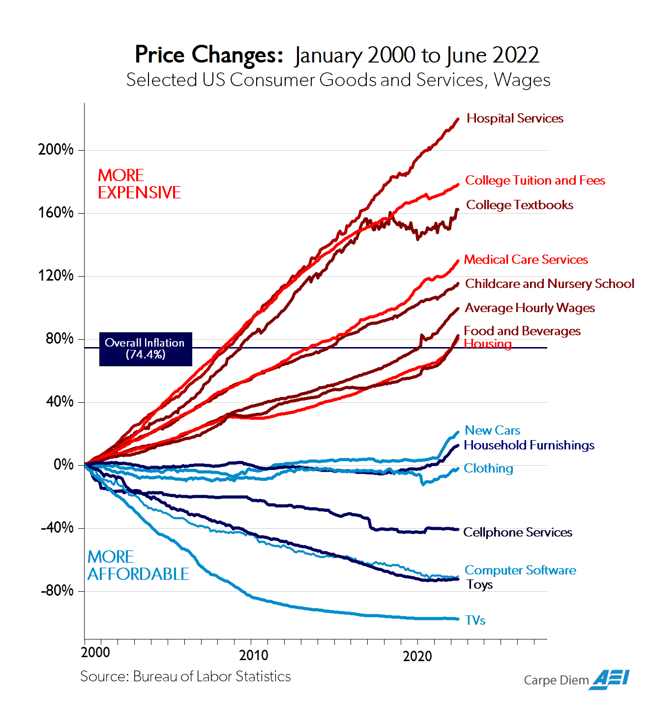
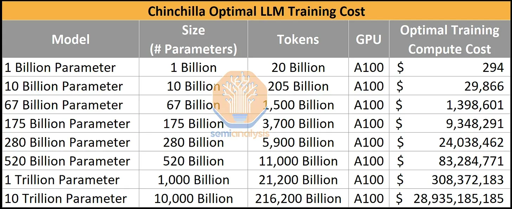
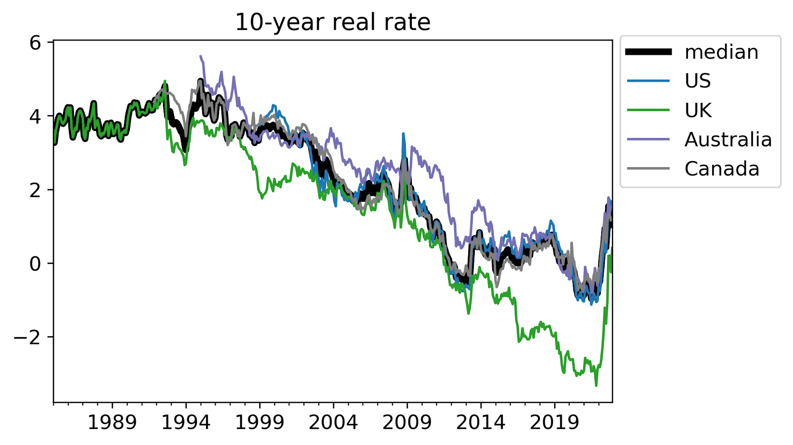

[All posts 所有帖子](https://zhengdongwang.com/blog)

2023-06-27 13:38 BST  

2023-06-27 13:38 英国夏令时

#### Joint with [Arjun Ramani](https://arjunramani.com/). Originally published in [The Gradient](https://thegradient.pub/why-transformative-artificial-intelligence-is-really-really-hard-to-achieve/).  

与阿琼·拉马尼联合。最初发表于《渐变》。

_A collection of the best technical, social, and economic arguments  

最佳技术、社会和经济论据的集合_

Humans have a good track record of innovation.  

人类有着良好的创新记录。  

The mechanization of agriculture, steam engines, electricity, modern medicine, computers, and the internet—these technologies radically changed the world.  

农业机械化、蒸汽机、电力、现代医学、计算机和互联网——这些技术从根本上改变了世界。  

Still, the trend growth rate of GDP per capita in the world’s frontier economy has [never exceeded three percent per year](https://www.nber.org/papers/w18315).  

尽管如此，世界前沿经济体的人均GDP趋势增长率从未超过每年3%。

It is of course possible for growth to accelerate.<a href="https://zhengdongwang.com/2023/06/27/why-transformative-ai-is-really-really-hard-to-achieve.html#fn:davidson" rel="footnote">1</a> There was time before [growth began](https://www.nber.org/papers/w28623), or at least when it was [far closer to zero](https://faculty.econ.ucdavis.edu/faculty/gclark/210a/readings/kremer1993.pdf). But the fact that past game-changing technologies have yet to break the three percent threshold gives us a baseline.  

当然，增长加速是可能的。 <a href="https://zhengdongwang.com/2023/06/27/why-transformative-ai-is-really-really-hard-to-achieve.html#fn:davidson" rel="footnote">1</a> 在增长开始之前还有一段时间，或者至少是在它远接近于零的时候。但过去改变游戏规则的技术尚未突破百分之三的门槛，这一事实给了我们一个基线。  

Only strong evidence should cause us to expect something hugely different.  

只有强有力的证据才能让我们期待一些截然不同的东西。

Yet many people are optimistic that artificial intelligence is up to the job. AI is different from prior technologies, they say, because it is _generally capable_—able to perform a much wider range of tasks than previous technologies, including the process of innovation itself. Some think it could lead to a “[Moore’s Law for everything](https://moores.samaltman.com/),” or even risks on [on par with those of pandemics and nuclear war](https://www.safe.ai/statement-on-ai-risk). Sam Altman shocked investors when he said that OpenAI would become profitable by first inventing general AI, and then [asking it how to make money](https://youtu.be/ebjkD1Om4uw?t=355). Demis Hassabis described DeepMind’s mission at Britain’s Royal Academy four years ago in two steps: “[1\. Solve Intelligence. 2. Use it to solve everything else.](https://youtu.be/d-bvsJWmqlc?t=203)”  

然而，许多人乐观地认为人工智能能够胜任这项工作。他们说，人工智能与现有技术不同，因为它通常能够执行比以前技术更广泛的任务，包括创新过程本身。一些人认为这可能会导致“一切事物的摩尔定律”，甚至带来与流行病和核战争同等的风险。 Sam Altman 表示，OpenAI 将通过首先发明通用人工智能，然后询问它如何赚钱来实现盈利，这令投资者感到震惊。四年前，Demis Hassabis 在英国皇家科学院描述了 DeepMind 的使命，分两步进行：“1. 解决智能问题。 2.用它来解决其他一切。”

This order of operations has powerful appeal.  

这种操作顺序具有强大的吸引力。

Should AI be set apart from other great inventions in history? Could it, as the great academics John Von Neumann and I.J.  

人工智能是否应该与历史上其他伟大的发明区分开来？正如伟大的学者约翰·冯·诺依曼 (John Von Neumann) 和 I.J.  

Good speculated, one day self-improve, cause an intelligence explosion, and lead to an economic growth singularity?  

很好的推测，有一天自我完善，引起智力爆炸，并导致经济增长奇点？

Neither this essay nor the economic growth literature rules out this possibility. Instead, our aim is to simply temper your expectations.  

本文和经济增长文献都没有排除这种可能性。相反，我们的目标只是降低您的期望。  

We think AI can be “transformative” in the same way the internet was, raising productivity and changing habits.  

我们认为人工智能可以像互联网一样具有“变革性”，提高生产力并改变习惯。  

But many daunting hurdles lie on the way to the accelerating growth rates predicted by some.  

但在实现一些人预测的加速增长的道路上还存在许多令人畏惧的障碍。

In this essay we assemble the best arguments for why transformative AI is hard to achieve. We are far from the first to suggest these points.  

在本文中，我们汇总了为什么变革性人工智能难以实现的最佳论据。我们并不是第一个提出这些观点的人。  

To avoid lengthening an already long piece, we often refer to the original sources instead of reiterating their arguments in depth.  

为了避免延长已经很长的文章，我们经常参考原始资料，而不是深入重申他们的论点。  

Our contribution is to organize a well-researched, multidisciplinary set of ideas others first advanced into a single integrated case. Here is a brief outline of our argument:  

我们的贡献是将其他人首先提出的一系列经过深入研究的多学科想法组织成一个综合案例。以下是我们的论点的简要概述：

1.  The transformational potential of AI is constrained by its hardest problems  
    
    人工智能的变革潜力受到其最困难问题的限制
2.  Despite rapid progress in some AI subfields, major technical hurdles remain  
    
    尽管一些人工智能子领域取得了快速进展，但主要的技术障碍仍然存在
3.  Even if technical AI progress continues, social and economic hurdles may limit its impact  
    
    即使人工智能技术继续进步，社会和经济障碍也可能会限制其影响

## 1\. The transformative potential of AI is constrained by its hardest problems  

1\. 人工智能的变革潜力受到其最棘手问题的限制

Visions of transformative AI start with a system that is as good as or better than humans at all economically valuable tasks.  

变革性人工智能的愿景始于一个在所有具有经济价值的任务上与人类一样好或更好的系统。  

A review from Harvard’s Carr Center for Human Rights Policy notes that many top AI labs [explicitly have this goal](https://ethics.harvard.edu/files/center-for-ethics/files/aifailsus.jhdcarr_final_2.pdf). Yet measuring AI’s performance on a predetermined set of tasks is risky—what if real world impact requires doing tasks we are not even aware of?  

哈佛大学卡尔人权政策中心的一篇评论指出，许多顶级人工智能实验室明确有这个目标。然而，衡量人工智能在一组预定任务上的表现是有风险的——如果现实世界的影响需要执行我们甚至不知道的任务怎么办？

Thus, we define transformative AI in terms of its observed economic impact.  

因此，我们根据观察到的经济影响来定义变革性人工智能。  

Productivity growth almost definitionally captures when a new technology efficiently performs useful work.  

生产力的增长几乎明确地体现了新技术何时有效地执行有用的工作。  

A powerful AI could one day perform all productive cognitive and physical labor. If it could automate the process of innovation itself, [some economic growth models](http://dxie.people.ust.hk/OnlineMacro/jonesjpe1995.pdf) predict that GDP growth would not just break three percent per capita per year—it would accelerate.  

有一天，强大的人工智能可以执行所有富有成效的认知和体力劳动。如果创新过程本身能够实现自动化，一些经济增长模型预测，人均 GDP 增长不仅会突破每年 3%，还会加速。

Such a world is hard to achieve. As the economist William Baumol [first](https://pages.stern.nyu.edu/~wbaumol/OnThePerformingArtsTheAnatomyOfTheirEcoProbs.pdf) [noted](https://www.jstor.org/stable/1812111) in the 1960s, productivity growth that is unbalanced may be constrained by the weakest sector.  

这样的世界是很难实现的。正如经济学家威廉·鲍莫尔 (William Baumol) 在 20 世纪 60 年代首次指出的那样，不平衡的生产率增长可能会受到最薄弱部门的限制。  

To illustrate this, consider a simple economy with two sectors, writing think-pieces and constructing buildings. Imagine that AI speeds up writing but not construction.  

为了说明这一点，请考虑一个包含两个部门的简单经济：撰写思想文章和建造建筑物。想象一下，人工智能可以加快写作速度，但不能加快构建速度。  

Productivity increases and the economy grows. However, a think-piece is not a good substitute for a new building.  

生产力提高，经济增长。然而，想法并不能很好地替代新建筑。  

So if the economy still demands what AI does not improve, like construction, those sectors become relatively more valuable and eat into the gains from writing.  

因此，如果经济仍然需要人工智能无法改善的领域，比如建筑业，那么这些行业就会变得相对更有价值，并侵蚀写作带来的收益。  

A 100x boost to writing speed may only lead to a 2x boost to the size of the economy.<a href="https://zhengdongwang.com/2023/06/27/why-transformative-ai-is-really-really-hard-to-achieve.html#fn:elasticity" rel="footnote">2</a>  

写入速度提高 100 倍可能只会导致经济规模增加 2 倍。 <a href="https://zhengdongwang.com/2023/06/27/why-transformative-ai-is-really-really-hard-to-achieve.html#fn:elasticity" rel="footnote">2</a>

This toy example is not all that different from the broad pattern of productivity growth over the past several decades. Eric Helland and Alex Tabarrok wield Baumol in their book [_Why Are the Prices So Damn High?_](https://www.mercatus.org/students/research/books/why-are-prices-so-damn-high) to explain how technology has boosted the productivity of sectors like manufacturing and agriculture, driving down the relative price of their outputs, like TVs and food, and raising average wages.  

这个玩具例子与过去几十年生产率增长的总体模式并没有太大不同。 Eric Helland 和 Alex Tabarrok 在他们的书《为什么价格这么高？》中使用了 Baumol。解释技术如何提高制造业和农业等部门的生产率，降低电视和食品等产出的相对价格，并提高平均工资。  

Yet TVs and food are not good substitutes for labor-intensive services like healthcare and education.  

然而，电视和食品并不能很好地替代医疗保健和教育等劳动密集型服务。  

Such services have remained important, just like constructing buildings, but have proven hard to make more efficient.  

此类服务仍然很重要，就像建造建筑物一样，但事实证明很难提高效率。  

So their relative prices have grown, taking up a larger share of our income and weighing on growth. [Acemoglu, Autor, and Patterson](https://www.nber.org/system/files/chapters/c14854/c14854.pdf) confirm using historical US economic data that uneven innovation across sectors has indeed slowed down aggregate productivity growth.<a href="https://zhengdongwang.com/2023/06/27/why-transformative-ai-is-really-really-hard-to-achieve.html#fn:bottlenecking" rel="footnote">3</a>  

因此，它们的相对价格已经上涨，占据了我们收入的更大份额，并拖累了经济增长。阿西莫格鲁、奥托尔和帕特森利用美国历史经济数据证实，各部门创新的不平衡确实减缓了总生产率的增长。 <a href="https://zhengdongwang.com/2023/06/27/why-transformative-ai-is-really-really-hard-to-achieve.html#fn:bottlenecking" rel="footnote">3</a>

The Baumol effect, visualized. [American Enterprise Institute](https://www.aei.org/carpe-diem/chart-of-the-day-or-century-8/) (2022)  

鲍莫尔效应，可视化。美国企业研究所（2022）

[Aghion, Jones, and Jones](https://www.nber.org/papers/w23928) explain that the production of ideas itself has steps which are vulnerable to bottlenecks.<a href="https://zhengdongwang.com/2023/06/27/why-transformative-ai-is-really-really-hard-to-achieve.html#fn:gustafson" rel="footnote">4</a> Automating _most_ tasks has very different effects on growth than automating _all_ tasks:  

阿吉翁、琼斯和琼斯解释说，创意的产生本身有一些容易遇到瓶颈的步骤。 <a href="https://zhengdongwang.com/2023/06/27/why-transformative-ai-is-really-really-hard-to-achieve.html#fn:gustafson" rel="footnote">4</a> 自动化大多数任务与自动化所有任务对增长的影响截然不同：

> _…economic growth may be constrained not by what we do well but rather by what is essential and yet hard to improve… When applied to a model in which AI automates the production of ideas, these same considerations can prevent explosive growth.  
> 
> ......经济增长可能不是受到我们做得好的事情的限制，而是受到必要但难以改进的事情的限制......当应用于人工智能自动产生想法的模型时，这些相同的考虑因素可以防止爆炸性增长。_

Consider a two-step innovation process that consists of summarizing papers on arXiv and pipetting fluids into test tubes. Each step depends on the other.  

考虑一个两步创新过程，包括总结 arXiv 上的论文和将液体移入试管。每个步骤都依赖于其他步骤。  

Even if AI automates summarizing papers, humans would still have to pipette fluids to write the next paper.  

即使人工智能能够自动总结论文，人类仍然需要吸取液体来撰写下一篇论文。  

(And in the real world, we would also need to wait for the IRB to approve our grants.) In “[What if we could automate invention](https://mattsclancy.substack.com/p/what-if-we-could-automate-invention),” Matt Clancy provides a final dose of intuition:  

（在现实世界中，我们还需要等待 IRB 批准我们的拨款。）在“如果我们能够实现发明自动化会怎样”中，马特·克兰西提供了最后的直觉：

> _Invention has started to resemble a class project where each student is responsible for a different part of the project and the teacher won’t let anyone leave until everyone is done… if we cannot automate everything, then the results are quite different.  
> 
> 发明开始类似于一个课堂项目，每个学生负责项目的不同部分，老师不会让任何人离开，直到每个人都完成......如果我们不能自动化一切，那么结果就会大不相同。  
> 
> We don’t get acceleration at merely a slower rate_—_we get no acceleration at all._  
> 
> 我们不仅仅以较慢的速度获得加速——我们根本没有获得加速。

Our point is that the idea of bottlenecking—featured everywhere from Baumol in the sixties to Matt Clancy today—deserves more airtime.<a href="https://zhengdongwang.com/2023/06/27/why-transformative-ai-is-really-really-hard-to-achieve.html#fn:clancy" rel="footnote">5</a> It makes clear why the hurdles to AI progress are _stronger together than they are apart_. AI must transform all essential economic sectors and steps of the innovation process, not just some of them.  

我们的观点是，瓶颈的想法——从六十年代的鲍莫尔到今天的马特·克兰西随处可见——值得更多的报道。 <a href="https://zhengdongwang.com/2023/06/27/why-transformative-ai-is-really-really-hard-to-achieve.html#fn:clancy" rel="footnote">5</a> 这清楚地表明了为什么人工智能进步的障碍在一起时比单独时更严重。人工智能必须改变所有重要的经济部门和创新过程的步骤，而不仅仅是其中的一些部门。  

Otherwise, the chance that we should view AI as similar to past inventions goes up.  

否则，我们认为人工智能与过去的发明相似的可能性就会增加。

Perhaps the discourse has lacked specific illustrations of hard-to-improve steps in production and innovation. Fortunately many examples exist.  

也许该论述缺乏对生产和创新中难以改进的步骤的具体说明。幸运的是，有很多例子。

## 2\. Despite rapid progress in some AI subfields, major technical hurdles remain  

2\. 尽管人工智能的一些子领域取得了快速进展，但主要的技术障碍仍然存在

**Progress in fine motor control has hugely lagged progress in neural language models.** [Robotics workshops ponder](https://evjang.com/2022/07/23/robotics-generative.html) what to do when “just a few cubicles away, progress in generative modeling feels qualitatively even more impressive.” [Moravec’s paradox](https://en.wikipedia.org/wiki/Moravec%27s_paradox) and [Steven Pinker’s 1994 observation](https://en.wikipedia.org/wiki/The_Language_Instinct) remain relevant: “The main lesson of thirty-five years of AI research is that the hard problems are easy and the easy problems are hard.” The hardest “easy” problems, like tying one’s shoelaces, remain.  

精细运动控制的进展远远落后于神经语言模型的进展。机器人研讨会思考当“就在几个隔间之外，生成模型的进展在质量上感觉更令人印象深刻”时该怎么办。 Moravec 的悖论和 Steven Pinker 1994 年的观察仍然具有相关性：“三十五年的人工智能研究的主要教训是，困难的问题很简单，简单的问题也很困难。”最难的“简单”问题，比如系鞋带，仍然存在。  

Do breakthroughs in robotics easily follow those in generative modeling? That OpenAI [disbanded its robotics team](https://venturebeat.com/business/openai-disbands-its-robotics-research-team/) is not a strong signal.  

机器人技术的突破很容易追随生成模型的突破吗？ OpenAI 解散其机器人团队并不是一个强烈的信号。

It seems highly unlikely to us that growth could greatly accelerate without progress in manipulating the physical world.  

在我们看来，如果在操纵物理世界方面没有取得进展，经济增长就不可能大幅加速。  

Many current economic bottlenecks, from housing and healthcare to manufacturing and transportation all have a sizable physical-world component.  

当前的许多经济瓶颈，从住房和医疗保健到制造和交通，都与物理世界有很大关系。

**The list of open research problems relevant to transformative AI continues.** Learning a causal model is one. [Ortega et al.](https://arxiv.org/abs/2110.10819) show a naive case where a sequence model that takes actions can experience delusions without access to a causal model.<a href="https://zhengdongwang.com/2023/06/27/why-transformative-ai-is-really-really-hard-to-achieve.html#fn:causality" rel="footnote">6</a> Embodiment is another. [Murray Shanahan views](https://www.doc.ic.ac.uk/~mpsha/ShanahanBook2010.pdf) cognition and having a body as inseparable: cognition exists for the body to survive and thrive, continually adjusts within a body’s sensorimotor loop, and is itself founded in physical affordances.  

与变革性人工智能相关的开放研究问题清单还在继续。学习因果模型就是其中之一。奥尔特加等人。展示了一个简单的案例，其中采取行动的序列模型可以在不访问因果模型的情况下经历妄想。 <a href="https://zhengdongwang.com/2023/06/27/why-transformative-ai-is-really-really-hard-to-achieve.html#fn:causality" rel="footnote">6</a> 实施例是另一个。默里·沙纳汉 (Murray Shanahan) 认为认知和拥有身体是密不可分的：认知的存在是为了身体的生存和发展，在身体的感觉运动循环中不断调整，并且认知本身建立在身体的可供性之上。  

Watching LeBron James on the court, we are inclined to agree. [François Chollet believes](https://arxiv.org/abs/1911.01547) efficiency is central, since “unlimited priors or experience can produce systems with little-to-no generalization power.” [Cremer and Whittlestone](http://lcfi.ac.uk/resources/canaries-technology-mines-warning-signs-transforma/) list even more problems on which technical experts do not agree.  

看着勒布朗·詹姆斯在球场上的表现，我们倾向于同意这一点。弗朗索瓦·乔莱 (François Chollet) 认为效率是核心，因为“无限的先验或经验可以产生几乎没有泛化能力的系统。”克雷默和惠特尔斯通列出了更多技术专家没有达成一致的问题。

More resources are not guaranteed to help. Ari Allyn-Feuer and Ted Sanders suggest in “[Transformative AGI by 2043 is <1% likely](https://arxiv.org/abs/2306.02519)” that walking and wriggling (neurological simulation of worms) are simple but still intractable indicator tasks: “And while worms are not a large market… we’ve comprehensively failed to make AI walkers, AI drivers, or AI radiologists despite massive effort.  

更多资源并不能保证有所帮助。 Ari Allyn-Feuer 和 Ted Sanders 在“到 2043 年实现变革性 AGI 的可能性 <1%”中指出，行走和蠕动（蠕虫的神经模拟）是简单但仍然棘手的指示任务：“虽然蠕虫不是一个大市场……但我们”尽管付出了巨大的努力，但我们还是未能制造出人工智能步行者、人工智能司机或人工智能放射科医生。  

This must be taken as a bearish signal.”  

这必须被视为一个看跌信号。”

We may not need to solve some or even all of these open problems. And we could certainly make more breakthroughs (one of us is directly working on some of these problems).  

我们可能不需要解决部分甚至全部这些悬而未决的问题。我们当然可以取得更多突破（我们中的一个人正在直接研究其中的一些问题）。  

But equally, we cannot yet definitively dismiss them, thus adding to our bottlenecks.  

但同样，我们还不能明确地消除它们，从而增加了我们的瓶颈。  

Until AI gains these missing capabilities, some of which even children have, it may be better to view them as tools that imitate and transmit culture, rather than as general intelligences, as [Yiu, Kosoy, and Gopnik](https://arxiv.org/abs/2305.07666) propose.  

在人工智能获得这些缺失的能力之前，其中一些甚至连儿童都具备，最好将它们视为模仿和传播文化的工具，而不是像 Yiu、Kosoy 和 Gopnik 所提出的那样，将其视为一般智能。

**Current methods may also not be enough.** Their limits may soon be upon us. Scaling compute another order of magnitude would require [hundreds of billions of dollars](https://www.semianalysis.com/p/the-ai-brick-wall-a-practical-limit) more spending on hardware.  

目前的方法可能还不够。他们的极限可能很快就会降临到我们身上。将计算规模再扩大一个数量级将需要在硬件上增加数千亿美元的支出。  

According to SemiAnalysis: “This is not practical, and it is also likely that models cannot scale to this scale, given current error rates and quantization estimates.” The continued falling cost of computation could help.  

SemiAnalysis 表示：“这是不切实际的，而且考虑到当前的错误率和量化估计，模型也可能无法扩展到这种规模。”计算成本的持续下降可能会有所帮助。

But we may have exhausted the low-hanging fruit in hardware optimization and are [now entering an era of deceleration](https://www.fromthenew.world/p/diminishing-returns-in-machine-learning). Moore’s Law has [persisted under various guises](https://www.semianalysis.com/p/a-century-of-moores-law), but the critical factor for transformative AI may be [whether we will reach it before Moore’s Law stops](https://nostalgebraist.tumblr.com/post/693718279721730048/on-bio-anchors).

  

但我们可能已经耗尽了硬件优化中唾手可得的成果，现在正在进入减速时代。摩尔定律以各种形式持续存在，但人工智能变革的关键因素可能是我们能否在摩尔定律停止之前实现这一目标。

Next look at data. [Villalobos et al.](https://arxiv.org/abs/2211.04325) warns that high quality language data may run out by 2026. The team suggests data efficiency and synthetic data as ways out, but so far these are far from complete solutions as [Shumailov et al.](https://arxiv.org/abs/2305.17493) shows.  

接下来看数据。维拉洛博斯等人。警告说，高质量的语言数据可能会在 2026 年耗尽。该团队建议将数据效率和合成数据作为出路，但到目前为止，这些还远远不是 Shumailov 等人提出的完整解决方案。显示。

In algorithms, our understanding of what current architectures can and _cannot_ do is improving. [Delétang et al.](https://arxiv.org/abs/2207.02098) and [Dziri et al.](https://arxiv.org/abs/2305.18654) identify particularly hard problems for the Transformer architecture. Some say that so-called emergent abilities of large language models could still surprise us. Not necessarily. [Schaeffer et al.](https://arxiv.org/abs/2304.15004) argues that emergence appears “due the researcher’s choice of metric rather than due to fundamental changes in model behavior with scale.” We must be careful when making claims about the irregularity of future capabilities.  

在算法方面，我们对当前架构能做什么、不能做什么的理解正在不断提高。德莱唐等人。和 Dziri 等人。识别 Transformer 架构的特别困难的问题。有人说，大型语言模型的所谓“涌现能力”仍然会让我们感到惊讶。不必要。谢弗等人。认为出现的出现“是由于研究人员对度量标准的选择，而不是由于模型行为随规模的根本变化”。在对未来能力的不规则性提出主张时，我们必须小心谨慎。  

It is telling that OpenAI [will not train GPT-5 for some time](https://www.wired.com/story/openai-ceo-sam-altman-the-age-of-giant-ai-models-is-already-over/). Perhaps they realize that good old-fashioned human tinkering is more appetizing than a free lunch of scale.  

这表明 OpenAI 在一段时间内不会训练 GPT-5。也许他们意识到，老式的人类修补比大规模的免费午餐更令人胃口大开。

Scaling up would be expensive. SemiAnalysis, "[The AI Brick Wall](https://www.semianalysis.com/p/the-ai-brick-wall-a-practical-limit)—[A Practical Limit For Scaling Dense Transformer Models, and How GPT 4 Will Break Past It](https://www.semianalysis.com/p/the-ai-brick-wall-a-practical-limit)" (2023)  

扩大规模的成本会很高。 SemiAnalysis，“AI 砖墙——扩展密集变压器模型的实际限制，以及 GPT 4 将如何突破它”(2023)

**Humans remain a limiting factor in development.** Human feedback makes AI outputs more helpful. Insofar as AI development requires human input, humans will constrain productivity. [Millions of humans](https://www.theverge.com/features/23764584/ai-artificial-intelligence-data-notation-labor-scale-surge-remotasks-openai-chatbots) currently annotate data to train models. Their humanity, especially their expert knowledge and creative spark, becomes more valuable by the day. _The Verge_ reports: “One engineer told me about buying examples of Socratic dialogues for up to $300 a pop.”  

人类仍然是发展的限制因素。人类反馈使人工智能输出更有帮助。只要人工智能的发展需要人类的投入，人类就会限制生产力。目前有数百万人对数据进行注释来训练模型。他们的人性，尤其是他们的专业知识和创造力，变得越来越有价值。 The Verge 报道称：“一位工程师告诉我，他可以花 300 美元购买苏格拉底式对话的示例。”

That is unlikely to change anytime soon. Geoffrey Irving and Amanda Askell [advocate for a bigger role for humans](https://distill.pub/2019/safety-needs-social-scientists/): “Since we are trying to behave in accord with people’s values, the most important data will be data from humans about their values.” Constitutional AI, a state-of-the-art alignment technique that has even [reached the steps of Capitol Hill](https://www.c-span.org/video/?528117-1/openai-ceo-testifies-artificial-intelligence), also [does not aim to remove humans](https://arxiv.org/abs/2212.08073) from the process at all: “rather than removing human supervision, in the longer term our goal is to make human supervision as efficacious as possible.” Even longer-term scalable alignment proposals, such as [running AI debates with human judges](https://arxiv.org/abs/1805.00899), entrenches rather than removes human experts. Both technical experts and the public seem to want to keep humans in the loop.  

这种情况不太可能很快改变。杰弗里·欧文和阿曼达·阿斯克尔主张人类发挥更大的作用：“由于我们试图按照人们的价值观行事，因此最重要的数据将是来自人类的有关其价值观的数据。”宪政人工智能是一种最先进的对齐技术，甚至已经达到了国会山的台阶，它根本无意将人类从这一过程中剔除：“从长远来看，我们的目标不是消除人类监督，而是使人类监督尽可能有效。”即使是长期可扩展的协调提案，例如与人类法官进行人工智能辩论，也会巩固而不是消除人类专家。技术专家和公众似乎都希望让人类了解情况。

Intelligence, embodied. Source: Morri Gash, AP.  

智慧，体现。资料来源：莫里·加什，美联社。

**A big share of human knowledge is tacit, unrecorded, and diffuse.** As [Friedrich Hayek declared](https://www.econlib.org/library/Essays/hykKnw.html), “To assume all the knowledge to be given to a single mind… is to assume the problem away and to disregard everything that is important and significant in the real world.” [Michael Polanyi argued](https://press.uchicago.edu/ucp/books/book/chicago/T/bo6035368.html): “that we can know more than we can tell.” [Carlo Ginzburg concurred](https://www.jstor.org/stable/4288283): “Nobody learns how to be a connoisseur or a diagnostician simply by applying the rules.  

人类知识有很大一部分是隐性的、未记录的和分散的。正如弗里德里希·哈耶克（Friedrich Hayek）所说：“假设所有知识都被赋予一个人……就是假设问题消失，并忽视现实世界中所有重要和有意义的事情。”迈克尔·波兰尼 (Michael Polanyi) 认为：“我们能知道的比我们能说的还要多。”卡洛·金兹伯格（Carlo Ginzburg）表示同意：“没有人仅仅通过应用规则就能学会如何成为鉴赏家或诊断专家。  

With this kind of knowledge there are factors in play which cannot be measured: a whiff, a glance, an intuition.” Finally, [Dan Wang, concretely](https://danwang.co/how-technology-grows/):  

有了这种知识，就有一些无法衡量的因素在起作用：一闻、一眼、直觉。”最后，王丹具体说：

> _Process knowledge is the kind of knowledge that’s hard to write down as an instruction.  
> 
> 过程知识是一种很难写成指令的知识。  
> 
> You can give someone a well-equipped kitchen and an extraordinarily detailed recipe, but unless he already has some cooking experience, we shouldn’t expect him to prepare a great dish.  
> 
> 你可以给某人一个设备齐全的厨房和一份非常详细的菜谱，但除非他已经有一定的烹饪经验，否则我们不应该指望他能准备出一道美味的菜肴。_

Ilya Sutskever [recently suggested asking an AI](https://www.dwarkeshpatel.com/p/ilya-sutskever#details) “What would a person with great insight, wisdom, and capability do?” to surpass human performance.  

Ilya Sutskever 最近建议询问人工智能“一个具有伟大洞察力、智慧和能力的人会做什么？”超越人类的表现。  

Tacit knowledge is why we think this is unlikely to work out-of-the-box in many important settings. It is why we may need to deploy AI in the real world where it can learn-by-doing.  

隐性知识是我们认为这在许多重要设置中不太可能开箱即用的原因。这就是为什么我们可能需要在现实世界中部署人工智能，让它可以边做边学。

Yet it is hard for us to imagine this happening in several cases, especially high-stakes ones like running a multinational firm or [teaching a child to swim](https://forum.effectivealtruism.org/posts/ARkbWch5RMsj6xP5p/transformative-agi-by-2043-is-less-than-1-likely?commentId=WQF8aHKDn5MFnfoQS).

  

然而，我们很难想象这种情况会在某些情况下发生，尤其是像经营跨国公司或教孩子游泳这样高风险的情况。

We are constantly surprised in our day jobs as a journalist and AI researcher by how many questions do not have good answers on the internet or in books, but where _some_ expert has a solid answer that they had not bothered to record.  

作为一名记者和人工智能研究人员，我们在日常工作中经常感到惊讶，有多少问题在互联网或书籍上没有很好的答案，但有些专家却有他们没有费心记录的可靠答案。  

And in some cases, as with a master chef or LeBron James, they may not even be capable of making legible how they do what they do.  

在某些情况下，就像大厨或勒布朗·詹姆斯一样，他们甚至可能无法清晰地表达他们的工作方式。

The idea that diffuse tacit knowledge is pervasive supports the hypothesis that there are [diminishing](https://aiimpacts.org/counterarguments-to-the-basic-ai-x-risk-case/) [returns](https://www.richardhanania.com/p/can-a-paperclip-maximizer-overthrow) to pure, centralized, cerebral intelligence. Some problems, like [escaping game-theoretic quagmires](https://arxiv.org/abs/2305.16867) or [predicting the future](https://danluu.com/futurist-predictions/), might be just too hard for brains alone, whether biological or artificial.  

分散的隐性知识普遍存在的观点支持了这样的假设：纯粹的、集中的大脑智能的收益递减。有些问题，比如逃离博弈论的泥潭或预测未来，仅靠大脑来说可能太难了，无论是生物的还是人工的。

**We could be headed off in the wrong direction altogether.** If even some of our hurdles prove insurmountable, then we may be far from the critical path to AI that can do all that humans can. Melanie Mitchell quotes Stuart Dreyfus in “[Why AI is Harder Than We Think](https://arxiv.org/abs/2104.12871)”: “It was like claiming that the first monkey that climbed a tree was making progress towards landing on the moon.”  

我们可能会完全走错方向。如果我们的某些障碍被证明是无法克服的，那么我们可能距离实现人类所能做的一切人工智能的关键道路还很遥远。梅兰妮·米切尔 (Melanie Mitchell) 在《为什么人工智能比我们想象的更难》中引用斯图尔特·德雷福斯 (Stuart Dreyfus) 的话：“这就像声称第一只爬树的猴子正在朝着登陆月球的方向取得进展。”

We still struggle to concretely specify what we are trying to build. We have little understanding of the nature of intelligence or humanity.  

我们仍然很难具体说明我们正在尝试构建什么。我们对智能或人性的本质知之甚少。  

Relevant philosophical problems, such as the grounds of moral status, qualia, and personal identity, have stumped humans for thousands of years.  

相关的哲学问题，例如道德地位、感受性和个人身份的依据，已经困扰了人类数千年。  

Just days before this writing, neuroscientist Christof Koch [lost a quarter-century bet](https://www.nature.com/articles/d41586-023-02120-8) to philosopher David Chalmers that we would have discovered how the brain achieves consciousness by now.  

就在撰写本文的前几天，神经科学家克里斯托夫·科赫（Christof Koch）输掉了与哲学家大卫·查尔默斯（David Chalmers）打的四分之一个世纪的赌注，赌注是我们现在已经发现了大脑如何实现意识。

Thus, we are throwing dice into the dark, betting on our best hunches, which some believe produce only [stochastic parrots](https://en.wikipedia.org/wiki/Stochastic_parrot). Of course, these hunches are still worth pursuing; Matt Botvinick explores in depth [what current progress can tell us about ourselves](https://medium.com/@matthew.botvinick/have-we-lost-our-minds-86d9125bd803). But our lack of understanding should again moderate our expectations. In a [prescient opinion a decade ago](https://www.theguardian.com/science/2012/oct/03/philosophy-artificial-intelligence), David Deutsch stressed the importance of specifying the exact functionality we want:  

因此，我们在黑暗中掷骰子，押注于我们最好的预感，有些人认为这只会产生随机的鹦鹉学舌。当然，这些预感仍然值得追求。马特·博特维尼克深入探讨了当前的进展可以告诉我们关于我们自己的哪些信息。但我们缺乏理解应该再次降低我们的期望。十年前，David Deutsch 提出了一个有先见之明的观点，强调了指定我们想要的确切功能的重要性：

> _The very term “AGI” is an example of one such rationalization, for the field used to be called “AI”_— _artificial intelligence.  
> 
> But AI was gradually appropriated to describe all sorts of unrelated computer programs such as game players, search engines and chatbots, until the G for “general” was added to make it possible to refer to the real thing again, but now with the implication that an AGI is just a smarter species of chatbot.  
> 
> 但人工智能逐渐被用来描述各种不相关的计算机程序，如游戏玩家、搜索引擎和聊天机器人，直到添加了“一般”的G，使其可以再次指代真实的事物，但现在的含义是AGI 只是一种更聪明的聊天机器人。_  
> 
> “AGI”一词就是此类合理化的一个例子，因为该领域过去被称为“AI”——人工智能。

A decade ago! 十年前！

## 3\. Even if technical AI progress continues, social and economic hurdles may limit its impact  

3\. 即使人工智能技术持续进步，社会和经济障碍也可能限制其影响

**The history of economic transformation is one of contingency.** Many factors must come together all at once, rather than one factor outweighing all else.  

经济转型的历史就是一部偶然性的历史。许多因素必须同时结合在一起，而不是一个因素压倒一切。  

Individual technologies only matter to the extent that institutions permit their adoption, incentivize their widespread deployment, and allow for broad-scale social reorganization around the new technology.  

个别技术只有在机构允许其采用、激励其广泛部署并允许围绕新技术进行大规模社会重组的情况下才重要。

A whole subfield studies the Great Divergence, how Europe overcame pre-modern growth constraints. Technological progress is just one factor. Kenneth Pommeranz, in his influential [eponymous book](https://press.princeton.edu/books/paperback/9780691217185/the-great-divergence), argues also for luck, including a stockpile of coal and convenient geography. Taisu Zhang emphasizes social hierarchies in [_The Laws and Economics of Confucianism_](https://www.cambridge.org/core/books/laws-and-economics-of-confucianism/BA3645FFA9C819F9AAEE069A1CE87788). Jürgen Osterhammel in [_The Transformation of the World_](https://press.princeton.edu/books/paperback/9780691169804/the-transformation-of-the-world) attributes growth in the 19th century to mobility, imperial systems, networks, and much more beyond mere industrialization: “it would be unduly reductionist to present \[the organization of production and the creation of wealth\] as independent variables and as the only sources of dynamism propelling the age as a whole… it is time to decenter the Industrial Revolution.”  

整个子领域研究“大分流”，即欧洲如何克服前现代增长的限制。技术进步只是因素之一。肯尼思·波美兰（Kenneth Pommeranz）在他颇具影响力的同名书中也主张运气，包括煤炭库存和便利的地理位置。张太苏在《儒家法经》中强调社会等级制度。尤尔根·奥斯特哈梅尔 (Jürgen Osterhammel) 在《世界的转型》中将 19 世纪的增长归因于流动性、帝国体系、网络以及不仅仅是工业化的其他因素：“将 \[生产组织和财富创造\] 视为独立的存在是过分简化的。作为推动整个时代的唯一动力来源……现在是工业革命去中心化的时候了。”

All agree that history is not inevitable. We think this applies to AI as well.  

所有人都同意，历史并非不可避免。我们认为这也适用于人工智能。  

Just as we should be skeptical of a Great Man theory of history, we should not be so quick to jump to a Great Technology theory of growth with AI.  

正如我们应该对伟人的历史理论持怀疑态度一样，我们也不应该那么快地跳到关于人工智能增长的伟大技术理论。

And important factors may not be on AI’s side. Major drivers of growth, including [demographics](https://www.economist.com/briefing/2023/05/30/its-not-just-a-fiscal-fiasco-greying-economies-also-innovate-less) and [globalization](https://www.economist.com/leaders/2023/01/12/the-destructive-new-logic-that-threatens-globalisation), are going backwards. AI progress may even be [accelerating the decoupling](https://www.economist.com/business/2023/05/09/just-how-good-can-china-get-at-generative-ai) of the US and China, reducing the flow of people and ideas.  

重要的因素可能并不站在人工智能一边。包括人口结构和全球化在内的主要增长驱动力正在倒退。人工智能的进步甚至可能加速中美脱钩，减少人员和思想的流动。

**AI may not be able to automate precisely the sectors most in need of automation.** We already “know” how to overcome many major constraints to growth, and have the technology to do so.  

人工智能可能无法精确地实现最需要自动化的部门的自动化。我们已经“知道”如何克服许多主要的增长限制，并且拥有这样做的技术。  

Yet social and political barriers slow down technology adoption, and sometimes halt it entirely. The same could happen with AI.  

然而，社会和政治障碍减缓了技术的采用，有时甚至完全阻止了技术的采用。人工智能也可能发生同样的情况。

[Comin and Mestieri](https://pubs.aeaweb.org/doi/pdfplus/10.1257/mac.20150175) observe that cross-country variation in the intensity of use for new technologies explains a large portion of the variation in incomes in the twentieth century. Despite the [dream in 1954](https://www.nrc.gov/docs/ML1613/ML16131A120.pdf) that nuclear power would cause electricity to be “too cheap to meter,” nuclear’s share of global primary energy consumption [has been stagnant since the 90s](https://ourworldindata.org/nuclear-energy#what-share-of-primary-energy-comes-from-nuclear). Commercial supersonic flight is [outright banned in US airspace](https://www.elidourado.com/p/50-years-supersonic-ban). Callum Williams [provides more visceral examples](https://www.economist.com/finance-and-economics/2023/05/07/your-job-is-probably-safe-from-artificial-intelligence):  

科明和梅斯蒂里观察到，新技术使用强度的跨国差异解释了二十世纪收入差异的很大一部分。尽管 1954 年人们梦想核电将使电力“便宜得无法计量”，但自 20 世纪 90 年代以来，核电在全球一次能源消费中的份额一直停滞不前。美国领空完全禁止商业超音速飞行。卡勒姆·威廉姆斯提供了更直观的例子：

> _Train drivers on London’s publicly run Underground network are paid close to twice the national median, even though the technology to partially or wholly replace them has existed for decades.  
> 
> 伦敦公共运营的地铁网络上的火车司机的薪酬接近全国中位数的两倍，尽管部分或全部取代他们的技术已经存在了几十年。  
> 
> Government agencies require you to fill in paper forms providing your personal information again and again.  
> 
> 政府机构要求您一次又一次填写纸质表格，提供您的个人信息。  
> 
> In San Francisco, the global center of the AI surge, real-life cops are still employed to direct traffic during rush hour.  
> 
> 在全球人工智能浪潮中心旧金山，现实生活中的警察仍在高峰时段指挥交通。_

King Charles operating the London tube. Source: [The Independent](https://www.independent.co.uk/life-style/royal-family/king-charles-camilla-tube-message-b2333005.html)  

查尔斯国王经营伦敦地铁。资料来源：独立报

Marc Andreessen, hardly a techno-pessimist, [puts it bluntly](https://pmarca.substack.com/p/why-ai-wont-cause-unemployment): “I don’t even think the standard arguments are needed… AI is already illegal for most of the economy, and will be for virtually all of the economy. How do I know that?  

马克·安德森 (Marc Andreessen) 并不是一个技术悲观主义者，他直言不讳地说：“我什至认为不需要标准论据……人工智能对于大多数经济体来说已经是非法的，而且对于几乎所有经济体来说都将是非法的。我怎么知道呢？  

Because technology is already illegal in most of the economy, and that is becoming steadily more true over time.” [Matt Yglesias](https://www.slowboring.com/p/im-skeptical-that-powerful-ai-will) and [Eli Dourado](https://www.elidourado.com/p/heretical-thoughts-on-ai) are skeptical that AI will lead to a growth revolution, pointing to regulation and complex physical processes in sectors including housing, energy, transportation, and healthcare.  

因为技术在大多数经济领域已经是非法的，而且随着时间的推移，这种情况正变得越来越真实。”马特·伊格莱西亚斯（Matt Yglesias）和伊莱·多拉多（Eli Dourado）对人工智能是否会引发增长革命持怀疑态度，他们指出住房、能源、交通和医疗保健等领域的监管和复杂的物理过程。  

These happen to be our current growth bottlenecks, and together they [make up over a third of US GDP](https://apps.bea.gov/iTable/?reqid=150&step=2&isuri=1&categories=gdpxind#eyJhcHBpZCI6MTUwLCJzdGVwcyI6WzEsMiwzLDNdLCJkYXRhIjpbWyJjYXRlZ29yaWVzIiwiR2RweEluZCJdLFsiVGFibGVfTGlzdCIsIjUiXSxbIlNjYWxlIiwiMiJdLFsiRmlyc3RfWWVhciIsIjE5OTciXSxbIkxhc3RfWWVhciIsIjIwMjIiXSxbIlJvd3MiLFsiMjJSIiwiMyIsIjQiLCI1IiwiNiIsIjciLCI4IiwiOSIsIjEwIiwiMTEiLCIxMiIsIjEzIiwiMTQiLCIxNSIsIjE2IiwiMTciLCIxOCIsIjE5IiwiMjAiLCIyMSIsIjIyIiwiMjMiLCIyNCIsIjI1IiwiMjYiLCIyNyIsIjI4IiwiMjkiLCIzMCIsIjMxIiwiMzIiLCIzMyIsIjM0IiwiMzUiLCIzNiIsIjM3IiwiMzgiLCIzOSIsIjQwIiwiNDEiLCI0MiIsIjQzIiwiNDQiLCI0NSIsIjQ2IiwiNDciLCI0OCIsIjQ5IiwiNTAiLCI1MSIsIjUyIiwiNTMiLCI1NCIsIjU1IiwiNTYiLCI1NyIsIjU4IiwiNTkiLCI2MCIsIjYxIiwiNjIiLCI2MyIsIjY0IiwiNjUiLCI2NiIsIjY3IiwiNjgiLCI2OSIsIjcwIiwiNzEiLCI3MiIsIjczIiwiNzQiLCI3NSIsIjc2IiwiNzciLCI3OCIsIjc5IiwiODAiLCI4MSIsIjgyIiwiODMiLCI4NCIsIjg1IiwiODYiLCI4NyIsIjg4IiwiODkiLCI5MCIsIjkxIiwiOTIiLCI5MyIsIjk0IiwiOTUiLCI5NiIsIjk3IiwiOTgiLCI5OSIsIjEwMCIsIjEwMSIsIjEwMiIsIjEwMyJdXSxbIlNlcmllcyIsIkEiXSxbIkNvbHVtbnMiLFsiMyJdXV19).  

这些恰好是我们当前的增长瓶颈，它们合计占美国GDP的三分之一以上。

AI may even decrease productivity. One of its current largest use cases, recommender systems for social media, is [hardly a productivity windfall](https://www.theatlantic.com/magazine/archive/2022/05/social-media-democracy-trust-babel/629369/). [Callum Williams continues](https://www.economist.com/finance-and-economics/2023/05/07/your-job-is-probably-safe-from-artificial-intelligence):  

人工智能甚至可能会降低生产力。目前最大的用例之一是社交媒体推荐系统，这很难说是生产力上的意外收获。卡勒姆·威廉姆斯继续说道：

> _GPT-4 is a godsend for a NIMBY facing a planning application. In five minutes he can produce a well written 1,000-page objection.  
> 
> GPT-4 对于面临规划申请的邻避者来说是天赐之物。五分钟之内他就能写出一份长达 1000 页的书面反对意见。  
> 
> Someone then has to respond to it… lawyers will multiply.  
> 
> 然后必须有人对此做出回应……律师将会成倍增加。  
> 
> “In the 1970s you could do a multi-million-dollar deal on 15 pages because retyping was a pain in the ass,” says Preston Byrne of Brown Rudnick, a law firm.  
> 
> “在 20 世纪 70 年代，你可以在 15 页上完成一笔价值数百万美元的交易，因为重新打字是一件很痛苦的事情，”Brown Rudnick 律师事务所的普雷斯顿·伯恩 (Preston Byrne) 说道。  
> 
> “AI will allow us to cover the 1,000 most likely edge cases in the first draft and then the parties will argue over it for weeks.”  
> 
> “人工智能将使我们能够在初稿中涵盖 1,000 个最有可能的边缘情况，然后各方将为此争论数周。”_

**Automation alone is not enough for transformative economic growth.** History is littered with so-so technologies that have had little transformative impact, as Daron Acemoglu and Simon Johnson note in their new book [_Power and Progress_](https://www.hachettebookgroup.com/titles/daron-acemoglu/power-and-progress/9781541702530/?lens=publicaffairs). Fast-food kiosks are hardly a game-changer compared to human employees. Nobel laureate Robert Fogel documented that in the same way, [railroads had little impact](https://www.jstor.org/stable/2114353?mag=world-flat-columbus-fallen-edge-earth&seq=1) on growth because they were only a bit better than their substitutes, canals and roads.  

仅自动化不足以实现变革性的经济增长。正如达伦·阿西莫格鲁和西蒙·约翰逊在他们的新书《权力与进步》中指出的那样，历史上充斥着几乎没有带来变革性影响的马马虎虎的技术。与人类员工相比，快餐亭很难改变游戏规则。诺贝尔奖获得者罗伯特·福格尔证明，同样，铁路对经济增长的影响很小，因为它们只比其替代品运河和公路好一点。  

Many immediate applications of large language models, from customer service to writing marketing copy, appear similar.<a href="https://zhengdongwang.com/2023/06/27/why-transformative-ai-is-really-really-hard-to-achieve.html#fn:brynjolfsson" rel="footnote">7</a>  

大型语言模型的许多直接应用，从客户服务到撰写营销文案，看起来都很相似。 <a href="https://zhengdongwang.com/2023/06/27/why-transformative-ai-is-really-really-hard-to-achieve.html#fn:brynjolfsson" rel="footnote">7</a>

OpenAI’s [own economists estimate](https://arxiv.org/abs/2303.10130) that about “19% of jobs have at least 50% of their tasks exposed” to GPT-4 and the various applications that may be built upon it. Some view this as game-changing.  

OpenAI 自己的经济学家估计，大约“19% 的工作岗位至少有 50% 的任务”暴露于 GPT-4 以及可能基于其构建的各种应用程序。一些人认为这会改变游戏规则。  

We would reframe it. That means over 80% of workers would have less than 50% of their tasks affected, hardly close to full automation.  

我们会重新构建它。这意味着超过 80% 的工人只有不到 50% 的任务受到影响，几乎没有接近完全自动化。  

And their methodology suggests that areas where reliability is essential will remain unaffected for some time.  

他们的方法表明，可靠性至关重要的领域将在一段时间内不受影响。

The long tail. James Bridle, “[Autonomous trap 001](https://jamesbridle.com/works/autonomous-trap-001)” (2017)  

长尾巴。詹姆斯·布莱德尔（James Bridle），《自主陷阱 001》（2017）

It is telling that though the investment services sector is digitized, data is ubiquitous, and many individual tasks are automated, [overall employment has increased](https://data.bls.gov/timeseries/CES5552300001?amp%253bdata_tool=XGtable&output_view=data&include_graphs=true). Similarly, despite [predictions that AI will replace radiologists](https://www.youtube.com/watch?v=2HMPRXstSvQ) (Hinton: “stop training radiologists now”), radiology job postings [hit a record high in 2021](https://blog.vrad.com/2022-radiologist-job-market-update-rrc) and is projected to increase even more. Allyn-Feuer and Sanders [reviewed 31 predictions](https://arxiv.org/abs/2306.02519) of self-driving by industry insiders since 1960. The 27 resolved predictions were all wrong. Eight were by Elon Musk.  

很能说明问题的是，尽管投资服务业已经数字化，数据无处不在，许多个人任务都实现了自动化，但整体就业却有所增加。同样，尽管预测人工智能将取代放射科医生（Hinton：“现在停止培训放射科医生”），但放射科职位发布在 2021 年创下历史新高，并且预计还会增加更多。 Allyn-Feuer 和 Sanders 回顾了 1960 年以来业内人士对自动驾驶的 31 个预测。其中 27 个已解决的预测全部是错误的。八个是埃隆·马斯克的。  

In all these cases, AI faces the challenge of automating the “long tail” of tasks that are not present in the training data, not always legible, or too high-stakes to deploy.  

在所有这些情况下，人工智能都面临着自动化“长尾”任务的挑战，这些任务不存在于训练数据中，并不总是清晰易读，或者部署风险过高。

**A big share of the economy may already consist of producing output that is profoundly social in nature.** Even if AI can automate all production, we must still decide what to produce, which is a social process. As [Hayek once implied](https://plato.stanford.edu/entries/friedrich-hayek/#PlanOrdeInfe), central planning is hard not only because of its computational cost, but also due to a “lack of _access_ to information… the information does not exist.” A possible implication is that humans must actively participate in business, politics, and society to determine how they want society to look.  

经济的很大一部分可能已经由生产本质上具有深刻社会性的产出组成。即使人工智能可以实现所有生产的自动化，我们仍然必须决定生产什么，这是一个社会过程。正如哈耶克曾经暗示的那样，中央计划之所以困难，不仅因为其计算成本，还因为“缺乏获取信息的途径……信息不存在”。一个可能的含义是，人类必须积极参与商业、政治和社会，以确定他们希望社会是什么样子。

Education may be largely about motivating students, and teaching them to [interact socially](https://www.nytimes.com/2022/09/01/opinion/us-school-history.html), rather than just transmitting facts. Much of the value of art comes from its [social context](https://www.science.org/doi/10.1126/science.adh4451). Healthcare combines emotional support with more functional diagnoses and prescriptions. Superhuman AI can hardly claim full credit for [the](https://www.theguardian.com/sport/2020/nov/29/chess-world-hails-queens-gambit-fuelled-boom) [resurgence](https://www.nytimes.com/2021/11/22/sports/magnus-carlsen-chess.html) [of](https://en.wikipedia.org/wiki/PogChamps) [chess](https://qz.com/the-hans-niemann-cheating-mystery-might-be-exactly-what-1849627074). And business is about framing goals and negotiating with, managing, and motivating humans.  

教育可能主要是为了激励学生并教他们进行社交互动，而不仅仅是传播事实。艺术的大部分价值来自其社会背景。医疗保健将情感支持与更多功能性诊断和处方结合起来。超人人工智能很难将国际象棋的复兴归功于全部。商业就是制定目标、与人谈判、管理和激励人。  

Maybe our jobs today are already not that different from figuring out what prompts to ask and how to ask them.  

也许我们今天的工作已经与弄清楚提示什么问题以及如何提出问题没有什么不同。

There is a deeper point here. GDP is a made-up measure of how much some humans value what others produce, a big chunk of which involves doing social things amongst each other. [As one of us recently wrote](https://www.economist.com/finance-and-economics/2023/05/23/what-would-humans-do-in-a-world-of-super-ai), we may value human-produced outputs precisely because they are scarce.  

这里还有更深层次的一点。 GDP 是衡量一些人对其他人的生产成果的重视程度的一个虚构指标，其中很大一部分涉及到彼此之间的社交活动。正如我们中的一位最近所写的，我们之所以重视人类生产的产出，正是因为它们是稀缺的。  

As long as AI-produced outputs cannot substitute for that which is social, and therefore scarce, such outputs will command a growing “human premium,” and produce Baumol-style effects that weigh on growth.  

只要人工智能产生的产出无法取代社会产出，因此稀缺，这些产出就会要求不断增长的“人类溢价”，并产生鲍莫尔式的影响，从而拖累经济增长。

## How should we consider AI in light of these hurdles?  

鉴于这些障碍，我们应该如何看待人工智能？

AI progress is bound to continue and we are only starting to feel its impacts. We are hopeful for further breakthroughs from more reliable algorithms to better policy.  

人工智能的进步必将继续，而我们才刚刚开始感受到它的影响。我们希望从更可靠的算法到更好的政策取得进一步突破。  

AI has certainly surprised us before.  

人工智能之前确实让我们感到惊讶。

Yet as this essay has outlined, myriad hurdles stand in the way of widespread transformative impact. These hurdles should be viewed _collectively_. Solving a subset may not be enough. Solving them all is a combinatorially harder problem. Until then, we cannot look to AI to clear hurdles we do not know how to clear ourselves.  

然而，正如本文所概述的那样，无数的障碍阻碍了广泛的变革性影响。这些障碍应该被放在一起来看待。解决子集可能还不够。解决所有这些问题是一个组合起来更困难的问题。在那之前，我们不能指望人工智能来清除我们自己不知道如何清除的障碍。  

We should also not take future breakthroughs as guaranteed—we may get them tomorrow, or not for a very long time.  

我们也不应该认为未来的突破是有保证的——我们可能明天就能实现，也可能在很长一段时间内都不会实现。

The most common reply we have heard to our arguments is that AI research itself could soon be automated.  

对于我们的论点，我们听到的最常见的答复是人工智能研究本身很快就会实现自动化。  

AI progress would then explode, begetting a powerful intelligence that would solve the other hurdles we have laid out.  

人工智能的进步将会爆发，产生强大的智能，解决我们所设置的其他障碍。

But that is a narrow path to tread.  

但这是一条狭窄的道路。  

Though AI research has made remarkable strides of late, many of our hurdles to transformation at large apply to the process of automating AI research itself.  

尽管人工智能研究最近取得了显着的进步，但我们转型的许多障碍普遍存在于人工智能研究本身的自动化过程中。  

And even if we develop highly-intelligent machines, that is hardly all that is needed to automate the entirety of research and development, let alone the entire economy.  

即使我们开发出高度智能的机器，这也不足以实现整个研发的自动化，更不用说整个经济的自动化了。  

To build an intelligence that can solve everything else, we may need to solve that same everything else in the first place.  

为了建立一个可以解决其他所有问题的智能，我们可能需要首先解决其他所有问题。

So the case that AI will be an invention elevated far above the rest is not closed.  

因此，人工智能将成为一项远远高于其他发明的发明的情况还没有结束。  

Perhaps we should best think of it as a “prosaic” history-altering technology, one that catalyzes growth on the order of great inventions that have come before.  

也许我们最好将其视为一种“平淡无奇”的改变历史的技术，一种能够促进之前伟大发明的增长的技术。  

We return to the excellent [Aghion, Jones, and Jones](https://www.nber.org/papers/w23928):  

我们回到优秀的阿吉翁、琼斯和琼斯：

> _…we model A.I. as the latest form in a process of automation that has been ongoing for at least 200 years.  
> 
> ……我们为人工智能建模作为已经持续了至少 200 年的自动化过程的最新形式。  
> 
> From the spinning jenny to the steam engine to electricity to computer chips, the automation of aspects of production has been a key feature of economic growth since the Industrial Revolution.  
> 
> 从珍妮纺纱机到蒸汽机、电力到计算机芯片，生产各方面的自动化一直是工业革命以来经济增长的一个关键特征。_

Recall, the steam engine is general, too. You may not think it is as general as a large language model.  

回想一下，蒸汽机也是通用的。你可能不认为它像大型语言模型那么通用。  

But one can imagine how turning (the then infinite) bits of coal into energy would [prompt a nineteenth century industrialist](https://en.wikiquote.org/wiki/James_Watt#Quotes_about_James_Watt) to flirt with the end of history.  

但人们可以想象，将（当时无限的）煤炭转化为能源将如何促使十九世纪的实业家与历史的终结调情。

The steam engine certainly increased growth and made the world an unrecognizable place.  

蒸汽机确实促进了经济增长，并使世界变得面目全非。  

We want to stress that AI ending up like the steam engine, rather than qualitatively surpassing it, is still an important and exciting outcome! What then to make of AI?  

我们想强调的是，人工智能最终像蒸汽机一样，而不是在质量上超越它，仍然是一个重要且令人兴奋的结果！那么人工智能会怎样呢？

**The most salient risks of AI are likely to be those of a prosaic powerful technology.** Scenarios where AI grows to an autonomous, uncontrollable, and incomprehensible existential threat must clear the same difficult hurdles an economic transformation must.  

人工智能最显着的风险可能是平淡无奇的强大技术的风险。当人工智能发展成为一种自主的、无法控制的、难以理解的生存威胁时，就必须清除经济转型所必须克服的同样困难的障碍。  

Thus, we believe AI’s most pressing harms are those that already exist or are likely in the near future, such as bias and misuse.  

因此，我们认为人工智能最紧迫的危害是那些已经存在或在不久的将来可能出现的危害，例如偏见和滥用。

**Do not over-index future expectations of growth on progress in one domain.** The theory of bottlenecks suggests casting a wide net, tracking progress across many domains of innovation, not just progress in AI’s star subfield. Markets agree.  

不要过度地将未来增长预期与某一领域的进展挂钩。瓶颈理论建议广撒网，跟踪许多创新领域的进展，而不仅仅是人工智能明星子领域的进展。市场也同意这一点。  

If transformative AI were coming soon, real interest rates would rise in line with expectations of great future wealth or risk. Yet [Chow, Halperin, and Mazlish](https://basilhalperin.com/essays/agi-vs-emh.html) test exactly this theory and find that 10-, 30-, and 50-year real interest rates are low.  

如果变革性人工智能即将到来，实际利率将根据对未来巨大财富或风险的预期而上升。然而 Chow、Halperin 和 Mazlish 准确地检验了这一理论，发现 10 年期、30 年期和 50 年期实际利率很低。

Short bonds now if we are wrong. Chow, Trevor, Basil Halperin and J. Zachary Mazlish. “[AGI and the EMH: markets are not expecting aligned or unaligned AI in the next 30 years.](https://basilhalperin.com/essays/agi-vs-emh.html)” (2023)  

如果我们错了，现在就做空债券。 Chow、Trevor、Basil Halperin 和 J. Zachary Mazlish。 “AGI 和 EMH：市场预计未来 30 年内人工智能不会出现一致或不一致的情况。” (2023)

**Accordingly, invest in the hardest problems across innovation and society.** Pause before jumping to the most flashy recent development in AI.  

因此，投资于创新和社会中最困难的问题。在跳转到人工智能领域最新最引人注目的发展之前先暂停一下。  

From technical research challenges currently not in vogue to the puzzles of human relations that have persisted for generations, broad swaths of society will require first-rate human ingenuity to realize the promise of AI.  

从目前不流行的技术研究挑战到世代相传的人际关系难题，社会的各个领域都需要一流的人类聪明才智来实现人工智能的承诺。

_The authors: [Arjun Ramani](https://arjunramani.com/) is the global business and economics correspondent at The Economist. [Zhengdong Wang](https://zhengdongwang.com/) is a research engineer at Google DeepMind. Views our own and not those of our employers.  

作者：Arjun Ramani 是《经济学人》的全球商业和经济记者。王正东是谷歌 DeepMind 的研究工程师。我们的观点是我们自己的，而不是我们雇主的观点。_

_We thank Hugh Zhang, Will Arnesen, Mike Webb, Basil Halperin, Tom McGrath, Nathalie Bussemaker, and Vijay Viswanathan for reading drafts, and many others for helpful discussions.  

我们感谢 Hugh Zhang、Will Arnesen、Mike Webb、Basil Halperin、Tom McGrath、Nathalie Bussemaker 和 Vijay Viswanathan 阅读草稿，以及其他许多人进行有益的讨论。_

___
