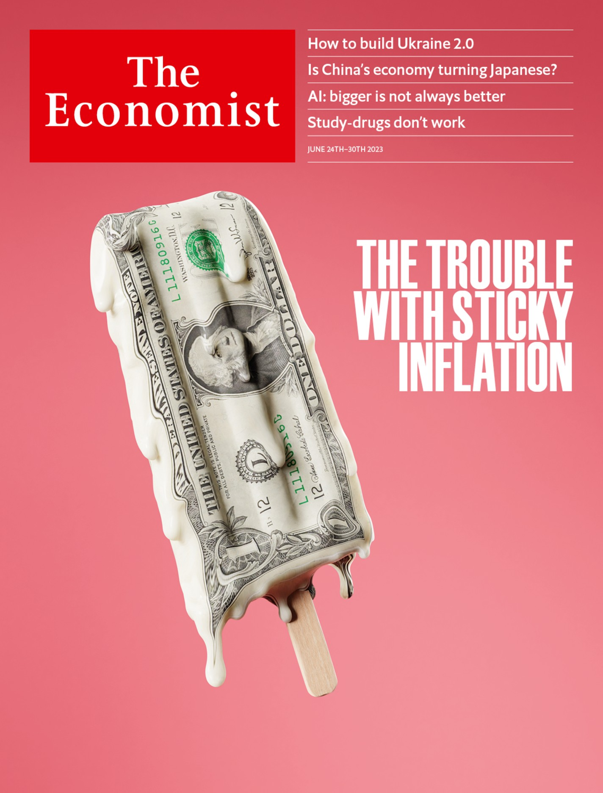

## If AI is to keep getting better, it will have to do more with less  

如果人工智能要继续变得更好，它将不得不以更少的资源做更多的事情

When it comes to “large language models” (LLMs) such as GPT—which powers ChatGPT, a popular chatbot made by OpenAI, an American research lab—the clue is in the name. Modern AI systems are powered by vast artificial neural networks, bits of software modelled, very loosely, on biological brains. GPT\-3, an LLM released in 2020, was a behemoth. It had 175bn “parameters”, as the simulated connections between those neurons are called. It was trained by having thousands of GPUs (specialised chips that excel at AI work) crunch through hundreds of billions of words of text over the course of several weeks. All that is thought to have cost at least $4.6m.  

说到 "大型语言模型"（llms），如gpt--它为美国研究实验室Openai制造的流行聊天机器人Chatgpt提供动力--线索就在名字里。现代人工智能系统由庞大的人工神经网络提供动力，这些软件是以生物大脑为模型的，非常宽泛。它有1750亿个 "参数"，这些神经元之间的模拟连接被称为参数。它是通过让成千上万的GPU（擅长AI工作的专用芯片）在几周内压缩数千亿字的文本进行训练的。所有这些被认为至少花费了460万美元。

Listen to this story.

Enjoy more audio and podcasts on [iOS](https://economist-app.onelink.me/d2eC/bed1b25) or [Android](https://economist-app.onelink.me/d2eC/7f3c199).  

听听这个故事。在iOS或Android上享受更多音频和播客。

Your browser does not support the <audio> element.  

您的浏览器不支持<audio> 元素。

But the most consistent result from modern AI research is that, while big is good, bigger is better. Models have therefore been growing at a blistering pace. GPT\-4, released in March, is thought to have around 1trn parameters—nearly six times as many as its predecessor.  

但是现代人工智能研究最一致的结果是，虽然大是好的，但更大是更好的。因此，模型一直在以惊人的速度增长。3月发布的gpt-4被认为有大约1万个参数--几乎是其前身的六倍。  

Sam Altman, the firm’s boss, put its development costs at more than $100m. Similar trends exist across the industry. Epoch AI, a research firm, estimated in 2022 that the computing power necessary to train a cutting-edge model was doubling every six to ten months (see chart).  

该公司的老板萨姆-奥特曼认为其开发成本超过1亿美元。整个行业也存在类似的趋势。研究公司Epoch ai在2022年估计，训练一个尖端模型所需的计算能力每6到10个月就会翻一番（见图）。

This gigantism is becoming a problem. If Epoch AI’s ten-monthly doubling figure is right, then training costs could exceed a billion dollars by 2026—assuming, that is, models do not run out of data first.  

这种巨大的现象正在成为一个问题。如果Epoch ai每10个月翻一番的数字是正确的，那么到2026年，培训成本可能超过10亿美元--假设模型不会首先耗尽数据。  

An analysis published in October 2022 forecast that the stock of high-quality text for training may well be exhausted around the same time.  

2022年10月发表的一份分析报告预测，用于培训的高质量文本储备很可能在同一时间耗尽。  

And even once the training is complete, actually using the resulting model can be expensive as well. The bigger the model, the more it costs to run.  

即使在训练完成后，实际使用所产生的模型也会很昂贵。模型越大，运行成本就越高。  

Earlier this year Morgan Stanley, a bank, guessed that, were half of Google’s searches to be handled by a current GPT\-style program, it could cost the firm an additional $6bn a year. As the models get bigger, that number will probably rise.  

今年早些时候，摩根士丹利（Morgan Stanley）猜测，如果谷歌一半的搜索由目前的GPT式程序处理，可能会使该公司每年多花60亿美元。随着模型越来越大，这个数字可能会上升。

Many in the field therefore think the “bigger is better” approach is running out of road. If AI models are to carry on improving—never mind fulfilling the AI\-related dreams currently sweeping the tech industry—their creators will need to work out how to get more performance out of fewer resources.  

因此，该领域的许多人认为 "越大越好 "的方法已经走不通了。如果ai模型要继续改进--更不用说实现目前席卷科技行业的ai相关梦想--它们的创造者将需要解决如何用更少的资源获得更多的性能。  

As Mr Altman put it in April, reflecting on the history of giant-sized AI: “I think we’re at the end of an era.”  

正如阿特曼先生在4月份回顾巨型AI的历史时所说："我认为我们正处于一个时代的尽头。

## Quantitative tightening 量化紧缩

Instead, researchers are beginning to turn their attention to making their models more efficient, rather than simply bigger.  

相反，研究人员开始将注意力转向使他们的模型更有效率，而不是简单的更大。  

One approach is to make trade-offs, cutting the number of parameters but training models with more data.  

一种方法是进行权衡，削减参数的数量，但用更多的数据训练模型。  

In 2022 researchers at DeepMind, a division of Google, trained Chinchilla, an LLM with 70bn parameters, on a corpus of 1.4trn words. The model outperforms GPT\-3, which has 175bn parameters trained on 300bn words. Feeding a smaller LLM more data means it takes longer to train. But the result is a smaller model that is faster and cheaper to use.  

2022年，谷歌旗下DeepMind的研究人员在14万亿字的语料库中训练了Chinchilla，这是一个拥有700亿个参数的LLM。该模型优于gpt-3，gpt-3拥有1750亿个参数，在3000亿个词上进行训练。给一个较小的Lym提供更多的数据意味着它需要更长的时间来训练。但结果是一个更小的模型，使用起来更快、更便宜。

Another option is to make the maths fuzzier. Tracking fewer decimal places for each number in the model—rounding them off, in other words—can cut hardware requirements drastically.  

另一个选择是让数学变得更加模糊。对模型中的每个数字追踪更少的小数位--换句话说，对它们进行四舍五入--可以大大降低硬件要求。  

In March researchers at the Institute of Science and Technology in Austria showed that rounding could squash the amount of memory consumed by a model similar to GPT\-3, allowing the model to run on one high-end GPU instead of five, and with only “negligible accuracy degradation”.  

3月，奥地利科学和技术研究所的研究人员表明，四舍五入可以压制类似gpt-3的模型所消耗的内存量，使该模型可以在一个高端gpu上运行，而不是五个，并且只有 "可忽略不计的精度下降"。

Some users fine-tune general-purpose LLMs to focus on a specific task such as generating legal documents or detecting fake news. That is not as cumbersome as training an LLM in the first place, but can still be costly and slow. Fine-tuning LLaMA, an open-source model with 65bn parameters that was built by Meta, Facebook’s corporate parent, takes multiple GPUs anywhere from several hours to a few days.  

一些用户对通用的LLM进行了微调，以专注于某一特定任务，如生成法律文件或检测假新闻。这不像一开始就训练一个llm那么麻烦，但仍然可能是昂贵和缓慢的。微调llama是一个拥有650亿个参数的开源模型，由Facebook的母公司Meta公司建立，需要多个GPU，从几小时到几天不等。

Researchers at the University of Washington have invented a more efficient method that allowed them to create a new model, Guanaco, from LLaMA on a single GPU in a day without sacrificing much, if any, performance. Part of the trick was to use a similar rounding technique to the Austrians.  

华盛顿大学的研究人员发明了一种更有效的方法，使他们能够在一天之内在单个gpu上从llama创建一个新的模型，Guanaco，而不牺牲太多的性能，如果有的话。技巧的一部分是使用与奥地利人类似的四舍五入技术。  

But they also used a technique called “low-rank adaptation”, which involves freezing a model’s existing parameters, then adding a new, smaller set of parameters in between.  

但他们也使用了一种被称为 "低等级适应 "的技术，即冻结一个模型的现有参数，然后在其间添加一个新的、较小的参数集。  

The fine-tuning is done by altering only those new variables. This simplifies things enough that even relatively feeble computers such as smartphones might be up to the task.  

微调是通过只改变那些新的变量来完成的。这就把事情简化了，即使是相对脆弱的计算机，如智能手机，也能胜任这项工作。  

Allowing LLMs to live on a user’s device, rather than in the giant data centres they currently inhabit, could allow for both greater personalisation and more privacy.  

允许网络服务生活在用户的设备上，而不是在他们目前居住的巨大的数据中心，可以允许更多的个性化和更多的隐私。

A team at Google, meanwhile, has come up with a different option for those who can get by with smaller models.  

与此同时，谷歌的一个团队为那些可以用较小模型的人提出了一个不同的选择。  

This approach focuses on extracting the specific knowledge required from a big, general-purpose model into a smaller, specialised one.  

这种方法的重点是将所需的具体知识从一个大的、通用的模型中提取到一个小的、专门的模型中。  

The big model acts as a teacher, and the smaller as a student. The researchers ask the teacher to answer questions and show how it comes to its conclusions.  

大模型充当老师，小模型充当学生。研究人员要求老师回答问题，并展示它是如何得出结论的。  

Both the answers and the teacher’s reasoning are used to train the student model.  

答案和教师的推理都被用来训练学生的模型。  

The team was able to train a student model with just 770m parameters, which outperformed its 540bn-parameter teacher on a specialised reasoning task.  

该团队能够训练出一个只有7.7亿个参数的学生模型，该模型在一项专门的推理任务中的表现超过了其5400亿个参数的老师。

Rather than focus on what the models are doing, another approach is to change how they are made. A great deal of AI programming is done in a language called Python.  

与其关注模型在做什么，另一种方法是改变它们的制作方式。大量的ai编程是用一种叫做Python的语言完成的。  

It is designed to be easy to use, freeing coders from the need to think about exactly how their programs will behave on the chips that run them.  

它被设计成易于使用，使编码者无需考虑他们的程序在运行它们的芯片上究竟会有什么表现。  

The price of abstracting such details away is slow code. Paying more attention to these implementation details can bring big benefits.  

把这些细节抽象出来的代价是代码太慢。对这些实现细节给予更多的关注可以带来很大的好处。  

This is “a huge part of the game at the moment”, says Thomas Wolf, chief science officer of Hugging Face, an open-source AI company.  

这是 "目前游戏的一个巨大部分"，开源AI公司Hugging Face的首席科学官Thomas Wolf说。

## Learn to code 学习编码

In 2022, for instance, researchers at Stanford University published a modified version of the “attention algorithm”, which allows LLMs to learn connections between words and ideas.  

例如，在2022年，斯坦福大学的研究人员发表了 "注意力算法 "的修改版本，它允许llms学习单词和想法之间的联系。  

The idea was to modify the code to take account of what is happening on the chip that is running it, and especially to keep track of when a given piece of information needs to be looked up or stored.  

我们的想法是修改代码，以考虑到正在运行的芯片上所发生的事情，特别是跟踪某一特定信息何时需要被查询或存储。  

Their algorithm was able to speed up the training of GPT\-2, an older large language model, threefold. It also gave it the ability to respond to longer queries.  

他们的算法能够将gpt-2（一个较早的大型语言模型）的训练速度提高三倍。它还使其有能力应对更长的查询。

Sleeker code can also come from better tools. Earlier this year, Meta released an updated version of PyTorch, an ai\-programming framework.  

更加光滑的代码也可以来自于更好的工具。今年早些时候，Meta公司发布了PyTorch的更新版本，这是一个人工智能编程框架。  

By allowing coders to think more about how computations are arranged on the actual chip, it can double a model’s training speed by adding just one line of code.  

通过允许编码人员更多地考虑计算在实际芯片上是如何安排的，它可以通过增加一行代码将模型的训练速度提高一倍。  

Modular, a startup founded by former engineers at Apple and Google, last month released a new AI\-focused programming language called Mojo, which is based on Python. It too gives coders control over all sorts of fine details that were previously hidden.  

Modular是一家由苹果和谷歌的前工程师创立的创业公司，上个月发布了一种新的以人工智能为重点的编程语言，名为Mojo，它基于Python。它也让编码人员能够控制以前隐藏的各种精细细节。  

In some cases, code written in Mojo can run thousands of times faster than the same code in Python.  

在某些情况下，用Mojo编写的代码比用Python编写的相同代码的运行速度快数千倍。

A final option is to improve the chips on which that code runs. GPUs are only accidentally good at running AI software—they were originally designed to process the fancy graphics in modern video games. In particular, says a hardware researcher at Meta, GPUs are imperfectly designed for “inference” work (ie, actually running a model once it has been trained). Some firms are therefore designing their own, more specialised hardware.  

最后一个选择是改进运行该代码的芯片。GPU只是意外地擅长运行AI软件--它们最初被设计用来处理现代视频游戏中的花哨图形。特别是，Meta公司的一位硬件研究员说，GPU对于 "推理 "工作的设计并不完美（即，一旦模型被训练好，就实际运行）。因此，一些公司正在设计他们自己的、更专业的硬件。  

Google already runs most of its AI projects on its in-house “TPU” chips. Meta, with its MTIAs, and Amazon, with its Inferentia chips, are pursuing a similar path.  

谷歌已经在其内部的 "TPU "芯片上运行其大部分的AI项目。拥有mtias的Meta公司和拥有Inferentia芯片的亚马逊公司也在追求类似的道路。

That such big performance increases can be extracted from relatively simple changes like rounding numbers or switching programming languages might seem surprising.  

从四舍五入或切换编程语言等相对简单的变化中可以获得如此大的性能提升，这似乎令人惊讶。  

But it reflects the breakneck speed with which LLMs have been developed. For many years they were research projects, and simply getting them to work well was more important than making them elegant.  

但这也反映了网络语言发展的飞速速度。许多年来，它们都是研究项目，简单地让它们工作得好比让它们优雅更重要。  

Only recently have they graduated to commercial, mass-market products. Most experts think there remains plenty of room for improvement.  

直到最近，它们才逐渐成为商业化的大众市场产品。大多数专家认为仍有很大的改进空间。  

As Chris Manning, a computer scientist at Stanford University, put it: “There’s absolutely no reason to believe…that this is the ultimate neural architecture, and we will never find anything better.” ■  

正如斯坦福大学的计算机科学家克里斯-曼宁所说："绝对没有理由相信......这是最终的神经结构，我们永远不会找到更好的东西。"■

_Curious about the world? To enjoy our mind-expanding science coverage, sign up to [Simply Science](https://www.economist.com/newsletters/simply-science), our weekly subscriber-only newsletter.  

对世界感到好奇？要享受我们令人心旷神怡的科学报道，请注册Simply Science，我们每周的订阅者专用通讯。_

This article appeared in the Science & technology section of the print edition under the headline "Time for a diet"  

这篇文章出现在印刷版的科学和技术部分，标题为 "是时候减肥了"

### From the June 24th 2023 edition  

摘自2023年6月24日版

Discover stories from this section and more in the list of contents  

在内容列表中发现本节和更多的故事

[Explore the edition 探索版本](https://www.economist.com/printedition/2023-06-24)
