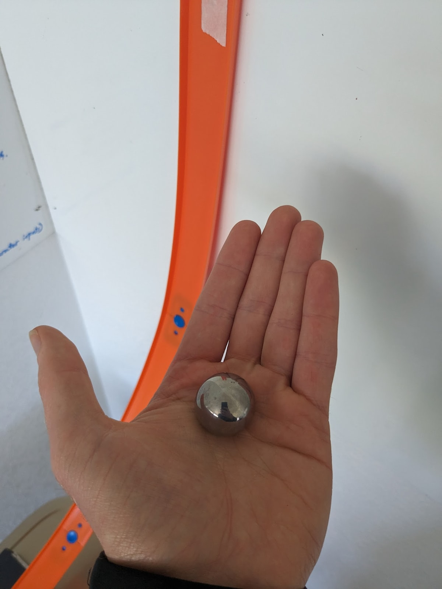
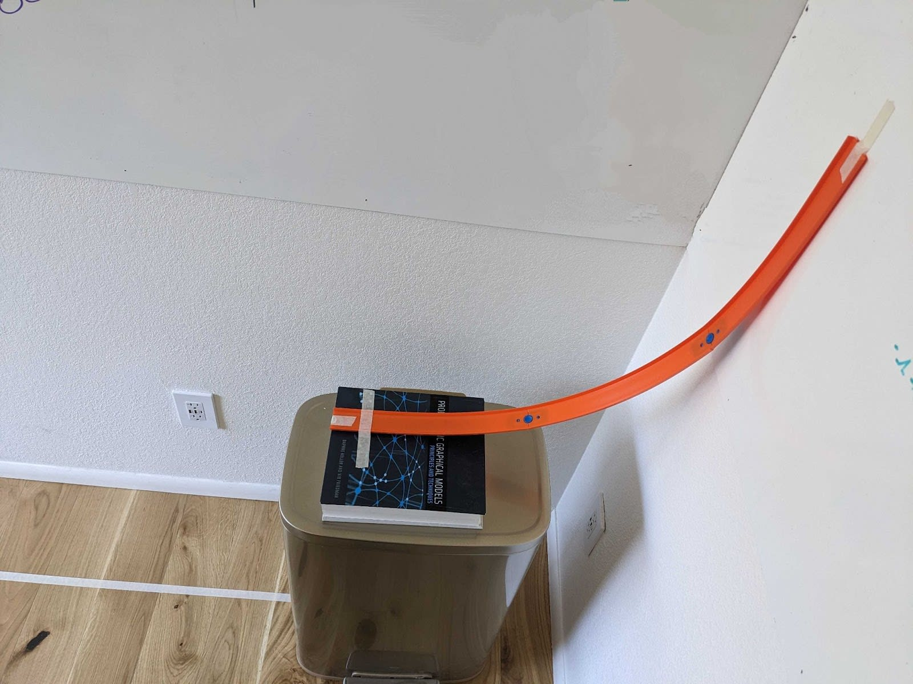

_This post is based on several true stories, from a workshop which John has run a few times over the past year.  

这篇文章基于几个真实的故事，来自约翰在过去一年举办过几次的研讨会。_

**John:** Welcome to the Ball -> Cup workshop! Your task for today is simple: I’m going to roll this metal ball:  

约翰：欢迎来到球 -> 杯研讨会！你今天的任务很简单：我要滚动这个金属球：

… down this hotwheels ramp:  

……沿着风火轮坡道走下去：

… and off the edge. Your job is to tell me how far from the bottom of the ramp to place a cup on the floor, such that the ball lands in the cup.  

......并且超出了边缘。你的任务是告诉我将杯子放在地板上距离坡道底部多远，以便球落在杯子中。

Oh, and you only get one try.  

哦，而且你只能尝试一次。

General notes: 一般注意事项：

-   I won’t try to be tricky with this exercise.  
    
    我不会试图在这个练习中耍花招。
-   You are welcome to make whatever measurements you want of the ball, ramp, etc.  
    
    欢迎您对球、坡道等进行任何您想要的测量。
-   You can even do partial runs, e.g. roll the ball down the ramp and stop it at the bottom, or throw the ball through the air.  
    
    您甚至可以进行部分运行，例如将球滚下坡道并停在底部，或者将球扔到空中。
-   But you only get one full end-to-end run (from top of the ramp to the cup/floor), and anything too close to an end-to-end run (let's say more than ~half the run) is discouraged. After all, in the AI situation for which the exercise is a metaphor, we don’t know exactly when something might foom; we want elbow room.  
    
    但是你只能进行一次完整的端到端运行（从坡道顶部到杯子/地板），并且任何太接近端到端运行（比方说超过一半的运行）的行为都是不鼓励的。毕竟，在以该练习为隐喻的人工智能情境中，我们不知道事情何时会发生；我们需要肘部空间。

That’s it! Good luck, and let me know when you’re ready to give it a shot.  

就是这样！祝你好运，当你准备好尝试时请告诉我。

\[At this point readers may wish to stop and consider the problem themselves.\]  

【此时读者不妨停下来，自己思考一下这个问题。】

___

**Alison:** Let’s get that ball in that cup.  

艾莉森：让我们把球放进杯子里。  

It looks like this is probably supposed to be a basic physics kind of problem…but there’s got to be some kind of twist or else why would he be having us do it?  

看起来这可能应该是一个基本的物理问题……但一定有某种扭曲，否则他为什么要让我们这样做呢？  

Maybe the ball is surprisingly light….or maybe the camera angle is misleading and we are supposed to think of something wacky like that??  

也许球出人意料地轻……或者也许相机角度具有误导性，我们应该想到类似这样的古怪东西？

**The Unnoticed Observer:** Muahahaha.  

不被注意的观察者：啊哈哈哈哈。

**Alison:** That seems…hard. I’ll just start with the basic physics thing and if I run out of time before I can consider the wacky stuff, so be it.   

艾莉森：这看起来……很难。我将从基本的物理学开始，如果我在考虑那些古怪的东西之前没有时间了，那就这样吧。

So I should probably split this problem into two parts. The part where the ball arcs through the air once off the table is pretty easy…  

所以我可能应该把这个问题分成两部分。球离开桌子后在空中划出弧线的部分非常简单……

**The Unnoticed:** True in this case, but how would you notice if it were false? What evidence have you seen?  

未被注意到的：在这种情况下是正确的，但如果它是错误的，你会如何注意到？你看到了什么证据？

**Alison:** …but the trouble is getting the exact velocity. What information do I have?  

艾莉森：……但麻烦在于获得准确的速度。我有什么信息？  

Well, I can ask whatever I want, so I should be able to get all the parameters I need for the standard equations.  

好吧，我可以问任何我想要的，所以我应该能够获得标准方程所需的所有参数。  

Let’s make a shopping list: I want the starting height of the ball on the ramp (from the table), the mass of the ball, the height of the ramp off the table from multiple points along it (to estimate the curvature,) uhhh… oh shit maybe the bendiness matters!  

让我们列一个购物清单：我想要球在斜坡上的起始高度（从桌子开始）、球的质量、斜坡从桌子上沿其多个点的高度（以估计曲率）呃……哦，妈的，也许弯曲度很重要！  

That seems really tricky. I’ll look at that first. Hey, John, can you poke the ramp a bit to demonstrate how much it flexes?  

这看起来确实很棘手。我先看看这个。嘿，约翰，你能稍微戳一下坡道来演示它的弯曲程度吗？

**\*John pokes at the ramp and the ramp bends.\*  

\*约翰戳了一下坡道，坡道就弯曲了。\***

Well it did flex, but… it can’t have _that_ much of an effect.  

嗯，它确实弯曲了，但是……它不可能有那么大的效果。

**The Unnoticed:** False in this case. Such is the danger of guessing without checking.  

未被注意到的：在这种情况下是错误的。这就是未经核实就猜测的危险。

**Alison:** Calculating the effect of the ramp’s bendiness seems unreasonably difficult and this workshop is only meant to take an hour or so, so let’s forget that.  

艾莉森：计算坡道弯曲度的影响似乎非常困难，而且这个研讨会只需要一个小时左右的时间，所以让我们忘记这一点。

**The Unnoticed:** I am reminded of a [parable](https://en.wikipedia.org/wiki/Streetlight_effect) about a quarter and a streetlight.  

不被注意的人：我想起一个关于二十五分钱和一盏路灯的寓言。

**Alison:** On to curve estimation!  

艾莉森：开始曲线估计！

**The Unnoticed:** Why on earth is she estimating the ramp’s curve anyway?  

未被注意到的人：她到底为什么要估算坡道的曲线？

**Alison:** …Well I don’t actually know how to do much better than the linear approximation I got from the direct measurements.  

艾莉森：……嗯，我实际上不知道如何比直接测量得到的线性近似值做得更好。  

I guess I can treat part of the ramp as linear and then the end part as part of a circle. That will probably be good enough.  

我想我可以将斜坡的一部分视为线性，然后将末端部分视为圆形的一部分。这可能就足够了。  

Ooh if I take a frame from the video, I can just directly measure what the radius circle with arc of best fit is!  

哦，如果我从视频中取出一帧，我可以直接测量具有最佳拟合弧的半径圆是多少！  

Okay now that I’ve got that… Well I guess it’s time to look up how to do these physics problems, guess I’m rustier than I thought. I’ll go do that now.  

好吧，现在我已经明白了……好吧，我想是时候看看如何解决这些物理问题了，我想我比我想象的更生疏。我现在就去做。

Arrrgh okay I didn’t need to do any of that curve stuff after all, I just needed to do some potential/kinetic energy calculations (ignoring friction and air resistance etc) and that’s it!  

好吧，毕竟我不需要做任何曲线的事情，我只需要做一些势能/动能计算（忽略摩擦力和空气阻力等），就是这样！  

I should have figured it wouldn’t be that hard, this is just a workshop after all.  

我应该认为这不会那么难，毕竟这只是一个研讨会。

**\*Blackboard Montage\* \*黑板蒙太奇\***

 implies   暗示\= 3.4 m/s \= 3.4米/秒

 implies   暗示

Result:  结果： = 0.8 m  = 0.8 m

Aaaaand that should do it.  

啊啊啊，应该可以了。  

Given the height of the ball from the table, the mass, and the gravitational constant, I declare that the velocity of the ball at the end of the ramp is 3.4 m/s directly horizontal to the ground.  

给定球距桌子的高度、质量和重力常数，我宣布球在斜坡末端的速度为 3.4 m/s，直接水平于地面。  

Alright now the easy part.  

好吧，现在是简单的部分。  

Just have to look up some Newtonian mechanics real quick…aaand yeah with that velocity, mass, height, and gravity blah blah blah, the ball should hit the ground exactly… 0.8 m from the end of the ramp.  

只需要快速查找一些牛顿力学...aaand 是的，根据速度、质量、高度和重力等等，球应该准确地击中地面...距坡道末端 0.8 m。

Nice job, self!

 干得好，自己！

Okay, before running it I should probably check my work. The ballistics are definitely right, don’t need the curve stuff, potential energy gets converted to kinetic… oh shit.  

好吧，在运行之前我应该检查一下我的工作。弹道学绝对是正确的，不需要曲线的东西，势能转化为动能……哦操。  

I vaguely remember something about rotational energy. Better look that up….   

我依稀记得一些关于旋转能的事。最好查一下……

**The Unnoticed:** Could it be… the heavily foreshadowed “some kind of twist”?  

不为人知的人：难道是……早已预示的“某种转折”？

**Alison:** Ahhhh shit okay so I need to factor that in too. Back to the blackboard.  

艾莉森：啊啊，好吧，所以我也需要考虑到这一点。回到黑板。

**\*More Blackboard Montage\*  

\*更多黑板蒙太奇\***

Yup alright great so with that adjustment in place let’s look over it one more time. Ballistics, check. Energy calculations, balanced.  

是的，很好，调整到位后，让我们再看一次。弹道学，检查一下。能量计算，平衡。  

Final velocity based on that… yup no arithmetic errors. Alright, if this problem is at all reasonable then this is the answer! Phew, that took some careful thought!  

最终速度基于此……是的，没有算术错误。好吧，如果这个问题完全合理，那么这就是答案！唷，这可是经过深思熟虑的啊！  

Let’s see how it goes…  

让我们看看进展如何……

**\*Alison  declares her official prediction. Trumpets blare; a drum roll sounds.  

\*艾莉森宣布她的官方预测。号角吹响；鼓声响起。  

The ball is dropped from the top of the ramp before the mayor, two judges, a jury of thirteen of Alison ’s peers, two armed guards, three visiting foreign dignitaries, a public notary, a priest, a rabbi, an imam, and one very confused bartender.  

球从坡道顶部落到市长、两名法官、十三名艾莉森同僚组成的陪审团、两名武装警卫、三名来访的外国政要、一名公证人、一名牧师、一名拉比、一名伊玛目的面前。一位非常困惑的调酒师。  

The ball rolls down the ramp…  

球滚下坡道……**

**… and entirely fails to land in the cup. Or even hit it.\*  

......并且完全未能落入杯中。或者甚至击中它。\***

**Alison:** …Well. I guess the lesson is to not trust guys in black fedoras.  

艾莉森：……嗯。我想这个教训是不要相信戴黑色软呢帽的人。

**The Suddenly Noticed Observer:** Surely there is some takeaway other than _just_ that?  

突然注意到的观察者：除此之外肯定还有其他一些收获吗？

**Alison:** Well, I did everything I could think of with what I'd been given and it still didn’t work. I even accounted for rotational energy!  

艾莉森：嗯，我用我能想到的办法做了一切，但还是没用。我什至考虑了旋转能量！  

So look, maybe I made an error somewhere but at this point I’m pretty suspicious that there is any solution at all given what I have to work with.  

所以看，也许我在某个地方犯了错误，但在这一点上，我非常怀疑考虑到我必须处理的问题是否有任何解决方案。

**The Noticed Observer:** Sounds like we should place a bet, I might stand to make some money. Let’s see another’s effort… **\*snaps fingers with entirely unnecessary, but very satisfying, drama\***  

著名观察家：听起来我们应该打赌，我可能会赚一些钱。让我们看看另一个人的努力……\*打响指，完全没有必要，但非常令人满意，戏剧性\*

___

**Robert (M.D.):**  Boy do I love my job. Surgery is just so rewarding! Cutting people up, putting them back together, and getting paid to do it! And also the lives saved, of course.   

罗伯特（医学博士）：我真的很喜欢我的工作。手术真是太值得了！把人切开，再把他们重新组合起来，然后就可以得到报酬！当然，还有被拯救的生命。

**The Observer Who Is Back To Being Unnoticed:** Now that’s just lazy writing, folks.  

又回到不被注意的观察者：伙计们，这只是懒惰的写作。

**Robert (M.D.):** Alright so what’s this about a ball in a cup? Doesn’t seem too bad. I mean, I don’t really remember physics that well, but it can’t be _that_ hard. It’s just a workshop after all. Well, I never did like physics so let’s just look at the problem as a whole before we dissect it into tiny little-- erm, do the physics.   

罗伯特（医学博士）：好吧，那么杯子里的球是什么呢？看起来还不错。我的意思是，我不太记得物理，但它不会那么难。毕竟这只是一个工作坊。好吧，我从来不喜欢物理，所以让我们先从整体上看问题，然后再将其分解成很小的部分——呃，做物理。

**Alison, Who Is Also Observing And Unnoticed:** Wait, is this, like, a metaphorical surgeon?  

艾莉森，也在观察但未被注意到：等等，这是一个隐喻外科医生吗？

**Robert:** So as far as I can tell, we’d like to slice the problem into at _least_ two pieces, the part where the ball goes down the ramp and the part where the ball flies off the table and into the cup. I _think_ that the second one is pretty standard. It’s just like tossing a ball through the air-- that’s like example no.1 in freshman physics.  

罗伯特：据我所知，我们希望将问题至少分成两部分，即球从斜坡上滑下的部分和球从桌子上飞入杯子的部分。我认为第二个是相当标准的。这就像在空中抛球一样——就像新生物理中的第一个例子。  

Let’s not be too hasty, though… is there anywhere we can cut to make the problem even simpler?  

不过，我们不要操之过急……有什么地方可以让问题变得更简单吗？  

Hmm, maybe there is something more to see about the part just after the ball leaves the table, when it’s traveling through the air, and just before it hits the ground?  

嗯，也许球离开桌子后、在空中飞行时以及落地之前的部分还有更多值得一看的地方？  

Maybe the angle of travel through the air affects things? Well it’s certainly speeding up as it falls…Ooh maybe the air resistance changes as a result? Huh.  

也许空气中的飞行角度会影响事物？嗯，它在下落时肯定会加速……哦，也许空气阻力因此而改变？呵呵。  

Well I can test that one pretty easily by having John drop the ball on camera.  

好吧，我可以通过让约翰在镜头前丢球来很容易地测试这一点。  

I could also have him toss the ball alongside some other object to see if the air resistance or whatever else causes any significant differences.   

我还可以让他将球扔到其他物体旁边，看看空气阻力或其他什么因素是否会导致任何显着差异。

**\*Robert has John drop the ball on camera, records it, then marches through frame-by-frame comparing the ball’s position to the predictions of a ballistic calculation\*  

\*罗伯特让约翰把球扔到摄像机上，记录下来，然后逐帧比较球的位置与弹道计算的预测\***

**The Unnoticed:** Yessssss… check your model against reality… so many [bits of information](https://www.lesswrong.com/posts/9kNxhKWvixtKW5anS/you-are-not-measuring-what-you-think-you-are-measuring)… might even notice if Something Weird were going on…  

未被注意到的：是的……根据现实检查你的模型……这么多的信息……甚至可能会注意到是否发生了奇怪的事情……

**\*Alison gives The Unnoticed a weird look, and scootches away a little in the Unseen Space.\*  

\*艾莉森给了未被注意到的人一个奇怪的眼神，然后在看不见的空间里躲开了一点。\***

**Robert:** Well.  罗伯特：嗯。  

I got the test results, I’ve googled physics 101, and, unfortunately, no further slicing to be done here as it seems like the part where the ball flies through the air might be as simple as it gets.  

我得到了测试结果，我在谷歌上搜索了物理 101，不幸的是，这里不需要进行进一步的切片，因为看起来球在空中飞行的部分可能就这么简单。  

Just basic Newtonian mechanics.  

只是基本的牛顿力学。

**The Unnoticed:** Yeah, turns out there’s nothing weird going on in this part. And now he knows that!  

未被注意到的人：是的，事实证明这部分没有什么奇怪的事情发生。现在他知道了！

**Robert:** On to the ramp part! Ooh, this one seems complicated. Lots of places to slice ‘n dice here. John _did_ say we could run partial tests…but…what to test? I could test how long it takes the ball to get to various places on the ramp.  

罗伯特：到坡道部分！哦，这个好像很复杂。这里有很多地方可以切片。约翰确实说过我们可以运行部分测试……但是……要测试什么？我可以测试球到达坡道上各个位置需要多长时间。  

Probably the end of the ramp is of particular interest. Maybe. I should probably get the height of the ramp…maybe its length?   

也许坡道的末端特别令人感兴趣。或许。我也许应该知道坡道的高度……也许它的长度？

….Argh I don’t really have a plan here. I need to cut the problem down more.   

….啊，我真的没有计划。我需要进一步减少问题。

Where to slice…where to slice… Okay let’s try that thing I tried earlier: There’s a beginning part, a middle part, and an end part.  

在哪里切片…在哪里切片…好吧，让我们尝试一下我之前尝试过的东西：有开始部分、中间部分和结束部分。  

The ball travels down a pretty straight path to begin with…. Then it passes through the curved part, and then flies off the end.  

一开始，球沿着一条相当笔直的路径行进……然后它穿过弯曲的部分，然后飞离末端。  

The internet said that ramp problems really just boil down to potential/kinetic/rotational energy calculations so I guess that’s all I need to do?   

互联网上说，斜坡问题实际上只是归结为势能/动能/旋转能计算，所以我想这就是我需要做的一切？

Something…feels off about this. I feel like that’s a little too… epistemically-deferential? Or something? Why does this feel wrong… I guess I just don’t believe that the physics problems online are _definitely_ talking about the thing I’m looking at. Maybe I should look at it some more. I’ll take a video of one full ramp-run, stopped at the bottom. Maybe that will help.  

有点……感觉不太对劲。我觉得这有点太……认识上的恭敬？或者其他的东西？为什么这感觉不对……我想我只是不相信网上的物理问题绝对是在谈论我正在看的东西。也许我应该再看一下。我将拍摄一段完整的坡道运行视频，停在底部。也许这会有所帮助。

**\*Robert takes a video of the ball rolling down the ramp.\*  

\*罗伯特拍摄了球滚下坡道的视频。\***

**\*Unbeknownst to Robert, in the Unseen Space where Alison  and The Unnoticed watch, a choir of angels suddenly appears and begins singing. The Unnoticed shoos them away.\*  

\*罗伯特不知道的是，在艾莉森和未被注意到的人观看的看不见的空间中，天使合唱团突然出现并开始唱歌。不被注意的人把他们赶走了。\***

**The Unnoticed:** Guess the prediction markets on Robert have shot up.  

未被注意到的：猜猜罗伯特的预测市场已经飙升。  

Damn, I should have placed my bet after he tested the air resistance thing, he clearly had the right habits in place to test the ramp too.  

该死，我应该在他测试了空气阻力之后就下注了，他显然也有正确的习惯来测试坡道。

**Robert:** … Okay I’ve watched this thing about 10 times now and first thing’s first: no matter how you slice it, the goddamn ramp is goddamn BENDY.  

罗伯特：……好吧，我已经看了这件事大约十遍了，第一件事是第一件事：无论你如何分割它，该死的坡道都是该死的 BENDY。  

That is definitely not a “standard physics” problem as far as I’ve found online. All the potential/kinetic/rotational energy approaches assume a rigid ramp! That _might_ not be a problem…but I honestly just don’t know either way.  

据我在网上发现的，这绝对不是一个“标准物理”问题。所有势能/动能/旋转能方法均假设为刚性斜坡！这可能不是问题……但老实说我就是不知道。

**\*In the Unseen Space, the choir of angels try to sneak back in. The Unnoticed lands a solid kick on one of them, and they scurry off.\*  

\*在看不见的空间里，天使合唱团试图偷偷溜回来。不被注意的人对其中一个人狠狠踢了一脚，他们仓皇逃走。\***

**Robert: 罗伯特：** The second thing I’ve realized: I am an idiot. I’ve been trying to do all this physics nonsense when I can just   

我意识到的第二件事是：我是个白痴。当我可以的时候，我一直在尝试做所有这些物理废话_directly measure the speed of the ball  

直接测量球的速度_.  

I started trying to calculate the speed of the ball going down the ramp at various points to test whether the bending made it deviate from the rigid-ramp model, and I did it just by taking the pixel-length difference in location and combining that with the camera’s frame rate.  

我开始尝试计算球在不同点沿着斜坡下降的速度，以测试弯曲是否使其偏离刚性斜坡模型，我只是通过获取位置上的像素长度差异并将其与相机的帧速率。  

But why bother with any of those calculations when I can just get the speed of the ball at the end of the ramp just like that?  

但是，当我可以像这样获得坡道末端的球的速度时，为什么要费心进行这些计算呢？ Pains me as it does to stay my delicate scalpel of inquisition on the deep nature of the ramp, the final speed is all I need.  

虽然我很痛苦，但我需要的就是最终的速度。

Is anything else missing, then? I get the speed from pixel calculations, then do the standard ballistics thing and that’s it?   

那么还缺什么吗？我从像素计算中获得速度，然后进行标准弹道学的处理，仅此而已？

…. Ah! Okay well just to be sure, I should probably get John to take a bunch of videos so I can measure how consistent the pixel calculation thing is.  

……啊!好吧，为了确定一下，我可能应该让约翰拍摄一堆视频，这样我就可以测量像素计算的一致性。

**The Unnoticed:** Smart move. Unnecessary this time, but smart in general.  

未被注意到的：明智之举。这次没有必要，但总的来说很聪明。

**Robert:** …And it’s fairly consistent! I guess it’s time?  

罗伯特：……而且相当一致！我想是时候了？

**\*Robert declares his official prediction. Guitars ring out - \*  

\*罗伯特宣布他的官方预测。吉他响起 - \***

**Robert:** WAIT! I don’t really know why but after looking at the video a bunch and thinking through it, I just have this feeling that the ball is going to overshoot.  

罗伯特：等等！我真的不知道为什么，但在看了一堆视频并仔细思考之后，我只是有一种感觉，球要过冲了。  

Please move the cup just half an inch further out.  

请将杯子移出半英寸。

**The Unnoticed:** The traditional last-minute gut-level adjustment. Not always right, but a good idea more often than not.  

未被注意到的：传统的最后一刻肠道水平调整。并不总是正确的，但往往是个好主意。

**\*Robert redeclares his official prediction. Guitars ring out, fireworks explode.  

\*罗伯特重新宣布他的官方预测。吉他声响起，烟花绽放。  

The ball is dropped from the top of the ramp before the First Lady of the previous presidential administration, three Nobel-winning chemists, Dolly Parton, one guy who thinks he’s a prophet, the best man from Robert’s wedding, and one bored and frankly surly teenager who will definitely not admit to being related to Robert in any way.  

球从坡道顶部落下，面前是前任总统政府的第一夫人、三名诺贝尔奖获得者化学家、多莉·帕顿、一个自认为是先知的人、罗伯特婚礼上的伴郎，以及一个无聊而坦率的脾气暴躁的人。绝对不会承认与罗伯特有任何关系的少年。  

The ball rolls down the ramp…  

球滚下坡道……**

**… and goes into the cup…  

...然后进入杯子...**

**… and hits the back of the cup and knocks it over. But that counts as success!\*  

......然后击中杯子的背面并将其打翻。但这就算成功了！\***

**Robert:** Heyo! Robert M.D. de-livers, once again!  

罗伯特：嘿嘿！罗伯特医学博士再次分娩！

**The Unnoticed:** … \*snaps fingers again\*  

未被注意到的人：……\*再次打响指\*

___

**The Back To Being Noticed:** Ok, Alison, what did we learn from this?  

回到被关注的状态：好的，艾莉森，我们从中学到了什么？

**Alison:** That medical puns are the _worst_?  

艾莉森：医学双关语是最糟糕的？

**The Noticed:** Yes. And? 注意到的人：是的。和？

**Alison:** Ugh well, I feel a little silly now because I was probably too confident before.  

艾莉森：呃，好吧，我现在觉得有点傻，因为我以前可能太自信了。  

I guess, the main thing is that Robert figured out that the key was the speed of the ball coming off the ramp and that he could get a good read on that value based on pixel measurements of the video… which he discovered by just kind of… looking at the system?  

我想，最主要的是罗伯特发现关键是球离开坡道的速度，他可以根据视频的像素测量来很好地读取该值……他通过某种方式发现了这一点……看系统？

**The Noticed:** Bingo! 注意到：宾果！

**Alison:** But…but surely there’s more to it than that?? I mean… I don’t love saying this, but maybe Robert is just smarter than me?  

艾莉森：但是……但肯定不止这些？我的意思是……我不喜欢这么说，但也许罗伯特只是比我聪明？  

I don’t know if I would have noticed the speed-calculation-from-pixels trick or the load-bearing nature of the final speed even if I had taken a video of it!  

我不知道即使我拍了视频，我是否会注意到从像素计算速度的技巧或最终速度的承载性质！

**The Noticed:** Your math already implied that the only thing you needed to know from the ramp part of the calculation was the ball’s velocity as it left the ramp.  

值得注意的是：您的数学已经暗示您从计算的斜坡部分中唯一需要知道的是球离开斜坡时的速度。

**Alison:** …I guess that’s true. Argh. If I’m being fully honest with myself, maybe I just didn’t try as hard.  

艾莉森：……我想这是真的。啊。如果我对自己完全诚实，也许我只是没有那么努力。  

When Robert noticed the ramp-bending problem he tried to figure out how it worked while I just ignored it, and it was in trying to figure that out that he had his most important insight. I _suppose_ it’s possible I could have had the same thing happen if I’d dug deeper on the places I felt most confused.  

当罗伯特注意到坡道弯曲问题时，他试图弄清楚它是如何工作的，而我却忽略了它，正是在试图弄清楚这个问题的过程中，他有了最重要的洞察力。我想如果我更深入地研究我感到最困惑的地方，我可能会发生同样的事情。

**The Noticed:** Don’t be so hard on yourself. You were streetlamping a bit, but… that’s not quite the same as just not trying hard enough.  

值得注意的是：不要对自己太苛刻。你有点路灯，但是……这和不够努力不太一样。  

Most people have an instinct to pour additional effort into the things they know how to do, rather than spend time finding some way to tackle things they don’t know yet how to handle.  

大多数人都会本能地在他们知道如何做的事情上投入额外的精力，而不是花时间寻找某种方法来解决他们还不知道如何处理的事情。  

Getting the ball in the cup does require some work - estimating velocity from pixels in a video is more work than an equation, especially if you know the math - but it’s more about applying the right _kind_ of effort, rather than applying _more_ of it.  

将球放入杯中确实需要做一些工作 - 从视频中的像素估计速度比方程式更多的工作，特别是如果你知道数学 - 但这更多的是应用正确的努力，而不是应用更多的努力。

Here’s an analogy. How would you get a piece of code to work on the very first try? First, assume there are bugs. There are always bugs.  

这是一个类比。如何让一段代码在第一次尝试时就可以工作？首先，假设存在错误。总是有错误。  

Some particular parts of your calculations may be bug-free, but there will be bugs somewhere.  

计算的某些特定部分可能没有错误，但某些地方可能会存在错误。  

And not just one - you caught the thing about rotational kinetic energy, but that wasn’t the whole story.  

不仅仅是一个——你发现了关于旋转动能的事情，但这并不是故事的全部。

Second, in order to find the bugs, you need to go empirically test the parts of the system.  

其次，为了找到错误，您需要对系统的各个部分进行实证测试。  

You couldn’t do a full end-to-end test in this case, but you could check each of the pieces of the system separately.  

在这种情况下，您无法进行完整的端到端测试，但您可以单独检查系统的每个部分。  

See if the key numbers you’re relying on - like speed - match your calculations, but also generally look for anything Weird.  

看看您所依赖的关键数字（例如速度）是否与您的计算相符，但通常也要寻找任何奇怪的东西。  

(Like the ramp bending.) Heck, I don’t even know if the bending was actually the main issue here, but looking at the velocity of the ball at the end of the ramp it’s obvious that something is off with using the standard equations and you need to do something different.  

（就像斜坡弯曲一样。）哎呀，我什至不知道弯曲是否实际上是这里的主要问题，但是看看斜坡末端球的速度，很明显使用标准方程有些问题你需要做一些不同的事情。

**Alison:** Well. I wish I had gotten this one right on the first try, but at least I feel like I’ve learned something! Got any other similar problems I can try again on?  

艾莉森：嗯。我希望我第一次尝试就做对了，但至少我觉得我学到了一些东西！还有其他类似的问题我可以再试一次吗？

**The Noticed:** Well there’s this thing with AI, see…  

值得注意的是：嗯，人工智能有这个东西，看……
