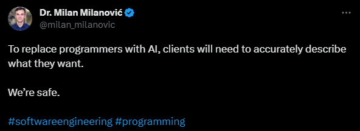

With all the articles about just how amazing all the developments in AI have been, there’s plenty of hand wringing around the possibility that we, as software developers, could soon be out of a job, replaced by artificial intelligence.  

尽管有很多文章都在谈论人工智能的发展有多么惊人，但人们还是担心我们作为软件开发人员可能很快就会失业，并被人工智能取代。  

They imagine all the business execs and product researchers will bypass most or all of their software developers and asking AI directly to build exactly what they think they want or need.  

他们想象所有的业务主管和产品研究人员都会绕过大部分或全部软件开发人员，直接要求人工智能构建他们认为自己想要或需要的东西。  

As someone who’s spent 15 years creating software from the specs these folks create, I find it hard to take all the worrying seriously.   

作为一个花了 15 年时间根据这些人创建的规范创建软件的人，我发现很难认真对待所有的担忧。

Coding can be a challenge, but I’ve never had spent more than two weeks trying to figure out what is wrong with the code.  

编码可能是一个挑战，但我从来没有花超过两周的时间试图找出代码的问题所在。  

Once you get the hang of the syntax, logic, and techniques, it’s a pretty straightforward process—most of the time.  

一旦掌握了语法、逻辑和技术，大多数情况下，这是一个非常简单的过程。  

The real problems are usually centered around what the software is supposed to do.  

真正的问题通常集中在软件应该做什么。  

The hardest part about creating software is not writing code—it’s creating the requirements, and those software requirements are still defined by humans.  

创建软件最困难的部分不是编写代码，而是创建需求，而这些软件需求仍然由人类定义。

This article will talk about the relationship between requirements and software, as well as what an AI needs to produce good results.   

本文将讨论需求和软件之间的关系，以及人工智能需要什么才能产生良好的结果。

## It’s not a bug, it’s feature…no wait, it’s a bug  

这不是一个错误，这是一个功能......不等等，这是一个错误

Early in my software career, I was placed on a project midstream in order to help increase the velocity of the team.  

在我的软件职业生涯早期，我被安排参与一个项目的中游，以帮助提高团队的速度。  

The main purpose of the software was to configure custom products on ecommerce sites.  

该软件的主要目的是在电子商务网站上配置定制产品。

I was tasked with generating dynamic terms and conditions.  

我的任务是生成动态条款和条件。  

There was conditional verbiage that depended on the type of product being purchased, as well as which US state the customer was located in due to legal requirements.  

有条件的措辞取决于所购买产品的类型，以及由于法律要求客户位于美国哪个州。

At some point, I thought I found a potential defect.  

在某些时候，我认为我发现了一个潜在的缺陷。  

A user would pick one product type, which would generate the appropriate terms and conditions, but further along the workflow it would allow the user to pick a different product type and predefined terms and conditions.  

用户将选择一种产品类型，这将生成适当的条款和条件，但沿着工作流程，它将允许用户选择不同的产品类型和预定义的条款和条件。  

It would violate one of the features explicitly agreed on in the business requirement that had the client’s signature.  

它将违反具有客户签名的业务需求中明确商定的功能之一。

I naively asked the client,  “Should I remove the input that allowed a user to override the right terms and conditions?” The response I got has been seared inside my brain ever since.  

我天真地问客户：“我应该删除允许用户覆盖正确条款和条件的输入吗？”从那时起，我得到的回应就深深烙印在我的脑海里。  

His exact words were spoken with complete and total confidence;  

他的话语准确无误，充满信心。

_“That will never happen” “那永远不会发生”_

This was a senior executive who had been at the company for years, knew the company’s business processes, and was chosen to oversee the software for a reason.  

这是一位在公司工作多年的高级管理人员，了解公司的业务流程，并且被选来监督该软件是有原因的。  

The ability to override the default terms and conditions was explicitly requested by the same person.  

同一个人明确要求能够覆盖默认条款和条件。  

Who the heck was I to question anyone, much less a senior executive of a company that was paying us money to build this product? I shrugged it off and promptly forgot about it.  

我到底有什么资格质疑任何人，更不用说是一家付钱给我们制造这个产品的公司的高级管理人员了？我耸耸肩，很快就忘记了这件事。

Months later, just a few weeks before the software was to go live, a tester on the client side had found a defect, and it was assigned to me.  

几个月后，就在软件上线前几周，客户端的测试人员发现了一个缺陷，并将其分配给了我。  

When I saw the details of the defect, I laughed out loud.  

当我看到缺陷的细节时，我笑出了声。

That concern I had about overriding default terms and conditions, the thing I was told would never happen? Guess what was happening?  

我担心超越默认条款和条件，我被告知的事情永远不会发生？猜猜发生了什么？  

Guess who was blamed for it, and who was asked to fix it?  

猜猜这是谁的责任，谁被要求解决这个问题？

The fix was relatively easy, and the consequences of the bug were low, but this experience has been a recurring theme in my career building software.  

修复相对容易，并且错误的后果也很低，但这种经历一直是我职业生涯构建软件中反复出现的主题。  

I’ve talked to enough fellow software engineers to know I’m not alone.  

我与足够多的软件工程师同事交谈过，知道我并不孤单。  

The problems have become bigger, harder to fix, and more costly, but the source of the problem is usually the same: the requirements were unclear, inconsistent, or wrong.  

问题变得更大、更难解决、成本更高，但问题的根源通常是相同的：需求不明确、不一致或错误。

## AI right now: Chess versus self-driving cars  

现在的人工智能：国际象棋与自动驾驶汽车

The concept of artificial intelligence has been around for quite some time, although the high profile advances have raised concerns in the media [as well as Congress](https://www.npr.org/2023/05/15/1175776384/congress-wants-regulate-ai-artificial-intelligence-lot-of-catching-up-to-do). Artificial intelligence has already been very successful in certain areas. The first one that comes to mind is chess.  

人工智能的概念已经存在相当长一段时间了，尽管引人注目的进步引起了媒体和国会的担忧。人工智能在某些领域已经非常成功。第一个想到的就是国际象棋。

AI has been applied to chess as far back as the 1980s. It is widely accepted that AI has exceeded human’s ability to win at chess.  

早在 20 世纪 80 年代，人工智能就已应用于国际象棋。人们普遍认为人工智能已经超越了人类在国际象棋中获胜的能力。  

It’s also not surprising, as the parameters of chess are FINITE ([but the game has not yet been solved](https://chess.stackexchange.com/questions/13522/is-chess-a-solved-game)).  

这也不足为奇，因为国际象棋的参数是有限的（但游戏尚未解决）。

Chess always starts with 32 pieces on 64 squares, has well documented officially agreed upon rules, and most importantly has a clearly defined objective.  

国际象棋总是从 64 个方格上的 32 个棋子开始，有详细记录的正式商定的规则，最重要的是有一个明确定义的目标。  

In each turn, there are a finite number of possible moves.  

在每一回合中，可能的移动次数是有限的。  

Playing chess is just following a rules engine.  AI systems can calculate the repercussions of every move to select the move most likely outcome to capture an opponent’s piece or gain position, and ultimately win.  

下棋只是遵循规则引擎。人工智能系统可以计算每一步棋的影响，以选择最有可能的结果来吃掉对手的棋子或获得位置，并最终获胜。

There has been another front where AI has been very active – self driving cars. Manufacturers have been promising self-driving cars for quite some time.  

人工智能在另一个领域也非常活跃——自动驾驶汽车。制造商承诺自动驾驶汽车已经有一段时间了。  

Some have the capacity to self-drive, but there are caveats.  

有些可以自动驾驶，但也有一些注意事项。  

In many situations the car requires active supervision; the driver may need to keep their hands on the wheel, the self-driving feature is not autonomous.  

在许多情况下，汽车需要主动监控；驾驶员可能需要将手放在方向盘上，自动驾驶功能不是自动驾驶。

Like chess-playing AI programs, self-driving cars largely use [rules-based engines](https://www.oreilly.com/radar/podcast/the-technology-behind-self-driving-vehicles/) to make decisions. Unlike the chess programs, the rules on how to navigate every possible situation are not clearly defined.  

就像下棋的人工智能程序一样，自动驾驶汽车主要使用基于规则的引擎来做出决策。与国际象棋程序不同，如何应对每种可能情况的规则并没有明确定义。  

There are thousands of little judgments drivers make in a given trip avoiding pedestrians, navigating around double-parked cars, and turning in busy intersections.  

在一次特定的行程中，驾驶员会做出成千上万的小判断，例如避开行人、绕过并排停放的汽车以及在繁忙的十字路口转弯。  

Getting those judgments right means the difference between arriving at the mall safely or arriving at the hospital.  

做出正确的判断意味着安全到达购物中心还是到达医院之间的区别。

In technology, the standard is [five or even six 9s for availability](https://www.skmurphy.com/blog/2009/09/01/achieving-six-nines-when-you-launch/)—a website or service is available 99.999% (or 99.9999%) of the time. The cost to achieve the first 99% isn’t that high.  

在技术领域，可用性的标准是五个甚至六个 9——网站或服务在 99.999%（或 99.9999%）的时间内可用。实现前 99% 的成本并没有那么高。  

It means that your website or service can be down for more than three days—87.6 hours—a year. However for each 9 you add at the end, the cost to get there grows exponentially.  

这意味着您的网站或服务每年可能会停机超过三天（87.6 小时）。然而，最后每添加一个 9，达到该目标的成本就会呈指数级增长。  

By the time you reach 99.9999%, you can only allow for 31.5 seconds of downtime a year. It requires significantly more planning and effort and of course is more expensive.  

当达到 99.9999% 时，每年只能允许 31.5 秒的停机时间。它需要更多的规划和努力，当然也更昂贵。  

Getting the first 99% may not be easy, but proportionally it’s a lot easier and cheaper than that last tiny fraction.  

获得前 99% 可能并不容易，但按比例来说，它比最后一小部分要容易得多，也便宜得多。

365 X 24 X 60 minutes = 525,600 minutes a year  

365 X 24 X 60 分钟 = 每年 525,600 分钟

99% availability -> down for 5256 minutes, 87.6 hours  

99% 可用性 -> 停机 5256 分钟 87.6 小时  

99.9% availability -> down 526 minutes, 8.76 hours  

99.9% 可用性 -> 减少了 526 分钟，8.76 小时  

99.99% -> 52 minutes, less than 1 hour  

99.99% -> 52 分钟，不到 1 小时  

99.999% -> 5.2 minutes 99.999% -> 5.2 分钟  

99.9999% -> 0.52 minutes, roughly 31.5 seconds  

99.9999% -> 0.52 分钟，大约 31.5 秒

No matter how close AI gets to being good enough, there’s always the risk of accidents and fatalities. Those risks and consequences happen every day with humans behind the wheel.  

无论人工智能多么接近足够好，总是存在发生事故和死亡的风险。这些风险和后果每天都会在人类驾驶时发生。  

I don’t know what rate of accidents and fatalities will be acceptable by governments, but you have to think it needs to be at least as good as human beings.  

我不知道政府能接受多少事故率和死亡率，但你必须认为它至少需要和人类一样好。

The reason it’s so difficult to get that acceptable level of safety is because driving a car entails significantly more variables than chess, and those variables are NOT FINITE.  

达到可接受的安全水平如此困难的原因是，驾驶汽车比国际象棋需要更多的变量，而这些变量不是有限的。  

The first 95% or 99% might be predictable and easy to account for.  

前 95% 或 99% 可能是可预测的并且易于解释。  

However, there are so many edge cases after that first 99%, and each one may share some traits but each one is unique; other vehicles on the road driven by other human beings, road closures, construction, accidents, weather events, How many times have you driven after a road has been paved over but the paint for the dividing lines on the road has not been applied.  

然而，在前 99% 之后，还有很多边缘案例，每个案例可能有一些共同特征，但每个案例都是独一无二的；道路上的其他车辆由其他人驾驶、道路封闭、施工、事故、天气事件、您有多少次在道路已铺好但道路上的分界线油漆尚未涂抹后驾驶。  

It’s significantly harder to get your AI model to be able to account for and recognize those anomalies and edge cases, and more importantly how to respond appropriately without getting into an accident.  

让你的人工智能模型能够解释和识别这些异常和边缘情况，更重要的是如何在不发生事故的情况下做出适当的反应，要困难得多。  

Each edge case may share some traits, but rarely are they identical, which makes it harder for AI identify the appropriate way to respond.  

每个边缘情况可能都有一些共同特征，但它们很少是相同的，这使得人工智能更难确定适当的响应方式。

## AI can’t create software, only code  

人工智能无法创建软件，只能创建代码

Creating and maintaining software has a lot more in common with driving than playing chess. There are far more variables involved and the rules are based on judgment calls.  

与下棋相比，创建和维护软件与驾驶有更多的共同点。涉及的变量要多得多，并且规则基于判断。  

You may have a desired outcome when you are building software, but it’s unlikely that it’s as singular as chess.  

当你构建软件时，你可能会得到想要的结果，但它不太可能像国际象棋那样单一。  

Software is rarely done; features get added and bugs are fixed; it’s an ongoing exercise. Unlike software, once a chess game is won or lost it’s over.   

软件很少被完成；添加功能并修复错误；这是一个持续的练习。与软件不同，国际象棋比赛一旦获胜或失败就结束了。

In software development, we do have a tool to get our software designs closer to the tightly-controlled rules engine of chess: [technical specifications](https://stackoverflow.blog/2020/04/06/a-practical-guide-to-writing-technical-specs/). At their best, specs walk through expected user behaviors and program flows. Here’s how a user buys an e-sandwich: click this button, create this data structure, run this service.  

在软件开发中，我们确实有一个工具可以让我们的软件设计更接近严格控制的国际象棋规则引擎：技术规范。在最好的情况下，规范会遍历预期的用户行为和程序流程。用户购买电子三明治的方式如下：单击此按钮，创建此数据结构，运行此服务。  

However, that’s rarely what we get.  

然而，我们很少得到这样的结果。  

Too often, we’re handed wishlists as feature specs, back-of-the-napkin wireframes, and unclear requirements documents and told to make our best judgments.   

很多时候，我们收到的愿望清单包括功能规格、纸巾后面的线框图和不明确的需求文档，并被告知要做出最佳判断。

Worse yet, requirements change or are ignored. Recently I was asked to help a team build something that could help people get information on health issues related to COVID 19. The application was going to be for an area of the globe that did not have reliable WIFI.  

更糟糕的是，需求发生变化或被忽略。最近，我被要求帮助一个团队构建一些东西，可以帮助人们获取与 COVID 19 相关的健康问题的信息。该应用程序将适用于全球没有可靠 WIFI 的地区。  

The team wanted me to help build an application that could do surveys via SMS—phone text messages. Initially I was excited to be involved.  

该团队希望我帮助构建一个可以通过短信（电话短信）进行调查的应用程序。最初我很高兴能参与其中。

Once I started hearing the team describe what they thought they wanted, I realized this was going to be a problem.  

当我开始听到团队描述他们认为自己想要的东西时，我意识到这将是一个问题。  

It’s one thing for a retail company to ask you on a scale of 1-10 how likely you are to shop in their store again.  

对于零售公司来说，以 1 到 10 的等级询问您再次在他们的商店购物的可能性是一回事。  

It’s very different to ask multistep surveys with multiple choice questions about the symptoms you’re experiencing with a possible COVID infection.  

就您可能感染新冠病毒的症状进行多项选择问题的多步骤调查是非常不同的。  

I never said no, but I did bring up all the possible points of failure in this process and wanted the team to clearly define how we would handle incoming answers for all questions.  

我从未说过不，但我确实提出了此过程中所有可能的失败点，并希望团队明确定义我们将如何处理所有问题的传入答案。  

Would it be comma separated numbers mapped to each answer? What happens if a submitted answer does not map to any of the options given?  

映射到每个答案的是逗号分隔的数字吗？如果提交的答案未映射到给定的任何选项，会发生什么情况？

After all these questions, the team came to the same conclusion. We decided it would be best not to go through with it.  

经过所有这些问题，团队得出了相同的结论。我们决定最好不要这样做。  

Believe it or not, I’d say this was actually a successful outcome.  

不管你信不信，我想说这实际上是一个成功的结果。  

It would have been more wasteful to have gone ahead without a clear resolution for all of the potential errors when invalid user data was submitted.  

如果在提交无效用户数据时没有明确解决所有潜在错误，那么继续下去会更加浪费。

Is the idea behind using AI to create software to just let those same stakeholders talk directly to a computer to create a SMS based survey?  

使用人工智能创建软件背后的想法是让这些利益相关者直接与计算机对话以创建基于短信的调查吗？  

Is AI going to ask probing questions about how to handle all the possible issues of collecting survey data via SMS? Is it going to account for all the things that we as human beings might do incorrectly along the way and how to handle those missteps?  

人工智能是否会询问如何处理通过短信收集调查数据时可能出现的所有问题？它会解释我们作为人类可能做错的所有事情以及如何处理这些失误吗？

In order to produce a functional piece of software from AI, you need to know what you want and be able to clearly and precisely define it.  

为了利用人工智能生成功能性软件，您需要知道自己想要什么，并能够清晰准确地定义它。  

There are times when I’m writing software just for myself where I don’t realize some of the difficulties and challenges until I actually start writing code.  

有时，当我只为自己编写软件时，直到我真正开始编写代码时，我才意识到其中的一些困难和挑战。

Over the past decade, the software industry has transitioned from the waterfall methodology to [agile](https://stackoverflow.blog/2023/06/13/the-meeting-that-changed-how-we-build-software-ep-579/). Waterfall defines exactly what you want before any code is written, while agile allows enough flexibility so you can make adjustments along the way.  

在过去的十年中，软件行业已经从瀑布方法转变为敏捷方法。瀑布式在编写任何代码之前准确定义了您想要的内容，而敏捷则提供了足够的灵活性，以便您可以一路进行调整。

So many software projects using waterfall have failed because the stakeholders thought they knew what they wanted and thought they could accurately describe it and document it, only to be very disappointed when the final product was delivered.  

许多使用瀑布的软件项目都失败了，因为利益相关者认为他们知道自己想要什么，并且认为他们可以准确地描述它并记录它，但当最终产品交付时却非常失望。  

Agile software development is supposed to be an antidote to this process.  

敏捷软件开发应该是这个过程的解药。

AI might be best suited to rewrite the software we already have but need to rewrite it to use newer hardware or a more modern programming language.  

人工智能可能最适合重写我们已有的软件，但需要重写它以使用更新的硬件或更现代的编程语言。  

There are still a lot of institutions with software written in [COBOL](https://stackoverflow.blog/2020/04/20/brush-up-your-cobol-why-is-a-60-year-old-language-suddenly-in-demand/), but there are fewer programmers learning how to use it.  

目前仍有很多机构拥有用 COBOL 编写的软件，但学习如何使用它的程序员却很少。  

If you know exactly what you want, maybe you could get AI to produce software faster and cheaper than a team of human programmers.  

如果你确切地知道自己想要什么，也许你可以让人工智能比人类程序员团队更快、更便宜地生产软件。  

I believe AI could create the software that has already been created faster than human programmers but that’s because someone figured out what that software should do along the way.  

我相信人工智能可以比人类程序员更快地创建已经创建的软件，但这是因为有人一路上弄清楚了该软件应该做什么。

AI might actually do pretty well building software using the waterfall process, which is also affectionately known as death march. You know who is terrible at waterfall?  

实际上，人工智能可能会很好地使用瀑布流程构建软件，这也被亲切地称为死亡行军。你知道瀑布里谁最可怕吗？  

We are, human beings. And it’s not because of the part where the signed documents are handed over to a team of programmers so they can write the code. It’s everything before that.  

我们是人类。这并不是因为将签名的文档移交给程序员团队以便他们编写代码。这是之前的一切。  

Artificial intelligence can do some extraordinary things, but it can’t read your mind or tell you what you should want.  

人工智能可以做一些非凡的事情，但它无法读懂你的想法或告诉你你应该想要什么。

Tags: [ai](https://stackoverflow.blog/tag/ai/), [ai assistant](https://stackoverflow.blog/tag/ai-assistant/), [llm](https://stackoverflow.blog/tag/llm/), [requirements](https://stackoverflow.blog/tag/requirements/), [software engineering](https://stackoverflow.blog/tag/software-engineering/)  

标签： 人工智能、 人工智能助理、 法学硕士、 要求、 软件工程
