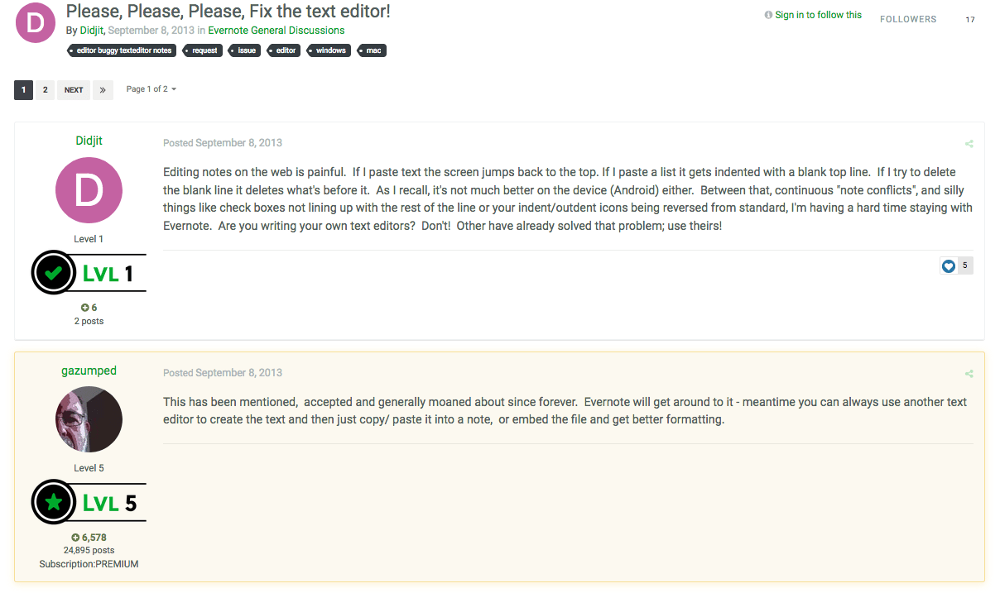
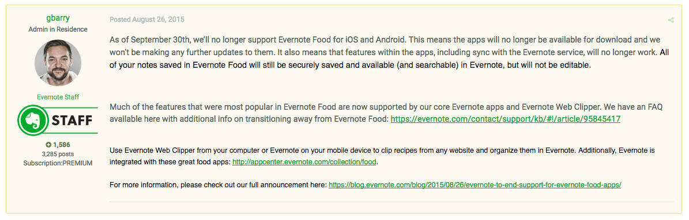
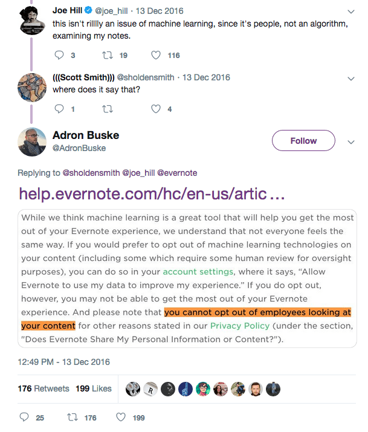
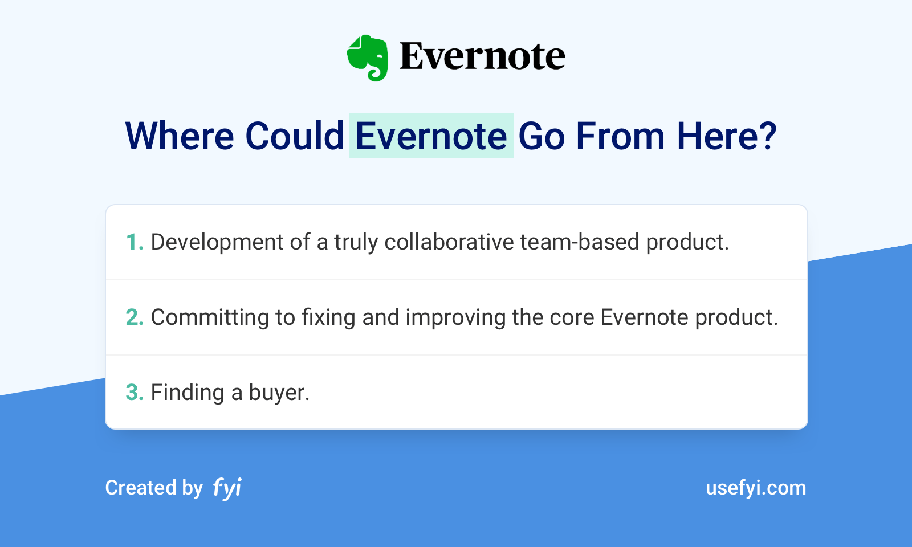

Legendary investor, programmer, and Y Combinator co-founder Paul Graham once wrote that one of the best ways to come up with ideas for your next startup is to ask what product you wish someone else would make for you.  

传奇投资者、程序员兼 Y Combinator 联合创始人 Paul Graham 曾写道，为下一家初创企业想出创意的最佳方法之一就是询问您希望别人为您生产什么产品。

For Stepan Pachikov, founder of Evernote, that product was a way to help him remember things.  

对于 Evernote 的创始人 Stepan Pachikov 来说，该产品是帮助他记住事情的一种方式。

Although Pachikov first began working on what ultimately became Evernote back in 2002, his fascination with human memory stems from his experiences growing up in the former Soviet Union.  

尽管帕奇科夫早在 2002 年就开始研究最终成为 Evernote 的产品，但他对人类记忆的迷恋源于他在前苏联的成长经历。  

To Pachikov, Evernote wasn’t just another app or a way to capitalize on Silicon Valley’s burgeoning obsession with personal productivity.  

对于帕奇科夫来说，Evernote 不仅仅是另一个应用程序，也不仅仅是一种利用硅谷对个人生产力日益增长的痴迷的方式。  

It was an extension of the human mind itself that would let users remember everything.  

它是人类思维本身的延伸，可以让用户记住一切。

Evernote has come a long way since Pachikov began working on the app seventeen years ago. Evernote was and remains one of the best examples of what a freemium product can be.  

自从帕奇科夫 17 年前开始开发 Evernote 应用程序以来，Evernote 已经取得了长足的进步。 Evernote 过去是、现在仍然是免费增值产品的最佳范例之一。  

Despite this, Evernote has been plagued by a series of managerial missteps and failed product launches, and the company’s future is far from certain.  

尽管如此，Evernote 仍受到一系列管理失误和产品发布失败的困扰，公司的未来还远未确定。

Here are some of the things I’ll be exploring in this article:  

以下是我将在本文中探讨的一些内容：

-   Why timing was so crucial to Evernote’s success, and how co-founder and former CEO Phil Libin’s vision for the product created vital tailwind for Evernote’s growth  
    
    为什么时机对于 Evernote 的成功如此重要，以及联合创始人兼前首席执行官 Phil Libin 对产品的愿景如何为 Evernote 的增长创造了重要的推动力
-   How the company resisted investor pressure and remained true to their convictions about the value of Evernote as a freemium product  
    
    公司如何顶住投资者的压力并始终坚信 Evernote 作为免费增值产品的价值
-   How Evernote lost sight of its original vision and how this almost doomed the company  
    
    Evernote 如何失去了最初的愿景，以及这几乎注定了公司的灭亡

The idea for Evernote began with the personal quest of its founder, Stepan Pachikov. He aimed to solve a giant problem: overcoming the limitations of human memory.  

Evernote 的想法始于其创始人 Stepan Pachikov 的个人追求。他的目标是解决一个巨大的问题：克服人类记忆的局限性。

## 2008-2011: Creating an Impossible Vision  

2008-2011：创造不可能的愿景

Stepan Pachikov wanted to remember everything.  

斯捷潘·帕奇科夫想记住一切。

Pachikov is one of Silicon Valley’s most visionary technologists.  

帕奇科夫是硅谷最有远见的技术专家之一。  

A pioneer of virtual reality, computerized handwriting analysis, and optical character recognition, Pachikov has spent much of his life working to solve some of computing’s most challenging problems.  

作为虚拟现实、计算机手写分析和光学字符识别领域的先驱，帕奇科夫一生的大部分时间都致力于解决一些最具挑战性的计算问题。

Trained in economic mathematics, Pachikov earned his doctorate in fuzzy logic from the Academy of Sciences of the Union of Soviet Socialist Republics in Moscow.  

帕奇科夫接受过经济数学方面的培训，并在莫斯科苏维埃社会主义共和国联盟科学院获得了模糊逻辑博士学位。  

As a scientist living and working under Communist rule in Soviet Russia, Pachikov was no stranger to the forgotten.  

作为一名在苏联共产党统治下生活和工作的科学家，帕奇科夫对那些被遗忘的人并不陌生。  

He saw firsthand how generations of culture and collective memory were jeopardized by the gradual collapse of Soviet Russia.  

他亲眼目睹了几代人的文化和集体记忆如何因苏维埃俄罗斯的逐渐崩溃而受到危害。  

With few ways to preserve them, even key moments from his own past had been lost to the march of time.  

由于几乎没有办法保存它们，甚至连他自己过去的关键时刻也随着时间的流逝而消失了。

_“Even 30 years ago, I had already lost so much information. Names. Jokes. Phrases. Facts.  

“即使在 30 年前，我也已经丢失了很多信息。名字。笑话。短语。事实。  

I can study and re-learn what I have forgotten, but I cannot go back to my school years, my college years, and recollect what I knew. Teachers. Friends. Experiences.  

我可以学习和重新学习我忘记的东西，但我无法回到我的学生时代、我的大学时代，回忆我所知道的东西。教师。朋友们。经验。  

In the past 20 years, I have put 75,000 pictures into my photo database. But pictures from before that are lost.” — Stepan Pachikov, founder of Evernote  

在过去的20年里，我已经将75,000张照片放入我的照片数据库中。但之前的照片都丢失了。” — 斯捷潘·帕奇科夫 (Stepan Pachikov)，Evernote 创始人_

Pachikov saw computers as a means of not only preserving individual and cultural memories, but also as a way to empower children growing up in the political and social turmoil of Russia in the 1980s.  

帕奇科夫认为，计算机不仅是保存个人和文化记忆的一种手段，也是赋予在 20 世纪 80 年代俄罗斯政治和社会动荡中成长的儿童权力的一种方式。  

To that end, Pachikov began working with his friend and world-renowned chess grandmaster Garry Kasparov in 1986, and the two men formed the country’s first computer club in Moscow.  

为此，帕奇科夫于 1986 年开始与他的朋友、世界著名国际象棋大师加里·卡斯帕罗夫 (Garry Kasparov) 合作，两人在莫斯科组建了该国第一个计算机俱乐部。  

Pachikov and Kasparov devised a way of encouraging Russian children to develop their handwriting skills under the guise of a simple game.  

帕奇科夫和卡斯帕罗夫设计了一种通过简单游戏鼓励俄罗斯儿童发展书写技能的方法。  

This game ultimately became Paragraph, the world’s first commercial computerized handwriting recognition software.  

这款游戏最终成为Paragraph，世界上第一个商业计算机手写识别软件。

The results of Pachikov’s educational experiments were mixed, but his work attracted the attention of Apple, Inc., which asked Pachikov to develop his handwriting recognition software for the Newton handheld computer.  

帕奇科夫的教育实验结果好坏参半，但他的工作引起了苹果公司的注意，苹果公司要求帕奇科夫为牛顿手持电脑开发手写识别软件。  

Pachikov left the frigid temperatures of Moscow for the warmth of Cupertino in Northern California, and made a new home in the United States.  

帕奇科夫离开了寒冷的莫斯科，前往温暖的北加州库比蒂诺，并在美国安了新家。

Apple’s Newton project—and, by extension, Paragraph—ultimately failed. Undeterred, Pachikov once again turned his attention to educating children.  

苹果公司的牛顿项目（以及由此延伸的 Paragraph）最终失败了。帕奇科夫没有被吓倒，他再次将注意力转向儿童教育。  

He embarked on a range of projects in the ’90s, including a cutting-edge virtual reality product that allowed children to learn about history by traveling back through time to the age of the ancient Greeks.  

他在 90 年代开始了一系列项目，其中包括一款尖端的虚拟现实产品，该产品可以让孩子们通过穿越时空回到古希腊时代来了解历史。

It wasn’t until 2002 that Pachikov began working on what would later become Evernote.  

直到 2002 年，帕奇科夫才开始开发后来的 Evernote。

Aside from his lifelong obsession with preserving and expanding human memory, Pachikov’s career has been defined by the ambition of his ideas.  

除了毕生致力于保存和扩展人类记忆之外，帕奇科夫的职业生涯还取决于他的想法的雄心壮志。  

Pachikov’s vision of the future has always been a step ahead of the technology of the day.  

帕奇科夫对未来的愿景始终领先于当今的技术一步。  

Initially, Pachikov’s vision for Evernote was much closer to the brain-machine interfaces promised by neurotech companies such as Elon Musk’s Neuralink.  

最初，帕奇科夫对 Evernote 的愿景更接近埃隆·马斯克 (Elon Musk) 的 Neuralink 等神经科技公司承诺的脑机接口。  

Pachikov wanted to develop a technology that would serve as an intermediary between man and machine.  

帕奇科夫想要开发一种能够充当人与机器之间中介的技术。

However, despite the fantastical nature of Evernote as a concept, the product would have solidly practical applications.  

然而，尽管 Evernote 作为一个概念具有奇特的性质，但该产品将具有坚实的实际应用。

_“When you can’t remember somebody’s name, you look stupid. Memory and smartness are integrated.  

“当你记不住某人的名字时，你看起来很愚蠢。记忆力和智慧是融为一体的。  

We all have hundreds of thousands of pieces of information, but it’s useless if we can’t find any of it.  

我们都有几十万条信息，但如果我们找不到一条，那就毫无用处。  

In business, the worst thing we can say is, ‘Oh, I’m sorry, I forgot your name.’ This is a product I need myself.” — Stepan Pachikov, founder of Evernote  

在商业中，我们能说的最糟糕的事情就是，‘哦，对不起，我忘记了你的名字。’这是我自己需要的产品。” — 斯捷潘·帕奇科夫 (Stepan Pachikov)，Evernote 创始人_

Although Pachikov’s nascent idea shared little in common with Google, both products were grounded in the same basic principle: in the future, knowing how to find information would be far more important than remembering information.  

尽管帕奇科夫的新兴想法与谷歌几乎没有共同之处，但这两种产品都基于相同的基本原则：在未来，知道如何查找信息将比记住信息重要得多。

Pachikov worked on the prototype of Evernote (which was initially known as EverNote) for two years, and released a beta version of the tool for Windows in 2004. Pachikov’s decision to target Microsoft’s flagship operating system made sense.  

帕奇科夫在 Evernote（最初称为 EverNote）原型上工作了两年，并于 2004 年发布了该工具的 Windows 测试版。帕奇科夫瞄准微软旗舰操作系统的决定是有道理的。  

In 2002, [Microsoft controlled almost 94% of the client-side operating system market](https://www.itworld.com/article/2804237/operating-systems/microsoft-dominance-of-os-market-grows--idc-study-says.html). Apple’s OS X, which had been released just a year previously in March 2001, accounted for little more than 2% of the market.  

2002年，微软控制了近94%的客户端操作系统市场。苹果公司的 OS X 于一年前的 2001 年 3 月发布，仅占市场份额的 2% 多一点。  

Pachikov’s early prototype was a little rough around the edges, but much of the core functionality was there––including the electronic handwriting recognition tech that Pachikov had pioneered at Paragraph.  

帕奇科夫的早期原型有些粗糙，但大部分核心功能已经存在，包括帕奇科夫在 Paragraph 首创的电子手写识别技术。

[Source: phoneArena  来源：phoneArena](https://www.phonearena.com/news/Two-thirds-of-app-users-in-U.S.-have-paid-for-at-least-one_id30191)

In 2006, on the other side of the United States in Boston, serial entrepreneur Phil Libin was planning his next move.  

2006 年，在美国的另一边波士顿，连续创业者 Phil Libin 正在计划他的下一步行动。  

Like Pachikov, Libin had emigrated from Russia to the United States as a young man. And, like Pachikov, Libin was fascinated by the limitations of human memory.  

和帕奇科夫一样，利宾年轻时也从俄罗斯移民到美国。而且，和帕奇科夫一样，利宾对人类记忆的局限性很着迷。  

Having launched and sold a successful e-commerce software company and an information technology security firm, Libin was researching the possibilities of augmenting human memory electronically.  

利宾创办并出售了一家成功的电子商务软件公司和一家信息技术安全公司后，正在研究以电子方式增强人类记忆的可能性。  

His third venture, which Libin called Ribbon, would be an organizational tool that would help people save and access the information they needed, when they needed it.  

他的第三个项目，利宾称之为“Ribbon”，将成为一种组织工具，帮助人们在需要时保存和访问所需的信息。

It was then that Libin first heard about Pachikov’s EverNote project.  

就在那时，利宾第一次听说了帕奇科夫的 EverNote 项目。

EverNote and Ribbon were very similar in both form and function.  

EverNote 和 Ribbon 在形式和功能上都非常相似。  

However, Pachikov had made significant headway with EverNote by the time Libin was ready to begin developing his company’s own technology.  

然而，当利宾准备开始开发公司自己的技术时，帕奇科夫已经在 EverNote 方面取得了重大进展。  

Libin traveled from Boston to Silicon Valley to meet Pachikov and the two men decided to merge their two fledgling companies rather than compete with one another.  

利宾从波士顿前往硅谷会见帕奇科夫，两人决定合并两家羽翼未丰的公司，而不是相互竞争。

Both Pachikov and Libin were dissatisfied with the limitations of the human mind.  

帕奇科夫和利宾都对人类思维的局限性感到不满。  

However, while both men were idealistic, even philosophic, about their idea, Libin possessed the keen eye for business that Pachikov lacked––a quality that Pachikov believed made Libin an ideal partner.  

然而，虽然两人对自己的想法都很理想主义，甚至很哲学，但利宾拥有帕奇科夫所缺乏的敏锐的商业眼光——帕奇科夫认为，正是这种品质使利宾成为理想的合作伙伴。

_“\[Phil Libin\] was smart, educated, and I was completely confident that he would be a much better CEO than I was. His Russian is better than my English.  

“\[菲尔·利宾\]很聪明，受过良好的教育，我完全相信他会成为比我更好的首席执行官。他的俄语比我的英语好。  

I believed he would transform the company and make it successful.” — Stepan Pachikov, founder of Evernote  

我相信他会改变公司并使其取得成功。” — 斯捷潘·帕奇科夫 (Stepan Pachikov)，Evernote 创始人_

Upon the merging of the two companies, Libin set to work.  

两家公司合并后，利宾开始工作。  

One of Libin’s first tasks was to streamline the various internal projects that Pachikov and his team had been working on, and he insisted that the company focus the entirety of its efforts on refining the idea behind their product: empowering users to capture, search, and store any and all information, wherever they were.  

利宾的首要任务之一是简化帕奇科夫和他的团队一直在从事的各种内部项目，他坚持认为公司将全部精力集中在完善其产品背后的理念上：使用户能够捕获、搜索和发布内容。存储所有信息，无论它们位于何处。

However, Libin’s most significant contribution to the growing company came very early on, when Libin steered Evernote away from Windows towards a bold new frontier––mobile.  

然而，利宾对这家不断发展的公司最重要的贡献很早就出现了，当时利宾带领 Evernote 从 Windows 转向了一个大胆的新领域——移动。

The central premise behind Evernote was accessibility. If Evernote was to help people remember everything, then users had to be able to capture everything. That meant mobile.  

Evernote 背后的核心前提是可访问性。如果 Evernote 想要帮助人们记住一切，那么用户就必须能够捕捉一切。这意味着移动。  

However, in 2006, mobile was far from the dominant platform it is today. Apple’s flagship iPhone wouldn’t be released for another year, and [by Libin’s own admission](https://mashable.com/2011/08/11/evernote-phil-libin-interview/) betting big on mobile was exactly that—a gamble.  

然而，在 2006 年，移动平台远未达到今天的主导平台。苹果的旗舰 iPhone 还要一年才能发布，利宾自己也承认，在移动领域下大赌注就是一场赌博。

_“From the start, we made a big promise to our users—we would help them remember everything.  

“从一开始，我们就向用户做出了很大的承诺——我们将帮助他们记住一切。  

In order to live up to that, Evernote would need to be easily accessible from every computer, phone or other device that a person used, for the rest of their lives.  

为了实现这一目标，Evernote 需要能够在人们余生中使用的每台电脑、手机或其他设备上轻松访问。  

So, it wasn’t that we predicted the rise of mobile, as much as we felt that mobile would be critical to our success.” — Phil Libin, former CEO of Evernote  

因此，我们并不是预测了移动设备的崛起，而是认为移动设备对我们的成功至关重要。” ——菲尔·利宾 (Phil Libin)，Evernote 前首席执行官_

That gamble paid off. When the iPhone launched in 2007, Evernote was ready. The product looked and felt completely different from its earlier incarnation.  

这场赌博得到了回报。当 iPhone 于 2007 年推出时，Evernote 已经做好了准备。该产品的外观和感觉与其早期版本完全不同。  

Evernote’s aesthetic was sleek, clean, and stylish, and it felt fantastic to use on mobile.  

Evernote 的审美是圆滑、干净、时尚，在移动设备上使用感觉非常棒。

[Source: Archive.org  资料来源：Archive.org](https://web.archive.org/web/20081201043203/http://www.evernote.com/)

However, what drove much of Evernote’s initial adoption wasn’t the aesthetic of its mobile app––it was the emergence of the App Store.  

然而，Evernote 最初被采用的主要原因并不是其移动应用程序的美观，而是 App Store 的出现。  

Just as smartphone apps were a brand-new way of using software, app marketplaces were brand-new, ready-made distribution channels that offered developers immediate access to millions of potential users.  

正如智能手机应用程序是一种全新的软件使用方式一样，应用程序市场也是全新的现成分销渠道，可以让开发人员立即接触到数百万潜在用户。  

Evernote’s engineers worked tirelessly to ensure that Evernote would be available as each new app marketplace launched, each of which expanded Evernote’s footprint considerably.  

Evernote 的工程师孜孜不倦地工作，以确保在每个新的应用程序市场推出时都可以使用 Evernote，每个应用程序市场都大大扩展了 Evernote 的足迹。

Libin’s singular focus drove much of Evernote’s initial development.  

利宾的独特关注推动了 Evernote 的早期发展。  

In 2008, Evernote launched in a limited private beta that was aimed squarely at the cult of productivity that had taken root across Silicon Valley.  

2008 年，Evernote 推出了有限的私人测试版，其直接目标是在硅谷扎根的生产力崇拜。

[Source: Keyword Suggest  来源：关键词建议](http://keywordsuggest.org/gallery/431092.html)

Libin’s vision for Evernote was a seamless experience that successfully bridged the gap between the physical and digital worlds.  

Libin 对 Evernote 的愿景是提供无缝体验，成功弥合物理世界和数字世界之间的差距。  

To accomplish this, Evernote treated every piece of information—from actual handwritten notes to saved URLs—as a “note,” which are organized into thematic “notebooks.” It’s a clever, familiar convention that Evernote uses to this day.  

为了实现这一目标，Evernote 将每一条信息（从实际手写笔记到保存的 URL）都视为“笔记”，并组织成主题“笔记本”。这是 Evernote 至今仍在使用的一种巧妙且熟悉的惯例。  

Even early on, Evernote’s functionality was impressive. Users could save all kinds of information within seconds.  

即使在早期，Evernote 的功能也令人印象深刻。用户可以在几秒钟内保存各种信息。  

Digitized handwritten notes, audio recordings, links, pictures taken on a user’s mobile device, saved images, to-do lists, clipped articles—virtually anything users could find online could be saved, archived, and synched across multiple devices.  

数字化手写笔记、录音、链接、用户移动设备上拍摄的照片、保存的图像、待办事项列表、剪辑的文章——几乎所有用户可以在网上找到的东西都可以在多个设备上保存、存档和同步。

However, the real brilliance of Evernote was its search functionality, what Libin described as “the electronic version of having something at the tip of your tongue.” Users could search for saved items using an amazing range of search criteria, including date, keyword, topic, location, contacts, or any combination of the above.  

然而，Evernote 真正的亮点在于它的搜索功能，利宾将其描述为“舌尖上的东西的电子版本”。用户可以使用一系列令人惊叹的搜索条件来搜索已保存的项目，包括日期、关键字、主题、位置、联系人或上述的任意组合。  

Users could even download add-ons that allowed notes to be searched by the dominant color of an image.  

用户甚至可以下载附加组件，允许通过图像的主色搜索笔记。  

This made it much easier to find saved notes, as users only had to recall a single detail to start a search, much like the way our memories work.  

这使得查找保存的笔记变得更加容易，因为用户只需回忆一个细节即可开始搜索，就像我们的记忆工作方式一样。  

This wasn’t just vital to Evernote’s core purpose.  

这不仅对 Evernote 的核心目标至关重要。  

It was essential in recreating the rewarding, satisfying feeling of remembering something that would come to define the experience of using Evernote as a product.  

它对于重新创造记住某些事情的回报和满足感至关重要，而这种感觉将定义使用 Evernote 作为产品的体验。

_“Evernote finds the way your mind works and gives you more and more hooks into your memories.” — Andrew Sinkov, former VP of Marketing for Evernote  

“Evernote 发现了你思维的运作方式，并让你越来越多地融入你的记忆中。” — Andrew Sinkov，Evernote 前营销副总裁_

This sense of fun and satisfaction was critical in Libin’s view. Evernote’s unique position in the rapidly growing personal productivity space wasn’t lost on the company’s CEO.  

在利宾看来，这种乐趣和满足感至关重要。 Evernote 在快速增长的个人生产力领域的独特地位并没有让该公司的首席执行官忽视。  

Evernote faced incumbent competitors at every turn. Box, Dropbox, iCloud, and Google Drive were already dominating online storage.  

Evernote 处处面临着现有的竞争对手。 Box、Dropbox、iCloud 和 Google Drive 已经主导了在线存储。  

Instapaper offered web clipping tools, as did its main competitor, the now-defunct Spool.  

Instapaper 提供网页剪切工具，它的主要竞争对手、现已不复存在的 Spool 也是如此。  

Evernote preceded the wave of free online image editing tools that began with the launch of Canva back in 2012, but Evernote’s image-editing tools were far from unique.  

Evernote 引领了自 2012 年 Canva 推出以来掀起的免费在线图像编辑工具浪潮，但 Evernote 的图像编辑工具远非独一无二。

To Libin, the experience of using Evernote would be its competitive advantage.  

对于利宾来说，使用 Evernote 的体验将是其竞争优势。

Libin’s product philosophy was responsible for one of Evernote’s few hardware-based flaws—storing data natively on users’ machines and devices.  

Libin 的产品理念导致了 Evernote 为数不多的基于硬件的缺陷之一——将数据本地存储在用户的机器和设备上。  

Libin believed that a responsive feel was crucial to the Evernote experience, and that the delay between searching for something and finding something should be infinitesimal.  

Libin 认为，响应式感觉对于 Evernote 体验至关重要，并且搜索某物和找到某物之间的延迟应该是极小的。  

This is the same principle that drove much of Spotify’s early development. Daniel Ek wanted [Spotify to feel like users had the entirety of the world’s music right on their hard drives](https://producthabits.com/how-spotify-built-a-20-billion-business-by-changing-how-people-listen-to-music/). Libin wanted the Evernote experience to feel similarly responsive, and believed that this would be central to user satisfaction with that experience.  

这与推动 Spotify 早期发展的原则相同。 Daniel Ek 希望 Spotify 能让用户感觉他们的硬盘上拥有全世界的音乐。 Libin 希望 Evernote 体验具有类似的响应能力，并相信这对于用户对该体验的满意度至关重要。

Unfortunately, Libin was fighting a losing battle. As Evernote doubled down on native storage, every other service provider was focusing on the cloud.  

不幸的是，利宾正在打一场失败的战斗。随着 Evernote 在本地存储上加倍努力，其他所有服务提供商都开始关注云。  

Although this decision didn’t create any existential problems for Evernote in 2008, it was the first sign that Evernote was diverging from the broader trends in tech that would cause the company so many headaches later on.  

尽管这一决定并没有给 Evernote 在 2008 年带来任何生存问题，但这是 Evernote 偏离更广泛的技术趋势的第一个迹象，而这一趋势后来给该公司带来了许多麻烦。

Evernote launched as a freemium product. This was vitally important to Libin.  

Evernote 作为免费增值产品推出。这对利宾来说至关重要。  

He believed that Evernote would become increasingly valuable to users the longer they used the product and the more they captured and stored within it.  

他相信，Evernote 对用户来说，使用该产品的时间越长，捕获和存储的内容越多，其价值就会越高。  

As such, Libin wanted to make Evernote as sticky as possible—and he did so by making the free version of the product incredibly generous.  

因此，利宾希望让 Evernote 尽可能具有粘性，他通过将该产品的免费版本变得异常慷慨来做到这一点。  

There were virtually no feature restrictions or other incentives for users to upgrade from free to paid plans.  

实际上，用户从免费计划升级到付费计划没有任何功能限制或其他激励措施。  

In fact, the only benefit of upgrading to a paid, $5-per-month subscription was additional storage space.  

事实上，升级到每月 5 美元的付费订阅的唯一好处是额外的存储空间。

_“I don’t need to squeeze money out of you. I’ll have the rest of your life to take your money. It’s my long-term greedy strategy.  

“我不需要从你身上榨取钱。我会用你的余生来拿走你的钱。这是我的长期贪婪策略。  

Our slogan is, ‘We’d rather you stay than pay.'” — Phil Libin, former CEO of Evernote  

我们的口号是，‘我们宁愿你留下来，也不愿付钱。’”——菲尔·利宾 (Phil Libin)，Evernote 前首席执行官_

Libin’s attitudes toward freemium software may have been popular with Evernote’s growing userbase, but it was repellent to investors.  

利宾对免费增值软件的态度可能受到 Evernote 不断增长的用户群的欢迎，但投资者却对此感到反感。  

One VC after another turned Libin’s company down.  

一位又一位风险投资家拒绝了利宾的公司。  

There were no complaints about the product—far from it—but there just wasn’t enough incentive for free users to upgrade to paid plans.  

对该产品没有任何抱怨——远非如此——但没有足够的动力让免费用户升级到付费计划。

After struggling to secure institutional investment, Evernote entered into an agreement with a European VC that would have seen the company receive $10M in funding.  

在努力争取机构投资后，Evernote 与一家欧洲风险投资公司达成了一项协议，该公司将获得 1000 万美元的资金。  

On the morning in October 2008 when the two parties were due to meet to sign the papers, the investor canceled the meeting and pulled the offer of funding.  

2008 年 10 月上午，当双方原定会面签署文件时，投资者取消了会议并撤回了融资提议。  

With just three weeks’ worth of cash at hand, Libin came to the grim realization that Evernote as a company would not survive.  

利宾手头只有三个星期的现金，他残酷地意识到 Evernote 作为一家公司将无法生存。  

With little money and fewer prospects, Libin agonized about how he would break the news to his team and employees.  

由于资金匮乏，前景黯淡，利宾苦恼于如何向团队和员工透露这个消息。

It was around that time that Libin received an email from a Swedish user who loved Evernote.  

就在那时，利宾收到了一封来自一位喜爱 Evernote 的瑞典用户的电子邮件。  

The user, whose identity remains a secret to this day, told Libin that Evernote had made him happier and more productive.  

该用户的身份至今仍然是个秘密，他告诉利宾，Evernote 让他更快乐、更有效率。  

However, the Swedish user didn’t want to just tell Libin how much they loved the app—they wanted to invest.  

然而，这位瑞典用户并不想只是告诉利宾他们有多喜欢这个应用程序——他们想投资。  

Libin admitted that the company was in need of funding, at which point the mysterious Swedish Evernote evangelist offered to front the company $500,000.  

利宾承认公司需要资金，此时这位神秘的瑞典 Evernote 布道者提出为公司提供 50 万美元。

Evernote was saved. Evernote 已保存。

_“He was just a computer nerd and entrepreneur. He had some money and fell in love with our product, simple as that. It was just good luck.  

“他只是一个电脑迷和企业家。他有一些钱并且爱上了我们的产品，就这么简单。这只是运气好而已。  

Had I gone to bed ten minutes earlier, I wouldn’t have opened his email right away and probably gone into work and closed the business.” — [Phil Libin](https://www.americanexpress.com/en-us/business/trends-and-insights/articles/phil-libin-of-evernote-building-an-empire/), former CEO of Evernote  

如果我早十分钟上床睡觉，我就不会立即打开他的电子邮件，可能会去上班并关闭公司。” ——菲尔·利宾 (Phil Libin)，Evernote 前首席执行官_

Evernote’s anonymous benefactor didn’t just save the company, they opened the door to the kind of institutional investment Evernote had been chasing before the global economy tanked.  

Evernote 的匿名捐助者不仅拯救了公司，还为 Evernote 在全球经济衰退之前一直在追逐的机构投资打开了大门。  

Evernote kicked off a series of funding rounds over the next two years that propelled the company to new heights of growth.  

Evernote 在接下来的两年中启动了一系列融资，推动公司达到新的增长高度。  

The company started by raising $26M as part of its Series A round led by DoCoMo Capital in September 2009. Two months later in November 2009, Evernote raised another $10M as part of its Series B round led by Morgenthaler Ventures and Sequoia Capital.  

该公司于 2009 年 9 月在 DoCoMo Capital 领投的 A 轮融资中筹集了 2600 万美元。两个月后的 2009 年 11 月，Evernote 在 Morgenthaler Ventures 和红杉资本领投的 B 轮融资中又筹集了 1000 万美元。  

Just under a year later in October 2010, Evernote raised another $20M as part of its Series C round, again led by Sequoia, as well as another $50M as part of a venture round led by Sequoia in July 2011.  

不到一年后的 2010 年 10 月，Evernote 在同样由红杉资本领投的 C 轮融资中又筹集了 2000 万美元，并在 2011 年 7 月由红杉资本领投的风险投资轮中又筹集了 5000 万美元。

Evernote had gone from venture capital pariah to Silicon Valley darling in less than three years, raising a total of more than $100M in the process.  

Evernote 在不到三年的时间里从风险投资的贱民变成了硅谷的宠儿，在此过程中筹集的资金总额超过 1 亿美元。

Libin’s company took full advantage of its sudden reversal of fortunes, using much of its new funding to expand its engineering teams and expand beyond the company’s headquarters in Redwood City, California.  

利宾的公司充分利用了命运突然逆转的机会，利用大部分新资金扩大了工程团队，并将业务扩展到加利福尼亚州雷德伍德城的公司总部之外。  

One thing Evernote didn’t spend a cent of its newfound fortune on, however, was advertising.  

然而，Evernote 并没有将新获得的财富中的一分钱花在广告上。

Since launching in private beta in 2008, Evernote’s growth had been gradual, steady, and entirely organic.  

自 2008 年推出内测版以来，Evernote 的增长一直是渐进、稳定且完全有机的。  

The product had more than 125,000 users before Evernote emerged from its closed beta, thanks in part to an article on TechCrunch that drove several thousand sign-ups.  

在 Evernote 结束内测之前，该产品已经拥有超过 125,000 名用户，这在一定程度上要归功于 TechCrunch 上的一篇文章吸引了数千名注册用户。

[Source: SlideShare  来源：SlideShare](https://www.slideshare.net/nasakin/evernote-overview-sept-2011)

During the closed beta, Evernote was invite-only.  

在内测期间，Evernote 仅限受邀者参与。  

However, while many products use invites as a marketing strategy to capitalize on exclusivity of access, Evernote did so out of an abundance of caution.  

然而，虽然许多产品使用邀请作为营销策略来利用访问的排他性，但 Evernote 这样做是出于非常谨慎的考虑。  

Between the technical overhead of synchronizing native applications across multiple platforms in real time and working with a new type of backend server architecture, Libin’s engineers were more concerned with the stability of their systems than manufacturing hype.  

在跨多个平台实时同步本机应用程序和使用新型后端服务器架构的技术开销之间，Libin 的工程师更关心系统的稳定性，而不是制造炒作。

_“The fact that you have to sign up and send around invites to get in actually generated some buzz.  

“事实上，你必须注册并发送邀请才能加入，这实际上引起了一些轰动。  

That was never our intention; we never thought of the closed beta as a marketing exercise. We were frankly terrified that everything would crash all the time.” — [Phil Libin](http://www.doeswhat.com/2012/02/25/interview-with-phil-libin-evernote), former CEO of Evernote  

这从来都不是我们的本意。我们从未将内测视为一种营销活动。坦白说，我们很害怕一切都会崩溃。” ——菲尔·利宾 (Phil Libin)，Evernote 前首席执行官_

Evernote’s freemium model may have been a dislike for investors, but Libin’s instincts about slow-burn, long-term growth had been proven right.  

投资者可能不喜欢 Evernote 的免费增值模式，但事实证明，利宾关于缓慢燃烧、长期增长的直觉是正确的。  

In early 2011, just three years after launching, Evernote became profitable. Evernote had 80 employees, more than 10M users, and annual sales of approximately $16M.  

2011 年初，即推出仅三年后，Evernote 就开始盈利。 Evernote 拥有 80 名员工，超过 1000 万用户，年销售额约为 1600 万美元。

Having been dangerously close to the brink of disaster, Evernote had emerged from the global financial crisis not only unscathed, but flush with VC cash.  

一度濒临灾难边缘的 Evernote 在全球金融危机中不仅毫发无伤，而且还拥有大量风险投资资金。  

The company had achieved profitability in just three years, and the future looked bright for Evernote––until the company began to lose its way in 2011 with a series of failed product launches that jeopardized everything the company had built.  

该公司在短短三年内就实现了盈利，Evernote 的未来看起来一片光明，直到 2011 年该公司开始迷失方向，一系列失败的产品发布危及了该公司所建立的一切。

## 2011-2015: New Products, New Markets, New Problems  

2011-2015：新产品、新市场、新问题

Evernote began the period from 2011 to 2015 in an incredibly strong position. Evernote was already profitable and had more money in the bank than it knew what to do with.  

2011 年至 2015 年期间，Evernote 处于令人难以置信的强势地位。 Evernote 已经实现盈利，而且银行里的钱也多得不知所措。  

The company was growing steadily, hiring new talent and expanding into new locations. And, most importantly, the product was attracting upward of a million new users every month.  

该公司正在稳步发展，聘请新人才并扩展到新地点。最重要的是，该产品每月吸引超过一百万新用户。  

However, the honeymoon period didn’t last.  

然而，蜜月期并没有持续太久。  

In an attempt to diversify its revenue streams, the company embarked upon a series of disastrous product launches that confused users and investors alike—all of which took the company farther and farther away from the core vision of its founders.  

为了实现收入来源多元化，该公司推出了一系列灾难性的产品，让用户和投资者都感到困惑——所有这些都让公司离创始人的核心愿景越来越远。

In the summer of 2011, Evernote released the first of three standalone products it would launch over the next six months: Evernote Peek.  

2011 年夏天，Evernote 发布了将在未来六个月内推出的三个独立产品中的第一个：Evernote Peek。  

The first Smart Cover app for Apple’s newly released iPad 2, Peek was a simple trivia application that leveraged the responsive wake and sleep function of the iPad’s Smart Cover feature.  

Peek 是 Apple 新发布的 iPad 2 上的第一个 Smart Cover 应用程序，它是一个简单的问答应用程序，利用了 iPad Smart Cover 功能的响应式唤醒和睡眠功能。  

Users could lift part of their iPad’s Smart Cover to see a trivia question on-screen. To reveal the answer, all they had to do was lift up the rest of the cover.  

用户可以抬起 iPad 智能保护盖的一部分，在屏幕上看到一个问答题。为了揭晓答案，他们所要做的就是掀起盖子的其余部分。  

Users could use either Peek’s questions or their own answers as the basis of Notebooks within the main Evernote app, but Peek offered users little real utility besides a momentary distraction.  

用户可以使用 Peek 的问题或他们自己的答案作为 Evernote 主应用程序中笔记本的基础，但 Peek 除了暂时分散注意力之外，几乎没有为用户提供任何实际用途。

A few months later in December 2011, Evernote released two more standalone apps for iOS: Evernote Food and Evernote Hello.  

几个月后，即 2011 年 12 月，Evernote 发布了另外两款 iOS 独立应用程序：Evernote Food 和 Evernote Hello。  

Essentially a simplified, specialized version of the main Evernote app, Evernote Food allowed users to record and log their meals in digital notebooks in much the same way the main Evernote app allowed them to capture and store everything else.  

Evernote Food 本质上是 Evernote 主应用程序的简化、专门版本，它允许用户在数字笔记本中记录和记录他们的膳食，就像 Evernote 主应用程序允许他们捕获和存储其他所有内容一样。  

Users could organize their culinary memories by tagging locations and other people, making it easier for users to remember what they ate, with whom, and where.  

用户可以通过标记地点和其他人来组织他们的烹饪记忆，让用户更容易记住他们吃什么、和谁一起吃、在哪里吃。  

The only real differences between Food and the main Evernote app were the integrations with Facebook and Twitter.  

Food 和 Evernote 主要应用程序之间唯一真正的区别是与 Facebook 和 Twitter 的集成。  

Customers could use these integrations to share details of their last amazing meal with their networks, and some food-specific navigational elements.  

客户可以使用这些集成与他们的网络分享他们最后一顿美餐的详细信息，以及一些特定于食物的导航元素。

[Source: Behance  来源：Behance](https://www.behance.net/gallery/6761663/Evernote-Food-for-iOS)

Evernote Hello was an even stranger app than Evernote Food. The purpose of Hello was ostensibly to make it easier for users to remember people.  

Evernote Hello 是一款比 Evernote Food 更奇怪的应用程序。 Hello 的目的表面上是为了让用户更容易记住人。  

Users could create contact listings within Hello in a similar way as adding a new contact in their phone.  

用户可以在 Hello 中创建联系人列表，就像在手机中添加新联系人一样。  

However, what made Hello such a bizarre—and ultimately damaging—product was the fact that everything in Evernote Hello had to be done manually. The app did not support [near-field communication](https://squareup.com/guides/nfc) (NFC), the communication protocol that powers contactless payment systems such as Apple Pay and allows mobile devices to exchange small amounts of data.  

然而，让 Hello 成为如此奇怪且最终具有破坏性的产品的原因是 Evernote Hello 中的所有内容都必须手动完成。该应用程序不支持近场通信 (NFC)，该通信协议为 Apple Pay 等非接触式支付系统提供支持，并允许移动设备交换少量数据。  

Hello didn’t even have a rudimentary electronic business card reader. Every field had to be completed by hand.  

你好甚至没有一个基本的电子名片阅读器。每个字段都必须手工完成。

Users and investors alike were completely baffled by Food and Hello. Firstly, the main Evernote app could already do everything Evernote Food could do and more.  

用户和投资者都对 Food 和 Hello 感到完全困惑。首先，Evernote 主应用程序已经可以完成 Evernote Food 可以做的所有事情，甚至更多。  

There was no incentive whatsoever for people to use Food over the main Evernote app.  

人们没有任何动力去使用 Food，而不是 Evernote 主应用程序。  

Secondly, the lack of NFC or e-card support for Hello was an unforgivable sin for a contact manager product.  

其次，对于联系人管理器产品来说，Hello 缺乏 NFC 或电子卡支持是不可原谅的罪过。  

Asking either users themselves or their new acquaintances to enter contact details manually was an immense barrier for the product to overcome and one with virtually no payoff for users.  

要求用户自己或他们的新朋友手动输入联系方式是该产品需要克服的巨大障碍，而且对用户来说几乎没有任何回报。

[Source: El androide libre  

资料来源：El androide libre](https://elandroidelibre.elespanol.com/2012/05/evernote-hello-una-nueva-agenda-para-no-olvidar-a-tus-nuevos-contactos.html)

It isn’t hard to see the reasoning behind the two products.  

不难看出这两种产品背后的原因。

Food selfies wouldn’t become the pop-cultural staple they are today for several years, but [many people were already enthusiastically photographing their food](https://www.nytimes.com/2010/04/07/dining/07camera.html) and sharing it on social media by 2011. Evernote Food was a transparent attempt by Evernote to become the primary destination for food photography, a position dominated by Flickr at that time.  

食物自拍在几年内还不会成为流行文化的主流，但到 2011 年，许多人已经开始热衷于拍摄自己的食物并在社交媒体上分享。Evernote Food 显然是 Evernote 的一次尝试，旨在成为人们的主要目的地。美食摄影，当时由 Flickr 主导。

Although it may not have seemed like it at the time, Evernote Hello aligned strongly with Pachikov’s original vision to help users remember everything.  

尽管当时看起来可能并非如此，但 Evernote Hello 与 Pachikov 帮助用户记住一切的最初愿景非常一致。  

Pachikov himself often used forgetting people’s names in professional settings as a prime example of how Evernote could be an indispensable part of people’s everyday lives.  

帕奇科夫本人经常以在专业环境中忘记别人的名字作为 Evernote 如何成为人们日常生活中不可或缺的一部分的典型例子。  

What Hello got wrong, however, was the execution.  

然而，Hello 的错误在于执行。  

If Hello had shipped with NFC support, it could have potentially opened up Evernote’s products to an entirely new market of business users. It had to be effortless to work.  

如果 Hello 附带 NFC 支持，它可能会为 Evernote 的产品打开一个全新的商业用户市场。工作必须毫不费力。  

As it stood, Evernote Hello was virtually useless and accomplished little besides diluting the Evernote brand.  

就目前情况而言，Evernote Hello 几乎毫无用处，除了削弱 Evernote 品牌之外，几乎没有取得什么成就。

Evernote’s increasing range of products was confusing, but didn’t dissuade investors.  

Evernote 不断增加的产品范围令人困惑，但并没有阻止投资者。  

In May 2012, Evernote officially earned “unicorn” status—a valuation of $1B or more—after raising $70M as part of its Series D round led by CBC Capital.  

2012 年 5 月，Evernote 在 CBC Capital 领投的 D 轮融资中筹集了 7000 万美元，正式获得“独角兽”地位——估值达到 10 亿美元或以上。

Evernote didn’t need to raise any more funding.  

Evernote 不需要筹集更多资金。  

The company still had much of the $96M it had raised to date, but the company planned to use its latest round to expand further into the Chinese market.  

该公司迄今为止筹集的 9600 万美元资金中的大部分仍处于持有状态，但该公司计划利用最新一轮融资进一步拓展中国市场。  

Unlike most Western tech companies, whose products are often quickly copied and rebranded by Chinese firms, Evernote decided to create its own clone for the Chinese market, Yinxiang Biji, or “memory notebook.” This would ultimately prove to be a smart play, and China would later become Evernote’s second largest market outside the United States.  

与大多数西方科技公司的产品经常被中国公司迅速复制和重新命名不同，Evernote 决定为中国市场创建自己的克隆产品——印象笔记，即“记忆笔记本”。这最终被证明是明智之举，中国后来成为 Evernote 除美国之外的第二大市场。

[Source: Ars Technica 来源：Ars Technica](https://arstechnica.com/information-technology/2013/03/evernote-so-useful-even-malware-loves-it/)

After a series of worrisome decisions and bewildering product launches, Evernote attempted to course-correct in August 2012 with the launch of Evernote Business.  

在经历了一系列令人担忧的决定和令人困惑的产品发布后，Evernote 试图在 2012 年 8 月纠正路线，推出了 Evernote 企业版。

This was a logical, if predictable, move for the company. By the time Evernote Business launched, Evernote was wildly popular.  

对于该公司来说，这是一个合乎逻辑、甚至可以预见的举措。当 Evernote 企业版推出时，Evernote 已经广受欢迎。  

The company had around 230 employees worldwide, tripled the number of developers working with Evernote’s API, and more than trippled its userbase from 12M to [more than 38M in just one year](https://techcrunch.com/2012/08/24/evernote-business-launch/).  

该公司在全球拥有约 230 名员工，使用 Evernote API 的开发人员数量增加了两倍，并且在短短一年内将其用户群从 1200 万增加到超过 3800 万，增加了两倍多。

Having accepted almost $100M in venture funding, Evernote was under considerable pressure to diversify its revenue streams and pursue business users more aggressively.  

在接受了近 1 亿美元的风险投资后，Evernote 面临着实现收入来源多元化和更积极地吸引商业用户的巨大压力。  

Professional users could connect their business account to their personal account effortlessly. This encouraged business users to bring Evernote to work with them, in [much the same way Slack had done in its early growth stage](https://producthabits.com/how-slack-became-a-5-billion-business-by-making-work-less-boring/). To sweeten the deal, users who connected personal accounts to business accounts had their basic freemium accounts upgraded to Evernote Premium.  

专业用户可以轻松地将他们的企业帐户连接到他们的个人帐户。这鼓励企业用户使用 Evernote 与他们一起工作，就像 Slack 在其早期发展阶段所做的那样。为了使交易更顺利，将个人帐户连接到企业帐户的用户将其基本免费增值帐户升级为 Evernote Premium。

[Source: Engadget  来源：Engadget](https://www.engadget.com/2012/12/04/evernote-business-launches/)

The pressure to go after business users intensified further in November 2012, when Evernote raised an additional $85M as part of its secondary market round led by British venture fund M8 Capital.  

2012 年 11 月，作为英国风险基金 M8 Capital 牵头的二级市场融资的一部分，Evernote 又筹集了 8500 万美元，追逐商业用户的压力进一步加剧。  

This brought Evernote’s total venture funding to more than $250M and a valuation of $2B.  

这使得 Evernote 的风险投资总额超过 2.5 亿美元，估值达到 20 亿美元。

Evernote’s next major product launch came almost a year later in September 2013. However, this product wasn’t another specialized version of the Evernote app, it was an extensive range of physical Evernote-branded products that the company would sell via its new Evernote Market.  

Evernote 的下一个主要产品发布是在大约一年后的 2013 年 9 月。然而，该产品并不是 Evernote 应用程序的另一个专门版本，而是该公司将通过其新的 Evernote 市场销售的一系列广泛的 Evernote 品牌实体产品。 。

[Source: The Verge  来源：边缘](https://www.theverge.com/2013/9/26/4769844/evernote-market-lifestyle)

In the space of a few short years, Evernote had achieved profitability, had millions of dollars in the bank, and the company was growing fast.  

在短短几年的时间里，Evernote 就实现了盈利，在银行里有数百万美元的存款，而且公司正在快速发展。

Evernote Market squandered almost all of the company’s brand equity for nothing.  

Evernote Market 几乎白白浪费了公司所有的品牌资产。

_“If you make different products and they’re great, people are like, ‘That’s genius!  

“如果你生产不同的产品并且它们都很棒，人们就会说，‘这真是天才！  

Clearly, the right thing to do.’ And if you focus on one product and it fails, people are like, ‘That company is no longer capable of innovating.'” — Phil Libin, former CEO of Evernote  

显然，这是正确的做法。’如果你专注于一种产品，但它失败了，人们就会说，‘那家公司不再有创新能力。’”——菲尔·利宾 (Phil Libin)，Evernote 前首席执行官_

It’s hard to understate the damage that the branded products sold through the Evernote Market inflicted on the Evernote brand. It made absolutely no sense.  

很难低估通过 Evernote 市场销售的品牌产品对 Evernote 品牌造成的损害。这完全没有意义。  

Users didn’t want Evernote-branded tablet styluses or Evernote Moleskine notebooks or Evernote backpacks. They wanted an organizational and productivity product that worked.  

用户不需要 Evernote 品牌的平板电脑手写笔、Evernote Moleskine 笔记本或 Evernote 背包。他们想要一款有效的组织和生产力产品。

The fact that the 2013 version of Evernote was widely considered the buggiest, most unstable version the company had released at that point added insult to injury.  

事实上，2013 版 Evernote 被广泛认为是该公司当时发布的错误最多、最不稳定的版本，这一事实雪上加霜。

Rather than fixing the software problems that users actually cared about, Evernote started selling branded backpacks instead.  

Evernote 并没有解决用户真正关心的软件问题，而是开始销售品牌背包。

Evernote Market wasn’t just a troubling sign that the company—and Phil Libin himself—had begun to lose its way.  

Evernote Market 不仅仅是一个令人不安的迹象，表明该公司以及菲尔·利宾本人已经开始迷失方向。  

It was another major step away from Pachikov’s vision of what Evernote could be.  

这距离帕奇科夫对 Evernote 的愿景又迈出了一大步。

Both Pachikov and Libin shared a desire to create a “100-year company,” but Evernote Market did nothing to work toward or advance Pachikov’s vision of Evernote as an extension of the human mind.  

帕奇科夫和利宾都有创建一家“100 年公司”的愿望，但 Evernote 市场没有采取任何行动来实现或推进帕奇科夫将 Evernote 作为人类思维的延伸的愿景。  

Pachikov’s vision was bold, ambitious, and transformative. By comparison, Evernote Market felt like a cheap cash grab.  

帕奇科夫的愿景大胆、雄心勃勃且具有变革性。相比之下，Evernote Market 感觉像是一个廉价的现金抢夺者。

The company’s fortunes went from bad to worse in 2014.  

2014年，该公司的命运每况愈下。

Despite its popularity, Evernote had developed a reputation among its growing userbase for being a buggy, unstable product.  

尽管 Evernote 很受欢迎，但它在不断增长的用户群中却因其存在缺陷且不稳定而享有盛誉。  

For the most part, such grumbling was largely restricted to complaints on the product’s official forums and the occasional rant on social media.  

在大多数情况下，此类抱怨主要局限于产品官方论坛上的投诉以及社交媒体上偶尔的咆哮。

That changed when Jason Kincaid, a former TechCrunch writer, published a post on his [personal blog](https://jasonkincaid.net/evernote-the-bug-ridden-elephant/) titled “Evernote, the bug-ridden elephant.”  

当 TechCrunch 前作家杰森·金凯德 (Jason Kincaid) 在他的个人博客上发表了一篇题为“Evernote，一只饱受虫子困扰的大象”的帖子后，情况发生了变化。

Kincaid had been an Evernote power user for years, having captured almost 7,000 notes since discovering the product.  

Kincaid 多年来一直是 Evernote 高级用户，自发现该产品以来已记录了近 7,000 条笔记。  

The post was a reluctant but scathing take-down of Evernote’s notorious instability, which Kincaid felt compelled to write after experiencing a slew of technical problems including corrupted files, incomplete backups, and a poor response from Evernote’s customer support team.  

这篇文章是对 Evernote 臭名昭著的不稳定问题的不情愿但严厉的批评，在经历了一系列技术问题（包括文件损坏、备份不完整以及 Evernote 客户支持团队的糟糕反应）后，Kincaid 觉得有必要写下这篇文章。  

The post went viral and garnered so much attention that Libin personally contacted Kincaid to apologize.  

这篇帖子被疯传并引起了如此多的关注，以至于利宾亲自联系金凯德道歉。

_“None of this has been life-shattering, but given how reliant I am on Evernote, it is deeply unnerving—now each note I instinctively leave myself is tinged with anxiety.  

“这一切都没有让我的生活崩溃，但考虑到我对 Evernote 的依赖程度，这让我深感不安——现在我本能地给自己留下的每条笔记都带着焦虑的色彩。  

I’m concerned that as I dig through my Evernote archive, I’ll encounter more corrupted audio notes, and, worse, my paranoia is increasingly convinced that there may have been notes that never were saved to the archive at all.” — Jason Kincaid  

我担心当我挖掘我的 Evernote 档案时，我会遇到更多损坏的音频笔记，更糟糕的是，我越来越相信可能有一些笔记根本从未保存到档案中。” — 杰森·金凯德_

A little more than a year later in October 2014, Evernote unveiled its latest product, Work Chat.  

一年多后的 2014 年 10 月，Evernote 推出了最新产品 Work Chat。  

A simple messaging client, Work Chat was designed to complement Evernote’s Business plans.  

Work Chat 是一款简单的消息传递客户端，旨在补充 Evernote 的商业计划。

It was also long overdue. Team-based collaboration had been an enormous blind spot in Evernote’s vision for years.  

这也是姗姗来迟的。多年来，基于团队的协作一直是 Evernote 愿景中的一个巨大盲点。  

The company had already missed one major consumer tech trend by ignoring the exodus of products and services migrating to the cloud and insisting on developing Evernote as a native app.  

该公司忽视了产品和服务迁移到云端的趋势，并坚持将 Evernote 开发为原生应用程序，从而错过了一项主要的消费技术趋势。

Similarly, Evernote had been designed as an organizational tool for individuals, when virtually every other productivity tool on the market emphasized team-based collaboration.  

同样，Evernote 被设计为个人的组织工具，而市场上几乎所有其他生产力工具都强调基于团队的协作。  

Work Chat was the first small step toward solving this urgent problem.  

工作聊天是解决这一紧迫问题的第一步。

Unfortunately for Evernote, that ship had sailed.  

不幸的是，对于 Evernote 来说，那艘船已经起航了。

As a whole, the company had been distracted by chasing the wrong revenue streams. Instead of building a solid team-based product, Evernote built a food app.  

总体而言，该公司因追逐错误的收入来源而分心。 Evernote 没有构建一个可靠的基于团队的产品，而是构建了一个食品应用程序。  

The company had expanded too quickly in the wrong direction.  

该公司扩张得太快，方向错误。

Everything besides the main Evernote app was a distraction from the company’s core mission to help people remember everything.  

除了主要的 Evernote 应用程序之外的所有内容都分散了公司帮助人们记住一切的核心使命。  

Products like Slack and Google’s G Suite had successfully made the leap from personal product to collaborative product, whereas Evernote had not.  

Slack 和 Google G Suite 等产品成功实现了从个人产品到协作产品的飞跃，而 Evernote 却没有。

[Source: Up  来源：向上](https://www.uplabs.com/posts/evernote-work-chat)

Aside from raising an additional $20M as part of its Series E round in November 2014, Evernote kept a low profile for the next year or so until July 2015, when the company introduced major changes to its pricing.  

除了 2014 年 11 月 E 轮融资额外筹集 2000 万美元之外，Evernote 在接下来的一年左右一直保持低调，直到 2015 年 7 月该公司对其定价进行了重大调整。  

Under the new structure, Evernote’s Premium plans increased from $45 to $50 per year.  

在新结构下，Evernote 的 Premium 套餐从每年 45 美元增加到 50 美元。  

The other major change to the product’s pricing was the introduction of a new, middle-tier option called Evernote Plus, which cost $25 per year.  

该产品定价的另一个重大变化是推出了一种名为 Evernote Plus 的新中间层选项，每年费用为 25 美元。

Evernote changed more than just its pricing structure in 2015, it also changed the company’s leadership.  

Evernote 在 2015 年不仅改变了定价结构，还改变了公司的领导层。  

In July 2015, Libin announced that he would be stepping down as Evernote’s CEO and handing the reins to former Google Glass executive, Chris O’Neill, as his successor.  

2015 年 7 月，利宾宣布辞去 Evernote 首席执行官一职，并将权力移交给前谷歌眼镜高管克里斯·奥尼尔 (Chris O’Neill) 作为他的继任者。

The disastrous launch of Evernote Market, the instability and bugginess of the product, the lack of a clear direction for the company—they had all taken their toll on Evernote as a company, and Libin as Chief Executive in particular.  

Evernote 市场的灾难性推出、产品的不稳定和缺陷、公司缺乏明确的方向——这些都对 Evernote 公司造成了损失，尤其是作为首席执行官的利宾。  

Apparently discouraged by Evernote’s failure to capitalize on its earlier success, Libin reportedly showed little interest in the business side of the company.  

据报道，利宾显然因 Evernote 未能利用其早期的成功而感到沮丧，因此对该公司的业务方面表现出兴趣。  

He described himself as “not passionate” in the announcement about O’Neill’s appointment, an admission as frank as it was surprising.  

他在宣布奥尼尔的任命时称自己“不热情”，坦率的承认令人惊讶。

_“Attracting and retaining talent is a core responsibility of the CEO, and if Libin is seriously disinterested in the latter, he should have departed long ago.  

“吸引和留住人才是首席执行官的核心职责，如果利宾对后者严重不感兴趣，他早就应该离开了。  

I can’t imagine the feeling of being an Evernote employee who hears your long-time CEO (and still executive chairman) publicly admit to not giving a shit about your future.” — [Josh Dickson](https://www.businessinsider.com/evernote-the-first-dead-unicorn-2015-9), founder of Syrah  

我无法想象作为一名 Evernote 员工听到你的长期首席执行官（并且仍然是执行董事长）公开承认不关心你的未来时的感觉。” ——西拉创始人乔什·迪克森_

Libin wasn’t the only one who saw the writing on the wall.  

利宾并不是唯一一个看到不祥之兆的人。  

As news of O’Neill’s position as Evernote’s new CEO spread, many people expressed doubts about O’Neill’s suitability and experience––not to mention the product’s ongoing identity crisis.  

随着奥尼尔担任 Evernote 新任首席执行官的消息传开，许多人对奥尼尔的适合性和经验表示怀疑，更不用说该产品持续存在的身份危机了。

Libin’s failure to hire a COO until June 2015, when the company [promoted Linda Kozlowski](http://fortune.com/2015/06/01/evernote-has-a-new-coo-linda-kozlowski/) from VP of Worldwide Operations, was seen as yet another symptom of the company’s leadership problems.  

直到 2015 年 6 月，利宾才聘请首席运营官，当时该公司将琳达·科兹洛斯基 (Linda Kozlowski) 提拔为全球运营副总裁，这被视为该公司领导力问题的另一个症状。

From 2011 to 2015, it seemed as though Evernote took two steps backward with each step forward.  

从 2011 年到 2015 年，Evernote 似乎每前进一步就后退两步。  

The company had continued to invest in the development of new products, but none of these products expanded or built upon Evernote’s core functionality or purpose.  

该公司继续投资于新产品的开发，但这些产品都没有扩展或建立在 Evernote 的核心功能或用途之上。  

With each new experiment and failed product, Evernote drifted farther and farther away from Pachikov’s vision—an identity crisis from which Evernote never really recovered.  

随着每一次新的实验和失败的产品，Evernote 都离帕奇科夫的愿景越来越远——这是一场 Evernote 从未真正从中恢复过来的身份危机。

## 2015-Present: Returning to Evernote’s Roots  

2015 年至今：回归 Evernote 的根源

For Evernote, the period from 2015 until the present day can be summed up in four short words: too little, too late.  

对于Evernote来说，从2015年到现在这段时间可以用四个字来概括：太少、太晚。  

Evernote’s various failed experiments to diversify its products and revenue streams hadn’t just wasted millions of dollars—it wasted precious time the company didn’t have.  

Evernote 为使其产品和收入来源多样化而进行的各种失败的实验不仅浪费了数百万美元，还浪费了公司本来没有的宝贵时间。  

Moving away from the core value proposition of the Evernote product had been a huge mistake. The only thing that could save Evernote was returning to the product’s roots.  

偏离 Evernote 产品的核心价值主张是一个巨大的错误。唯一能拯救 Evernote 的就是回归产品的根源。  

For O’Neill, this meant getting back to Pachikov’s original vision for Evernote as an extension of the human mind. Unfortunately for the company, it never managed.  

对于奥尼尔来说，这意味着回到帕奇科夫对 Evernote 作为人类思维延伸的最初愿景。不幸的是，该公司从未成功。

One of O’Neill’s first tasks as CEO was to get Evernote’s house in order. This began with the prompt closure of Evernote Food in August 2015. Evernote Food had been relatively popular, but ultimately, it wasn’t worth the time and resources necessary to maintain it—especially considering the primary Evernote app could already do virtually everything Food could do.  

奥尼尔作为首席执行官的首要任务之一就是把 Evernote 的内部收拾得井井有条。这始于 2015 年 8 月 Evernote Food 的迅速关闭。Evernote Food 相对受欢迎，但最终，不值得花费时间和资源来维护它，特别是考虑到主要的 Evernote 应用程序已经可以完成 Food 可以做的几乎所有事情。做。

[Source: Evernote Forums  来源：Evernote 论坛](https://discussion.evernote.com/topic/87854-ending-support-for-evernote-food-apps-ios-and-android/)

Around six months later, the company announced it was also closing the Evernote Market. According to Evernote, the company had sold approximately $12M worth of [branded goods](https://techcrunch.com/2014/10/02/evernote-market-has-sold-12m-in-products-since-launch/) through the Evernote Market. Even if sales figures had been higher, the Evernote Market had done considerable damage to the Evernote brand.  

大约六个月后，该公司宣布还将关闭 Evernote 市场。据 Evernote 称，该公司已通过 Evernote Market 销售了价值约 1200 万美元的品牌商品。即使销售额更高，Evernote Market 也对 Evernote 品牌造成了相当大的损害。  

Closing it was both long overdue and urgently necessary if the company was to regain its users and investors’ trust.  

如果公司想要重新获得用户和投资者的信任，那么关闭它既是早就应该的，也是迫切需要的。

A little more than two months after Evernote shuttered its Market, the company lost the first of many executives it would lose over the coming years.  

在 Evernote 关闭 Market 两个多月后，该公司失去了未来几年将失去的众多高管中的第一位。  

Dave Engberg, the company’s founding CTO, left the organization after almost nine years.  

该公司的创始首席技术官戴夫·恩伯格 (Dave Engberg) 在任职近九年后离开了该组织。  

Like many other Evernote execs who departed the company around the same time, Engberg’s departure was decidedly low-key.  

与许多其他大约在同一时间离开公司的 Evernote 高管一样，恩伯格的离职显然是低调的。

Shortly after Engberg’s exit, Evernote introduced sweeping changes to the product’s pricing. First, serious restrictions were introduced to Evernote’s free plans.  

恩伯格退出后不久，Evernote 对产品定价进行了彻底的调整。首先，Evernote 的免费计划受到严格限制。  

Free users were limited to synching their Evernote data across just two devices.  

免费用户只能在两台设备上同步 Evernote 数据。  

Second, Evernote raised the price of its Plus and Premium tiers to $34.99 and $69.99 per year respectively, a price increase of roughly 40%.  

其次，Evernote 将其 Plus 和 Premium 级别的价格分别提高到每年 34.99 美元和 69.99 美元，价格上涨约 40%。

One of the biggest and most unpopular changes to Evernote, however, wasn’t its new pricing. It was the 60MB upload limit applied to Evernote’s free plans.  

然而，Evernote 最大且最不受欢迎的变化之一并不是它的新定价。 Evernote 免费套餐的上传限制为 60MB。  

For customers who used Evernote to upload primarily text-based notes, the new restriction may have felt less punitive.  

对于使用 Evernote 主要上传基于文本的笔记的客户来说，新的限制可能感觉不那么具有惩罚性。

For users who relied on Evernote to save images and other media files, however, the new upload cap was brutal.  

然而，对于依赖 Evernote 保存图像和其他媒体文件的用户来说，新的上传上限是残酷的。

_“Our goal is to continue improving Evernote for the long term, investing in our core products to make them more powerful and intuitive while also delivering often-requested new features.  

“我们的目标是长期持续改进 Evernote，投资于我们的核心产品，使其更加强大和直观，同时提供人们经常要求的新功能。  

But that requires a significant investment of energy, time and money.” — [Chris O’Neill](https://www.theguardian.com/technology/2016/jun/30/evernote-users-vent-anger-after-it-cuts-free-tier-and-raises-prices), CEO of Evernote  

但这需要投入大量的精力、时间和金钱。” ——克里斯·奥尼尔，Evernote 首席执行官_

For Evernote, the restructuring of its freemium product was both long overdue and urgently necessary. For Evernote’s users, however, it was a slap in the face.  

对于 Evernote 来说，其免费增值产品的重组是早就该进行的，也是迫切需要的。然而，对于 Evernote 的用户来说，这简直就是一记耳光。  

Not only had Evernote crippled its free version, severely limiting its utility to free users, it had also failed to fix many of the bugs that still plagued even paid versions of the product.  

Evernote 不仅削弱了其免费版本，严重限制了其对免费用户的实用性，而且还未能修复许多仍然困扰该产品付费版本的错误。

To be fair to Evernote, the company had little choice but to increase prices.  

公平地说，Evernote 公司别无选择，只能提高价格。  

Years of Evernote’s extremely permissible freemium product had spoiled users who had grown accustomed to making use of Evernote for free and had harmed the company’s revenue growth.  

Evernote 多年来极其允许的免费增值产品已经宠坏了已经习惯免费使用 Evernote 的用户，并损害了公司的收入增长。

What the company should have done to monetize the product while aligning with customers would have been to gradually introduce restriction incentives to its free version over time, rather than transitioning from a generous freemium product to a comparatively expensive paid service.

  

该公司应该在与客户保持一致的同时通过产品货币化，随着时间的推移逐步对其免费版本引入限制激励，而不是从慷慨的免费增值产品过渡到相对昂贵的付费服务。

Pricing changes are some of the most impactful things a company can do.  

定价变化是公司可以做的最有影响力的事情之一。  

Evernote didn’t put enough thought into its pricing over the years, which is why their once loyal userbase wasted little time in criticizing them over the new pricing plan.  

多年来，Evernote 没有对其定价进行足够的考虑，这就是为什么他们曾经忠实的用户群几乎没有浪费时间批评他们的新定价计划。

The company’s primary competitors—Microsoft’s OneNote and Apple’s Notes—weren’t as fully featured as Evernote, but they offered a lot more functionality free of charge, making Evernote’s new pricing even less appealing.  

该公司的主要竞争对手——微软的 OneNote 和苹果的 Notes——虽然功能不如 Evernote 那么全面，但它们免费提供了更多功能，这使得 Evernote 的新定价更没有吸引力。

The next major change to Evernote under O’Neill’s leadership came a few months after the product’s pricing restructure when the company announced it was migrating from Evernote’s own proprietary data infrastructure to Google Cloud.  

在奥尼尔的领导下，Evernote 的下一个重大变化是在产品定价重组几个月后发生的，当时该公司宣布将从 Evernote 自己的专有数据基础设施迁移到 Google Cloud。  

This was no small feat.  

这可不是一件小事。

At the time, Evernote had approximately [3.5 petabytes](http://fortune.com/2016/09/13/evernote-google-cloud/)––or 3.5 million GB––of data on its [200 million users](https://www.statista.com/statistics/446885/number-of-evernote-users/). Evernote could have opted to use Amazon Web Services or Microsoft’s Azure infrastructure to host its data.  

当时，Evernote 拥有大约 3.5 PB（即 350 万 GB）的 2 亿用户数据。 Evernote 可以选择使用 Amazon Web Services 或 Microsoft 的 Azure 基础设施来托管其数据。  

The company reportedly chose Google as its cloud provider due to the potential applications of Google’s machine-learning technology.  

据报道，该公司选择谷歌作为其云提供商是因为谷歌机器学习技术的潜在应用。  

Despite the costs and sheer amount of work involved in the migration, the decision could have been seen as another small step toward Evernote becoming the company Stepan Pachikov envisioned all those years before.  

尽管迁移涉及成本和工作量巨大，但这一决定可以被视为 Evernote 成为 Stepan Pachikov 多年前所设想的公司的又一小步。  

Evernote had long been rumored to be developing voice recognition and translation features to the product to make capturing information even easier. This made [Google’s Cloud Machine Learning Engine](https://cloud.google.com/customers/evernote/) the ideal choice for intelligent, responsive features such as voice recognition.  

长期以来一直有传言称 Evernote 正在为该产品开发语音识别和翻译功能，以使捕获信息变得更加容易。这使得谷歌的云机器学习引擎成为语音识别等智能、响应式功能的理想选择。

Data security had been a thorny problem at Evernote for some time. Roughly 50 million user accounts were compromised following a [security breach](https://nakedsecurity.sophos.com/2013/03/02/evernote-hacked-almost-50-million-passwords-reset-after-security-breach/) in 2013, and Evernote’s decision to migrate its data infrastructure to Google Cloud was seen as a smart move for a company with so much data and so many users.  

一段时间以来，数据安全一直是 Evernote 的一个棘手问题。 2013 年发生安全漏洞后，大约 5000 万用户帐户遭到泄露，Evernote 将其数据基础设施迁移到 Google Cloud 的决定被视为对于拥有如此多数据和如此多用户的公司来说是明智之举。  

However, the company suffered another PR black eye when TechCrunch reported that the company’s [new privacy policy](https://techcrunch.com/2016/12/14/evernotes-new-privacy-policy-allows-employees-to-read-your-notes/) allowed Evernote employees to read users’ private notes.  

然而，当 TechCrunch 报道该公司的新隐私政策允许 Evernote 员工阅读用户的私人笔记时，该公司再次遭受公关黑眼。

_“The latest update to the Privacy Policy allows some Evernote employees to exercise oversight of machine learning technologies applied to account content.  

“隐私政策的最新更新允许一些 Evernote 员工对应用于帐户内容的机器学习技术进行监督。  

While our computer systems do a pretty good job, sometimes a limited amount of human review is simply unavoidable in order to make sure everything is working exactly as it should.”  

虽然我们的计算机系统做得相当不错，但有时为了确保一切正常运行，有限的人工审查是不可避免的。”_

The policy was framed as a way for Evernote to ensure the accuracy of its machine-learning technologies. What users took exception to was how the policy was structured.  

该政策被认为是 Evernote 确保其机器学习技术准确性的一种方式。用户对该政策的结构提出了异议。  

Despite the company’s attempts to backtrack later, the original update to Evernote’s privacy policy clearly stated that users could not opt out of Evernote employees examining their notes.  

尽管该公司后来试图反悔，但 Evernote 隐私政策的最初更新明确指出，用户不能选择不让 Evernote 员工检查他们的笔记。

The backlash was powerful and immediate. Many users took to Twitter to point out the intrusive nature of the policy, and many agreed that the company’s response had been [tepid and frustratingly vague](https://mashable.com/2016/12/16/evernote-privacy-reversal/).  

强烈的反应是强烈而直接的。许多用户在推特上指出了该政策的侵入性，许多人都认为该公司的回应不温不火且含糊不清，令人沮丧。

In February 2017, O’Neill confirmed that after several difficult years, [Evernote was cash-flow positive](https://evernote.com/blog/turning-an-elephant/). This might not have been as warmly welcomed as an announcement that the company was once again profitable, but it was an important step for the beleaguered company.  

2017 年 2 月，奥尼尔证实，在经历了几年的困难时期后，Evernote 实现了正现金流。这可能不像公司再次盈利的公告那样受到热烈欢迎，但对于这家陷入困境的公司来说，这是重要的一步。

Evernote kept a relatively low profile following the machine-learning privacy debacle.  

在机器学习隐私问题发生后，Evernote 一直保持相对低调。  

A year or so later, in February 2018, Evernote took another important step forward with the launch of Evernote Spaces, the company’s first truly collaborative team-based product.  

大约一年后，即 2018 年 2 月，Evernote 又向前迈出了重要一步，推出了 Evernote Spaces，这是该公司首款真正基于团队协作的产品。

Spaces’ biggest problem wasn’t the product itself––it was the fact that Spaces was released about six years too late.  

Spaces 最大的问题不是产品本身，而是 Spaces 发布晚了大约六年。  

Evernote should have developed Spaces back in 2012, rather than wasting time, money, and brand equity with Evernote Market.  

Evernote 早在 2012 年就应该开发 Spaces，而不是在 Evernote Market 上浪费时间、金钱和品牌资产。

By the time Spaces was released, the team-based productivity market was already saturated with far superior products, including Slack for real-time communication, Box and Google Drive for online storage, and G Suite for personal and team-based collaboration.  

当 Spaces 发布时，基于团队的生产力市场已经饱和了远超优质产品，包括用于实时通信的 Slack、用于在线存储的 Box 和 Google Drive，以及用于个人和团队协作的 G Suite。  

There was simply no need for Evernote Spaces.  

根本不需要 Evernote Spaces。

Even more ironic was the rationale behind the development of Spaces. In an interview, O’Neill claimed that [70% of Evernote users](https://www.forbes.com/sites/alexkonrad/2018/02/27/evernote-launches-spaces-in-business-push/) were using the product in their personal lives and at work.  

更讽刺的是 Spaces 开发背后的理由。奥尼尔在接受采访时声称，70% 的 Evernote 用户在个人生活和工作中使用该产品。  

Had Evernote developed Spaces sooner, it could have leveraged the significant overlap between individual and business use-cases to make greater headway into the productivity tools market.  

如果 Evernote 早点开发 Spaces，它就可以利用个人和企业用例之间的显着重叠，在生产力工具市场取得更大进展。

As Evernote sought to get back to its roots as a product that would help users remember everything, the brand underwent a significant overhaul in August 2018. Evernote was in dire need of a clean start, and a major rebrand would embody the company’s new sense of purpose.  

由于 Evernote 试图回归其作为帮助用户记住一切的产品的根源，该品牌于 2018 年 8 月进行了重大改革。Evernote 迫切需要一个干净的开始，而重大的品牌重塑将体现该公司新的品牌意识。目的。

[Source: Evernote Brand  资料来源：Evernote 品牌](https://medium.com/taking-note/ever-better-refreshing-the-evernote-brand-f3f28ff12a88)

Evernote’s new branding was fresh, but it did little to solve the company’s underlying problems.  

Evernote 的新品牌很新鲜，但对解决公司的根本问题没有什么帮助。

The next month in September, TechCrunch reported that Evernote had lost the majority of its ranking executives within the past month alone, including CFO Vincent Toolan, CPO Erik Wrobel, CTO Anirban Kundu, and Head of HR Michelle Wagner.  

9 月份，TechCrunch 报道称，Evernote 仅在过去一个月就失去了大部分高级管理人员，包括首席财务官 Vincent Toolan、首席产品官 Erik Wrobel、首席技术官 Anirban Kundu 和人力资源主管 Michelle Wagner。  

These departures didn’t just broadcast to the world that Evernote was a company in trouble. They were symptomatic of a company that had completely lost its way.  

这些离职不仅向全世界表明 Evernote 是一家陷入困境的公司。它们是一家完全迷失方向的公司的症状。

Evernote didn’t know what it should be, only what it shouldn’t be. The company had bet big and won by being on as many devices as possible, but had ignored product reliability.  

Evernote 不知道它应该是什么，只知道它不应该是什么。该公司下了很大的赌注，并通过在尽可能多的设备上获得胜利，但却忽视了产品的可靠性。  

Evernote wasn’t able to keep up with consumer expectations which led the company to expand too rapidly in the wrong directions and, ultimately, it was left behind by newer entrants in the market.  

Evernote 无法跟上消费者的期望，导致该公司在错误的方向上扩张过快，最终被市场新进入者甩在了后面。

O’Neill’s efforts to right the ship after taking the helm were admirable and badly needed, but it’s painfully clear that Evernote will probably never be the extension of the human mind that Stepan Pachikov first imagined all those years ago.  

奥尼尔在掌舵后纠正错误的努力令人钦佩，也是迫切需要的，但令人痛苦的是，Evernote 可能永远不会成为斯捷潘·帕奇科夫多年前首次想象的人类思维的延伸。  

The only question now is how Evernote’s story will end and how the company will be remembered.  

现在唯一的问题是 Evernote 的故事将如何结束以及该公司将如何被人们铭记。

## Where Could Evernote Go From Here?  

Evernote 下一步将何去何从？

Despite the problems that have besieged the company and product for years, Evernote still has a relatively large user base. Where could Evernote go from here?  

尽管问题多年来一直困扰着公司和产品，Evernote 仍然拥有相对庞大的用户群。 Evernote 下一步将何去何从？

1.  **Development of a truly collaborative team-based product.** The most optimistic step that Evernote might take is to double-down on development of Spaces or another team-based collaborative product.  
    
    开发真正基于团队协作的产品。 Evernote 可能采取的最乐观的步骤是加倍开发 Spaces 或其他基于团队的协作产品。  
    
    Evernote may have won its big bet on mobile in 2006, but it missed the boat on cloud-based collaboration, which profoundly reshaped the personal and professional productivity spaces.  
    
    Evernote 可能在 2006 年赢得了移动领域的大赌注，但它错过了基于云的协作，而这深刻地重塑了个人和专业的生产力空间。  
    
    If Evernote hopes to survive and become the 100-year company that Phil Libin always thought Evernote could be, it will need to develop a strong, team-based product that can compete with G Suite and similar tools.  
    
    如果 Evernote 希望生存下来并成为 Phil Libin 一直认为 Evernote 能够成为的 100 年公司，它就需要开发一款强大的、基于团队的产品，能够与 G Suite 和类似工具竞争。
2.  **Committing to fixing and improving the core Evernote product.** Evernote’s reputation for bugs and instability is well-deserved. The company neglected critical technical flaws for years, and users took note.  
    
    致力于修复和改进 Evernote 核心产品。 Evernote 因错误和不稳定而享有盛名是当之无愧的。该公司多年来忽视了关键的技术缺陷，用户也注意到了这一点。  
    
    Just as Evernote must develop a team-based tool if it hopes to survive, the company will also have to take its legacy technical issues seriously if the company wants to win back the hearts and minds of formerly enthusiastic users.  
    
    正如 Evernote 如果希望生存就必须开发基于团队的工具一样，如果公司想要赢回以前热情用户的心，也必须认真对待遗留的技术问题。
3.  **Finding a buyer.** Evernote’s fall from grace should be a cautionary tale for any aspiring founder or entrepreneur.  
    
    寻找买家。 Evernote 的失宠对于任何有抱负的创始人或企业家来说都是一个警示。  
    
    At this time, one of Evernote’s few remaining options is to hope that a buyer will acquire the company.  
    
    目前，Evernote 所剩无几的选择之一就是希望买家收购该公司。  
    
    Evernote is nowhere near ready to IPO, and while the company is likely to sell for much less than anyone would like, an acquisition would be an ideal end-game for the beleaguered company.  
    
    Evernote 还远未做好 IPO 的准备，虽然该公司的售价可能远低于任何人的预期，但对于这家陷入困境的公司来说，收购将是一个理想的结局。

## What Can We Learn from Evernote?  

我们可以从 Evernote 学到什么？

As sad as it is, Evernote’s story offers plenty of lessons to entrepreneurs hoping to launch similarly ambitious products. What can we learn from Evernote?  

尽管令人悲伤，但 Evernote 的故事为那些希望推出类似雄心勃勃的产品的企业家提供了很多教训。我们可以从印象笔记中学到什么？

1\. **Timing is everything even if it’s accidental.** By Phil Libin’s own admission, Evernote’s timing was crucial to the company’s success.  

1\. 时机就是一切，即使它是偶然的。 Phil Libin 自己也承认，Evernote 的时机对于公司的成功至关重要。  

Had Evernote’s development schedule been even six months off, it would have missed the huge growth driven by its status as a launch application when the iPhone was released in 2007. Evernote’s timing may have been at least partially accidental, but it played an outsized role in the company’s growth trajectory.  

即使 Evernote 的开发进度推迟了 6 个月，它也会错过 2007 年 iPhone 发布时作为首发应用程序所带来的巨大增长。Evernote 的时机可能至少有部分是偶然的，但它在公司的成长轨迹。

Consider your own product:  

考虑一下您自己的产品：

-   Let’s say you have a chance to travel back through time to one year before your product’s launch. What, if anything, would you have done differently?  
    
    假设您有机会回到产品发布前一年。如果有的话，你会采取什么不同的做法？  
    
    How could you capitalize upon external trends or developments to drive initial growth, as Evernote did?  
    
    您如何像 Evernote 那样利用外部趋势或发展来推动初始增长？
-   Would timing the release of your product have an impact on initial adoption?  
    
    产品发布的时间会对最初的采用产生影响吗？  
    
    Put another way, is there anything you could do (or have done) to time your product’s launch to make a bigger impact?  
    
    换句话说，您是否可以做（或已经做）什么来安排产品的发布时间以产生更大的影响？
-   What’s the “tailwind” at your back? Aside from your own hard work, what tailwinds will push your product forward?  
    
    你背后的“顺风”是什么？除了你自己的努力之外，还有哪些因素可以推动你的产品向前发展？

2\. **Stay true to your convictions even in the face of overwhelming opposition.** Phil Libin was criticized for years for giving so much away in Evernote’s freemium product.  

2\. 即使面对压倒性的反对，也要坚持自己的信念。 Phil Libin 因在 Evernote 的免费增值产品中赠送太多东西而受到批评多年。  

Contrary to conventional wisdom, Libin was right to be so protective of Evernote’s freemium version.  

与传统观点相反，利宾如此保护 Evernote 的免费增值版本是正确的。  

Evernote is a classic—if not the classic—freemium product, and Libin was right to insist on maintaining the free version’s features as long as he did, because it drove growth and encouraged users to become heavily invested in Evernote as a product.  

Evernote 是一款经典（如果不是经典的话）免费增值产品，Libin 坚持维护免费版本的功能是正确的，因为它推动了增长并鼓励用户对 Evernote 产品进行大量投资。

Think about your product’s journey thus far:  

想想你的产品迄今为止的历程：

-   Can you recall a time in which you compromised on a product or business decision that you later came to regret? If so, why did you give in?  
    
    您还记得有一次您在产品或业务决策上做出了妥协，但后来却后悔不已吗？如果是这样，你为什么屈服？  
    
    Did you or your product gain anything by doing so, and conversely, would you have gained anything if you had resisted that pressure?  
    
    你或你的产品通过这样做获得了什么吗？相反，如果你抵制了这种压力，你会获得什么吗？
-   How well does your actual product align with your original vision for the product? Is it true to your vision, or have you lost sight of what your product should be?  
    
    您的实际产品与您最初的产品愿景相符程度如何？这是否符合您的愿景，或者您是否忘记了您的产品应该是什么？
-   Libin’s leadership was widely criticized over the years, but he did an excellent job of framing Evernote as a freemium company, especially when dealing with investors.  
    
    利宾的领导力多年来受到广泛批评，但他在将 Evernote 打造为一家免费增值公司方面做得非常出色，尤其是在与投资者打交道时。  
    
    How have you evangelized or advocated for the decisions you’ve made for your product?  
    
    您如何宣传或倡导您为产品所做的决定？

3\. **Pay close attention to broader trends even if they don’t affect you right now.** Evernote bet big—and won—on mobile.  

3\. 密切关注更广泛的趋势，即使它们现在对你没有影响。 Evernote 在移动设备上下了很大的赌注并赢得了胜利。  

Evernote missed out on an immense opportunity by failing to respond to the ongoing evolution of consumer tech and opting to double-down on Evernote as a product for individuals, not teams. This arguably set the company up to fail later on, as there was no way for Evernote to course-correct in time to fend off emerging competitors that capitalized on the team-based collaboration trend.  

Evernote 未能应对消费者技术的不断发展，并选择加倍努力将 Evernote 作为个人而不是团队的产品，从而错过了一个巨大的机会。这可以说是让该公司日后失败的原因，因为 Evernote 无法及时纠正方向，以抵御利用基于团队的协作趋势的新兴竞争对手。

Consider your product and its place in the broader tech ecosystem:  

考虑您的产品及其在更广泛的技术生态系统中的地位：

-   What’s the single most important trend in tech facing your product and why?  
    
    您的产品面临的最重要的技术趋势是什么？为什么？
-   Similarly, what broader technological development poses the greatest risk to your product?  
    
    同样，哪种更广泛的技术发展对您的产品构成最大的风险？  
    
    How have you mitigated this threat, and could your product move quickly enough in response?  
    
    您如何减轻这种威胁？您的产品能否足够快地做出响应？
-   How are you innovating on your original vision? Could you go after different segments of your primary market?  
    
    您如何在最初的愿景上进行创新？您能瞄准主要市场的不同细分市场吗？

## Elephants Never Forget 大象永远不会忘记

They say that elephants never forget, and Silicon Valley is no different.  

人们说大象永远不会忘记，硅谷也不例外。  

Despite its potential and the boldness of vision of the company’s founder, Evernote ultimately lost sight of that vision. By the time it realized this, it was too late.  

尽管 Evernote 具有潜力，而且公司创始人的愿景也很大胆，但它最终还是忽视了这一愿景。当它意识到这一点时，已经太晚了。

Despite still having a loyal base of hardcore users, Evernote’s future is far from certain.  

尽管仍然拥有忠实的铁杆用户群，但 Evernote 的未来还远未确定。  

Whether the company can dig itself out of its current predicament remains to be seen, but there’s little doubt that Evernote will not be remembered kindly.  

该公司能否摆脱目前的困境还有待观察，但毫无疑问，Evernote 不会被善意地记住。

**Do you use Evernote?** _You can find your Evernote documents, alongside documents from other apps, in [3 clicks or less by using FYI](https://nira.com/)._  

你用印象笔记吗？使用 FYI，只需单击 3 次或更少，即可找到您的 Evernote 文档以及其他应用程序中的文档。
