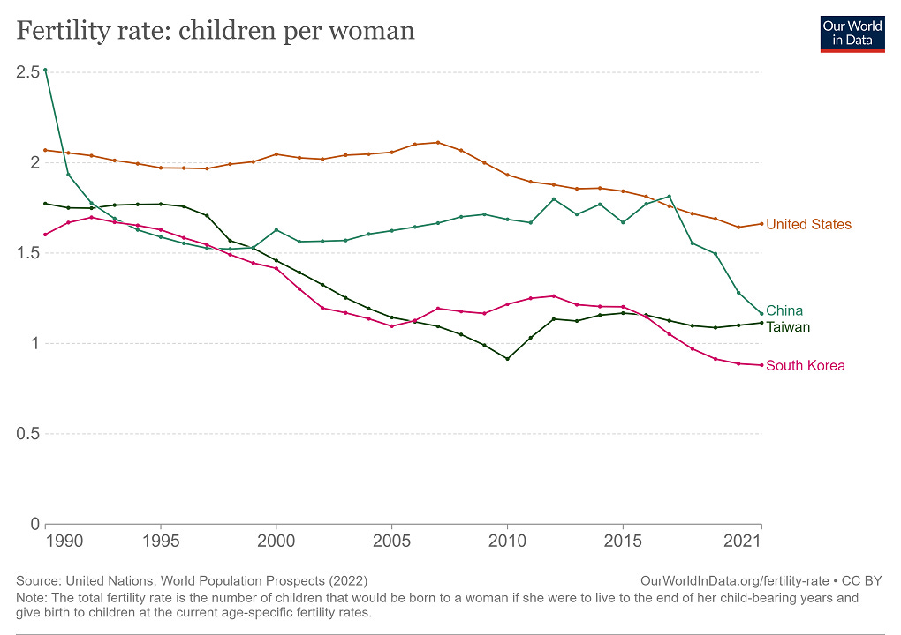
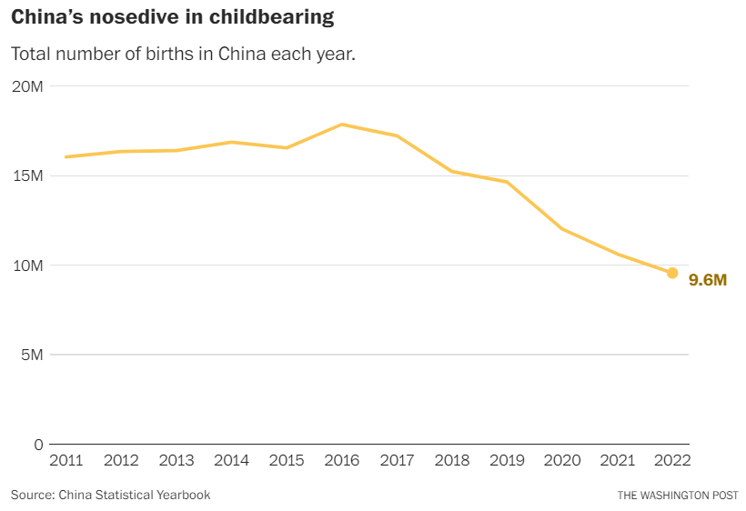
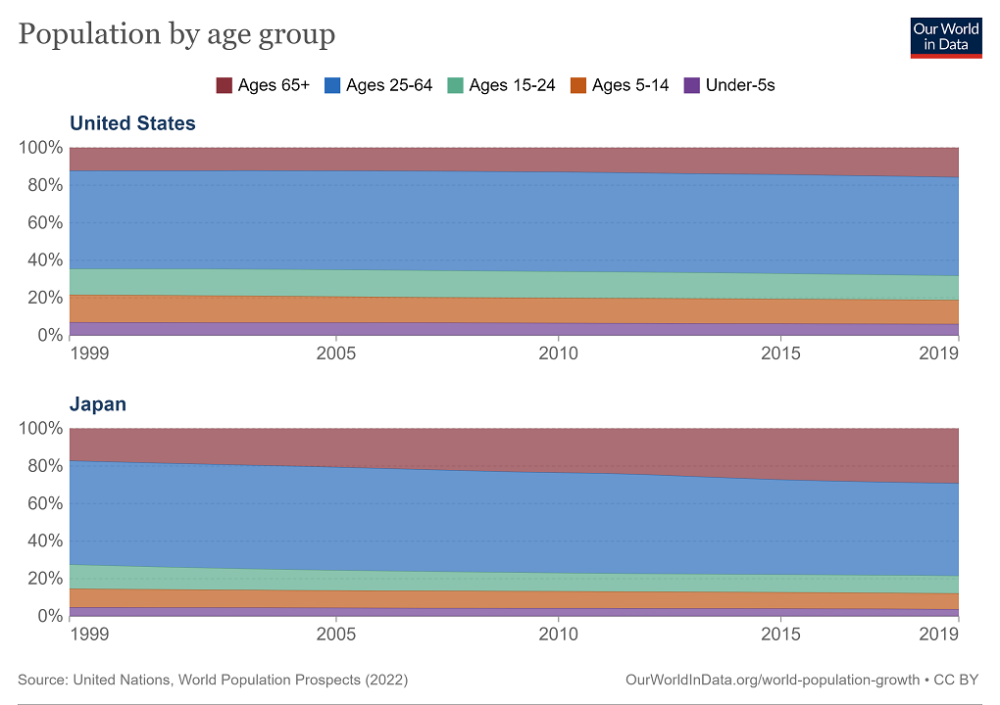
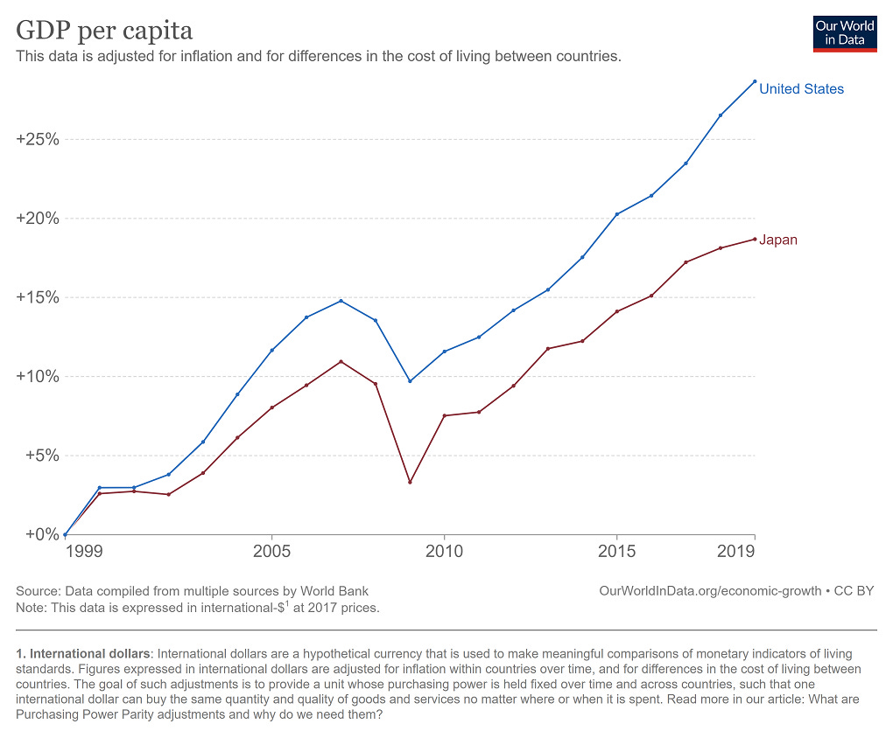

_This is the last post in [my short series about China’s economy in 2023](https://www.noahpinion.blog/p/four-reasons-china-cant-reset-the). As [usual](https://www.noahpinion.blog/p/the-developing-country-industrialization), I’ll have a post where I link to the whole series.  

这是我关于 2023 年中国经济的简短系列文章中的最后一篇文章。像往常一样，我将在一篇文章中提供整个系列的链接。_

In the 2010s, everyone knew that China was “the future”. In the 2020s, it feels more like the present. China has fully arrived on the world stage.  

2010年代，每个人都知道中国是“未来”。在2020年代，感觉更像是现在。中国已经全面登上世界舞台。  

Around the world, people’s houses are full of Chinese products, they spend their time watching videos on a Chinese app, and many of them now [drive Chinese cars](https://www.barrons.com/articles/byd-deliveries-first-quarter-9e1082ad). China makes [the best drones and the best trains](https://www.noahpinion.blog/p/where-china-is-beating-the-world). The internet is full of videos of the country’s [luminescent skyscrapers](https://www.youtube.com/watch?v=up5m8mRq6EU), [cavernous train stations](https://www.youtube.com/watch?v=ul5rqQGaLQ4), and [futuristic payment systems](https://www.youtube.com/watch?v=d-6iceHaQoI). Chinese researchers [dominate the journals](https://www.nature.com/articles/d41586-023-01705-7), and are believed to [lead the world](https://www.wsj.com/articles/china-trumps-u-s-in-key-technology-research-report-says-adbb56bc) in many areas of technology. No one questions the fact that the PRC is now one of the world’s great military powers, with the U.S. as its only real rival.  

在世界各地，人们的家里到处都是中国产品，他们花时间在中国应用程序上看视频，而且他们中的许多人现在开着中国汽车。中国制造最好的无人机和最好的火车。互联网上充斥着该国发光的摩天大楼、巨大的火车站和未来支付系统的视频。中国研究人员在期刊上占据主导地位，并被认为在许多技术领域处于世界领先地位。没有人质疑这样一个事实：中华人民共和国现在是世界军事强国之一，美国是其唯一真正的竞争对手。

We thus have the privilege of seeing a great civilization at its peak. There’s something awe-inspiring about it, but for me, something wistful as well.  

因此，我们有幸看到一个伟大文明的巅峰。它有一些令人敬畏的东西，但对我来说，也有一些渴望。  

How much greater would China’s peak have been if Deng Xiaoping had sided with the Tiananmen Square protesters, and liberalized China’s society in addition to its economy?  

如果邓小平站在天安门广场抗议者一边，并在经济之外实现中国社会的自由化，中国的巅峰会达到多少？  

How many great Chinese books, essays, video games, cartoons, TV shows, movies, and songs would we now enjoy if it weren’t for the pervasive censorship regime now in place?  

如果没有现在普遍存在的审查制度，我们现在还能欣赏到多少优秀的中国书籍、散文、电子游戏、漫画、电视节目、电影和歌曲呢？  

How much more would the people of the world have learned from Chinese culture if they could travel there freely and interact with Chinese people freely over the internet?  

如果世界人民能够自由地前往中国并通过互联网与中国人自由互动，他们会从中国文化中学到多少东西？  

Without a draconian autocrat like Xi Jinping at the helm, would so many Chinese people be [looking to flee the country](https://www.wsj.com/articles/chinas-brain-drain-threatens-its-future-dbe38096)? Would the U.S. and China still be friends instead of at each other’s throats?  

如果没有像习近平这样的严厉独裁者掌舵，会有这么多中国人寻求逃离这个国家吗？美国和中国还会是朋友而不是互相争斗吗？

But anyway, that’s a bit of a tangent. The key fact is that China’s meteoric rise seems like it’s drawing to a close. Already the country is [not growing much faster than the G7](https://twitter.com/scienceisstrat1/status/1676428122399334401), and as the ongoing real estate bust [weighs on the economy](https://www.cnbc.com/2023/06/14/chinas-property-market-to-see-persistent-weakness.html), even that small difference may now be gone. The country’s surging auto industry is a bright spot, but won’t be big enough to rescue the economy from the evaporation of [its primary growth driver](https://www.noahpinion.blog/p/real-estate-is-chinas-economic-achilles).  

但无论如何，这有点离题了。关键的事实是，中国的迅速崛起似乎已接近尾声。该国的增长速度已经不比七国集团快多少，而且由于持续的房地产泡沫破裂对经济造成压力，即使是这一微小的差异现在也可能消失。该国蓬勃发展的汽车工业是一个亮点，但规模不足以挽救经济，使其免于主要增长动力的消失。

Yes, for those who were wondering, this does look a little bit like what happened to Japan in the 1990s.  

是的，对于那些想知道的人来说，这确实有点像 20 世纪 90 年代日本发生的事情。  

The basics of rapid aging and a popped real estate bubble are both there, but there are some additional similarities that people may not know about.  

快速老龄化和房地产泡沫破裂的基本特征都存在，但还有一些人们可能不知道的相似之处。  

For both countries, there came a point where export manufacturing stopped being the main driver of growth — for Japan, after the [Plaza Accord](https://en.wikipedia.org/wiki/Plaza_Accord), for China after the appreciation of the yuan in the mid-2000s and the global financial crisis shortly afterward.  

对于这两个国家来说，出口制造业已经不再是经济增长的主要推动力——对于日本来说，是在《广场协议》之后；对于中国来说，则是在2000年代中期人民币升值以及不久之后的全球金融危机之后。

China’s drop was much much bigger; the Japan of the 80s was never the export machine people believed it to be.  

中国的跌幅要大得多；八十年代的日本从来都不是人们想象中的出口机器。  

Both countries turned to investment in real estate and infrastructure as a replacement growth driver — although again, China did this [much more than Japan did](https://data.worldbank.org/indicator/NE.GDI.FTOT.ZS?locations=JP-CN). Essentially, China did all the the things we typically _think_ of Japan as having done 25 years earlier, but much _more_ than Japan actually did them. It remains to be seen if China will copy Japan’s biggest post-crash mistake — [keeping “zombie” companies alive](https://www.nber.org/papers/w12129) with cheap loans.  

两国都转向房地产和基础设施投资作为替代增长动力——尽管中国在这方面做得比日本多得多。本质上，中国做了我们通常认为日本 25 年前做过的所有事情，但比日本实际做的要多得多。中国是否会效仿日本在金融危机后犯下的最大错误——用廉价贷款维持“僵尸”企业的生存还有待观察。

In any case, it seems likely that China’s growth will now slow to developed-country levels, or slightly higher, without much prospect for a sustained re-acceleration.  

无论如何，中国的增长现在很可能会放缓至发达国家的水平，或略高，持续重新加速的前景不大。  

At this point, with the economic value of additional real estate and infrastructure so low, a re-acceleration would require a massive burst of productivity growth, which just seems unlikely.  

目前，由于额外的房地产和基础设施的经济价值如此之低，重新加速将需要生产率的大幅增长，但这似乎不太可能。  

That means China’s catch-up growth only took it to [30% of U.S. per capita GDP (PPP)](https://en.wikipedia.org/wiki/List_of_countries_by_GDP_(PPP)_per_capita). Even if it manages to climb up to 40%, that’s still a fairly disappointing result — South Korea is at 71% and Japan at 65%.  

(China’s defenders will say that it’s harder to grow a big country than a small one, but…well, the U.S. is a fairly big country as well.) This is another example of China’s peak being both awe-inspiring and strangely disappointing at the same time.  

（中国的捍卫者会说，发展一个大国比发展一个小国更困难，但是……好吧，美国也是一个相当大的国家。）这是中国巅峰时期既令人敬畏又令人奇怪地失望的另一个例子。同时。  

这意味着中国的追赶式增长仅达到美国人均GDP (PPP)的30%。即使成功攀升至 40%，这仍然是一个相当令人失望的结果——韩国为 71%，日本为 65%。

The next question on a lot of people’s minds, at least in the U.S. and in Asia, will be: Now that China has hit its peak, will it decline? And if so, how much and how fast?  

至少在美国和亚洲，很多人脑海中的下一个问题将是：既然中国已经达到顶峰，它会衰落吗？如果是的话，多少以及多快？

Nations don’t really “peak and decline” like they used to in pre-industrial days. When the Roman Empire declined, it [got a lot poorer](https://braddelong.substack.com/p/yes-rome-did-fall). But in the modern economy, countries that decline in _relative_ terms, and in geopolitical power, often get richer — some people would say that the Victorian or Edwardian era was Britain’s “peak”, and yet the average British person is [5 times as rich as in 1900](https://ourworldindata.org/grapher/gdp-per-capita-maddison?tab=chart&stackMode=relative&time=1900..latest&country=~GBR).  

So when people contemplate Chinese decline, they’re not asking whether its economy will shrink; they’re asking whether its relative economic dominance and geopolitical importance will decrease.  

因此，当人们思考中国的衰落时，他们并不是在问中国经济是否会萎缩，而是在问中国经济是否会萎缩。他们想知道其相对经济主导地位和地缘政治重要性是否会下降。  

国家并不像前工业时代那样真正“达到顶峰然后衰落”。当罗马帝国衰落时，它变得更加贫穷。但在现代经济中，相对而言和地缘政治实力下降的国家往往会变得更富有——有人会说维多利亚或爱德华时代是英国的“顶峰”，但英国人的平均富裕程度是英国的5倍。 1900年。

If we just casually pattern-match on history, the answer would probably be “not for a long time”. Most powerful countries seem to peak and then plateau.  

如果我们只是随意地对历史进行模式匹配，答案很可能是“很长一段时间都不会”。大多数强国似乎都会达到顶峰，然后趋于稳定。  

Britain ruled the waves for a century. U.S. relative power and economic dominance peaked in the 1950s, but it didn’t really start declining until the 2000s.  

英国统治了海浪一个世纪。美国的相对实力和经济主导地位在 20 世纪 50 年代达到顶峰，但直到 2000 年代才真正开始下降。  

Japan and Germany had their military power smashed in WW2, but remained economic heavyweights for many decades afterwards. Russian power had a second coming in the form of the USSR.  

日本和德国的军事实力在二战中被摧毁，但在之后的几十年里仍然是经济大国。俄罗斯力量以苏联的形式再次出现。

There’s one main argument that people make for a quick Chinese decline: rapid aging.  

人们认为中国的快速衰落有一个主要论点：快速老龄化。  

But while I don’t want to wave this away, I don’t think it’s going to be as big a deal as many believe — at least, not soon.  

不过，虽然我不想放弃这一点，但我认为这不会像许多人认为的那样是一件大事——至少不会很快。

It’s undeniable that China’s demographics are [pretty stark](https://www.noemamag.com/chinas-looming-demographic-disaster/). The total fertility rate has been low since even before the one-child policy was implemented, but recently it has taken a nose-dive.  

Two years ago, the UN put it at 1.16, which is 40% lower than the U.S. and 22% lower than Europe (both of which have their own fertility issues).  

两年前，联合国将其定为1.16，比美国低40%，比欧洲低22%（这两个国家都有自己的生育问题）。  

China’s fertility looks more like that of Taiwan, and could be headed in the direction of South Korea:  

中国的生育率看起来更像台湾，并且可能会向韩国的方向发展：  

不可否认，中国的人口结构相当严峻。总和生育率在独生子女政策实施之前就一直很低，但最近却出现了大幅下降。

Source: UN via [OWID](https://ourworldindata.org/grapher/children-per-woman-UN?tab=chart&time=1990..2021&country=CHN~USA~KOR~TWN~Europe+%28UN%29) 资料来源：联合国通过 OWID

And China’s population structure is also contributing to an especially rapid birth collapse.  

中国的人口结构也导致出生率急剧下降。  

The country’s total population only started shrinking this year, but its young population started falling sharply 20 years ago, due to the echo of low fertility in the 80s.  

中国的总人口今年才开始减少，但由于80年代的低生育率，20年前年轻人口就开始急剧下降。  

The most common age for a Chinese person is now [about 50 years old](https://www.economist.com/china/2023/01/17/for-the-first-time-since-the-1960s-chinas-population-is-shrinking), with another peak at 35:  

现在中国人最常见的年龄是50岁左右，另一个高峰是35岁：

As a result, there are suddenly many fewer Chinese people able to bear children, which is why the actual number of births in China has [fallen by almost half since 2016](https://www.washingtonpost.com/opinions/2023/02/28/behind-china-collapse-birth-marriage-rates/):  

结果，中国能生育的人突然减少了很多，这就是为什么中国的实际出生人数自2016年以来下降了近一半：

Source: [WaPo](https://www.washingtonpost.com/opinions/2023/02/28/behind-china-collapse-birth-marriage-rates/) 资料来源：华盛顿邮报

These dramatic statistics have led a number of [people](https://www.brookings.edu/articles/chinas-shrinking-population-and-constraints-on-its-future-power/) to [predict](https://www.nationalgeographic.com/magazine/article/china-population-shrinking-feature) that China’s demographics will send it into relative decline. More darkly, some geopolitical analysts have [raised concern](https://www.amazon.com/Danger-Zone-Coming-Conflict-China/dp/1324021306) that China’s demographics may drive it to launch a major war in the near future, before its power wanes.  

这些引人注目的统计数据让许多人预测中国的人口结构将导致其相对下降。更阴暗的是，一些地缘政治分析人士担心，中国的人口结构可能会促使其在不久的将来在其实力减弱之前发动一场大规模战争。

Now, I don’t have any idea whether China’s leaders will fall victim to this type of thinking — as we saw with Germany in the World Wars, powerful countries can make big mistakes like this. But what I _do_ think is that demographics aren’t actually going to force Chinese power or wealth into rapid decline over the next few decades.  

现在，我不知道中国领导人是否会成为这种思维的受害者——正如我们在世界大战中看到的德国那样，强大的国家可能会犯这样的大错误。但我确实认为，人口统计实际上并不会迫使中国的实力或财富在未来几十年内迅速下降。

The first reason is that power is relative, and China’s rivals have demographic issues of their own.  

第一个原因是实力是相对的，而中国的竞争对手也有自己的人口问题。  

The U.S., Europe, India and Japan all have higher fertility than China, but still below replacement level.  

美国、欧洲、印度和日本的生育率均高于中国，但仍低于更替水平。  

Those demographic issues can be staved off to some degree by mass immigration, but [only to some degree](https://www.imf.org/en/Publications/fandd/issues/2020/03/can-immigration-solve-the-demographic-dilemma-peri), and only if the countries can overcome the associated internal political hurdles.  

这些人口问题可以在一定程度上通过大规模移民来避免，但只能在一定程度上，而且只有当这些国家能够克服相关的内部政治障碍时。

Second, demographics won’t take away China’s biggest economic advantage, which is _clustering and agglomeration effects_. Asia is the world’s electronics manufacturing hub. It’s also by far the most populous region in the world, giving it the biggest potential market size.  

Those two factors mean that even as China’s population continues to fall, it’ll be situated at the center of region that’s growing in both economic and (for now) demographic terms. And China will act as a key hub for that region, in terms of trade, supply chains, investment, and so on.  

这两个因素意味着，尽管中国人口继续下降，但它仍将位于经济和（目前）人口增长地区的中心。中国将成为该地区贸易、供应链、投资等方面的重要枢纽。  

China is shrinking, but Asia is not.  

中国正在萎缩，但亚洲却没有。  

其次，人口结构不会剥夺中国最大的经济优势，即集群效应。亚洲是世界电子制造中心。它也是迄今为止世界上人口最多的地区，因此具有最大的潜在市场规模。

And third of all, [evidence suggests](https://www.noahpinion.blog/p/how-much-does-aging-really-hurt-a) that population aging is really more of a persistent drag than a crisis or disaster.  

Let’s compare Japan, one of the world’s most rapidly aging societies, with the U.S., which has aged only slowly.  

让我们将世界上老龄化速度最快的社会之一的日本与老龄化缓慢的美国进行比较。  

From 1999 (roughly the end of Japan’s “lost decade”) through 2019, Japan’s share of workers over 65 increased by about 12.06 percentage points, while the U.S.’ share increased by only 3.39 percentage points — a difference of 8.67 percentage points:  

从 1999 年（大致是日本“失去的十年”的结束）到 2019 年，日本 65 岁以上工人的比例增加了约 12.06 个百分点，而美国的比例仅增加了 3.39 个百分点，相差 8.67 个百分点：  

第三，有证据表明，人口老龄化实际上更像是一种持续的拖累，而不是一场危机或灾难。

At the same time, Japan’s economy underperformed the U.S. economy by about 10 percentage points in cumulative terms:  

与此同时，日本经济累计落后美国经济约10个百分点：

So just dividing the second number by the first, we’d find that every percentage point of the senior population share that China gains _relative to other countries_ might reduce its relative economic performance by about 1.15%. That’s not a huge number.  

因此，只要将第二个数字除以第一个数字，我们就会发现，中国相对于其他国家每增加一个百分点的老年人口份额，就可能导致其相对经济表现下降约1.15%。这并不是一个很大的数字。

Now, if we look at the research, we find some estimates that are much larger than this — for example, [Ozimek et al. (2018)](https://ma.moodys.com/rs/961-KCJ-308/images/2018-09-04-Aging-and-the-Productivity-Puzzle.pdf) look at specific industries and specific U.S. states, and find an effect on productivity that’s three times as large as the total effect on growth that I just eyeballed above. [Maestas et al. (2022)](https://www.nber.org/papers/w22452) look at U.S. states, and also find a larger effect. But [Acemoglu and Restrepo (2017)](https://economics.mit.edu/sites/default/files/inline-files/Secular%20Stagnation%20-%20%20The%20Effect%20of%20Aging%20on%20Economic%20Growth%20in%20the%20Age%20of%20Automation.pdf) look across countries and find _no effect at all_.  

现在，如果我们看看这项研究，我们会发现一些估计值比这个大得多——例如，Ozimek 等人。 （2018）研究了特定行业和美国特定州，发现对生产率的影响是我上面刚刚看到的对增长总影响的三倍。梅斯塔斯等人。 （2022）看看美国各州，也发现了更大的影响。但 Acemoglu 和 Restrepo（2017）考察了各个国家，发现根本没有效果。

On top of that, there are plenty of things a country can do to mitigate the effects of aging. One is automation. China is [automating at breakneck speed](https://roboticsandautomationnews.com/2022/02/25/china-aims-for-global-leadership-in-robotics-with-new-five-year-plan/49577/), while in the U.S., [top technologists](https://qz.com/911968/bill-gates-the-robot-that-takes-your-job-should-pay-taxes) and [intellectuals](https://wheelerblog.london.edu/in-conversation-with-daron-acemoglu/) talk about limiting automation in order to protect jobs. A second is having old people work longer; China, which now has [higher life expectancy than the U.S.](https://ourworldindata.org/grapher/life-expectancy?time=1978..latest&country=CHN~USA), is well-positioned to do this.  

最重要的是，一个国家可以采取很多措施来减轻老龄化的影响。一是自动化。中国正以极快的速度实现自动化，而在美国，顶级技术专家和知识分子则在谈论限制自动化以保护就业。第二是让老年人工作更长时间；目前预期寿命高于美国的中国完全有能力做到这一点。

Finally, aging will prompt China to do something it really needs to do anyway: build a world class health care system.  

最后，老龄化将促使中国做一些真正需要做的事情：建立世界一流的医疗保健体系。  

In addition to solving China’s unemployment problems, this would help rectify the internal imbalances that [Michael Pettis always talks about](https://carnegieendowment.org/chinafinancialmarkets/89466), shifting output from low-productivity real estate investment toward consumption.  

除了解决中国的失业问题外，这还有助于纠正迈克尔·佩蒂斯经常谈论的内部失衡，将产出从低生产率的房地产投资转向消费。

So while I expect aging to exert a persistent drag on China’s growth over the next three or four decades, it doesn’t seem likely to be a crisis that will push the nation into rapid relative decline.  

因此，尽管我预计老龄化将在未来三四十年对中国经济增长造成持续拖累，但它似乎不太可能成为一场将国家推向相对快速衰退的危机。  

And if not aging, the only other big dangers to China are war and climate change.  

如果不是老龄化，中国面临的其他重大危险就是战争和气候变化。  

The harms of climate change will be pretty widely distributed around the globe, so really that just leaves war as the thing that threatens to knock China off the peak of its relative power and wealth.  

气候变化的危害将在全球范围内广泛传播，因此实际上，战争将成为威胁中国脱离其相对实力和财富顶峰的因素。  

War was the big mistake that Germany made a century ago, so let’s hope China doesn’t follow in its footsteps.  

战争是德国一个世纪前犯下的重大错误，所以我们希望中国不要步其后尘。

Thus I think the most likely outcome is that China sits at or near its current peak of wealth, power and importance through the middle of this century at least.  

因此，我认为最有可能的结果是，至少到本世纪中叶，中国将达到或接近当前财富、实力和重要性的顶峰。

Investors, diplomats, entrepreneurs, and dreamers of all types naturally want to look to the region of the world that represents “the future”, so they can get in on that future — whether by making money, crafting alliances, or just experiencing the thrill of a rising society.  

各种类型的投资者、外交官、企业家和梦想家自然希望将目光投向世界上代表“未来”的地区，这样他们就可以进入那个未来——无论是通过赚钱、建立联盟，还是只是体验刺激一个正在崛起的社会。  

In the 2000s and 2010s that place was China — nowhere else on Earth could match its energy, ambition, and determined optimism.  

在 2000 年代和 2010 年代，这个地方就是中国——地球上没有其他地方可以比得上它的活力、雄心和坚定的乐观态度。

Now that excitement will largely be gone from China, except in a few pockets. Where will it go?  

现在，除了少数人之外，这种兴奋感将在很大程度上从中国消失。它会去哪里？  

What country or region of the world will be the next place that feels like the “future”?  

世界上哪个国家或地区将成为下一个感觉像“未来”的地方？

In [a pair](https://www.economist.com/business/2023/02/20/global-firms-are-eyeing-asian-alternatives-to-chinese-manufacturing) of [articles](https://www.economist.com/graphic-detail/2023/03/03/these-countries-could-lure-manufacturing-away-from-china) from earlier this year, The Economist makes a strong case for something they call “Altasia”.  

This is basically all of East and South Asia except for China and a few small unstable or highly repressive countries.  

这基本上是整个东亚和南亚，除了中国和一些不稳定或高度压制的小国家。  

在今年早些时候的两篇文章中，《经济学人》为他们所谓的“Altasia”提供了强有力的理由。

Together, Altasia has more people and arguably more technical expertise than China. And it’s the only alternative location for the Asian electronics supercluster.  

总的来说，Altasia 比中国拥有更多的人员和更多的技术专长。它是亚洲电子超级集群的唯一替代地点。

The problem is that Altasia isn’t actually “together” — like BRICS, it so far exists more as a marketing buzzword for Western investors than as an actual economic bloc.  

问题在于，阿尔塔西亚实际上并不“团结”——就像金砖国家一样，到目前为止，它更多地作为西方投资者的营销流行语而存在，而不是作为一个真正的经济集团。  

The grouping is bifurcated between rich, slow-growth countries like Japan and Korea, and poor up-and-coming countries like India, Indonesia, and Vietnam.  

该群体分为富裕、增长缓慢的国家（如日本和韩国）和贫穷的新兴国家（如印度、印度尼西亚和越南）。

To realize its full potential, Altasia will need _integration_ — it will need some way to get Japanese and Korean and Taiwanese investment and technology to the vast labor forces of India, Indonesia, and the rest.  

The Americans, Europeans, and Chinese will also be looking to expand there, both for the cheap production costs and for the vast market opportunities.  

美国人、欧洲人和中国人也将寻求在那里扩张，既是为了低廉的生产成本，也是为了广阔的市场机会。  

And to top it all off, the U.S. and its allies will be looking to “friend-shore” their critical supply chains from China to Altasia, especially in electronics.  

最重要的是，美国及其盟国将寻求“友好支持”从中国到阿尔塔西亚的关键供应链，特别是在电子产品领域。  

为了充分发挥其潜力，阿尔塔西亚需要整合——它需要某种方式将日本、韩国和台湾的投资和技术引入印度、印度尼西亚和其他国家的庞大劳动力。

The story of whether and how that complex web of investment, tech transfer, and trade develops will be the next great story of globalization.  

这个复杂的投资、技术转让和贸易网络是否以及如何发展的故事将是全球化的下一个伟大故事。

But I think the very complexity of Altasia will lead to its own sort of adventure and excitement. We haven’t seen an entire _region_ industrialize all at once since Europe in the late 1800s (the closest thing being the Asian “tiger economies” of the 80s and 90s, which was really just Altasia’s predecessor).  

This will be much bigger. Investment and trade and diplomatic links will be flying back and forth between these various countries at a frenetic pace.  

这会更大。投资、贸易和外交联系将在这些国家之间快速来回流动。  

Everyone will be trying to figure out who builds what where, where they source from, and where they sell to. Eventually, cultural links will follow.  

每个人都会试图弄清楚谁在哪里建造什么、他们从哪里采购以及销往哪里。最终，文化联系将会随之而来。  

但我认为 Altasia 的复杂性将带来它自己的冒险和兴奋。自 1800 年代末的欧洲以来，我们还没有看到整个地区同时实现工业化（最接近的是 80 年代和 90 年代的亚洲“四小龙经济体”，这实际上只是 Altasia 的前身）。

And for Western companies looking for new markets, Altasia will potentially be more exciting than China ever was.  

对于寻找新市场的西方公司来说，阿尔塔西亚可能比中国更令人兴奋。  

The Chinese market delivered riches to some, but the government banned some products (especially internet services) and stole the technology used to make others.  

中国市场给一些人带来了财富，但政府禁止了一些产品（尤其是互联网服务），并窃取了用于制造其他产品的技术。  

Ultimately, China’s billion consumers turned out to be a mirage for many. The economies and societies of Altasia, in comparison, are much more open to foreign products.  

最终，中国十亿消费者对许多人来说只是海市蜃楼。相比之下，阿尔塔西亚的经济和社会对外国产品更加开放。

And in the poorer countries of Altasia — India, Indonesia, Vietnam, Bangladesh, Philippines, etc. — there will be the heady excitement of industrial development.  

而在阿尔塔西亚较贫穷的国家——印度、印度尼西亚、越南、孟加拉国、菲律宾等——将会出现令人兴奋的工业发展。  

It will be their turn to build highways, their subways, their gleaming forests of apartments and office towers.  

轮到他们修建高速公路、地铁、闪闪发光的公寓和办公楼森林了。  

It will be their turn to buy cars and big-screen TVs, go out to eat, go dancing at clubs, and send their kids to college.  

轮到他们购买汽车和大屏幕电视、出去吃饭、去俱乐部跳舞、送孩子上大学。  

Developing Altasia will be a damn exciting place to be in next three decades.  

未来三十年，发展 Altasia 将是一个非常令人兴奋的地方。

[Share 分享](https://www.noahpinion.blog/p/china-at-the-peak?utm_source=substack&utm_medium=email&utm_content=share&action=share)
