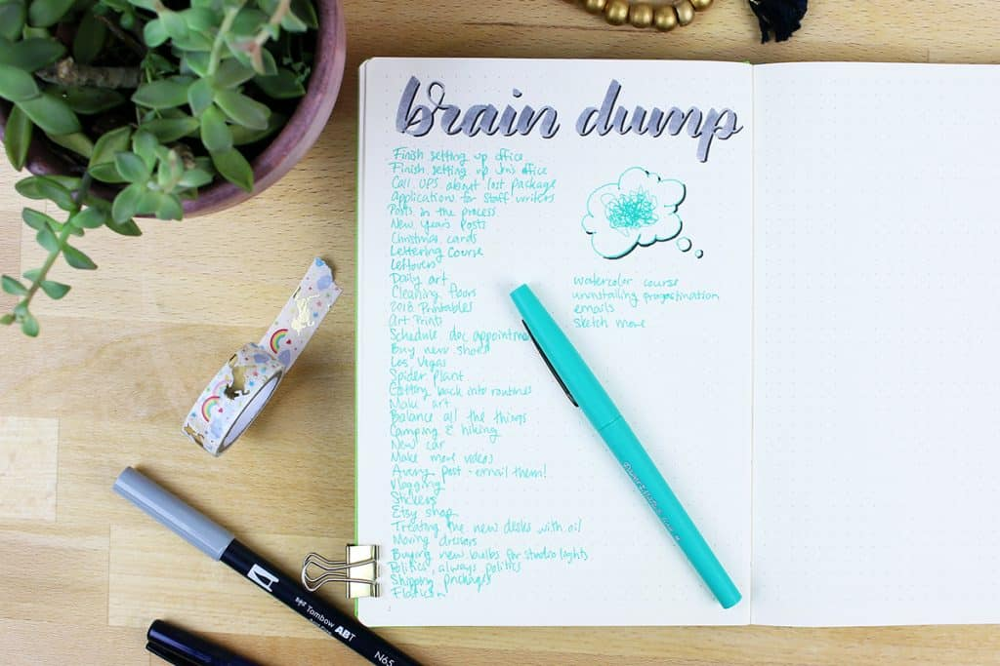

<iframe id="_ytid_94828" data-origwidth="800" data-origheight="450" src="https://www.youtube.com/embed/Rd6lFFK2Iro?enablejsapi=1&amp;autoplay=0&amp;cc_load_policy=0&amp;cc_lang_pref=&amp;iv_load_policy=1&amp;loop=0&amp;modestbranding=1&amp;rel=1&amp;fs=1&amp;playsinline=0&amp;autohide=2&amp;theme=dark&amp;color=red&amp;controls=1&amp;" title="How to Stop Being Overwhelmed (Simple Exercise)" allow="accelerometer; autoplay; clipboard-write; encrypted-media; gyroscope; picture-in-picture" allowfullscreen="" data-no-lazy="1" data-skipgform_ajax_framebjll=""></iframe>

Do you sometimes wake up _stressed for no reason_? I know I do.  

你有时会无缘无故地醒来感到压力吗？我知道我知道。

And what annoys me the most is not knowing the cause.  

最让我烦恼的是不知道原因。

So I started searching for answers until I found a **self-reflection technique**: the brain dump. It helps you clear your mind and become sharper by just writing for a few minutes.  

所以我开始寻找答案，直到我找到了一种自我反思的技巧：大脑转储。只需写几分钟，它就能帮助您理清思绪并变得更加敏锐。

But first: why do you feel overwhelmed?  

但首先：为什么你会感到不知所措？

Here’s the problem: 问题是这样的：

It’s stressful to remember the right information at the wrong time (e.g., when you’re in bed), not to say useless.  

在错误的时间（例如，当你躺在床上时）记住正确的信息会带来压力，更不用说毫无用处了。

If you’re tired of overthinking, brain dumps are a must. Here are four ways to do it and how to get the benefits in less than five minutes.  

如果你厌倦了过度思考，大脑转储是必须的。以下是四种方法，以及如何在不到五分钟的时间内获得好处。

## **The 4 Types Of Brain Dump  

四种类型的大脑转储**

### **1\. Free Flow 1\. 自由流动**

Best For: Putting in order a chaotic mind  

最适合：整理混乱的头脑

How: 如何：

1.  Grab a pen and a piece of paper  
    
    拿起一支笔和一张纸
2.  Set a timer (10-20 minutes)  
    
    设置计时器（10-20 分钟）
3.  Write everything that’s on your mind  
    
    写下你想到的一切

If you have an obvious reason to feel confused, you should center around that. But **if you don’t know where to start, try to ask yourself any of the following**:  

如果你有明显的理由感到困惑，你应该围绕这个理由。但如果您不知道从哪里开始，请尝试问自己以下任一问题：

-   What have I been worried about?  
    
    我一直在担心什么？
-   What do I keep forgetting to do?  
    
    我总是忘记做什么？
-   What would make me really happy?  
    
    什么能让我真正快乐？
-   Did something go wrong today?  
    
    今天是不是出了什么事？
-   What really worked today/this week?  
    
    今天/本周什么真正有效？
-   What tasks never seem to get done?  
    
    哪些任务似乎永远无法完成？
-   Was there something I didn’t get time to do?  
    
    有什么我没有时间做的事情吗？
-   Is there an upcoming event or special occasion you need to plan?  
    
    您需要计划即将举行的活动或特殊场合吗？
-   Is there someone you should contact?  
    
    有您应该联系的人吗？
-   What part of my routine is not working?  
    
    我日常工作中的哪一部分不起作用？
-   Is someone or something annoying me?  
    
    有人或某事让我烦恼吗？
-   Is there something you would love to learn?  
    
    有什么你想学的吗？

Don’t overwhelm yourself trying to answer the whole list. Pick one or two and stick to those for 10-20 minutes. The rules are:  

不要试图回答整个列表而让自己不知所措。选择一两个并坚持 10-20 分钟。规则是：

-   You **cannot stop writing** for more than five seconds  
    
    你不能停止书写超过五秒
-   You **can’t delete or correct** anything you write  
    
    您无法删除或更正您所写的任何内容
-   You have to use a **time limit** to avoid thinking without direction  
    
    你必须利用时间限制来避免没有方向的思考

That doesn’t mean you have to follow the timer though. If the exercise feels really helpful, feel free to keep writing after the timer goes off.  

但这并不意味着您必须遵循计时器。如果感觉练习确实有帮助，请在计时器响起后继续写作。

Pro Tip: Create a “registry” (AKA “not-to-think list”) where you summarize everything you’ve talked about and your conclusions.  

专业提示：创建一个“注册表”（又名“不思考清单”），在其中总结您所讨论的所有内容和结论。  

This way, if later you think of something that’s on the list, you know you figured it out and don’t have to think twice.  

这样，如果您稍后想到清单上的某些内容，您就知道您已经找到了答案，而不必三思而后行。

### **2\. Goal Focused 2\. 以目标为中心**

Best For: Planning your day the night before  

最适合：前一天晚上计划你的一天

How: 如何：

1.  Write and underline your top three priorities for the month  
    
    写下并强调您本月最重要的三项优先事项
2.  Below, divide the sheet with a vertical line  
    
    下面，用垂直线划分纸张
3.  Write on the left every task you’ve done that helped you progress on those goals  
    
    在左侧写下您已完成的每项帮助您实现这些目标的任务
4.  Write on the right those that didn’t move the needle  
    
    那些没有移动针的写在右边
5.  Prioritize: 优先考虑：

-   For the first list, start with the tasks that take less than two minutes. Then you do the urgent & important tasks, then every other project  
    
    对于第一个列表，从需要不到两分钟的任务开始。然后你执行紧急且重要的任务，然后是其他所有项目
-   For the second list, eliminate, postpone, or delegate  
    
    对于第二个列表，消除、推迟或委托

For a simpler exercise, you can write everything you need to do in one list.  

为了进行更简单的练习，您可以将需要执行的所有操作写在一个列表中。

Pro Tip: You can group similar activities. Starting tasks is hard, but if you [batch](https://www.youtube.com/watch?v=UburJrxq4fw&ab_channel=DanSilvestre) 10 tasks, you only need to start them once.  

专业提示：您可以将类似的活动分组。启动任务很困难，但如果批处理 10 个任务，则只需启动一次。

### **3\. Gratefulness 3.感恩**

Best For: Resetting your brain and stop worrying for no reason  

最适合：重置你的大脑并停止无缘无故的担忧

How: 如何：

1.  Write 3 things you did right today (or five done this week)  
    
    写下你今天做对的 3 件事（或本周做的 5 件事）
2.  Write 3 things (minimum) you feel grateful for  
    
    写下 3 件（至少）你感到感激的事情

A common argument I hear:  

我听到的一个常见论点：

_“Gratefulness doesn’t get things done. Why should I do this?”  

“感恩并不能把事情做好。我为什么要这么做？_

Because getting things done isn’t enough to relax.  

因为完成事情并不足以放松。

Maybe you keep worrying because you’re insecure about your ability to solve problems you don’t even have yet. But gratitude teaches us to focus on everything we have and did right.  

也许你一直担心，因为你对自己解决尚未解决的问题的能力缺乏信心。但感恩教会我们专注于我们拥有的和做对的一切。  

Which brings confidence and prevents stress.  

这会带来信心并防止压力。

If you feel overwhelmed for no reason, gratefulness may be the emotional relief you need.  

如果你无缘无故地感到不知所措，感恩可能是你需要的情感缓解。

### **4\. Weekly 4\. 每周**

Best For: Reviewing at the end of your week  

最适合：周末复习

How: 如何：

1.  Start with questions: 从问题开始：
    -   What have I achieved last week compared to my expectations?  
        
        与我的预期相比，我上周取得了哪些成就？
    -   What are this week’s goals? Am I excited? Why/why not?  
        
        本周的目标是什么？我很兴奋吗？为什么/为什么不呢？
    -   Do I dread a particular day? How to make it more enjoyable?  
        
        我害怕某一天吗？如何让它变得更愉快？
    -   What’s the most annoying task? If you do that first, you’ll be relieved for the rest of the week.  
        
        最烦人的任务是什么？如果你先这样做，本周剩下的时间你就会放心。
    -   What work did I assign for last week but later moved to this one?  
        
        我上周分配了什么工作，但后来转移到了这一项？
2.  Take a 15-minute break when finished  
    
    完成后休息15分钟
3.  Come back, re-read, highlight, and migrate the relevant content to a to-do list or calendar  
    
    返回、重新阅读、突出显示相关内容并将其迁移到待办事项列表或日历

It helps to divide your goals into your areas of life. But you don’t need to be detailed at all. Only expand on the ones that worry you the most.  

它有助于将您的目标划分为您的生活领域。但你根本不需要详细说明。仅扩展您最担心的问题。

## **5 Mistakes To Avoid When Brain Dumping  

大脑倾销时要避免的 5 个错误**

[Source 来源](https://littlecoffeefox.com/brain-dump/)

### **1\. Don’t Start Too Late  

1.不要开始太晚**

It helps to think of brain dumps like cold showers. You don’t want to do them because of the discomfort, but once you take them, you’re glad you did.  

把大脑垃圾想象成冷水澡是有帮助的。你因为不舒服而不想做，但一旦你做了，你会很高兴你做了。

There’s not a wrong way to brain dump. But the no.1 mistake I see is that people delay doing it, myself included.  

大脑转储没有错误的方法。但我发现的第一个错误是人们推迟这样做，包括我自己。

The problem is, nobody has that high self-awareness. But you don’t have to!  

问题是，没有人有那么高的自我意识。但你不必这样做！

You can’t miss a single day if you make it a daily habit.  

如果你养成每天的习惯，你就不能错过任何一天。

Here’s how to use all four:  

以下是使用这四种方法的方法：

-   Goal-focused brain dumps every night when setting goals  
    
    每天晚上设定目标时都会以目标为中心的大脑转储
-   After the goal exercise, write three things you did right and three things you’re grateful for  
    
    目标练习后，写下你做对的三件事和你感激的三件事
-   At the end of the week, you do the weekly brain dump  
    
    在周末，你进行每周的大脑转储
-   Do an emergency free-flow brain dump anytime you feel too lost  
    
    每当你感到失落时，就进行一次紧急的自由流动的大脑转储

Everyday.

Too hard? For the first one, yes (about 20-60 minutes).  

太难？对于第一个，是的（大约 20-60 分钟）。  

But when you do it daily, it takes less time/effort because you have fewer “junk files” to dump (in 5-10 minutes, you’re good to go).  

但是，当您每天执行此操作时，会花费更少的时间/精力，因为您需要转储的“垃圾文件”更少（5-10 分钟内，您就可以开始了）。

### **2\. Trust Your Notes 2\. 相信你的笔记**

You write your thoughts to create clarity. If you don’t “trust” your notes, it’s no different than if you didn’t do the exercise. You wrote about it but didn’t unload the thoughts.  

您写下您的想法以保持清晰。如果你不“相信”你的笔记，那就和你没有做练习没有什么不同。你写了它，但没有卸下你的想法。

What you write has to be reliable so that your brain can afford to not worry. Here’s a small checklist:  

你写的东西必须可靠，这样你的大脑才能不担心。这是一个小清单：

-   Have I included EVERYTHING that I have to do?  
    
    我是否包含了我必须做的所有事情？
-   Are my tasks organized by priority?  
    
    我的任务是按优先级组织的吗？
-   Did I define the steps to complete each task?  
    
    我是否定义了完成每项任务的步骤？
-   Have I scheduled when to do each step with calendars/to-do lists/phone reminders?  
    
    我是否通过日历/待办事项列表/电话提醒安排了何时执行每个步骤？
-   Eliminating unnecessary tasks: have I written why I did so? If you don’t remember, you could get them back.  
    
    消除不必要的任务：我是否写过这样做的原因？如果你不记得了，你可以把它们找回来。
-   Postponing projects: did I specify for how long?  
    
    推迟项目：我有指定推迟多久吗？

These questions tell your brain what you’ll do when you get back to the task (so you can stop thinking of it).  

这些问题告诉你的大脑，当你回到任务时你会做什么（这样你就可以停止思考它）。

### **3\. Write on Paper Instead  

3\. 写在纸上**

If you don’t have paper, it makes sense to write on your phone. Otherwise, what’s the point of using a note app to do this exercise?  

如果您没有纸，可以在手机上书写。否则，使用笔记应用程序来做这个练习有什么意义呢？

Here’s something curious: technology will eventually become more connected to ourselves. Maybe one day, you can search on Google or perform tasks just by having a thought.  

有一点很奇怪：技术最终将与我们更加紧密地联系在一起。也许有一天，你只需一个想法就可以在谷歌上搜索或执行任务。

That defeats the purpose of this exercise. The whole point of brain dumps is to get your thoughts out of your mind. Even if it takes a bit longer, paper works better because:  

这违背了本次练习的目的。大脑转储的全部目的就是把你的想法从你的脑海中清除。即使需要更长的时间，纸张效果更好，因为：

-   It’s more visual and satisfactory  
    
    更直观、更满意
-   It’s more intentional when you’re writing the letters instead of tapping/pressing buttons  
    
    当你写字母而不是点击/按下按钮时，这是更有意识的
-   You probably watch thousands of device screens but only read a few papers per day. So you’re more likely to remember an actual sheet than a virtual note  
    
    您可能会观看数千个设备屏幕，但每天只阅读几篇论文。因此，您更有可能记住实际的纸而不是虚拟的笔记

### **4\. Take a 15m Break  

4\. 休息15m**

You go through your days trying to avoid all these random thoughts. But when doing a brain dump, you’re making the effort to expose everything you worry about.  

你每天都在努力避免所有这些随意的想法。但在进行大脑转储时，你正在努力揭露你担心的一切。  

It can be exhausting to compile, filter, and organize each piece of data, even if you only spend a few minutes.  

即使只花费几分钟，编译、过滤和组织每条数据也可能会让人筋疲力尽。

What better opportunity to relax than now, after you got rid of all your thoughts? Take a 15-minute break, then complete all the two-minute tasks, and then continue your projects.  

在你摆脱了所有的想法之后，还有什么比现在更好的放松机会呢？休息 15 分钟，然后完成所有两分钟的任务，然后继续你的项目。

If you start working right after the brain dump, you won’t have time to switch the context. So if you want to stop overthinking, don’t skip this short break.  

如果你在大脑转储后立即开始工作，你将没有时间切换环境。因此，如果您想停止过度思考，请不要跳过这个短暂的休息。

### **5\. Address The Cause, Not The Symptoms  

5.解决问题的原因，而不是症状**

It’s relieving to know that a brain dump can fix things whenever you feel bombarded with information.  

每当你感到被信息轰炸时，知道大脑转储可以解决问题，这让你感到很欣慰。  

If you do enough of them, you may find that some problems keep repeating whenever you do it.  

如果你做得足够多，你可能会发现每当你做的时候有些问题都会重复出现。

That’s when you should stop to think at a higher level. Where do all these thoughts come from? How can I prevent them from even appearing?  

这时候你应该停下来思考更高层次的问题。所有这些想法从何而来？我怎样才能阻止它们出现？

Dieting couldn’t be a better example. You can choose to eat healthier, but if you keep buying junk food, that undoes the work.  

节食就是一个更好的例子。你可以选择吃得更健康，但如果你继续购买垃圾食品，那就前功尽弃了。

If **junk thoughts** are the symptom, **decisions** are the cause. You’ll find [a detailed overview of smart decisions here](https://dansilvestre.com/make-smarter-decisions/#Make_Smarter_Decisions_at_Work), but here are some ideas you should try:  

如果垃圾想法是症状，那么决定就是原因。您可以在此处找到有关明智决策的详细概述，但您应该尝试以下一些想法：

-   Work on fewer projects or do one at a time  
    
    处理更少的项目或一次只做一个
-   Delegate or eliminate tasks that are urgent but not important  
    
    委派或取消紧急但不重要的任务
-   Stop wasting mental energy on distractions  
    
    不要把精力浪费在分心的事情上
-   Create a [default](https://dansilvestre.com/make-smarter-decisions/) to avoid making the same decision repeatedly  
    
    创建默认值以避免重复做出相同的决定

## **Top 3 Brain Dump Benefits  

大脑转储的三大好处**

### **1\. You Start to Enjoy Work  

1.你开始享受工作的乐趣**

After you free yourself of worry, you don’t need to think as much. You’ll find it easier to be present.  

当你摆脱了烦恼之后，你就不需要想那么多了。你会发现在场更容易。

This happens because: 发生这种情况是因为：

-   You’re more focused at work, which means you make progress faster and enjoy it more  
    
    您在工作中更加专注，这意味着您进步更快并且更享受工作
-   When you’re resting, you can 100% disconnect and have fun. You don’t dwell on what you haven’t achieved, and you don’t dread getting back to work  
    
    当您休息时，您可以 100% 断开连接并享受乐趣。你不会沉迷于自己尚未取得的成就，也不会害怕重返工作岗位

Once you enjoy working more, you become more patient, which allows you to get better at what you do.  

一旦你更喜欢工作，你就会变得更有耐心，这会让你在工作上做得更好。  

With improved skills, you’ll get more results with less effort, which makes it more enjoyable (creating a positive loop).  

随着技能的提高，您将以更少的努力获得更多的结果，这使得它变得更加愉快（创建一个积极的循环）。

### **2\. You Stop Having Random Thoughts  

2.你不再有胡思乱想**

Do you know why people feel unable to relax? Because the moment they do, they start remembering all these other things they left for later.  

你知道为什么人们会感到无法放松吗？因为一旦他们这样做，他们就会开始记住所有这些后来留下的其他事情。

It’s like opening one tab after another until the 10th one has nothing to do with the first. Once you start closing them, you see the first tab again, your original intent.  

这就像打开一个又一个选项卡，直到第 10 个选项卡与第一个选项卡无关。一旦你开始关闭它们，你就会再次看到第一个选项卡，这就是你最初的意图。

Or maybe you leave many projects incomplete, so you’re constantly worrying about them. That’s why they say you should turn off notifications when working.  

或者也许你有很多项目未完成，所以你一直担心它们。这就是为什么他们说你应该在工作时关闭通知。

But how do you turn off your “brain notifications?”  

但如何关闭“大脑通知”呢？

Guessed it. The brain dump clarifies what each thing is, what to do, and when. Once you trust those events to your calendar/to-do list/registry, you won’t think about it anymore.  

猜对了。大脑转储阐明了每件事是什么、做什么以及何时做。一旦您将这些事件信任到您的日历/待办事项列表/注册表中，您就不会再考虑它了。

Look, random thoughts may keep appearing. But if you do the exercise, you’ll stop them before going off into the weeds. A brain dump can turn a 20-minute monologue into 20-seconds.  

看，随机的想法可能会不断出现。但如果你做了这个练习，你就会在陷入困境之前阻止它们。大脑转储可以将 20 分钟的独白变成 20 秒。

### **3\. You Think and Work Faster  

3.你的思考和工作速度更快**

After years of usage, your computer accumulates junk files, which slows the operations per second. If you free that memory, it will work fast again.  

经过多年的使用，您的计算机会积累垃圾文件，从而降低每秒的操作速度。如果您释放该内存，它将再次快速运行。

After years of junk food, your body accumulates fat, which affects your thinking and energy levels. If you take care of yourself and free that mass, you will feel much lighter.  

经过多年的垃圾食品，您的身体会积累脂肪，这会影响您的思维和能量水平。如果你照顾好自己并释放掉那部分重量，你会感觉轻松得多。

It happens the same with work. After weeks of work, your brain has more information to process, and it sacrifices performance to keep remembering everything. **With a brain dump, you empty your mind while remembering your crucial tasks**. You’ll encounter less friction and think faster.  

工作也是如此。经过几周的工作，你的大脑有更多的信息需要处理，并且它会牺牲性能来记住一切。通过大脑转储，您可以清空大脑，同时记住重要的任务。你会遇到更少的摩擦并且思考得更快。

It’s so basic, yet it’s so easy to get it wrong. It’s too attractive to search for hacks to increase productivity, but we forget about the essentials.  

它是如此基本，但很容易出错。寻找提高生产力的技巧太有吸引力了，但我们却忘记了要点。

It’s like trying to boost your energy with supplements, coffee, and diet. And skipping sleep.  

这就像尝试通过补充剂、咖啡和饮食来增强能量一样。并且不睡觉。

The brain dump exercise will help you reach that 100%. Then, you’ll find that all those other hacks are more effective.  

大脑转储练习将帮助您达到 100%。然后，你会发现所有其他的技巧都更有效。

Keep in mind: lasting results come from long-term practice, and brain dumps are no exception. You can instantly see improvements after doing one.  

请记住：持久的结果来自于长期的练习，大脑转储也不例外。完成一项操作后，您可以立即看到改进。  

But the biggest benefits appear in the long run.  

但从长远来看，最大的好处才会出现。

___

**Tags:**: [organization](https://dansilvestre.com/tag/organization/) 标签:: 组织
