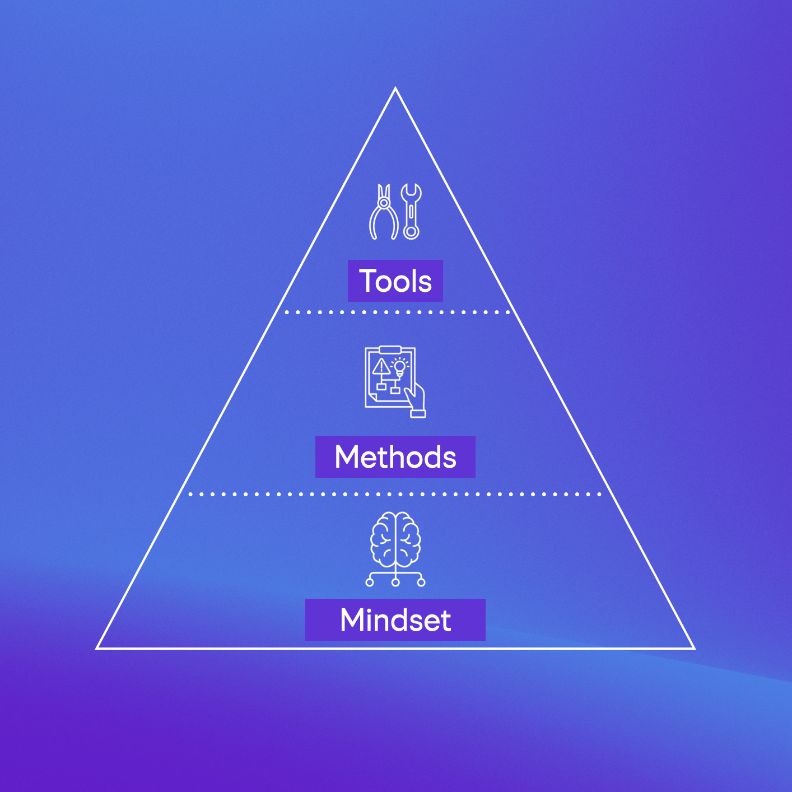

_**Not everyone needs to take notes.  

并不是每个人都需要记笔记。**_

Many of us got through school just fine with little or no note-taking.  

我们中的许多人都很好地完成了学业，很少或根本不做笔记。

It was possible to sit at a writing test and just think on the spot.  

可以参加写作考试并当场思考。

It was possible to prepare for an exam just by reading highlighted material and memorising it.  

只需阅读突出显示的材料并记住它就可以准备考试。

It was possible to find our sources again as the teacher had given us the reading list.  

因为老师给了我们阅读清单，所以我们可以再次找到资源。

I mean, why would you need to take notes if: you can remember all the information you need; you don’t deal with complex information from multiple sources; and you don’t write long reports or content?  

我的意思是，如果满足以下条件，您为什么需要记笔记： 您可以记住所需的所有信息；您不处理来自多个来源的复杂信息；您不写长报告或内容吗？  

Unnecessary, right? 没有必要吧？

**But taking notes is essential for knowledge work.  

但做笔记对于知识工作至关重要。**

Knowledge workers need to be constantly improving their knowledge through study and research, applying knowledge to solve problems, and communicating their knowledge to others.  

知识工作者需要通过学习和研究不断提高自己的知识，运用知识解决问题，并将知识传播给他人。

There is no list of assigned readings. The exam can happen at any time in any shape and form.  

没有分配的阅读清单。考试可以随时以任何形式进行。  

And the amount of information is so large that we can’t expect one would remember, make sense, and generate new ideas all in one sitting only with what they have in mind.  

信息量如此之大，我们不能指望人们能够仅凭自己的想法就能记住、理解并产生新的想法。

So we take notes. 所以我们记笔记。

**But how to take effective notes?  

但如何做有效的笔记呢？**

Ask 5 people this question and you are likely to receive five different answers.  

问 5 个人这个问题，你可能会得到五个不同的答案。

The fact is: no one knows what effective note-taking looks like. Mostly because there is not enough research on the topic (until now at least).  

事实是：没有人知道有效的笔记是什么样的。主要是因为对该主题的研究还不够（至少到目前为止）。

Instead, we share our practice (and hopefully the reasoning behind it) in the hope it can be useful to others.  

相反，我们分享我们的实践（并希望其背后的推理），希望它对其他人有用。

In this article I will highlight common note-taking traps and how to overcome them.  

在这篇文章中，我将重点介绍常见的笔记陷阱以及如何克服它们。

## **Defining Effective Note-Taking  

定义有效的笔记**

Effective means to be successful in producing a given outcome. Thus, for something to be effective it needs a goal or intention.  

有效意味着成功地产生给定的结果。因此，为了使某件事有效，它需要一个目标或意图。

Any note-taking goal, even "no goal at all" (which is also a goal), will determine how effective your note-taking techniques are.  

任何记笔记的目标，即使是“根本没有目标”（这也是一个目标），都将决定你的记笔记技巧的有效性。

As my professional focus is in note-taking for self-expression, research, learning, and creativity, my focus here will be on knowledge and ideas.  

由于我的专业重点是为自我表达、研究、学习和创造力做笔记，所以我在这里的重点将是知识和想法。  

That means it won’t include information about tasks, files (e.g. invoices, business cards), or people.  

这意味着它不会包含有关任务、文件（例如发票、名片）或人员的信息。

I want to discuss a note-taking practice that:  

我想讨论一种记笔记的做法：

-   Supports your way of thinking (it is customised to you).  
    
    支持您的思维方式（为您定制）。
-   Represents your knowledge (inspired and influenced by the words of others, but not just a copy/paste of their words).  
    
    代表您的知识（受到他人话语的启发和影响，但不仅仅是他们话语的复制/粘贴）。
-   Allows for easy retrieval of your knowledge.  
    
    可以轻松检索您的知识。

So let’s check what are 3 common note-taking traps when you are trying to create a system that is truly yours.  

因此，让我们来看看当您尝试创建真正属于您自己的系统时，三种常见的笔记陷阱是什么。

## **Note-Taking Traps 记笔记的陷阱**

First, why do I call them _traps_ rather than _mistakes_?  

首先，为什么我称它们为陷阱而不是错误？

These practices can move you forward so they are not mistakes. They will support your thinking and give you a sense of accomplishment, but only up to a point.  

这些做法可以推动你前进，所以它们不是错误。他们会支持你的想法并给你一种成就感，但仅限于一定程度。  

They move you forward but they are not the best you could achieve.  

它们会推动你前进，但并不是你能达到的最好水平。

As you transform these practices into habits, it becomes way harder to get rid of them. Thus, a trap.  

当你将这些做法转变为习惯时，摆脱它们就变得更加困难。于是，一个陷阱。

So, which traps are those? Let’s check them out.  

那么，这些陷阱是哪些呢？让我们来看看它们。

_What is the best note-taking tool?  

最好的笔记工具是什么？_

This is, by far, the main question I receive. And, honestly, I have once asked that question as well.  

到目前为止，这是我收到的主要问题。老实说，我也曾经问过这个问题。

When we notice that note-taking can be more than just “copying what the teacher wrote on the blackboard”, we get passionate about the possibilities of our tools.  

当我们注意到记笔记不仅仅是“抄写老师在黑板上写的东西”时，我们就会对我们的工具的可能性充满热情。

**Should you use Evernote, Notion, Scrintal, Obsidian, or Tana?  

您应该使用 Evernote、Notion、Scrintal、Obsidian 还是 Tana？**

We get excited about their features: which tag system should I use? Should I use an outliner, a long-form note, or a visual way of representation?  

我们对它们的功能感到兴奋：我应该使用哪个标签系统？我应该使用大纲、长篇笔记还是视觉表示方式？  

How many links should I have in a note?  

笔记中应该有多少个链接？

Questions, questions, questions.  

问题，问题，问题。

It turns out each tool is the result of a series of design decisions made by its creators, all of which may have positive or negative effects on you.  

事实证明，每个工具都是其创建者做出的一系列设计决策的结果，所有这些决策都可能对您产生积极或消极的影响。  

So, to pick up the best tool to _support your way of thinking_, first you need to decide: which way of thinking should your tool support?  

因此，要选择最好的工具来支持您的思维方式，首先您需要决定：您的工具应该支持哪种思维方式？

**To make the process easier I created the PKM Pyramid.  

为了使这个过程更容易，我创建了 PKM 金字塔。**

PKM stands for Personal Knowledge Management — that is, effective note-taking as we are focusing here.  

PKM 代表个人知识管理，即我们这里关注的有效笔记。

PKM Pyramid PKM 金字塔

The PKM Pyramid is an acknowledgment that tools support certain ways of thinking, while adding friction to others. It has three levels:  

PKM 金字塔承认工具支持某些思维方式，同时给其他思维方式增加摩擦。它分为三个级别：

-   **Mindset** is a _way of thinking_ or a _state of mind_.  
    
    心态是一种思维方式或心态。
-   **Method** is a procedure that puts a mindset into practice. Two methods can be compared against each other regarding how efficient they are in supporting one (or more) mindset(s).  
    
    方法是将心态付诸实践的过程。可以对两种方法在支持一种（或多种）心态方面的效率进行相互比较。
-   **Tool** is an artefact that enables the application of one or more methods.  
    
    工具是一种能够应用一种或多种方法的人工制品。

At the base of the pyramid we have the mindset. This is what we want your tool to support. Only by building the base we then start creating the upper levels.  

在金字塔的底部，我们有心态。这就是我们希望您的工具支持的内容。只有建立了基础，我们才能开始创建上层。  

Without the base, everything will eventually collapse (sometimes over and over again).  

没有基础，一切最终都会崩溃（有时会一次又一次）。

But climbing this pyramid is not a trivial task.  

但攀登这座金字塔并非易事。  

In my own practice and teaching of note-taking I have already uncovered more than 20 mindsets and I know the list is far from complete. So, how can you get started?  

在我自己的笔记实践和教学中，我已经发现了 20 多种思维模式，而且我知道这个列表还远未完成。那么，如何开始呢？

Here are 3 options for you to choose:  

这里有 3 个选项供您选择：

**Option 1 (not recommended).** Learn all mindsets that work for you before you choose a tool. That means: self-reflection, reading, self-reflection.  

选项 1（不推荐）。在选择工具之前，了解所有适合您的心态。这意味着：自我反思、阅读、自我反思。  

You think a lot before you try anything out, but it doesn’t really work, does it?  

在尝试任何事情之前你会想很多，但实际上并没有什么作用，不是吗？

**Option 2.** Choose a tool you like and use it while exploring your intended mindsets.  

选项 2. 选择一个您喜欢的工具并在探索您想要的思维方式时使用它。  

You will learn by trial-and-error and by finding points of friction where your mind doesn’t work as you want it.  

你将通过反复试验并找到你的思维无法按照你想要的方式工作的摩擦点来学习。  

It won’t make the exploratory process any faster, but at least you will get started.  

它不会使探索过程变得更快，但至少你会开始。

**Option 3.** Work with a Personal Knowledge Management professional and a supportive community to get a quick start to your process.

  

选项 3. 与个人知识管理专业人员和支持社区合作，快速启动您的流程。  

It is easier to start your journey from a list of mindsets and some initial methods than having to figure it all out alone.  

从一系列思维方式和一些初步方法开始你的旅程比独自解决所有问题更容易。

Climbing the PKM Pyramid is a personal journey, but you don’t need to do it alone. The community is here so you just need to reach out.  

攀登 PKM 金字塔是一次个人旅程，但您不需要独自完成。社区就在这里，所以您只需要伸出援手。

**Solution for trap 1:** Climb your PKM Pyramid.  

陷阱 1 的解决方案：攀登 PKM 金字塔。

## Note-Taking Trap 2. Writing Notes as Pieces of Truth  

笔记陷阱 2. 把笔记当作真理来写

Our second trap appears when we want to build a system that _represents your knowledge_.  

当我们想要构建一个代表您的知识的系统时，我们的第二个陷阱就出现了。

I mean.. Look at your notes (if you have them or not).  

我的意思是..看看你的笔记（如果你有的话）。

If you need to prove to someone that you have the knowledge you claim you have, could you just give them all your notes?  

如果您需要向某人证明您拥有您声称拥有的知识，您可以将所有笔记提供给他们吗？  

Do these notes represent all the knowledge you have or are they just clippings of other people’s words?  

这些笔记代表了你所拥有的所有知识还是只是别人的话的剪报？

When it comes to writing the content of our notes, we can use two different mindsets.  

在撰写笔记内容时，我们可以使用两种不同的思维方式。

**The first mindset is what I call** _**Notes as Pieces of Truth**_**.**  

第一种心态就是我所说的“笔记是真理”。

It refers to the desire to have only true, complete, and high quality knowledge within our notes. In that case, false, partial, or vague information is not allowed.  

它指的是在我们的笔记中只拥有真实、完整、高质量的知识的愿望。在这种情况下，不允许提供虚假、部分或模糊的信息。

The consequence is the belief that all our notes should contain _pieces of truth_.  

结果是我们相信我们所有的笔记都应该包含事实。

But tell me.. 但告诉我..

Have you ever seen a (non-egoistic) person who ever believed their thoughts are _the absolute_ truth?  

您是否见过一个（非利己主义）相信自己的想法是绝对真理的人？

The consequences of having this mindset are:  

拥有这种心态的后果是：

1.  **We avoid writing our own thoughts down.** As every note needs to be their final version with only correct information, it instantly triggers perfectionism.  
    
    我们避免写下自己的想法。由于每个笔记都需要是只有正确信息的最终版本，因此它会立即引发完美主义。  
    
    When that happens, we may avoid writing notes about our thoughts altogether.  
    
    当这种情况发生时，我们可能会完全避免写下我们的想法的笔记。  
    
2.  **Personal notes are seen as disposable.** When we finally come to write down our thoughts, we just treat these as fleeting notes – notes that are disposable and have a deadline to go to the rubbish bin (or trash can).  
    
    个人笔记被视为一次性的。当我们最终写下我们的想法时，我们只是将它们视为转瞬即逝的笔记——一次性的笔记，并且有最后期限扔进垃圾箱（或垃圾箱）。  
    
    By treating them as disposable, we tend to not work well on our own thoughts. Why would you put effort in growing a note that will go into the bin anyway?  
    
    如果将它们视为一次性的，我们往往无法很好地按照自己的想法工作。你为什么要花精力去制作一张无论如何都会被扔进垃圾箱的纸条呢？  
    
3.  **All our long term notes are the words of other people.** You want to write content with your own knowledge contributions. Yet, all your good notes are about other people's thoughts.  
    
    我们所有的长期笔记都是其他人的话。您想用自己的知识贡献来编写内容。然而，你所有的好笔记都是关于其他人的想法的。  
    
    You just try to capture the author's thoughts exactly as published. You do have quotations, facts and citations, but where is your own argument? Where is _your_ knowledge?  
    
    你只需尝试准确地捕捉作者发表的想法即可。你确实有引文、事实和引文，但你自己的论点在哪里？你的知识在哪里？

This mindset will give you notes with a lot of information. But if our goal is to represent _your_ _knowledge_ then it becomes a trap.  

这种心态将为您提供包含大量信息的笔记。但如果我们的目标是代表你的知识，那么它就成了一个陷阱。

**Instead, I suggest creating** _**Notes as Pieces of Understanding**_**.**  

相反，我建议将注释创建为理解片段。

This mindset recognises that ideas are born vague, incomplete, and chaotic. Only by spending time with those ideas will they grow into what we could consider _truth_ or at least _good reasoning_.  

这种心态认识到想法生来就是模糊的、不完整的和混乱的。只有花时间思考这些想法，它们才会成长为我们认为的真理或至少是良好的推理。

If you see notes as pieces of understanding it also means your notes will improve over time. As your understanding grows, your notes will grow with it.  

如果您将笔记视为理解的一部分，这也意味着您的笔记会随着时间的推移而改进。随着你的理解不断增长，你的笔记也会随之增长。

At any point in time you can look at your notes and say: this is my current understanding, my current knowledge about these ideas. They won’t be just information you came across.  

在任何时候你都可以查看你的笔记并说：这是我目前的理解，我目前对这些想法的了解。它们不仅仅是您遇到的信息。  

Instead, they will represent your personal knowledge (even if still inspired by your sources).  

相反，它们将代表您的个人知识（即使仍然受到您的来源的启发）。

**Solution for trap 2:** See your notes as pieces of understanding.  

陷阱 2 的解决方案：将笔记视为理解的片段。

## Note-Taking Trap 3. Writing Document Notes  

笔记陷阱3. 写文档笔记

Creating notes is time consuming.  

创建笔记非常耗时。

So we don’t want you to write 100s of notes just to discover you can’t find them later – when you need them the most.  

因此，我们不希望您写了数百条笔记，只是为了在您最需要的时候发现找不到它们。

Then let us stop for a moment to investigate when we want to find our notes again. To:  

然后，当我们想再次找到我们的笔记时，让我们停下来调查一下。到：

1.  remember what we know about, or related to, an idea.  
    
    记住我们对某个想法的了解或与之相关的内容。
2.  improve our understanding or expression of an idea.  
    
    提高我们对想法的理解或表达。
3.  communicate an idea (in a project, deliverable, or a conversation).  
    
    传达想法（在项目、可交付成果或对话中）。

**We are always looking for ideas in our notes.  

我们总是在笔记中寻找想法。**

Now let us investigate how most people take notes:  

现在让我们调查一下大多数人如何记笔记：

-   A note with all knowledge you needed for a deliverable (e.g. Report May/22).  
    
    包含交付成果所需的所有知识的注释（例如 5 月/22 日报告）。
-   A note for a source you have read (e.g. Comments on Article X’s highlights).  
    
    您已阅读的来源的注释（例如对第 X 条要点的评论）。
-   A note with all thoughts and ideas you had on a given day (e.g. Daily note 05/07/2023).  
    
    包含您在某一天的所有想法和想法的便笺（例如每日便笺 05/07/2023）。
-   A note with everything you know about a topic (e.g. Oceanography).  
    
    包含您所了解的有关某个主题（例如海洋学）的所有信息的注释。

**Most people take what I call** _**document notes**_**.**  

大多数人都会做我所说的文档笔记。

And this is our 3rd trap.  

这是我们的第三个陷阱。

Document notes contain either multiple snippets of ideas or a full argument chain within a single note.  

文档注释在单个注释中包含多个想法片段或完整的论点链。  

Also, to make things worse they have cryptic titles that say nothing about which ideas are inside that note.  

此外，更糟糕的是，他们的标题很神秘，根本没有说明笔记中包含哪些想法。

It is inefficient to use document notes when it is time to find your ideas again, for three reasons:  

当需要再次寻找想法时，使用文档注释效率很低，原因如下：

1.  You need to remember in which document you wrote your **idea** (You most likely won’t).  
    
    您需要记住您在哪个文档中写下了您的想法（您很可能不会）。
2.  You need to read most of the note to find the paragraph mentioning the **idea** (Time consuming).  
    
    您需要阅读大部分注释才能找到提到该想法的段落（耗时）。
3.  Pieces of the same **idea** may appear spread over multiple notes (Good luck searching for it all). These pieces may even contradict each other.  
    
    同一想法的片段可能会分散在多个笔记中（祝你顺利找到所有内容）。这些部分甚至可能相互矛盾。

Now let us stop to reflect..  

现在让我们停下来反思一下..

**If you are looking for ideas, why are you writing notes as documents?  

如果您正在寻找想法，为什么要把笔记写成文档呢？**

Instead, I suggest writing what I call _idea notes_.  

相反，我建议写我所说的想法笔记。

**Idea notes focus on only one idea.  

想法笔记仅关注一个想法。**

Yes, they can _contain_ multiple ideas, but they focus on only one.  

是的，它们可以包含多种想法，但它们只关注一种。  

Similar to a blurred background image in a picture, multiple ideas are present but only as a backdrop to enhance the focus on the main idea.  

与图片中模糊的背景图像类似，存在多个想法，但仅作为背景以增强对主要想法的关注。

If a background idea starts fighting for attention, then it is time to give its own note.  

如果一个背景想法开始争夺注意力，那么就该给出自己的注释了。  

As a background idea moves into its own note, it leaves a reference behind (or a link if you are into link-based note taking).  

当背景想法进入自己的笔记时，它会留下一个参考（如果您喜欢基于链接的笔记，则留下一个链接）。

So when the time comes to search for an idea, you won’t be searching and browsing through documents. Instead, you look for the note for that specific idea, directly.  

因此，当需要搜索想法时，您将不需要搜索和浏览文档。相反，您可以直接查找该特定想法的注释。

**Solution for trap 3:** Create idea notes.  

陷阱 3 的解决方案：创建创意笔记。  

## What Next? 接下来是什么？

While there is no perfect formula for effective note-taking, if you focus on the best mindsets for your specific needs, everything else will come together.  

虽然有效记笔记没有完美的公式，但如果您专注于满足您特定需求的最佳心态，其他一切都会齐头并进。

Now, it is your time to climb your PKM Pyramid, write notes as pieces of understanding, and decide whether document notes or idea notes will work best for you.  

现在，是时候爬上你的 PKM 金字塔，写下笔记作为理解的片段，并决定文档笔记或想法笔记是否最适合你。

**Bonus question:** Did you know that writing idea notes can also lead you into a few traps?  

附加问题：您是否知道写想法笔记也会让您陷入一些陷阱？

But that is the topic for another day..  

但这是另一天的主题。

##### ABOUT THE AUTHOR 关于作者

**Bianca Pereira** is a researcher and Personal Knowledge Management coach who helps you uncover the mindsets and methods to unlock your thinking. You can learn more about Bianca’s work at [http://pkm.biancapereira.me/profile](http://pkm.biancapereira.me/profile?ref=collider.space).  

比安卡·佩雷拉 (Bianca Pereira) 是一位研究员和个人知识管理教练，可帮助您发现解锁思维的心态和方法。您可以访问 http://pkm.biancapereira.me/profile 了解有关 Bianca 工作的更多信息。

💬 💬

Did this article spark any thoughts? Share with the community below.  

这篇文章是否引发了任何想法？与下面的社区分享。
