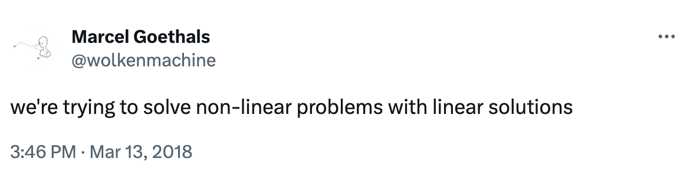
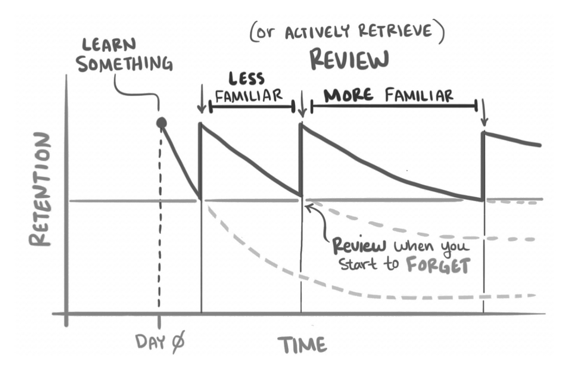
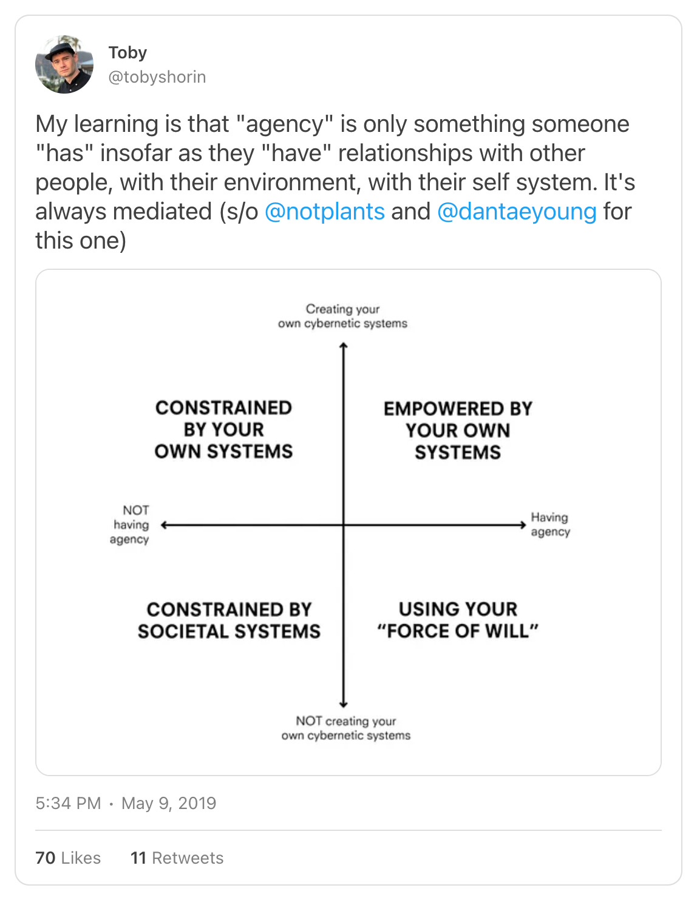

Humans think linear. You reap what you sow. No free lunch. An honest day’s work for an honest day’s pay. A penny saved is a penny earned. You get what you pay for.  

人类认为是线性的。你播种什么就收获什么。没有免费的午餐。诚实的一天的工作换来诚实的一天的工资。省钱就是赚钱。一分钱一分货。

But linearity is rare in nature. Our world is made up of complex tangles of feedback loops—ecology, biology, societies, economies. **Feedback loops are nonlinear**.  

但线性在自然界中很少见。我们的世界由复杂的反馈回路组成——生态、生物学、社会、经济。反馈回路是非线性的。

Really, there is no such thing as linearity in living systems. Anything that looks linear is the result of complex networks of opposing feedback loops. This feedback comes in two flavors:  

真的，生命系统中没有线性这样的东西。任何看起来线性的东西都是相反反馈回路的复杂网络的结果。此反馈有两种形式：

**Reinforcing feedback generates exponentials**—exponential growth or collapse, runaway change. In a reinforcing loop, the results of the previous state feed into the next, creating a snowball effect.  

强化反馈会产生指数级增长——指数增长或崩溃，失控变化。在强化循环中，上一个状态的结果会反馈到下一个状态中，从而产生滚雪球效应。

-   Compound interest: more money makes more money.  
    
    复利：更多的钱赚更多的钱。
    
-   Population growth: more people make more people.  
    
    人口增长：人越多，人越多。
    
-   Melting ice caps: less ice means less sunlight reflected means more warming means less ice.  
    
    冰盖融化：更少的冰意味着更少的阳光反射意味着更多的变暖意味着更少的冰。
    

**Balancing feedback generates equilibrium**—self-correcting, self-stabilizing change. In a balancing loop, the loop responds to change by pushing back, resulting in oscillations toward an equilibrium state. Biology and ecology are full of balancing loops. Nature is self-healing.  

平衡反馈产生平衡——自我纠正、自我稳定的变化。在平衡回路中，环路通过向后推来响应变化，导致振荡到平衡状态。生物学和生态学充满了平衡循环。大自然是自我修复的。

-   Sweat: more sweat makes less heat makes less sweat.  
    
    汗水：更多的汗水使更少的热量使更少的汗水。
    
-   Hunger: more hunger means more eating means less hunger.  
    
    饥饿：更多的饥饿意味着更多的饮食意味着更少的饥饿。
    
-   Inventory: more inventory orders mean less inventory shortage means less inventory orders.  
    
    库存：更多的库存订单意味着更少的库存短缺意味着更少的库存订单。
    

These two loop types work together to produce a dynamic equilibrium. Whenever we see something linear in nature, what we’re actually seeing is an evolving balance between reinforcing and balancing feedback.  

这两种回路类型共同作用以产生动态平衡。每当我们看到自然界中的线性事物时，我们实际上看到的是强化和平衡反馈之间不断发展的平衡。

For example, more foxes mean less rabbits (balancing feedback), but too much predation will cause the rabbit population to collapse (reinforcing loop), causing the fox population to collapse (reinforcing loop), allowing rabbit population to surge (reinforcing loop).  

例如，更多的狐狸意味着更少的兔子（平衡反馈），但过多的捕食会导致兔子种群崩溃（强化循环），导致狐狸种群崩溃（强化循环），让兔子数量激增（强化循环）。

Or as explained in Adventure Time:  

或者正如冒险时间中所解释的那样：

<iframe src="https://www.youtube-nocookie.com/embed/V1X2tTzDufE?rel=0&amp;autoplay=0&amp;showinfo=0&amp;enablejsapi=0" loading="lazy" gesture="media" allow="autoplay; fullscreen" allowautoplay="true" allowfullscreen="true" width="728" height="409" frameborder="0"></iframe>

To a casual observer, the ratio of foxes to rabbits might appear stable, but this balance is dynamic and adaptive. When the environment changes, it changes.  

对于一个不经意的观察者来说，狐狸与兔子的比例可能看起来很稳定，但这种平衡是动态的和适应性的。当环境发生变化时，它也会发生变化。

This makes dynamic systems extremely resilient. It also means we can fool ourselves about their apparent linearity. Knock out a few balancing loops, and you might find yourself spiraling out of a linear world into an exponential catastrophe.  

这使得动态系统具有极强的弹性。这也意味着我们可以欺骗自己，认为它们明显的线性。敲掉几个平衡循环，你可能会发现自己从一个线性世界陷入指数级的灾难。

There is great power in the making and breaking of loops.  

循环的建立和打破具有强大的力量。

Every tool is a feedback system between you and your environment. That includes our tools for thought. This suggests three different relationships we might have with our tools for thought: broken, balancing, reinforcing.  

每个工具都是您与环境之间的反馈系统。这包括我们的思考工具。这表明我们可能与我们的思维工具有三种不同的关系：破碎，平衡，加强。

-   Broken feedback: linear efforts yield linear returns  
    
    破碎的反馈：线性努力产生线性回报
    
-   Balancing feedback: linear efforts yield convergence  
    
    平衡反馈：线性努力产生收敛
    
-   Reinforcing feedback: linear efforts yield exponential returns  
    
    强化反馈：线性努力产生指数级回报
    

**Most note-taking apps have broken feedback**. Step one, you write a note, step two… there is no step two! You cast your note into the abyss of Apple Notes. It will never return to you, unless you go back and deliberately look for it (effort).  

大多数笔记应用都有中断的反馈。第一步，你写一张纸条，第二步...没有第二步！你把你的笔记扔进了苹果笔记的深渊。它永远不会回到你身边，除非你回去刻意寻找它（努力）。

The result is blank page anxiety, creative block. You have to expend effort. This is the feeling of broken feedback.  

结果是空白页焦虑，创意阻塞。你必须付出努力。这是破碎反馈的感觉。

Most of us try to overcome broken feedback through sheer force of will. I know people who sit down every Saturday and triage their notes from the week, manually closing the loop, like Spider Man holding that boat together.  

我们大多数人都试图通过纯粹的意志力来克服破碎的反馈。我认识一些每周六坐下来整理一周笔记的人，手动关闭循环，就像蜘蛛侠把那条船放在一起一样。

<iframe src="https://www.youtube-nocookie.com/embed/JjVto3QgiZ8?rel=0&amp;autoplay=0&amp;showinfo=0&amp;enablejsapi=0" loading="lazy" gesture="media" allow="autoplay; fullscreen" allowautoplay="true" allowfullscreen="true" width="728" height="409" frameborder="0"></iframe>

But applying linear effort to a superlinear force is a losing battle. Most of us aren’t superheroes. Our strength will eventually be exhausted.  

但是，将线性努力应用于超线性力是一场失败的战斗。我们大多数人都不是超级英雄。我们的力量最终会耗尽。

There is a better way: design your feedback loops. There are already, today, some tools for thought that construct useful feedback systems.  

有一个更好的方法：设计你的反馈循环。今天，已经有一些思考工具可以构建有用的反馈系统。

**[Anki](https://apps.ankiweb.net/) uses balancing feedback to generate memorization**. Anki is an app for reviewing flashcards. When you succeed, that flashcard is shown less often. When you fail, the flashcard is shown more often. The result is that you converge toward memorizing the cards.  

Anki使用平衡反馈来产生记忆。Anki是一款用于审查抽认卡的应用程序。当你成功时，抽认卡的显示频率就会降低。失败时，抽认卡会更频繁地显示。结果是你收敛到记住卡片。

**[Zettelkasten](https://en.wikipedia.org/wiki/Zettelkasten) uses reinforcing feedback to generate ideas**.  

Zettelkasten使用强化反馈来产生想法。

> The core game mechanic of Zettelkasten is to file your note some place where you would want to stumble over it again. As you rifle through old notes to find this place, you _recurse over_ notes you had forgotten about, sparking new ideas, which you then write down, and have to file, causing you to rifle through again, sparking more ideas… in a cascade of idea generation. Zettelkasten is a feedback system**.**  
> 
> Zettelkasten 的核心游戏机制是将您的笔记归档到您想要再次绊倒的地方。当你翻阅旧笔记找到这个地方时，你会重复你忘记的笔记，激发新的想法，然后你写下来，然后必须归档，让你再次翻阅，激发更多的想法......在一连串的想法产生中。Zettelkasten是一个反馈系统。
> 
> _(Subconscious, 2021. [Knowledge gardening is recursive](https://subconscious.substack.com/p/knowledge-gardening-is-recursive).)  
> 
> （潜意识，2021 年。知识园艺是递归的。_

Of course feedback can also work against you. A misaligned balancing loop might mean your linear effort produces no return at all. A misaligned reinforcing loop will overwhelm your efforts and may even manipulate you!  

当然，反馈也可能对你不利。未对齐的平衡回路可能意味着您的线性努力根本不会产生任何回报。错位的加固环会压倒你的努力，甚至可能操纵你！

Social media, for example, constructs reinforcing loops around engagement. The reinforcing feedback loops of likes, reacts, retweets, and algorithmic feeds act like gain-of-function research for viral memes.  

例如，社交媒体构建了围绕参与度的强化循环。喜欢、反应、转发和算法提要的强化反馈循环就像病毒模因的功能获得研究。

> I suspect this kind of viral procreation favors small ideas with [low information payloads](https://en.wikipedia.org/wiki/Entropy_(information_theory)) and [high contagiousness](https://en.wikipedia.org/wiki/Basic_reproduction_number). Why? The same reason [Goldberg’s Building Block Hypothesis](https://gordonbrander.com/pattern/building-block-hypothesis/) selects for short genes. The more compact the meme, the easier to copy. The higher the contagiousness, the more often repeated. [R-selected](https://subconscious.substack.com/p/is-open-source-r-selected) information organisms.  
> 
> 我怀疑这种病毒式繁殖有利于信息有效载荷低、传染性高的小想法。为什么？与戈德堡的构建块假说选择短基因的原因相同。模因越紧凑，越容易复制。传染性越高，重复的频率就越高。R-选择的信息生物。
> 
> This does seem to be what we see proliferating on social media. Exploitables, snowclones, #relatable content, hot takes, thirst traps, flamebait fishing for dunks, all under ruthless selection pressure to enhance virality.  
> 
> 这似乎是我们在社交媒体上看到的激增。可利用物、雪克隆物、#relatable内容、热点、口渴陷阱、扣篮的火焰诱饵，所有这些都在无情的选择压力下，以增强病毒式传播。
> 
> _(Subconscious, 2022. [Complex ideas procreate through citation](https://subconscious.substack.com/p/ideas-procreate-through-citation))  
> 
> （潜意识，2022 年。复杂的想法通过引用生育）_

The result is often [memetic epidemics](https://en.wikipedia.org/wiki/Social_contagion) and [audience capture](https://gurwinder.substack.com/p/the-perils-of-audience-capture). First we program our feedback loops, then they program us.  

结果往往是模因流行病和观众捕获。首先，我们对反馈循环进行编程，然后他们对我们进行编程。

Agency is not a function of effort or willpower, but a function of the feedback loops you garden around you.  

能动性不是努力或意志力的功能，而是你周围反馈循环的功能。

What are the feedback loops around me? What do they generate? What do they converge toward? Do they share my goals? Are my goals my goals, or the goals of the feedback loop? How might I construct my feedback loops to generate agency?  

我周围的反馈循环是什么？它们会产生什么？它们汇聚到什么地方？他们和我的目标一样吗？我的目标是我的目标，还是反馈循环的目标？如何构建反馈循环以产生代理？

Ask what you want out of your feedback loops and build them accordingly.  

询问您希望从反馈循环中得到什么，并相应地构建它们。

For our app, [Subconscious](https://subconscious.network/#subconscious), that’s emergent [collective intelligence](https://en.wikipedia.org/wiki/Collective_intelligence). Generating ideas, insights, and knowledge, [from the bottom-up](https://subconscious.substack.com/p/self-organizing-ideas).  

对于我们的应用程序Subconsciousness来说，这是新兴的集体智慧。自下而上产生想法、见解和知识。

Elsewhere in the Noosphere… I recently had the opportunity to join two podcasts.  

在智力圈的其他地方...我最近有机会加入两个播客。

-   **[GreenPill: A Protocol for thinking together](https://www.youtube.com/watch?v=vnFIfse2NNw)** Kevin Owocki reached out about my article [Thinking Together](https://subconscious.substack.com/p/thinking-together). I told him we had to get Michael Garfield, host of the SFI podcast to join. We have a wide-ranging discussion about social complexity, sensemaking, and how we can scale our civilizational CPUs.  
    
    GreenPill：共同思考的协议 Kevin Owocki联系了我的文章“一起思考”。我告诉他，我们必须让SFI播客的主持人迈克尔·加菲尔德（Michael Garfield）加入。我们对社会复杂性、意义构建以及如何扩展我们的文明 CPU 进行了广泛的讨论。
    
-   **[Lux: The p-zombie theory of consciousness](https://www.youtube.com/watch?v=wq9dKtA4L4Q)**. I join [Sam Arbesman](https://arbesman.net/) and [Danny Chrichton](https://www.luxcapital.com/people/danny-crichton) to riff on LLMs, philosophical zombies, and Peter Watts’ hard sci-fi cosmic horror masterpiece, [Blindsight](https://www.rifters.com/real/Blindsight.htm). Spoiler warning: we delve into the book’s big ideas, so if you haven’t read it, don’t click!  
    
    勒克斯：意识的p僵尸理论。我和Sam Arbesman和Danny Chrichton一起对LLM，哲学僵尸和Peter Watts的硬科幻宇宙恐怖杰作Blindsight进行了即兴演奏。剧透警告：我们深入研究了这本书的大创意，所以如果你还没有读过它，请不要点击！
