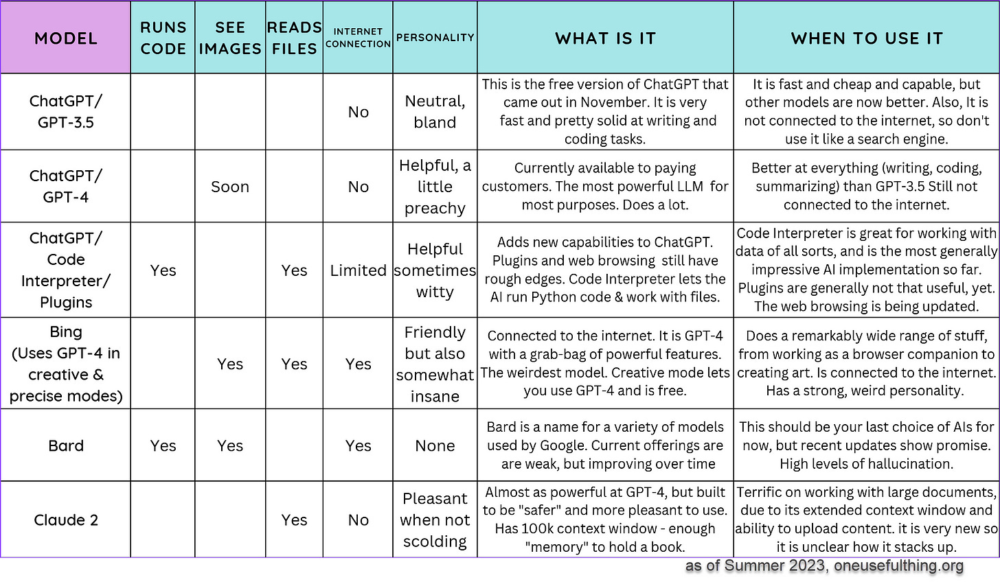
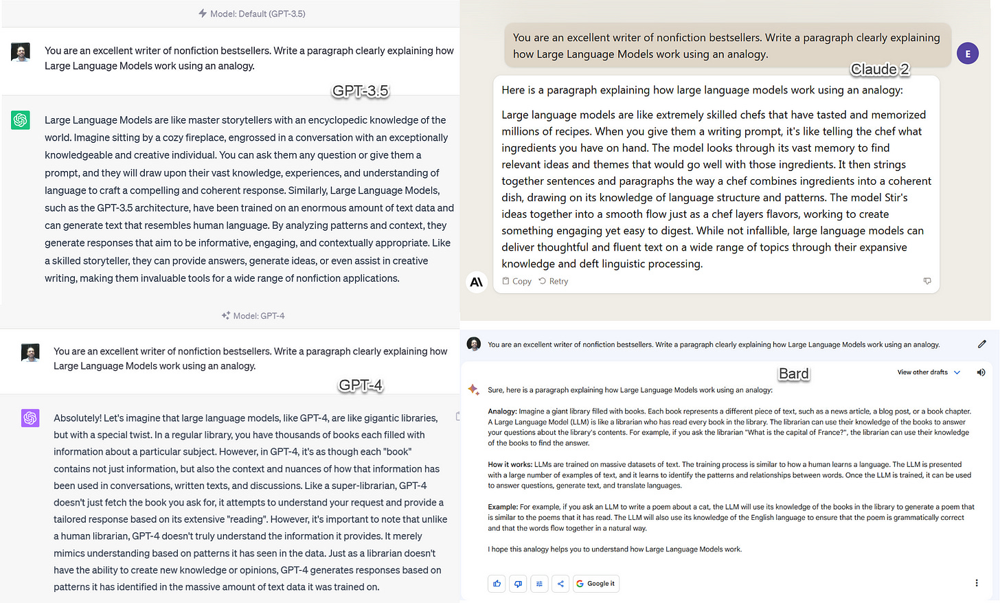
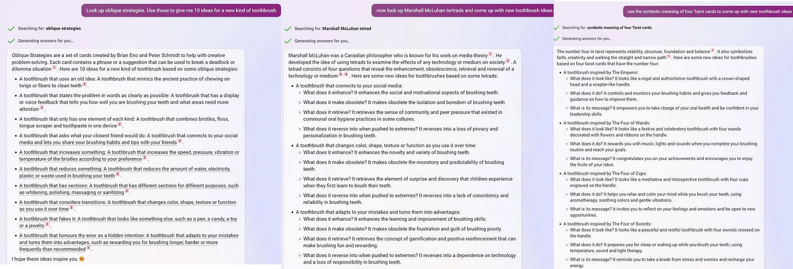
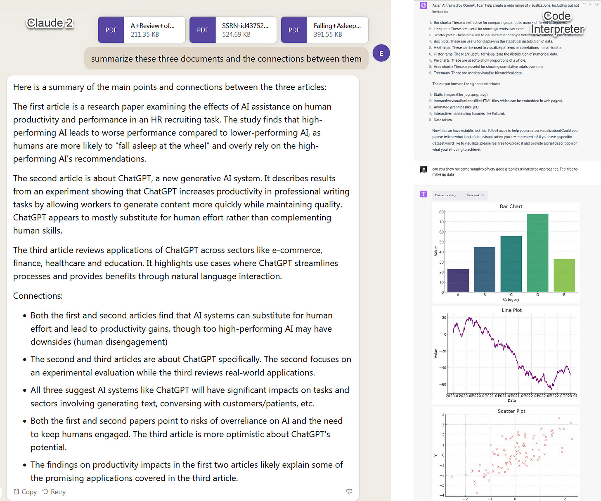

Increasingly powerful AI systems are being released at an increasingly rapid pace. This week saw the debut of Claude 2, likely the second most capable AI system available to the public. The week before, Open AI released Code Interpreter, the most sophisticated mode of AI yet available. The week before that, some AIs [got the ability to see images](https://www.oneusefulthing.org/p/on-giving-ai-eyes-and-ears).  

越来越强大的人工智能系统正在以越来越快的速度发布。本周，Claude 2首次亮相，这可能是公众可用的第二强大的AI系统。一周前，Open AI发布了代码解释器，这是迄今为止最先进的AI模式。在那之前的一周，一些AI获得了查看图像的能力。

And yet not a single AI lab seems to have provided any user documentation. Instead, the only user guides out there appear to be Twitter influencer threads. Documentation-by-rumor is a weird choice for organizations claiming to be concerned about proper use of their technologies, but here we are.  

然而，似乎没有一个人工智能实验室提供任何用户文档。相反，唯一的用户指南似乎是Twitter影响者线程。对于声称关心正确使用其技术的组织来说，谣言文档是一个奇怪的选择，但我们在这里。

I can’t claim that this is going to be a complete user guide, but it will serve as a bit of orientation to the current state of AI. I have been putting together a Getting Started Guide to AI for my students (and interested readers) every few months, and each time, it requires major modifications. The last couple of months have been particularly insane.  

我不能说这将是一个完整的用户指南，但它将作为人工智能当前状态的一点方向。我每隔几个月就会为我的学生（和感兴趣的读者）整理一份人工智能入门指南，每次都需要进行重大修改。过去的几个月特别疯狂。

This guide is opinionated, based on my experience, and focused on how to pick the right tool to do things. I have written separately about [the kinds of tasks you may want AI to do](https://www.oneusefulthing.org/p/on-boarding-your-ai-intern), which might be useful to read first.  

本指南是根据我的经验，固执己见，专注于如何选择正确的工具来做事。我已经单独写了你可能希望AI执行的任务类型，这些任务可能很有用。

When we talk about AI right now, we are usually talking about Large Language Models, or LLMs. Most AI applications are powered by LLMs, of which there are just a few Foundation Models, created by a handful of organizations. Each company gives direct access to their models via a Chatbot: OpenAI makes GPT-3.5 and GPT-4, which power [ChatGPT](https://chat.openai.com/) and Microsoft’s [Bing](https://www.bing.com/search?q=Bing+AI&showconv=1&FORM=hpcodx&sydconv=1) (access it on an Edge browser). Google has a variety of models under the label of [Bard](https://bard.google.com/). And Anthropic makes Claude and [Claude 2](https://claude.ai/).  

当我们现在谈论人工智能时，我们通常谈论的是大型语言模型或LLM。大多数AI应用程序由LLM提供支持，其中只有少数几个基础模型，由少数组织创建。每家公司都可以通过聊天机器人直接访问他们的模型：OpenAI制造GPT-3.5和GPT-4，它们为ChatGPT和Microsoft的Bing提供支持（在Edge浏览器上访问它）。谷歌在巴德的标签下有各种各样的模型。而《人择》使克劳德和克劳德2。

There are other LLMs I won’t be discussing. The first is [Pi](https://pi.ai/talk), a chatbot built by Inflection. Pi is optimized for conversation, and really, really wants to be your friend (seriously, try it to see what I mean). It does not like to do much besides chat, and trying to get it to do work for you is an exercise in frustration. We also won’t cover the variety of open source models that anyone can use and modify. They are generally not accessible or useful for the casual user today, but have real promise. Future guides may include them.  

还有其他LLM我不会讨论。第一个是Pi，一个由Inflection构建的聊天机器人。Pi 针对对话进行了优化，真的，真的很想成为你的朋友（说真的，试试看我的意思）。除了聊天之外，它不喜欢做太多事情，试图让它为你工作是一种沮丧的练习。我们也不会涵盖任何人都可以使用和修改的各种开源模型。它们通常对今天的临时用户无法访问或有用，但具有真正的希望。未来的指南可能会包括它们。

So here is your quick reference chart, summarizing the state of LLMs:  

所以这是你的快速参考图表，总结了LLM的状态：

The first four (including Bing) are all OpenAI systems. There are basically two major OpenAI AIs today: 3.5 and 4. The 3.5 model kicked off the current AI craze in November, the 4 model premiered in the Spring and is much more powerful. A new variation uses plugins to connect to the internet and other apps. There are a lot of plugins, most of which are not very useful, but you should feel free to explore them as needed. Code Interpreter as is an extremely powerful version of ChatGPT that can run Python programs. If you have never paid for OpenAI, you have only used 3.5. Aside from the plugins variation, and a temporarily suspended version of GPT-4 with browsing, none of these models are connected to the internet. Microsoft’s Bing uses a mix of 4 and 3.5, and is usually the first model in the GPT-4 family to roll out new features. For example, it can both create and view images, and it can read documents in the web browser. It is connected to the internet. [Bing is a bit weird to use, but powerful.](https://oneusefulthing.substack.com/p/power-and-weirdness-how-to-use-bing)  

前四个（包括Bing）都是OpenAI系统。目前基本上有两种主要的OpenAI AI：3.5和4。3.5 模型在 11 月掀起了当前的 AI 热潮，4 模型在春季首映，功能更强大。一个新的变体使用插件连接到互联网和其他应用程序。有很多插件，其中大多数不是很有用，但您应该根据需要随意探索它们。Code Interpreter as 是 ChatGPT 的一个非常强大的版本，可以运行 Python 程序。如果您从未为OpenAI付费，那么您只使用了3.5。除了插件变体和具有浏览功能的 GPT-4 的暂时暂停版本外，这些模型都没有连接到互联网。Microsoft的Bing混合使用4和3.5，通常是GPT-4系列中第一个推出新功能的型号。例如，它既可以创建和查看图像，也可以在 Web 浏览器中读取文档。它连接到互联网。必应使用起来有点奇怪，但功能强大。

Google has been testing its own AI for consumer use, which they call Bard, but which is powered by a variety of Foundation Models, most recently one called PaLM 2. For the company that developed LLM technology, they have been pretty disappointing, although improvements announced yesterday show they are still working on the underlying technology, so I have hope. It has already gained the capability to run limited code and interpret images, but I would generally avoid it for now.  

谷歌一直在测试自己的人工智能供消费者使用，他们称之为Bard，但它由各种基础模型提供支持，最近的一个称为PaLM 2。对于开发LLM技术的公司来说，他们非常令人失望，尽管昨天宣布的改进表明他们仍在研究底层技术，所以我有希望。它已经获得了运行有限代码和解释图像的能力，但我现在通常会避免使用它。

The final company, Anthropic has released Claude 2. Claude is most notable for having a very large context window - essentially the memory of the LLM. Claude can hold almost an entire book, or many PDFs, in memory. It has been built to be less likely to act maliciously than other Large Language Models, which means, practically, that it tends to scold you a bit about stuff.  

最后一家公司Anthropic发布了Claude 2。克劳德最引人注目的是有一个非常大的上下文窗口 - 基本上是LLM的内存。克劳德几乎可以保存整本书或许多PDF。与其他大型语言模型相比，它不太可能恶意行事，这意味着，实际上，它往往会责骂你一些东西。

Now, on to some uses:  

现在，谈谈一些用途：

**Best free options:** [Bing](https://www.bing.com/search?q=Bing+AI&showconv=1&FORM=hpcodx) and [Claude 2](https://claude.ai/)  

最佳免费选择：必应和克劳德 2  

**Paid option:** [ChatGPT](https://chat.openai.com/chat) 4.0/ChatGPT with plugins  

付费选项：ChatGPT 4.0 / ChatGPT与插件

For right now, GPT-4 is still the most capable AI tool for writing, which you can access at Bing (select“creative mode”) for free or by purchasing a $20/month subscription to ChatGPT. Claude, however, is a close second, and has a limited free option available.  

目前，GPT-4仍然是功能最强大的AI写作工具，您可以在Bing（选择“创建模式”）免费或通过购买每月20美元的ChatGPT订阅来访问。然而，克劳德紧随其后，并且可用的免费选项有限。

These tools are also being integrated directly into common office applications. Microsoft Office will include a copilot powered by GPT and Google Docs will integrate suggestions from Bard. [The implications of what these new innovations mean for writing are pretty profound.](https://www.oneusefulthing.org/p/setting-time-on-fire-and-the-temptation)  

这些工具也直接集成到常见的办公应用程序中。Microsoft Office将包括一个由GPT驱动的副驾驶，Google Docs将整合巴德的建议。这些新的创新对写作的意义是相当深远的。

Here are some ways to use AI to help you write.  

以下是使用 AI 帮助您编写的一些方法。

-   Writing drafts of anything. Blog posts, essays, promotional material, speeches, lectures, chose-you-own adventures, scripts, short stories - you name it, AI does it, and pretty well. All you have to do is prompt it. Prompt crafting is not magic, but basic prompts result in boring writing, [but getting better at prompting is not that hard, just work interactively with the system.](https://www.oneusefulthing.org/p/on-boarding-your-ai-intern) You will find AI systems to be much more capable as writers with a little practice.  
    
    写任何东西的草稿。博客文章、散文、宣传材料、演讲、讲座、选择自己的冒险、脚本、短篇小说——你能想到的，人工智能都能做到，而且做得很好。您所要做的就是提示它。提示制作不是魔法，但基本的提示会导致无聊的写作，但更好地提示并不难，只需与系统交互工作即可。你会发现人工智能系统作为作家的能力要强得多，只要稍加练习。
    
-   Make your writing better. Paste your text into an AI. Ask it to improve the content, or for suggestions about how to make it better for a particular audience. Ask it to create 10 drafts in radically different styles. Ask it to make things more vivid, or add examples. Use it to inspire you to do better work.  
    
    让你的写作更好。将文本粘贴到 AI 中。要求它改进内容，或有关如何使其更好地为特定受众提供建议。要求它以完全不同的风格创建 10 个草稿。要求它使事情更加生动，或添加示例。用它来激励你做得更好。
    
-   Help you with tasks. AI can do things you don’t have the time to do. Use it like an intern to write emails, create sales templates, give you next steps in a business plan, and a lot more. [Here is what I could accomplish with it in 30 minutes in supporting a product launch.](https://oneusefulthing.substack.com/p/superhuman-what-can-ai-do-in-30-minutes)  
    
    帮助您完成任务。人工智能可以做你没有时间做的事情。像实习生一样使用它来编写电子邮件、创建销售模板、为您提供商业计划的后续步骤等等。以下是我在 30 分钟内支持产品发布时可以完成的工作。
    
-   [Unblock yourself.](https://oneusefulthing.substack.com/p/how-to-use-ai-to-unstick-yourself) It is very easy to get distracted from a task by one difficult challenge. AI provides a way of giving yourself momentum.  
    
    解锁自己。很容易被一个困难的挑战分散对任务的注意力。人工智能提供了一种给自己动力的方式。
    

_Some things to worry about:_ In a bid to respond to your answers, it is very easy for the AI to “hallucinate” and generate plausible facts. It can generate entirely false content that is utterly convincing. Let me emphasize that: _**AI lies continuously and well**_. Every fact or piece of information it tells you may be incorrect. You will need to check it all. Particularly dangerous is asking it for references, quotes, citations, and information for the internet (for the models that are not connected to the internet). Bing will usually hallucinate less than other models, because GPT-4 is generally more grounded and because Bing’s internet connection means it can actually pull in relevant facts. [Here is a guide to avoiding hallucinations](https://oneusefulthing.substack.com/p/how-to-get-an-ai-to-lie-to-you-in), but they are impossible to completely eliminate.  

一些需要担心的事情：为了回应你的答案，人工智能很容易“产生幻觉”并产生合理的事实。它可以生成完全令人信服的完全虚假内容。让我强调一下：人工智能持续不断地撒谎。它告诉你的每一个事实或信息都可能是不正确的。您将需要检查所有内容。特别危险的是要求它提供互联网的参考、引用、引用和信息（对于未连接到互联网的模型）。必应通常比其他型号产生幻觉更少，因为 GPT-4 通常更接地气，而且必应的互联网连接意味着它实际上可以提取相关事实。这是避免幻觉的指南，但它们不可能完全消除。

And also note that AI doesn’t explain itself, it only makes you think it does. If you ask it to explain why it wrote something, it will give you a plausible answer that is completely made up. When you ask it for its thought process, is not interrogating its own actions, it is just generating text that sounds like it is doing so. This makes understanding biases in the system very challenging, even though those biases almost certainly exist.  

还要注意的是，人工智能并不能解释自己，它只会让你认为它能解释。如果你要求它解释它为什么写一些东西，它会给你一个完全编造的合理答案。当你问它思考过程时，它不是在质疑它自己的行为，它只是在生成听起来像是在这样做的文本。这使得理解系统中的偏见非常具有挑战性，即使这些偏见几乎肯定存在。

It also can be used unethically to manipulate or cheat. You are responsible for the output of these tools.  

它也可以不道德地用于操纵或作弊。您负责这些工具的输出。

**Most transparent option:** [Adobe Firefly](https://www.adobe.com/sensei/generative-ai/firefly.html)  

最透明的选项：Adobe Firefly**  

Open Source Option:** [Stable Diffusion](https://stable-diffusion-ui.github.io/)  

开源选项：稳定扩散  

**Best free option:** Bing or [Bing Image Creator](https://www.bing.com/images/create) (which uses DALL-E), [Playgound](https://playgroundai.com/) (which lets you use multiple models)  

最佳免费选项：Bing或Bing Image Creator（使用DALL-E），Playgound（允许您使用多个模型）  

**Best quality images:** [Midjourney](https://midjourney.com/)  

最佳质量图像：中途

There are four big image generators available for most people:  

有四个大型图像生成器可供大多数人使用：

1.  Stable Diffusion, which is open source and you can run from any high-end computer. It takes effort to get started, since you have to learn to craft prompts properly, but once you do it can produce great results. It is especially good for combining AI with images from other sources. [Here is a nice guide to Stable Diffusion if you go that route (be sure to read both parts 1 and part 2).](https://www.jonstokes.com/p/stable-diffusion-20-and-21-an-overview)  
    
    稳定的扩散，这是开源的，您可以从任何高端计算机运行。入门需要努力，因为您必须学习正确制作提示，但是一旦您这样做就可以产生很好的结果。它特别适合将AI与其他来源的图像相结合。如果你走这条路，这里有一个很好的稳定扩散指南（一定要阅读第1部分和第2部分）。
    
2.  DALL-E, from OpenAI, which is incorporated into Bing (you have to use creative mode) and Bing image creator. This system is solid, but worse than Midjourney.  
    
    DALL-E，来自OpenAI，它被合并到Bing（你必须使用创作模式）和Bing图像创建器中。这个系统很可靠，但比中途更糟糕。
    
3.  Midjourney, which is the best system in mid-2023. It has the lowest learning-curve of any system: just type in "thing-you-want-to-see --v 5.2" (the --v 5.2 at the end is important, it uses the latest model) and you get a great result. Midjourney requires Discord. [Here is a guide to](https://www.pcworld.com/article/540080/how-to-use-discord-a-beginners-guide.html) using Discord.  
    
    中途，这是 2023 年中期最好的系统。它具有所有系统中最低的学习曲线：只需输入“你想看到的东西--v 5.2”（最后的--v 5.2很重要，它使用最新的模型），你就会得到一个很好的结果。中途需要不和谐。这是使用不和谐的指南。
    
4.  Adobe Firefly, built into a variety of Adobe products, but it lags DALL-E and Midjourney in terms of quality. However, while the other two models have been unclear about the source images that they used to train their AIs, Adobe has declared that it is only using images it has the right to use.  
    
    Adobe Firefly，内置于各种Adobe产品中，但在质量方面落后于DALL-E和Midjourney。然而，虽然其他两个模型不清楚他们用来训练AI的源图像，但Adobe已经宣布它只使用它有权使用的图像。
    

Here is how they compare (each image is labelled with the model):  

以下是它们的比较方式（每个图像都标有模型）：

Prompt: “Fashion photoshoot of sneakers inspired by Van Gogh” - the first images that were created by each model  

提示：“灵感来自梵高的运动鞋的时尚照片” - 每个模特创作的第一张图片

_Some things to worry about:_ These systems are built around models that have built-in biases due to their training on Internet data (if you ask it to create a picture of an entrepreneur, for example, you will likely see more pictures featuring men than women, unless you specify “female entrepreneur”), you can use [this explorer](https://huggingface.co/spaces/society-ethics/DiffusionBiasExplorer) to see these biases at work.  

需要担心的一些事情：这些系统是围绕模型构建的，这些模型由于对互联网数据的训练而具有内置偏见（例如，如果您要求它创建企业家的图片，您可能会看到男性多于女性的图片，除非您指定“女性企业家”），您可以使用此资源管理器查看工作中存在的这些偏见。

These systems are also trained on existing art on the internet in ways that are not transparent and [potentially legally and ethically questionable](https://www.nytimes.com/2022/09/02/technology/ai-artificial-intelligence-artists.html). Though technically you own copyright of the images created, legal rules are still hazy.  

这些系统还以不透明的方式对互联网上的现有艺术进行了培训，并且可能在法律和道德上存在问题。虽然从技术上讲，您拥有所创建图像的版权，但法律规则仍然模糊不清。

Also, right now, they don’t create text, just a bunch of stuff that looks like text. But Midjourney has nailed hands.  

此外，现在，他们不创建文本，只是一堆看起来像文本的东西。但中途已经钉住了手。

**Best free option:** [Bing](https://www.bing.com/search?q=Bing+AI&showconv=1&FORM=hpcodx) 最佳免费选项：必应  

**Paid option:** [ChatGPT](https://chat.openai.com/chat) 4.0, but Bing is likely better because of its internet connections  

付费选项：ChatGPT 4.0，但Bing可能更好，因为它的互联网连接

Despite of (or in fact, because of) all its constraints and weirdness, AI is perfect for idea generation. You often need to have a lot of ideas to have good ideas, and AI is good at volume. With the right prompting, you can also force it to be very creative. Ask Bing in creative mode to look up your favorite unusual idea generation techniques, like Brian Eno's oblique strategies or Mashall McLuhan's tetrads, and apply them. Or ask for something weird, like ideas inspired by a random patent, or your favorite superhero…  

尽管（或者事实上，由于）它的所有限制和怪异，人工智能非常适合产生想法。你经常需要有很多想法才能有好的想法，而人工智能擅长数量。通过正确的提示，您还可以强制它非常有创意。让 Bing 在创作模式下查找您最喜欢的不寻常的想法生成技术，例如 Brian Eno 的倾斜策略或 Mashall McLuhan 的四分体，并应用它们。或者要求一些奇怪的东西，比如受随机专利启发的想法，或者你最喜欢的超级英雄......

**Best animation tool:** [D-i](https://www.d-id.com/)D for animating faces in videos. [Runway v2](https://app.runwayml.com/) for creating videos from text  

最佳动画工具：D-iD，用于在视频中对面部进行动画处理。跑道 v2，用于从文本创建视频  

**Best voice cloning:** [ElevenLabs](https://beta.elevenlabs.io/speech-synthesis)  

最佳语音克隆：十一实验室

It is now trivial to generate a video with a completely AI generated character, reading a completely AI-written script, talking in an AI-made voice, animated by AI. [It can also deepfake people, as you can see in this link where I deepfaked myself. Instructions and more information here.](https://oneusefulthing.substack.com/p/a-quick-and-sobering-guide-to-cloning) Use with caution, but this can be great for explainer videos and introductions.  

现在，生成一个完全由人工智能生成的角色的视频，阅读一个完全由人工智能编写的脚本，用人工智能制作的声音说话，由人工智能动画，这是微不足道的。它也可以深度伪造人，正如你在这个链接中看到的那样，我深深地伪造了自己。说明和更多信息在这里。请谨慎使用，但这非常适合解释器视频和介绍。

The first commercially available text-to-video tool was also recently released, Runway v2. It creates short 4-second clips, and is more of a demonstration of what is to come, but is worth taking a look at if you want a sense of the future development in this space.  

第一个商用的文本到视频工具最近也发布了Runway v2。它创建了 4 秒的短剪辑，更像是对即将发生的事情的演示，但如果您想了解这个领域的未来发展，值得一看。

_Some things to worry about:_ Deep fakes are a huge concern, and these systems need to be used ethically.  

需要担心的一些事情：深度伪造是一个巨大的问题，这些系统需要合乎道德地使用。

**For data (And also any weird ideas you have with code):** Code Interpreter  

对于数据（以及您对代码的任何奇怪想法）：代码解释器  

**For documents:** Claude 2 for large documents or many documents at once, Bing Sidebar for smaller documents and webpages (the sidebar, part of the Edge browsers can “see” what is in your browser, letting Bing work with that information, though the size of the context window is limited)  

对于文档：Claude 2 用于大型文档或一次多个文档，Bing 侧边栏用于较小的文档和网页（侧边栏，部分 Edge 浏览器可以“查看”浏览器中的内容，让 Bing 处理该信息，尽管上下文窗口的大小有限）

[I wrote about Code Interpreter last week](https://www.oneusefulthing.org/p/what-ai-can-do-with-a-toolbox-getting). It is a mode of GPT-4 that lets you upload files to the AI, allows the AI to write and run code, and lets you download the results provided by the AI. It can be used to execute programs, run data analysis (though you will need to know enough about statistics and data to check its work), and create all sorts of files, [web pages](https://twitter.com/prkeshari/status/1678155933606637568?s=20), and even [games](https://twitter.com/icreatelife/status/1678184683702566922?s=20). Though there has been a lot of debate since its release about the risks associated with untrained people using it for analysis, many experts testing Code Interpreter are pretty impressed, [to the degree that one paper suggests it will require changing the way we train data scientists.](https://twitter.com/emollick/status/1678615507128164354?s=20) Go to my previous post if you want more details on how to use it. I also made an initial prompt to set up Code Interpreter to create useful data visualizations. It gives it some basic principles of good chart design & also reminds it that it can output many kinds of files. You can find that [here](https://t.co/m4yAdKROiJ).  

我上周写了关于代码解释器的文章。它是 GPT-4 的一种模式，可让您将文件上传到 AI，允许 AI 编写和运行代码，并允许您下载 AI 提供的结果。它可以用来执行程序，运行数据分析（尽管你需要对统计数据和数据有足够的了解来检查它的工作），以及创建各种文件、网页，甚至游戏。尽管自发布以来，关于未经培训的人员使用它进行分析的风险存在很多争论，但许多测试代码解释器的专家都给人留下了深刻的印象，以至于一篇论文表明，它需要改变我们培训数据科学家的方式。如果您想了解有关如何使用它的更多详细信息，请转到我以前的帖子。我还初步提示设置代码解释器以创建有用的数据可视化。它为它提供了一些良好图表设计的基本原则，并提醒它可以输出多种文件。你可以在这里找到它。

For working with text, and especially PDFs, Claude 2 is excellent so far. I have pasted in entire books into the previous version of Claude, with impressive results, and the new model is much stronger. You can see my previous experience, and some prompts that might be interesting to use, [here](https://www.oneusefulthing.org/p/what-happens-when-ai-reads-a-book). I also gave it numerous complex academic articles and asked it to summarize the results, and it does a good job! Even better, you can then interrogate the material by asking follow-up questions: what is the evidence for that approach? What do the authors conclude? And so on…  

对于处理文本，尤其是PDF，Claude 2到目前为止非常出色。我把整本书都粘贴到以前的克劳德版本中，效果令人印象深刻，新模型要强大得多。您可以在此处查看我以前的体验以及一些可能很有趣的提示。我还给了它许多复杂的学术文章，并要求它总结结果，它做得很好！更好的是，您可以通过提出后续问题来询问材料：这种方法的证据是什么？作者得出什么结论？等等...

_Some things to worry about:_ These systems still hallucinate, though in more limited ways. You need to check over their results if you want to ensure accuracy.  

需要担心的一些事情：这些系统仍然会产生幻觉，尽管方式更有限。如果要确保准确性，则需要检查其结果。

**Best free option:** [Bing](https://www.bing.com/search?q=Bing+AI&showconv=1&FORM=hpcodx)  最佳免费选项：必应  

**Paid option:** Usually Bing is best. For children, [Khanmigo](https://www.khanacademy.org/khan-labs) from Khan Academy offers good AI-driven tutoring powered by GPT-4.  

付费选项：通常必应是最好的。对于儿童，可汗学院的 Khanmigo 提供由 GPT-4 提供支持的良好人工智能驱动辅导。

If you are going to use AI as a search engine, probably don’t do that. The risk of hallucination is high and most AIs are not connected to the Internet, anyway (which is why I suggest you use Bing. Bard, Google’s AI, hallucinates much more). However, there is some evidence that AI can often provide more useful answers than search when used carefully, [according to a recent pilot study](https://arxiv.org/abs/2307.01135). Especially in cases where search engines aren’t very good, [like tech support, deciding where to eat, or getting advice](https://twitter.com/emollick/status/1643718474668097538?s=20), Bing is often better than Google as a starting point. This is an area that is evolving rapidly, but you should be careful about these uses for now. [You don’t want to get in trouble.](https://www.nytimes.com/2023/06/08/nyregion/lawyer-chatgpt-sanctions.html)  

如果你打算使用AI作为搜索引擎，可能不要这样做。幻觉的风险很高，无论如何，大多数AI都没有连接到互联网（这就是为什么我建议你使用Bing。巴德，谷歌的人工智能，幻觉更多）。然而，根据最近的一项试点研究，有证据表明，如果谨慎使用，人工智能通常可以提供比搜索更有用的答案。特别是在搜索引擎不是很好的情况下，比如技术支持、决定去哪里吃饭或获得建议，必应通常比谷歌更好。这是一个快速发展的领域，但您现在应该小心这些用途。你不想惹麻烦。

But more exciting is the possibility of using AIs to help education, including helping us learn. [I have written about how AI can be used for teaching](https://www.oneusefulthing.org/p/assigning-ai-seven-ways-of-using) and to [help make teachers’ lives easier and their lessons more effective](https://oneusefulthing.substack.com/p/using-ai-to-make-teaching-easier), but it can also work for self-guided learning as well. You can ask the AI to explain concepts and get ver good results. This [prompt is a good automated tutor](https://twitter.com/emollick/status/1669434927761313807?s=20), and use can find a [direct link to activate the tutor in ChatGPT here](https://chat.openai.com/share/ec1018ec-1d86-4160-b587-354253c7d5cb). Because we know the AI could be hallucinating, you would be wise to (carefully!) double-check any critical data against another source.  

但更令人兴奋的是，使用人工智能来帮助教育的可能性，包括帮助我们学习。我写过关于人工智能如何用于教学并帮助教师的生活更轻松、课程更有效的文章，但它也可以用于自主学习。您可以要求AI解释概念并获得良好的结果。这个提示是一个很好的自动化导师，使用可以找到一个直接链接来激活 ChatGPT 中的导师 这里.因为我们知道人工智能可能是幻觉，所以你最好（仔细！）仔细检查任何关键数据与另一个来源。

Thanks to rapid advances in technology, these are likely the worst AI tools you will ever use, as the past few months of development have shown. I have no doubt I will need to make a new guide soon. But remember two key points that remain true about AI:  

由于技术的快速发展，这些可能是您将使用过的最糟糕的人工智能工具，正如过去几个月的发展所表明的那样。我毫不怀疑我很快就会需要制作一个新的指南。但请记住，关于人工智能，有两个关键点仍然适用：

-   AI is a tool. It is not always the right tool. Consider carefully whether, given its weaknesses, it is right for the purpose to which you are planning to apply it.  
    
    人工智能是一种工具。它并不总是正确的工具。鉴于其弱点，请仔细考虑它是否适合您计划应用它的目的。
    
-   There are many ethical concerns you need to be aware of. AI can be used to infringe on copyright, or to cheat, or to steal the work of others, or to manipulate. And how a particular AI model is built and who benefits from its use are often complex issues, and not particularly clear at this stage. Ultimately, you are responsible for using these tools in an ethical manner.  
    
    您需要注意许多道德问题。人工智能可以用来侵犯版权，或作弊，或窃取他人的作品，或操纵。如何构建特定的AI模型以及谁从其使用中受益通常是复杂的问题，现阶段还不是特别清楚。最终，您有责任以合乎道德的方式使用这些工具。
    

We are in the early days of a very rapidly advancing revolution. Are there other uses you want to share? Let me know in the comments.  

我们正处于一场非常迅速推进的革命的早期阶段。您是否还想分享其他用途？在评论中让我知道。

This post is licensed under a [Creative Commons Attribution-NonCommercial 4.0 International License](http://creativecommons.org/licenses/by-nc/4.0/).  

这篇文章是根据知识共享署名-非商业性使用4.0国际许可协议授权的。

[Share 共享](https://www.oneusefulthing.org/p/how-to-use-ai-to-do-stuff-an-opinionated?utm_source=substack&utm_medium=email&utm_content=share&action=share)
