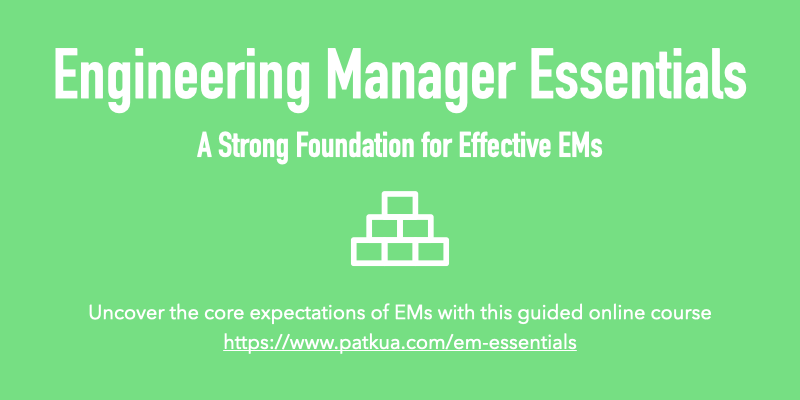
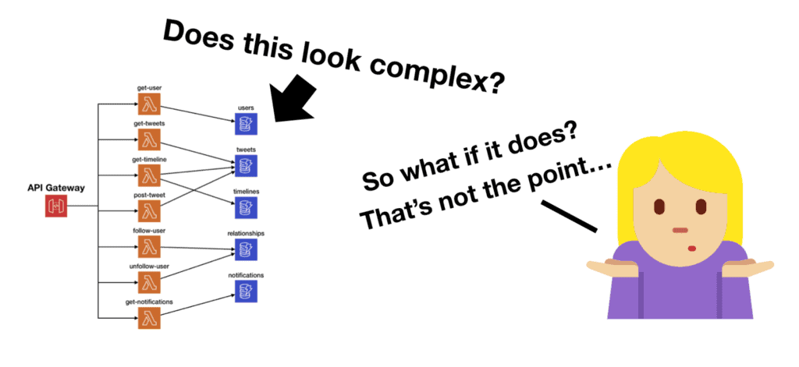
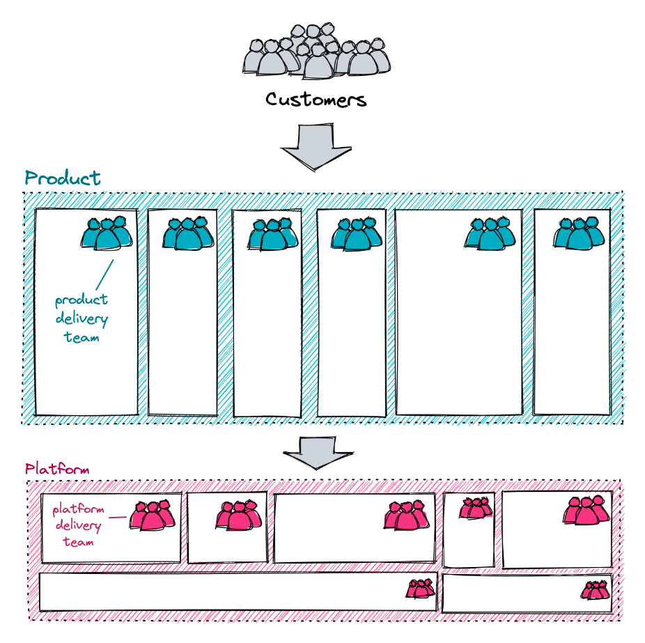
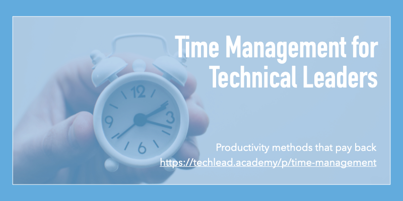
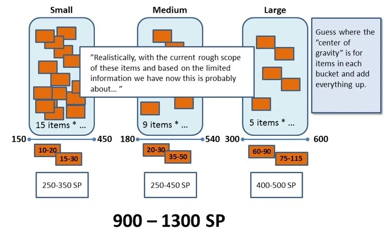
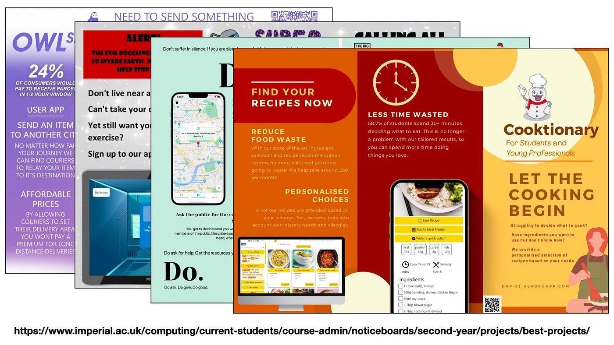

| 
<table role="presentation" data-immersive-translate-effect="1" data-immersive-translate-mark="1"><tbody data-immersive-translate-effect="1" data-immersive-translate-mark="1"><tr data-immersive-translate-effect="1" data-immersive-translate-mark="1"><td data-immersive-translate-effect="1" data-immersive-translate-mark="1">

</td></tr><tr data-immersive-translate-effect="1" data-immersive-translate-mark="1"><td data-immersive-translate-effect="1" data-immersive-translate-mark="1">

Jul 23, 2023 · Issue #206 2023 年 7 月 23 日 - 第 206 期

<strong data-immersive-translate-effect="1" data-immersive-translate-mark="1" data-immersive-translate-paragraph-id="4">Level Up</strong> is a curated newsletter for leaders in tech. A project by <a href="https://9nwl1.r.a.d.sendibm1.com/mk/cl/f/9lHp41ySy7EzBArpjMZrupKs5zADgh-M98Yj9cL4lD7ziMUNBuvpd45tmcWl25mkqMPw8smGiw669BOZCH-aCZmNuv4F-k9B_bcZv-7VvliZUUxw9H75-rwQcz2DcJ7YZUNUOaAAux2TkxnyBH24SoWazoMmdfYDq73fj6tFj-2ErdBjViNQQ0fCd2WltN5NKUqXf9qRjsAZbOrBNzDDoWoOImZutJo8uP7MIRwvoau3EhASIwMeV12D6WYKJJ4Hv-LHaAo4u6fP1oCYyKHkmrfEbIQ" target="_blank" sib_link_id="0" data-immersive-translate-effect="1" data-immersive-translate-mark="1" data-immersive-translate-paragraph-id="4">https://patkua.com</a>. Ideal for busy people such as Tech Leads, Engineering Managers, VPs of Engineering, CTOs and more.&nbsp; Level Up是一份为科技界领袖策划的通讯。是 <a href="https://9nwl1.r.a.d.sendibm1.com/mk/cl/f/9lHp41ySy7EzBArpjMZrupKs5zADgh-M98Yj9cL4lD7ziMUNBuvpd45tmcWl25mkqMPw8smGiw669BOZCH-aCZmNuv4F-k9B_bcZv-7VvliZUUxw9H75-rwQcz2DcJ7YZUNUOaAAux2TkxnyBH24SoWazoMmdfYDq73fj6tFj-2ErdBjViNQQ0fCd2WltN5NKUqXf9qRjsAZbOrBNzDDoWoOImZutJo8uP7MIRwvoau3EhASIwMeV12D6WYKJJ4Hv-LHaAo4u6fP1oCYyKHkmrfEbIQ" target="_blank" sib_link_id="0" data-immersive-translate-effect="1" data-immersive-translate-mark="1" data-immersive-translate-paragraph-id="4">https://patkua.com</a> 的一个项目。是忙碌的人们的理想选择，如技术领导、工程经理、工程副总裁、首席技术官等。

</td></tr><tr data-immersive-translate-effect="1" data-immersive-translate-exclude-mark="1" data-immersive-translate-mark="1"><td></td></tr></tbody></table>

 |
| --- |

| 
<table role="presentation" data-immersive-translate-effect="1" data-immersive-translate-mark="1"><tbody data-immersive-translate-effect="1" data-immersive-translate-mark="1"><tr data-immersive-translate-effect="1" data-immersive-translate-mark="1"><td data-immersive-translate-effect="1" data-immersive-translate-mark="1">

<h2 data-immersive-translate-effect="1" data-immersive-translate-specified-container="1" data-immersive-translate-mark="1">Onboarding on a senior team&nbsp;高级团队的入职培训</h2>

</td></tr><tr data-immersive-translate-effect="1" data-immersive-translate-mark="1"><td data-immersive-translate-effect="1" data-immersive-translate-mark="1">

A reader asked for some advice about onboarding onto a senior team as a manager, so I hope this issue helps them and others.&nbsp; 一位读者向我咨询了一些关于入职高级团队担任经理的建议，希望本期内容能对他们和其他人有所帮助。

Joining an existing team of senior and experienced people is quite different from a team with mixed or less experience because those experienced team members will likely have strong opinions and preferences about what they work on and how they work. No one likes someone coming in and instigating change or telling them what to do, so avoid coming across this way. I would approach this team with three phases: 加入一个由资深和经验丰富的人员组成的现有团队，与加入一个经验混杂或较少的团队是完全不同的，因为这些经验丰富的团队成员很可能对他们的工作内容和工作方式有强烈的意见和偏好。没有人喜欢有人进来煽动变革或告诉他们该怎么做，因此要避免以这种方式出现。我会分三个阶段来对待这个团队：
<ol data-immersive-translate-effect="1" data-immersive-translate-mark="1"><li data-immersive-translate-effect="1" data-immersive-translate-mark="1"><strong data-immersive-translate-effect="1" data-immersive-translate-mark="1" data-immersive-translate-paragraph-id="8">Listening and learning</strong> - Take the time to get to know everyone on the team. Give them space to be heard. Listen, acknowledge what is important to them, and pay attention to improvement opportunities (but wait to take action). You must also learn the product domain (and maybe the tech if you're more hands-on). This might involve shadowing customers and product people, walking through scenarios so you learn the "lingo" that your team will talk about and using the product you are building. During this phase, you're identifying ways to support/add value to your team. Focus on complementing your team. Don't try to be the "wisest" or "have all the answers." 倾听和学习--花时间了解团队中的每个人。给他们表达意见的空间。倾听，承认什么对他们很重要，关注改进机会（但等待采取行动）。您还必须学习产品领域（如果您更注重实践，也许还需要学习技术）。这可能包括跟踪客户和产品人员，在各种场景中穿行，从而学习团队将要谈论的 "行话"，以及使用您正在构建的产品。在这一阶段，你要确定支持团队/为团队增值的方法。重点是与团队互补。不要试图成为 "最聪明的人 "或 "拥有所有答案"。</li><li data-immersive-translate-effect="1" data-immersive-translate-mark="1"><strong data-immersive-translate-effect="1" data-immersive-translate-mark="1" data-immersive-translate-paragraph-id="9">Test the waters</strong> - Once you've spent time observing and listening, aim for small actions that directly improve your team. Focus on quick wins based on what you've heard, and maybe a pain point everyone raises, but no one is doing anything about it. The goal here is to deepen your trust in the team. It's not enough to say you are there to help your team. You need to show it. 试水--一旦你花时间观察和倾听，就应将目标放在能直接改善团队的小行动上。根据你所听到的内容，重点关注速赢，也许是每个人都会提出的痛点，但没有人对此采取任何措施。这样做的目的是加深你对团队的信任。光说帮助团队是不够的。你需要表现出来。</li></ol><ul data-immersive-translate-effect="1" data-immersive-translate-mark="1"><li data-immersive-translate-effect="1" data-immersive-translate-mark="1"><strong data-immersive-translate-effect="1" data-immersive-translate-mark="1" data-immersive-translate-paragraph-id="10">Clarify expectations</strong> - As you continue working with your team, reset expectations about your role. Many will not know why you are there or have different expectations of you. Some team members might think you must sign off on tech decisions. Others might think you are there to tell them what they work on and how. Write a list of your responsibilities and review it with each team member, either in 1-1s or as a team. Many will likely have different expectations about what you are there to do. 明确期望 - 在与团队继续合作的过程中，重新设定对自己角色的期望。很多人不知道你为什么在那里，或者对你有不同的期望。有些团队成员可能认为你必须签署技术决策。其他人可能会认为你是来告诉他们工作内容和方式的。写一份你的职责清单，然后与每个团队成员一起审查，可以是一对一审查，也可以是团队审查。很多人可能会对你的职责有不同的期望。</li></ul>
In teams full of senior talent, your role is often acting more like a coach, cheerleader and business support than the expert, teacher or mentor.&nbsp; 在充满高级人才的团队中，你的角色往往更像是教练、啦啦队长和业务支持，而不是专家、老师或导师。

I hope you enjoy this week’s newsletter! Share it with a friend or colleague if you find it helpful, or drop me <a href="mailto:pat@patkua.com?subject=Future%20Level%20Up%20Newsletter%20Topic" target="_blank" data-immersive-translate-effect="1" data-immersive-translate-mark="1" data-immersive-translate-paragraph-id="12">an email</a> about topics you’d like to hear about in future editions. 我希望你喜欢本周的新闻通讯！如果你觉得有帮助，可以分享给朋友或同事，或者给我发电子邮件，告诉我你想在以后的版本中听到的话题！如果你觉得有帮助，请与朋友或同事分享，或者给我发电子邮件，告诉我你想在未来的版本中听到的主题。

Looking to level up your technical leadership skills? Join an <a href="https://9nwl1.r.a.d.sendibm1.com/mk/cl/f/Bl2vsaviFgfqLxBMd1_H225wFnoy9AYUf5icNW78ihfVozET8PZOaSlgMBCVb5HsbLijyqFTsPGEwOFzQLZUaR5CVlBX401zATBD9r_aOCnEhZ7pHej7dZWGZqdB9-7ySWyJldXzo5cmpxxF52fNTggiQKRBIEycsWQ6Qqs1Ie0Rl1SgihANHypW9D4LgWy0Wj4B9FM93_6HDeYiGan98fWjtstX9OTZ68VvXImq6YToXpDJ6OQln9YsIqD-z-wPUTl0tnl4Z0BOpRnt-YJpHfCCOkyjaErCuEhCJgUiHBxImAiJuxm6kcWUOWFX2I8e" target="_blank" sib_link_id="1" data-immersive-translate-effect="1" data-immersive-translate-mark="1" data-immersive-translate-paragraph-id="13">online cohort-based workshop</a> for technical leadership or engineering management skills or take a self-paced course at the <a href="https://9nwl1.r.a.d.sendibm1.com/mk/cl/f/rWmX4DFzbVl7r81nWi4fhTPaCGOcEWf6IrjGKc1mVDA9iHmfrotbTsmgN6oUX9U5AwdyIDZp0ir8rfAtRMueMyBbOrQsdGJwTdmqcXjCNfPnL4r6gfXofAkB9A26jUu3Q9qjJ-01asaq_6oby8iSp1QstDodOKHjnRkqUCjKNV5ep-dIOcpqWsfjgwSogQN7bFwMigUdTAOvu-GsyZ-3__bAIAU-F9PUjvZqsgll-S4raBMvxkoqRDaBvuLP73sK7hx0XoHgKz8-6y17D73t3HVx6EtbLEmLT_s" target="_blank" sib_link_id="2" data-immersive-translate-effect="1" data-immersive-translate-mark="1" data-immersive-translate-paragraph-id="13">https://techlead.academy</a>. 想提高你的技术领导技能吗？参加技术领导力或工程管理技能的在线群组研讨会，或在 <a href="https://9nwl1.r.a.d.sendibm1.com/mk/cl/f/rWmX4DFzbVl7r81nWi4fhTPaCGOcEWf6IrjGKc1mVDA9iHmfrotbTsmgN6oUX9U5AwdyIDZp0ir8rfAtRMueMyBbOrQsdGJwTdmqcXjCNfPnL4r6gfXofAkB9A26jUu3Q9qjJ-01asaq_6oby8iSp1QstDodOKHjnRkqUCjKNV5ep-dIOcpqWsfjgwSogQN7bFwMigUdTAOvu-GsyZ-3__bAIAU-F9PUjvZqsgll-S4raBMvxkoqRDaBvuLP73sK7hx0XoHgKz8-6y17D73t3HVx6EtbLEmLT_s" target="_blank" sib_link_id="2" data-immersive-translate-effect="1" data-immersive-translate-mark="1" data-immersive-translate-paragraph-id="13">https://techlead.academy</a> .NET网站上参加自定进度的课程。

</td></tr><tr data-immersive-translate-effect="1" data-immersive-translate-mark="1"><td data-immersive-translate-effect="1" data-immersive-translate-mark="1"></td></tr><tr data-immersive-translate-effect="1" data-immersive-translate-mark="1"><td data-immersive-translate-effect="1" data-immersive-translate-mark="1">

</td></tr><tr data-immersive-translate-effect="1" data-immersive-translate-mark="1"><td data-immersive-translate-effect="1" data-immersive-translate-mark="1">

Joining a team with more senior talent demands a more deliberate approach 加入一个拥有更多高级人才的团队需要更深思熟虑的方法

</td></tr><tr data-immersive-translate-effect="1" data-immersive-translate-mark="1"><td data-immersive-translate-effect="1" data-immersive-translate-mark="1">

<h2 data-immersive-translate-effect="1" data-immersive-translate-specified-container="1" data-immersive-translate-mark="1">Sponsored Content&nbsp;赞助内容</h2>

</td></tr><tr data-immersive-translate-effect="1" data-immersive-translate-mark="1"><td data-immersive-translate-effect="1" data-immersive-translate-mark="1">

<strong data-immersive-translate-effect="1" data-immersive-translate-mark="1" data-immersive-translate-paragraph-id="16">Typo-Increase ROI of dev investment 打错字-提高开发投资的 ROI</strong>

Typo provides real-time visibility into your software delivery pipeline, identifies bottlenecks &amp; drives actions to increase predictability, boost velocity, and improve the quality of every release. Deliver high-quality code faster with Typo! Typo 为您的软件交付管道提供实时可视性，识别瓶颈并推动行动，以提高可预测性、提升速度并改善每次发布的质量。使用 Typo 更快地交付高质量代码！

<a href="https://9nwl1.r.a.d.sendibm1.com/mk/cl/f/7cbOPFeVKWogZiS2fxfzdZXMb6UE4vhk5HU9y2oT1UlSrtI6IMUUOqxu5HaqUVRpY-8mn2BqoskFQELsqkewK-1G4UFkTvKX7ShYfddFypHw2DSpvT7WJNZ5xKcmHL_voc_LxAZ_87K_K9VpHA_5fnnQCpFYT3I39Muj2i-Ex2QsdQGSuBQ7FTUtA-NkPsZZhgslykxFBFaZmjolZ1JCm_IaRJa3Dvxsqk0jj5gvYoal7I5YD8ob7OCPIuZ5bt2knc9BVHyf1ZofQ3mm81U5ioqz73SbeTKbu8pqKk1g-BSSq-xWfA" target="_blank" sib_link_id="3" data-immersive-translate-effect="1" data-immersive-translate-mark="1" data-immersive-translate-paragraph-id="18">Know More&nbsp;了解更多</a>

</td></tr><tr data-immersive-translate-effect="1" data-immersive-translate-mark="1"><td data-immersive-translate-effect="1" data-immersive-translate-mark="1">

<h2 data-immersive-translate-effect="1" data-immersive-translate-specified-container="1" data-immersive-translate-mark="1">Leadership&nbsp;领导人</h2>

</td></tr></tbody></table>

 |
| --- |

| 

 | 

<table role="presentation" data-immersive-translate-effect="1" data-immersive-translate-mark="1"><tbody data-immersive-translate-effect="1" data-immersive-translate-mark="1"><tr data-immersive-translate-effect="1" data-immersive-translate-mark="1"><td data-immersive-translate-effect="1" data-immersive-translate-mark="1"></td></tr><tr data-immersive-translate-effect="1" data-immersive-translate-mark="1"><td data-immersive-translate-effect="1" data-immersive-translate-mark="1">

<i data-immersive-translate-effect="1" data-immersive-translate-mark="1" data-immersive-translate-paragraph-id="21">Reading time: 10mins&nbsp;阅读时间：10分钟</i>

The signs described in this article are useful for both managers (Are you showing these?) and team members (Does your manager show these?) 本文描述的迹象对管理者（您是否表现出这些迹象？ ）和团队成员（您的管理者是否表现出这些迹象？）

</td></tr></tbody></table>

 |
| --- | --- |

| 

 |  |
| --- | --- |

| 

 | 

<table role="presentation" data-immersive-translate-effect="1" data-immersive-translate-mark="1"><tbody data-immersive-translate-effect="1" data-immersive-translate-mark="1"><tr data-immersive-translate-effect="1" data-immersive-translate-mark="1"><td data-immersive-translate-effect="1" data-immersive-translate-mark="1"></td></tr><tr data-immersive-translate-effect="1" data-immersive-translate-mark="1"><td data-immersive-translate-effect="1" data-immersive-translate-mark="1">

<i data-immersive-translate-effect="1" data-immersive-translate-mark="1" data-immersive-translate-paragraph-id="27">Reading time: 8mins&nbsp;阅读时间：8分钟</i>

I enjoyed this article by <a href="https://9nwl1.r.a.d.sendibm1.com/mk/cl/f/4_qc4SmuBvK4eWXcl79thAVv_TZQjeemuFGqRN0lQeypLce2ITOCropDDHmiG1ByhPNbrqjNGHfaKthKbBA469aGaHeK_i7wJk5C2I8r8XQ01dl0dQqQuArgQ5mU-LcyNNsPzaHBk_PVzOcUxDSPqp8xb6tMv2GP3i-w-xG2-vYc8qEgmydycSiH4Y0qopd3t7jPOQPaXElSVof2nJGkKMtdkz4HHKFCnK4aRGApGW6IlQokzGZ7yoOG3HgK4yT8l9R36l5J3bBxCj4G5qr8Ol-JbLSTzA-PX7iQ0TtduKHsdS2cTrGneQ" target="_blank" sib_link_id="10" data-immersive-translate-effect="1" data-immersive-translate-mark="1" data-immersive-translate-paragraph-id="28">Karin Hurt (@LetsGrowLeaders)</a> and David Dye as they highlight "powerful phrases" to improve your communication skills. 我很喜欢卡琳-赫特（@LetsGrowLeaders）和戴维-戴伊（David Dye）撰写的这篇文章，他们强调了提高沟通技巧的 "强力短语"。

</td></tr></tbody></table>

 |
| --- | --- |

| 
<table role="presentation" data-immersive-translate-effect="1" data-immersive-translate-mark="1"><tbody data-immersive-translate-effect="1" data-immersive-translate-mark="1"><tr data-immersive-translate-effect="1" data-immersive-translate-mark="1"><td data-immersive-translate-effect="1" data-immersive-translate-mark="1">

</td></tr><tr data-immersive-translate-effect="1" data-immersive-translate-mark="1"><td data-immersive-translate-effect="1" data-immersive-translate-mark="1"></td></tr></tbody></table>

 |
| --- |

| 
## Technology 技术

 |
| --- |

| 

 | 

<table role="presentation" data-immersive-translate-effect="1" data-immersive-translate-mark="1"><tbody data-immersive-translate-effect="1" data-immersive-translate-mark="1"><tr data-immersive-translate-effect="1" data-immersive-translate-mark="1"><td data-immersive-translate-effect="1" data-immersive-translate-mark="1"></td></tr><tr data-immersive-translate-effect="1" data-immersive-translate-mark="1"><td data-immersive-translate-effect="1" data-immersive-translate-mark="1">

<i data-immersive-translate-effect="1" data-immersive-translate-mark="1" data-immersive-translate-paragraph-id="32">Reading time: 9mins&nbsp;阅读时间：9 分钟</i>

Groupon recently published a good overview of how they brought visibility to cost and some approaches to optimising cost after moving to the cloud. Groupon 最近发布了一份很好的概述，介绍了他们如何实现成本可见性，以及迁移到云后优化成本的一些方法。

</td></tr></tbody></table>

 |
| --- | --- |

| 

 | 

<table role="presentation" data-immersive-translate-effect="1" data-immersive-translate-mark="1"><tbody data-immersive-translate-effect="1" data-immersive-translate-mark="1"><tr data-immersive-translate-effect="1" data-immersive-translate-mark="1"><td data-immersive-translate-effect="1" data-immersive-translate-mark="1"></td></tr><tr data-immersive-translate-effect="1" data-immersive-translate-mark="1"><td data-immersive-translate-effect="1" data-immersive-translate-mark="1">

<i data-immersive-translate-effect="1" data-immersive-translate-mark="1" data-immersive-translate-paragraph-id="35">Reading time: 6mins&nbsp;阅读时间：6分钟</i>

<a href="https://9nwl1.r.a.d.sendibm1.com/mk/cl/f/PydwWvisifDcJvy8VQcSAsyGlKQ8fgzlR7n_WcyyePb2fAV4Ej8RlZwhkk2G-ttes9USJNAQJ3TcBXqojq05QOujS1LFDvb-jCOTSK-ZvzRxDVyoQdiLN0osoNWJUgl0do2vYGgFa6k7kcbigp7rc-hvKZBXL4jNnJjPn7txbZms7lD7b96iUpmyg4j3TwYiqqSq-r0blBeKdnpGzu2NwdjZjRHwXFBWUcyqFNfogo_8LkkqOox2_dDLlzBfPnD7H7eYXGNl8DNYA_FIAn2v1O9fsu5OMFEBr3uCqK7cJwwR7bJfQOj_" target="_blank" sib_link_id="15" data-immersive-translate-effect="1" data-immersive-translate-mark="1" data-immersive-translate-paragraph-id="36">Yan Cui (@theburningmonk)</a> inspects whether or not serverless applications are inherently more complex or look more complex on architecture diagrams. Yan Cui（@theburningmonk）检查了无服务器应用程序是否本质上更复杂或在架构图上看起来更复杂。

</td></tr></tbody></table>

 |
| --- | --- |

| 

 | 

<table role="presentation" data-immersive-translate-effect="1" data-immersive-translate-mark="1"><tbody data-immersive-translate-effect="1" data-immersive-translate-mark="1"><tr data-immersive-translate-effect="1" data-immersive-translate-mark="1"><td data-immersive-translate-effect="1" data-immersive-translate-mark="1"></td></tr><tr data-immersive-translate-effect="1" data-immersive-translate-mark="1"><td data-immersive-translate-effect="1" data-immersive-translate-mark="1">

<i data-immersive-translate-effect="1" data-immersive-translate-mark="1" data-immersive-translate-paragraph-id="38">Reading time: 20mins&nbsp;阅读时间：20 分钟</i>

Building a successful platform team is hard. First you have to define one 😅 Then you have to help them work well. <a href="https://9nwl1.r.a.d.sendibm1.com/mk/cl/f/YZGzzoAjeABuflFa6yw1puMry8k0792qYc588QsI7D5-ZxjdUSdEHEjVmGLOgYK7gh-PRRrJrVcOFUNf4dgaSD9DywnztF28OJSWmUGcq20sXqMUR1GuVa20JjRbZRo3w-LN76OS-w7PHxFNSww1dvqksFr_CXrYH-btd8kQF20Gk8JgjywwB_HtwnXDIv8UveUTamVFQwOTT6nTHkM388EjvaFNZ3EOJGDMyeAHHKuxMYLyzf_qmk_RHhXdSL8HrIOeR_FR0aiHsx6Uno9b83SQ1DRjujH1hoQw8g" target="_blank" sib_link_id="17" data-immersive-translate-effect="1" data-immersive-translate-mark="1" data-immersive-translate-paragraph-id="39">Pete Hodgson (@ph1)</a> offers practical approaches to make platform teams succeed. 建立一个成功的平台团队很难。首先，您必须定义一个团队 😅 然后，您必须帮助他们顺利开展工作。 Pete Hodgson (@ph1) 提供了使平台团队取得成功的实用方法。

</td></tr></tbody></table>

 |
| --- | --- |

| 
<table role="presentation" data-immersive-translate-effect="1" data-immersive-translate-mark="1"><tbody data-immersive-translate-effect="1" data-immersive-translate-mark="1"><tr data-immersive-translate-effect="1" data-immersive-translate-mark="1"><td data-immersive-translate-effect="1" data-immersive-translate-mark="1">

</td></tr><tr data-immersive-translate-effect="1" data-immersive-translate-mark="1"><td data-immersive-translate-effect="1" data-immersive-translate-mark="1"></td></tr><tr data-immersive-translate-effect="1" data-immersive-translate-mark="1"><td data-immersive-translate-effect="1" data-immersive-translate-mark="1">

<h2 data-immersive-translate-effect="1" data-immersive-translate-specified-container="1" data-immersive-translate-mark="1">Organisations &amp; Processes&nbsp;组织和程序</h2>

</td></tr></tbody></table>

 |
| --- |

| 

 | 

<table role="presentation" data-immersive-translate-effect="1" data-immersive-translate-mark="1"><tbody data-immersive-translate-effect="1" data-immersive-translate-mark="1"><tr data-immersive-translate-effect="1" data-immersive-translate-mark="1"><td data-immersive-translate-effect="1" data-immersive-translate-mark="1"></td></tr><tr data-immersive-translate-effect="1" data-immersive-translate-mark="1"><td data-immersive-translate-effect="1" data-immersive-translate-mark="1">

<i data-immersive-translate-effect="1" data-immersive-translate-mark="1" data-immersive-translate-paragraph-id="43">Reading time: 9mins&nbsp;阅读时间：9 分钟</i>

Experienced technical architect <a href="https://9nwl1.r.a.d.sendibm1.com/mk/cl/f/XDIiQOmS83Im8Enl7liVhspMsg_qrIFOZQdgRX6145oCDxqQxtq_GKREB2Q2x6rnZiF1OdRChrpD7Y7i4DsN2ifwXs49xAfafVrd38js4BVB_8G3MM3al09QnqVMuzqrCEuFkdHMbJfVlT7ypsK_3IkKGUYuiZfcrSi_wQzIVCxBFfkhlYyBwdWJkU1Q9DLuqEyVf1A-CcmRjqY85qe8_dD2HkQaBFSkvrl5nmqvjO3f6qm4DxanfrY7gkwPy7YgBqJjNg4g9_6sdPx03MA62CqygQuZ_D4xtLYoKxKcHkxRYcGJ0rlk" target="_blank" sib_link_id="21" data-immersive-translate-effect="1" data-immersive-translate-mark="1" data-immersive-translate-paragraph-id="44">Ben Morris (@benmorrisuk)</a> offers pragmatic tips to bring a greater emphasise on deliberate architecture practices. 经验丰富的技术架构师本-莫里斯（@benmorrisuk）提供了一些实用技巧，以进一步强调深思熟虑的架构实践。

</td></tr></tbody></table>

 |
| --- | --- |

| 

 | 

<table role="presentation" data-immersive-translate-effect="1" data-immersive-translate-mark="1"><tbody data-immersive-translate-effect="1" data-immersive-translate-mark="1"><tr data-immersive-translate-effect="1" data-immersive-translate-mark="1"><td data-immersive-translate-effect="1" data-immersive-translate-mark="1"></td></tr><tr data-immersive-translate-effect="1" data-immersive-translate-mark="1"><td data-immersive-translate-effect="1" data-immersive-translate-mark="1">

<i data-immersive-translate-effect="1" data-immersive-translate-mark="1" data-immersive-translate-paragraph-id="46">Reading time: 13mins&nbsp;阅读时间：13分钟</i>

Many teams struggle to estimate large pieces of work. Gustavo Ramirez outlines a practical approach that balances time with value. 许多团队在估算大型工作时都会遇到困难。古斯塔沃-拉米雷斯（Gustavo Ramirez）概述了一种兼顾时间与价值的实用方法。

</td></tr></tbody></table>

 |
| --- | --- |

| 

 | 

<table role="presentation" data-immersive-translate-effect="1" data-immersive-translate-mark="1"><tbody data-immersive-translate-effect="1" data-immersive-translate-mark="1"><tr data-immersive-translate-effect="1" data-immersive-translate-mark="1"><td data-immersive-translate-effect="1" data-immersive-translate-mark="1"></td></tr><tr data-immersive-translate-effect="1" data-immersive-translate-mark="1"><td data-immersive-translate-effect="1" data-immersive-translate-mark="1">

<i data-immersive-translate-effect="1" data-immersive-translate-mark="1" data-immersive-translate-paragraph-id="49">Reading time: 4mins&nbsp;阅读时间：4分钟</i>

More schools can take the approach that Principal Teaching Fellow at Imperial College, <a href="https://9nwl1.r.a.d.sendibm1.com/mk/cl/f/AckLQjviEUd4xxUcfqr_3C3pqD3vCwXTj3DkYGkm8TigW9AQN80FkJsAHUzjA25IljWYRB-WDDDN_SiZEFrn5EhMHM8nVXHaXim-Y6s8gGc1m__DD7YuBUvjX-qC8BouJLvT7NfkxRAk6N2KXc8Gj9_hsXGu2inilJFSfVck09bTuph5YYHsCE9rXa8Yco381VZVIuY7Ism6C6uhH-E7bA8q6sJ0NoLcZGsnWAbASguTtIpE4mSBUzVdF6p3kPP5oex0RGqswB_0c0sdSs2Rb__ilzRbzwWS0ua_SguVUIce" target="_blank" sib_link_id="24" data-immersive-translate-effect="1" data-immersive-translate-mark="1" data-immersive-translate-paragraph-id="50">Robert Chatley (@rchatley)</a> describes. There's also a <a href="https://9nwl1.r.a.d.sendibm1.com/mk/cl/f/vcwEGF1ZhliA9BgKgRwnIPxUdg00_t5vu-lLwcdIQ-sa1XSi4JLt6UyhGfbCzBY_yltdby84G2SEq9kSqW64HSABUwy36tzMK2u0mpkv9Md3C2SrbHdJfIT-FyPAH6P8z5cnhlA3I8V1ozeWU0Ay72mqNRhdyKt9YtM0j7VAf1MyLKZDbxFKs2atoKNNtMQpG_W5xHjKUm4c2wuwjVO6fG1Fzt5QiJigcWUBuWRv95zKP9tqfIbdoWYooi8s6Hh_KMIZG1e3vQGiMFC8ikpOwL-VOaGWRoUBVZDIc9Ua6p25Zn6Ks5sea1yRX5FXyZyfw8b0CpK-DuLnV1H3COFA36NM" target="_blank" sib_link_id="25" data-immersive-translate-effect="1" data-immersive-translate-mark="1" data-immersive-translate-paragraph-id="50">12-page detailed paper</a> if you're interested in the specifics. Very nice work 👏 更多的学校可以采用帝国理工学院首席教学研究员罗伯特-查特利（@rchatley）介绍的方法。如果您对具体细节感兴趣，还可以阅读长达 12 页的详细论文。干得漂亮 👏

</td></tr></tbody></table>

 |
| --- | --- |

| 
<table role="presentation" data-immersive-translate-effect="1" data-immersive-translate-mark="1"><tbody data-immersive-translate-effect="1" data-immersive-translate-mark="1"><tr data-immersive-translate-effect="1" data-immersive-translate-mark="1"><td data-immersive-translate-effect="1" data-immersive-translate-mark="1">

<h2 data-immersive-translate-effect="1" data-immersive-translate-specified-container="1" data-immersive-translate-mark="1">Tweet of the Week&nbsp;本周推特</h2>

</td></tr><tr data-immersive-translate-effect="1" data-immersive-translate-mark="1"><td data-immersive-translate-effect="1" data-immersive-translate-mark="1">

A good reminder 👇&nbsp;一个很好的提醒 👇

</td></tr><tr data-immersive-translate-effect="1" data-immersive-translate-mark="1"><td data-immersive-translate-effect="1" data-immersive-translate-mark="1">
<blockquote data-immersive-translate-effect="1" data-immersive-translate-mark="1">
Software is a vehicle for delivering value to people. Don’t get lost in the tools; keep your sight fixed on the value created. 软件是为人们提供价值的工具。不要迷失在工具中，而要始终关注所创造的价值。
— Addy Osmani (@addyosmani) <a href="https://9nwl1.r.a.d.sendibm1.com/mk/cl/f/ZnU-1OuaLW2hR_5Iabsa5rnGkGMNGIbhTqj0pVJGh4bb4wPcTdpZE598WZpCj8Vmbz3gMSjCj9StYxZeidktTsXgXzHu6Rj50PghFuDNSyZnp92BkREXv9W8P_eh4mKV3-rc2MMBYLxuI3YPecbCMq5FX0T-r85jG6C1J66Rq8poKT4thZ5qj6Dqk8H51F0DU0Iq0NIlJUereKUqfp4Rhz9qNiuoFz8LHm-vx6qYNt-Y7YYq6PjXnFJOn-LoysQyzf45frF5d0E7cRCDymHFOfhMK-WQFsm1kIMtZQlcRM0WmwCMoSonpG_2dcq-MQxYkHQIWsCRjeuxtVyi28UQnhq7Q-rpfwcEhz7YciqkN_yjmsFgKmbhIriEgtE" sib_link_id="26" data-immersive-translate-effect="1" data-immersive-translate-mark="1" data-immersive-translate-paragraph-id="54">July 13, 2023</a> - Addy Osmani (@addyosmani) 2023 年 7 月 13 日</blockquote>
</td></tr><tr data-immersive-translate-effect="1" data-immersive-translate-mark="1"><td data-immersive-translate-effect="1" data-immersive-translate-mark="1">
<h2 data-immersive-translate-effect="1" data-immersive-translate-specified-container="1" data-immersive-translate-mark="1">Thanks for making it this far! 🤗 谢谢你能走到今天!🤗</h2>
Did you enjoy this newsletter? Send <a href="mailto:pat@patkua.com?subject=Level%20Up%20Feedback" target="_blank" data-immersive-translate-effect="1" data-immersive-translate-mark="1" data-immersive-translate-paragraph-id="56">me feedback</a> and share it with others! 你喜欢这篇通讯吗？请给我发送反馈，并与他人分享! Want to level up your technical leadership skills? Sign up for online interactive courses like <a href="https://9nwl1.r.a.d.sendibm1.com/mk/cl/f/2Grd7ycvR1eajFOzDW25M5d0LKom9KSc0FDuosAeg6V1Kz7VhZR5T13eCqyKk1bRZBouygI_hPBCoehEPKs4jeizGCvUFpvqtb6PFtTzt8-xqzaRdq--Gi2FZvh_dNxNESa8g61kU3fQK7t2eHX23UOnxXlSXeHnXaGw5076qEon0AQlMTkZrx6jn4AqN9NaGa8QnCxrrxD0pdJBodgIhZ9iOQSr6Ty-sSxwo-Nre4e_QqcM7ZuBD4K-oKje4Ccms2RQNCUgQMQ78zV2jH1jWQ8I3R0Ztj5LK88m2dtPnZs" target="_blank" sib_link_id="27" data-immersive-translate-effect="1" data-immersive-translate-mark="1" data-immersive-translate-paragraph-id="57">Shortcut to Tech Leadership</a> or <a href="https://9nwl1.r.a.d.sendibm1.com/mk/cl/f/Jz7CsWQu8j16OYAYtELWHszrhW0Xy6iLWcBPzgObNKFs9wdOK0yv-rs8gMDJGspSZ9APmNFvZ96-IuIDiVzbx1c9b59a-MKLACAkxdk7q8HXOoxoJlTm29UD6v7n8VvgQxtUdfp6Hz28AobhbkMVBfOxGH8fKYjKc6fe7i5_Zdc4qjFD2INIFS7AXNMVPdDwvZytCFI-ZvOrenJ_4_chm6eHE6YUiFoV26s9TdjW_sKYleFgzkhZYqWOvJyZkvXYDoALRH3Puh3cYC2IqSogkRBcbLTzhVlWhynCsSWlgrXwSoXdxQ" target="_blank" sib_link_id="28" data-immersive-translate-effect="1" data-immersive-translate-mark="1" data-immersive-translate-paragraph-id="57">Engineering Manager Essentials</a> or check out self-paced courses at the <a href="https://9nwl1.r.a.d.sendibm1.com/mk/cl/f/ZrKlgXQpkFd-4tJlni6_dpCyQdGJZX5TwoAXVClAzr1GVRFOrkM8gLlZhzRB7aYMnyMIKrWG763yFz1vByYrg0rXB028oYzmUmKZ-pDGMZiAwgEcMMI1OEB5mrN2QN9xqY5PVpHUOtM_DXsvRAozS3bCNGXoVZjrGUtBUaVkSjrLLlH7b05MYAbWH0XDCEmsyS-SQejO2KUdrb3CPEGoA70SZnsTcn7f0A6K68KFYOYq_kcxmfSCKqZs-L-aTU6mX2jkeZuQlTuUpqdhepegbxvccRlzE17Nxlil" target="_blank" sib_link_id="29" data-immersive-translate-effect="1" data-immersive-translate-mark="1" data-immersive-translate-paragraph-id="57">Tech Lead Academy</a> 想提高你的技术领导技能吗？报名参加在线互动课程，如《技术领导力捷径》或《工程经理要点》，或在技术领导学院查看自定进度的课程。&nbsp;

<strong data-immersive-translate-effect="1" data-immersive-translate-mark="1" data-immersive-translate-paragraph-id="58">Follow me on social below&nbsp;在下面的社交媒体上关注我</strong>

</td></tr></tbody></table>

 |
| --- |

| 
<table role="presentation" data-immersive-translate-effect="1" data-immersive-translate-mark="1"><tbody data-immersive-translate-effect="1" data-immersive-translate-mark="1"><tr data-immersive-translate-effect="1" data-immersive-translate-mark="1"><td data-immersive-translate-effect="1" data-immersive-translate-mark="1"></td></tr><tr data-immersive-translate-effect="1" data-immersive-translate-mark="1"><td data-immersive-translate-effect="1" data-immersive-translate-mark="1">

Patrick Kua, Postfach 58 04 40, 10437, Berlin, Germany

This email was sent to&nbsp;shuaike945@gmail.com&nbsp;because you subscribed to this newsletter. You can <a href="https://9nwl1.r.a.d.sendibm1.com/mk/un/xZJ1ZBQGR8E1TdLWhh-_x-gDuVXSJiYIRuvA9YZ15P8bk3nCYU0hh43QkiCfafOuuw-0aKacaGsq8BvYMpgil2XOgcsLzp0NjcQWk0HlWOILvask0slR6oyqh2YtUsugz5ONKHcmL11G_EiHUZzMm1l5hMncYpPGaqlkvYsg" target="_blank" data-immersive-translate-effect="1" data-immersive-translate-mark="1" data-immersive-translate-paragraph-id="60">unsubscribe here</a>.&nbsp; 这封邮件被发送到shuaike945@gmail.com，因为你订阅了这封通讯。你可以在这里取消订阅。

If you were forwarded this newsletter and you like it, <a href="https://9nwl1.r.a.d.sendibm1.com/mk/cl/f/72t0sW-pbEUPRlNdpYDgu2Mt2dpNzju0k0Ih6gg9OM_jtpPGLT2hCzyRtllZeMRXKFbaEXvC-EGfuo5FWc2wTJYawoU52bbIZdC85EDwxcSoBTbk5e6ncwGqMn6MLT-IByQ-rDnOBE_E0oQBUa7cDAVYCwv8SOl9ZwjHFLsPf97rIi8pa44Ypb1s08zhPrup0sPaGg2zJQiRBRXEvAo8kzMHrllwQrd8q4gWb50BaMlw0SFnc5M76JF958jZmdVIFNIS_bo15_AukL8KBoHef6-cKag1a6pgpoVIR-O8nLg" target="_blank" sib_link_id="33" data-immersive-translate-effect="1" data-immersive-translate-mark="1" data-immersive-translate-paragraph-id="61">please subscribe here</a>. 如果你被转发了这份通讯，并且你喜欢它，请在这里订阅。

</td></tr></tbody></table>

 |
| --- |
