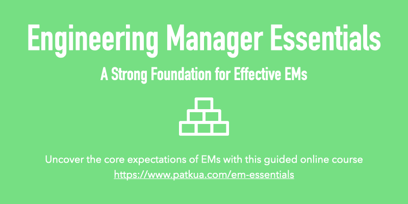
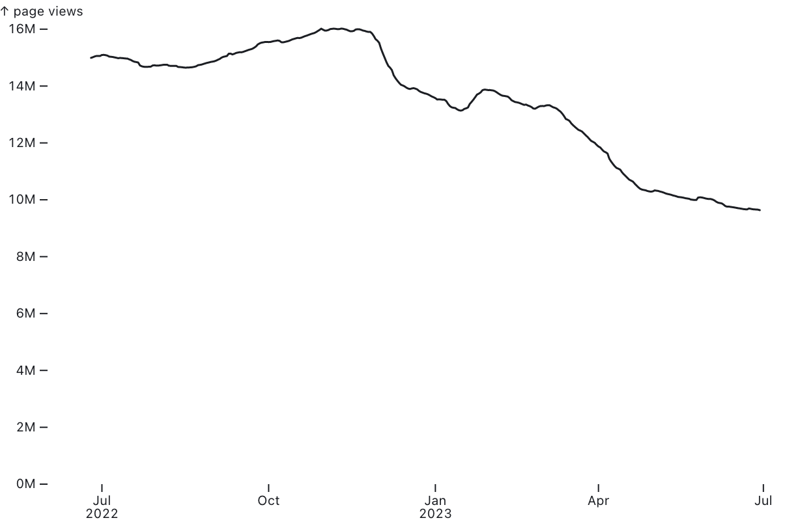
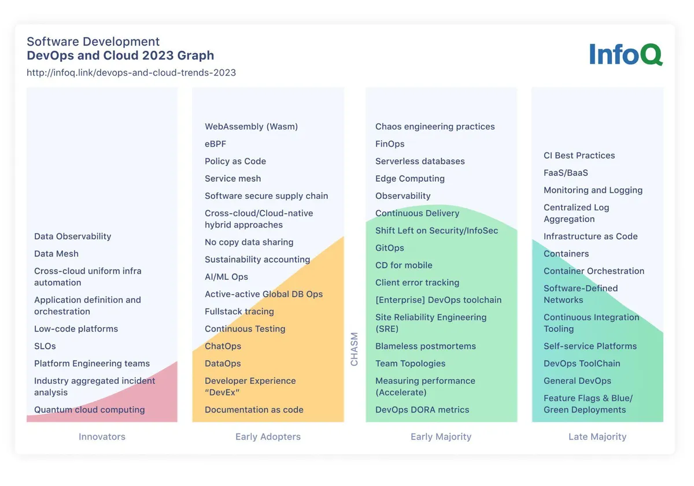
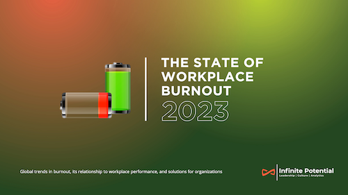

| 
<table role="presentation" data-immersive-translate-effect="1" data-immersive-translate-mark="1"><tbody data-immersive-translate-effect="1" data-immersive-translate-mark="1"><tr data-immersive-translate-effect="1" data-immersive-translate-mark="1"><td data-immersive-translate-effect="1" data-immersive-translate-mark="1">

</td></tr><tr data-immersive-translate-effect="1" data-immersive-translate-mark="1"><td data-immersive-translate-effect="1" data-immersive-translate-mark="1">

Jul 30, 2023 · Issue #207 2023 年 7 月 30 日 - 第 207 期

<strong data-immersive-translate-effect="1" data-immersive-translate-mark="1" data-immersive-translate-paragraph-id="4">Level Up</strong> is a curated newsletter for leaders in tech. A project by <a href="https://9nwl1.r.a.d.sendibm1.com/mk/cl/f/2FujXHQPxNgqur74ZDIuESBGEUqfzXz065L9JToe1YqUxzf4t1X0oD06sfqWlDEt802qU7F_KLdpEiwlNTsulLgeP4qXN0gRTNvxiF1WwT0hmZJcw8Jox13hyZtMQHeRKQHBAgrUt2SHd1Rs37v-mZ5G37WZ93vXhXcgwzCuI1adeEuZbttWzX_nnCk2bS3fNdFqMzqGD3ZP1t7YF9AliC4MnrWwbP4kp1VrXC6-sMuVmspGEwS62JX9S7kg1J-kgfm4hygC5S46sLGucCoPxapgQoM" target="_blank" sib_link_id="0" data-immersive-translate-effect="1" data-immersive-translate-mark="1" data-immersive-translate-paragraph-id="4">https://patkua.com</a>. Ideal for busy people such as Tech Leads, Engineering Managers, VPs of Engineering, CTOs and more.&nbsp; Level Up是一份为科技界领袖策划的通讯。是 <a href="https://9nwl1.r.a.d.sendibm1.com/mk/cl/f/2FujXHQPxNgqur74ZDIuESBGEUqfzXz065L9JToe1YqUxzf4t1X0oD06sfqWlDEt802qU7F_KLdpEiwlNTsulLgeP4qXN0gRTNvxiF1WwT0hmZJcw8Jox13hyZtMQHeRKQHBAgrUt2SHd1Rs37v-mZ5G37WZ93vXhXcgwzCuI1adeEuZbttWzX_nnCk2bS3fNdFqMzqGD3ZP1t7YF9AliC4MnrWwbP4kp1VrXC6-sMuVmspGEwS62JX9S7kg1J-kgfm4hygC5S46sLGucCoPxapgQoM" target="_blank" sib_link_id="0" data-immersive-translate-effect="1" data-immersive-translate-mark="1" data-immersive-translate-paragraph-id="4">https://patkua.com</a> 的一个项目。是忙碌的人们的理想选择，如技术领导、工程经理、工程副总裁、首席技术官等。

</td></tr><tr data-immersive-translate-effect="1" data-immersive-translate-exclude-mark="1" data-immersive-translate-mark="1"><td></td></tr></tbody></table>

 |
| --- |

| 
<table role="presentation" data-immersive-translate-effect="1" data-immersive-translate-mark="1"><tbody data-immersive-translate-effect="1" data-immersive-translate-mark="1"><tr data-immersive-translate-effect="1" data-immersive-translate-mark="1"><td data-immersive-translate-effect="1" data-immersive-translate-mark="1">

<h2 data-immersive-translate-effect="1" data-immersive-translate-specified-container="1" data-immersive-translate-mark="1">Taking bets on people&nbsp;赌人</h2>

</td></tr><tr data-immersive-translate-effect="1" data-immersive-translate-mark="1"><td data-immersive-translate-effect="1" data-immersive-translate-mark="1">

Interviewing is an arduous process for both those interviewing and those being interviewed because it’s a time-bound process with high uncertainty. Candidates bet the company employer brand has some truth and the job description has some basis in reality. Interviewers are betting candidates highlight their capabilities, strengths and fit for a role, all based on a situation that incentivises people to show their best and play down their worst. 对于面试者和被面试者来说，面试都是一个艰苦的过程，因为它是一个有时间限制且不确定性很高的过程。应聘者打赌公司的雇主品牌有一定的真实性，职位描述有一定的现实依据。面试官要赌的是应聘者是否能突出自己的能力、优势以及是否适合某个职位，而这一切都要建立在一种激励人们展示自己的优点、淡化自己的缺点的环境之上。

In this imperfect game, it’s tempting for those recruiting to look for the “perfect” candidate. Although effective interviewing processes try to generate enough information, these are only signals, and leaders must be comfortable taking a bet on someone.&nbsp; 在这个不完美的游戏中，招聘人员很容易寻找 "完美 "的候选人。虽然有效的面试过程会尽量产生足够的信息，但这些只是信号，领导者必须能够在某人身上下注。

Sometimes you lose bets. To minimise this, make sure to have a great onboarding process and a decent probation period. In this probation period, ensure there is direct, candid feedback on both sides of an employer and employee. 有时你会输掉赌局。为了尽量减少这种情况，请确保有一个良好的入职流程和适当的试用期。在试用期内，确保雇主和雇员双方都能得到直接、坦诚的反馈。

Don’t wait for the “perfect” person to come along. There is never one.&nbsp; 不要等待 "完美 "的人出现。从来就没有完美的人。

I hope you enjoy this week’s newsletter! Share it with a friend or colleague if you find it helpful, or drop me <a href="mailto:pat@patkua.com?subject=Future%20Level%20Up%20Newsletter%20Topic" target="_blank" data-immersive-translate-effect="1" data-immersive-translate-mark="1" data-immersive-translate-paragraph-id="10">an email</a> about topics you’d like to hear about in future editions. 我希望你喜欢本周的新闻通讯！如果你觉得有帮助，可以分享给朋友或同事，或者给我发电子邮件，告诉我你想在以后的版本中听到的话题！如果你觉得有帮助，请与朋友或同事分享，或者给我发电子邮件，告诉我你想在未来的版本中听到的主题。

Looking to level up your technical leadership skills? Join an <a href="https://9nwl1.r.a.d.sendibm1.com/mk/cl/f/WVsTEPgN5GzVE8wqHBm8PfNQ6DUFfEkvaYFwGjwKfLy4jZF9HDaevuHfabFKMMzdGVPi3843jqa1P71967xKhFmvPwzbai1X9UTSoo8ZZA7BlzUEDrTzPB7KqPrt6yBHciBqlPMokleJdmNwGZ3j8NOtV1kmgOSwUr3-cUki63oodfIdQbaJznmBLqqFDoSL7fAL7dX4vNioaC48NnjQbq9AIlaAMKAz47jxlj84KUerLtLNOGESAo7DQRFmS3Cdgdx9vSW-GySkmwf1sJwOqrDYYxIWMpnoA0spZ2qxA8C8Uk4K-mXAIEzgG8mA1lcB" target="_blank" sib_link_id="1" data-immersive-translate-effect="1" data-immersive-translate-mark="1" data-immersive-translate-paragraph-id="11">online cohort-based workshop</a> for technical leadership or engineering management skills or take a self-paced course at the <a href="https://9nwl1.r.a.d.sendibm1.com/mk/cl/f/Tty9yUNxvM7d_QmuCAl8mB4MsDa1lSOhPUSbLp2eS0XZmVD98oDGRwznHaqIxGCQne9qFZ17rfZtzfTBogzi_Rp4N8LX9jbkSxuBf9xYhwJ50bbbuJg2HCb8VfymmxTJ8HaYvafLvwFYGqzyH7SHlUSh4Tbzzrve9pK8nX884KTGR9wWxJDvzoMO4kiQPR0shSrq3ruRuVYtL0hCebEOis51KZXvJdLu6dV71gy2W7D0ylOUrqzu4RFbyk2Zu-1xddyQJm-V7CBrxASSPB063pjIT75pi8mzUNE" target="_blank" sib_link_id="2" data-immersive-translate-effect="1" data-immersive-translate-mark="1" data-immersive-translate-paragraph-id="11">https://techlead.academy</a>. 想提高你的技术领导技能吗？参加技术领导力或工程管理技能的在线群组研讨会，或在 <a href="https://9nwl1.r.a.d.sendibm1.com/mk/cl/f/Tty9yUNxvM7d_QmuCAl8mB4MsDa1lSOhPUSbLp2eS0XZmVD98oDGRwznHaqIxGCQne9qFZ17rfZtzfTBogzi_Rp4N8LX9jbkSxuBf9xYhwJ50bbbuJg2HCb8VfymmxTJ8HaYvafLvwFYGqzyH7SHlUSh4Tbzzrve9pK8nX884KTGR9wWxJDvzoMO4kiQPR0shSrq3ruRuVYtL0hCebEOis51KZXvJdLu6dV71gy2W7D0ylOUrqzu4RFbyk2Zu-1xddyQJm-V7CBrxASSPB063pjIT75pi8mzUNE" target="_blank" sib_link_id="2" data-immersive-translate-effect="1" data-immersive-translate-mark="1" data-immersive-translate-paragraph-id="11">https://techlead.academy</a> .NET网站上参加自定进度的课程。

</td></tr><tr data-immersive-translate-effect="1" data-immersive-translate-mark="1"><td data-immersive-translate-effect="1" data-immersive-translate-mark="1"></td></tr><tr data-immersive-translate-effect="1" data-immersive-translate-mark="1"><td data-immersive-translate-effect="1" data-immersive-translate-mark="1">

</td></tr><tr data-immersive-translate-effect="1" data-immersive-translate-mark="1"><td data-immersive-translate-effect="1" data-immersive-translate-mark="1">

Recruiting always requires betting 招聘工作总是需要下注

</td></tr><tr data-immersive-translate-effect="1" data-immersive-translate-mark="1"><td data-immersive-translate-effect="1" data-immersive-translate-mark="1">

<h2 data-immersive-translate-effect="1" data-immersive-translate-specified-container="1" data-immersive-translate-mark="1">Sponsored Content&nbsp;赞助内容</h2>

</td></tr><tr data-immersive-translate-effect="1" data-immersive-translate-mark="1"><td data-immersive-translate-effect="1" data-immersive-translate-mark="1">

<strong data-immersive-translate-effect="1" data-immersive-translate-mark="1" data-immersive-translate-paragraph-id="14">Typo-Increase ROI of dev investment 打错字-提高开发投资的 ROI</strong>

Typo provides real-time visibility into your software delivery pipeline, identifies bottlenecks &amp; drives actions to increase predictability, boost velocity, and improve the quality of every release. Deliver high-quality code faster with Typo! Typo 为您的软件交付管道提供实时可视性，识别瓶颈并推动行动，以提高可预测性、提升速度并改善每次发布的质量。使用 Typo 更快地交付高质量代码！

<a href="https://9nwl1.r.a.d.sendibm1.com/mk/cl/f/XYSiLUXLOEG5f9nUP9LoZjuB24yNhakwqWFHjIoSQVfFlI6aSgFMhlgGJ6B63JKQlnqfpKdy1xAuuB9ooIcd_0UOVQPEiHKVtt5RJMEUEeDMpFcKrG3ezGiWzqIZUnAsIxvUUN2WswxJ1kfZkdVXzR6XwW8GVTM7hmHrxP9vi6hFG6xg9tkmakJ_b5iT4kofQNqAgk0x3Bx7d5eWNoqUJHYyskCRV4EED_ge2WQhSzfnaLR56SZWTweerPUONKEB4Oz8eu28nRZ6pOUjXb86slvNycSuglc2wA0gO3R0DpX0jVup2w" target="_blank" sib_link_id="3" data-immersive-translate-effect="1" data-immersive-translate-mark="1" data-immersive-translate-paragraph-id="16">Know More&nbsp;了解更多</a>

</td></tr><tr data-immersive-translate-effect="1" data-immersive-translate-mark="1"><td data-immersive-translate-effect="1" data-immersive-translate-mark="1">

<h2 data-immersive-translate-effect="1" data-immersive-translate-specified-container="1" data-immersive-translate-mark="1">Leadership&nbsp;领导人</h2>

</td></tr></tbody></table>

 |
| --- |

| 

 | 

<table role="presentation" data-immersive-translate-effect="1" data-immersive-translate-mark="1"><tbody data-immersive-translate-effect="1" data-immersive-translate-mark="1"><tr data-immersive-translate-effect="1" data-immersive-translate-mark="1"><td data-immersive-translate-effect="1" data-immersive-translate-mark="1"></td></tr><tr data-immersive-translate-effect="1" data-immersive-translate-mark="1"><td data-immersive-translate-effect="1" data-immersive-translate-mark="1">

<i data-immersive-translate-effect="1" data-immersive-translate-mark="1" data-immersive-translate-paragraph-id="19">Reading time: 4mins&nbsp;阅读时间：4分钟</i>

Technology leader, <a href="https://9nwl1.r.a.d.sendibm1.com/mk/cl/f/D5UxTwx8vwQepancJHc-jcUrdQxwe-JH7eMQLXAVmrU-aZ3uiY6DMdx6HJNLF0ZQmIZwwwf6c5EpHvL2mp3jw9rlYufXXea_xNW9f1lb2fQkclA0dGu7qcbmiKgSquVLixoGitJ9xZed5bUcyIYuhcAcJFAqZH4B3FMD0xgkS_hHD9BsJDxb8uyNsJqzmuIA5vvDchJuA9mrtInEM2EFMBna1r1igj2tEsBHeb3thTToJR23DN8n_Bl-bYEgecpTzZFDh6owZN16jheBbGuygDNtG90MYMnvI75hs_fIvwKt2s4" target="_blank" sib_link_id="5" data-immersive-translate-effect="1" data-immersive-translate-mark="1" data-immersive-translate-paragraph-id="20">@AnnaShipman</a>, recently opened a conference with a fireside chat on strategy and how to be strategic as a leader. This article covers her notes from that session. 技术领导者 <a href="https://9nwl1.r.a.d.sendibm1.com/mk/cl/f/D5UxTwx8vwQepancJHc-jcUrdQxwe-JH7eMQLXAVmrU-aZ3uiY6DMdx6HJNLF0ZQmIZwwwf6c5EpHvL2mp3jw9rlYufXXea_xNW9f1lb2fQkclA0dGu7qcbmiKgSquVLixoGitJ9xZed5bUcyIYuhcAcJFAqZH4B3FMD0xgkS_hHD9BsJDxb8uyNsJqzmuIA5vvDchJuA9mrtInEM2EFMBna1r1igj2tEsBHeb3thTToJR23DN8n_Bl-bYEgecpTzZFDh6owZN16jheBbGuygDNtG90MYMnvI75hs_fIvwKt2s4" target="_blank" sib_link_id="5" data-immersive-translate-effect="1" data-immersive-translate-mark="1" data-immersive-translate-paragraph-id="20">@AnnaShipman</a> 最近在一次会议上就战略以及作为领导者如何具有战略眼光进行了一次炉边谈话。本文介绍了她在这次会议上的发言。

</td></tr></tbody></table>

 |
| --- | --- |

| 

 | 

<table role="presentation" data-immersive-translate-effect="1" data-immersive-translate-mark="1"><tbody data-immersive-translate-effect="1" data-immersive-translate-mark="1"><tr data-immersive-translate-effect="1" data-immersive-translate-mark="1"><td data-immersive-translate-effect="1" data-immersive-translate-mark="1"></td></tr><tr data-immersive-translate-effect="1" data-immersive-translate-mark="1"><td data-immersive-translate-effect="1" data-immersive-translate-mark="1">

<i data-immersive-translate-effect="1" data-immersive-translate-mark="1" data-immersive-translate-paragraph-id="22">Reading time: 5mins&nbsp;阅读时间：5 分钟</i>

Brandon Willett reflects on several years at DataDog and his lessons learned. I think many of these are helpful for all leaders in tech. Brandon Willett 回顾了他在 DataDog 的几年工作经历和经验教训。我认为其中很多对所有技术领域的领导者都很有帮助。

</td></tr></tbody></table>

 |
| --- | --- |

| 

 | 

<table role="presentation" data-immersive-translate-effect="1" data-immersive-translate-mark="1"><tbody data-immersive-translate-effect="1" data-immersive-translate-mark="1"><tr data-immersive-translate-effect="1" data-immersive-translate-mark="1"><td data-immersive-translate-effect="1" data-immersive-translate-mark="1"></td></tr><tr data-immersive-translate-effect="1" data-immersive-translate-mark="1"><td data-immersive-translate-effect="1" data-immersive-translate-mark="1">

<i data-immersive-translate-effect="1" data-immersive-translate-mark="1" data-immersive-translate-paragraph-id="25">Reading time: 4mins&nbsp;阅读时间：4分钟</i>

<a href="https://9nwl1.r.a.d.sendibm1.com/mk/cl/f/VuEJhXMX5WUSHyjf4Vb5jez3ZpWQm13YkmCqdK8GSsQXFvFAErYvAaiX-EjMAjAjlIPyrM3iaG5_JQEwmAwtaz5mPpo-pYPUNes9DRTKCfgkNl-XK28KCBOE_g8-YhG9kApmPz0c0swa1hOIxekbiq5zq-k3ErDn2cKeb30X0EuyjScG9gT3hKdJ-dxqesCjcYL1QJ7YClcOflWXCAI0yrsiFxSuOi4loYzuHLwO5pXu9-n7Dk15cb5dINwvT1Xp9FMBSzk3BQVz1yWFxkhFSu-4ZuOUnH-R5uzMGmaFbQ" target="_blank" sib_link_id="8" data-immersive-translate-effect="1" data-immersive-translate-mark="1" data-immersive-translate-paragraph-id="26">Dan Moore (@mooreds)</a> offers tips on when and how to send difficult emails. Dan Moore (@mooreds) 提供了关于何时以及如何发送棘手邮件的建议。

</td></tr></tbody></table>

 |
| --- | --- |

| 
<table role="presentation" data-immersive-translate-effect="1" data-immersive-translate-mark="1"><tbody data-immersive-translate-effect="1" data-immersive-translate-mark="1"><tr data-immersive-translate-effect="1" data-immersive-translate-mark="1"><td data-immersive-translate-effect="1" data-immersive-translate-mark="1">

</td></tr><tr data-immersive-translate-effect="1" data-immersive-translate-mark="1"><td data-immersive-translate-effect="1" data-immersive-translate-mark="1">

Want to become an Engineering Manager? Join the next <a href="https://9nwl1.r.a.d.sendibm1.com/mk/cl/f/KDdUzubknRGB62j0QIyaspHnlHN42i3HQD3yC5supbS-1IdSbziWqf2xsF_0V25JN-DHIZUsYIeE307aV4CoOFsSYWe8bGhrUVqk8_ov2S7cfvn0g_l50eo3txWnXK9ZzQoDLWbM6yp-hQPpmq7qJ7CmPfI219KhDFPga0Ziu7J64D3GMkm2dDi3vKmGJW0vMkfMmLatEJEgQG9orC6qFLwzN6pgP7_eNfd6Jdz5yjlzcakhYpZErIwQwjoFOELmZPALr9UaQp4i6URFGfOGZjcNaQlx_f2wM-JmJ99JlnNlTCKhW0k9JdjnhN3oDiNpCg" target="_blank" sib_link_id="10" data-immersive-translate-effect="1" data-immersive-translate-mark="1" data-immersive-translate-paragraph-id="27">online cohort</a> to understand what skills you need to build. 想成为工程经理？加入下一期在线课程，了解您需要掌握哪些技能。

</td></tr></tbody></table>

 |
| --- |

| 
## Technology 技术

 |
| --- |

| 

 | 

<table role="presentation" data-immersive-translate-effect="1" data-immersive-translate-mark="1"><tbody data-immersive-translate-effect="1" data-immersive-translate-mark="1"><tr data-immersive-translate-effect="1" data-immersive-translate-mark="1"><td data-immersive-translate-effect="1" data-immersive-translate-mark="1"></td></tr><tr data-immersive-translate-effect="1" data-immersive-translate-mark="1"><td data-immersive-translate-effect="1" data-immersive-translate-mark="1">

<i data-immersive-translate-effect="1" data-immersive-translate-mark="1" data-immersive-translate-paragraph-id="30">Reading time: 1mins&nbsp;阅读时间：1 分钟</i>

<a href="https://9nwl1.r.a.d.sendibm1.com/mk/cl/f/pbSIQ1rywNGlnMHMehwW6E1s4KGLcTTp03QzKJ4A1vI-UPm6wtAyvEJE6lsnU6MBybxVFML0CjkCeTMoZ4aGO6sRaLa7-6Gld8r5zUUVhOSQzceAxaRy6xmStybHC-wWiBTS60ZnLCO1S_xQzvN6-gub3psXtKsDKGz1kBQrVRCWJh3j7Dun40eTP1BvQuHW0d-qPYl33P1nShDZ1Ue6u8R9ud0jGHeH092JbJRthpTC_kUzLK2JLq-U5ztfmEuStaG0RSNpzar_a8aXnFrV2bRxDWEaCfVKaWX8RU52xUt8nw" target="_blank" sib_link_id="12" data-immersive-translate-effect="1" data-immersive-translate-mark="1" data-immersive-translate-paragraph-id="31">Ayhan Fuat Çelik (@ayhanfuat)</a> provides a compelling set of data that concern all developers. More discussion on this over at <a href="https://9nwl1.r.a.d.sendibm1.com/mk/cl/f/MXBiWgz7wXyVo9cAC9A4_ZI8QGniNiYcRK2QAnHZFcKCf5Ar4HBXPQzNnZ5NhsToeM1YZXkYG-_QtH9N8Y896WQlkJcaU8tiEB0uK_d4kMeRKArx4uu9kj9TIR8Czv7y_-WGxDihRWVpD7bMwdDU16vC8KbndDBDCMOrDXCaHZbNECrXRaf5AfMhJRZ9ayyr8WILXHrvLvwz3PweYQebdl8czP-E37S67EdWxpLlDQ9lQpnLoxF3IV0K6d3YuwQDVFLugWu-Dwm_uCMpNrzKCAyadGJ4DSRBcgs3Z10osQ-JYMo5_FoFfkJI8Bg_Iy7TFqO877mv" target="_blank" sib_link_id="13" data-immersive-translate-effect="1" data-immersive-translate-mark="1" data-immersive-translate-paragraph-id="31">HackerNews</a>. Ayhan Fuat Çelik (@ayhanfuat) 提供了一组与所有开发人员相关的令人信服的数据。更多相关讨论，请访问 HackerNews 。

</td></tr></tbody></table>

 |
| --- | --- |

| 

 | 

<table role="presentation" data-immersive-translate-effect="1" data-immersive-translate-mark="1"><tbody data-immersive-translate-effect="1" data-immersive-translate-mark="1"><tr data-immersive-translate-effect="1" data-immersive-translate-mark="1"><td data-immersive-translate-effect="1" data-immersive-translate-mark="1"></td></tr><tr data-immersive-translate-effect="1" data-immersive-translate-mark="1"><td data-immersive-translate-effect="1" data-immersive-translate-mark="1">

<i data-immersive-translate-effect="1" data-immersive-translate-mark="1" data-immersive-translate-paragraph-id="33">Reading time: 6mins&nbsp;阅读时间：6分钟</i>

Rather than focus on the hype, I like to read experience reports of people using Generative AI. Global Lead for AI-assisted Software Delivery, <a href="https://9nwl1.r.a.d.sendibm1.com/mk/cl/f/aJzxX2Vu2la3dQutC0RJCxvZomw76lfi8esGox_GKNyYN5yuvVscJhkg-fLDr4SLywtJ4KeEBRWHQsxPDtGJuO1a68RIWtOOsZy1s4RqANOc5qF_JQzobFplcRRLv5PykdwggKgM2ZG-pTGa-sJ8kOiueKo-Rdj-6UoiQt09x9_aLP0LdMku82M_Ojx_GlOK8n-nRdO9Rhg_5-T-xanc6pLFdtWjHEtLHhpxUIp1KRCQ0x3n_LtPaMyvp8kMRr3EAALVLDoKdCmGT11yQY4Hb1RPWdRcUymNDV8XwW5IyDczE7D_" target="_blank" sib_link_id="15" data-immersive-translate-effect="1" data-immersive-translate-mark="1" data-immersive-translate-paragraph-id="34">Birgitta Boeckeler (@birgitta410)</a> is documenting her experiences on Martin Fowler's website, so be sure to bookmark this page. 与其关注炒作，我更喜欢阅读人们使用生成式人工智能的经验报告。人工智能辅助软件交付全球负责人 Birgitta Boeckeler (@birgitta410) 在 Martin Fowler 的网站上记录了她的经验，请务必将此页加入书签。

</td></tr></tbody></table>

 |
| --- | --- |

| 

 |  |
| --- | --- |

| 
<table role="presentation" data-immersive-translate-effect="1" data-immersive-translate-mark="1"><tbody data-immersive-translate-effect="1" data-immersive-translate-mark="1"><tr data-immersive-translate-effect="1" data-immersive-translate-mark="1"><td data-immersive-translate-effect="1" data-immersive-translate-mark="1">

</td></tr><tr data-immersive-translate-effect="1" data-immersive-translate-mark="1"><td data-immersive-translate-effect="1" data-immersive-translate-mark="1"></td></tr><tr data-immersive-translate-effect="1" data-immersive-translate-mark="1"><td data-immersive-translate-effect="1" data-immersive-translate-mark="1">

<h2 data-immersive-translate-effect="1" data-immersive-translate-specified-container="1" data-immersive-translate-mark="1">Organisations &amp; Processes&nbsp;组织和程序</h2>

</td></tr></tbody></table>

 |
| --- |

| 

 | 

<table role="presentation" data-immersive-translate-effect="1" data-immersive-translate-mark="1"><tbody data-immersive-translate-effect="1" data-immersive-translate-mark="1"><tr data-immersive-translate-effect="1" data-immersive-translate-mark="1"><td data-immersive-translate-effect="1" data-immersive-translate-mark="1"></td></tr><tr data-immersive-translate-effect="1" data-immersive-translate-mark="1"><td data-immersive-translate-effect="1" data-immersive-translate-mark="1">

<i data-immersive-translate-effect="1" data-immersive-translate-mark="1" data-immersive-translate-paragraph-id="41">Reading time: 30 page PDF&nbsp;阅读时间30 页 PDF</i>

I recently came across this report from the non-profit think tank Infinite Potential. Thanks to Dr. John Chan, Sally Clarke et al. The researchers also offer some actionable recommendations from Page 17 onwards 🎉. 我最近看到了非营利智库 "无限潜能"（Infinite Potential）的这份报告。从第 17 页起，研究人员还提出了一些可行的建议。

</td></tr></tbody></table>

 |
| --- | --- |

| 

 | 

<table role="presentation" data-immersive-translate-effect="1" data-immersive-translate-mark="1"><tbody data-immersive-translate-effect="1" data-immersive-translate-mark="1"><tr data-immersive-translate-effect="1" data-immersive-translate-mark="1"><td data-immersive-translate-effect="1" data-immersive-translate-mark="1"></td></tr><tr data-immersive-translate-effect="1" data-immersive-translate-mark="1"><td data-immersive-translate-effect="1" data-immersive-translate-mark="1">

<i data-immersive-translate-effect="1" data-immersive-translate-mark="1" data-immersive-translate-paragraph-id="44">Reading time: 2mins&nbsp;阅读时间：2分钟</i>

1-1s can be boring and repetitious, so it's important leaders reflect if they are adding value. <a href="https://9nwl1.r.a.d.sendibm1.com/mk/cl/f/BzX0PY6asjck2WgLW0332lPS7jHFx7CpGgC8RGijb9VtMKwVK2w4kfFCfQEjy6hMX9v1zCUFj_lJycgt-WFT0yMX3L4jaCCvOXpOlloJV5Yb7SClZ5PXWhjD1XVYO4EhbTgAdhnhL8Z2TDbJ11unRtvmrb7VEWNsxRgvdlun9dA1hkL9G1N7j6JsdjBVaOXZXMRYRUzvxbjKySODScSJZRHWBrJfas-ZzJ8fVR58BiISqYT4E_vuH9Wfjz9C4S2-RZJLDaqh3-MwD_4IP-Otg8ji1cN0pT_67XZw5cov5z5mt29fCQ" target="_blank" sib_link_id="23" data-immersive-translate-effect="1" data-immersive-translate-mark="1" data-immersive-translate-paragraph-id="45">@MattBlodgett</a> reminds us of other ways to use them and good questions to explore. 1-1 可能是枯燥和重复的，因此，领导者必须反思它们是否能增加价值。 <a href="https://9nwl1.r.a.d.sendibm1.com/mk/cl/f/BzX0PY6asjck2WgLW0332lPS7jHFx7CpGgC8RGijb9VtMKwVK2w4kfFCfQEjy6hMX9v1zCUFj_lJycgt-WFT0yMX3L4jaCCvOXpOlloJV5Yb7SClZ5PXWhjD1XVYO4EhbTgAdhnhL8Z2TDbJ11unRtvmrb7VEWNsxRgvdlun9dA1hkL9G1N7j6JsdjBVaOXZXMRYRUzvxbjKySODScSJZRHWBrJfas-ZzJ8fVR58BiISqYT4E_vuH9Wfjz9C4S2-RZJLDaqh3-MwD_4IP-Otg8ji1cN0pT_67XZw5cov5z5mt29fCQ" target="_blank" sib_link_id="23" data-immersive-translate-effect="1" data-immersive-translate-mark="1" data-immersive-translate-paragraph-id="45">@MattBlodgett</a> 提醒我们使用它们的其他方法和值得探讨的好问题。

</td></tr></tbody></table>

 |
| --- | --- |

| 

 | 

<table role="presentation" data-immersive-translate-effect="1" data-immersive-translate-mark="1"><tbody data-immersive-translate-effect="1" data-immersive-translate-mark="1"><tr data-immersive-translate-effect="1" data-immersive-translate-mark="1"><td data-immersive-translate-effect="1" data-immersive-translate-mark="1"></td></tr><tr data-immersive-translate-effect="1" data-immersive-translate-mark="1"><td data-immersive-translate-effect="1" data-immersive-translate-mark="1">

<i data-immersive-translate-effect="1" data-immersive-translate-mark="1" data-immersive-translate-paragraph-id="47">Reading time: 5mins&nbsp;阅读时间：5 分钟</i>

<a href="https://9nwl1.r.a.d.sendibm1.com/mk/cl/f/X7D3T_BIveQ8CqgeYl5V2zYqNMKW_yPd-N7IM60EzmVvvsk0c9yK_MDkZfITcKDrj2SyG-IwJLp4dH3-uIk3a2OXpzyk7gLvjBq4Zqz4MjQ7QA4cy9S_G2CmSOUGoARf2vi-sJ1V5czqoy9BsNzb53ZyIKtUvjVqFwvBI88-V7C-SoAfWP2Hd0YiB0Im-S_qJohCNA2rEy32s5GfJ_hdwFedhDd2O_4Kw44VjNfN_MKbuPQ_pyo-TJkfPvE6Y-Q_E-Vrg1eExRVuSTGcuoK-HqWbO_G7NGumareL_UXt7xoYl8fE8jyr6w" target="_blank" sib_link_id="25" data-immersive-translate-effect="1" data-immersive-translate-mark="1" data-immersive-translate-paragraph-id="48">Cameron Presley (@pcameronpresley)</a> shares a process that encourages documentation to be relevant and fresh. 卡梅伦-普雷斯利（@pcameronpresley）分享了一个鼓励文档保持相关性和新鲜感的过程。

</td></tr></tbody></table>

 |
| --- | --- |

| 
<table role="presentation" data-immersive-translate-effect="1" data-immersive-translate-mark="1"><tbody data-immersive-translate-effect="1" data-immersive-translate-mark="1"><tr data-immersive-translate-effect="1" data-immersive-translate-mark="1"><td data-immersive-translate-effect="1" data-immersive-translate-mark="1">

<h2 data-immersive-translate-effect="1" data-immersive-translate-specified-container="1" data-immersive-translate-mark="1">Tweet of the Week&nbsp;本周推特</h2>

</td></tr><tr data-immersive-translate-effect="1" data-immersive-translate-mark="1"><td data-immersive-translate-effect="1" data-immersive-translate-mark="1"></td></tr><tr data-immersive-translate-effect="1" data-immersive-translate-mark="1"><td data-immersive-translate-effect="1" data-immersive-translate-mark="1">
<blockquote data-immersive-translate-effect="1" data-immersive-translate-mark="1">
Cloud folks: When you lift and shift your castle into the sky, remember that the dungeon comes up with it. 云的朋友们当你把城堡升上天空时，请记住地牢也会随之升起。
— 👻🎃🦇 ℑ𝔞𝔠𝔱𝔦𝔣𝔞𝔦𝔩 🦇🎃👻 (@TactiFail) <a href="https://9nwl1.r.a.d.sendibm1.com/mk/cl/f/xmZ148GD064bGaASwY4KrhF526tZna3aUmiGN8BxO4jlqYSkku3anWR4jCI_mEAEZugJhBiZAu4xEqtSyPcYYf5x-8RD9Y3jjjy0zJZ0RQJC1PJJS2Y87ZP-Rd07supdbe5sGEBjLQTZMOsk0b7RiMN8gSexURGlTuI9pjjlUaH1D90xgx0aKAqshEC3oTJowxyspJDXNKGvDI6i-gzYznJHP2IGbcuQtP8off8ch-Hny73TUYvKoQpFi3JrxRIAsUME2bMFa1EMpxHty-jjJa919G711uOzNo6Kv6qMdC4GgtfLK65eEKxo5DKn71FtbUf8qv2FArgOOVlwscpUJw24SUjU_x7HAFTdO3I6nVdaPgZiqPhkK0tpVw" sib_link_id="26" data-immersive-translate-effect="1" data-immersive-translate-mark="1" data-immersive-translate-paragraph-id="52">July 27, 2023</a> - 👻🎃🦇 ℑ𝔞𝔠𝔱𝔦𝔣𝔞𝔦𝔩 🦇🎃👻 (@TactiFail) 2023 年 7 月 27 日</blockquote>
</td></tr><tr data-immersive-translate-effect="1" data-immersive-translate-mark="1"><td data-immersive-translate-effect="1" data-immersive-translate-mark="1">
<h2 data-immersive-translate-effect="1" data-immersive-translate-specified-container="1" data-immersive-translate-mark="1">Thanks for making it this far! 🤗 谢谢你能走到今天!🤗</h2>
Did you enjoy this newsletter? Send <a href="mailto:pat@patkua.com?subject=Level%20Up%20Feedback" target="_blank" data-immersive-translate-effect="1" data-immersive-translate-mark="1" data-immersive-translate-paragraph-id="54">me feedback</a> and share it with others! 你喜欢这篇通讯吗？请给我发送反馈，并与他人分享! Want to level up your technical leadership skills? Sign up for online interactive courses like <a href="https://9nwl1.r.a.d.sendibm1.com/mk/cl/f/4uJI9uLpCuEkOqcgyXI1qNuBWjY8zKwul-DucFnCrb2ikNA3k8LCfvFnCWEXpHxD4vsTqBaDZRNyNw741_R4S-_xFQJM84OYN2tY1WMu_pZ3p2ebrm4wxUCkGzUJFklZTxxY1OE8hwme-JxFxWij7RAwXQEwBMPwgvB04dlQ4wGjZxw8Md3cSwymP0sfq_1iRpUGLuzy1n4D9fXqGLG4Wy1mRa8br4kifzeZ7-89fpV29h6NvAHIdSabrguFiVW4H_5GfL-CUknu5i3uEycu_NGZ2dc6OKsIaPNV535W48I" target="_blank" sib_link_id="27" data-immersive-translate-effect="1" data-immersive-translate-mark="1" data-immersive-translate-paragraph-id="55">Shortcut to Tech Leadership</a> or <a href="https://9nwl1.r.a.d.sendibm1.com/mk/cl/f/462U0_LamSRkG8gOHJzusOyAXPj2B7vKOVQ9a1YBLiFz1QdxbJ1E7Zyr9bCkccjCnHczpygMcxGicN9IfGmIZUEDEfJmfBFtAYYY691tLPRyHIDE_tTR0DFbXdR2KbLp5068FYuWEFsz6Wv4ODw35ijXXEmxRkNqdbf33rnbV5LVHoFzMTC9UblmCpBnnZDA9NSLLxqQEI8NtRC8OGguWY6lA5-2oIfCcxhDj6GfXKN35Sogel7N_n_ctMriTeaFs2bq9iDonAhFe3cUfdHuxMaggGkaHC4YKiabD2ptHzVTHdCGLw" target="_blank" sib_link_id="28" data-immersive-translate-effect="1" data-immersive-translate-mark="1" data-immersive-translate-paragraph-id="55">Engineering Manager Essentials</a> or check out self-paced courses at the <a href="https://9nwl1.r.a.d.sendibm1.com/mk/cl/f/OMxMpEjI0kfI1FTslVTAgtwadrnzN8O3vOomLWiidFgP5dT6w_IPffAv5B2yvdsqqXA3u0O8eMWWrH-mqb_vg93hmJqipbfCFEpui_WqEdpewoeXIsli0Yf4zbpOCbCtqc9zekwl_ik8V1O2AxsIr_7qiOecPXHGgQOZLoEOZA23hc3PXxJ6clJkQigYWFaFz1SkCnyAZtwWZTWTMOBqS4opPNTXSSTPpGV6lM_B9h6RC23pFlzUoXWsrVfV7VG46qWk4KbDjGvtRs5IXR0-oRclPeJLNmLIgl2i" target="_blank" sib_link_id="29" data-immersive-translate-effect="1" data-immersive-translate-mark="1" data-immersive-translate-paragraph-id="55">Tech Lead Academy</a> 想提高你的技术领导技能吗？报名参加在线互动课程，如《技术领导力捷径》或《工程经理要点》，或在技术领导学院查看自定进度的课程。&nbsp;

<strong data-immersive-translate-effect="1" data-immersive-translate-mark="1" data-immersive-translate-paragraph-id="56">Follow me on social below&nbsp;在下面的社交媒体上关注我</strong>

</td></tr></tbody></table>

 |
| --- |

| 
<table role="presentation" data-immersive-translate-effect="1" data-immersive-translate-mark="1"><tbody data-immersive-translate-effect="1" data-immersive-translate-mark="1"><tr data-immersive-translate-effect="1" data-immersive-translate-mark="1"><td data-immersive-translate-effect="1" data-immersive-translate-mark="1"></td></tr><tr data-immersive-translate-effect="1" data-immersive-translate-mark="1"><td data-immersive-translate-effect="1" data-immersive-translate-mark="1">

Patrick Kua, Postfach 58 04 40, 10437, Berlin, Germany

This email was sent to&nbsp;shuaike945@gmail.com&nbsp;because you subscribed to this newsletter. You can <a href="https://9nwl1.r.a.d.sendibm1.com/mk/un/eyCMJvIzJNXdlCKuTcqxWG9bKg03a2dq_VH05rOS7TxxpMwvee8vwabB_kcvv5beI5LYXgJVS5sOYzA5TqzbMDRGgMBomUGiVHYJDcePX6uERweexzdGc2OTEvhLeqBPjhgad_Wy9nDAKlaw4rhlUTBC7vT1SWl8Opowlx8h" target="_blank" data-immersive-translate-effect="1" data-immersive-translate-mark="1" data-immersive-translate-paragraph-id="58">unsubscribe here</a>.&nbsp; 这封邮件被发送到shuaike945@gmail.com，因为你订阅了这封通讯。你可以在这里取消订阅。

If you were forwarded this newsletter and you like it, <a href="https://9nwl1.r.a.d.sendibm1.com/mk/cl/f/j-vtUyo09klaxX8jT42rVbmqDk4VqbIyFfYV3ErPx7Gr2eea_nsgUEkaWctJBAS8N-1n5Q4ZLVZRQETVzXTD8mxvdicgx_7P39KVS8vyO9K1lNFWy-xJ5zFKw3MCtmgIyMqnUzJkPTShb3u-IlSGVgs_mMo5lsEsCQNel97CKYuwizcrz53g3-g-ZlQOZaqrQNBc_XKl_THPx4NdaBvX8lNfFfUzGkFUO9mcNLVVu2rDDim5r9ccDY2gsP27fxC7KmdtnwKXid04X-9UkdIGUKhlCh521hDK8-mKv2YIf3g" target="_blank" sib_link_id="33" data-immersive-translate-effect="1" data-immersive-translate-mark="1" data-immersive-translate-paragraph-id="59">please subscribe here</a>. 如果你被转发了这份通讯，并且你喜欢它，请在这里订阅。

</td></tr></tbody></table>

 |
| --- |
