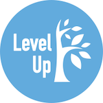
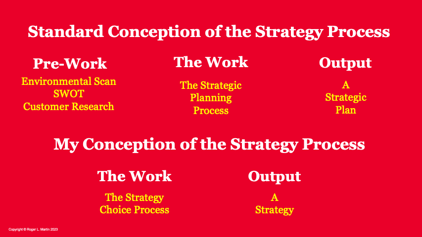
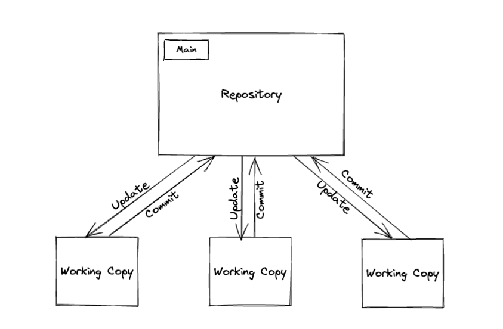
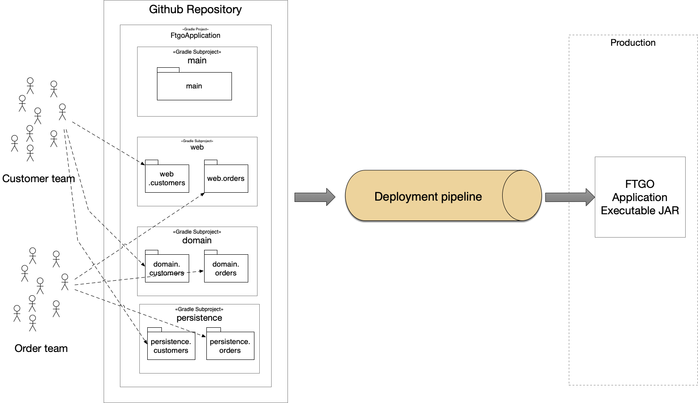
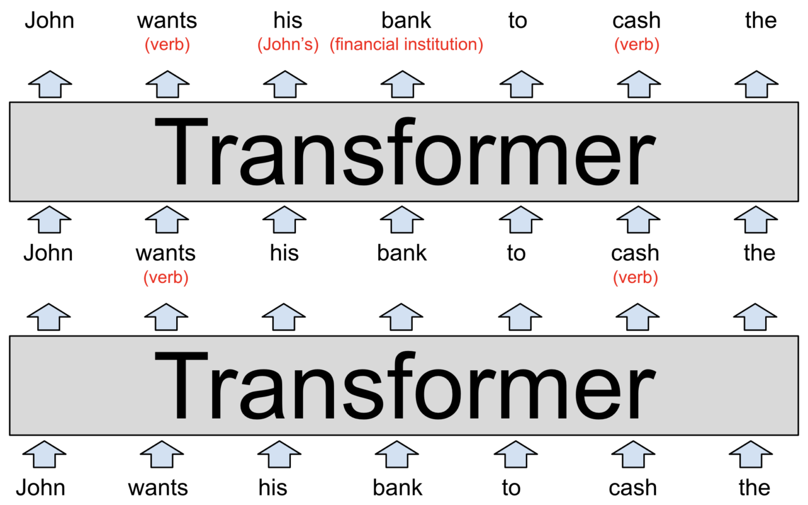
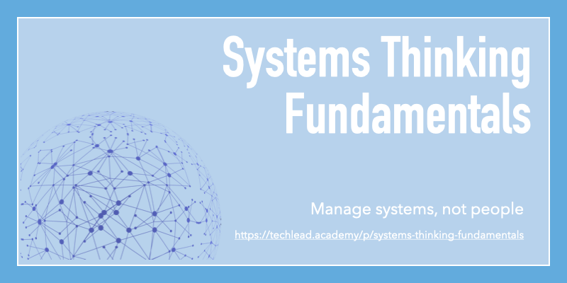
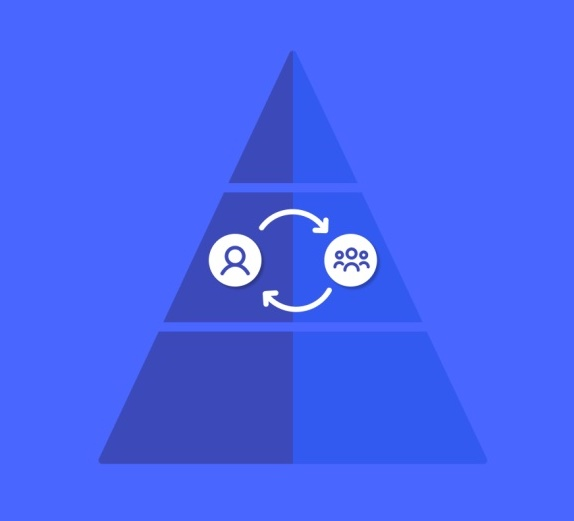

| 
<table role="presentation" data-immersive-translate-effect="1" data-immersive-translate-mark="1"><tbody data-immersive-translate-effect="1" data-immersive-translate-mark="1"><tr data-immersive-translate-effect="1" data-immersive-translate-mark="1"><td data-immersive-translate-effect="1" data-immersive-translate-mark="1">

</td></tr><tr data-immersive-translate-effect="1" data-immersive-translate-mark="1"><td data-immersive-translate-effect="1" data-immersive-translate-mark="1">

Aug 06, 2023 · Issue #208 2023 年 8 月 06 日 - 第 208 期

<strong data-immersive-translate-effect="1" data-immersive-translate-mark="1" data-immersive-translate-paragraph-id="4">Level Up</strong> is a curated newsletter for leaders in tech. A project by <a href="https://9nwl1.r.a.d.sendibm1.com/mk/cl/f/njTuv6LHBm2YQgV7hER5VFzxSCgxpX25uFzVOHQuuYPwk9GaYa9FfewGWiMvo4E7aAAKs0Utoy6ls0chN6zAg6okX9lSdNcLmvM3GKNe5VDnNVwsT7cna-ZnCXj9S-LMSWr6zNSSps_8kbXde5ktMdGcrF2k4GYljT2GLMaoKW1WdHQRv2eXkT3FKhEMkM9E9NKyDm0KGM0X8qJr6MCeR0tP-sZbRd-rIKAUqR_nxDJrL9udPfD1vWdcNe5nI8OGIEOqpBvYmnxXoRuZQG6tNPQuRhY" target="_blank" sib_link_id="0" data-immersive-translate-effect="1" data-immersive-translate-mark="1" data-immersive-translate-paragraph-id="4">https://patkua.com</a>. Ideal for busy people such as Tech Leads, Engineering Managers, VPs of Engineering, CTOs and more.&nbsp; Level Up是一份为科技界领袖策划的通讯。是 <a href="https://9nwl1.r.a.d.sendibm1.com/mk/cl/f/njTuv6LHBm2YQgV7hER5VFzxSCgxpX25uFzVOHQuuYPwk9GaYa9FfewGWiMvo4E7aAAKs0Utoy6ls0chN6zAg6okX9lSdNcLmvM3GKNe5VDnNVwsT7cna-ZnCXj9S-LMSWr6zNSSps_8kbXde5ktMdGcrF2k4GYljT2GLMaoKW1WdHQRv2eXkT3FKhEMkM9E9NKyDm0KGM0X8qJr6MCeR0tP-sZbRd-rIKAUqR_nxDJrL9udPfD1vWdcNe5nI8OGIEOqpBvYmnxXoRuZQG6tNPQuRhY" target="_blank" sib_link_id="0" data-immersive-translate-effect="1" data-immersive-translate-mark="1" data-immersive-translate-paragraph-id="4">https://patkua.com</a> 的一个项目。是忙碌的人们的理想选择，如技术领导、工程经理、工程副总裁、首席技术官等。

</td></tr><tr data-immersive-translate-effect="1" data-immersive-translate-exclude-mark="1" data-immersive-translate-mark="1"><td></td></tr></tbody></table>

 |
| --- |

| 
<table role="presentation" data-immersive-translate-effect="1" data-immersive-translate-mark="1"><tbody data-immersive-translate-effect="1" data-immersive-translate-mark="1"><tr data-immersive-translate-effect="1" data-immersive-translate-mark="1"><td data-immersive-translate-effect="1" data-immersive-translate-mark="1">

<h2 data-immersive-translate-effect="1" data-immersive-translate-specified-container="1" data-immersive-translate-mark="1">Prioritising&nbsp;确定优先次序</h2>

</td></tr><tr data-immersive-translate-effect="1" data-immersive-translate-mark="1"><td data-immersive-translate-effect="1" data-immersive-translate-mark="1">

To lead effectively means prioritising. But how? This week I want to share some tips I’ve found useful. The first part of prioritising is <i data-immersive-translate-effect="1" data-immersive-translate-mark="1" data-immersive-translate-paragraph-id="6"><strong>making time</strong></i> to prioritise. You’ll note that some agile methodologies (Scrum/XP) build this into their workflow through explicit Sprint/Iteration planning time. For your personal priorities, you also need space in your calendar. You might have different cadences like daily, end-of-week or monthly/quarterly prioritisation. 要有效地进行领导，就必须分清轻重缓急。但怎么做呢？本周，我想与大家分享一些我认为有用的技巧。排定优先顺序的第一部分是挤出时间排定优先顺序。你会注意到，一些敏捷方法（Scrum/XP）通过明确的冲刺/迭代计划时间，将这一点纳入工作流程。对于您个人的优先事项，您还需要在日历中留出空间。您可能有不同的日程安排，比如每天、每周末或每月/每季度安排优先事项。

Once you have dedicated time to prioritise, think through several dimensions to prioritise. Some of these include: 一旦你有了专门的时间来确定优先顺序，就应考虑确定优先顺序的几个方面。其中包括
<ul data-immersive-translate-effect="1" data-immersive-translate-mark="1"><li data-immersive-translate-effect="1" data-immersive-translate-mark="1"><strong data-immersive-translate-effect="1" data-immersive-translate-mark="1" data-immersive-translate-paragraph-id="8">Urgent/non-urgent and important/unimportant</strong> - Doing urgent/important tasks immediately makes sense. But make sure you schedule some of the non-urgent important tasks soon because these eventually because urgent. Get rid of those non-urgent/unimportant tasks and delegate the urgent/unimportant ones. 紧急/非紧急和重要/不重要 - 立即完成紧急/重要任务是合理的。但要确保尽快安排一些非紧急的重要任务，因为这些任务最终会变成紧急任务。去掉那些非紧急/不重要的任务，把紧急/不重要的任务委托出去。</li><li data-immersive-translate-effect="1" data-immersive-translate-mark="1"><strong data-immersive-translate-effect="1" data-immersive-translate-mark="1" data-immersive-translate-paragraph-id="9">Risk/variability</strong> - There’s a big difference between tackling something you’ve done many times before or some activity/task where you have no idea about the variability. Prioritising high-risk items helps discover the degree of the risk. This might translate into a technical spike, investigation or prototype. Sometimes doing a task gives you more insights than talking or thinking about the task. 风险/可变性--在处理你以前做过很多次的事情或你对可变性一无所知的某些活动/任务之间，存在着很大的差异。对高风险项目进行优先排序有助于发现风险程度。这可能会转化为技术尖峰、调查或原型。有时，完成一项任务比谈论或思考这项任务更能让你深入了解情况。</li><li data-immersive-translate-effect="1" data-immersive-translate-mark="1"><strong data-immersive-translate-effect="1" data-immersive-translate-mark="1" data-immersive-translate-paragraph-id="10">Personas</strong> - Priority will depend on different perspectives. Consider it from the business, team or stakeholder lenses to ensure a good balance. You won't be able to please everyone all the time. 角色--优先顺序取决于不同的视角。从业务、团队或利益相关者的角度来考虑，以确保良好的平衡。你不可能一直取悦所有人。</li><li data-immersive-translate-effect="1" data-immersive-translate-mark="1"><strong data-immersive-translate-effect="1" data-immersive-translate-mark="1" data-immersive-translate-paragraph-id="11">Be (a little bit) selfish</strong> - A big leadership failure mode is always prioritising everyone else’s work over your own. Don’t always prioritise your own work, but make sure to have some time dedicated to this. 自私（一点点）--领导力的一大失败模式就是总是优先考虑别人的工作，而不是自己的工作。不要总是把自己的工作放在首位，但要确保有专门的时间来处理自己的工作。</li><li data-immersive-translate-effect="1" data-immersive-translate-mark="1"><strong data-immersive-translate-effect="1" data-immersive-translate-mark="1" data-immersive-translate-paragraph-id="12">Use small time boxes</strong> - Priorities change with time. The environment context changes, and you learn new information. Don’t try to fix too many priorities for too much time. Be adaptive. 使用小时间盒 - 随着时间的推移，优先事项会发生变化。环境背景会发生变化，你也会了解到新的信息。不要试图在太长的时间内固定太多的优先事项。要有适应性。</li></ul>
Your challenge this week is to reflect on your (personal) prioritisation process. Do you have one? What do you do well? What could you tweak or improve? 本周的挑战是反思您（个人）的优先排序过程。你有这样的程序吗？哪些工作做得好？哪些地方可以调整或改进？

I hope you enjoy this week’s newsletter! Share it with a friend or colleague if you find it helpful, or drop me <a href="mailto:pat@patkua.com?subject=Future%20Level%20Up%20Newsletter%20Topic" target="_blank" data-immersive-translate-effect="1" data-immersive-translate-mark="1" data-immersive-translate-paragraph-id="14">an email</a> about topics you’d like to hear about in future editions. 我希望你喜欢本周的新闻通讯！如果你觉得有帮助，可以分享给朋友或同事，或者给我发电子邮件，告诉我你想在以后的版本中听到的话题！如果你觉得有帮助，请与朋友或同事分享，或者给我发电子邮件，告诉我你想在未来的版本中听到的主题。

Looking to level up your technical leadership skills? Join an <a href="https://9nwl1.r.a.d.sendibm1.com/mk/cl/f/-aBWfqH6dGQbCMHu6epx3C0u1UVkTGG3gW3gpz1hD5KodugwvPNyk5lco5maXggusLzd2g53KNt_ZSbCWaAj6mMiNpjMJ_z-mnvul4RaFVrFfyNncDENidQDA8-oiIrJbuO-aYIzWDwn6-2OZKJxgEMPwUODldTnDehP3EmWoAK6yDiOdgsONHtuja6ed9XCIZk-Sof5AWmxRYpYpKp3B2yYvjCxc72PDka6yM0A6PISai2T-UUX1HISy8mLue8AaIptP3ej4-vzPGprE_ZdzM4DUJAQ_d8HDUWCT99sh2KHB_vqMD641-iTx2o_zO6-" target="_blank" sib_link_id="1" data-immersive-translate-effect="1" data-immersive-translate-mark="1" data-immersive-translate-paragraph-id="15">online cohort-based workshop</a> for technical leadership or engineering management skills or take a self-paced course at the <a href="https://9nwl1.r.a.d.sendibm1.com/mk/cl/f/LIa3TCmCeqwvnQgK4rT_PM_4RDK4gZuVBMThRhM5QQe_gCPJ90oeDuz1uBYBlxDdjowXaq6fGO-xyMerQtjFXI3IdoQm5HvUh6-DzCpj3S7q1kuuBAXvcNi4vlDj9_JDydTXaYtWMlp658VDkksR-Ap-R4DaD4uLfpFO7rXPb98sW8dt3SjX1MtEwE3kgegFgOEKCbPw9qiLoghf39Iw54AICDm6bOswzFjZNwUqHf80vJhTSB4ET9K9av2V9rii6J_yIVYqHOVYkralPDGl_Hzfm2wR0H1byoM" target="_blank" sib_link_id="2" data-immersive-translate-effect="1" data-immersive-translate-mark="1" data-immersive-translate-paragraph-id="15">https://techlead.academy</a>. 想提高你的技术领导技能吗？参加技术领导力或工程管理技能的在线群组研讨会，或在 <a href="https://9nwl1.r.a.d.sendibm1.com/mk/cl/f/LIa3TCmCeqwvnQgK4rT_PM_4RDK4gZuVBMThRhM5QQe_gCPJ90oeDuz1uBYBlxDdjowXaq6fGO-xyMerQtjFXI3IdoQm5HvUh6-DzCpj3S7q1kuuBAXvcNi4vlDj9_JDydTXaYtWMlp658VDkksR-Ap-R4DaD4uLfpFO7rXPb98sW8dt3SjX1MtEwE3kgegFgOEKCbPw9qiLoghf39Iw54AICDm6bOswzFjZNwUqHf80vJhTSB4ET9K9av2V9rii6J_yIVYqHOVYkralPDGl_Hzfm2wR0H1byoM" target="_blank" sib_link_id="2" data-immersive-translate-effect="1" data-immersive-translate-mark="1" data-immersive-translate-paragraph-id="15">https://techlead.academy</a> .NET网站上参加自定进度的课程。

</td></tr><tr data-immersive-translate-effect="1" data-immersive-translate-mark="1"><td data-immersive-translate-effect="1" data-immersive-translate-mark="1"></td></tr><tr data-immersive-translate-effect="1" data-immersive-translate-mark="1"><td data-immersive-translate-effect="1" data-immersive-translate-mark="1">

</td></tr><tr data-immersive-translate-effect="1" data-immersive-translate-mark="1"><td data-immersive-translate-effect="1" data-immersive-translate-mark="1">

Prioritisation takes deliberate effort and practice 确定优先次序需要深思熟虑和实践

</td></tr><tr data-immersive-translate-effect="1" data-immersive-translate-mark="1"><td data-immersive-translate-effect="1" data-immersive-translate-mark="1">

<h2 data-immersive-translate-effect="1" data-immersive-translate-specified-container="1" data-immersive-translate-mark="1">Sponsored Content&nbsp;赞助内容</h2>

</td></tr><tr data-immersive-translate-effect="1" data-immersive-translate-mark="1"><td data-immersive-translate-effect="1" data-immersive-translate-mark="1">

<strong data-immersive-translate-effect="1" data-immersive-translate-mark="1" data-immersive-translate-paragraph-id="18">The Guide to Developer Experience Surveys 开发人员体验调查指南</strong>

Leading companies like Google, LinkedIn, and Shopify rely on surveys to measure and understand developer productivity. This guide from DX provides step-by-step instructions for running an effective developer experience survey.&nbsp; Google、LinkedIn 和 Shopify 等领先公司依靠调查来衡量和了解开发人员的工作效率。这份来自 DX 的指南提供了运行有效的开发人员体验调查的逐步指导。

<a href="https://9nwl1.r.a.d.sendibm1.com/mk/cl/f/snF0-KhmhO5W2DTVN61tsRFsA8K_ZFPtSt5gBG89pfq1tjEs9EcJrs1e3x4Buvh-c_6U16Ex668Tgnd1ps2euoY4gkLdQNIHeaGnF-hgJ9KDZfGnY_ZWlWVzt0a4SK7gHTriPNe-M_ckalTmcXSq4ExUeS014Wgj8yN7J_7VADKCpxqrY8LASV3Xn2Gt8eHsjdhCJ2uCHu4kRZRuUI4bfsUUOhDNhd-sBE7ns4U9pkx4-6o4O74BAl9Z-qvXsUAZGWUvrIzmzhvPWnHZoDDuLzTgPTLdTnfmJ6pL8YePZiWN8XSfCw7tzuKskAv0DKuQZ6w" target="_blank" sib_link_id="3" data-immersive-translate-effect="1" data-immersive-translate-mark="1" data-immersive-translate-paragraph-id="20">Read the Guide&nbsp;阅读指南</a>

</td></tr><tr data-immersive-translate-effect="1" data-immersive-translate-mark="1"><td data-immersive-translate-effect="1" data-immersive-translate-mark="1">

<h2 data-immersive-translate-effect="1" data-immersive-translate-specified-container="1" data-immersive-translate-mark="1">Leadership&nbsp;领导人</h2>

</td></tr></tbody></table>

 |
| --- |

| 

 | 

<table role="presentation" data-immersive-translate-effect="1" data-immersive-translate-mark="1"><tbody data-immersive-translate-effect="1" data-immersive-translate-mark="1"><tr data-immersive-translate-effect="1" data-immersive-translate-mark="1"><td data-immersive-translate-effect="1" data-immersive-translate-mark="1"></td></tr><tr data-immersive-translate-effect="1" data-immersive-translate-mark="1"><td data-immersive-translate-effect="1" data-immersive-translate-mark="1">

<i data-immersive-translate-effect="1" data-immersive-translate-mark="1" data-immersive-translate-paragraph-id="23">Reading time: 8mins&nbsp;阅读时间：8分钟</i>

Professor <a href="https://9nwl1.r.a.d.sendibm1.com/mk/cl/f/XdOM7SM5BcHEyPeZLFrFuIjGaK_Pn-9ILYcmhsm9CqYS-93o8hAlNW4n4grj3S7Gm0gWQ3uSfETiNXXNKT8y_Hq_1xnw-d9vcqqzaqtWKlNF23H_Bb6qi0p3R1rqVtMIjxicPJ2wKhAJgKP1WYNGSSxq5NL1-Djc-XDbBxVclbP90XlgbI9MSOJEHrOxuVsAw0uEh6oGtB8M7SxgV-Hqwu6P2KKGEgP_GvahfJ6xtwy0aTz2OlKpNScCxhb2fdVlESNpDpSEJnc7BXC6FQDRFcv2wdsPlQP7jlV5iDpz_cViQYcT" target="_blank" sib_link_id="5" data-immersive-translate-effect="1" data-immersive-translate-mark="1" data-immersive-translate-paragraph-id="24">Roger Martin (@RogerLMartin)</a> describes an alternative view of strategy as not a formal process but a thinking process. 🤔 罗杰-马丁教授 (@RogerLMartin) 提出了另一种观点，认为战略不是一个正式的过程，而是一个思考的过程。🤔

</td></tr></tbody></table>

 |
| --- | --- |

| 

 |  |
| --- | --- |

| 

 | 

<table role="presentation" data-immersive-translate-effect="1" data-immersive-translate-mark="1"><tbody data-immersive-translate-effect="1" data-immersive-translate-mark="1"><tr data-immersive-translate-effect="1" data-immersive-translate-mark="1"><td data-immersive-translate-effect="1" data-immersive-translate-mark="1"></td></tr><tr data-immersive-translate-effect="1" data-immersive-translate-mark="1"><td data-immersive-translate-effect="1" data-immersive-translate-mark="1">

<i data-immersive-translate-effect="1" data-immersive-translate-mark="1" data-immersive-translate-paragraph-id="29">Reading time: 9mins&nbsp;阅读时间：9 分钟</i>

SVP Engineering <a href="https://9nwl1.r.a.d.sendibm1.com/mk/cl/f/L74mR5z3nMA7Vg_fpZMoGPgyr_dy702jNIpPY33Mw-c1DTFqw288o_sHWIc_awzrOa_Eq_5ehzTZes4kO_wb3M66S8u8XqkDuAHzj6ofUkMV0h0kYHoGJ_i4S9Kbct7VryjJyt-oOr2qEfPecFYEkx6_qIdvVq2AqHkiz4oIhayrgH6rrcfkTRbJeWbkXvS0UNPchorEKNZ9tjBE4nEfBuDISHV33lWvbMVdJPD7DF5Gw1NDEEpX2bAzITALHaQ-X1b2fVGq3LczwZBhsjKKZHL1ulHdhmaC0oHoHzXA3sZg" target="_blank" sib_link_id="10" data-immersive-translate-effect="1" data-immersive-translate-mark="1" data-immersive-translate-paragraph-id="30">Tramale Turner (@shidoshi)</a> describes the differences between different leadership styles and how to adopt adaptive leadership. 高级工程副总裁特拉马勒-特纳（@shidoshi）介绍了不同领导风格之间的差异以及如何采用适应性领导。

</td></tr></tbody></table>

 |
| --- | --- |

| 
<table role="presentation" data-immersive-translate-effect="1" data-immersive-translate-mark="1"><tbody data-immersive-translate-effect="1" data-immersive-translate-mark="1"><tr data-immersive-translate-effect="1" data-immersive-translate-mark="1"><td data-immersive-translate-effect="1" data-immersive-translate-mark="1">

</td></tr><tr data-immersive-translate-effect="1" data-immersive-translate-mark="1"><td data-immersive-translate-effect="1" data-immersive-translate-mark="1">

Looking to become an EM? Learn the essentials in this <a href="https://9nwl1.r.a.d.sendibm1.com/mk/cl/f/vbgXLwMgllKFJbtpDNA_vTCYc7pdiKH3OKkdzLC8WiaXxK8b6WSt4xWq0YpHD_L33D2Hk8BAftp_4NldgGQxGFb_OZICI9puAi3fNqjswgdMqN3aDPFtYvbDK0RxsbSE4YAgkDfSX1K_PJ4i57k0CL1X4jCkgOGxGrTLGv0yTaoAf_r8kXVmQT11nwnjbIXyTyTbGcweqlKWa63uLs1fhMbdcaAht6S2WEAW9Nz7hLyuPfLZNgVrCalFq9qXuXekzkDwPdPG9xTI14ZM12b5g4E7wZ9XqwCMZOGWz9EMVL2rfgFCIy55snkVDrmMlhrQGg" target="_blank" sib_link_id="12" data-immersive-translate-effect="1" data-immersive-translate-mark="1" data-immersive-translate-paragraph-id="31">cohort-based course</a> 想成为一名 EM？在这个以小组为基础的课程中学习基本知识

</td></tr></tbody></table>

 |
| --- |

| 
## Technology 技术

 |
| --- |

| 

 | 

<table role="presentation" data-immersive-translate-effect="1" data-immersive-translate-mark="1"><tbody data-immersive-translate-effect="1" data-immersive-translate-mark="1"><tr data-immersive-translate-effect="1" data-immersive-translate-mark="1"><td data-immersive-translate-effect="1" data-immersive-translate-mark="1"></td></tr><tr data-immersive-translate-effect="1" data-immersive-translate-mark="1"><td data-immersive-translate-effect="1" data-immersive-translate-mark="1">

<i data-immersive-translate-effect="1" data-immersive-translate-mark="1" data-immersive-translate-paragraph-id="34">Reading time: 11mins&nbsp;阅读时间：11 分钟</i>

<a href="https://9nwl1.r.a.d.sendibm1.com/mk/cl/f/S9On0da_hLeU-DJQimizHnJVevLpdNM3MEdoCAU175WRyTU-ef0atYeEpd_oenhOSheR7kGVc0b2CKPyEphqR6Gd8vG06mbRFnQGYlLyZEZfe0ErNJqlUYZji-F6DuKDO4M23JRrbRpMoqwqcMlKm7lGEnvZkTbBCul-81Bm3jSDB-KDDrgWk0IaH3h6KRWKtUoFoXi0bXxOoXn5cUPnPs7DKUAZ19aY6lflqsMBLliAD92tckoeFlXhPUZVEhUdQH1frfnl7w7HXfHfK4GkD4kSZei1wyITa669mbKF-08D" target="_blank" sib_link_id="14" data-immersive-translate-effect="1" data-immersive-translate-mark="1" data-immersive-translate-paragraph-id="35">@EinatOrr</a> outlines reasons why we should also apply version control to strategic datasets. <a href="https://9nwl1.r.a.d.sendibm1.com/mk/cl/f/S9On0da_hLeU-DJQimizHnJVevLpdNM3MEdoCAU175WRyTU-ef0atYeEpd_oenhOSheR7kGVc0b2CKPyEphqR6Gd8vG06mbRFnQGYlLyZEZfe0ErNJqlUYZji-F6DuKDO4M23JRrbRpMoqwqcMlKm7lGEnvZkTbBCul-81Bm3jSDB-KDDrgWk0IaH3h6KRWKtUoFoXi0bXxOoXn5cUPnPs7DKUAZ19aY6lflqsMBLliAD92tckoeFlXhPUZVEhUdQH1frfnl7w7HXfHfK4GkD4kSZei1wyITa669mbKF-08D" target="_blank" sib_link_id="14" data-immersive-translate-effect="1" data-immersive-translate-mark="1" data-immersive-translate-paragraph-id="35">@EinatOrr</a> 概述了我们为什么也要对战略数据集进行版本控制。

</td></tr></tbody></table>

 |
| --- | --- |

| 

 | 

<table role="presentation" data-immersive-translate-effect="1" data-immersive-translate-mark="1"><tbody data-immersive-translate-effect="1" data-immersive-translate-mark="1"><tr data-immersive-translate-effect="1" data-immersive-translate-mark="1"><td data-immersive-translate-effect="1" data-immersive-translate-mark="1"></td></tr><tr data-immersive-translate-effect="1" data-immersive-translate-mark="1"><td data-immersive-translate-effect="1" data-immersive-translate-mark="1">

<i data-immersive-translate-effect="1" data-immersive-translate-mark="1" data-immersive-translate-paragraph-id="37">Reading time: 3mins&nbsp;阅读时间3 分钟</i>

Experienced architect <a href="https://9nwl1.r.a.d.sendibm1.com/mk/cl/f/w1kWLstG2_9t-g8yIHf64QF3jHN_myxivrVQ6_-9u-Kxxtz2xsFPGzcIs4WcBotBHv3g7Q3pGBuprV_o47EsQg58mesh61QLnaoaghNQ20VI7noX1AOaoD5V2TyaITUurarbTn4UuG7-AeIbjAnjPytjDlzB5nbu4qG_BVY6yVcfPiN41mOoXMkiPVLpVykSrA8ku5kSduVb4NaYXv-homp1W5S44oXolGf4512C5Mg3s5XGHQNo-1C0D07_oTlX3Gb1wzcCJ7TnxHJIrFVlBaSypOFk0kelkTbQg-qpAVovdt80" target="_blank" sib_link_id="16" data-immersive-translate-effect="1" data-immersive-translate-mark="1" data-immersive-translate-paragraph-id="38">Chris Richardson (@crichardson)</a> shares the first of a series on modularising, with the first tip on folder structuring. 经验丰富的架构师 Chris Richardson (@crichardson) 分享了模块化系列的第一篇文章，第一篇文章的主题是文件夹结构。

</td></tr></tbody></table>

 |
| --- | --- |

| 

 |  |
| --- | --- |

| 
<table role="presentation" data-immersive-translate-effect="1" data-immersive-translate-mark="1"><tbody data-immersive-translate-effect="1" data-immersive-translate-mark="1"><tr data-immersive-translate-effect="1" data-immersive-translate-mark="1"><td data-immersive-translate-effect="1" data-immersive-translate-mark="1">

</td></tr><tr data-immersive-translate-effect="1" data-immersive-translate-mark="1"><td data-immersive-translate-effect="1" data-immersive-translate-mark="1"></td></tr><tr data-immersive-translate-effect="1" data-immersive-translate-mark="1"><td data-immersive-translate-effect="1" data-immersive-translate-mark="1">

<h2 data-immersive-translate-effect="1" data-immersive-translate-specified-container="1" data-immersive-translate-mark="1">Organisations &amp; Processes&nbsp;组织和程序</h2>

</td></tr></tbody></table>

 |
| --- |

| 

 | 

<table role="presentation" data-immersive-translate-effect="1" data-immersive-translate-mark="1"><tbody data-immersive-translate-effect="1" data-immersive-translate-mark="1"><tr data-immersive-translate-effect="1" data-immersive-translate-mark="1"><td data-immersive-translate-effect="1" data-immersive-translate-mark="1"></td></tr><tr data-immersive-translate-effect="1" data-immersive-translate-mark="1"><td data-immersive-translate-effect="1" data-immersive-translate-mark="1">

<i data-immersive-translate-effect="1" data-immersive-translate-mark="1" data-immersive-translate-paragraph-id="45">Reading time: 13mins&nbsp;阅读时间：13分钟</i>

I enjoyed this article from Joanna Masraff. It contains practical actions we can take for more sustainable work. I also love the fact that part of her official work title is "eco encourager." 👏 我很喜欢乔安娜-马斯拉夫（Joanna Masraff）的这篇文章。它包含了我们可以采取的实际行动，让工作更具可持续性。我还喜欢她的正式工作头衔是 "生态鼓励者"。👏

</td></tr></tbody></table>

 |
| --- | --- |

| 

 | 

<table role="presentation" data-immersive-translate-effect="1" data-immersive-translate-mark="1"><tbody data-immersive-translate-effect="1" data-immersive-translate-mark="1"><tr data-immersive-translate-effect="1" data-immersive-translate-mark="1"><td data-immersive-translate-effect="1" data-immersive-translate-mark="1"></td></tr><tr data-immersive-translate-effect="1" data-immersive-translate-mark="1"><td data-immersive-translate-effect="1" data-immersive-translate-mark="1">

<i data-immersive-translate-effect="1" data-immersive-translate-mark="1" data-immersive-translate-paragraph-id="48">Reading time: 4mins&nbsp;阅读时间：4分钟</i>

Most organisations don't get to build/update their growth ladder, so I'm sharing <a href="https://9nwl1.r.a.d.sendibm1.com/mk/cl/f/BTohRDS9u4b1UnJIThwIhZCXzT-7Fo4_G5zDwVq-omcZ-EizepmD5mel0F6uAiaQp0jVYjyT-RX7--E3IsQfoEs0HinXVt9ywOyzCGxoIkk-tkRjkK9lPefgrYt6bR0nqXmQra2BzATgPDHiAw7jyeU0zi8iQKwdNkgPXDGJBP_YSUQXiNsCy-akSHop0nBGmklx4gL-ywhBb8M7YLon9Y8sNngWzjEA3e3KlmHA6FRtp_lcSbzSJH1SalNxdzoK5BV2whdE66Y9rq1GkEp9dRpdCsyXFISCchG81fjqBaY" target="_blank" sib_link_id="24" data-immersive-translate-effect="1" data-immersive-translate-mark="1" data-immersive-translate-paragraph-id="49">Kyle Van Essen (@gkylesx)</a>'s post on an updated one from Block/Square. He points out some of the pain points/evolutions from the previous one. 🎉 大多数组织都没有机会建立/更新自己的成长阶梯，因此我在此分享凯尔-范-埃森（@gkylesx）关于 Block/Square 更新成长阶梯的文章。他指出了前一个阶梯的一些痛点/变化。🎉

</td></tr></tbody></table>

 |
| --- | --- |

| 

 | 

<table role="presentation" data-immersive-translate-effect="1" data-immersive-translate-mark="1"><tbody data-immersive-translate-effect="1" data-immersive-translate-mark="1"><tr data-immersive-translate-effect="1" data-immersive-translate-mark="1"><td data-immersive-translate-effect="1" data-immersive-translate-mark="1"></td></tr><tr data-immersive-translate-effect="1" data-immersive-translate-mark="1"><td data-immersive-translate-effect="1" data-immersive-translate-mark="1">

<i data-immersive-translate-effect="1" data-immersive-translate-mark="1" data-immersive-translate-paragraph-id="51">Reading time: 8mins&nbsp;阅读时间：8分钟</i>

"Office Whisperer" <a href="https://9nwl1.r.a.d.sendibm1.com/mk/cl/f/f9JvrvfzQ98BrOR2OkuMp_yMhz8ehgaM2ihG_9NDTI-h_Y42MWAExlUalmVR1iSdDXY1dB9aPxVG_N_9WEEPn-oRtkzbn3lsvYmIeHgkE-qn2cYCsMF5PFImUKtzFXZgQHPTwV6Eg0y-jDubaZbsYL-pVgtdWJO3a2aRNJ0hPGqPIcpZQqBrEL-PqJZPARXifCl3t4Q3v9SWGTy97WqTlUnCcu-7ZtDzNxmHTseGdvtetJjMWVS-3xhZ0t5mYDEVYCwjyMZbGT54OL8CtZmZrb2M0-4xicNnLkoZ4OSQf3fITABK6A4U" target="_blank" sib_link_id="26" data-immersive-translate-effect="1" data-immersive-translate-mark="1" data-immersive-translate-paragraph-id="52">@Gleb_Tsipursky</a> at the NYTimes covers some recent studies on the impact of mandated return to office policies 😳 纽约时报》的 "办公室风语者" <a href="https://9nwl1.r.a.d.sendibm1.com/mk/cl/f/f9JvrvfzQ98BrOR2OkuMp_yMhz8ehgaM2ihG_9NDTI-h_Y42MWAExlUalmVR1iSdDXY1dB9aPxVG_N_9WEEPn-oRtkzbn3lsvYmIeHgkE-qn2cYCsMF5PFImUKtzFXZgQHPTwV6Eg0y-jDubaZbsYL-pVgtdWJO3a2aRNJ0hPGqPIcpZQqBrEL-PqJZPARXifCl3t4Q3v9SWGTy97WqTlUnCcu-7ZtDzNxmHTseGdvtetJjMWVS-3xhZ0t5mYDEVYCwjyMZbGT54OL8CtZmZrb2M0-4xicNnLkoZ4OSQf3fITABK6A4U" target="_blank" sib_link_id="26" data-immersive-translate-effect="1" data-immersive-translate-mark="1" data-immersive-translate-paragraph-id="52">@Gleb_Tsipursky</a> 报道了一些关于强制返回办公室政策影响的最新研究😳。

</td></tr></tbody></table>

 |
| --- | --- |

| 
<table role="presentation" data-immersive-translate-effect="1" data-immersive-translate-mark="1"><tbody data-immersive-translate-effect="1" data-immersive-translate-mark="1"><tr data-immersive-translate-effect="1" data-immersive-translate-mark="1"><td data-immersive-translate-effect="1" data-immersive-translate-mark="1">

<h2 data-immersive-translate-effect="1" data-immersive-translate-specified-container="1" data-immersive-translate-mark="1">Tweet of the Week&nbsp;本周推特</h2>

</td></tr><tr data-immersive-translate-effect="1" data-immersive-translate-mark="1"><td data-immersive-translate-effect="1" data-immersive-translate-mark="1"></td></tr><tr data-immersive-translate-effect="1" data-immersive-translate-mark="1"><td data-immersive-translate-effect="1" data-immersive-translate-mark="1">
<blockquote data-immersive-translate-effect="1" data-immersive-translate-mark="1">

“This guy can code like there’s no tomorrow, but his communication is a challenge. Let’s get him in here fast. We’ll coach him up. It can wait. "这家伙会编码，但他的沟通能力很差让他快点进来吧我们会训练他的可以等等

The thing is, communication skills *can’t* wait.” 问题是，沟通技巧**不能等待"。

<a href="https://9nwl1.r.a.d.sendibm1.com/mk/cl/f/a5kqaqzOaXQSACOa03cvHCjl43MMftNbi-s9nXDtcPli3iA2eKiL3qW-a_BdXuOJENzsvBg8vpahpNEQ9ZjUZ4U8DqLsbXli4KmSPdyWhIljMEh46UrsDzHU9wchXS5djxpyyH_UXIdMjVIjo7Y9lJVEHJ31YnVGkcMP0v4S-XxQX83y0FImlgqYoGcZDrB2Nqe5XJ5aD1zUcjTObIo1iieZN6k7ecyF_sF9zHWJyitXn3vFXaoPmO69HHtheDN3SafvPjD3XhUvS0fRL3EaI1ifKprrqWs2Jvrnvw" sib_link_id="27" data-immersive-translate-effect="1" data-immersive-translate-mark="1">https://t.co/2mrTmuU62i</a>

— April Wensel (@aprilwensel) <a href="https://9nwl1.r.a.d.sendibm1.com/mk/cl/f/3ljOXaJUW-ShosUXVEQLF6ZPEELmjFYWgYzg6cquM5Wns1NHOL9p3VdLcNjPO5d43T6aIbWemcjUkcFOrBtmdPaCBv0EOFh64-IsruRyAr5fpPiYy8h2YIdco78QmRrIDLSvoWDgLEfdQK3O8_Z52lXDO6LJyd7MtiVkL5oXVSQ-L24dlWLgwPxtLOsXuoSJyectltuWD-a8KvNWeu1wWh8YDd6UH6EaehCNK9C6OrFW95E9LMu9KdV6PnGQiKEeU0_tBsz_2K8dnNKMNGneVqBOWoKTPpJZPuWRcrqZX8sYqP2QkgN-Kbcsb-qXkKM0PloT-FbBmMWdSfMVlmRGRir4cxvetuco3gZjdjkUy0avHARiKPkjAN9W5OHc" sib_link_id="28" data-immersive-translate-effect="1" data-immersive-translate-mark="1" data-immersive-translate-paragraph-id="57">August 3, 2023</a> - 艾普尔-温塞尔（@aprilwensel） 2023 年 8 月 3 日</blockquote>
</td></tr><tr data-immersive-translate-effect="1" data-immersive-translate-mark="1"><td data-immersive-translate-effect="1" data-immersive-translate-mark="1">
<h2 data-immersive-translate-effect="1" data-immersive-translate-specified-container="1" data-immersive-translate-mark="1">Thanks for making it this far! 🤗 谢谢你能走到今天!🤗</h2>
Did you enjoy this newsletter? Send <a href="mailto:pat@patkua.com?subject=Level%20Up%20Feedback" target="_blank" data-immersive-translate-effect="1" data-immersive-translate-mark="1" data-immersive-translate-paragraph-id="59">me feedback</a> and share it with others! 你喜欢这篇通讯吗？请给我发送反馈，并与他人分享! Want to level up your technical leadership skills? Sign up for online interactive courses like <a href="https://9nwl1.r.a.d.sendibm1.com/mk/cl/f/V2gMuM8jYewoRUxSRCdBgLdhlaEbCl0FR-6ReJJj1Q5jJZVdXFdc7XF9ieeRsELliEC15Cz1iaR6CsK71Bzw9aI2DRZJ85NXDxt39NnkdGJVvuLXS6vvL-Le0InRYRKP4C84hoS4CDrhGF1pcNWIm2lK5h8caINKPm76-ppfqyHSlAZsPPGAZnjWvie87gfuOs0FVyUp40swaMU3Np5JpAZJxEh-ChPHVduMTKXN6CWULDYMz1EWuPHecSwc1NWghoMUslTwZu0vFoejdZJ2SNyKEo79fmuS29yp1E143mo" target="_blank" sib_link_id="29" data-immersive-translate-effect="1" data-immersive-translate-mark="1" data-immersive-translate-paragraph-id="60">Shortcut to Tech Leadership</a> or <a href="https://9nwl1.r.a.d.sendibm1.com/mk/cl/f/XLXXXl-SNPljnmjTFcHc7haxGbghmSc-i8xUCgsHkP0IKIwyQJDcJ1Mh-Sv0OUZnC-L1YKKs_j_b_wCV41sZKBvhBkjZ580fiqTTeu6MRmb0Zgmx494SHWjZnZLHXPbwurf_-THQc42MGVUymj14L8_1m6otvxu9JTOCPULjDEbPdnBUVmLe5CrHNTsDpqTJDEt0lxQuQeszbMyVAjp5nRci1LfnKQoWtdDQKhQYk-YV7-F04DnhHabl0L6DiaEmCCgG-llQ-ln_2BOkEsi2FvOIF1yunHaJLMOIJVGy1160pjCuGw" target="_blank" sib_link_id="30" data-immersive-translate-effect="1" data-immersive-translate-mark="1" data-immersive-translate-paragraph-id="60">Engineering Manager Essentials</a> or check out self-paced courses at the <a href="https://9nwl1.r.a.d.sendibm1.com/mk/cl/f/CmyLKs_FCQc15ivvY-arSaN0fOg5ejeQj6c0l3GCgdy-sillqM7BPApypGxpqg6Sl5k-R0hS7QMSi5UI7TRMYIEgAHr6I5OvX-R1FfHEoxm8uBs785G7UmZW90r_vpJ6XjkOHCAhook8BeENGheau5E4bM9n1Ljt_ZgdzD_D224rda7TmGHj2-ithUmfxxOlh0mS2Hgrqbj1q8weDk4BNp3vyzIV4XgAVSpk0_8Fh17teA4hZsEWOGOnDP29iFs4zaNGnNskhWHrcUMofS6Uh1n_K30qNpxYs6yG" target="_blank" sib_link_id="31" data-immersive-translate-effect="1" data-immersive-translate-mark="1" data-immersive-translate-paragraph-id="60">Tech Lead Academy</a> 想提高你的技术领导技能吗？报名参加在线互动课程，如《技术领导力捷径》或《工程经理要点》，或在技术领导学院查看自定进度的课程。&nbsp;

<strong data-immersive-translate-effect="1" data-immersive-translate-mark="1" data-immersive-translate-paragraph-id="61">Follow me on social below&nbsp;在下面的社交媒体上关注我</strong>

</td></tr></tbody></table>

 |
| --- |

| 
<table role="presentation" data-immersive-translate-effect="1" data-immersive-translate-mark="1"><tbody data-immersive-translate-effect="1" data-immersive-translate-mark="1"><tr data-immersive-translate-effect="1" data-immersive-translate-mark="1"><td data-immersive-translate-effect="1" data-immersive-translate-mark="1"></td></tr><tr data-immersive-translate-effect="1" data-immersive-translate-mark="1"><td data-immersive-translate-effect="1" data-immersive-translate-mark="1">

Patrick Kua, Postfach 58 04 40, 10437, Berlin, Germany

This email was sent to&nbsp;shuaike945@gmail.com&nbsp;because you subscribed to this newsletter. You can <a href="https://9nwl1.r.a.d.sendibm1.com/mk/un/SPZc0UDi48uLoKTlVv9GNOZUmPEZQbEwd0Bze6CXVTHAJ0IQfdVHOEvLWtPdcKyM2a-6bJYh2d8ImNUtNwfIvV6DKRFmx9xDsPDz-SQv--ZRmskhV4unYRVsga4CJKIfRT8ot0Y_u02Y8Zm0nhO1P1eXYYSwQO8lQ_fNE5Zw" target="_blank" data-immersive-translate-effect="1" data-immersive-translate-mark="1" data-immersive-translate-paragraph-id="63">unsubscribe here</a>.&nbsp; 这封邮件被发送到shuaike945@gmail.com，因为你订阅了这封通讯。你可以在这里取消订阅。

If you were forwarded this newsletter and you like it, <a href="https://9nwl1.r.a.d.sendibm1.com/mk/cl/f/4Dgb37KgsejrDvyHDwZCOPvh2Q_nyYcGlZaxpxukUQVy_HVZpsao_xRPRSHEbiS7zaHHukg106awOWI9QGewsayGqNz6DNWJzXlv6cEFdSLb4ZrZHtNRNe44fjHuUNPjaUGnQPGVljCumKqhIMUoqvnRdmWfXlc6uoQPHObMNmoj4pwNCZiCRyF6GvbTNfyCSp37JqCM28VPbRpebf3U5aMmCxYDml7CSLuTlwz04YJRrcjRPvA4WWS5sQ6i2IrV1Yd85onMhUhPFV5aCM67IfElzkY3dgDo9Dqt6Xl-Ud8" target="_blank" sib_link_id="35" data-immersive-translate-effect="1" data-immersive-translate-mark="1" data-immersive-translate-paragraph-id="64">please subscribe here</a>. 如果你被转发了这份通讯，并且你喜欢它，请在这里订阅。

</td></tr></tbody></table>

 |
| --- |
