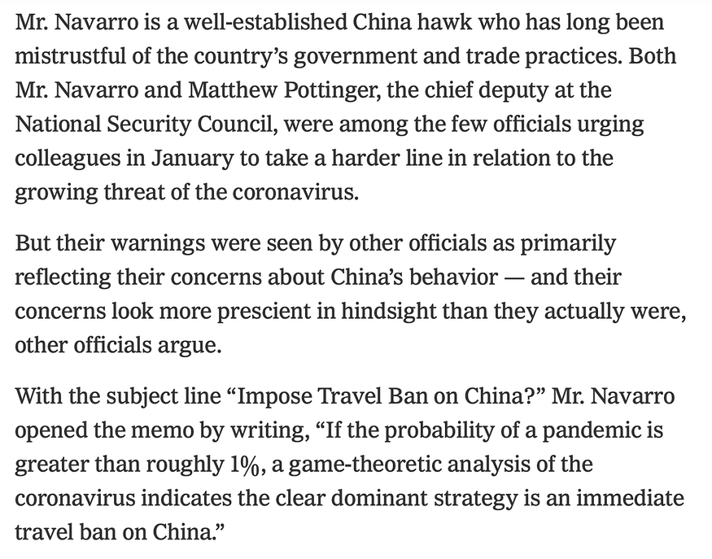

## Over time everyone develops a “high order bit” for how they view any new development. In software/biz it might be specific tech principles, org philosophies, pricing, positioning, competitors, etc..  

随着时间的推移，每个人都会形成自己看待任何新发展的 "高阶位"。在软件/商务领域，这可能是具体的技术原则、组织理念、定价、定位、竞争对手等。

3 min read 3 分钟阅读

Jun 19, 2020 2020 年 6 月 19 日

This is an annotated twitter [thread](https://twitter.com/stevesi/status/1247375916986011648).  

这是一条带注释的 twitter 线程。

Trade Adviser Warned White House in January of Risks of a Pandemic // This is all crazy craze stuff. BUT there is a valuable BigCo lesson. Leaders in any org are viewed through their “high order bits” no matter the issue. 1/9  

贸易顾问一月份曾警告白宫大流行病的风险 // 这都是些疯狂的事情。但这给大公司上了宝贵的一课。无论什么问题，人们都会通过 "高阶位 "来看待任何组织的领导者。1/9

Excerpt from NY Times story. 摘自《纽约时报》的报道。

2/ Over time everyone develops a “high order bit” for how they view any new development. In software/biz it might be specific tech principles, org philosophies, pricing, positioning, competitors, etc..  

2/ 随着时间的推移，每个人都会形成自己看待任何新发展的 "高阶位"。在软件/商务领域，这可能是具体的技术原则、组织理念、定价、定位、竞争对手等。

People react to new inputs calling on or context of high order bits.  

人们会根据高阶比特或高阶比特的背景对新的输入做出反应。

3/ Challenges arise when trying to drive action in crisis (versus just new data). In crisis, an org’s immediate reaction is almost always “what crisis?”  

3/ 当试图在危机中推动行动（而不仅仅是新数据）时，挑战就会出现。在危机中，组织的直接反应几乎总是 "什么危机？

Until more people with different high order bits see a crisis, most view a single reaction as “oh that’s just X again…”  

在更多拥有不同高阶位的人看到危机之前，大多数人将单一反应视为 "哦，又是X......"

4/ It is no surprise that the NSC staff saw something Navarro said as based on concerns and distrust of China. That’s his high order bit.  

4/ 在国家安全委员会工作人员看来，纳瓦罗的话是基于对中国的担忧和不信任，这并不奇怪。这是他的高阶位。

Equally unsurprising is that Navarro’s initial memo had the subject line “Impose Travel Ban on China?”  

同样不足为奇的是，纳瓦罗最初备忘录的主题是 "对中国实施旅行禁令？

That would be ineffective. 这样做是无效的。

5/ So the lesson is “know your high order bit” and literally avoid using that when trying to drive change or response to something.  

5/ 因此，教训就是 "了解你的高阶位"，并在试图推动变革或对某事做出反应时，从字面上避免使用高阶位。

You’re own high order bit is not a secret — everyone knows it and will always add it to the end of everything you say no matter what.  

你自己的高阶位并不是什么秘密--每个人都知道，而且无论如何都会在你说的每句话的结尾加上它。

6/ My own high order bit was always “shipping software” \[high-quality, on-time, easy-to-use\]. After about 10 years of meetings where no matter what came up I would always offer a view through the lens of “gee, will that ship” or “that will take a long time to ship”.  

6/ 我自己的高要求一直是 "发货软件"\[高质量、准时、易用\]。在大约 10 年的会议中，无论出现什么问题，我都会从 "哎呀，这能发货吗 "或 "这需要很长时间才能发货 "的角度提出看法。

7/ If I wrote a memo or email (“writing is thinking”) on a topic and included or led with commentary about shipping I now know the rest of what I wrote was mostly ignored at best or at worst fell on deaf ears.  

7/ 如果我就某个主题写了一份备忘录或一封电子邮件（"写作即思考"），其中包括或引出了关于航运的评论，我现在知道，我所写的其他内容充其量是被忽视了，最坏的情况是充耳不闻。

It took a while but I learned.  

虽然花了点时间，但我学会了。

8/ In fact what I really learned was that it is good to leave out your high order bit, but it is even better to include the high order bits of other people. They might be non-issues to you or even annoying, but to others, well, it’s their high order bit.  

8/ 事实上，我真正学到的是，撇开自己的高阶位是好的，但包含其他人的高阶位则更好。对你来说，这些问题可能无关紧要，甚至令人讨厌，但对别人来说，这就是他们的高阶位。

9/ So as you can imagine I learned to lead with topics like software architecture or code reuse for some and pricing, pricing, and then pricing (and positioning) for others.  

9/ 因此，你可以想象，我学会了引导一些人讨论软件架构或代码重用等话题，而另一些人则讨论定价、定价、再定价（和定位）。

Turns out they would always fill in the part where I say shipping on time w/quality and features. // END  

事实证明，他们总是会在我说按时发货、质量和功能的地方填写。// 结束

You can follow [@stevesi](https://twitter.com/intent/user?screen_name=stevesi).  

您可以按照 [@stevesi](https://twitter.com/intent/user?screen_name=stevesi) .
