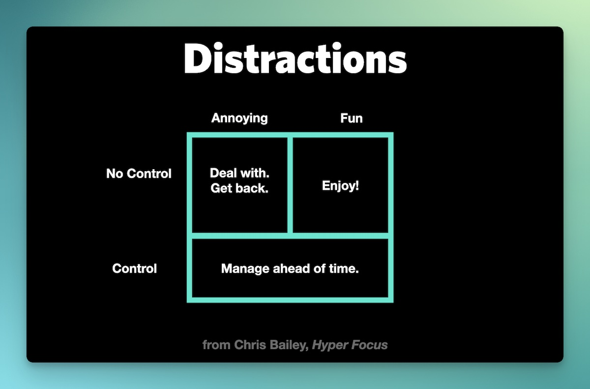

In a world of distraction, focus is hard. But that doesn’t mean we should fight to protect our attention.  

在一个注意力分散的世界里，集中注意力很难。但这并不意味着我们应该为保护自己的注意力而斗争。

In this post, I want to share some tips for staying focused — and what to do when the inevitable distractions come.  

在这篇文章中，我想与大家分享一些保持专注的小窍门，以及在不可避免地分心时该怎么办。

In his book _[Hyperfocus](https://chrisbailey.com/hyperfocus/)_, author Chris Bailey shares the most effective framework I’ve ever come across for dealing with distraction. It resembles one of those 2×2 productivity grids you’re probably familiar with and is incredibly simple. On the y-axis are _Things you control_ and _Things you don’t control_, and on the x-axis are _Things that are fun_ and _Things that are annoying_.  

克里斯-贝利（Chris Bailey）在他的著作《超级专注》（Hyperfocus）中分享了我所见过的处理分心问题最有效的框架。它类似于你可能很熟悉的那种 2×2 效率网格，简单得令人难以置信。Y轴上是你能控制的事情和你不能控制的事情，X轴上是有趣的事情和烦人的事情。

Let’s break this down section by section.  

让我们逐条分析一下。

## Annoying distractions you have no control over  

你无法控制的恼人干扰

You’re just sitting down at your desk for some focused work when you manager pops in and tells you that there’s a major issue with a client project and there’s an all-hands meeting in the conference room in 10 minutes.  

你正坐在办公桌前专心致志地工作，你的经理突然闯进来，告诉你一个客户项目出现了重大问题，10 分钟后要在会议室召开全体员工会议。

So much for that copywriting you were going to get done this morning.  

今天上午要完成的文案工作就到此为止吧。

At that moment, you have a choice: roll with the punches and do your best to get back on track as soon as you can, or stew about the unfairness that your entire day can easily be derailed by a higher-up with no knowledge of your workload.  

此时此刻，你可以做出选择：随遇而安，尽自己最大的努力尽快回到正轨；或者耿耿于怀，因为上级领导对你的工作量一无所知，却轻而易举地让你一整天的工作脱轨，这太不公平了。

These are things you hadn’t planned on dealing with, but the moment you get distracted and your focus is broken, the damage is already done. Once you’re interrupted, it doesn’t do any good to get upset about the fact that you lost your flow. The most productive thing you can do at this point is just deal with the distraction and then get back to work.  

这些都是你本不打算处理的事情，但当你分心、注意力被打断的那一刻，伤害就已经造成了。一旦你的注意力被打断，再为你的注意力不集中而懊恼也无济于事。此时，你能做的最有成效的事情就是处理好分心的事情，然后继续工作。

One thing I find helpful when I know I’m being interrupted like this is to “drop a marker” or a short note about where exactly I left off. It’s just a short note about what exactly I was doing. Usually, this is in Drafts or my fancy notebook and helps me get back up to speed quickly when I get back from dealing with the interruption.  

当我知道我的工作被打断时，我发现有一件事很有帮助，那就是 "做个记号"，或者写一个简短的便条，说明我到底在哪里中断的。这只是一个简短的笔记，说明我到底在做什么。通常，这是在草稿本或我的高级笔记本上，当我处理完中断的事情回来时，它能帮助我迅速恢复速度。

## Fun distractions you have no control over  

你无法控制的娱乐干扰

You’ve got your coffee, your headphones, and your laptop as you head to your home office to get some serious writing done. Your significant other is in the other room with your small child, and you are ready for some serious deep work time.  

你带着咖啡、耳机和笔记本电脑，准备去家里的办公室认真写作。你的另一半在另一个房间里陪着你的小孩，而你已经准备好了认真工作的时间。

But right about the time you’re getting into your flow state, your 3-year-old pops in the room:  

但就在你进入状态的时候，你 3 岁的孩子突然出现在房间里：

“Want to play?” "想玩吗？"

Your significant other comes in shortly after: “Sorry, I just stepped out for a minute to let the dog out.”  

你的另一半很快就进来了"对不起，我只是出去放狗"

What do you do? 你是做什么的？

In the past, I would have been really frustrated by something like this. But when COVID hit and we had to do everything from home, I learned the best thing I could do in situations like this is _just to enjoy it_. I’d step away from the computer and play a quick game of ping pong or shoot some hoops on the basketball hoop outside.  

如果是以前，我会因为这样的事情而非常沮丧。但当 COVID 来袭，我们不得不在家做所有事情时，我学会了在这种情况下能做的最好的事情就是享受它。我会离开电脑，快速地打一局乒乓球，或者在室外的篮球架上投几个篮。

And after about 10-15 minutes, I’d say “I’ve got to get back to work now,” and go refocus.  

大约 10-15 分钟后，我会说 "我得回去工作了"，然后重新集中注意力。

The truth is, getting frustrated about interruptions you have no control over just makes you _less_ productive when you do try to get back to work. So why not use it as an opportunity to have a little fun?  

事实上，对自己无法控制的干扰感到沮丧，只会让你在试图重新开始工作时降低工作效率。那么，为什么不利用这个机会找点乐子呢？

## Fun/Annoying distractions you have control over  

你可以控制的有趣/烦人的分心事

You’re just sitting down to start your work day. You’ve got your time-blocked plan, clarity on your three most important tasks, and you’re ready to go.  

你刚刚坐下来开始一天的工作。你已经制定了有时间限制的计划，明确了三项最重要的任务，并准备就绪。

But when you open up your laptop, you see a red unread badge on the email app in your dock. You think to yourself, “I’ll just check and see if there’s anything important I need to respond to quickly.” You scan the subject lines in your inbox and don’t see anything that looks urgent and important, but there are a few that look interesting. Curiosity gets the best of you, and you open one. A few seconds later, you close the message, but the app automatically opens the next message. It’s not urgent, but it’ll only take you a minute to respond to and then you won’t have to think about it anymore.  

但是，当你打开笔记本电脑时，却看到基座上的电子邮件应用程序上有一个红色的 "未读 "徽章。你心想："我就检查一下，看看有没有什么重要的事情需要尽快回复"。你扫了一眼收件箱中的主题行，没有看到任何看起来紧急和重要的内容，但有几封看起来很有趣。好奇心驱使你打开了一个。几秒钟后，你关闭了信息，但应用程序自动打开了下一条信息。这条信息并不紧急，但你只需花一分钟时间回复，然后就不用再想它了。

This process repeats, and an hour and a half later, you’re still cranking through email. You get a notification that you have a meeting starting soon, and you kick yourself for opening up email instead of focusing on the project that needs to get done before the end of the day.  

这个过程不断重复，一个半小时后，你还在不停地处理电子邮件。你收到通知，说你马上要开会了，你为自己打开电子邮件而不是专注于需要在下班前完成的项目而自责不已。

Most of our distractions and interruptions belong to this category. It’s convenient to blame others, but the truth (more often than not) is we self-sabotage our ability to focus.  

我们的大部分分心和干扰都属于这一类。责怪别人很方便，但事实（更多时候）是我们自己破坏了自己的专注能力。

That’s actually a good thing because it means we can really move the needle when it comes to protecting our attention.  

这其实是件好事，因为这意味着我们可以在保护我们的注意力方面真正有所作为。

Here are some strategies you can use to prevent distractions from ever popping up in the first place:  

以下是您可以用来防止分心的一些策略：

1.  **Use Do Not Disturb**. DND has been around for a while, and on your Mac it’s very easy to enable. Just hold the Option key and click Notification Center in the Menu Bar to quickly turn it on.  
    
    使用 "请勿打扰 "功能勿扰功能已经存在了一段时间，在 Mac 上启用它非常简单。只需按住 Option 键，然后单击菜单栏中的通知中心，即可快速打开。
2.  **Set up Focus Modes**. Focus Modes are surprisingly powerful. In addition to blocking out the noise, they can also trigger automations. Check out [this article](https://thesweetsetup.com/how-to-configure-focus-modes-to-eliminate-distractions-and-interruptions/) I wrote recently if you want some help getting started setting these up.  
    
    设置对焦模式对焦模式的功能非常强大。除了能屏蔽噪音，还能触发自动操作。如果你想在设置这些模式时得到一些帮助，请查看我最近写的这篇文章。
3.  **Turn Off Badges**. I hate the red unread badge that appears on most communication apps. While it can be helpful in certain situations, most apps default to having it for every message that comes in. If you need a quick focus boost, try turning these off and see if you really miss anything.  
    
    关闭徽章。我讨厌大多数通讯应用程序上出现的未读红色徽章。虽然它在某些情况下可能会有所帮助，但大多数应用程序都默认每条信息都会出现徽章。如果你需要快速提升注意力，可以尝试关闭这些徽章，看看是否真的错过了什么。
4.  **Minimize Notifications**. Like the badges, notifications tend to come for everything by default. Change this so that you only get notified of messages from [VIPs](https://thesweetsetup.com/how-to-set-up-vip-notifications-in-apple-mail/) (if you use Apple Mail) or specific teams (if you use Slack).  
    
    最小化通知。与徽章一样，默认情况下，所有信息都会收到通知。更改后，你只会收到来自 VIP（如果你使用 Apple Mail）或特定团队（如果你使用 Slack）的消息通知。

Remember, you’re never going to be able to eliminate distractions. Do the best you can with what you have, and don’t let yourself get bent out of shape if something outside your control comes up.  

记住，你永远无法排除干扰。尽你所能去做你能做的事情，不要让自己在遇到无法控制的事情时感到沮丧。

## Do Not Disturb Focus Booster 🚀 Unlock and Sustain your Creative Momentum  

勿扰专注力提升器 🚀 释放并维持你的创造动力

Tap into peak productivity so you can finish what you start instead of stalling out.  

发挥巅峰生产力，这样你就能完成开始的工作，而不是停滞不前。

**Get the system you need to unlock creative momentum, sustain it day after day, and shut out distractions that derail your most important work (starting today).  

获取你所需的系统，以释放创意动力，日复一日地保持这种动力，并将干扰你最重要工作的因素拒之门外（从今天开始）。**

**👉 Step #1: The Distraction Detox →** Discover how to manage the daily onslaught of notifications, overflowing inboxes, and false urgency that drain your focus.  

👉 第 1 步：分散注意力排毒法 → 探索如何管理每天纷至沓来的通知、满溢的收件箱以及耗尽你注意力的虚假紧迫感。

**👉 Step #2: Find Your Flow →** Develop a process for quickly getting “in the zone” so you can go from random acts of busywork to consistent daily progress.  

👉 步骤＃2：找到你的流程 → 制定一个快速进入 "状态 "的流程，这样你就能从随机的忙碌工作变成每天都有持续的进步。

**👉 Step #3: Dive into Deep Work →** Level up your focus skills so you can be as productive as possible during the time you have available.  

步骤＃3：潜入深度工作→提升你的专注能力，这样你就能在可用时间内尽可能地提高工作效率。

**Get all this, and more, inside the Focus Accelerator membership.  

在 Focus Accelerator 会员资格中，您将获得所有这些以及更多。**

**Join 300 focused members** who have access to $5,000 worth of our best courses and masterclasses, the Digital Planner, a Private Community Slack, 2x Monthly Coaching Calls, and much, much more…  

加入 300 名专注的会员，他们可以获得价值 5,000 美元的我们最好的课程和大师班、数字计划表、私人社区 Slack、每月 2 次辅导电话，以及更多更多...

[JOIN NOW FOR TOTAL ACCESS  

立即加入，获取全部访问权限](https://thesweetsetup.com/accelerator/?ref=53)
