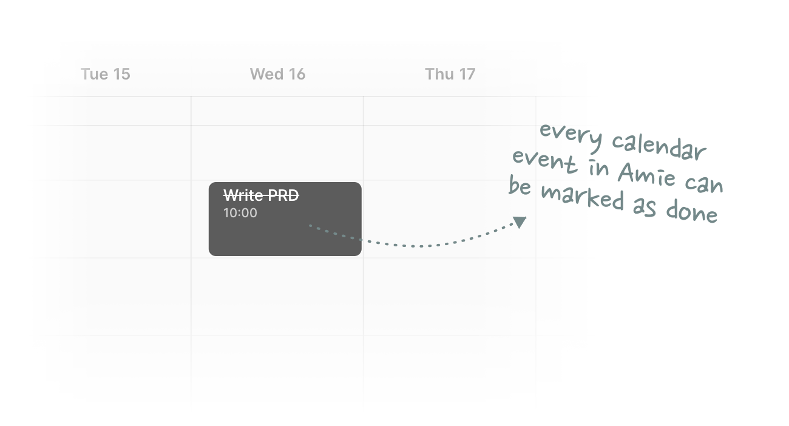
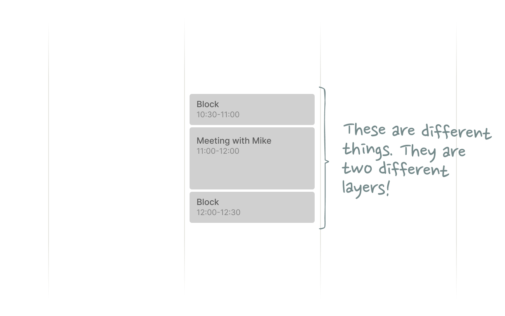

## Traveling through time in three dimensions  

在三维空间中穿越时空

01 Intro 01 引言

Time is a curious thing. It’s a constantly flowing stream that can’t be paused, stopped, or repeated. We experience it, but we can’t control it. We can’t even touch or feel it.  

时间是个奇怪的东西。它是一条不断流动的小溪，无法暂停、停止或重复。我们经历着它，却无法控制它。我们甚至无法触摸或感受它。

To get a better grasp of this weird, intangible resource that governs everything around us, humanity has invented a variety of “time devices”. These devices help us to plan and optimize how we spend our time. To make the most out of the here and now.  

为了更好地掌握这种支配着我们周围一切的奇怪而无形的资源，人类发明了各种各样的 "时间装置"。这些设备帮助我们规划和优化时间的使用。充分利用此时此地的时间。

The most popular time device is the watch. A watch is a useful tool, but its functionality is limited to the present moment. It allows us to _see_ time, but not to _manage_ it. It only tells us the status quo.  

最常用的计时设备是手表。手表是一种有用的工具，但其功能仅限于当下。它让我们看到时间，却无法管理时间。它只能告诉我们现状。

Calendars, on the other hand, cover the entire spectrum of time. Past, present and future. They are the closest thing we have to a time machine. **Calendars allow us to travel forward in time and see the future.** **More importantly, they allow us to _change_ the future.**  

而日历则涵盖了整个时间范围。过去、现在和未来。它们是我们拥有的最接近时间机器的东西。日历可以让我们穿越时空，看到未来。更重要的是，日历还能让我们改变未来。

Changing the future means dedicating time to things that matter. It means allocating our most precious resource to activities with the highest expected return on investment.  

改变未来意味着将时间用于重要的事情上。这意味着将我们最宝贵的资源分配给预期投资回报率最高的活动。

You would expect technologists and entrepreneurs to be intensely focused on perfecting such a magical time travel device, but surprisingly, that has not been the case. Our digital calendars turned out to be just marginally better than their pen and paper predecessors. And since their release, neither Outlook nor Google Calendar have really changed in any meaningful way.  

你本以为技术专家和企业家们会全神贯注地完善这种神奇的时间旅行装置，但令人惊讶的是，情况并非如此。我们的数字日历与纸笔日历相比，只是略胜一筹。而且，自从 Outlook 和谷歌日历发布以来，它们都没有发生任何有意义的变化。

Isn’t it ironic that, of all things, it’s our time machines that are stuck in the past?  

具有讽刺意味的是，我们的时间机器却停留在过去，这难道不具有讽刺意味吗？

The essay at hand is an exploration of what calendars could be if they weren’t stuck in time. But before we discuss their future, we first need to analyze their present status and how they fit into the rest of the productivity stack.  

我们现在要讨论的是，如果日历不被时间束缚，它们会是什么样子。不过，在讨论日历的未来之前，我们首先要分析一下日历的现状，以及日历如何融入生产力堆栈的其他部分。

02 Calendars and the productivity stack  

02 日历和生产力堆栈

Our productivity stack consists of four types of tools:  

我们的生产力堆栈由四种工具组成：

-   **Note-taking apps 笔记应用程序**  
    
    To document and organize our thoughts  
    
    记录和整理我们的想法
-   **Email 电子邮件**  
    
    To communicate with others 与他人交流
-   **Task managers  
    
    **To organize the things we need to get done  
    
    任务管理器组织我们需要完成的工作
-   **Calendars 日历**  
    
    To manage our time 管理我们的时间

The fact that we use four distinct tools suggests that note-taking, email, task management, and time management are four distinct activities. But when you look closer, you’ll realize that these activities are actually not that clear-cut. In fact, they all heavily overlap. [Notes are just emails to your future self](http://julian.digital/2020/09/04/a-meta-layer-for-notes/). [Emails are just tasks](http://julian.digital/2020/01/17/superhuman-the-productivity-meta-layer/). And tasks are just calendar events.  

我们使用四种不同的工具，这表明记笔记、收发电子邮件、任务管理和时间管理是四种不同的活动。但当你仔细观察时，就会发现这些活动其实并不那么泾渭分明。事实上，它们都有很大的重叠。 笔记只是写给未来的自己的电子邮件。 电子邮件只是任务。任务只是日历事件。

My personal workflow looks like this:  

我个人的工作流程是这样的

-   I treat my email inbox as my primary task manager (and note-taking tool).  
    
    我把收件箱当作主要的任务管理器（和记笔记的工具）。
-   Tasks are emails I receive from others or emails I send to myself.  
    
    任务是我从他人那里收到的电子邮件或我发送给自己的电子邮件。
-   I snooze emails until the week I want to get them done.  
    
    我会打盹等邮件，直到我想完成的那一周。
-   At the beginning of each week, I go through my email todo list and block time in my calendar for each task.  
    
    每周开始时，我都会查看我的电子邮件待办事项列表，并在日历中为每项任务预留时间。

The email<>todo part of this workflow actually works reasonably well. Most of today’s email clients are built around [the concept of Inbox Zero](https://www.youtube.com/watch?v=z9UjeTMb3Yk), which effectively turns your email inbox into a todo list with public write access.  

这个工作流程中的电子邮件<>待办事项部分实际上运行得很好。如今的大多数电子邮件客户端都是围绕 "零收件箱 "的概念构建的，这实际上是把你的收件箱变成了一个具有公共写入权限的待办事项列表。

The part we haven’t really figured out yet is the intersection between task managers and calendars.  

我们尚未真正弄清的部分是任务管理器和日历之间的交叉点。

Treating todos as calendar events is helpful because calendars introduce constraints. A calendar forces you to estimate how long each task will take and then find empty space for it on a 24 hours × 7 days grid, which is already cluttered with other things. It’s like playing Tetris with blocks of time.  

将待办事项视为日历事件很有帮助，因为日历引入了约束。日历迫使你估算每项任务需要多长时间，然后在 24 小时×7 天的网格上为其寻找空位，而网格上已经被其他事情堆满了。这就像用时间块玩俄罗斯方块。

So how do we get tasks into our calendars without awkwardly switching back and forth between two different apps that don’t talk to each other?  

那么，我们该如何将任务录入日历，而不必在两个互不往来的不同应用程序之间尴尬地来回切换呢？

New productivity tools such as [Amie](https://amie.so/) are trying to solve this problem by natively inserting todo lists into the calendar experience. In Amie, every calendar event is a task that can be marked as done.  

Amie 等新的生产力工具正试图通过在日历体验中原生插入待办事项列表来解决这个问题。在 Amie 中，每个日历事件都是可以标记为已完成的任务。

This approach is a step in the right direction, but it doesn’t go far enough. I agree that tasks should live in your calendar, but that doesn’t mean every calendar event should be a task. The way I see it, tasks are just one of many different types of calendar events. And just one of many different **calendar layers**.  

这种方法的方向是正确的，但还不够。我同意任务应该存在于日历中，但这并不意味着每个日历事件都应该是任务。在我看来，任务只是日历事件众多不同类型中的一种。也只是许多不同日历层中的一种。

03 Managing time in three dimensions  

03 从三个维度管理时间

To make the concept of calendar layers a little more tangible, let’s look at a scenario that you have probably seen before:  

为了让日历层的概念更加具体，让我们来看一个大家可能都见过的场景：

What’s happening here? 这里发生了什么？

**1\.** **You have a meeting with Mike**  

1.您要与迈克会面  

A meeting is a multiplayer calendar event. It is not the same as a task. It is simply a reminder for all meeting participants that their presence is required (or desired) at a specific time and place. There is no “to do” here apart from showing up on time.  

会议是一个多人日历事件。它与任务不同。它只是提醒所有会议参与者需要（或希望）在特定的时间和地点出席会议。除了准时出席，这里没有 "待办事项"。

**2\. You need to travel to and back from your meeting  

2.您需要往返于会议之间**

To ensure that no other meetings are scheduled during those travel times, you added two “do not schedule” blocks (DNS). These are neither meetings nor tasks. Their only purpose is to avoid conflicts with other upcoming events.  

为了确保在这些旅行时间内不安排其他会议，您添加了两个 "不安排 "块 (DNS)。这既不是会议，也不是任务。它们的唯一目的是避免与其他即将发生的事件发生冲突。

The DNS blocks appear before and after the meeting, but what they really represent is one entire layer of time that stretches from 10:30 to 12:30. Your conversation with Mike is a **meeting layer** _on top_ of your **blocked time layer**.  

DNS 块出现在会议前后，但它们真正代表的是从 10:30 到 12:30 的一整层时间。你与迈克的对话是你被封锁的时间层之上的会议层。

We tend to think of calendars as 2D grids with mutually exclusive blocks of time, but as this example shows, not all events automatically cancel each other out. Depending on their characteristics, they can be layered on top of each other. This means we manage time in three, not two, dimensions.  

我们通常认为日历是二维网格，其中包含相互排斥的时间块，但正如本例所示，并非所有事件都会自动相互抵消。根据事件的特性，它们可以相互叠加。这意味着我们是在三个维度而不是两个维度上管理时间。

Let’s see if we can add another layer to the mix.  

让我们看看能否再增加一层。

As discussed at the start of this chapter, neither blocked time nor meetings qualify as tasks — but what about talking points or agenda items that need to be covered in your meeting?  

正如本章开头所讨论的，封锁的时间和会议都不属于任务--但会议中需要涉及的谈话要点或议程项目又是什么呢？

We are now looking at three different types of calendar events, each with their own unique set of properties. The problem is that our calendars treat all of these different events equally. They don’t natively differentiate between a task and a meeting even though they are two completely different things.  

我们现在正在研究三种不同类型的日历事件，每种事件都有自己独特的属性集。问题是，我们的日历对所有这些不同的事件都一视同仁。尽管任务和会议是两种完全不同的事物，但它们并没有本质区别。

When I chatted with [Cron](https://cron.com/) founder [Raphael Schaad](https://twitter.com/raphaelschaad) about this issue, he pointed out another missing layer: Activities. An activity takes place for a prolonged period of time, but only requires your attention at certain points of it — not throughout.  

当我与 Cron 创始人拉斐尔-沙德（Raphael Schaad）聊起这个问题时，他指出了另一个缺失的层面：活动。一项活动会持续很长时间，但只需要你在其中的某些时间点关注，而不是自始至终。

Flights, for example, should be native calendar objects with their own unique attributes to highlight key moments such as boarding times or possible delays.  

例如，航班应该是原生日历对象，具有自己的独特属性，以突出关键时刻，如登机时间或可能的延误。

This gets us to an interesting question: If our calendars _were_ able to support other types of calendar activities, what else could we map onto them?  

这就引出了一个有趣的问题：如果我们的日历能够支持其他类型的日历活动，我们还能将什么映射到日历上？

04 Traveling back in time 04 时光倒流

A while ago, [this mock-up appeared in my Twitter feed](https://twitter.com/aaronzlewis/status/1259017698136281092):  

不久前，我的推特上出现了这个模型：

What’s so interesting about this idea is not just that it introduces another unique calendar layer, but that the data of this layer is rooted in the past. In contrast to traditional calendar events, all of these Spotify entries were created _after_ they happened.  

这个想法的有趣之处不仅在于它引入了另一个独特的日历层，还在于这个日历层的数据植根于过去。与传统的日历事件不同，所有这些 Spotify 条目都是在事件发生后创建的。

Something I never really noticed before is that we only use our calendars to look forward in time, never to reflect on things that happened in the past. That feels like a missed opportunity.  

我以前从未真正注意到的一点是，我们只用日历来回顾过去，却从不反思过去发生的事情。这让人感觉错失良机。

While a Spotify layer might seem more like a gimmick than a meaningful productivity hack, the idea of visualizing data from other applications in form of calendar events feels incredibly powerful. What if I could see health data alongside my work activities, for example?  

虽然 Spotify 图层看起来更像是一个噱头，而不是一个有意义的生产力黑客，但将来自其他应用的数据以日历事件的形式可视化的想法感觉非常强大。比如说，如果我能在工作活动的同时看到健康数据，那会怎样？

My biggest gripe with almost all quantified self tools is that they are input-only devices. They are able to collect data, but unable to return any meaningful output. My Garmin watch can tell my current level of stress based on my heart-rate variability, but not what has caused that stress or how I can prevent it in the future. It lacks context.  

我对几乎所有量化自我工具的最大不满在于，它们都是纯输入设备。它们能够收集数据，但无法返回任何有意义的输出。我的佳明（Garmin）手表可以根据我的心率变化告诉我当前的压力水平，但却无法告诉我是什么造成了这种压力，也无法告诉我今后该如何预防这种压力。它缺乏语境。

Once I view the data alongside other events, however, things start to make more sense. Adding workouts or meditation sessions, for example, would give me even more context to understand (and manage) stress.  

不过，一旦我将这些数据与其他事件放在一起查看，事情就开始变得更有意义了。例如，加入锻炼或冥想课程，会让我有更多了解（和管理）压力的背景。

Sleep is another data layer that would make a lot more sense in my calendar than in a standalone app. I already block time in my calendar for sleep (mostly as a DNS-memo to coworkers in other time zones), so why not add sleep quality data directly to that calendar event?  

睡眠是另一个数据层，在我的日历中比在独立应用程序中更有意义。我已经在日历中设置了睡眠时间（主要是作为对其他时区同事的 DNS 提醒），为什么不直接在日历事件中添加睡眠质量数据呢？

This way I could plan my day ahead with a lot more accuracy. Fully recharged after a solid eight hours of sleep? Block more focus time. Lack of deep sleep? Add another coffee break to the agenda.  

这样，我就能更准确地提前规划我的一天。睡足八小时后精力充沛？封锁更多的专注时间。缺乏深度睡眠？那就在日程上再加一段喝咖啡的时间。

This example is particularly interesting because it leverages all of our calendar’s time travel capabilities. It allows us to shape the future by studying the past.  

这个例子特别有趣，因为它利用了我们日历的所有时间旅行功能。它允许我们通过研究过去来塑造未来。

Once you start to see the calendar as a time machine that covers more than just future plans, you’ll realize that almost any activity could live in your calendar. As long as it has a time dimension, it can be visualized as a native calendar layer.  

一旦你开始将日历视为一个时间机器，它所涵盖的不仅仅是未来的计划，你就会意识到几乎任何活动都可以放在日历中。只要有时间维度，它就可以可视化为一个原生日历层。

Most of these data layers are pretty meaningless in isolation; it’s only when we view them alongside each other that they unlock their value. Even a Spotify layer starts to make sense when you look at it in combination with stress data (which music calms me down?), productivity metrics (which music helps me focus?), or personal activities from the past (nostalgia).  

这些数据层中的大多数单独来看都毫无意义；只有当我们把它们放在一起看时，才能发现它们的价值。即使是 Spotify 数据层，当你把它与压力数据（哪种音乐能让我冷静下来？

05 Closing thoughts 05 结束语

The takeaway of this essay is twofold:  

这篇文章的启示有两点：

-   Calendars should natively differentiate between different types of calendar events. Tasks, meetings, blocked time, and other activities should look and behave differently depending on their respective attributes.  
    
    日历应能区分不同类型的日历事件。任务、会议、封锁时间和其他活动应根据各自的属性，在外观和行为上有所不同。
-   This would open the door for a virtually infinite amount of other use cases that could be integrated into the calendar experience in the form of unique calendar layers.  
    
    这将为几乎无穷无尽的其他用例打开大门，这些用例可以以独特日历层的形式集成到日历体验中。

These changes would not just make the calendar a stronger center of gravity in the aforementioned productivity stack, but turn into an actual tool for thought, where time serves as the scaffolding for our future plans and our memory palaces of the past.  

这些变化不仅会使日历成为上述生产力堆栈中更强大的重心，而且会变成一个真正的思考工具，让时间成为我们未来计划和过去记忆宫殿的脚手架。

_Thanks to [Adam Waxman](https://twitter.com/ajwaxman), [Dennis Müller](https://twitter.com/dennismuellr), [Kevin Yien](https://twitter.com/kevinyien), [Paco Coursey](https://twitter.com/pacocoursey), [Michael Karnjanaprakorn](https://twitter.com/mikekarnj), and [Raphael Schaad](https://twitter.com/raphaelschaad) for reading drafts of this post.  

感谢 Adam Waxman、Dennis Müller、Kevin Yien、Paco Coursey、Michael Karnjanaprakorn 和 Raphael Schaad 阅读本文草稿。_
