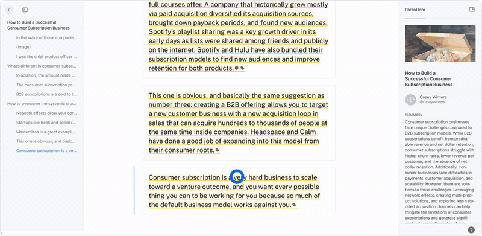

Hey all, 大家好

I'm excited to hit send on public beta newsletter #5 with our latest [Readwise Reader](https://readwise.io/read) updates 🙂  

我很高兴能发送公测版第 5 期简讯，其中包含我们最新的读慧阅读器更新 🙂。

_As a reminder, I write this newsletter every one to two months covering features we've just shipped, bugs we've recently fixed, and what we intend to work on next. I also share tips & tricks to help you get the most out of Reader. If you prefer to read these in-app, you can subscribe to the private RSS feed linked [here](https://readwise-community.ghost.io/2defd8e965b87487102ef0c6db1880/rss/).  

作为提醒，我每隔一到两个月就会撰写这份时事通讯，内容包括我们刚刚发布的功能、最近修复的错误以及我们下一步的工作计划。我还会分享一些技巧和窍门，帮助你充分利用阅读器。如果你喜欢在应用程序中阅读这些内容，可以订阅此处链接的私人 RSS 源。_

I'm a few weeks behind on this latest edition, but at least I have a good excuse: on May 31st, my wife and I welcomed the newest member of the Readwise family into the world (Logan). I'd also like to congratulate my teammate Eleanor on the arrival of her second child (Lilah) on July 28th!  

我的最新一期杂志已经滞后了几周，但至少我有一个很好的借口：5 月 31 日，我和妻子迎来了 Readwise 家庭的新成员（Logan）。我还要祝贺我的队友埃莉诺于 7 月 28 日迎来了她的第二个孩子（莉拉）！

If you yourself have a little one at home or are expecting, reply to this email with your mailing address and we'll send you one of our limited edition Readwise onesies ([pic](https://media.discordapp.net/attachments/852017862263832597/1139707913947066399/MEGHAN-6_1.jpg?width=2002&height=1334)). We've only got 15 left, so first come first serve.  

如果您家中有小宝宝或即将出生，请在本邮件中回复您的邮寄地址，我们将向您寄送我们的限量版 Readwise 连体衣（如图）。我们只剩下 15 件，先到先得。

Speaking of new team members, we've got a new job posting which I'll mention in the farewell: [Generalist Startup Writer](https://readwise.notion.site/Generalist-Startup-Writer-3b9ab41974ba453cb52f9f411a0360f1). If you or someone you know might be a good fit, we'd love to hear from you!  

说到新团队成员，我们发布了一个新职位，我将在告别时提及： 通用创业作家。如果您或您认识的人可能适合这个职位，我们很乐意收到您的来信！

Onto the product updates: 现在开始谈产品更新：

-   **🖼️ Quoteshots** – You can now convert highlights to beautiful images on both web & mobile. ️  
    
    🖼️ Quoteshots - 您现在可以在网页和手机上将精彩内容转换为精美图片。️
-   **📷 PDF Snapshots** – You can now highlight images, tables, and other graphics in PDFs using a "snapshot" feature. We've also shipped several quality of life upgrades to the mobile PDF experience.  
    
    PDF 快照 - 现在您可以使用 "快照 "功能突出显示 PDF 中的图像、表格和其他图形。我们还对移动 PDF 体验进行了多项质量升级。
-   **📓 Notebooks** – You can now interact with just your highlights for a particular document in a dedicated Notebook view.  
    
    📓 笔记本 - 现在，您可以在专用的笔记本视图中只与特定文档的重点内容进行交互。
-   **📜 Long Tweets** – You can now save tweets longer than 280 characters to Reader as if they were blog posts.  
    
    📜 长微博 - 您现在可以将超过 280 个字符的微博文保存到阅读器中，就像保存博文一样。
-   **📱 Mobile Appearance** – Many aspects of the mobile reading experience have been refined including an upgrade to the appearance panel, darker dark mode, more font settings, and firmer side panels.  
    
    📱 移动外观 - 移动阅读体验的许多方面都得到了改进，包括外观面板的升级、更暗的深色模式、更多的字体设置以及更坚固的侧边面板。
-   **🖥️ RSS Syncing** – You should now see new RSS items appear within seconds of posting and many of the edge case feeds such as Daring Fireball fixed.  
    
    🖥️ RSS 同步--现在你应该能看到新的 RSS 项目在发布后几秒钟内就会出现，而且许多边缘 RSS 源（如 Daring Fireball）也得到了修复。

The term "quoteshot" (or "textshot") is a made up word referring to a feature that converts highlighted text into beautiful raster images. For years, this has been a moment of delight in Readwise 1.0. Now it's a part of Reader too!  

术语 "quoteshot"（或 "textshot"）是一个虚构的词，指的是将突出显示的文本转换为精美光栅图像的功能。多年来，这一直是 Readwise 1.0 的一大亮点。现在，它也成为了阅读器的一部分！

To generate a quoteshot, open the more menu (`...`) on a highlight and select `Share highlight as image`. You'll then be able to select from 6 different styles such as Classic, Scribble, Fresh, Modern, Gradient, and my personal favorite, Unstyled. Each of these has dark & light modes, serif & sans serif, various color options, and 3 different aspect ratios leading to hundreds of permutations.  

要生成报价单截图，请在高亮部分打开更多菜单（ `...` ）并选择 `Share highlight as image` 。然后，你就可以从经典、涂鸦、清新、现代、渐变和我个人最喜欢的无风格等 6 种不同风格中进行选择。每种风格都有深色和浅色模式、有衬线体和无衬线体、各种颜色选项和 3 种不同的长宽比，可产生数百种排列组合。

Available on mobile too. I'm just trying a new app for making product GIFs.  

也可在手机上使用。我正在试用一款制作产品 GIF 的新应用。

You should experiment to find the aesthetic you like best, but here's the example from above to give you an idea:  

您应该通过实验找到自己最喜欢的审美方式，下面的例子可以给您一个参考：

Props to [Jesse](https://twitter.com/jessebc) & [Artem](https://twitter.com/ArtemLitch). In the future, we'll be adding more styles including one that works well with cover images and book covers.  

感谢 Jesse 和 Artem。今后，我们还将添加更多样式，包括一种适用于封面图像和书籍封面的样式。

## PDF Snapshotting 📷 PDF 快照 📷

The term "snapshot" is another (kind of) made up word referring to a feature that converts a rectangular selection in a PDF to a highlighted image. Basically, you can now highlight images, tables, charts, and more in PDFs!  

快照 "一词是另一个（有点）杜撰的词，指的是将 PDF 中的矩形选区转换为高亮图像的功能。基本上，你现在可以在 PDF 中突出显示图像、表格、图表等！

These images will flow through to Readwise and your note-taking apps!  

这些图像将流向 Readwise 和您的笔记应用程序！

As of this newsletter, you'll only find snapshotting on web, but [Mati](https://twitter.com/TucciMatias) is very close to shipping the feature on mobile too.  

截至本期通讯，您只能在网页上看到快照功能，但 Mati 也即将在手机上推出该功能。

Speaking of mobile PDFs, we've also shipped a bevy of smallish upgrades which I'll list here:  

说到移动 PDF，我们还进行了许多小的升级，在此一一列举：

-   **Table of contents** – PDFs don't always have tables of content, but when they do, they now appear in the left sidebar.  
    
    目录 - PDF 文件并不总是有目录，但如果有，现在就会显示在左侧边栏。
-   **Thumbnails** – You can now navigate PDFs using thumbnails.  
    
    缩略图 - 现在可以使用缩略图浏览 PDF。
-   **Easier to tap-in UI** – Activating the UI on PDFs is now much less glitchy, particularly on the first page of a PDF where it was sometimes much too finnicky.  
    
    更容易点击进入用户界面 - 现在在 PDF 上激活用户界面的故障率大大降低，特别是在 PDF 的第一页上，有时会非常不方便。
-   **Download with annotations** – You can now download annotated versions of PDFs on mobile for sharing into other apps.  
    
    下载带注释的 PDF 文件 - 现在您可以在移动设备上下载带注释的 PDF 文件，以便共享到其他应用程序中。
-   **Fixed line breaks in highlights** – First a superconducting metal, then a cure for cancer, now a way to highlight PDFs without random line breaks? At this point, no one can convince me these UAPs aren't extraterrestrial. Note that this alien technology only works when highlighting a PDF directly, not when highlighting the text view of a PDF (completely different tech tree, sorry).  
    
    高亮显示中的固定换行 - 先是超导金属，然后是癌症疗法，现在又是一种无需随机换行的 PDF 高亮显示方式？在这一点上，没有人能让我相信这些 UAP 不是外星生物。请注意，这项外星技术只在直接高亮 PDF 时有效，而不是在高亮 PDF 的文本视图时（技术树完全不同，抱歉）。

Props to [Mati](https://twitter.com/TucciMatias) for grinding on PDFs for the past two or three months.  

感谢 Mati 在过去两三个月里对 PDF 的打磨。

## Notebooks 📓 笔记本 📓

The concept of a Notebook has been in Reader since day 1. For each document, it's the companion section where all your notes and highlights are collected, inspired by the skeuomorph of writing reading notes inside the back cover of a paper book. Until recently, this Notebook was confined to the right sidebar, but now it's been elevated to a first-class feature enabling you to focus on a document's highlights without distraction.  

从第一天起，阅读器中就有了 "笔记本 "的概念。对于每份文档，它都是收集所有笔记和重点内容的配套部分，其灵感来自于在纸质书籍封底内书写阅读笔记的传统。直到最近，这个 "笔记本 "还局限在右侧边栏，但现在它已被提升为一流的功能，让你可以专注于文档的重点内容，而不会分心。

Pro-tip: Use `Shift 0` to toggle into the Notebook.  

小贴士：使用 `Shift 0` 可切换到笔记本。

This feature is a HUGE step towards recreating Readwise 1.0 functionality on top of Reader's abstractions. Notebooks are how we'll soon import your non-Reader highlights, create views of all highlights with a given tag, and so on.  

该功能是在阅读器抽象基础上重现 Readwise 1.0 功能的重要一步。我们很快就能通过笔记本导入非《阅读器》的重点内容，创建带有特定标签的所有重点内容的视图，等等。

This is just shipped, so it's still web-only and might have some edge cases we missed. Let us know if you find anything that's not working as expected.  

这是刚发布的版本，因此仍仅适用于网络，可能会有一些我们遗漏的边缘情况。如果您发现任何与预期不符的情况，请告诉我们。

Props to [Mitch](https://twitter.com/mitchelljustin0) & Rena.  

感谢米奇和瑞娜。

## Long Tweets 🐤 长微博 🐤

A few months ago, Twitter (in this house, it's Twitter) added the ability to write tweets of any length. Tweets exceeding the classic 280 character limit are collapsed with a `Show more` link. For a few months, these special tweets foiled our Twitter integration, but no more: you can now save long tweets to Reader as if they were threads or blog posts!  

几个月前，Twitter（这里指 Twitter）增加了撰写任意长度推文的功能。超过 280 个字符限制的推文会以一个 `Show more` 链接折叠。有几个月，这些特殊的推文阻碍了我们与 Twitter 的整合，但现在不会了：你现在可以将长推文保存到阅读器中，就像保存线程或博文一样！

Very popular long tweet last week about working at Twitter before and after Elon...  

上周非常流行的长推文，关于在 Twitter 工作前后的埃隆...

Aside from adding support for long tweets, maintaining our various Twitter integrations the past few months has been like that meme of [the guy squeegeeing the ocean](https://www.reddit.com/r/gifs/comments/7f0x7s/not_today_ocean/).  

除了增加对长推文的支持外，过去几个月中，我们对各种 Twitter 集成的维护工作就像.NET 的备忘录中的那个挤海的人一样。

But props to [Bruno](https://twitter.com/brvn0jm), [Tristan](https://twitter.com/homsiT), & [Tadek](https://twitter.com/tdkte) for holding down the fort.  

但布鲁诺、特里斯坦和塔迪克的坚守还是值得称赞的。

## RSS Refactor  RSS 重构

As a backend upgrade, there's no corresponding screenshot to share here, but [Tadek](https://twitter.com/tdkte) has completed a huge refactor of Reader's RSS syncing logic. As a result, you should now see new items populate in your Feed within seconds of being added to their respective RSS feeds, on par with classic RSS feed readers.  

作为后台升级，这里没有相应的截图可以分享，但 Tadek 已经完成了对 Reader 的 RSS 同步逻辑的巨大重构。因此，你现在可以看到新项目在添加到各自 RSS 源后几秒钟内就会出现在 Feed 中，与传统的 RSS 源阅读器不相上下。

[Tadek](https://twitter.com/tdkte) has also gone and manually fixed several of the edge case feeds that initially broke our abstractions – most notably, that pesky yet popular John Gruber and his Daring Fireball RSS feed.  

Tadek 还手动修复了几个最初破坏了我们的抽象的边缘案例--最明显的就是那个讨厌但很受欢迎的 John Gruber 和他的 Daring Fireball RSS 源。

## Mobile Appearance 🛝 移动外观 🛝

Like PDFs, we've been quietly shipping a bunch of small quality of life features to the mobile reading experience that collectively amount to their own section.  

就像 PDF 一样，我们一直在悄悄地为移动阅读体验提供一系列提高生活质量的小功能，这些功能合在一起就相当于一个独立的部分。

-   **Edit metadata** – You can now edit the metadata of a document such as title, author, and summary in the mobile apps.  
    
    编辑元数据 - 现在您可以在移动应用程序中编辑文档的元数据，如标题、作者和摘要。
-   **Darker dark mode** – Dark mode is now much darker with less of a bluish undertone.  
    
    更暗的暗色模式 - 暗色模式现在更暗了，蓝调更少了。
-   **Firmer side panels** – The left and right side panels now slide out on top of the document rather than pushing it left or right giving the content a "firmer" feel.  
    
    更坚固的侧板 - 左右侧板现在可以在文档顶部滑出，而不是左右推移，使内容有一种 "更坚固 "的感觉。
-   **Redesigned table of contents** – The table of the contents residing in the left side panel now has a more elegant UI with collapsible subheadings.  
    
    重新设计的目录 - 位于左侧面板的目录现在有了一个更优雅的用户界面，小标题可折叠。
-   **New appearance panel** – The appearance settings have been elevated out of the more actions section and the menu itself has been redesigned to accommodate features like switching from PDF mode to text mode and (soon) pagination.  
    
    新的外观面板--外观设置已从更多操作部分提升出来，菜单本身也进行了重新设计，以适应从 PDF 模式切换到文本模式以及（即将）分页等功能。
-   **New screen awake setting** – You can now toggle a `Keep screen awake` option in the mobile preference to override your system settings and ensure the screen never locks while you're reading.  
    
    新的屏幕唤醒设置--您现在可以在手机偏好设置中切换 `Keep screen awake` 选项来覆盖系统设置，确保在阅读时屏幕永远不会锁定。
-   **Larger font sizes** – Every time we increase the max font-size setting, we think to ourselves, "Lol okay there's no way anyone would actually want a bigger font than this." And every time, [we're wrong](https://twitter.com/deadly_onion/status/1690170491254751232?s=20). Accordingly, the max font-size now goes to 11 (Spinal Tap reference). It's ridiculous. Maybe 10 words on the screen on an iPhone 13 Max. That said, I've actually used this Brobdingnagian setting myself while getting in some Huberman-Attia Zone 2 exercise on the rower or echo bike with TTS. Talk about killing two birds with one stone. And yes, that is a real word meaning gigantic.  
    
    更大的字体大小 - 每次我们增加最大字体大小设置时，我们都会想，"好吧，好吧，不可能有人真的想要比这更大的字体"。但每次我们都错了。因此，最大字体大小现在变成了 11（参考 Spinal Tap）。这太荒谬了。iPhone 13 Max 的屏幕上可能只有 10 个字。话虽如此，我自己在划船器或回音自行车上使用 TTS 进行休伯曼-阿蒂亚 2 区运动时，也曾使用过这种布罗丁那加设置。可谓一石二鸟。是的，这是一个真实的词，意思是巨大的。

## Coming Up 🔜 即将到来 🔜

-   **Performance** – App performance remains our #1 priority as company. Unfortunately, the massive refactor we've been working on is all or nothing. It can't be shipped progressively. Fortunately, [Adam](https://twitter.com/lynchy010) is very close to having this ready.  
    
    性能 - 应用程序性能仍然是我们公司的第一要务。不幸的是，我们一直在进行的大规模重构工作要么全有，要么全无。它无法逐步交付。幸运的是，Adam 已经准备就绪。
-   **Pagination** – We're about to ship pagination to mobile which enables you to read a document in left-to-right pages rather than in vertical scroll. We've been using [Artem](https://twitter.com/ArtemLitch)'s test build internally for the past week and it's spectacular. Particularly for long-form reading.  
    
    分页 - 我们即将为移动设备提供分页功能，让您可以从左到右分页阅读文档，而不是垂直滚动。过去一周，我们一直在内部使用 Artem 的测试版本，效果非常出色。尤其适合长篇阅读。
-   **Readwise 1.0** – As mentioned above, Notebooks set the stage for a series of Readwise 1.0 features now underway including importing non-Reader highlights, viewing collections of highlights, and more.  
    
    读慧 1.0 - 如上所述，笔记本为读慧 1.0 的一系列功能奠定了基础，这些功能包括导入非阅读器摘要、查看摘要集等。
-   **New Newsletter** – Last but not least, we're about to start sending a weekly newsletter containing the most highlighted documents in Readwise. Our users are among the most elite readers on the internet, and it turns out that the content which they (ie you) actually read & highlight is extremely high signal.  
    
    新时事通讯--最后但并非最不重要的一点是，我们即将开始发送每周时事通讯，其中包含 Readwise 中被高亮显示最多的文档。我们的用户是互联网上最优秀的读者之一，事实证明，他们（即您）实际阅读和高亮显示的内容信号极高。

## Minor Improvements 🦐 小规模改进 🦐

-   [Bruno](https://twitter.com/brvn0jm) collaborated with the good folks at Tana to create our newest and most advanced export integration to date  
    
    布鲁诺与塔纳公司的优秀人员合作，创建了我们迄今为止最新、最先进的导出集成
-   [Hannes](https://twitter.com/eliias) & Dan significantly overhauled the Ghostreader completion prompts – which were originally created before ChatGPT was even a thing (hard to remember) – to behave nicely with the GPT-3.5 chat model  
    
    汉内斯和丹对 Ghostreader 的完成提示进行了重大修改--这些提示最初是在 ChatGPT 出现之前创建的（很难记住）--以便与 GPT-3.5 聊天模型配合使用
-   [Artem](https://twitter.com/ArtemLitch) made a series of performance improvements to the mobile apps, particularly when taking actions on an open document such as highlighting  
    
    Artem 对移动应用程序的性能进行了一系列改进，尤其是在打开的文档上执行高亮等操作时。
-   [Artem](https://twitter.com/ArtemLitch) improved the smoothness of scrolling the visual indicator while listening on mobile  
    
    Artem 改进了在手机上收听时滚动视觉指示器的流畅性
-   [Artem](https://twitter.com/ArtemLitch) & [Jesse](https://twitter.com/jessebc) added some new fonts to the mobile app  
    
    阿尔特姆和杰西为移动应用程序添加了一些新字体
-   [Artem](https://twitter.com/ArtemLitch) improved the behavior of text input boxes on Android to fix issues with scrolling  
    
    Artem 改进了 Android 上文本输入框的行为，以修复滚动问题。
-   Réna added better formatting of numbers and times across the web & mobile apps  
    
    Réna 在网页和移动应用程序中添加了更好的数字和时间格式
-   Réna & [Artem](https://twitter.com/ArtemLitch) improved the smoothness of the loading screen when opening a document on mobile  
    
    Réna 和 Artem 改进了在手机上打开文档时加载屏幕的流畅性
-   [Tristan](https://twitter.com/homsiT) & [Bruno](https://twitter.com/brvn0jm) improved the [Document CREATE](https://readwise.io/reader_api) endpoint of the Reader API so it now supports setting a document note  
    
    特里斯坦和布鲁诺改进了阅读器应用程序接口的 "文档创建"（Document CREATE）端点，使其现在支持设置文档注释。
-   [Tristan](https://twitter.com/homsiT) & [Bruno](https://twitter.com/brvn0jm) improved added an `updatedAfter` parameter to the [Document LIST](https://readwise.io/reader_api#list) endpoint enabling you to fetch only the documents updated since the last sync (with code samples)  
    
    特里斯坦和布鲁诺改进了文档列表（Document LIST）端点，增加了一个 `updatedAfter` 参数，使您可以只获取上次同步后更新的文档（附代码示例）。
-   [Bruno](https://twitter.com/brvn0jm) is almost done implementing Oauth to both the Reader and Readwise public APIs (reach out to us if you’re interested in using it)  
    
    布鲁诺即将完成在阅读器和 Readwise 公共应用程序接口中实施 Oauth 的工作（如果您有兴趣使用，请联系我们。）
-   [Tadek](https://twitter.com/tdkte) & Krzys massively improved Substack parsing  
    
    Tadek 和 Krzys 大幅改进了 Substack 解析功能

## Bug Fixes 🐛 错误修正 🐛

-   Fixed a major Android bug where the app would freeze on launch  
    
    修正了一个主要的安卓错误，即应用程序启动时会冻结
-   Fixed a TTS bug where the audio could randomly speed up or slow down  
    
    修正了一个 TTS Bug，在该 Bug 中音频可能会随机加速或减速
-   Fixed a TTS bug where the audio would sometimes desync with the visual indicator  
    
    修正了一个 TTS Bug，在该 Bug 中，音频有时会与视觉指示器不同步
-   Fixed a TTS bug where audio would stutter on start  
    
    修正了一个 TTS Bug，该 Bug 在启动时音频会出现卡顿
-   Fixed a mobile bug where long documents (especially EPUBs) would inadvertently set reading progress set to 100%  
    
    修正了一个移动错误，即长文档（尤其是 EPUB）会无意中将阅读进度设置为 100%
-   Fixed a Safari extension bug where signing into Readwise wouldn’t work properly  
    
    修正了一个 Safari 扩展程序错误，该错误导致无法正常登录 Readwise
-   Fixed a mobile bug where footnotes/links in EPUBs would show an alert instead of navigating to the correct location  
    
    修正了一个移动错误，在该错误中，EPUB 中的脚注/链接会显示提示，而不是导航到正确的位置
-   Fixed a mobile bug where custom swipe actions weren't saving across sessions for some users  
    
    修正了一个移动错误，在该错误中，某些用户的自定义轻扫操作无法跨会话保存
-   Fixed a Chrome/Arc extension where selecting a loooot text could crash the browser (shout out to the Arc team for bring this to our attention)  
    
    修正了 Chrome/Arc 扩展中选择 loooot 文本可能导致浏览器崩溃的问题（感谢 Arc 团队提请我们注意该问题）。
-   Fixed an iPad issue where the iPad sidebar could be accidentally swiped in  
    
    修正了一个 iPad 问题，在该问题中，iPad 侧边栏可能会被意外滑入
-   Fixed an issue where some [t.co](http://t.co/) links weren't saving when using the iOS share sheet  
    
    修复了使用 iOS 分享表时某些 t.co 链接无法保存的问题
-   Fixed a web app bug where the PageDown key didn’t work after making a note  
    
    修正了网络应用程序的一个 Bug，在该 Bug 中，PageDown 键在创建备注后不起作用
-   Fixed an Android bug where bold system fonts were distorting the display  
    
    修正了一个 Android Bug，在该 Bug 中，粗体系统字体会使显示屏变形
-   Fixed a mobile bug with the Literata font  
    
    修复了 "Literata "字体的一个移动错误
-   Fixed a web app bug where removing a tag sometimes required clicking the x button twice  
    
    修正了一个网络应用程序错误，在该错误中，移除标签有时需要点击两次 x 按钮
-   Fixed a web app bug where the keyboard shortcut to slow down YouTube video playback (`,`) wasn’t working  
    
    修正了一个网络应用程序错误，在该错误中，键盘快捷键无法减缓 YouTube 视频播放速度（ `,` ）。
-   Fixed a mobile bug where tapping the bottom menu UI could open images underneath the buttons  
    
    修正了一个移动错误，在该错误中，点击底部菜单 UI 可打开按钮下方的图像
-   Fixed a web app bug where the "more actions" menu would sometimes not open  
    
    修正了一个网络应用程序错误，在该错误中，"更多操作 "菜单有时无法打开
-   Fixed an Android bug where sometimes a black bar would cover the left side of the mobile app screen  
    
    修正了一个 Android Bug，在该 Bug 中，移动应用程序屏幕左侧有时会出现黑条
-   Fixed a mobile bug where tags containing the slash character would behave improperly  
    
    修正了一个移动错误，在该错误中，包含斜线字符的标记会表现不正常
-   Fixed an issue where highlights made with the browser extension weren’t overlaying on the clean document in many cases  
    
    修正了一个问题，即在许多情况下，使用浏览器扩展功能制作的高亮部分无法叠加到干净的文档上
-   Fixed an exporting bug where Kindle highlights sometimes wouldn’t trigger an export after syncing automatically  
    
    修正了一个导出错误，在该错误中，Kindle 高亮显示有时在自动同步后不会触发导出
-   Fixed some exporting bugs affecting Obisidan and Logseq where there would sometimes be duplicates or missing items  
    
    修正了一些影响 Obisidan 和 Logseq 的导出错误，在这些错误中，有时会出现重复或缺失的项目
-   Fixed an exporting bug where a new highlight sometimes wouldn’t sync to Evernote  
    
    修正了一个导出错误，在该错误中，新的高亮显示有时无法同步到 Evernote
-   Fixed a PDF bug where sometimes hyperlinks would render with improper colored rectangles  
    
    修正了一个 PDF 文件错误，在该错误中，超链接有时会显示为颜色不正确的矩形
-   Fixed a web app bug where the header would cover the top of PDFs incorrectly  
    
    修正了一个网络应用程序错误，即标题会错误地覆盖 PDF 文件的顶部
-   Fixed a PDF bug where the copy highlight shortcut wasn't working  
    
    修复了复制高亮快捷键不起作用的 PDF 错误
-   Fixed a web app bug where the "Apply action to all above/below" commands weren't including the focused document  
    
    修正了一个网络应用程序错误，在该错误中，"将操作应用于上方/下方的所有内容 "命令不包括关注的文档
-   Fixed a bug with the Atkinson Hyperlegible font  
    
    修正了阿特金森超可读字体的一个错误
-   Fixed an export bug where the variable wasn't working in header templates  
    
    修正了一个导出错误，该错误导致变量在标题模板中不起作用
-   Fixed a web app bug where the app would flash "Document not found" after deleting an opened document  
    
    修正了网络应用程序的一个错误，即删除打开的文档后，应用程序会闪烁 "未找到文档
-   Fixed a bug where the filtering syntax wasn't respecting lowercase  boolean operators (such as "and" and "or")  
    
    修正了一个错误，在该错误中，过滤语法不尊重小写布尔运算符（如 "和 "和 "或"）。
-   Fixed a mobile bug where adding a document tag via the share sheet would create duplicates  
    
    修正了一个移动错误，在该错误中，通过共享表单添加文档标签会创建重复标签
-   Fixed a mobile bug where newly deleted highlights in PDFs would stay visible until the app was refreshed  
    
    修正了一个移动错误，在该错误中，PDF 文件中新删除的高亮部分会一直可见，直到重新刷新应用程序为止
-   Fixed a web app bug where keyboard shortcuts would sometimes reset  
    
    修正了一个网络应用程序错误，该错误导致键盘快捷键有时会重置
-   Fixed a web app bug where the OPML export of RSS feeds would sometimes encode broken characters  
    
    修正了网络应用程序的一个 Bug，在该 Bug 中，RSS 订阅的 OPML 导出有时会编码错误的字符
-   Fixed parsing issues where documents would sometimes show too much whitespace  
    
    修正了文件有时会显示过多空白的解析问题
-   Fixed a web app bug where the shortcut `+`  wasn't capturing the numpad `+`  
    
    修正了网络应用程序的一个错误，即快捷键 `+` 无法捕捉数字键盘 `+`
-   Fixed a mobile bug where receiving OS-level notifications would pause TTS  
    
    修正了一个移动错误，即接收操作系统级通知时会暂停 TTS
-   Fixed an issue where users with large numbers of deleted documents would experience memory issues and crashes  
    
    修正了一个问题，即删除大量文件的用户会遇到内存问题和崩溃
-   Fixed an email parsing issue where the formatting and sizing of images were significantly distorted  
    
    修正了一个电子邮件解析问题，该问题导致图像格式和大小严重失真
-   Fixed a mobile bug where some swipes would get "stuck"  
    
    修正了一个手机 Bug，在该 Bug 中，某些轻扫操作会 "卡住"。
-   Fixed a Ghostreader bug where the response would inadvertently overwrite existing highlight notes  
    
    修正了一个 Ghostreader Bug，在该 Bug 中，回复会无意中覆盖现有的高亮笔记
-   Fixed a web app bug where archiving items using the mouse sometimes showed an "Already in Archive" message even when the document was not yet archived  
    
    修正了一个网络应用程序错误，在该错误中，即使文件尚未存档，使用鼠标存档项目有时也会显示 "已存档 "信息
-   Fixed a mobile bug where selecting text would sometimes inadvertently slide the left and right side panels  
    
    修正了一个手机错误，在该错误中，选择文本有时会无意中滑动左右侧面板
-   Fixed a mobile bug where marking documents as Seen would sometimes improperly set them as the "Currently reading" document  
    
    修正了一个移动设备错误，在该错误中，将文档标记为 "查看 "有时会错误地将其设置为 "当前阅读 "文档
-   Fixed an Android bug where the mobile app would crash on start for some users  
    
    修正了一个安卓错误，在该错误中，部分用户的移动应用程序会在启动时崩溃
-   Fixed a mobile bug where some RSS feed URLs would crash the app  
    
    修正了一个移动错误，在该错误中，某些 RSS 源 URL 会导致应用程序崩溃
-   Fixed a web app bug where exporting document highlights wasn't working properly on Firefox  
    
    修正了一个网络应用程序错误，该错误导致在 Firefox 上导出文档高亮时无法正常工作
-   Fixed an EPUB bug where images would sometimes render incorrectly  
    
    修正了一个 EPUB Bug，在该 Bug 中，图片有时会呈现不正确的效果
-   Fixed a web app bug where the top bar header would sometimes show a border line incorrectly when scrolled to the top  
    
    修正了一个网络应用程序错误，即当滚动到顶部时，顶栏标题有时会错误地显示边界线
-   Fixed an RSS bug where The Atlantic feed would show HTML markup in document titles  
    
    修正了一个 RSS Bug，在该 Bug 中，《大西洋月刊》馈送会在文档标题中显示 HTML 标记
-   Fixed a web app bug with the zoom shortcuts  
    
    修正了缩放快捷键的网络应用程序错误
-   Fixed a web app bug where Twitter avatars would sometimes show as ovals  
    
    修正了一个网络应用程序错误，在该错误中，Twitter 头像有时会显示为椭圆形
-   Fixed a mobile bug where URLs missing an http start couldn't be saved  
    
    修正了一个移动错误，在该错误中，缺少 http 开头的 URL 无法保存

## Creator Content 📼 创作者内容 📼

### CortexFutura

In case you missed it above, Readwise now has an official integration with Tana. The inimitable [CortexFutura](https://twitter.com/cortexfutura) wasted no time in [producing a video](https://www.youtube.com/watch?v=h3Xk3Sl6eYw) 🙏  

如果您错过了上面的内容，Readwise 现在已经与 Tana 正式集成。无与伦比的 CortexFutura 立即制作了一段视频🙏。

### William Meller 威廉-梅勒

If you’re still thinking through your end-to-end workflow, agile coach William Meller just dropped two tutorials on how he uses [Reader](https://www.williammeller.com/2023/07/reader-by-readwise.html) and [Readwise](https://www.williammeller.com/2023/07/readwise.html).  

如果您还在考虑端到端工作流程，敏捷教练 William Meller 刚刚发布了两份教程，介绍他如何使用 Reader 和 Readwise。

### Sergio Petisca 塞尔吉奥-佩蒂斯卡

In his latest tutorial, Sergio shows you how to use your Reader tags to [supercharge your Obsidian](https://www.youtube.com/watch?v=CH84CsBViOs&feature=youtu.be) workflow.  

在最新的教程中，塞尔吉奥向你展示了如何使用阅读器标签来强化黑曜石工作流程。

### Brandon Boswell 布兰登-博斯韦尔

Readwise isn’t the star of Brandon's latest video, but plays a supporting role in his new [Boox Palma review](https://www.youtube.com/watch?v=7-iNpTA0McQ). (Unlocking these Boox eink devices through the performance refactor above is something our entire team lusts for! It's only a matter of time...)  

在布兰登的最新视频中，Readwise 并不是主角，但在他最新的 Boox Palma 评测中扮演了配角（通过上述性能重构来解锁这些 Boox eink 设备是我们整个团队梦寐以求的事情！这只是时间问题......）

### Jessika Rocha  杰西卡-罗查

Shoutout and _muito obrigado_ to Jessika Rocha, who just created the [first Reader tutorial in Portuguese](https://www.youtube.com/watch?v=7alWUzELgDk)! 🙏🏻  

非常感谢 Jessika Rocha，她刚刚用葡萄牙语编写了第一本阅读器教程！🙏🏻

## Farewell 👋 永别了 👋

Last update, we posted roles for a [Customer Success & Technical Writer](https://readwise.notion.site/Customer-Success-Technical-Writer-390b8238b58845918953aab85a2420de?pvs=4) and [Senior Growth Engineer](https://readwise.notion.site/Senior-Growth-Engineer-1ebdd33f714c45d49c5c46b347b5bc5a?pvs=4). While we're still hunting on the engineer front, we're delighted to welcome [Cayla Fronhofer](https://twitter.com/caylafronhofer) to the team as our technical writer!  

上次更新时，我们发布了客户成功与技术撰稿人和高级增长工程师的职位。 虽然我们仍在寻找工程师，但我们很高兴欢迎 Cayla Fronhofer 加入团队，担任我们的技术撰稿人！

As mentioned in the intro, we've got a new open role for a [Generalist Startup Writer](https://readwise.notion.site/Generalist-Startup-Writer-3b9ab41974ba453cb52f9f411a0360f1?pvs=4). We have some immediate, recurring publications to own and once we establish the right relationship, the writing opportunities are unbounded. If you or someone you know might be a good fit, we'd love to hear from you!  

正如我们在开场白中提到的，我们新招聘了一名综合型初创企业撰稿人。我们有一些直接的、经常性的出版物，一旦我们建立了合适的关系，写作机会将不可限量。如果您或您认识的人有合适的人选，我们非常欢迎您的加入！

Thank you again for your continued support and please reach out any time 🙏  

再次感谢您的持续支持，请随时联系🙏。  

– Dan, Tristan, & the Readwise team  

\- 丹，特里斯坦，和Readwise团队
