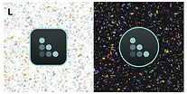
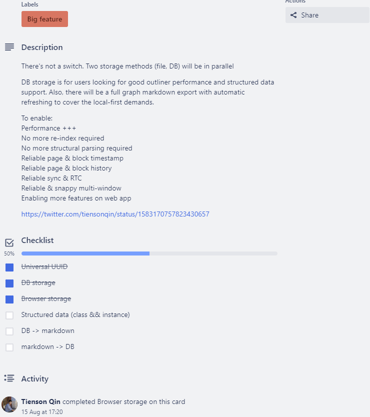
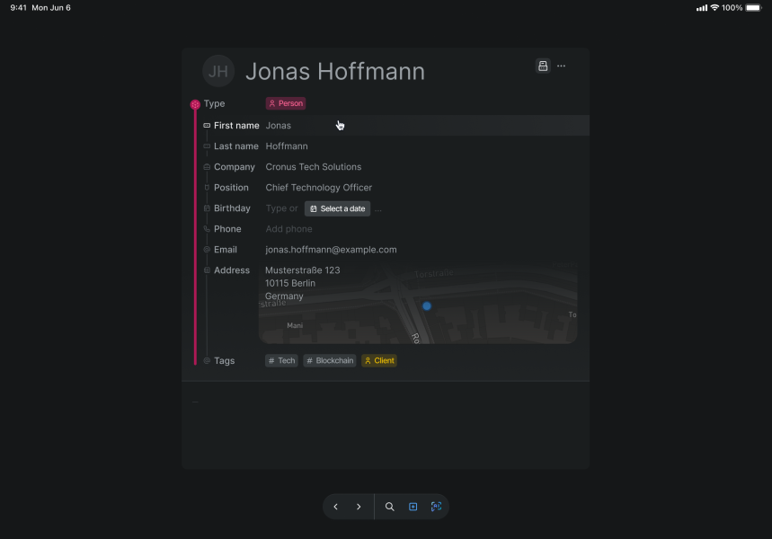
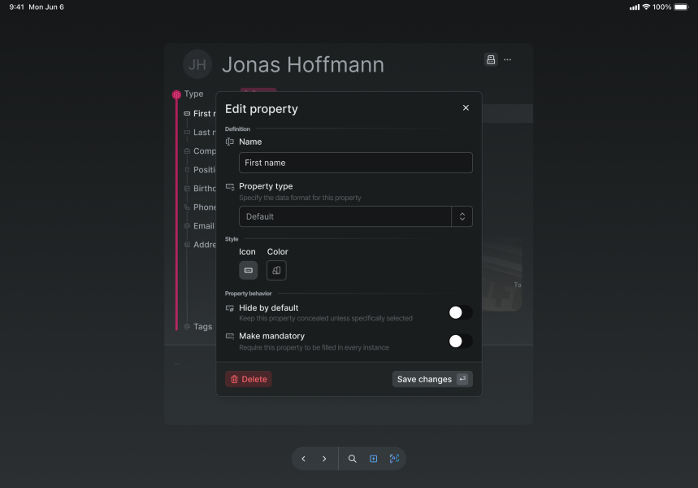
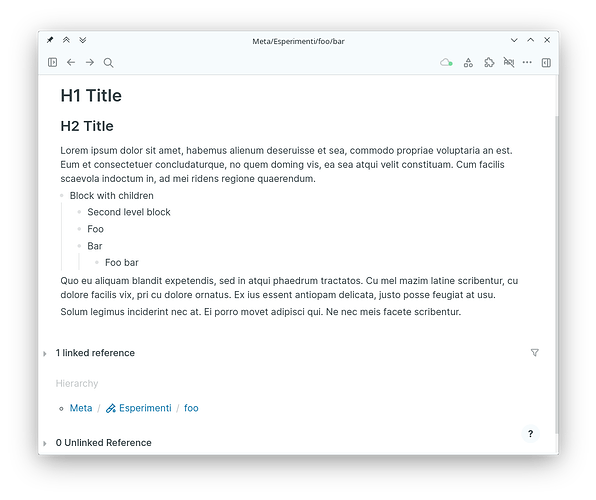
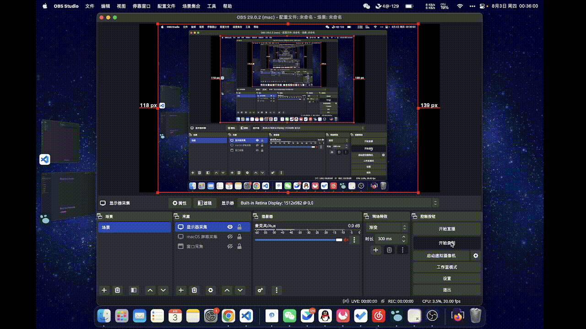
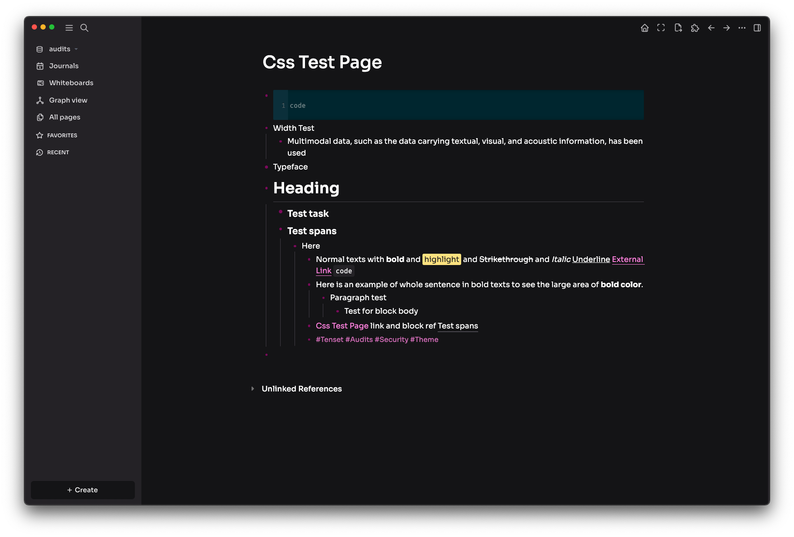

Hi Everyone, 大家好

With schools starting to dust off the desks and books as children return, the summer weather slowly simmering down (sorry for the UK folks, it seems the summer came and went without anyone noticing), bathing suits being offered at a discount, and the days starting to shorten (for some), it is high time that Logseq Times makes a post-summer vacation return.  

随着孩子们返校，学校开始整理课桌和书本，夏天的天气也慢慢转凉（对不起，英国朋友们，夏天似乎在不知不觉中来去匆匆），泳衣开始打折，白天开始缩短（对某些人来说），Logseq Times 也是时候在暑假后回归了。

With all this summer-ending talk, luckily, Logseq has plenty in store for us to keep us sane. So let's get to it.    

说了这么多夏末的话题，幸运的是，Logseq 为我们准备了丰富的内容，让我们保持清醒。让我们开始吧。

___

### Logseq 0.9.14 Release Logseq 0.9.14 发布

This release includes a couple of very interesting updates like enhancements to the sidebars, whiteboard pressure support and more. You can download the desktop and Android app [here](https://github.com/logseq/logseq/releases/tag/0.9.10?ref=logseqtimes.com).  

该版本包含几个非常有趣的更新，如增强侧边栏、白板压力支持等。你可以在这里下载桌面版和安卓版应用程序。

**Enhancement 增强**

-   Left and Right sidebar enhancements  
    
    增强左右侧边栏
-   Whiteboards drawing pen pressure support  
    
    白板绘图笔压力支持
-   PDF Viewer: support `shift + enter` to pick the previous searching results highlight  
    
    PDF 浏览器：支持 `shift + enter` 挑选上一次搜索结果的高亮部分
-   Polish UI details of the Zotero search component  
    
    Zotero 搜索组件的波兰语用户界面细节
-   I18n: French, Japanese I18n：法语、日语

**Fixed issues 已修复的问题**

-   Add sub-pixel anti-aliasing for Electron  
    
    为 "电子 "添加亚像素抗锯齿功能
-   Add drag threshold for graph view  
    
    为图表视图添加拖动阈值
-   Display of embedded drawing  
    
    显示嵌入式绘图
-   Sometimes template expansion inserts an additional slash  
    
    有时模板扩展会插入额外的斜线
-   PDF Viewer: highlighted text layer is overlaid by the PDF.js built-in annotation layer  
    
    PDF 查看器：高亮文本层被 PDF.js 内置注释层覆盖
-   Rendering error caused by an empty string of whiteboards in the right sidebar  
    
    右侧边栏中的白板字符串为空导致渲染错误

___

### Logseq Logo Rebrand Ideas Contest - Finalised  

Logseq 徽标品牌重塑创意大赛 - 最终确定

The Logseq Logo rebrand ideas contest concluded with the top 3 being selected from a public vote. The winning designs were:  

Logseq 徽标品牌重塑创意大赛结束，公众投票选出了前三名。获奖设计是

The Logseq team will now work their magic to develop a new logo. For full details on the contest, please click [here](https://discuss.logseq.com/t/logseq-logo-community-contest-voting-thread/18903?ref=blog.logseq.com).  

现在，Logseq 团队将施展魔法，设计出新的徽标。欲了解比赛详情，请点击此处。

Looking forward to seeing what will be created and used.  

期待看到我们将创造和使用什么。

___

### Work on the Database Model Continues  

数据库模型工作继续进行

The devs have added another completed check mark to the DB version of Logseq. Milestone 3 of 6 (although may be more), "Browser storage" has been completed.  

开发人员在 Logseq DB 版本上又添加了一个已完成的复选标记。6 个里程碑中的第 3 个里程碑（虽然可能更多）"浏览器存储 "已经完成。

From the various comments and discussions, it appears the following will apply.  

从各种评论和讨论来看，以下内容似乎适用。

-   There will be an opt-in / selection for you to choose to use the DB model if you so wish.  
    
    如果您愿意，可以选择使用 DB 模式。
-   Using the DB model will not be obligatory and you can continue to use Logseq as you currently are (with .md / org mode files).  
    
    使用 DB 模型将不是强制性的，您可以继续像现在这样使用 Logseq（使用 .md / org 模式文件）。
-   If you select the DB version, then there will be an easy and straightforward process to export your notes to markdown format.    
    
    如果您选择的是 DB 版本，那么导出笔记为 markdown 格式的过程将简单明了。

Be sure to follow the [Trello roadmap](https://trello.com/b/8txSM12G/logseq-roadmap?ref=logseqtimes.com) and this [PR](https://github.com/logseq/logseq/pull/9858?ref=logseqtimes.com) for updates, although please note that this is not an easy change and could be many months before it is even tested.  

请务必关注 Trello 路线图和本 PR 的更新，但请注意，这不是一个简单的更改，可能需要好几个月才能测试。

___

### Plugins on Mobile 手机上的插件

A frequent question that is asked is, can I use plugins on mobile? The current answer is no. For those wondering about the future plans, then I am afraid it is as follows:  

一个经常被问到的问题是，我能在手机上使用插件吗？目前的答案是否定的。对于那些想知道未来计划的人，恐怕答案如下：

I am not sure I see this as a bad thing. If you really think about it, how often will you really use the plugins on a small screen like a phone? I see having my notes on my phone for quick capture when I am on the move or needing to read something on the fly, I doubt I will start crafting some potion while waiting for the metro train to arrive. I would rather take notes and start working at home in front of a proper computer if I really needed to use plugins.  

我不认为这是一件坏事。仔细想想，你会经常在手机这样的小屏幕上使用插件吗？我认为在手机上记笔记是为了在移动中或需要临时阅读时快速捕捉信息，但我怀疑我会在等地铁列车时开始制作一些药剂。如果我真的需要使用插件，我宁愿记笔记，然后在家里的电脑前开始工作。

Each to their own, though.  

不过，每个人都有自己的想法。

___

### A Sign of Things to Come - Properties?  

未来的征兆 - 地产？

@[Jakob](https://twitter.com/DerScheinriese?ref=logseqtimes.com), has once again been working his magic, or playing with our emotions,  by [showcasing](https://discord.com/channels/725182569297215569/775936939638652948/1139194932037431428?ref=logseqtimes.com) what might be to come with properties in Logseq.  

@雅各布再次施展了他的魔法，或者说玩弄了我们的情感，展示了 Logseq 中可能出现的属性。

Check out a couple of mock-ups that he worked on. Personally, I think these look fantastic, and if the end product comes anywhere near these, then wow, it could be a real game changer. Please note, that these are just mock-up and ideas at this stage.  

看看他制作的几个模型。我个人认为，这些模型看起来非常棒，如果最终产品能接近这些模型，那就真的能改变游戏规则了。请注意，这些只是现阶段的模型和想法。

Amazing work, Jakob. 了不起的作品，雅各布。

___

### Logseq "vendor-locks" you with its formatting?  

Logseq 的格式会 "锁定 "你？

OP [posts](https://www.reddit.com/r/logseq/comments/15s1ul2/logseq_vendorlocks_you_with_its_formatting/?ref=logseqtimes.com) an interesting question / point of view, _"One of the reasons for me to use LogSeq is that it is based on markdown. This way I hope to future-proof my notes._  

OP 提出了一个有趣的问题/观点："我使用 LogSeq 的原因之一是它基于 markdown。我希望通过这种方式来保护我的笔记。

_Today I tried to read those .md files with other tools and it is a complete mess due to the bullet points in each row. Is there any way to export my notes to a more compatible format? E.g. to read the notes via Obsidian or at least GitHub."  

今天，我试着用其他工具读取这些 .md 文件，由于每一行都有弹出点，所以读起来一团糟。有没有办法将我的笔记导出为更兼容的格式？例如，通过 Obsidian 或至少通过 GitHub 阅读笔记"。_

I am not sure I agree with the above. To function and allow you to use the features offered, each app needs to add some customisation to the underlying .md file. If you want to use pure markdown with no additional Logseq content in the text file, then I think the only way is to use a pure text base editor.  

我不太同意上述观点。每个应用程序都需要在底层 .md 文件中添加一些自定义功能，才能正常运行并使用所提供的功能。如果你想在文本文件中使用纯标记符，而不添加额外的 Logseq 内容，那么我认为唯一的办法就是使用纯文本基础编辑器。

The purpose of using Logseq / Obsidian etc. is not to continuously swap te same note between one and the other but to use the tool itself. As long as the underlying .md file is legible, if with some additional Logseq text, then to me, that is future-proof enough.  

使用 Logseq / Obsidian 等工具的目的并不是要不断地在这两种工具之间交换相同的注释，而是为了使用工具本身。只要底层的 .md 文件是可读的，如果再加上一些 Logseq 文本，那么对我来说，这就足够面向未来了。

Do you agree or have a different point of view?  

你同意还是有不同的观点？

___

### Logseq to Manage Visual Effects  

Logseq 管理视觉效果

In this video, Michael Johnson looks at "_How I use logseq to manage visual effects from visual softwares, and also thumbnails from a youtube series_"  

在本视频中，Michael Johnson 将介绍 "我如何使用 logseq 来管理视觉软件的视觉效果以及 youtube 系列的缩略图"。

<iframe width="200" height="113" src="https://www.youtube.com/embed/2X8VkkrgI_I?feature=oembed" frameborder="0" allow="accelerometer; autoplay; clipboard-write; encrypted-media; gyroscope; picture-in-picture; web-share" allowfullscreen="" title="using logseq to manage visual effects"></iframe>

Very interesting video, Michael. Thanks for sharing.  

非常有趣的视频，迈克尔。感谢您的分享。

___

### Omnivore & Logseq 杂食动物和 Logseq

Of late, there have been many positive comments about people using [Omnivore](https://omnivore.app/?ref=logseqtimes.com), others using Logseq, and when they meet, something magical is created. These posts sum it up perfectly for me.  

最近，很多人都在积极评论使用 Omnivore 的人和使用 Logseq 的人，当他们相遇时，就会创造出神奇的东西。这些帖子对我来说是完美的总结。

-   _I recently started to use the #omnivoreapp in conjunction with logseq. Both are great on their own. But I'm particularly excited to use them together for a more efficient and enjoyable reading and note-taking workflow. Now only if I could find some more time for reading. [Post](https://fosstodon.org/@ecodiv/110912774987257344?ref=logseqtimes.com)  
    
    我最近开始将 #omnivore 应用程序与 logseq 结合使用。这两个软件本身都很棒。但我特别兴奋的是，把它们结合起来使用，可以让阅读和记笔记的工作流程更高效、更愉快。现在只要我能找到更多的时间来阅读就好了。发布_
-   _Two days ago, I learned about @omnivore, a read-it-later app like Pocket or Instapaper. Yesterday I already moved all my saved articles and URLs there (from Readwise Reader), basically for two reasons that make Omnivore outstanding: 1.) it's free and open source, 2.) you can sync \*\*entire texts\*\* incl. highlights with Obsidian (or LogSeq). Just great..._[_Post_](https://openbiblio.social/@hbunke/110892258772446799?ref=logseqtimes.com)  
    
    两天前，我了解到 @omnivore 这款类似于 Pocket 或 Instapaper 的 "稍后阅读 "应用程序。昨天，我已经把我保存的所有文章和网址都移到了那里（从Readwise Reader移过来的），Omnivore之所以出色，主要有两个原因：1）它是免费开源的；2）你可以与Obsidian（或LogSeq）同步\*\*全文\*\*，包括重点内容。太棒了......发布

Worth checking [Omnivore](https://omnivore.app/?ref=logseqtimes.com) out if you haven't already done so.  

如果您还没看过《Omnivore》，不妨去看看。

___

### (Unofficial) Hybrid mode (非官方）混合模式

@[Alex](https://pkm.social/@alxlg@mastodon.social?ref=logseqtimes.com) shares a [CSS hack](https://discuss.logseq.com/t/hybrid-mode-hide-bullet-points-for-first-level-blocks-with-no-children/20641?u=alex0&ref=logseqtimes.com) (just one rule) to achieve a middle ground between the default outliner and document modes.  

@ Alex 分享了一个 CSS hack（只需一条规则），以实现默认大纲和文档模式之间的中间地带。

It hides the bullet points completely for first-level blocks that have no children. The moment you indent a block under another one, they both get the bullet points back. In the end, you can achieve something like the following:  

对于没有子块的一级块，它会完全隐藏弹出点。当你在一个块下缩进另一个块时，它们都会恢复弹出点。最后，你可以实现类似下面的效果：

Check the full post [here](https://discuss.logseq.com/t/hybrid-mode-hide-bullet-points-for-first-level-blocks-with-no-children/20641?u=alex0&ref=logseqtimes.com). Great tip. Thanks, Alex.  

点击此处查看全文。很好的建议。谢谢，亚历克斯。

___

### Edit Journal Template 编辑日志模板

Asking yourself, "Can anyone tell me how I can edit the Journal template? For example, where the file lives?" like the [OP](https://www.reddit.com/r/logseq/comments/15qsz0e/edit_journal_template/?ref=logseqtimes.com)?  

问自己："谁能告诉我如何编辑日志模板？例如，文件存放在哪里？"就像 OP 一样？

1.  You create a block/sequence of blocks you want to turn into a template on any page you want (the general recommendation is to use a dedicated \[\[Templates\]\] page.  
    
    您可以在任何页面上创建一个块/一连串块，并将其转化为模板（一般建议使用专门的\[\[模板\]\]页面）。
2.  Then you right-click the bullet point of the block and select Make a Template from the menu.  
    
    然后右键单击块的弹出点，从菜单中选择制作模板。
3.  There you will be able to edit the template properties and give it a name.  
    
    在这里，您可以编辑模板属性并为其命名。
4.  Click Settings 点击设置
5.  Click Edit config.edn 单击编辑 config.edn
6.  Find the :default-templates section and there under :journals put your template name between the opening and closing quotes.  
    
    找到 :default-templates 部分，在 :jourals 下将模板名称放在开头和结尾引号之间。

___

### Linux users Feedback Linux 用户反馈

Are you a Linux and Logseq user and willing to offer feedback or looking for information on how the two run together? Well, check [this post](https://www.reddit.com/r/logseq/comments/15fj17c/looking_for_logseq_reviews_from_linux_users/?ref=logseqtimes.com) out.  

您是 Linux 和 Logseq 用户，愿意提供反馈意见或查找有关两者如何协同运行的信息吗？那就来看看这篇文章吧。

_Hello, I'm completely new to Logseq and have only used it briefly on my Android phone. I'm planning to start using it more extensively on my Linux laptop and would love to get some reviews from experienced Linux users before diving in.  

你好，我是 Logseq 的新用户，只在我的 Android 手机上简单使用过。我正打算在我的 Linux 笔记本电脑上更广泛地使用它，在开始使用之前，我希望能得到一些经验丰富的 Linux 用户的评价。_

_As someone with minimal experience with Logseq so far, I'd greatly appreciate any feedback Linux users can provide on features, functionality, customization, integration with other apps, learning curve, tips/tricks etc. Specifically on the Linux platform, what have been some pros and cons you've encountered? What advice would you give a new Linux user starting with Logseq? Any insights you can provide in a brief review would be extremely helpful as I consider whether Logseq will be a good fit for my note-taking and knowledge management needs on Linux.  

到目前为止，我使用 Logseq 的经验很少，如果 Linux 用户能提供有关特性、功能、定制、与其他应用程序的集成、学习曲线、技巧/窍门等方面的任何反馈，我将不胜感激。具体到 Linux 平台，您遇到过哪些优点和缺点？对于刚开始使用 Logseq 的 Linux 新用户，您有什么建议？在我考虑 Logseq 是否适合我在 Linux 平台上记笔记和管理知识的需求时，如果您能在简短的评论中提供任何见解，那将会非常有帮助。_

_As a new user trying to decide if I should invest more time into Logseq, reviews from seasoned Linux users would be invaluable.  

作为一名新用户，我正试图决定是否要在 Logseq 上投入更多时间，经验丰富的 Linux 用户的评论将是非常宝贵的。_

There are a lot of good responses in the comments, so definitely worth checking out if the above resonates with you.  

评论中有很多很好的回复，如果你对上述内容有共鸣，绝对值得一看。

___

### John Wiegly follows Logseq  

约翰-维格利关注 Logseq

Apparently, John Wiegly follows Logseq - if you are like me and wondering who that is, well he is a long-time Emacs contributor and maintainer—a well-known and respected person in the open-source community.  

显然，John Wiegly 关注着 Logseq--如果你和我一样想知道他是谁，那么他是 Emacs 的长期贡献者和维护者--一个在开源社区广为人知、受人尊敬的人。

Thanks for [sharing](https://www.reddit.com/r/logseq/comments/15st9ud/john_wiegly_follows_logseq/?ref=logseqtimes.com) Joe Maya  

感谢乔-玛雅的分享

___

## Logseq Plugins / Themes Logseq 插件/主题

-   [**logseq-image-editor**](https://github.com/b-yp/logseq-image-editor?ref=logseqtimes.com) **-** Edit and save images in Logseq.  
    
    logseq-image-editor - 在 Logseq 中编辑和保存图像。

-   [**logseq-tenset-theme**](https://github.com/tenset-security/logseq-tenset-theme?ref=logseqtimes.com) **-** This is a clean theme for Logseq, optimized for auditing and security research work.  
    
    logseq-tenset-theme - 这是一个简洁的 Logseq 主题，针对审计和安全研究工作进行了优化。

-   [**logseq-plugin-blank-line**](https://github.com/YU000jp/logseq-plugin-blank-line?ref=logseqtimes.com) **-**  Quickly inserts blank lines above or below a selected block or blocks on a page.  
    
    logseq-plugin-blank-line - 在页面上所选区块的上方或下方快速插入空行。
-   [**logseq\_block\_spacer**](https://github.com/gfgafn/logseq_block_spacer?ref=logseqtimes.com) **-** A plugin for Logseq to keep the first child block empty.  
    
    logseq\_block\_spacer - Logseq 插件，用于保持第一个子块为空。
-   [**logseq-remove-empty-blocks-typescript**](https://github.com/Cologler/logseq-remove-empty-blocks-typescript?ref=logseqtimes.com) **-** Added block context menu item `Remove empty blocks` to remove empty blocks.  
    
    logseq-remove-empty-blocks-typescript - 已添加块上下文菜单项 `Remove empty blocks` ，用于移除空块。
-   **[Long Form plugin](https://github.com/sethyuan/logseq-long-form?ref=logseqtimes.com)** has been updated to v0.8.0 with an enhanced Markdown export available only to paid users. Unlike Logseq's built-in MD export, it supports ordered lists, unordered lists, auto headings, and other special tags. Block references and embedded blocks are also supported.  
    
    Long Form 插件已更新至 v0.8.0，增强了 Markdown 导出功能，只有付费用户才能使用。与 Logseq 的内置 MD 导出不同，它支持有序列表、无序列表、自动标题和其他特殊标记。还支持块引用和嵌入式块。
-   [****Full House Templates****](https://stdword.github.io/logseq13-full-house-plugin/?ref=logseqtimes.com#/changelog?id=v300) ****3.0 Update!**** Main change: now, all standard template syntax can be mixed with syntax. You can use Full House Templates to render all your templates, including standard Logseq templates. Note: this comes with BREAKING CHANGES and syntax simplification.  
    
    Full House Templates 3.0 更新！主要变化：现在，所有标准模板语法均可与语法混合使用。您可以使用 Full House Templates 渲染所有模板，包括标准 Logseq 模板。注意：这将带来突破性变化和语法简化。
-   [****Logseq Anki Plugin v5.1.2 released****](https://github.com/debanjandhar12/logseq-anki-sync/releases/tag/v5.1.2?ref=logseqtimes.com) It introduces a quick way to view all cards created from a Logseq page. Also includes bug fixes for dark mode in anki-droid.  
    
    Logseq Anki Plugin v5.1.2 已发布 它提供了一种快速方法来查看从 Logseq 页面创建的所有卡片。还包括针对 anki-droid 黑暗模式的错误修复。  
    

## **Until Next Time 下次再见**

I hope you found this blog post helpful. If you have any comments or questions, please let me know.  

希望这篇博文对您有所帮助。如果您有任何意见或问题，请告诉我。

Thanks again for reading.  

再次感谢您的阅读。
