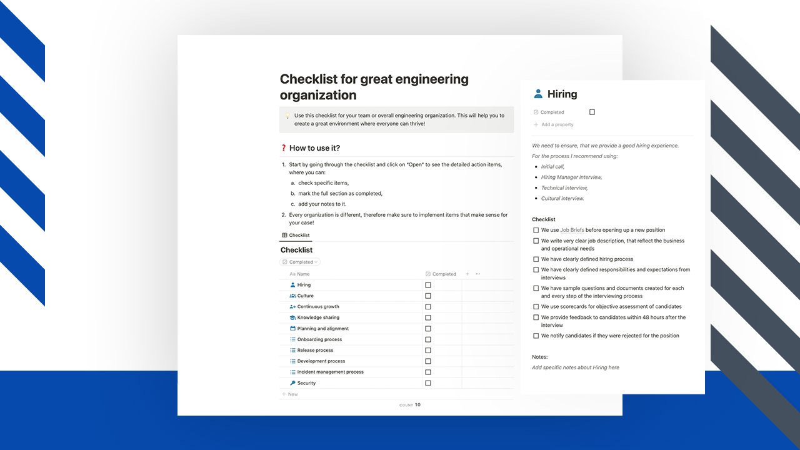
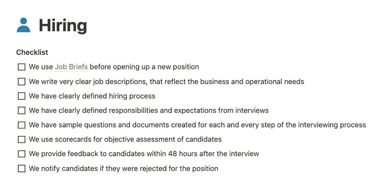
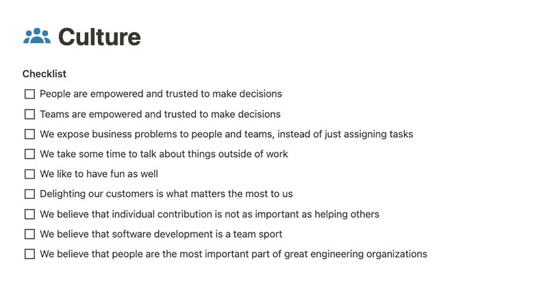
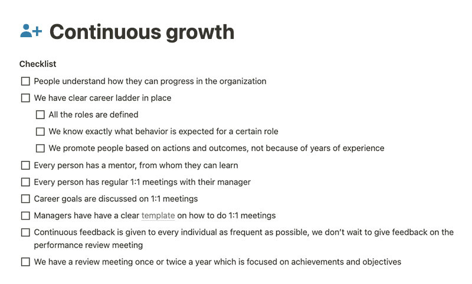
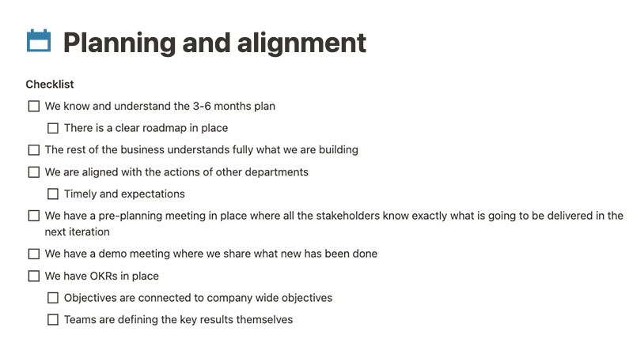
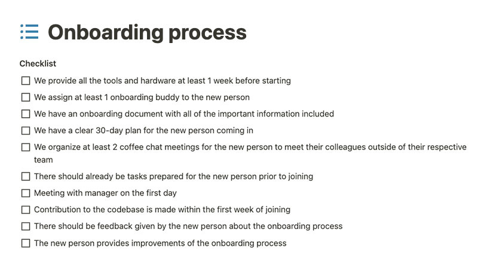
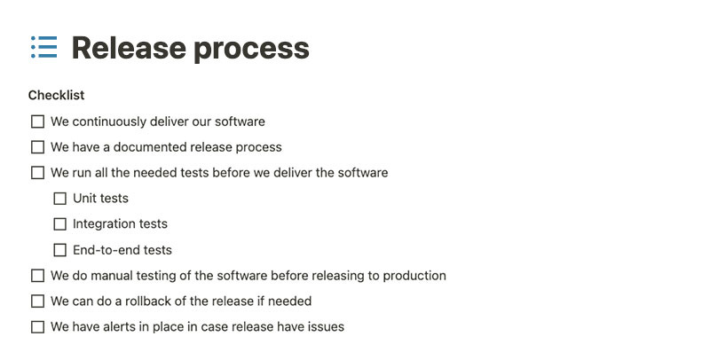
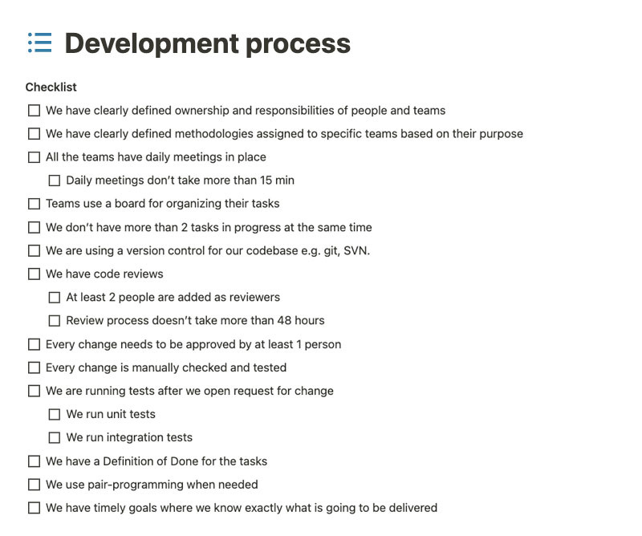
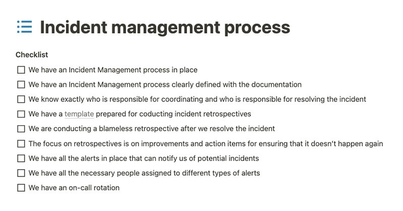
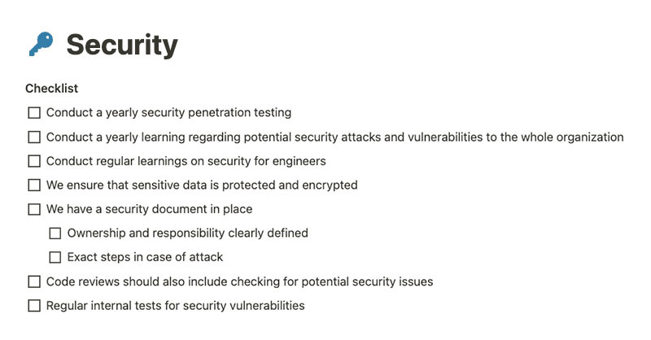

People value environments where they feel like they can grow. It’s really important to not neglect this aspect and regularly provide opportunities for individuals.  

人们非常看重能让他们感到自己可以成长的环境。不要忽视这一点，定期为个人提供机会非常重要。

This is one of many important aspects of a great engineering organization. We’ll dive into a lot more in this article. Let’s start with the why first.  

这是优秀工程组织的众多重要方面之一。我们将在本文中深入探讨更多内容。让我们先从 "为什么 "开始。

A simple answer to that is people can fulfill their full potential if the environment allows them to do that. If the environment is supportive, encouraging, and always providing growth opportunities, people will thrive in it and they will be able to do the best work possible.  

一个简单的答案是，如果环境允许，人们就能充分发挥自己的潜能。如果环境是支持性的、鼓励性的，并始终提供成长机会，那么人们就能在其中茁壮成长，并尽可能地完成最佳工作。

Focusing on making it as best as possible will ensure you have motivated and driven people who are autonomously taking on challenges and resolving them.  

专注于尽可能做到最好，将确保您拥有积极主动、有干劲的员工，他们能够自主地迎接挑战并解决问题。

I’ve created the checklist for you to use in your team or organization. This checklist provides you with a guide on what you should focus on in order to create a great environment where everyone can thrive.  

我制作了一份清单，供你在团队或组织中使用。这份清单为您提供了一份指南，告诉您应该重点关注哪些方面，以营造一个人人都能茁壮成长的良好环境。

It works for organizations with multiple teams or smaller organizations. You can also use this just for a specific team that is part of the bigger organization as well.  

它适用于拥有多个团队或规模较小的组织。您也可以将其仅用于隶属于大组织的特定团队。

You can find the FREE Notion Template: Checklist for Great Engineering Organization below.  

您可以找到免费的 Notion 模板：优秀工程组织核对表

[I want this! 我想要这个](https://gregorojstersek.gumroad.com/l/notion-template-checklist-for-great-engineering-organization)

We need to ensure we have a good hiring experience. It’s the first impression we are making on potential candidates. For the process, I recommend using:  

我们需要确保良好的招聘体验。这是我们给潜在候选人留下的第一印象。在这个过程中，我建议使用

-   Initial call, 首次通话、
    
-   Hiring Manager interview,  
    
    招聘经理面试、
    
-   Technical interview, 技术面试、
    
-   Cultural interview. 文化访谈。
    

Job Briefs are really important so that we understand what we really want. Clear job descriptions and a very well-defined hiring process will help a lot as well.  

职位简介非常重要，这样我们才能了解我们真正想要的是什么。清晰的职位描述和非常明确的招聘流程也会有很大帮助。

Sample questions and scorecards can make it a lot easier for people to be objective.  

样题和记分卡可以让人们更容易做到客观。

Let’s make sure we provide feedback as soon as possible. We should not reject the candidate without telling them  

让我们确保尽快提供反馈。我们不应在未告知候选人的情况下拒绝他们

Having a culture of continuous learning and helping each other can do wonders. It all starts with empowerment and trust and ensuring that we expose business problems instead of just giving tasks.  

拥有持续学习和互相帮助的文化可以创造奇迹。这一切都始于授权和信任，并确保我们揭示业务问题，而不仅仅是下达任务。

We need to make sure that we also take some time to talk about things outside of work and have fun as well.  

我们需要确保我们也能抽出一些时间来谈论工作以外的事情，并从中获得乐趣。

Delighting our customers should matter most to us, and we should value helping others a lot more than individual contribution.  

让客户满意对我们来说应该是最重要的，我们应该把帮助他人看得比个人贡献更重要。

We need to understand that software development is a team sport and people are the most important part of an engineering organization.  

我们需要明白，软件开发是一项团队运动，而人是工程组织中最重要的部分。

People love to be part of organizations where they feel like they can grow.  

人们喜欢加入自己觉得可以成长的组织。

I recommend having bi-weekly 1:1 meetings that are focused on growth, improvements, and giving feedback.  

我建议每两周召开一次 1:1 会议，重点讨论成长、改进和反馈。

In order we can provide growth opportunities, it’s really important to define the career ladder first. All the roles should be clearly defined, so that everyone knows exactly what behavior is expected to move to the desired role.  

为了提供发展机会，首先必须明确职业发展阶梯。所有角色都应明确界定，以便每个人都清楚地知道，要想晋升到理想的角色，需要具备哪些行为。

Sharing knowledge between people is extremely important and should not be neglected. If someone has learned something new and they share it with others, we all learn from it!  

人与人之间的知识共享极其重要，不容忽视。如果有人学到了新知识并与他人分享，我们都会从中受益！

Creating internal documentation is a also great way to share knowledge between us. This could be either:  

创建内部文档也是我们之间分享知识的好方法。这可以是

-   documentation of our tools,  
    
    我们的工具文档、
    
-   documentation of issues, 记录问题、
    
-   technical specifications,  
    
    技术规格、
    
-   style guides and guidelines.  
    
    风格指南和准则。
    

It’s also really great to have regular events like hackathons or internal presentations.  

定期举办黑客马拉松或内部演讲等活动也非常好。

To build the RIGHT things it’s important to have clear planning and alignment with the rest of the business.  

要打造正确的产品，必须有明确的规划，并与其他业务保持一致。

I recommend: 我推荐

-   understanding the overall plan for at least 3-6 months ahead of time  
    
    至少提前 3-6 个月了解总体计划
    
-   involving all of the stakeholders as early and often as possible  
    
    让所有利益相关者尽早和经常参与进来
    

The onboarding experience should be as straightforward as possible. The goal is to get the new person onboarded and productive as fast as possible.  

入职体验应尽可能简单明了。目标是让新人尽快入职并提高工作效率。

I recommend providing all the necessary tooling and hardware at least 1 week before starting. Having a good onboarding plan can make a big difference, therefore spending your time on it is time well spent.  

我建议至少在开始前一周提供所有必要的工具和硬件。制定一个好的入职计划可以带来很大的不同，因此，花在这上面的时间是值得的。

The release process needs to be as fast as it can be and also reversible.  

释放过程必须尽可能快，并且是可逆的。

I recommend using tools like GitHub Actions or CircleCI to ensure you have a stable release process in place.  

我建议使用 GitHub Actions 或 CircleCI 等工具来确保您有一个稳定的发布流程。

It’s also really important to not forget to do quality assurance of your software. Running automated tests before delivering can make a big difference.  

同样重要的是，不要忘记对软件进行质量保证。在交付前运行自动测试可以带来很大的不同。

The development process should be as clear as possible, people should not second guess themselves if something is right or wrong.  

开发过程应尽可能清晰明了，人们不应再去猜测某件事情的对错。

I recommend: 我推荐

-   using Kanban for more operational teams and  
    
    为更多业务团队使用看板，以及
    
-   using Scrum for more product-oriented teams,  
    
    为更多以产品为导向的团队使用 Scrum、
    
-   Every team uses a board with columns: To Do, In Progress, In Review, Done  
    
    每个团队都使用一块黑板，黑板上有几栏：待办、进行中、回顾中、已完成
    
-   Sprints that are 2 weeks long  
    
    为期两周的冲刺
    

A great Incident Management process is very important to ensure in case of emergencies, we get back to normal as soon as possible.  

完善的事件管理流程非常重要，可确保在紧急情况下尽快恢复正常。

I recommend having a: 我建议

-   clearly defined process with responsibilities and ownership defined,  
    
    明确界定流程，明确责任和所有权、
    
-   blameless retrospective after every Incident,  
    
    每次事件发生后都要进行无责追溯、
    
-   alert system in place e.g. Pagerduty.  
    
    警报系统，如 Pagerduty。
    

Security should not be neglected and should be a big focus point in ensuring that our software is stable and as resilient as possible.  

安全问题不容忽视，应该成为确保我们的软件稳定和尽可能具有弹性的一大重点。

I recommend: 我推荐

-   conducting at least yearly security penetration testings with an external company which is their main expertise.  
    
    至少每年与一家外部公司进行一次安全渗透测试，这是他们的主要专长。
    
-   organizing yearly courses regarding potential security attacks and vulnerabilities to the whole organization.  
    
    每年为整个组织举办有关潜在安全攻击和漏洞的课程。
    

[Paulo André](https://www.linkedin.com/in/paulorlandre/) mentioned this on my yesterday's LinkedIn post: It’s a big difference if you are working IN your organization or ON your organization.  

保罗-安德烈（Paulo André）在我昨天的 LinkedIn 帖子中提到了这一点：你是在组织内部工作，还是在组织外部工作，区别很大。

As an engineering leader, you should be working a lot more ON your organization and ensure that you make others around you better.  

作为工程领导者，你应该在组织中发挥更大的作用，并确保让周围的人变得更好。

Liked this article? Make sure to 💙 click the like button.  

喜欢这篇文章吗？请务必 💙 点击 "喜欢 "按钮。

Feedback or addition? Make sure to 💬 comment.  

反馈或补充？请务必发表💬评论。

Know someone that would find this helpful? Make sure to 🔁 share this post.  

您知道这篇文章对您有帮助吗？请务必 🔁 分享本帖。

You can find me on [LinkedIn](https://www.linkedin.com/mynetwork/discovery-see-all/?usecase=PEOPLE_FOLLOWS&followMember=gregorojstersek) or [Twitter](https://twitter.com/gregorojstersek).  

您可以在 LinkedIn 或 Twitter 上找到我。

If you wish to make a request on particular topic you would like to read, you can send me an email to info@gregorojstersek.com.  

如果您想就您想阅读的特定主题提出要求，可以给我发电子邮件至 info@gregorojstersek.com。

This is the Engineering Leadership newsletter. Subscribe or upgrade to paid and receive weekly articles directly to your inbox!  

这是工程领导力时事通讯。订阅或升级为付费用户，可直接在收件箱中接收每周文章！

You are more than welcome to find whatever interests you here and try it out in your particular case. Let me know how it went! Topics are normally about leadership, management, all things engineering related, developing scalable products, building teams etc.  

我们非常欢迎你在这里找到你感兴趣的东西，并根据你的具体情况进行尝试。让我知道进展如何！主题通常涉及领导力、管理、所有与工程相关的事物、开发可扩展产品、组建团队等。
