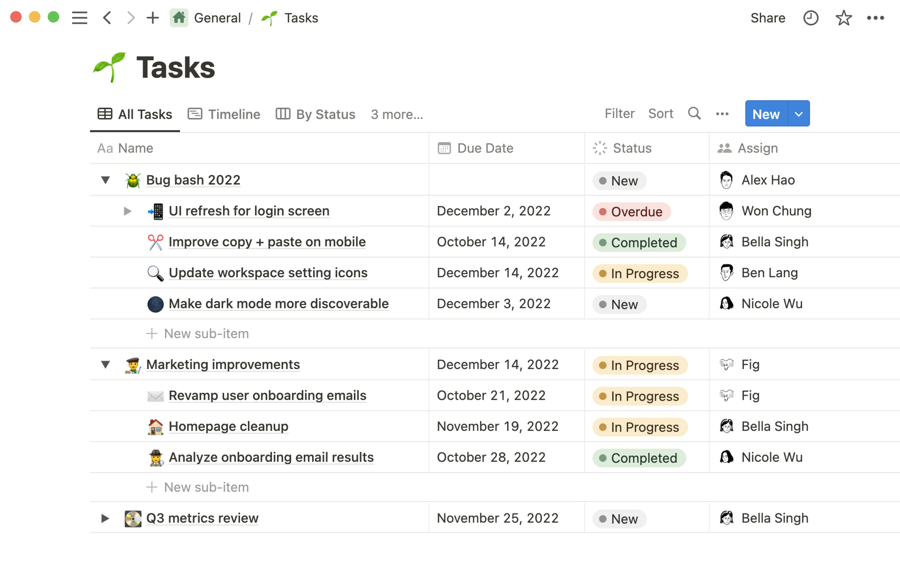
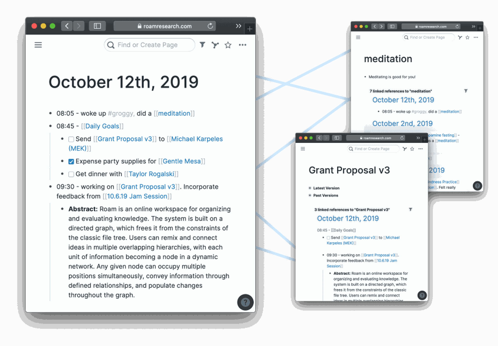

_This is_ Platformer 这是平台游戏_, a newsletter on the intersection of Silicon Valley and democracy from Casey Newton and Zoë Schiffer.  

这是凯西-牛顿（Casey Newton）和佐埃-希弗（Zoë Schiffer）关于硅谷与民主交汇的通讯。_ [_Sign up here 在此注册_](https://www.platformer.news/)_._

Today let’s step outside the news cycle and turn our attention toward a topic I’m deeply invested in but only rarely write about: productivity platforms. For decades now, software tools have promised to make working life easier. But on one critical dimension — their ability to improve our thinking — they don’t seem to be making much progress at all.  

今天，让我们跳出新闻的圈子，把目光转向一个我非常关注但却很少写的话题：生产力平台。几十年来，软件工具一直承诺让工作生活更轻松。但在一个关键方面，即提高我们的思维能力方面，它们似乎并没有取得多大进展。

Meanwhile, the arrival of generative artificial intelligence could make the tools we use more powerful than ever — or they could turn out to be just another mirage.  

与此同时，生成式人工智能的到来可能使我们使用的工具比以往任何时候都更加强大，也可能使它们变成另一个海市蜃楼。

To understand where things went wrong, I want to focus on the humble note-taking app: the place where, for so many of us, thinking begins.  

要了解问题出在哪里，我想重点谈谈不起眼的记事应用程序：对我们许多人来说，思考是从这里开始的。

**I.**

Earlier this week I read a story about farmers. “America’s Farmers Are Bogged Down by Data,” read the headline on [Belle Lin’s story](https://www.wsj.com/articles/americas-farmers-are-bogged-down-by-data-524f0a4d) in the _Wall Street Journal_. I thought to myself: _You and me both, farmer!_ And I read the piece.  

本周早些时候，我读到一篇关于农民的报道。华尔街日报》上林蓓蕾报道的标题是："美国农民被数据所困"。我心想：你和我都是农民！我又读了这篇报道。

Over the past decade, farmers have been offered all manner of software tools to analyze and manage their crops.  

在过去十年中，农民们获得了各种软件工具来分析和管理他们的作物。 In general, though, the more software that farmers use, the more they find themselves overwhelmed by data that the tools collect. “We’re collecting so much data that you’re almost paralyzed with having to analyze it all,” one farmer told the _Journal_.  

不过，一般来说，农民使用的软件越多，他们就越发现自己被这些工具收集的数据压得喘不过气来。"一位农民告诉《日刊》："我们收集的数据太多了，要对所有数据进行分析，你几乎要瘫痪了。

As a journalist, I’ve never collected as much data as I do now. The collapse of Twitter has me browsing four or five text-based social feeds a day, scanning for news and thoughtful conversation. The growing popularity of arXiv and pre-prints in general has left me with a stack of research that I will never get through. Book galleys pile up in my house.  

作为一名记者，我从未像现在这样收集大量数据。Twitter 的崩溃让我每天都要浏览四五个基于文本的社交源，扫描新闻和有思想的对话。arXiv 和预印本的日益普及让我堆满了永远也读不完的研究报告。书架上的书堆积如山。

A screenshot of the app Notion.

Image: Notion  

应用程序 Notion 的截图。图片Notion

Meanwhile, all day long I browse the web. Stories that might belong in _Platformer_ get saved into a database in the productivity platform Notion. Every link that has ever been in this newsletter is stored there, in many cases with the full article text.  

与此同时，我整天都在浏览网页。可能属于 Platformer 的故事会被保存到生产力平台 Notion 的数据库中。本通讯中出现过的每一个链接都保存在这里，很多时候还附有文章全文。

Collectively, this material offers me an abundance of riches — far more to work with than any beat reporter had such easy access to even 15 years ago.  

总之，这些材料为我提供了丰富的素材--即使在 15 年前，我也无法如此轻易地接触到如此多的素材。

And yet most days I find myself with the same problem as the farmer: I have so much information at hand that I feel paralyzed.  

然而，大多数时候，我发现自己遇到了和农夫一样的问题：我手头的信息太多了，以至于我感到瘫痪。

**II.**

One solution to this data paralysis is to take notes. As a journalist, of course, I have always taken notes. A few years ago, I thought we had seen some true breakthroughs in note-taking, and increasingly put my faith in those tools not just to capture my writing but to improve the quality of my thinking.  

解决数据瘫痪的一个办法就是做笔记。当然，作为一名记者，我一直在做笔记。几年前，我以为我们已经在笔记方面取得了一些真正的突破，并越来越相信这些工具不仅能记录我的写作，还能提高我的思维质量。

The breakthrough tool was [Roam Research](https://roamresearch.com/). In 2021, I wrote here about [my first year using the subscription-based software](https://www.platformer.news/p/notes-on-a-year-using-roam-research), which had two key insights into knowledge work. One was to make professional note-taking feel more like journaling. It turns out that a fresh note created each day, labeled with a date, is a good canvas for collecting transient thoughts, which can serve as a springboard into deeper thinking.  

这个突破性的工具就是 Roam Research。2021 年，我在这里写下了我第一年使用这款基于订阅的软件的经历，它对知识工作有两个重要的启示。一个是让专业笔记更像日记。事实证明，每天创建一个标有日期的新笔记，是收集短暂想法的良好画布，可以作为深入思考的跳板。

The second is known to note-taking nerds as “[bidirectional linking](https://maggieappleton.com/bidirectionals).” Standard links, like the ones you find on the web, go in only one direction — from one page to another. In a note-taking app, bidirectional links join two pages together. This effectively lets you add backlinks to any concept — a company that’s important to you, say, or a concept that’s on your mind — and then let you browse everything you’ve collected related to that concept at your leisure.  

第二种被记笔记的书呆子称为 "双向链接"。标准链接，比如你在网上找到的链接，只有一个方向--从一个页面到另一个页面。在笔记应用中，双向链接将两个页面连接在一起。这可以有效地让你为任何概念添加反向链接--比如说对你很重要的公司，或者你脑海中的某个概念--然后让你随意浏览你收集到的与该概念相关的所有内容。

A graphic from Roam illustrating bidirectional linking.

Image: Roam  

Roam 提供的双向链接图。图片：Roam漫游

On one level, that’s not so different from adding tags to notes. But tags are more about search. Bidirectional links, which some apps show you on pages that include snippets of all the other notes that contain the same link, are more about browsing and rediscovery.  

从某种程度上说，这与在笔记中添加标签并无太大区别。但标签更偏重于搜索。而双向链接（某些应用程序会在页面上显示包含相同链接的所有其他笔记的片段）则更多地与浏览和重新发现有关。

Initially, I threw myself into this kind of associative note-taking. I gathered links around concepts I wanted to explore (“the internet enables information to travel too quickly,” for example, or social networks and polarization). When I had an interesting conversation with a person, I would add notes to a personal page I had created for them. A few times a week, I would revisit those notes.  

起初，我把自己投入到这种联想笔记中。我围绕自己想探讨的概念收集链接（比如 "互联网让信息传播得太快"，或者社交网络和两极分化）。当我与某个人进行了有趣的对话时，我会在为他们创建的个人页面上添加笔记。每周我会重温几次这些笔记。

I waited for the insights to come.  

我等待着洞察力的到来。

And waited. And waited. 等待一直等

Note-taking apps are up against a much stronger foe  

记事应用面临更强大的敌人

My gusto for concept-based, link-heavy note-taking diminished. Roam’s development slowed to a crawl, and I spent a season with the lightweight, mostly free alternative known as [Obsidian](https://obsidian.md/). Obsidian’s brutalist design wore on me, though, and eventually I decamped for the more polished user interface of [Mem](https://get.mem.ai/). (These apps all enable the exporting of your notes in Markdown, making switching relatively painless.)  

我对基于概念、链接繁多的记事本的热情逐渐减退。Roam 的开发速度越来越慢，我花了一个季度的时间来使用轻量级、基本免费的替代软件 Obsidian。不过，黑曜石的野蛮设计让我感到厌倦，最终我选择了用户界面更精致的 Mem（这些应用都能以 Markdown 格式导出笔记，因此切换起来相对简单）。

I continue to journal most days, and occasionally find myself working to refine one concept or another among those notes.  

我每天都坚持写日记，偶尔会发现自己正在努力完善笔记中的某个概念。

But the original promise of Roam — that it would improve my thinking by helping me to build a knowledge base and discover new ideas — fizzled completely.  

但是，Roam 最初的承诺--通过帮助我建立知识库和发现新想法来改善我的思维--完全泡汤了。

**III.**

One interpretation of these events is that the software failed: that journaling and souped-up links simply don’t have the power some of us once hoped they did.  

对这些事件的一种解释是，软件失败了：日志和经过改进的链接根本没有我们中的一些人曾经希望的那样强大。

Another view, though, is that they are up against a much stronger foe — the infinite daily distractions of the internet.  

不过，另一种观点认为，他们的敌人要强大得多，那就是每天无穷无尽的网络干扰。

Note-taking, after all, does not take place in a vacuum. It takes place on your computer, next to email, and Slack, and Discord, and iMessage, and the text-based social network of your choosing. In the era of alt-tabbing between these and other apps, our ability to build knowledge and draw connections is permanently challenged by what might be our ultimately futile efforts to multitask.  

毕竟，记笔记不是在真空中进行的。它发生在你的电脑上，与电子邮件、Slack、Discord、iMessage 和你选择的基于文本的社交网络为邻。在这些应用和其他应用之间切换的时代，我们积累知识和建立联系的能力受到了长期的挑战，而我们为完成多任务所做的努力最终可能是徒劳的。

Ezra Klein wrote beautifully about this situation this week [in the _New York Times_](https://www.nytimes.com/2023/05/28/opinion/artificial-intelligence-thinking-minds-concentration.html):  

本周，埃兹拉-克莱因（Ezra Klein）在《纽约时报》上对这种情况进行了精彩的描述：

> Gloria Mark, a professor of information science at the University of California, Irvine, and the author of “[Attention Span](https://www.harpercollins.com/products/attention-span-gloria-mark?variant=40346590117922),” started researching the way people used computers in 2004.  
> 
> 加利福尼亚大学欧文分校信息科学教授、《注意力跨度》一书的作者格洛丽亚-马克从 2004 年开始研究人们使用电脑的方式。 The average time people spent on a single screen was 2.5 minutes. “I was astounded,” she told me. “That was so much worse than I’d thought it would be.” But that was just the beginning.人们在一个屏幕上停留的平均时间为 2.5 分钟。"我很震惊，"她告诉我。"这比我想象的要糟糕得多。"但这仅仅是个开始。 By 2012, Mark and her colleagues found the average time on a single task was 75 seconds.  
> 
> 到 2012 年，马克和她的同事发现，完成一项任务的平均时间为 75 秒。 Now it’s down to about 47.  
> 
> 现在只剩 47 个了。
> 
> This is an acid bath for human cognition.  
> 
> 这是对人类认知的一次酸洗。 Multitasking 多任务处理 is mostly a myth. We can focus on one thing at a time.多半是个神话。我们可以一次只专注于一件事。 “It’s like we have an internal whiteboard in our minds,” Mark said.  
> 
> "马克说："我们的脑海中就像有一块内部白板。 “If I’m working on one task, I have all the info I need on that mental whiteboard. Then I switch to email."如果我正在处理一项任务，我就会在心理白板上输入我需要的所有信息。然后我再切换到电子邮件。 I have to mentally erase that whiteboard and write all the information I need to do email.我必须在脑海中擦掉白板，写下所有我需要的电子邮件信息。 And just like on a real whiteboard, there can be a residue in our minds.就像在真正的白板上一样，我们的脑海中也会有残留物。 We may still be thinking of something from three tasks ago.”  
> 
> 我们可能还在想着三项任务之前的事情。"

My first thought upon reading this was that it seems rare for me to spend even 47 seconds looking at one screen on my computer without at least glancing at another. (I bought a 38-inch widescreen monitor for the express purpose of being able to glance at many windows simultaneously. At the time I understood this as a tool for _enhancing_ my productivity.)  

我读到这篇文章后的第一个想法是，我似乎很少会花哪怕 47 秒钟看电脑上的一个屏幕，而不至少瞥一眼另一个屏幕。(我买 38 英寸宽屏显示器的明确目的就是为了能够同时浏览多个窗口。当时我认为这是提高工作效率的一种工具）。

My second thought is that if you want to take good notes, you have to first extract your mind from the acid bath.  

我的第二个想法是，如果你想做好笔记，就必须先把自己的思想从酸水浴中抽离出来。

**IV.**

Klein’s piece starts from the observation that productivity growth is now about half of what it was in the 1950s and ‘60s. The internet’s arrival briefly speeded it up, he writes, but the more we stared at our screens the slower our productivity improved. He worries that AI will have a similar effect on the economy — promising to make us more productive, while simultaneously inventing so many new distractions and entertainments that they overwhelm and paralyze us.  

克莱因在文章中首先指出，现在的生产率增长只有上世纪五六十年代的一半左右。他写道，互联网的出现曾短暂地加快了生产力的增长，但我们越是盯着屏幕，生产力提高的速度就越慢。他担心，人工智能也会对经济产生类似的影响--一方面有望提高我们的生产力，另一方面又会发明出如此之多的新的分心和娱乐活动，以至于让我们不堪重负，陷入瘫痪。

The piece stuck with me, because there is one specific way I am counting on AI to make me more productive. It goes back to that database of links I’ve been building in Notion, and the insights I was hoping to get out of Roam.  

这篇报道让我记忆犹新，因为有一种具体的方式，我正指望人工智能来提高我的工作效率。这又回到了我在 Notion 中建立的链接数据库，以及我希望从 Roam 中获得的见解。

Saving an article in Mem.

Image: Mem  

在 Mem. Image：备忘录

Earlier this year, like many productivity tools, Notion added a handful of AI features. I use two of them in my links database. One extracts the names of any companies mentioned in an article, creating a kind of automatic tagging system. The other provides a two- or three-sentence summary of the article I’m saving.  

今年早些时候，和许多生产力工具一样，Notion 也添加了一些人工智能功能。我在我的链接数据库中使用了其中两项。一个是提取文章中提到的公司名称，创建一种自动标记系统。另一项功能是为我保存的文章提供两到三句话的摘要。

Neither of these, in practice, is particularly useful. Tags might theoretically be useful for revisiting old material, but databases are not designed to be browsed. And while we publish summaries of news articles in each edition of _Platformer_, we wouldn’t use AI-written summaries: among other reasons, they often miss important details and context.  

实际上，这两者都不是特别有用。从理论上讲，标签可能对重温旧资料有用，但数据库并不是为浏览而设计的。虽然我们在每期《Platformer》中都会发布新闻文章的摘要，但我们不会使用人工智能编写的摘要：原因之一是它们往往会遗漏重要的细节和背景。

At the same time, the database contains nearly three years of links to every subject I cover here, along with the complete text of thousands of articles. It is here, and not in a note-taking app, that knowledge of my beat has been accreting over the past few years. If only I could access that knowledge in some way that went beyond my memory.  

与此同时，数据库还包含了近三年来我在这里报道的每个主题的链接，以及数千篇文章的全文。正是在这里，而不是在记事应用程序中，过去几年来，我的节拍知识不断积累。如果我能以某种超越记忆的方式获取这些知识就好了。

It’s here that AI should be able to help. Within some reasonable period of time, I expect that I will be able to talk to my Notion database as if it’s ChatGPT. If I could, I imagine I would talk to it all the time.  

在这方面，人工智能应该能帮上忙。我希望在一段合理的时间内，我能像使用 ChatGPT 一样与我的 Notion 数据库对话。如果可以，我想我会一直与它对话。

Much of journalism simply involves remembering relevant events from the past. An AI-powered link database has a perfect memory; all it’s missing is a usable chat interface. If it had one, it might be a perfect research assistant.  

新闻业的许多工作都是为了记住过去的相关事件。人工智能驱动的链接数据库拥有完美的记忆力，它所缺少的只是一个可用的聊天界面。如果有了聊天界面，它也许会成为一个完美的研究助手。

Today’s chatbots can’t do any of this to a reporter’s standard  

如今的聊天机器人无法按照记者的标准完成这些工作

I imagine using it to generate little briefing documents to help me when I return to a subject after some time away. _Catch me up on Canada’s fight with Meta over news_, I might say. _Make me a timeline of events at Twitter since Elon Musk bought it_. _Show me coverage of deepfakes over the past three months_.  

我想象着用它来生成一些小的简报文件，以便在我离开一段时间后重新回到某个主题时为我提供帮助。我可以说，让我了解加拿大与 Meta 在新闻方面的斗争。为我制作伊隆-马斯克收购推特后的大事年表。给我看过去三个月里关于深度伪造的报道。

Today’s chatbots can’t do any of this to a reporter’s standard. The training data often stops in 2021, for one thing. The bots continue to make stuff up, and struggle to cite their sources.  

如今的聊天机器人无法达到记者的标准。首先，训练数据往往在 2021 年就停止了。这些机器人会继续胡编乱造，而且很难引用消息来源。

But if I could chat in natural language with a massive archive, built from hand-picked trustworthy sources? That seems powerful to me, at least in the abstract.  

但是，如果我可以用自然语言与一个庞大的档案库聊天，而这个档案库是由精心挑选的可信资料来源建立的？在我看来，至少抽象地说，这很强大。

Of course, the output from this kind of AI tool has to be trustworthy. A significant problem with using AI tools to summarize things is that you can’t trust the summary unless you read all the relevant documents yourself — defeating the point of asking for a summary in the first place.  

当然，这种人工智能工具的输出结果必须值得信赖。使用人工智能工具进行总结的一个重要问题是，除非你自己阅读了所有相关文件，否则就无法相信总结，这就失去了要求总结的初衷。

Still, if you are the sort of productivity-tool optimist who will try any to-do list or calendar app on the off chance it makes you even a little happier at work, it seems to me that a database you can talk to might be the next-generation note-taking tool we have been waiting for.  

不过，如果你是那种生产力工具的乐观主义者，愿意尝试任何待办事项列表或日历应用程序，只要它能让你工作得更开心一些，那么在我看来，一个可以与你对话的数据库可能就是我们期待已久的下一代笔记工具。

**V.**

I’ve learned something else about note-taking apps, though, since my mania for them began in 2020.  

不过，自从 2020 年我开始狂热地使用笔记应用程序以来，我对它们有了一些新的认识。

In short: it is probably a mistake, in the end, to ask software to improve our thinking. Even if you can rescue your attention from the acid bath of the internet; even if you can gather the most interesting data and observations into the app of your choosing; even if you revisit that data from time to time — this will not be enough. It might not even be worth trying.  

简而言之：归根结底，要求软件来改进我们的思维可能是一个错误。即使你能把自己的注意力从互联网的酸液中解救出来；即使你能把最有趣的数据和观察结果收集到你选择的应用程序中；即使你不时地重温这些数据--这也是不够的。甚至可能根本不值得尝试。

I’ll admit to having forgotten those questions over the past couple years  

我承认在过去的几年里，我已经忘记了这些问题

The reason, sadly, is that thinking takes place in your brain. And thinking is an active pursuit — one that often happens when you are spending long stretches of time staring into space, then writing a bit, and then staring into space a bit more. It’s here here that the connections are made and the insights are formed. And it is a process that stubbornly resists automation.  

可悲的是，原因在于思考是在大脑中进行的。而思考是一种积极的追求--往往发生在你长时间凝视太空，然后写点东西，再凝视太空的时候。正是在这里建立了联系，形成了见解。这是一个顽固抵制自动化的过程。

Which is not to say that software can’t help. Andy Matuschak, a researcher whose [spectacular website](https://notes.andymatuschak.org/%C2%A7Note-writing_systems) offers a feast of thinking about notes and note-taking, observes [that note-taking apps emphasize displaying and manipulating notes, but never making sense _between_ them](https://notes.andymatuschak.org/%C2%A7Note-writing_systems?stackedNotes=zsRuFxYgckGS81tr2eiBAP).这并不是说软件帮不上忙。安迪-马图夏克（Andy Matuschak）是一位研究人员，他的网站非常壮观，提供了关于笔记和记笔记的思想盛宴。 Before I totally resign myself to the idea that a note-taking app can’t solve my problems, I will admit that on some fundamental level no one has really tried.  

在我完全接受 "记笔记软件无法解决我的问题 "这一观点之前，我得承认，从根本上说，没有人真正尝试过。

“The goal is not to take notes — the goal is to think effectively,” [Matuschak writes](https://notes.andymatuschak.org/%C2%A7Note-writing_systems?stackedNotes=z8V2q398qu89vdJ73N2BEYCgevMqux3yxQUAC&stackedNotes=z7kEFe6NfUSgtaDuUjST1oczKKzQQeQWk4Dbc). “Better questions are ‘what practices can help me reliably develop insights over time?’ \[and\] ‘how can I shepherd my attention effectively?’”  

"马图沙克写道："我们的目标不是记笔记，而是有效地思考。"更好的问题是'哪些做法可以帮助我长期可靠地形成见解？\[以及'我如何才能有效地引导我的注意力？

I’ll admit to having forgotten those questions over the past couple years as I kept filling up documents with transient strings of text inside expensive software. And I accept that to be a better thinker, I’ll have to devote more time and attention to wrestling with what I find.  

我承认，在过去的几年里，当我在昂贵的软件中不断用一串串短暂的文字填充文档时，我已经忘记了这些问题。我承认，要想成为一个更好的思考者，我必须投入更多的时间和精力来思考我所发现的东西。

If there’s a friendly AI to help me do that, though, I’ll be first in line to try it.  

不过，如果有一个友好的人工智能能帮我做到这一点，我会第一个去尝试。
