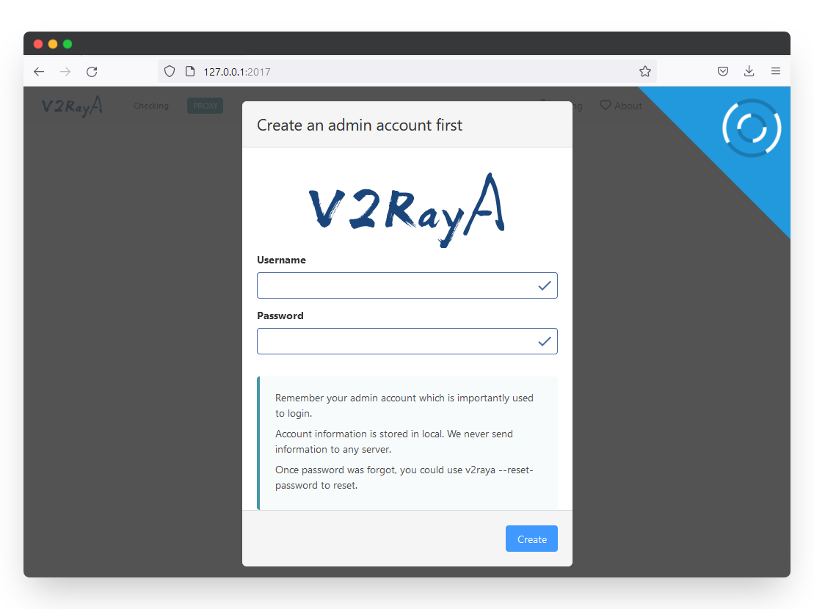
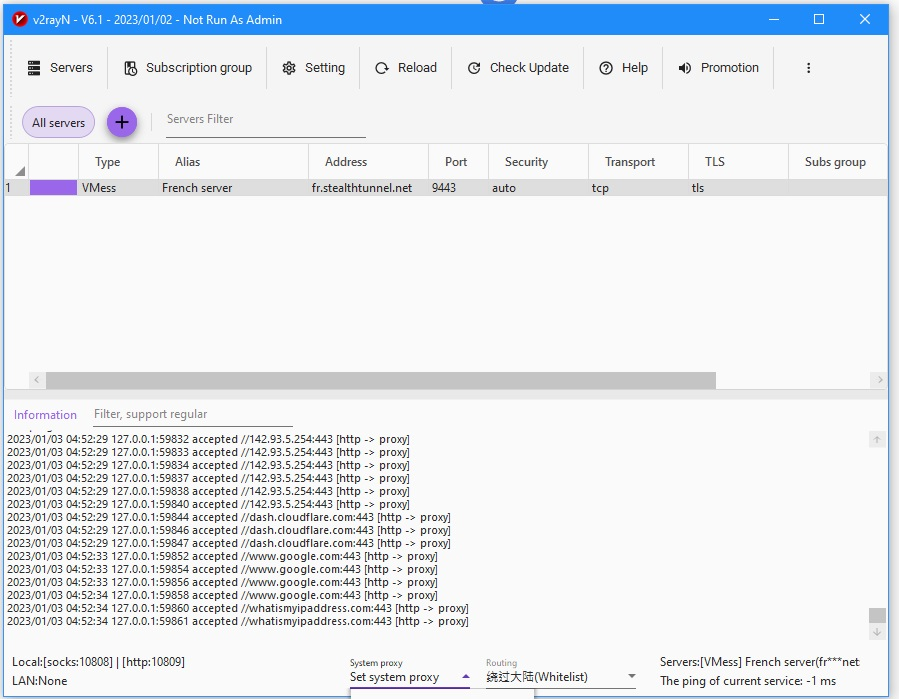
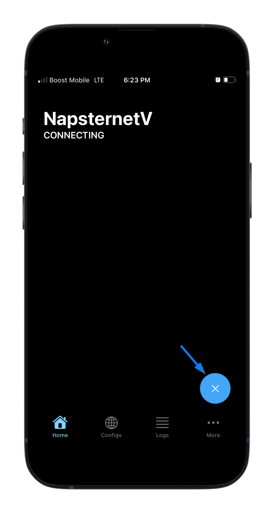
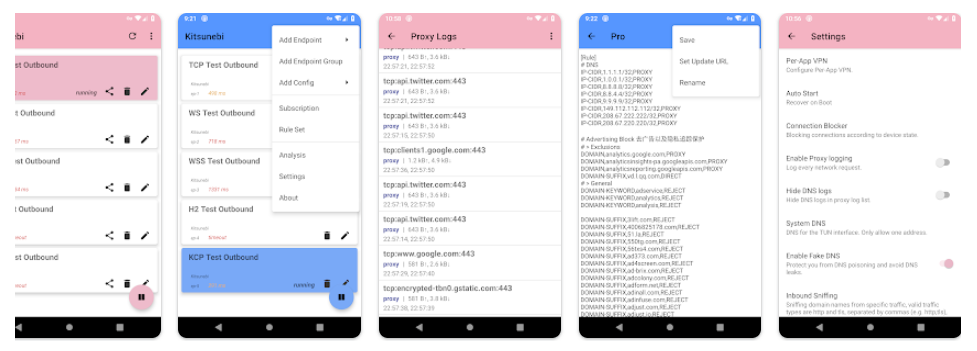

V2ray is a high-performance, flexible, and open-source proxy server that allows users to bypass internet censorship and access blocked websites. The V2ray protocol is designed to provide users with a secure, reliable, and fast connection that is difficult for ISPs to detect and block. It is widely used by people in countries where internet access is restricted or monitored by the government.  

V2ray 是一款高性能、灵活、开源的代理服务器，允许用户绕过互联网审查并访问被屏蔽的网站。V2ray 协议旨在为用户提供安全、可靠、快速的连接，使互联网服务提供商难以发现和封锁。在互联网访问受到限制或政府监控的国家，它被人们广泛使用。

V2ray uses multiple protocols to establish a connection between the client and server. TorGuard's new [Premium Proxy](https://torguard.net/anonymouspremiumproxy.php?ref=blog.torguard.net) plan offers hundreds of V2ray servers including the most popular protocols used:  VMess, VLESS, and Trojan.  

V2ray 使用多种协议在客户端和服务器之间建立连接。TorGuard 的新高级代理计划提供数百个 V2ray 服务器，包括最常用的协议：VMess、VLESS 和 Trojan。

## VMess: VMess：

VMess is a protocol that encrypts network traffic and is used by V2ray to create a secure tunnel between the client and server. It is designed to provide users with a fast and reliable connection that is difficult to detect and block. VMess uses encryption to secure the connection, making it difficult for third parties to intercept or monitor the traffic.  

VMess 是一种对网络流量进行加密的协议，V2ray 使用它在客户端和服务器之间创建安全隧道。它旨在为用户提供快速、可靠且难以检测和阻止的连接。VMess 使用加密技术确保连接安全，使第三方难以拦截或监控流量。

## VLESS: VLESS：

VLESS is a newer protocol that is designed to be even more secure than VMess. It uses a more advanced encryption method and is designed to provide users with a faster and more reliable connection. VLESS is also more efficient in terms of CPU and memory usage, making it ideal for use on low-power devices.  

VLESS 是一种更新的协议，其设计比 VMess 更加安全。它使用更先进的加密方法，旨在为用户提供更快、更可靠的连接。VLESS 的 CPU 和内存使用效率也更高，非常适合在低功耗设备上使用。

## Trojan: 特洛伊木马

Trojan is another protocol that is used by V2ray to establish a connection between the client and server. It is designed to be even more stealthy than VMess and VLESS, making it difficult for ISPs to detect and block. Trojan uses encryption to secure the connection and is often used in conjunction with other protocols to create a more secure and reliable connection.  

木马是 V2ray 用来在客户端和服务器之间建立连接的另一种协议。它的设计比 VMess 和 VLESS 更加隐蔽，使互联网服务提供商难以发现和阻止。Trojan 使用加密技术确保连接安全，通常与其他协议结合使用，以创建更安全可靠的连接。

Now let's take a look at some of the most popular V2ray client apps and review their positive and negative aspects:  

现在，让我们来看看最受欢迎的几款 V2ray 客户端应用程序，并回顾一下它们的正反两方面：

V2rayA is a top choice for those on OpenWRT or Linux  

V2rayA 是使用 OpenWRT 或 Linux 的用户的首选

## V2rayA: V2rayA：

Positives: 优点

-   V2rayA is a simple and easy-to-use client that is suitable for beginners.  
    
    V2rayA 是一款简单易用的客户端，适合初学者使用。
-   It provides users with a clean and modern interface.  
    
    它为用户提供了简洁、现代的界面。
-   V2rayA allows users to easily switch between different protocols and configure advanced settings.  
    
    V2rayA 允许用户在不同协议之间轻松切换，并配置高级设置。
-   It supports both Windows and Linux operating systems.  
    
    它支持 Windows 和 Linux 操作系统。

Negatives: 不利因素

-   V2rayA is not as feature-rich as other V2ray clients.  
    
    V2rayA 的功能不如其他 V2ray 客户端丰富。
-   It may not be suitable for advanced users who require more customization options.  
    
    它可能不适合需要更多自定义选项的高级用户。

## V2rayN: V2rayN：

Positives: 优点

-   V2rayN is a powerful and feature-rich client that is suitable for advanced users.  
    
    V2rayN 是一款功能强大、特性丰富的客户端，适合高级用户使用。
-   It provides users with a wide range of customization options and advanced settings.  
    
    它为用户提供了广泛的自定义选项和高级设置。
-   V2rayN allows users to easily switch between different protocols and configure proxy rules.  
    
    V2rayN 允许用户在不同协议之间轻松切换，并配置代理规则。
-   It supports both Windows and Linux operating systems.  
    
    它支持 Windows 和 Linux 操作系统。

Negatives: 不利因素

-   V2rayN can be overwhelming for beginners and may take some time to learn.  
    
    V2rayN 可能会让初学者不知所措，可能需要一些时间来学习。
-   The interface can be cluttered and difficult to navigate.  
    
    界面可能比较杂乱，难以浏览。

## NapsternetV: NapsternetV：

Positives: 优点

-   NapsternetV is a lightweight and fast client that is suitable for low-power devices.  
    
    NapsternetV 是一款轻量级的快速客户端，适用于低功耗设备。
-   It provides users with a clean and modern interface.  
    
    它为用户提供了简洁、现代的界面。
-   NapsternetV allows users to easily switch between different protocols and configure advanced settings.  
    
    NapsternetV 允许用户在不同协议之间轻松切换，并配置高级设置。
-   It supports both Android and iOS operating systems.  
    
    它支持安卓和 iOS 操作系统。

Negatives: 不利因素

-   NapsternetV may not be as feature-rich as other V2ray clients.  
    
    NapsternetV 的功能可能不如其他 V2ray 客户端丰富。
-   It may not be suitable for advanced users who require more customization options.  
    
    它可能不适合需要更多自定义选项的高级用户。

## Kitsunebi: Kitsunebi：

Positives: 优点

-   Kitsunebi is a powerful and feature-rich client that is suitable for advanced users.  
    
    Kitsunebi 是一款功能强大、特性丰富的客户端，适合高级用户使用。
-   It provides users with a wide range of customization options and advanced settings.  
    
    它为用户提供了广泛的自定义选项和高级设置。
-   Kitsunebi allows users to easily switch between different protocols and configure proxy rules  
    
    Kitsunebi 允许用户在不同协议之间轻松切换，并配置代理规则

As VPN technology continues to evolve, it has become easier than ever for users to download and install various VPN client apps, such as v2ray, from popular app stores like Google Play and the App Store. While this ease of access is undeniably convenient, it is crucial for users to exercise caution when selecting a VPN client app. Pay close attention to the app permissions requested during installation, as some apps may collect more private information than necessary. To ensure your privacy, always opt for a reputable VPN client app that respects your data and only requests the minimum permissions required for its proper functioning. By carefully scrutinizing app permissions, you can maintain control over your personal information and confidently navigate the digital world with a truly private VPN experience.  

随着 VPN 技术的不断发展，用户比以往任何时候都更容易从 Google Play 和 App Store 等流行应用商店下载和安装各种 VPN 客户端应用程序，如 v2ray。不可否认，这种便捷的访问方式非常方便，但用户在选择 VPN 客户端应用程序时务必谨慎。请密切关注安装过程中要求的应用程序权限，因为有些应用程序可能会收集比必要更多的私人信息。为确保您的隐私，请务必选择信誉良好的 VPN 客户端应用程序，它们会尊重您的数据，并只要求其正常运行所需的最低权限。通过仔细检查应用程序的权限，你可以保持对个人信息的控制，并自信地浏览数字世界，获得真正私密的 VPN 体验。

You might also like 您可能还喜欢
