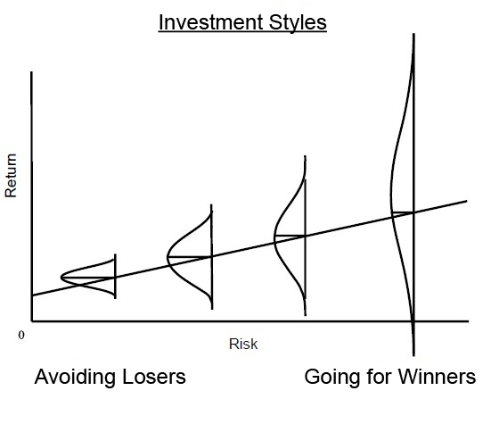

My memos got their start in October 1990, inspired by an interesting juxtaposition between two events. One was a dinner in Minneapolis with David VanBenschoten, who was the head of the General Mills pension fund. Dave told me that, in his 14 years in the job, the fund’s equity return had never ranked above the 27th percentile of the pension fund universe or below the 47th percentile. And where did those solidly second-quartile annual returns place the fund for the 14 years overall? Fourth percentile! I was wowed. It turns out that most investors aiming for top-decile performance eventually shoot themselves in the foot, but Dave never did.  

我的备忘录始于 1990 年 10 月，灵感来自于两个有趣的并列事件。一件是在明尼阿波利斯与通用磨坊公司养老基金负责人戴维-范本斯霍滕（David VanBenschoten）共进晚餐。戴维告诉我，在他任职的 14 年里，该基金的股票回报率从未超过养老基金领域的 27 th 百分位数，也从未低于 47 th 百分位数。那么，在这 14 年中，基金的年度回报率稳居第二四分位，排名第几呢？第四百分位数！我惊呆了。事实证明，大多数投资者都希望取得前十分之一的业绩，但戴夫却没有这样做。

Around the same time, a prominent value investing firm reported terrible results, causing its president to issue an easy rationalization: “If you want to be in the top 5% of money managers, you have to be willing to be in the bottom 5%, too.” My reaction was immediate: “My clients don’t care whether I’m in the top 5% in any single year, and they (and I) have absolutely no interest in me ever being in the bottom 5%.”  

大约在同一时间，一家著名的价值投资公司报告了糟糕的业绩，导致其总裁轻松地提出了合理化建议："如果你想跻身前5%的基金经理行列" "你也必须愿意跻身后5%"我的反应很直接"我的客户并不关心我是否在任何一年都排在前 5%，他们（和我）也绝对不希望我排在后 5%"。

These two events had a strong influence on me and helped define my – and what five years later became Oaktree’s – investment philosophy, which emphasizes risk control and consistency above all. Here’s how I put it 33 years ago in that first memo, titled [_The Route to Performance_](https://www.oaktreecapital.com/docs/default-source/memos/1990-10-12-the-route-to-performance.pdf?sfvrsn=33bc0f65_2):  

这两件事对我影响很大，帮助我确定了自己的投资理念，也就是五年后橡树公司的投资理念。33 年前，我在题为 "业绩之路 "的第一份备忘录中这样写道：

I feel strongly that attempting to achieve a superior long-term record by stringing together a run of top-decile years is unlikely to succeed. Rather, striving to do a little better than average every year – and through discipline to have highly superior relative results in bad times – is:  

我强烈认为，试图通过连续数年排名前十来取得长期的优异成绩是不可能成功的。相反，努力做到每年都比平均水平好一点，并通过自律，在不景气的时候也能取得非常优异的相对成绩，才是成功之道：

-   less likely to produce extreme volatility,  
    
    产生剧烈波动的可能性较小、
    
-   less likely to produce huge losses which can’t be recouped and, most importantly,  
    
    不容易造成无法挽回的巨大损失，最重要的是
    
-   more likely to work (given the fact that all of us are only human).  
    
    更有可能奏效（因为我们都是凡人）。
    

Simply put, what \[General Mills’s\] record tells me is that, in equities, if you can avoid losers (and losing years), the winners will take care of themselves. I believe most strongly that this holds true in my group’s opportunistic niches as well – that the best foundation for above-average long-term performance is an absence of disasters.  

简而言之，\[通用磨坊\]的记录告诉我，在股票市场，如果你能避免亏损（和亏损年份），赢家会自己照顾自己。我坚信，这一点在我的集团的机会主义利基市场中也同样适用--长期业绩高于平均水平的最佳基础就是没有灾难。

**As you can see, my dinner with Dave was a seminal event; his approach was clearly the one for me.** (Incidentally, I want to share that after decades of not having been in touch, Dave was among the many kind people who wrote in recent months to encourage me vis-à-vis my health issue. This is a great example of the many personal dividends my career has paid.)  

如你所见，我与戴夫的晚餐是一次开创性的活动；他的方法显然是适合我的。(顺便说一句，我想告诉大家，在几十年没有联系之后，戴夫是最近几个月写信鼓励我解决健康问题的许多好心人之一。这是我的职业生涯所带来的许多个人红利的一个很好的例子）。

Putting It in Brief 简要介绍

That first memo, and the bit cited above, include a phrase you’ve likely heard from Oaktree: **If we avoid the losers, the winners will take care of themselves.** My partners and I considered this phrase so fitting that we adopted it as our motto when Oaktree was formed in 1995. Our reasoning was simple: If we invest in a diversified portfolio of bonds and are able to avoid the ones that default, some of the non-defaulters we buy will benefit from positive events, such as upgrades and takeovers. That is, the winners will materialize without our having explicitly sought them out.  

第一份备忘录和上面引用的内容中，有一句话你很可能从橡树公司听过：如果我们避开失败者，成功者会自己照顾自己。我和我的合伙人认为这句话非常贴切，因此在 1995 年 Oaktree 成立之初，我们就把它作为我们的座右铭。我们的理由很简单：如果我们投资于多样化的债券组合，并能避免债券违约，那么我们购买的一些非违约债券就会从升级和收购等积极事件中获益。也就是说，赢家会在我们没有明确寻找的情况下出现。

We thought that phrase was innovative. But in 2005, while working with Seth Klarman to update the 1940 edition of Benjamin Graham and David Dodd’s _Security Analysis_ – the “bible of value investing” – I read something that indicated we were late by about 50 years. In the section Seth asked me to edit, I came across Graham and Dodd’s description of “fixed-value” (or fixed-income) investing as “a negative art.” What did they mean?  

我们认为这句话很有创意。但在 2005 年，当我与塞斯-克拉曼（Seth Klarman）合作更新本杰明-格雷厄姆（Benjamin Graham）和大卫-多德（David Dodd）的《证券分析》（Security Analysis）--"价值投资的圣经"--1940 年版时，我读到了一些东西，表明我们晚了大约 50 年。在塞斯让我编辑的章节中，我看到格雷厄姆和多德将 "固定价值"（或固定收入）投资描述为 "一门消极的艺术"。他们是什么意思？

At first, I found their observation cynical, but then I realized what they were saying. Let’s assume there are one hundred 8% bonds outstanding. Let’s further assume that ninety will pay interest and principal as promised and ten will default. Since they’re all 8% bonds, all the ones that pay will deliver the same 8% return – it doesn’t matter which ones you bought. The only thing that matters is whether you bought any of the ten that defaulted. In other words, bond investors improve their performance not through what they buy, but through what they exclude – not by finding winners, but by avoiding losers. There it is: a negative art.  

起初，我觉得他们的观点很愤世嫉俗，但后来我明白了他们的意思。假设有 100 8%的债券尚未偿还。再假设有九十张会按承诺支付利息和本金，有十张会违约。既然都是 8%的债券，那么所有支付利息的债券都会带来相同的 8%回报--你买了哪种债券并不重要。唯一重要的是，你是否买了十张违约债券中的任何一张。换句话说，债券投资者不是通过买什么来提高业绩，而是通过排除什么来提高业绩--不是通过寻找赢家，而是通过避免输家。这就是：一种消极的艺术。

One more anecdote concerning the origin of the phrase: I’ve always been interested in old books. A few years ago, while walking through a Las Vegas convention center on the way to meet with a client, I came upon a rare book fair. I stopped at the booth of a book dealer I know, and my eye immediately fell on a book he had for sale: _How to Trade in Stocks,_ by Jesse Livermore. Here’s the quote the dealer had highlighted: “Winners take care of themselves; losers never do.” You may be tempted to believe Livermore borrowed my idea . . . until you realize that, like Graham and Dodd, he published these lines in 1940. So much for my innovation.  

关于这句话的由来，还有一件趣事：我一直对古书很感兴趣。几年前，我在去见一位客户的路上穿过拉斯维加斯的一个会议中心时，遇到了一个珍稀书籍展销会。我在一个我认识的书商的摊位前停了下来，目光立刻落在了他出售的一本书上：这本书的作者是杰西-利弗莫尔（Jesse Livermore）。下面是书商重点推荐的一句话："赢家会照顾自己，输家永远不会"。你可能会认为利弗莫尔借用了我的观点......直到你意识到，与格雷厄姆和多德一样，他也是在 1940 年发表的这些话。我的创新也就到此为止了。

At the time I adopted that saying, my partners and I were primarily high yield bond investors. And since non-convertible bonds have little upside potential beyond their promised yield to maturity, it truly was the case that our main job was to avoid the non-payers, with the assumption that some subset of the payers would likely give us exposure to positive developments that occurred. It was an appropriate way to sum up our approach as bond investors.  

在我采用这句话的时候，我和我的合伙人主要是高收益债券投资者。由于不可转换债券除了承诺的到期收益率之外，几乎没有任何上涨潜力，因此我们的主要工作确实是避开不支付债券的投资者，同时假设支付债券的某些子集可能会让我们接触到出现的积极发展。这是总结我们作为债券投资者的方法的恰当方式。

But fortunately, I joined up with Bruce Karsh in 1987, and in 1988 we organized our first distressed debt fund. Now we were investing in bonds that had defaulted or seemed likely to do so. We thought we might be able to buy them at bargain prices because of the cloud they were under, giving us the possibility of capital appreciation. Bruce has since become well known for his investing acumen, and, certainly, his returns since 1988 can’t be attributed to the mere avoidance of losses. **When you aspire to returns well above those available on bonds, it’s not enough to avoid losers; you actually have to find (or create) winners from time to time.** The returns generated by Bruce and his group show that they’ve done so.  

但幸运的是，1987 年我加入了布鲁斯-卡什（Bruce Karsh）的团队，1988 年我们组织了第一支不良债务基金。现在，我们投资于已经违约或可能违约的债券。我们认为，由于这些债券笼罩在阴云之下，我们或许能以低廉的价格买入，从而获得资本增值的可能性。布鲁斯后来以其敏锐的投资眼光而闻名，当然，他自 1988 年以来的收益不能仅仅归功于避免了损失。当你渴望获得远高于债券的回报时，仅仅避免亏损是不够的，你还必须时不时地发现（或创造）赢家。布鲁斯和他的团队创造的回报表明，他们做到了这一点。

Oaktree now has a number of what I call “aspirational strategies,” meaning they need winners. **So why do we still use the above phrase as our motto, and why is “the primacy of risk control” still the first tenet of our investment philosophy?** The answer is we want the concept of risk control to always be top of mind for our investment professionals. When they review a security, we want them to ask not only “How much money can I make if things go well?” but also “What will happen if events don’t go as planned? How much could I lose if things get bad? And how bad would things have to get?”  

橡树现在有很多我称之为 "抱负型战略 "的策略，也就是说，它们需要赢家。那么，为什么我们仍然把上面这句话作为我们的座右铭，为什么 "风险控制至上 "仍然是我们投资理念的首要原则？答案是，我们希望我们的投资专家始终将风险控制的理念放在首位。当他们审查证券时，我们希望他们不仅要问 "如果进展顺利，我能赚多少钱？"，还要问 "如果事与愿违，会发生什么？如果情况变得糟糕，我会损失多少？事情要变得多糟糕？

**Risk control is still number one at Oaktree.** Seventy-plus years ago, UCLA football coach Henry Russell “Red” Sanders said, “Winning isn’t everything, it’s the only thing.” (The saying is also attributed to Vince Lombardi, legendary football coach of the Green Bay Packers.) While I haven’t figured out exactly what that phrase means, I’m firmly convinced that **for Oaktree, risk control isn’t everything; it is the only thing.**  

风险控制仍然是 Oaktree 的第一要务。70 多年前，加州大学洛杉矶分校橄榄球队教练亨利-拉塞尔-"瑞德"-桑德斯（Henry Russell "Red" Sanders）说过："胜利不是一切，而是唯一。(这句话也出自绿湾包装工队传奇教练文斯-隆巴迪之口）。虽然我还没有弄明白这句话的确切含义，但我坚信，对橡树来说，风险控制不是一切，而是唯一。

Not Risk Avoidance 不是规避风险

**Understanding the distinction between risk control and risk avoidance is truly essential for investors.** Risk avoidance basically consists of not doing anything where the outcome is uncertain and could be negative. And yet, at its heart, investing consists of bearing uncertainty in the pursuit of attractive returns. For this reason, risk avoidance usually equates to return avoidance. You can avoid risk by buying Treasury bills or putting your money into government-insured deposits, but there’s a reason why the returns on these are generally the lowest available in the investment world. Why should you be well paid for parting with your money for a while if you’re sure to get it back?  

了解风险控制与风险规避之间的区别对投资者来说确实至关重要。从根本上说，规避风险就是不做任何结果不确定且可能是负面的事情。然而，投资的核心是承受不确定性，追求有吸引力的回报。因此，规避风险通常等同于规避收益。你可以通过购买国库券或把钱存入政府保险存款来规避风险，但这些投资的回报率通常是投资界最低的，这是有原因的。如果你肯定能拿回你的钱，为什么要让你的钱暂时得到丰厚的回报呢？

**Risk control, on the other hand, consists of declining to take risks that (a) exceed the quantum of risk you want to live with and/or (b) you wouldn’t be well rewarded for bearing.** I’ve written in the past about what I call “the intelligent bearing of risk for profit.” Here’s the backstory:  

另一方面，风险控制包括拒绝承担以下风险：(a) 超过你希望承受的风险量，和/或 (b) 你不会因承担风险而获得丰厚回报。我过去曾写过一篇文章，谈及我所谓的 "明智地承担风险以获取利润"。背景故事是这样的：

I got my start managing money in 1978, when Citi asked me to run portfolios of convertibles and high yield bonds. The former were mostly non-investment grade securities issued by companies that had no alternative when seeking to raise capital, and the latter were, according to the terminology of the day, low-rated “junk bonds.” Clearly, they both entailed significant credit risk. Around 1980, a reporter from one of the first financial news networks asked me a provocative question: “How can you buy high yield bonds when you know some of the issuers are going to default?” My response captured the essence of intelligent risk bearing: “How can life insurance companies insure people’s lives when they know they’re all going to die?”  

1978 年，花旗银行让我管理可转换债券和高收益债券的投资组合，这是我管理资金的起点。前者大多是非投资级证券，由那些在寻求融资时别无选择的公司发行，而后者，按照当时的说法，是低评级的 "垃圾债券"。显然，这两种债券都有很大的信用风险。1980 年左右，最早的一家财经新闻网的记者问了我一个很有启发性的问题："当你知道有些发行人会违约时，你怎么能买高收益债券呢？"我的回答抓住了智能风险承担的精髓："当人寿保险公司知道人们都会死的时候 他们怎么还能为他们的生命投保呢？"

The point is simple: These functions can both be performed in an intelligent, risk-controlled way. For that to be the case, the risk has to be:  

问题很简单：这些功能都可以通过一种智能的、风险可控的方式来实现。要做到这一点，风险必须是：

-   risk you’re aware of, 你意识到的风险、
    
-   risk you can analyze, 您可以分析风险、
    
-   risk you can diversify, and  
    
    可以分散风险，以及
    
-   risk you’re well paid to assume.  
    
    你拿着高薪，却要承担风险。
    

Risks like this needn’t be avoided. If you have real insight, such risks can be borne prudently and profitably.  

这样的风险无需回避。如果你有真正的洞察力，就能谨慎地承担此类风险，并从中获利。

I know several investors who take much more risk than Oaktree does and whose bad years are much worse than ours. But the few who possess genuine skill – what I call “alpha” (more on that later) – produce jumbo returns in their good years, such that their long-term returns are exceptional. Their clients are well rewarded . . . assuming they have enough intestinal fortitude to hang in through the bad years. Thus, risk-taking isn’t unwise per se, and risk avoidance is appropriate only for investors who feel they can’t survive tough times.  

我认识一些投资者，他们承担的风险比 Oaktree 高得多，他们的衰退期也比我们糟糕得多。但是，少数拥有真正技能的投资者--我称之为 "阿尔法"（稍后详述）--会在他们的好年景里创造巨额回报，从而使他们的长期回报非常出色。他们的客户得到了丰厚的回报......前提是他们有足够的毅力坚持到不好的年份。因此，承担风险本身并不是不明智的，而规避风险只适合那些认为自己熬不过艰难时期的投资者。

Building a Good Record 建立良好记录

Since (a) all but the most cautious investing entails risk and (b) the presence of risk means results will be unpredictable and inconsistent, very few (if any) investors are able to have only good years or to assemble portfolios that contain only winners. **The question isn’t whether you’re going to have losers, but rather how many and how bad relative to your winners.**  

由于(a) 除了最谨慎的投资外，所有投资都会带来风险；(b) 风险的存在意味着结果将是不可预测和不一致的，因此很少（如果有的话）投资者能够在只有好年景的情况下进行投资，或者组建只包含赢家的投资组合。问题不在于你是否会有亏损，而在于相对于你的赢家，亏损的数量和程度。

Warren Buffett – arguably the investor with the best long-term record (and certainly the longest long-term record) – is widely described as having had only twelve great winners in his career. His partner Charlie Munger told me the vast majority of his own wealth came not from twelve winners, but only four. I believe the ingredients of Warren’s and Charlie’s great performance are simple: (a) a lot of investments in which they did decently, (b) a relatively small number of big winners that they invested in heavily and held for decades, and (c) relatively few big losers. No one should expect to have – or expect their money managers to have – all big winners and no losers.  

沃伦-巴菲特（Warren Buffett）--可以说是长期业绩最好的投资者（当然也是长期业绩最长的投资者）--被广泛描述为在他的职业生涯中只有十二个伟大的赢家。他的搭档查理-芒格（Charlie Munger）告诉我，他自己的绝大部分财富不是来自十二个赢家，而是只有四个。我认为，沃伦和查理取得如此辉煌业绩的原因很简单：（a）大量的投资都取得了不错的业绩；（b）相对较少的大赢家，他们对这些大赢家进行了大量投资，并持有了几十年；（c）相对较少的大输家。任何人都不应该期望自己或自己的理财经理拥有所有的大赢家，而没有输家。

In fact, not having any losers isn’t a useful goal. The only sure way to achieve that is by not taking any risk. But, as I said earlier, risk avoidance is likely to result in return avoidance. **There’s such a thing as the risk of taking too little risk.** Most people understand this intellectually, **but human nature makes it hard for many to accept the idea that the willingness to live with some losses is an essential ingredient in investment success.**  

事实上，没有失败者并不是一个有用的目标。实现这一目标的唯一可靠方法就是不承担任何风险。但正如我之前所说，规避风险很可能导致规避回报。有一种风险，叫做承担的风险太小。大多数人在理智上都明白这一点，但人性使许多人难以接受这样的观点，即愿意承受一些损失是投资成功的一个基本要素。

Having watched some great tennis this summer – right through the U.S. Open this past weekend – I’ll recycle a tennis analogy I first suggested in my memo [_Dare to Be Great II_](https://www.oaktreecapital.com/docs/default-source/memos/2014-04-08-dare-to-be-great-ii.pdf?sfvrsn=44b60f65_2) (April 2014). What if I went out to play tennis and said, “Today, I’m not going to commit any service faults”? My serves would have to be so meek that my opponent would likely destroy them. **Tennis players have to take some risk if they hope to succeed** (see below). If none of your serves fall outside the service box, you’re probably serving too cautiously to win. The same is true of investing. As my long-time partner Sheldon Stone puts it, “If you don’t experience any defaults, you’re probably not taking enough credit risk.”  

今年夏天，我观看了一些精彩的网球比赛--就在上周末的美国网球公开赛上--我将重温我在备忘录《敢于做伟大的人II》（2014年4月）中首次提出的一个网球类比。如果我出去打网球时说："今天，我不会犯任何发球失误"，会怎么样？我的发球必须非常温顺，我的对手很可能会摧毁我的发球。网球运动员要想取得成功，就必须承担一定的风险（见下文）。如果你的发球没有一个落在发球区外，那么你的发球可能过于谨慎，无法取得胜利。投资也是如此。正如我的长期合作伙伴谢尔顿-斯通（Sheldon Stone）所说："如果你没有遇到任何违约，那可能是你承担的信贷风险不够大。

Winners’ Stats 获奖者统计

Looking back, it turns out I devoted an entire memo to analogies between investing and sports once per decade in the 1990s, the 2000s, and the 2010s. This time, in my fourth decade of memo-writing, I’m going to devote a few more paragraphs to tennis.  

回想起来，在上世纪 90 年代、2000 年代和 2010 年代，我每十年都会用一整篇备忘录来类比投资和体育。这一次，在我写备忘录的第四个十年里，我将用更多的段落来讨论网球。

As mentioned above, tennis makes for very apt comparisons to investing. Hit safely and get blasted? Or try for shots you can’t make consistently and beat yourself? Charles D. Ellis’s article “The Loser’s Game” (_The_ _Financial Analysts Journal_, July/August 1975) was truly seminal in my development as an investor. He pointed out that there are two kinds of tennis players . . . actually, two different types of tennis games. Professionals play a winner’s game: **They win by hitting winners** (in tennis, that means shots the opponent can’t return). Since their game is so much within their control, they can usually produce the shots they want, the best of which win points. But amateur tennis is a loser’s game: **The winner is usually the person who hits the fewest losers.** If you can just keep the ball in play long enough, eventually your opponent will hit it off the court or into the net. The amateur doesn’t have to hit winners to win, and that’s a good thing, because he or she generally is incapable of doing so dependably.  

如上所述，将网球与投资进行比较非常恰当。安全地打球，却被打得满地找牙？还是不断尝试你无法做到的击球，然后打败自己？查尔斯-D-埃利斯（Charles D. Ellis）的文章《失败者的游戏》（《金融分析师杂志》，1975 年 7/8 月刊）对我作为投资者的发展确实具有开创性意义。他指出，有两种网球运动员......实际上是两种不同类型的网球比赛。职业选手打的是赢家的比赛：他们通过打出制胜球来取胜（在网球比赛中，制胜球指的是对手无法回击的球）。由于他们的比赛完全在自己的掌控之中，他们通常能打出自己想要的球，其中最好的球能赢得分数。但业余网球比赛是输家的游戏：获胜者通常是打出最少失误的人。只要你能将球保持足够长的时间，你的对手最终就会将球打出场外或打入网内。业余选手不一定非要打出制胜球才能获胜，这是好事，因为他们通常无法做到这一点。

A quick look at some statistics from this year’s Wimbledon provides a great deal of food for thought. I’ll look first at the men’s quarterfinal match between Daniil Medvedev, the #3 seed in the tournament, and unseeded Christopher Eubanks. Eubanks, 6’7” and highly athletic, surprised everyone with his rush to the quarterfinals. But, in Medvedev, he was playing someone who’s spent years trailing just behind the “big three” of men’s tennis: Novak Djokovic, Rafael Nadal, and Roger Federer.  

浏览一下今年温布尔登网球赛的一些统计数据，就会发现很多值得深思的问题。我首先来看男子四分之一决赛中 3 号种子达尼尔-梅德韦杰夫对阵非种子选手克里斯托弗-尤班克斯的比赛。尤班克斯身高 6 英尺 7 英寸，运动能力极强，他能闯入四分之一决赛让所有人都大吃一惊。不过，梅德韦杰夫的对手是男子网坛 "三巨头 "诺瓦克-德约科维奇（Novak Djokovic）、拉斐尔-纳达尔（Rafael Nadal）和罗杰-费德勒（Roger Federer）。

As a pronounced underdog, Eubanks probably recognized that he wasn’t likely to outlast or out-steady Medvedev. Thus, he had to go for winners. If that was Eubanks’s plan, he succeeded in executing it. He achieved 74 winners to Medvedev’s 52, and he aggressively rushed the net 67 times (for 44 winners) compared to Medvedev’s 8 (for 4 winners). These are great offensive stats.  

作为明显的劣势选手，尤班克斯可能意识到他不可能超越或稳住梅德韦杰夫。因此，他必须争取胜利。如果这是尤班克斯的计划，那么他成功地执行了。他打出了 74 个制胜分，而梅德韦杰夫只有 52 个；他积极冲网 67 次（44 个制胜分），而梅德韦杰夫只有 8 次（4 个制胜分）。这些都是很棒的进攻数据。

The problem is that – as I’ve experienced firsthand many times – if you’re up against a player who’s better than you are, you have to attempt shots that aren’t firmly within your competence in order to have a hope of winning. Thus, along with his 74 winners, Eubanks was guilty of 55 unforced errors (mistakes that aren’t forced by good shots from one’s opponent; the easy way to make an unforced error is to go for a winner and miss). In comparison, Medvedev committed only 13 unforced errors.  

问题在于--我曾多次亲身经历过--如果你的对手是比你强的选手，你就必须尝试一些不在自己能力范围内的击球，这样才有希望获胜。因此，除了 74 个制胜分之外，尤班克斯还出现了 55 次非受迫性失误（非因对手的好球而被迫出现的失误；非受迫性失误的简单方法就是打制胜分但失误）。相比之下，梅德韦杰夫只有 13 次非受迫性失误。

Bottom line: Eubanks had considerably more winners than Medvedev, but he had three unforced errors for every four winners, whereas Medvedev had only one per four. Medvedev won 53% of the points played versus Eubanks’s 47%, and thus he won the match. The lesson is that it’s not enough to have more winners. To win – in tennis as in investing – you have to have a favorable relationship between winners and losers. **You can win by having a few winners but fewer losers or by having a lot of losers but more winners. Neither maximizing winners nor minimizing losers is necessarily enough. It’s all in the balance.**  

一句话尤班克斯的制胜分比梅德韦杰夫多得多，但他每四个制胜分就有三个非受迫性失误，而梅德韦杰夫每四个制胜分只有一个非受迫性失误。梅德韦杰夫赢得了 53% 的分数，而尤班克斯只有 47%，因此他赢得了比赛。这个教训告诉我们，光有更多的赢家是不够的。网球和投资一样，要想获胜，就必须在赢家和输家之间建立有利的关系。赢家少，输家少，或者输家多，赢家多，都能赢。最大化赢家和最小化输家都不一定足够。关键在于平衡。

And that leads me to the Wimbledon men’s final. This exciting match pitted Djokovic, who had won the most Grand Slam championships in history (23 combined at Wimbledon, the U.S. Open, the French Open, and the Australian Open), against up-and-coming 20-year-old Carlos Alcaraz, who had a grand total of one. Like Eubanks, Alcaraz plays a big, athletic game and goes for a lot of winners. You can see that in his serving: Alcaraz had seven double faults, more than twice Djokovic’s three. But, again, a single statistic tells us very little, since Alcaraz’s attempts at big serves gave him nine aces (serves his opponent couldn’t even get his racquet on), more than four times Djokovic’s two. This is an indication of the players’ respective styles. In the end, Alcaraz won the match with 66 winners, whereas Djokovic had only 32.  

这让我想到了温布尔登男子网球决赛。在这场激动人心的比赛中，历史上赢得大满贯冠军最多的德约科维奇（在温布尔登、美国网球公开赛、法国网球公开赛和澳大利亚网球公开赛上共赢得 23 个冠军）对阵 20 岁的新秀卡洛斯-阿尔卡拉斯（Carlos Alcaraz），后者总共只赢得过一个冠军。和尤班克斯一样，阿尔卡拉斯也是个大块头，打球很有运动天赋，能打出很多制胜分。从他的发球中就能看出这一点：阿尔卡拉兹有 7 次双误，是德约科维奇 3 次双误的两倍多。但是，同样的，单一的数据并不能说明什么问题，因为阿尔卡拉斯的大发球给他带来了 9 个 Ace（对手甚至无法用球拍接发球），是德约科维奇 2 个的四倍多。这表明了两位选手各自的风格。最终，阿尔卡拉斯以 66 个制胜球赢得了比赛，而德约科维奇只有 32 个。

So, Alcaraz beat Djokovic with a “bigger,” high-risk game, while Medvedev beat Eubanks with his steadier, risk-controlled style. **Neither approach is better than the other per se. Style alone never determines outcome; it’s a matter of style plus execution.** My tennis teacher, Jordi Ballester, explains: “Alcaraz plays a more aggressive game. Given his high level of talent, as he showed at Wimbledon, if he has a good day, he can beat Djokovic (or any other opponent). If he’s off, he may well lose.”  

因此，阿尔卡拉斯以 "更大"、高风险的打法击败了德约科维奇，而梅德韦杰夫则以更稳健、风险可控的打法击败了尤班克斯。这两种方法本身并没有优劣之分。风格本身并不能决定结果，而是风格加上执行力的问题。我的网球老师约尔迪-巴莱斯特解释道："阿尔卡拉斯的打法更具侵略性。鉴于他的高水平天赋，正如他在温布尔登所展示的那样，如果他今天表现出色，他可以击败德约科维奇（或任何其他对手）。如果他发挥失常，很可能会输掉比赛"。

It’s interesting to note that tennis’s big three presided over an incredible era. In the 19 years leading up to Wimbledon 2023, they won a combined 65 – or 87% – of the 75 Grand Slam championships. Notably, none of them was a “big hitter” in Alcaraz’s mold. **Their ability to hit at a fabulous level for four or five hours without committing many errors was usually enough.**  

值得注意的是，网球三巨头共同开创了一个不可思议的时代。在 2023 年温布尔登网球公开赛之前的 19 年中，他们总共赢得了 75 个大满贯冠军中的 65 个，占 87%。值得注意的是，他们中没有人是阿尔卡拉斯模式中的 "大击球手"。他们的能力通常足以在四五个小时内打出神话般的水平，而不会出现很多失误。

The Need for Winning Stocks  

需要制胜的股票

There have been several times over the course of my career when a small number of stocks have accounted for a disproportionately large share of the market’s gains. In this regard, a lot has been written about the so-called “magnificent seven”: Apple, Microsoft, Alphabet (owner of Google), Amazon, Nvidia, Tesla, and Meta (owner of Facebook). At various points in time this year, these seven stocks accounted for most or all of the gains of various equity indices. Here’s how the _Financial Times_ put it in June:  

在我的职业生涯中，有好几次都是少数股票在市场涨幅中占了不成比例的大份额。在这方面，人们对所谓的 "华丽七巨头 "有很多论述：苹果（Apple）、微软（Microsoft）、Alphabet（谷歌的所有者）、亚马逊（Amazon）、英伟达（Nvidia）、特斯拉（Tesla）和 Meta（Facebook 的所有者）。在今年的不同时间点，这七只股票占据了各种股票指数的大部分或全部涨幅。以下是《金融时报》6 月份的报道：

Seven of the biggest constituents . . . have ripped higher, gaining between 40 per cent and 180 per cent this year. The remaining 493 companies \[in the Standard & Poor’s 500 stock index\] are, in aggregate, flat.  

其中七家最大的成分股......今年以来大幅走高，涨幅在 40% 到 180% 之间。其余 493 家公司（标准普尔 500 指数中的公司）总的来说表现平平。

Big tech companies dominate the index to an unprecedented degree. Just five of those seven stocks represent nearly a quarter of the market capitalisation of the entire index. (“The seven companies driving the US stock market rally,” _Financial Times_, June 14, 2023.)  

大型科技公司在该指数中的主导地位达到了前所未有的程度。在这七只股票中，仅五只股票的市值就占到了整个指数的近四分之一（《推动美国股市上涨的七家公司》，《金融时报》，2023 年 6 月 14 日）。(推动美国股市上涨的七家公司》，《金融时报》，2023 年 6 月 14 日）。

The extent of these stocks’ outperformance for much of this year may be unique, but the phenomenon is not. It was also the case in 2017 that a few stocks were largely responsible for carrying the market upward. Then it was the “FAANGs”: Facebook, Amazon, Apple, Netflix, and Google/Alphabet. The _Financial Times_ highlighted this history as well:  

这些股票在今年大部分时间的超额收益程度可能是独一无二的，但这一现象并非如此。2017 年的情况也是如此，少数股票在很大程度上推动了市场上扬。那就是 "FAANGs"：Facebook、亚马逊、苹果、Netflix 和谷歌/Alphabet。金融时报》也强调了这段历史：

Top-heaviness, particularly in US markets, is not new. “The big tech stocks in the S&P now are the same situation as oil companies were in the past, or the Nifty 50 in the 1960s,” says Frédéric Leroux, head of the cross-asset team at Carmignac in Paris – a nod to the craze that swept shares in a small number of fast-growing companies such as IBM, Kodak and Xerox higher before a heavy decline set in. “It’s a problem, but it’s a recurring problem.” (Ibid.)  

头重脚轻，尤其是在美国市场，并不是什么新鲜事。巴黎 Carmignac 跨资产团队主管 Frédéric Leroux 说："现在标准普尔指数中的大型科技股就像过去的石油公司，或者 20 世纪 60 年代的 Nifty 50 指数一样，"他指的是 IBM、柯达和施乐等少数快速增长公司的股价在大幅下跌之前一路走高的热潮。"这是一个问题，但它是一个反复出现的问题"。(同上）。

For as long as most of us can remember, active investors have had a tough time keeping up with the equity indices. For this reason, in recent decades, passive investing has taken a substantial share of equity capital invested. Active investing’s shortfall has been attributed primarily to the combination of market efficiency, management fees, and investor error. I think there’s another reason: active investors’ need for winners.  

在我们大多数人的记忆中，主动型投资者很难跟上股票指数的步伐。因此，近几十年来，被动投资占据了股票投资的很大份额。主动投资的不足主要归因于市场效率、管理费用和投资者失误。我认为还有另一个原因：主动投资者需要赢家。

What if you didn’t own the magnificent seven earlier this year? Clearly, you’d be far behind the indices. What if you owned them, but in smaller proportions than their weightings in the indices? You’d still lag, but by a smaller amount. **So, by definition, keeping up with the indices requires having exposure to the big winners that is at least equal to their representation in the indices.** That much seems clear.  

如果今年年初你没有拥有华丽的七只股票呢？显然，你会远远落后于指数。如果你持有它们，但持有比例低于它们在指数中的权重呢？你仍然会落后，但差距会更小。因此，顾名思义，要想跟上指数的步伐，就必须持有至少等于其在指数中所占权重的大赢家股票。这一点似乎很清楚。

Now, think about that representation. Let’s say you started off 20 years ago – in the summer of 2003 – with an index-sized helping of Apple at a split-adjusted price of $0.37. The key question is simple: **Would you have held on as it rose?**  

现在，请想一想这种说法。假设你在 20 年前，也就是 2003 年夏天，以 0.37 美元的拆分调整价格买入了指数大小的苹果股票。关键问题很简单：在它上涨时，你会持有吗？

As I described in my memo [_Selling Out_](https://www.oaktreecapital.com/insights/memo/selling-out) (January 2022), most investors subscribe to the conventional wisdom of “taking profits,” “taking some money off the table,” or “topping the trees.” After all, as the old saying goes, “No one ever went broke taking profits.” Investors often sell off some of their winners for the simple reason that they’re afraid to watch as they give up their gains, which can lead to regret, criticism from clients, and/or lost accounts.  

正如我在 "卖出"（Selling Out）（2022 年 1 月）备忘录中所描述的，大多数投资者都认同 "获利了结"、"少赚点钱 "或 "见好就收 "的传统智慧。毕竟，有句老话说得好，"没有人因为获利而破产"。投资者通常会抛售一些获胜的股票，原因很简单，他们害怕眼睁睁地看着自己放弃收益，这可能会导致后悔、客户批评和/或账户损失。

Most people would have sold part or all of their Apple holding by the time the price reached $15 in the summer of 2013. What would you have done when it hit 40 times your original cost after 10 years?  

2013 年夏天，当苹果公司的股价达到 15 美元时，大多数人已经卖掉了部分或全部苹果股票。10 年后，当价格达到原始成本的 40 倍时，你会怎么做？

Today, another 10 years later, Apple is around $1801 – up 12x since 2013 and up by almost 500x since 2003. The point is, in the face of these gains, very few investors would still hold all they’d originally bought. **But if they sold Apple stock when the constructors of the index didn’t, they’ve probably failed to keep up with the index.** The situation can be summed up as follows:  

10 年后的今天，苹果公司的股价约为 180 美元 1 ，自 2013 年以来上涨了 12 倍，自 2003 年以来上涨了近 500 倍。问题是，面对这些涨幅，很少有投资者会继续持有他们最初买入的股票。但是，如果他们在指数构建者没有卖出苹果股票时就卖出了，那么他们很可能就没有跟上指数的步伐。情况可以概括如下：

-   The performance of the equity indices is often dominated by a few stocks or groups of stocks.  
    
    股票指数的表现往往由几只股票或几组股票主导。
    
-   The gains of the leaders can make them seem expensive, arguing for profit-taking.  
    
    领头羊的收益会让它们显得昂贵，这就需要获利了结。
    
-   Human nature – especially the desire to avoid regret – adds to the motivation to sell.  
    
    人的本性--尤其是避免后悔的欲望--增加了出售的动机。
    
-   By definition, if you reduce your holdings of the winners relative to their representation in the indices and these winners continue to outperform, you’ll have a tough time keeping up.  
    
    顾名思义，如果你减持的赢家股票相对于它们在指数中的占比，而这些赢家的表现又持续优异，那么你将很难跟上。
    

In my memo [_Liquidity_](https://www.oaktreecapital.com/docs/default-source/memos/2015-03-25-liquidity.pdf?sfvrsn=2dc70f65_2) (March 2015), I included an insight from my son Andrew. To paraphrase, he said, “If you look at the chart of a stock that’s been up for 25 years and say, ‘Man, I wish I’d owned that stock,’ think about all the days you would have had to talk yourself out of selling.” I doubt many people watched Apple go from $0.37 to $180 without selling any. How many active investors would allow Apple shares to constitute nearly 8% of their portfolios, which was its weight in the S&P 500 at the recent peak? But – to oversimplify – if they sold Apple, they’ve lagged.  

在我的备忘录《流动性》（2015 年 3 月）中，我引用了我儿子安德鲁（Andrew）的一段见解。他说："如果你看着一只上涨了 25 年的股票的走势图说，'天啊，我要是拥有这只股票就好了'，想想你有多少天不得不说服自己不要卖出这只股票。"我怀疑有多少人看着苹果从 0.37 美元涨到 180 美元而不卖出任何股票。有多少活跃的投资者会让苹果股票占其投资组合的近 8%，而这正是苹果股票在标准普尔 500 指数最近最高点时的权重？但是--简单地说--如果他们卖出了苹果，他们就落后了。

The bottom line is that winners aren’t entirely dispensable. If you hope to at least keep up with the indices, you probably have to have an average representation in them. (This isn’t entirely inescapable. You might also achieve that goal by holding fewer of the losers.)  

底线是，赢家并非完全可有可无。如果你希望至少能跟上指数的步伐，你可能必须在指数中拥有平均的代表性。(这并非完全不可避免。你也可以通过持有较少的输家来实现这一目标）。

The Role of Risk Bearing  

风险承担的作用

I’m going to conclude this memo using my favorite graph. When I attended graduate school at the University of Chicago 55 (!) years ago, I was taught to view the relationship between risk and return as follows:  

最后，我要用我最喜欢的图表来结束这篇备忘录。55 年（！）前，我在芝加哥大学读研究生时，老师教我如何看待风险与收益之间的关系：

But the more I thought about it, the more unhappy I was with the way the linear presentation of the purported relationship tells investors that they can count on achieving higher returns as a result of taking more risk. After all, if that were really the case, risky investments wouldn’t be riskier. Thus, in my memo [_Risk_](https://www.oaktreecapital.com/docs/default-source/memos/2006-01-19-risk.pdf?sfvrsn=afbc0f65_2) (January 2006), I suggested a different way of depicting the relationship by superimposing on the line a series of bell-shaped probability distributions turned on their side:  

但是，我越是思考，就越是对这种所谓关系的线性表述方式感到不满，因为它告诉投资者，他们可以指望通过承担更多风险来获得更高的回报。毕竟，如果真是这样的话，风险投资就不会有更大的风险了。因此，在我的备忘录《风险》（2006 年 1 月）中，我提出了另一种描述这种关系的方法，即在直线上叠加一系列反转的钟形概率分布：

Rather than implying that taking more risk – moving from left to right in the graph – assures higher returns, this new way of looking at the relationship suggests that as you take more risk, (a) the expected return increases, as per the original version above; (b) the range of possible outcomes becomes wider; and (c) the bad possibilities become worse. In other words, riskier investments introduce the potential for higher returns, but also the possibility of other less-desirable side effects. That’s why they’re described as being riskier. Since writing that memo, I’ve concluded that this way of thinking about things has a great many applications. Here are a few:  

这并不意味着承担更多的风险--在图表中从左到右移动--就能确保更高的回报，而是以一种新的方式来看待这种关系，即随着你承担更多的风险，(a) 预期回报会增加，就像上面的原始版本一样；(b) 可能的结果范围会变得更广；(c) 坏的可能性会变得更糟。换句话说，风险较高的投资有可能带来更高的回报，但也有可能带来其他不那么理想的副作用。这就是为什么说它们风险更大。自从写了那篇备忘录，我总结出这种思考问题的方式有很多应用。下面是几个例子：

  

  

There are also applications for this way of seeing things outside the investment world. For example:  

这种看问题的方式在投资领域之外也有应用。例如

And that brings me back to the subject of this memo:  

这又回到了本备忘录的主题：

**As the above graphs indicate, a high-risk approach introduces the potential for huge returns . . . as well as the possibility of loss.  

如上图所示，高风险方法可能带来巨大回报......也可能带来损失。**

So, where’s the right place to be on this spectrum? Where can one find the best risk/return bargains? The short answer is that, according to investment theory – particularly the Efficient Market Hypothesis – there are no better (or worse) places to be. **The EMH says markets price securities such that (a) their price equals their intrinsic value and (b) bearing incremental risk is rewarded fairly.** Thus, bargains and over-pricings can’t exist. This is why, according to the theory, “you can’t beat the market.”  

那么，在这个频谱上的正确位置在哪里？在哪里可以找到最佳的风险/收益交易？简而言之，根据投资理论，尤其是有效市场假说（Efficient Market Hypothesis），没有更好（或更差）的位置。有效市场假说认为，市场对证券的定价是：(a) 其价格等于其内在价值；(b) 承担增量风险会得到公平回报。因此，便宜货和定价过高都是不可能存在的。这就是为什么根据该理论，"你无法战胜市场"。

The theory also suggests that if a market is at “equilibrium,” each change in prospective return is fair relative to the change in risk borne, such that all positions on the curve are equivalent in attractiveness. Move to the left, and you avoid some risk, but your prospective return drops. Move to the right, and your prospective return increases, but so does your risk. No position on the spectrum is superior to any other. It’s like a coin toss (which the EMH suggests active investing is): Neither heads nor tails is the smarter call.  

该理论还认为，如果市场处于 "均衡 "状态，那么预期收益的每一次变化相对于所承担风险的变化都是公平的，因此曲线上的所有头寸都具有同等的吸引力。向左移动，你可以避免一些风险，但你的预期收益会下降。向右移动，你的预期收益会增加，但风险也会增加。曲线上的任何位置都没有优劣之分。这就像抛硬币（EMH 认为积极投资就是抛硬币）：正面或反面都不是更明智的选择。

What About in Practice? 在实践中呢？

One of my favorite quotes is attributed to Albert Einstein and Yogi Berra, among others: “In theory, there is no difference between theory and practice. In practice, there is.” If markets are efficient and securities are always priced correctly, there can be no value in active investing. The truth is that many active managers, especially in developed market equities, have failed to demonstrate the ability to add value, or to add enough value to justify their management fees. This is largely why index funds were created and why a significant amount of equity capital has migrated to index and passive investing in recent decades.  

我最喜欢阿尔伯特-爱因斯坦和尤吉-贝拉等人的一句名言："在理论上，理论和实践没有区别。在实践中，却有区别"。如果市场是有效的，证券定价总是正确的，那么主动投资就没有价值。事实是，许多主动型经理人，尤其是发达市场股票的主动型经理人，未能证明有能力增加价值，或增加的价值足以证明其管理费的合理性。这就是指数基金诞生的主要原因，也是近几十年来大量股票资本转向指数和被动投资的原因。

And yet, I firmly believe there are times when the markets are overpriced and times when they’re underpriced. There are also times when particular markets or sectors are overpriced or underpriced relative to others. In these instances, some securities can be priced too high or too low, and thus some positions on the risk curve can offer better bargains than others.  

然而，我坚信市场有时定价过高，有时定价过低。与其他市场或行业相比，特定市场或行业也有定价过高或过低的时候。在这种情况下，一些证券的定价可能过高或过低，因此风险曲线上的一些头寸可能比其他头寸更划算。

The theory assumes investors are rational and objective, but psychological excesses violate that assumption. Take, for example, the investment environment during the Global Financial Crisis. As I described in my July memo [_Taking the Temperature_](https://www.oaktreecapital.com/insights/memo/taking-the-temperature), in late 2008, investors were so worried about a financial sector meltdown that they panicked and sold securities aggressively as their prices collapsed. Excessive risk aversion causes the risk/return line to steepen (increasing the return for each incremental unit of risk borne) and perhaps even to curve upward (rendering the compensation for making investments at the risky end of the spectrum disproportionately generous). Thus, in periods of excessive risk aversion, the riskier part of the curve can be the smarter place to be (and in periods when risk bearing is too eagerly embraced, the safer part can offer a superior proposition).  

该理论假定投资者是理性和客观的，但心理上的过激行为却违反了这一假定。以全球金融危机期间的投资环境为例。正如我在 7 月份的备忘录《Taking the Temperature》中所述，2008 年底，投资者对金融业崩溃忧心忡忡，在证券价格暴跌时惊慌失措，积极抛售证券。过度的风险规避会导致风险/收益线变陡（每增加一单位的风险，收益就会增加），甚至可能导致曲线上升（使在风险一端进行投资的补偿变得不成比例地慷慨）。因此，在过度规避风险的时期，曲线中风险较高的部分可能是更明智的选择（而在过于热衷于承担风险的时期，较安全的部分可能是更优越的选择）。

The last element I want to touch on is what I call “alpha,” or individual investing skill. The reason the EMH disdains efforts to beat the market is its conviction that since securities are always priced correctly, the ability to identify bargains to buy and over-pricings to avoid can’t exist. Theory’s assertion that there’s no such thing as mastery of markets implies that no one has the skill to assemble portfolios that outperform. This is why I depict the bell-shaped curves above as symmetrical: In an efficient market, investors can only take what the market gives them.  

我想谈的最后一个因素是我所说的 "阿尔法"，即个人投资技巧。EMH不屑于战胜市场的原因在于，它坚信由于证券的定价总是正确的，因此不可能存在识别低价买入和避免过高定价的能力。该理论断言不存在所谓的市场高手，这意味着没有人有能力组建跑赢大市的投资组合。这就是我将上述钟形曲线描绘成对称曲线的原因：在一个有效的市场中，投资者只能接受市场给予他们的东西。

But I’m convinced the potential to improve on that through skill does exist in some markets and some people. **Investors who possess alpha have the ability to alter the shape of the distributions in the graphs above so that they’re not symmetrical, in that the portion of the distribution representing the less desirable outcomes is smaller than the portion representing the better ones. In fact, that’s what alpha really means: Investors with alpha can go into a market and, by applying their skill, access the upside potential offered in that market without taking on all the downside risk.** In my memo [_What Really Matters?_](https://www.oaktreecapital.com/insights/memo/what-really-matters) (November 2022), I said the key characteristic of superior investing is asymmetry – having more upside than downside. Alpha enables exceptional investors to modify the probability distributions such that they are biased toward the positive, resulting in superior risk-adjusted returns.  

但我相信，在某些市场和某些人身上，确实存在着通过技巧来改善这种情况的潜力。拥有阿尔法的投资者有能力改变上图中的分布形状，使其不再对称，即分布中代表较差结果的部分小于代表较好结果的部分。事实上，这就是阿尔法的真正含义：拥有阿尔法的投资者可以进入一个市场，并通过运用自己的技能，在不承担所有下跌风险的情况下，获得该市场的上涨潜力。在我的备忘录《什么才是真正重要的？(2022年11月）中，我说过卓越投资的关键特征是不对称性--上升空间大于下降空间。阿尔法使卓越的投资者能够改变概率分布，使其偏向正面，从而获得卓越的风险调整后回报。

**If alpha is the ability to earn return without taking fully commensurate risk, investors possessing it can do so by either reducing risk while giving up less return or by increasing potential return with a less-than-commensurate increase in risk.** In other words, skill can enable some investors to outperform by emphasizing aggressiveness and some by emphasizing defensiveness. The choice between these approaches depends on the type of alpha an investor possesses: Is it the ability to produce stunning returns with tolerable risk, or the ability to produce good returns with minimal risk? Almost no investors possess both forms of alpha, and most possess neither. **Investors who lack alpha shouldn’t expect to be able to produce either version of asymmetry – that is, to be able to generate superior risk-adjusted returns. However, most believe they do have it.**  

如果阿尔法是在不完全承担相应风险的情况下获得收益的能力，那么拥有阿尔法的投资者可以通过降低风险而放弃较少收益，或者通过增加潜在收益而不完全承担相应风险来实现这一目标。换句话说，技能可以使一些投资者通过强调进取性，而另一些投资者通过强调防御性来获得超额收益。如何在这两种方法之间做出选择，取决于投资者所拥有的阿尔法类型：是在可承受风险的情况下创造惊人回报的能力，还是在风险最小的情况下创造良好回报的能力？几乎没有投资者同时拥有两种阿尔法，大多数投资者两种阿尔法都不具备。缺乏阿尔法的投资者不应该期望自己能够产生两种不对称形式，即能够产生卓越的风险调整后回报。然而，大多数人认为他们确实拥有阿尔法。

The proper choice between the two approaches – **fewer losers or more winners** – depends on each investor’s skill, return aspiration, and risk tolerance. As with many of the things I discuss, there’s no right answer here. Just a choice.  

在这两种方法中做出正确的选择--减少亏损还是增加赢家--取决于每个投资者的技能、对回报的期望以及风险承受能力。与我讨论的许多问题一样，这里没有正确答案。只有选择。

September 12, 2023 2023 年 9 月 12 日

Endnotes 结束语

  

1.  1  This reflects the price as of September 8, 2023.  
    
    这反映的是截至 2023 年 9 月 8 日的价格。
    

Legal Information and Disclosures  

法律信息和披露

_This memorandum expresses the views of the author as of the date indicated and such views are subject to change without notice. Oaktree has no duty or obligation to update the information contained herein. Further, Oaktree makes no representation, and it should not be assumed, that past investment performance is an indication of future results. Moreover, wherever there is the potential for profit there is also the possibility of loss.  

本备忘录表达了作者截至所示日期的观点，这些观点如有变更，恕不另行通知。橡树公司没有责任或义务更新本备忘录中包含的信息。此外，Oaktree不声明也不应假设过去的投资业绩就是未来结果的指示。此外，只要有获利的可能，就有亏损的可能。_

_This memorandum is being made available for educational purposes only and should not be used for any other purpose. The information contained herein does not constitute and should not be construed as an offering of advisory services or an offer to sell or solicitation to buy any securities or related financial instruments in any jurisdiction. Certain information contained herein concerning economic trends and performance is based on or derived from information provided by independent third-party sources. Oaktree Capital Management, L.P. (“Oaktree”) believes that the sources from which such information has been obtained are reliable; however, it cannot guarantee the accuracy of such information and has not independently verified the accuracy or completeness of such information or the assumptions on which such information is based.  

本备忘录仅用于教育目的，不得用于任何其他目的。此处包含的信息不构成也不应被解释为在任何司法管辖区提供咨询服务或要约出售或招揽购买任何证券或相关金融工具。此处包含的某些有关经济趋势和业绩的信息是基于或源自独立第三方来源提供的信息。Oaktree Capital Management, L.P.（以下简称 "Oaktree"）相信获取此类信息的来源是可靠的；但是，Oaktree不能保证此类信息的准确性，也没有独立核实此类信息或此类信息所依据的假设的准确性或完整性。_

_This memorandum, including the information contained herein, may not be copied, reproduced, republished, or posted in whole or in part, in any form without the prior written consent of Oaktree.  

未经橡树公司事先书面同意，不得以任何形式复印、复制、再版或张贴本备忘录的全部或部分内容，包括其中包含的信息。_

_© 2023 Oaktree Capital Management, L.P._
