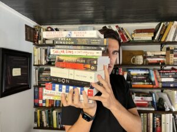

It’s a weird thing to say, but I guess I’m a professional reader. That’s really what authors are. A book is made of books. “The greatest part of a writer’s time is spent in reading; a man will turn over half a library to make one book,” Samuel Johnson said.  

虽然这么说很奇怪，但我想我是个职业读者。这才是真正的作家。书是由书构成的。"塞缪尔-约翰逊说："作家最大的时间都花在阅读上；为了写一本书，一个人会翻遍半个图书馆。

I’ve [written 15 books now](https://www.thepaintedporch.com/collections/ryan-holiday), which has meant reading many thousands of books in the process. Once a month for the last 15 years, I’ve recommended many of those books in the [Reading List Email](https://ryanholiday.net/reading-list/). And in 2021, [I opened my own bookstore](https://ryanholiday.net/2-years-of-lessons-from-running-my-own-bookstore/) filled with my all-time favorites.  

我已经写了 15 本书，这意味着我在写作过程中阅读了成千上万本书。在过去的 15 年里，我每月都会在 "阅读清单电子邮件 "中推荐其中的许多书籍。2021 年，我开设了自己的书店，里面都是我一直以来最喜欢的书。

So the question I am asked most often is:  

因此，我最常被问到的问题是

_How do you read so much? What’s the secret?  

你怎么能读这么多书？秘诀是什么？_

The answer is not “I’m a speedreader.” As I’ve written before, [speed reading is a scam](https://ryanholiday.net/reading-isnt-a-race-how-speed-reading-and-spritz-completly-miss-the-point/). The answer is that I have a system, a process that helps me be a productive reader. It’s not my system exactly, as I’ve taken many strategies from history’s greatest readers. Nor is this a system designed around speed or quantity. Reading is wonderful in and of itself, why would I try to rush through it? No, I try to do it well. I try to enjoy it.  

答案不是 "我是速读高手"。我以前写过，速读是个骗局。答案是，我有一个系统，一个帮助我成为高效阅读者的过程。这并不完全是我的系统，因为我从历史上最伟大的读者那里借鉴了很多策略。这也不是一个围绕速度或数量设计的系统。阅读本身就是一件美妙的事情，我为什么要急于求成呢？不，我努力把它做好。我努力享受阅读。

In this email, I thought I would detail some of the rules I’ve come to follow over the years. They don’t all make me faster, but they do make me better.  

在这封电子邮件中，我想详细介绍一些我多年来一直遵循的规则。它们不一定都能让我跑得更快，但一定能让我做得更好。

–Do it all the time. Bring a book with you everywhere. I’ve read at the Grammy’s and in the moments before going under for a surgery. I’ve read on planes and beaches, in cars and in cars while I waited for a tow truck. You take the pockets of time you can get.  

\-经常这样做。到哪儿都带本书。我在格莱美奖颁奖典礼上读过书，在手术前的时刻读过书。我在飞机上、海滩上、汽车里、等拖车的时候都读过书。你可以利用碎片时间。

–Physical books only. \-仅限实体书。

\-It’s not that I have a problem with audiobooks–if it gets you reading, I’m all for it.  

我并不是对有声读物有意见--如果它能让你阅读，我完全赞成。 I just think there’s something very special about the physical form. I just read a great book about this actually called _[Proust and the Squid](https://www.thepaintedporch.com/products/proust-and-the-squid-the-story-and-science-of-the-reading-brain)_ by Maryanne Wolf.  

我只是觉得身体形态有些特别之处。我刚刚读了一本关于这个问题的好书，叫《普鲁斯特与鱿鱼》，作者是玛丽安-沃尔夫（Maryanne Wolf）。

–Hardcover over paperback.  

\-精装，平装。

–Bring a pen with you too. Reading is better if you’re taking notes.  

\-也带一支笔。如果做笔记，阅读效果会更好。

–Keep a commonplace book.\-保留一本便签本。 As Seneca wrote: “We should hunt out the helpful pieces of teaching and the spirited and noble-minded sayings which are capable of immediate practical application—not far far-fetched or archaic expressions or extravagant metaphors and figures of speech—and learn them so well that words become works.”  

正如塞内加所写的："我们应该寻找那些有益的教诲，以及能够立即实际应用的充满激情和高尚情操的箴言，而不是牵强附会或陈旧的表达方式，或者奢华的比喻和修辞手法，并把它们学好，使言语成为作品"。 ([Here’s a video](https://www.youtube.com/watch?v=gT1EExZkzMM) on my commonplace book method).  

(这里有一段视频，介绍了我的通俗读物法）。

–Err on the side of age. Classics are classics for a reason.  

\-偏离年龄。经典之所以是经典，是有原因的。

\-Beat them up. Books are not precious things. As an author, I love it when people hand me a book to sign that has had real miles put on it. When people hand me a pristine copy and tell me it’s their favorite, I assume they are just flattering me. It’s obvious what my favorite books are…because they’re falling apart ([here’s my copy of _Meditations_](https://www.instagram.com/p/CtwUeUdL_rB/?igshid=MzRlODBiNWFlZA==) for instance).  

\-揍他们书不是珍贵的东西。作为一名作家，我很喜欢别人递给我一本已经过了实际使用年限的书让我签名。当人们递给我一本完好无损的书，告诉我这是他们的最爱，我认为他们只是在奉承我。很明显，我最喜欢的书是什么......因为它们都快散架了（比如我的这本《沉思录》）。

–In every book you read, try to find your next one in its footnotes or bibliography. [This is how you build a knowledge base](https://ryanholiday.net/read-to-lead/) in a subject—it’s how you trace a subject back to its core.  

\-在你阅读的每一本书中，试着在脚注或参考书目中找到你的下一本书。这就是建立学科知识基础的方法，也是追溯学科核心的方法。

\-Same goes when you find an author you love, read them ALL. I read Cecil Woodham-Smith’s [book on the charge of the Light Brigade](https://geni.us/kGZaBA2)…only to find she had also written a [biography of Florence Nightingale](https://geni.us/S0vsQR). It was that discovery that shaped a full third of my book _[Courage is Calling](https://store.dailystoic.com/products/courage-is-calling-signed-edition-pre-order)_.  

\-当你找到你喜欢的作家时也是一样，把他们都读一遍。我读了塞西尔-伍德汉姆-史密斯关于轻骑兵冲锋的书......却发现她还写了弗洛伦斯-南丁格尔的传记。正是这一发现影响了我的著作《勇气在召唤》整整三分之一的篇幅。

\-That comment from (the disgraced and indicted FTX founder) Sam Bankman Fried about how every book could be a 900 word blog post is preposterously stupid. The whole point of reading is to _really_ understand something. So if all you’re after is the ‘gist,’ skip books and stick with blog posts.  

山姆-班克曼-弗里德（被起诉的失宠的 FTX 创始人）关于每本书都可以写成一篇 900 字的博文的评论愚蠢至极。阅读的全部意义在于真正理解一些东西。因此，如果你只想了解 "要点"，那就不要看书，坚持看博文。

–If you see a book you want, just buy it. Don’t worry about the price. Reading is not a luxury. It’s not something you splurge on. It’s a necessity. Even if all you get is one life-changing idea from a book, that’s still a pretty good ROI.  

\-如果看到想要的书，就买下来。不要担心价格。阅读不是奢侈品。它不是奢侈的东西。它是必需品。即使你从一本书中只得到一个改变人生的想法，那也是相当不错的投资回报率。

\-That might sound privileged, but Warren Buffett considers the foundation of his multi-billion dollar empire to be a book.\-这听起来似乎很优越，但沃伦-巴菲特认为，他数十亿美元帝国的基础就是一本书。 At 19-years-old, he bought a copy of _[The Intelligent Investor](https://geni.us/Ok0XS8A)_ by Benjamin Graham.  

19 岁时，他买了一本本杰明-格雷厄姆写的《聪明的投资者》。 We don’t know exactly what he paid for it, but in the early 1950s, a hardcover typically went for $1.30–the best investment he ever made, he’s said.我们不知道他到底花了多少钱买下这本书，但在 20 世纪 50 年代初，一本精装本通常售价 1.30 美元，他说这是他做过的最好的投资。 Today, Buffett’s worth $108.7 billion, having given away some $37 billion to charitable causes.  

如今，巴菲特的身价已达 1,087 亿美元，为慈善事业捐出了约 370 亿美元。 Not a bad ROI!  

投资回报率还不错！

–Some people might recoil at categorizing a book that way, but as a lover of literature, I have no problem with it. I myself wouldn’t be writing this to you today if I hadn’t bought a paperback of _[Meditations](https://store.dailystoic.com/pages/meditations)_ in 2006 for $8.25 on Amazon. That book of philosophy taught me not just about life, but also schooled me in the art of writing, in working with and managing people, and gave me the speciality which I now write my own books about. Again, not a bad ROI.  

\-有些人可能会对这样归类一本书感到不悦，但作为一个文学爱好者，我对此毫无异议。如果不是 2006 年在亚马逊上花 8.25 美元买了一本平装本的《沉思录》，我今天也不会给你们写这封信。那本哲学书不仅教会了我人生，还教会了我写作的艺术，教会了我如何与人打交道、如何管理他人，并让我掌握了现在自己写书的特长。同样，投资回报率也不低。

–Don’t just read books, re-read books. There’s a great line the Stoics loved—that [we never step in the same river twice](https://dailystoic.com/everything-is-changing-and-thats-wonderful/). The books don’t change, but you do.  

\-不要只看书，要重读。斯多葛派有一句名言--我们从不两次踏入同一条河流。书本不会改变，但你会。

–As I said, speed reading is a scam. You just have to spend a lot of time reading.  

\-正如我所说，速读是个骗局。你只需要花大量时间阅读。

–If a book sucks, stop reading it. The best readers actually quit a lot of books. Life is too short to read books you don’t enjoy reading.  

\-如果一本书很烂，就不要再读了。最好的读者其实会放弃很多书。人生苦短，不能读自己不喜欢读的书。

–The rule I like is ‘one hundred pages minus your age.’ Say you’re 30 years old—if a book hasn’t captivated you by page 70, stop reading it. So as you age, you have less time to endure crap.  

\-我喜欢的规则是'一百页减去你的年龄'。假设你 30 岁，如果一本书读到 70 页还没有吸引你，那就别读了。所以，随着年龄的增长，你就没有那么多时间去忍受废话了。

\-Embrace serendipity. So many of my favorite books are just random things I grabbed at bookstores (this is why I say don’t sweat buying a book–just roll the dice). That’s what bookstores are for, what I’ve tried to build mine around. It’s a discovery engine better than any algorithm.  

\-拥抱偶然性。我最喜欢的很多书都是在书店里随手买来的（这就是为什么我说买书不要紧张--掷骰子就可以了）。这就是书店的作用，也是我努力打造我的书店的原因。这是一个比任何算法都好的发现引擎。

\-Don’t just build a library, build an anti-library—a stack of unread books that humbles you and reminds you just how much there is still to learn. It’s a sign of what you don’t yet know. It’s also a resource there whenever you might need to do a deep dive into that topic.  

\-不要只建一个图书馆，要建一个 "反图书馆"--一摞摞未读的书会让你感到惭愧，提醒你还有多少东西要学。这表明你还不知道什么。当你需要深入研究某个主题时，它也是一种资源。

–Emerson’s line was, “If we encounter a man of rare intellect, we should ask him what books he reads.”\-埃默森的台词是："如果我们遇到一个智力超群的人，我们应该问他读过什么书"。 When I was a teenager, [I got in the habit of doing this](https://humanparts.medium.com/this-question-will-change-your-reading-life-a28c622c0c25). Every time I would meet a successful or important person I admire, I would ask them: What’s a book that changed your life? And then I would read that book (in college, for instance, I was lucky enough to meet Dr. Drew, who was the one who turned me on to Stoicism).  

在我十几岁的时候，我就养成了这样的习惯。每次遇到我崇拜的成功人士或重要人物，我都会问他们哪本书改变了你的人生？然后我就会去读那本书（比如在大学里，我有幸遇到了德鲁博士，是他让我开始接触斯多葛主义）。

–Speaking of Emerson…in his essay “_Reading_,” he put down his three rules: “1. Never read a book that is not a year old \[because only good books survive\]. 2. Never read any but famed books \[same reason\]. 3. Never read any but what you like.”  

\-说到爱默生......在他的《读书》一文中，他提出了自己的三条原则："1.不读一年前的书\[因为只有好书才能流传下去\]。2.2. 除了名著，绝不读其他书\[同样的道理\]。3.只读自己喜欢的书"。

–Whenever I’m in a reading funk/dry spell (most commonly, around book launches), I find I’m able to get back into a groove by re-reading some of my favorite novels. _[What Makes Sammy Run?](https://www.thepaintedporch.com/products/fiction31?_pos=1&_sid=5aa180072&_ss=r) [The Great Gatsby](https://www.thepaintedporch.com/products/great-gatsby?_pos=1&_sid=06e51dcbb&_ss=r). [Ask the Dust](https://www.thepaintedporch.com/products/fiction3?_pos=1&_sid=ea23abc93&_ss=r). [The Moviegoer](https://www.thepaintedporch.com/products/moviegoer?_pos=1&_sid=7651f2a5c&_ss=r)._  

\-每当我陷入阅读低谷/枯竭期时（最常见的情况是在新书发布前后），我都会重读一些我最喜欢的小说，从而重新进入状态。了不起的盖茨比》。问尘埃电影人

\-Speaking of _[Ask the Dust](https://www.thepaintedporch.com/products/fiction3?_pos=1&_sid=ea23abc93&_ss=r)_, I read that because my friend Neil Strauss said in an interview it was his all-time favorite novel. He also turned me onto Knut Hamsun’s _[Hunger](https://geni.us/1IB82n1)_, which he had also raved about. When people _rave_ about something, don’t dismiss it. If someone says a book changed their life? Consider it seriously. They’re talking about something powerful.  

\-说到《问尘埃落定》，我读这本书是因为我的朋友尼尔-施特劳斯在一次采访中说这是他最喜欢的小说。他还让我读了克努特-哈姆森的《饥饿》，他对这本书也赞不绝口。当人们对某本书赞不绝口时，不要轻易否定它。如果有人说一本书改变了他们的生活？请认真考虑。他们说的是有力量的东西。

\-I find myself sometimes reluctant to read something that’s super popular. That snobbishness never serves me well. More often than not, when I get around to those bestsellers I kick myself–they were bestsellers for a reason! They’re great! Don’t be a book snob.  

\-我发现自己有时不愿意读超级流行的东西。这种势利的态度对我从来都没有好处。很多时候，当我读到那些畅销书时，我会自责--它们成为畅销书是有原因的！它们很棒！不要做一个势利眼。

–[You say you don’t have time to read](https://www.youtube.com/watch?v=Jk3Eb-P5G0M&ab_channel=DailyStoic) but what does the screen time app on your phone say? What does [your calendar say](https://www.youtube.com/watch?v=ZLimIFGbVMY&ab_channel=DailyStoic)?  

\- 你说你没有时间阅读，但你手机上的屏幕时间应用程序怎么说？你的日历怎么说？

–If you want to understand current events, don’t rely on breaking news. Find a book about a similar event in the past. Read history. Read psychology. Read biographies. Go for information that has a long half-life, not something that’s going to be contradicted in the next bulletin.  

\-如果你想了解时事，不要依赖突发新闻。找一本关于过去类似事件的书。读历史。读心理学。读传记。寻找半衰期较长的信息，而不是在下一则公告中会被反驳的信息。

\-Examples: Read _[The Great Influenza](https://www.thepaintedporch.com/products/great-influenza-the-story-of-the-deadliest-pandemic-in-history-revised?_pos=1&_sid=6d73895b3&_ss=r)_ to understand COVID. Read _[It Can’t Happen Here](https://www.thepaintedporch.com/products/rhmoo27?_pos=1&_sid=4c1065e04&_ss=r)_ to understand modern threats to democracy. Read _[First Principles](https://www.thepaintedporch.com/products/first-principles-what-americas-founders-learned-from-the-greeks-and-romans-and-how-that-shaped-our-country?_pos=1&_sid=83814e185&_ss=r)_ to understand American politics.  

\-举例说明：阅读《大流感》，了解 COVID。阅读《不能在这里发生》，了解现代民主面临的威胁。阅读《第一原则》，了解美国政治。

–Ruin the ending. I almost always go straight to Wikipedia and figure out the plot–especially if I am reading something tough like Shakespeare or Aeschylus. Who cares about spoilers? Your aim as a reader is to understand WHY something happened, the what is secondary.  

\-弄清结局。我几乎总是直接查阅维基百科，弄清情节--尤其是在读莎士比亚或埃斯库罗斯等艰深的作品时。谁在乎剧透？作为读者，你的目的是了解为什么会发生这样的事情，"什么 "是次要的。

–One of the things that people in publishing know is that readers tend to skip prefaces and forewords. This is crazy! Those things are there for a reason. They often have a ton of helpful and interesting stuff about the context around when the person was writing, who the work ended up influencing, and other tidbits that sometimes stick with you longer than even the work itself.  

\-出版界人士都知道，读者往往会跳过序言和前言。这太疯狂了！这些东西的存在是有原因的。前言和序言往往包含大量有用和有趣的信息，如作者写作的背景、作品最终影响了谁，以及其他花絮，这些信息有时甚至比作品本身更能打动读者。

\-”Don’t be satisfied just getting the ‘gist’ of things,” is what Marcus Aurelius learned from his philosophy teacher Rusticus. One of the reasons I try to spoil the plot, make my way through the intro and the preface, read reviews and articles about the books I’m reading, watch videos about them, and read other books on the topic is because I want to _really_ understand what I’m dealing with. If I don’t, if I only want a surface take, why read a book at all?  

"不要仅仅满足于了解事物的'要点'，"这是马库斯-奥勒留从他的哲学老师鲁斯蒂库斯那里学到的。我之所以试图破坏情节，通读前言和序言，阅读有关我所读的书的评论和文章，观看有关视频，以及阅读有关主题的其他书籍，其中一个原因就是我想真正了解我所面对的是什么。如果我不这样做，如果我只想了解皮毛，那为什么还要看书呢？

–When intelligent people read, they ask themselves a simple question: _What do I plan to do with this information?_  

\-当聪明人阅读时，他们会问自己一个简单的问题：我打算如何处理这些信息？

\-My favorite [line from Harry Truman](https://dailystoic.com/you-must-read-to-lead/) is, “not all readers are leaders, but all leaders are readers.”  

我最喜欢哈里-杜鲁门的一句话："不是所有的读者都是领导者，但所有的领导者都是读者"。 When we read, we aren’t learning to impress people, to win some game of mental gymnastics. It’s to get better, to find things you can use in your real life. If you’re looking to expand what you do with the books you’re reading, I highly recommend our [Read to Lead](https://store.dailystoic.com/products/read-to-lead-2022) course. It’s been taken by over 10,000 people, and is our most popular for a reason.  

当我们阅读时，我们不是为了给别人留下深刻印象，也不是为了在智力体操比赛中获胜。而是为了让自己变得更好，找到可以用在现实生活中的东西。如果你想扩大你的阅读范围，我强烈推荐我们的 "阅读引领 "课程。已经有超过 10,000 人学习过这门课程，是我们最受欢迎的课程，这是有原因的。

–[Read widely and from people you disagree with](https://dailystoic.com/read-like-a-spy/). The Stoics believed that we should actively engage with anyone who can be a source of wisdom to us, regardless of their origin. If there is wisdom out there to be had, we’d be wise to avail ourselves of it.  

\- 广泛阅读，从你不同意的人那里阅读。斯多葛学派认为，我们应该积极与任何能够成为我们智慧源泉的人交往，无论他们来自何方。如果有智慧可言，我们就应该加以利用。

\-Pretentiousness is bullshit. Epictetus once heard a student talking proudly about having made their way through the dense works of Chryssipus. You know, Epictetus told him, if Chryssipus had been a better writer, you’d have less to brag about.  

\-自命不凡是狗屁。爱比克泰德曾听到一个学生骄傲地说 他们已经读完了克利希斯浦斯密密麻麻的作品你知道吗，伊壁鸠鲁告诉他，如果克利西浦斯是个更好的作家，你就没那么多可炫耀的了。

–Look for wisdom, not facts. We’re not reading to just find random pieces of information. What’s the point of that? We’re reading to accumulate a mass of true wisdom—that you can turn to and apply in your actual life.  

\-寻找智慧，而不是事实。我们阅读不是为了随意寻找信息。那有什么意义呢？我们读书是为了积累大量真正的智慧--可以在实际生活中运用的智慧。

\-Another line from Seneca is about how people get too caught up in the facts and figures and they miss the message. I totally agree. On the literary snobs who speculate for hours about whether [The Iliad or _The Odyssey_](https://www.thepaintedporch.com/products/iliad-odyssey?_pos=1&_sid=b2cd83a92&_ss=r) was written first, or who the real author was (a debate that rages on today), he said, “Far too many good brains have been afflicted by the pointless enthusiasm for useless knowledge.”  

\-塞内卡的另一句话是关于人们如何被事实和数字所迷惑，从而错过了信息。我完全同意。对于那些花几个小时猜测《伊利亚特》还是《奥德赛》写得最早，或者谁才是真正作者的文学势利小人（这场争论至今仍在继续），他说："太多优秀的大脑被对无用知识的无谓热情所折磨"。

–If a book is good, recommend it and pass it along to other people.  

\-如果一本书很好，就推荐给其他人。

It’s the last one that I follow the most. I’m proud of the books I’ve been able to champion and turn people onto over the years. I feel like I am paying forward what the Gregory Hays translation of _[Meditations](https://www.thepaintedporch.com/products/philosophy15?_pos=2&_sid=20d407acc&_ss=r)_ did for me (I loved it so much I put out my own edition you can grab [here](https://store.dailystoic.com/pages/meditations)).  

我最关注的是最后一项。我为自己多年来所倡导和推荐的书籍感到自豪。我觉得我是在回报格雷戈里-海斯翻译的《沉思录》对我的帮助（我非常喜欢这本书，所以推出了自己的版本，你可以在这里下载）。

I love looking around [my bookstore](https://www.thepaintedporch.com/) and seeing titles that I _don’t_ see in other bookstores very often. Just recently, Ann Roe’s publisher of _[Pontius Pilate](https://www.thepaintedporch.com/products/pontius-pilate?_pos=1&_sid=24e9f368e&_ss=r)_ told us they had to do another printing because we’d raved about it too much. I heard something similar about William Seabrook’s _[Asylum](https://www.thepaintedporch.com/products/memoir1?_pos=1&_sid=3514c0cd0&_ss=r)_. That’s the job of a reader and a writer–to find great stuff and suck everything you can out of it as you read it and re-read it.  

我喜欢在书店里转转，看看那些我在其他书店不常见到的书。就在最近，安-罗的《庞提乌斯-彼拉多》的出版商告诉我们，他们必须再印一次，因为我们对这本书赞不绝口。关于威廉-西布鲁克的《庇护》，我也听说过类似的事情。这就是读者和作家的工作--发现好东西，并在阅读和重读的过程中尽情汲取。

And to help others do the same.  

并帮助其他人也这样做。

I hope these rules help you help yourself and help others.  

我希望这些规则能帮助你帮助自己和他人。
