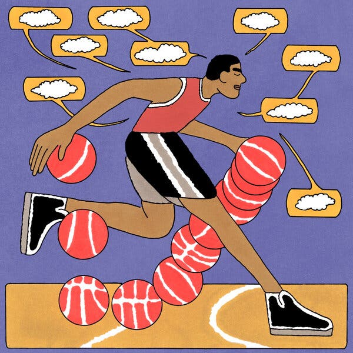

Guest Essay 特邀评论

Sept. 17, 2023 2023 年 9 月 17 日

Credit...Marco Quadri 马尔科-夸德里

Francis Sanzaro 作者：弗朗西斯-桑扎罗

Mr. Sanzaro is a climber, a philosopher and the author of “The Zen of Climbing.”  

桑扎罗先生是一位登山家、哲学家和 "登山禅 "的作者。

Sign up for the Opinion Today newsletter  Get expert analysis of the news and a guide to the big ideas shaping the world every weekday morning.  

注册订阅《今日观点》时事通讯在每个工作日的早晨，您都能获得专家对新闻的分析以及影响世界的重大观点指南。

A few years ago, I stood underneath a red overhanging cliff near my hometown, Carbondale, Colo. The day was a stunner. Elk chewed on the brown grasses by the river below. A hawk rode the wind. Townsfolk and itinerants, some clothed and some not, loitered in a nearby hot spring. I was tied in, ready to climb. I was attempting to do a route first try, “onsight,” as we call it, which means I didn’t know what I was climbing into. It would have been a hard onsight for me — to onsight hard climbs, you need clarity. No interference.  

几年前，我站在家乡科罗拉多州卡本代尔附近的红色悬崖下。那天的景色令人惊叹。麋鹿在河边咀嚼着褐色的青草。一只老鹰迎风飞翔。镇上的居民和流浪者，有的穿着衣服，有的没穿衣服，在附近的温泉里闲逛。我系好安全带，准备登山。我试图第一次尝试攀登一条路线，也就是我们所说的 "onsight"，这意味着我不知道自己要爬到什么地方。这对我来说是一次艰难的 "onsight"--要 "onsight "艰难的攀登，你需要清晰的思路。没有干扰

Just as I was about to climb, nerves in my body, which I hadn’t felt yet, said hello. That’s not good for any athlete.  

就在我准备爬坡的时候，我身体里还没有感觉到的神经向我问好。这对任何运动员来说都不是好事。

Desperate, I painted a coat of confidence on my inner walls of doubt.  

绝望之余，我在内心的怀疑墙上涂上了一层自信的外衣。

I visualized myself at the top, celebrating.  

我想象着自己站在山顶，欢呼雀跃。

“You can do this,” I adamantly told myself. “If you believe, success is certain.”  

"你能做到的，"我坚定地告诉自己。"只要你相信，就一定能成功"

It didn’t work. I fell near the top. Defeated, I lowered to the ground and realized — powerfully, and with the clarity I was seeking minutes earlier — that the _desire_ to climb the route had kept me from doing it. My self worth was bound at that moment to my success or failure, and that set off a chain reaction: unnatural desire, pressure, performance anxiety, anticipation, a mind enamored with the top but a body struggling below, bad decision-making, irregular movement, distraction, frustration. All in that order, too.  

没有成功。我在山顶附近摔了一跤。失败后，我趴在地上，强烈地意识到--几分钟前我还在寻找一种清晰的感觉--攀登这条路线的欲望让我无法完成攀登。在那一刻，我的自我价值与我的成败紧紧联系在一起，这引发了一系列连锁反应：不自然的欲望、压力、表现焦虑、期待、一心想着登顶而身体却在下面挣扎、错误的决策、不规则的运动、分心、挫败感。所有这些也都依次发生。

On a whim, I told myself that on my next attempt, success or failure was irrelevant. “Make one move at a time. That’s all.” I gave myself a pass from whatever would transpire. Case closed.  

我心血来潮地告诉自己，在下一次尝试中，成败并不重要。"一次只做一个动作。仅此而已。"我给自己放了一马，不管会发生什么。结案

It worked. I floated to the top with poise, clarity and bewilderment.  

我成功了。我以优雅、清晰和迷惑的姿态飘到了顶峰。

That moment got me thinking, and then researching. At some point, I framed this experience for myself in terms of simple arithmetic: When I added (determination, grit, self-confidence, desire), I failed. When I took away (the desire for success), my body moved with greater fluidity and naturalness. I improved. I enjoyed it more as well, which, as an athlete of 30 years, I didn’t think was possible.  

那一刻，我开始思考，然后进行研究。在某一时刻，我用简单的算术给自己框定了这段经历：当我加入（决心、勇气、自信、欲望）时，我失败了。当我减去（对成功的渴望）时，我的身体移动得更加流畅自然。我进步了。我也更加享受运动，作为一名 30 年的运动员，我认为这是不可能的。

I discovered the power of subtraction.  

我发现了减法的力量。

The tactic of subtraction goes against the grain of the so-called mind-set revolution, in which it seems everyone is adding this or that quality to their mental approach. The growth mind-set. The abundance mind-set. The gratitude mind-set. But in this genre of self-optimization, if it can be called that, we are adding more and more duct tape to something that isn’t broken — our mind — until it is so covered we lose sight of the beautifully designed machine underneath it all and it thus becomes, in fact, broken.  

做减法的策略与所谓的心态革命背道而驰，在所谓的心态革命中，似乎每个人都在为自己的思维方式增加这样或那样的品质。成长心态。富足心态。感恩心态。但是，在这种自我优化的流派中（如果可以这么说的话），我们正在把越来越多的胶带贴在一个并没有坏掉的东西上--我们的心智--直到它被贴得满满的，我们才会注意到在这一切之下的那台设计精美的机器，于是它事实上就坏掉了。

This idea — of performing acts with as little interference as possible — is not only applicable in sports. Yes, it can help us hit a bull’s-eye, but it can also help us elegantly play a piano sonata or be more present with our children. As the sports psychologist Ken Ravizza has said, “Perform one moment at a time.” My experience in the years since that climb has taught me, unequivocally, that the body has no sense of concepts like success or failure. Concepts originate in the mind, and it is so with life as it is with sports.  

这种想法--在尽可能少干扰的情况下完成动作--不仅适用于体育运动。是的，它可以帮助我们击中靶心，但也可以帮助我们优雅地弹奏钢琴奏鸣曲，或更多地陪伴我们的孩子。正如运动心理学家肯-拉维扎（Ken Ravizza）所说，"一次只表演一个瞬间"。在那次登山之后的几年里，我的经验明确告诉我，身体并没有成功或失败这样的概念。概念源于头脑，生活如此，运动也是如此。

Reading about what top athletes considered the ideal state of mind led me to a few surprising conclusions. First, the power of subtraction had been there all along. Though you can find it in interviews and writings from Olympians, top coaches, sports psychologists and even samurai warriors, it was rarely explicitly articulated. Second, it’s much harder to practice than I realized. Third, you win _more_ when you embody it. And, for the record, there’s nothing wrong with winning.  

通过阅读顶级运动员所认为的理想精神状态，我得出了一些令人惊讶的结论。首先，减法的力量一直存在。虽然你可以在奥运选手、顶级教练、运动心理学家甚至武士的访谈和著作中找到它，但它很少被明确阐述。第二，实践起来比我想象的要难得多。第三，当你体现它时，你会赢得更多。顺便说一句，赢并没有错。

But to untangle ourselves from those bonds of self-worth, we need to cultivate more subtle qualities — emotional intelligence, restraint and the ability to recognize and acknowledge our own feelings. The key is _removing_ barriers to clarity, not adding them in hopes of reaching our goals.  

但是，要想从自我价值的束缚中解脱出来，我们需要培养更微妙的品质--情商、克制以及认识和承认自己感受的能力。关键在于消除障碍，而不是为了达到目标而增加障碍。

In the early- to mid-1920s, the French author Antoine de Saint-Exupéry flew planes, commercially for a stint, and also for the French Air Force. He was an adventurer, a poet of life. He also wrote one of my favorite books: “Wind, Sand and Stars.” In it, I found one of the smartest lines ever written on the human condition, even though at the time he was riffing about airplanes: “Perfection is achieved not when there is nothing more to add but when there is nothing left to take away, when a body has been stripped down to its nakedness.”  

二十世纪二十年代初至二十年代中期，法国作家安托万-德-圣埃克苏佩里（Antoine de Saint-Exupéry）曾驾驶过飞机，做过一段时间的商业飞行，也为法国空军驾驶过飞机。他是一位冒险家，一位生活诗人。他还写了一本我最喜欢的书"《风沙和星星》在这本书中，我发现了有史以来关于人类生存条件的最精辟的一句话，尽管当时他是在谈论飞机："完美的实现不是在没有任何东西可以添加的时候 而是在没有任何东西可以拿走的时候 当身体被剥得一丝不挂的时候"

That day, at the bottom of the climb, I finally understood what Saint-Exupéry was talking about. Adding comes naturally in life, from the simple act of living; habits form, mental patterns become fixed. Jealousies, insecurities and phobias take root with disturbing ease. We may try to fix ourselves, but often by slapping on more strips of duct tape.  

那天，在山脚下，我终于明白了圣埃克苏佩里的意思。在生活中，从简单的生活行为中，自然而然地就会增加一些东西；习惯形成了，心理模式也固定下来了。妒忌、不安全感和恐惧症很容易扎根，令人不安。我们可能会尝试自我修复，但往往是贴上更多的胶带。

But, against what feels like common sense, daily labor is required to return to nakedness.  

但是，与常理相悖的是，要恢复赤身裸体，每天都需要付出劳动。

A great performance is nothing more than a lovely moment, and lovely moments are everywhere. To arrive there, you need to prune away what is causing anticipation and frustration — impatience with those you love, jealousy toward a friend or anger at your children. As Saint-Exupery advises, we must take away until there is nothing left to remove. What is left when you do that? Only an action. You are in it, then, in sports or in love, with clarity, intensity and solidity. You adjust quickly and deftly. You are no longer bound by addition. You are free to act.  

精彩的表演无非是一个美好的瞬间，而美好的瞬间无处不在。为了达到这一境界，你需要修剪掉那些导致期待和沮丧的东西--对爱人的不耐烦、对朋友的嫉妒或对孩子的愤怒。正如圣埃克苏佩里所建议的，我们必须去除一切，直到没有任何东西可以去除。这样做之后会留下什么？只有行动。那么，无论是在运动中还是在爱情中，你都能清晰、强烈、坚定地投入其中。你会迅速而灵巧地调整。你不再受附加物的束缚。你可以自由行动。

That’s winning. That’s perfection.  

这就是胜利。这就是完美。

Francis Sanzaro is a climber, a philosopher and the author of “[The Zen of Climbing](https://bookshop.org/p/books/the-zen-of-climbing-francis-sanzaro/19975255).”  

弗朗西斯-桑扎罗是一位登山家、哲学家，也是《登山禅》一书的作者。

_The Times is committed to publishing_ [_a diversity of letters_](https://www.nytimes.com/2019/01/31/opinion/letters/letters-to-editor-new-york-times-women.html)  

泰晤士报》致力于发表多样化的信件 _to the editor. 致编辑 We’d like to hear what you think about this or any of our articles. Here are some我们想听听您对这篇文章或我们任何文章的看法。以下是一些_ [_tips 秘诀_](https://help.nytimes.com/hc/en-us/articles/115014925288-How-to-submit-a-letter-to-the-editor)_. And here’s our email:  这是我们的电子邮件：_[_letters@nytimes.com_](mailto:letters@nytimes.com)_._ letters@nytimes.com。

_Follow The New York Times Opinion section on_ [_Facebook_](https://www.facebook.com/nytopinion)_,_ [_Twitter (@NYTopinion)_](http://twitter.com/NYTOpinion) _and_ [_Instagram_](https://www.instagram.com/nytopinion/)_._  

在 Facebook、Twitter (@NYTopinion) 和 Instagram 上关注《纽约时报》观点版。
