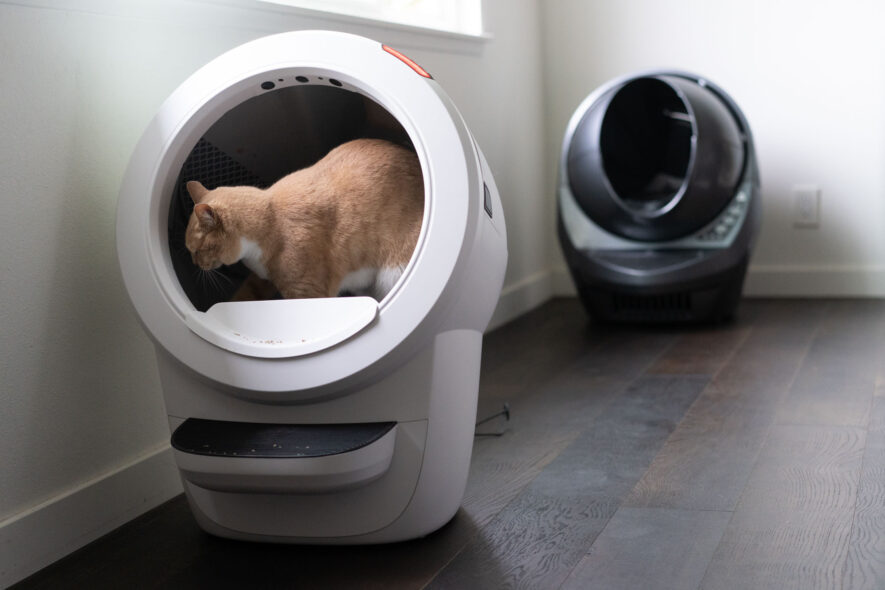

After our positive experience with the [Litter-Robot 3 Connect](https://www.pntra.com/t/TUJGR0tLTEJHSklJRkVCR0lKTUZM?sid=lr4vs3&url=https%3A%2F%2Fwww.litter-robot.com%2Flitter-robot-iii-open-air-with-connect.html) for many years, we were excited to test out the new [Litter-Robot 4](https://www.pjtra.com/t/TUJGR0tLTEJHSklJRkVCR0lKTUZM?sid=lr4vs3&url=https%3A%2F%2Fwww.litter-robot.com%2Flitter-robot-4.html) to see if it could get any better. The new Litter-Robot 4 boasts new patented technology like its OmniSense™ Detection, which has laser and weight sensors to track your cat’s health via a mobile app and a quieter sifting cycle. We tested the Litter-Robot 4 for over six months and compared this experience with our original Litter-Robot 3 Connect to see if it was worth the hefty price hike.  

在使用 Litter-Robot 3 Connect 多年的良好体验之后，我们很高兴能试用新款 Litter-Robot 4，看看它是否能有更好的表现。新款 Litter-Robot 4 采用了新的专利技术，如 OmniSense™ 检测技术，该技术带有激光和重量传感器，可通过手机应用程序跟踪猫咪的健康状况，而且筛分周期更安静。我们对 Litter-Robot 4 进行了长达 6 个多月的测试，并将这一体验与我们原来的 Litter-Robot 3 Connect 进行了比较，看看它是否值得高昂的价格。

Our Top Choices 我们的首选

[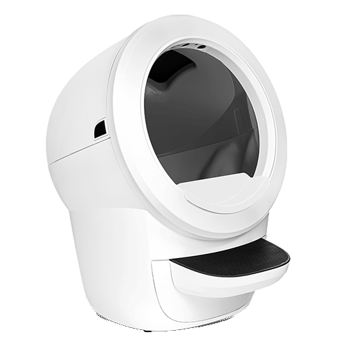](https://www.pjtra.com/t/TUJGR0tLTEJHSklJRkVCR0lKTUZM?sid=lr4vs3&url=https%3A%2F%2Fwww.litter-robot.com%2Flitter-robot-4.html)

Upgraded Model 升级版

___

Litter-Robot 4 垃圾机器人 4

[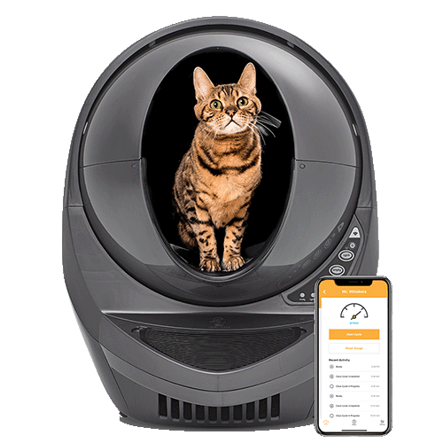](https://www.pntra.com/t/TUJGR0tLTEJHSklJRkVCR0lKTUZM?sid=lr4vs3&url=https%3A%2F%2Fwww.litter-robot.com%2Flitter-robot-iii-open-air-with-connect.html)

Tried & True 屡试不爽

___

Litter-Robot 3 Connect 垃圾机器人 3 连接

## Why trust us? 为什么信任我们？

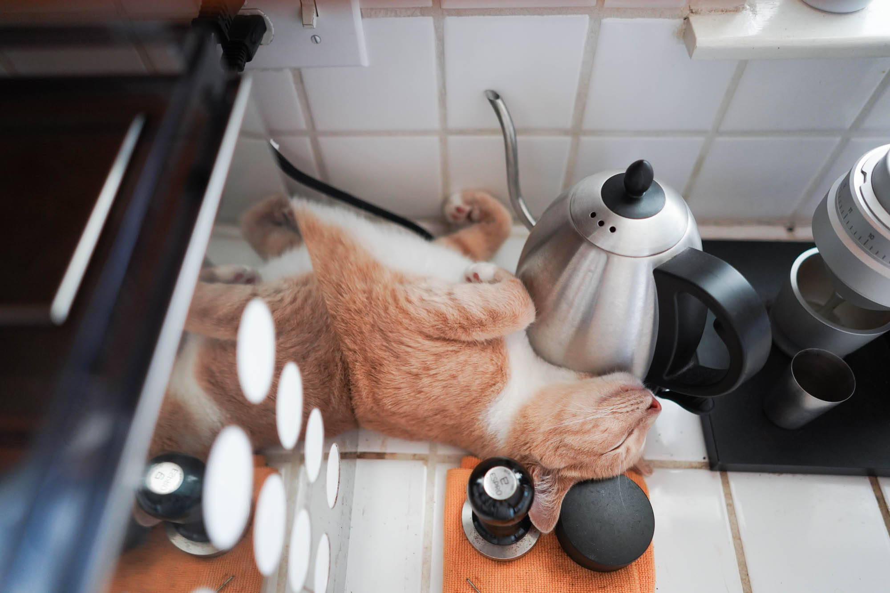

We’ve been proud cat parents of an adopted fur baby for about four years now and are no strangers to scooping cat litter. We [reviewed the Litter-Robot 3](https://www.yourbestdigs.com/reviews/litter-robot-3-connect/) after using it for many years and [reviewed the upgraded Litter-Robot 4](https://www.yourbestdigs.com/reviews/litter-robot-4/) as soon as we could get it in our hands after testing many other brands of [automatic litter boxes](https://www.yourbestdigs.com/reviews/best-automatic-litter-box/) in the past. You can see all of our cat and [pet product reviews here](https://www.yourbestdigs.com/products/pets/).  

我们已经为领养的猫宝宝当了四年的猫爸猫妈，对舀猫砂并不陌生。在使用了 Litter-Robot 3 多年之后，我们对它进行了评测；在测试了许多其他品牌的自动猫砂盆之后，我们一拿到 Litter-Robot 4 就立即对它进行了评测。您可以在这里查看我们所有的猫和宠物产品评测。

## What is a Litter-Robot? 什么是垃圾机器人？

If you’re not familiar, the Litter-Robot is a self-cleaning litter box that automatically scoops dirty litter whenever your cat relieves itself. The machine rotates to sift out the clumped litter, putting it into a waste drawer, then sifts back in the unused litter into the box. The Litter-Robot sets itself apart with its sleek design, quiet scooping features, wifi connectivity and custom mobile phone app.  

如果您对 Litter-Robot 还不太了解，它是一种自洁式猫砂盒，每当猫咪解手时，它就会自动将脏猫砂收集起来。机器旋转筛出结块的猫砂，将其放入垃圾抽屉，然后将未使用的猫砂筛回猫砂盒。Litter-Robot 以其时尚的设计、安静的舀粪功能、无线连接和定制的手机应用程序而与众不同。

## Litter-Robot 4 vs. 3 feature comparison table  

垃圾机器人 4 与 3 功能对比表

## Design 设计

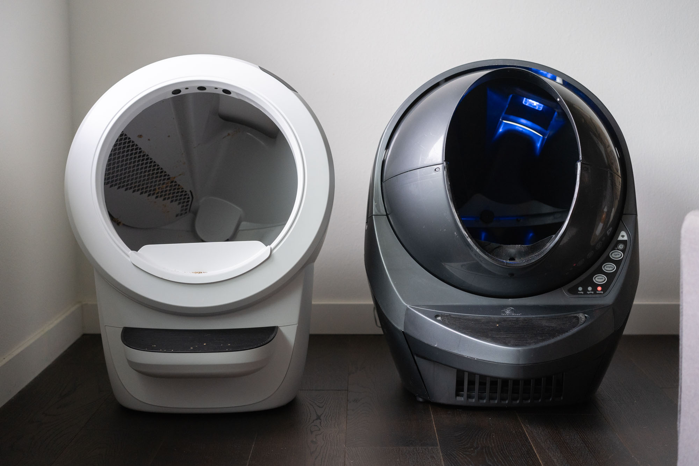

The Litter-Robot 4 has a clean and modernized design we like a lot better.  

Litter-Robot 4 的设计简洁、现代，我们更喜欢它。

The first noticeable difference between the Litter-Robot 3 Connect and the Litter-Robot 4 is the design. Where the former tends to look like a bulky spaceship, the Litter-Robot 4 has a sleeker and minimalist aesthetic that fits most homes. The Litter-Robot 3 Connect comes in gray or beige colors, while the Litter-Robot 4 comes in black or white (a small detail we prefer because the colors look more modern).  

Litter-Robot 3 Connect 与 Litter-Robot 4 之间的第一个明显区别是设计。前者看起来像一艘笨重的宇宙飞船，而 Litter-Robot 4 则更时尚简约，适合大多数家庭使用。Litter-Robot 3 Connect 有灰色和米色两种颜色，而 Litter-Robot 4 则有黑色和白色两种颜色（我们更喜欢这种小细节，因为颜色看起来更现代）。

Over time there will be more kitty litter that eventually settles all around the unit, and the Litter-Robot 4 is a little more seamless in terms of number of panels to wipe down.  

随着时间的推移，会有更多的猫砂最终沉积在设备周围，而 Litter-Robot 4 在需要擦拭的面板数量上要更多一些。

## Overall dimensions & entrance dimensions  

整体尺寸和入口尺寸

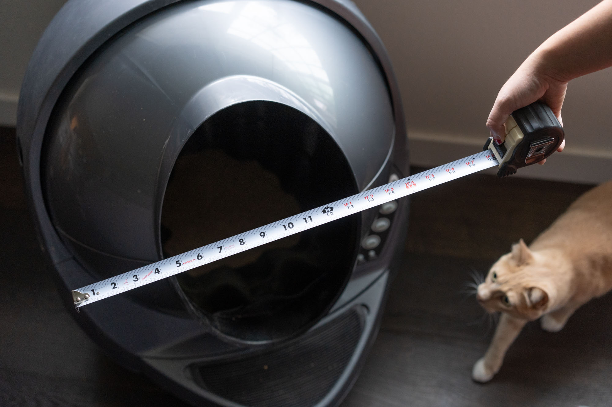

The Litter-Robot 4 wins with a smaller footprint, and larger entrance.  

Litter-Robot 4 以更小的占地面积和更大的入口取胜。

Although both machines weigh 24 lb, the Litter-Robot 4 has smaller overall dimensions of 29.5” x 22” x 27” (height x width x depth). The Litter-Robot 3 Connect is 2.25 inches wider at 29.5” x 24.25” x 27”. One of the main differences in design is the size and shape of the entrance. The newer iteration of the Litter-Robot has a circular opening that’s 15.75” x 15.75”, whereas the Litter-Robot 3 Connect has an oval-shaped entrance that’s 15.5” high by 10.25” wide. If you’ve got larger cats, we recommend the wider entrance of the Litter-Robot 4.  

虽然两台机器都重 24 磅，但 Litter-Robot 4 的整体尺寸较小，为 29.5 英寸 x 22 英寸 x 27 英寸（高 x 宽 x 深）。Litter-Robot 3 Connect 宽 2.25 英寸，为 29.5 英寸 x 24.25 英寸 x 27 英寸。设计上的主要区别之一是入口的大小和形状。Litter-Robot 3 Connect 的入口为椭圆形，高 15.5 英寸，宽 10.25 英寸。如果您养的是体型较大的猫咪，我们推荐使用入口较宽的 Litter-Robot 4。

There are also differences in the height from the floor to the entrance of each Litter-Robot. The Litter-Robot 3 Connect has a 13.4” height, and the Litter-Robot 4 has a height difference of 12”. Each litter box has a platform below the entrance to help the cat enter. If you have a senior or larger cat with mobility issues, you can buy a [ramp for the Litter-Robot 3](https://www.pntra.com/t/TUJGR0tLTEJHSklJRkVCR0lKTUZM?sid=lr4vs3&url=https%3A%2F%2Fwww.litter-robot.com%2Flitter-robot-3-ramp.html) to help them reach the entrance. Note that the ramp for the Litter-Robot 4 won’t be available until 2023.  

每台 Litter-Robot 从地面到入口的高度也有差异。Litter-Robot 3 Connect 的高度为 13.4 英寸，而 Litter-Robot 4 的高度差为 12 英寸。每个猫砂盆的入口下方都有一个平台，帮助猫咪进入。如果您养的是行动不便的高龄猫或体型较大的猫，您可以为 Litter-Robot 3 购买一个斜坡，帮助它们到达入口处。请注意，用于 Litter-Robot 4 的斜坡要到 2023 年才会推出。

## Sensors: safety and health  

传感器：安全与健康

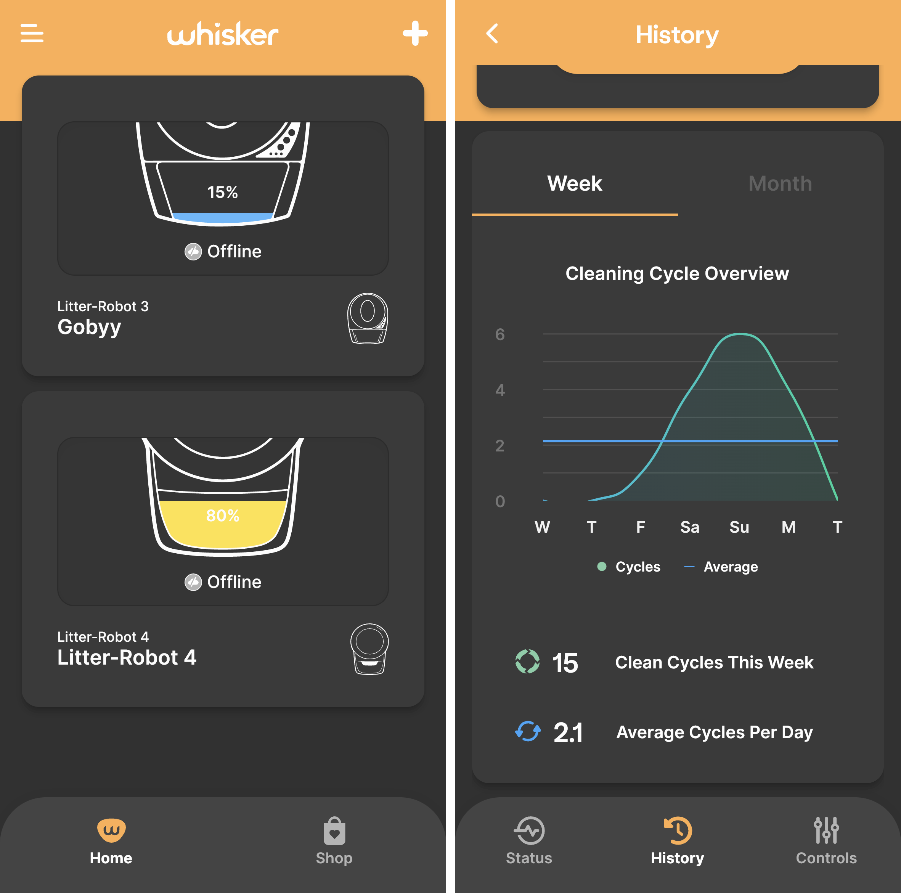

Both machines’ sensors are similar, but the Litter-Robot 4 adds a feature to measure and track your cat’s weight.  

两款机器的传感器相似，但 Litter-Robot 4 增加了测量和跟踪猫咪体重的功能。

The Litter-Robot 3 Connect has a Cat Sensor that primarily uses your cat’s weight to indicate when your cat steps on the platform or enters the globe. For safety reasons, each cat must weigh at least five pounds to use the Litter-Robot 3 Connect. We noticed that the noisy cycle cleaning would intrigue our cat, and he would step on the platform at the start of cleaning, interrupting and pausing the cycle.  

Litter-Robot 3 Connect 有一个猫咪传感器，主要利用猫咪的体重来指示猫咪何时踏上平台或进入地球仪。出于安全考虑，每只猫咪必须至少有 5 磅重才能使用 Litter-Robot 3 Connect。我们注意到，嘈杂的循环清洁会引起猫咪的兴趣，它会在清洁开始时踩到平台上，打断并暂停循环。

The newer Litter-Robot 4 has laser and weight sensors that help keep your cat safe and they also give you updates on your cat’s health (like their weight and litter box usage). The OmniSense™ detection laser-based sensors help you know when your cat enters the litter box and give you real-time litter levels and waste drawer levels–so you have all this information at the palm of your hands with the Whisker mobile app.  

较新的 Litter-Robot 4 配备了激光和重量传感器，有助于确保猫咪的安全，还能为您提供猫咪的最新健康状况（如体重和猫砂盆使用情况）。OmniSense™ 检测激光传感器可帮助您了解猫咪何时进入猫砂盆，并实时显示猫砂量和抽屉里的垃圾量--您可以通过 Whisker 移动应用程序随时掌握这些信息。

The Litter-Robot 4 also has weight sensors that differ from the Litter-Robot 3 Connect in that it offers litter box activity and will also weigh your cat whenever it uses the litter box. Your cat’s weight is sent to the Whisker app so you can monitor their weight along with your cat’s litter box history. We like that we can get more health information from this new model.  

Litter-Robot 4 还配备了重量传感器，与 Litter-Robot 3 Connect 不同的是，它提供猫砂盆活动信息，并在猫咪使用猫砂盆时为其称重。猫咪的体重会被发送到 Whisker 应用程序，这样您就可以监控猫咪的体重以及猫砂盆的使用记录。我们很高兴能从这款新产品中获得更多健康信息。

However, we have noticed that the sensors are somewhat more sensitive and see that the cycles get interrupted at least once a day. We also think that the laser sensors are a bit fussy when giving us litter levels, but this also may be due to the lighter-weight wheat litter we use.  

不过，我们也注意到，传感器的灵敏度更高，而且每天至少会中断一次循环。我们还认为，激光传感器在显示猫砂量时有些挑剔，但这也可能是我们使用的小麦砂重量较轻的缘故。

## Noise when “scooping” & sifting  

舀水 "和筛分时的噪音

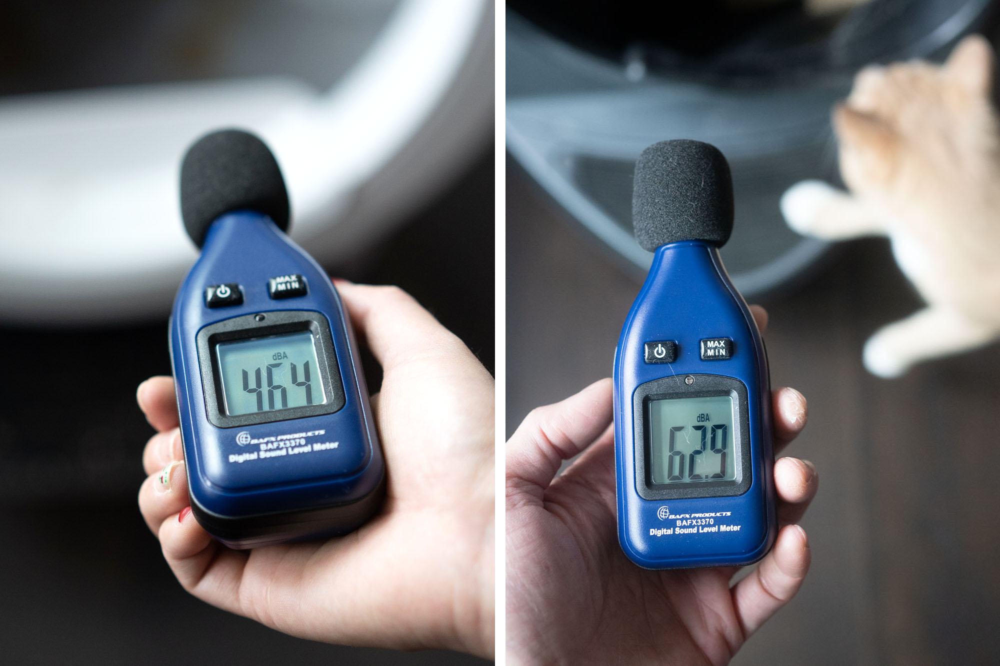

The Litter-Robot 4 wins as the MUCH quieter machine.  

Litter-Robot 4 是最安静的机器。

We used a digital sound level meter to give you some concrete results, held about 20″ away from the litter box as we ran the scoop/sifting cycle. The ambient noise level in the room was 38 dBA. The Litter-Robot 3 Connect measured approximately 60-62 dBA average during the litter sifting cycle with a high of about 65 dBA. By comparison, the Litter-Robot 4 measurured much lower at an average of 40-55 dBA with a max of about 59 dBA.  

我们使用了数字声级计来给出具体结果，在运行勺子/筛子循环时，声级计距离猫砂盒约 20 英寸。房间内的环境噪音水平为 38 dBA。Litter-Robot 3 Connect 在猫砂筛选周期内测得的平均噪音约为 60-62 dBA，最高约为 65 dBA。相比之下，Litter-Robot 4 的测量值要低得多，平均值为 40-55 dBA，最大值约为 59 dBA。

|  | Litter-Robot 3 垃圾机器人 3 | Litter-Robot 4 垃圾机器人 4 |
| --- | --- | --- |
| Scoop cycle avg. dBA 铲运周期平均分贝 | 60-62 | 40-55 |
| Scoop cycle max dBA 铲运周期最大分贝 | 65 | 59 |

The Litter-Robot 4 is quiet enough to not startle or intrigue our cat during the cleaning cycle like the Litter-Robot 3 Connect. The Litter-Robot 3 Connect makes a very obvious sounding motor rotation noise when it runs a cycle. We can hear the cycling from the bedroom one room away. However, it was never loud enough to be alarming or startling.  

Litter-Robot 4 在清洁过程中非常安静，不会像 Litter-Robot 3 Connect 那样惊吓到我们家的猫。Litter-Robot 3 Connect 在运行周期时会发出非常明显的电机旋转声。我们在一个房间外的卧室里就能听到它的转动声。不过，它的声音从来没有大到足以让人惊慌失措或吓一跳。

But it is shocking how quiet the Litter-Robot 4 is by comparison–there’s barely any noise. This softer sound is due to the new QuietSift™ patented technology that produces WhisperQuiet™ sifting noise when cleaning. We noticed that the sound from the brushes cleaning the machine during the cycle is louder than the actual motor. We appreciate this new tech because we don’t hear the device throughout the day, and it’s less distracting for our cat.  

但令人震惊的是，Litter-Robot 4 却非常安静，几乎没有任何噪音。这种柔和的声音归功于全新的 QuietSift™ 专利技术，该技术在清洁时会产生 WhisperQuiet™ 筛选噪音。我们注意到，在循环过程中清洁机器的刷子发出的声音比实际电机的声音要大。我们很欣赏这项新技术，因为我们一整天都听不到设备的声音，也不会让我们的猫分心。

## Machine setup, wifi & app connection  

机器设置、无线网络和应用程序连接

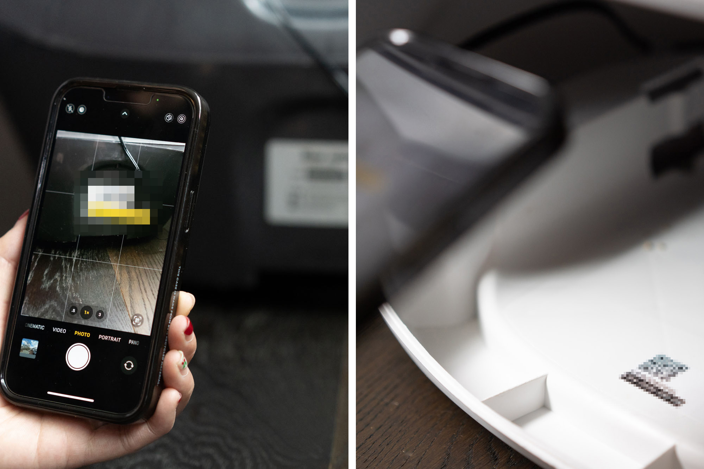

The Litter-Robot 4 wins this one, even if it’s a small detail.  

尽管这只是一个小细节，但 Litter-Robot 4 还是赢了。

Both the Litter-Robot 3 Connect and 4 came fully assembled out of the box, and we just needed to follow Whisker’s [set-up instructions](https://www.litter-robot.com/manual_pdf/Litter-Robot-4-Quick-Start-Guide.pdf) on how to start the machine. Connecting them to the custom Whisker app was the only slightly tricky part of setting up either machine.  

Litter-Robot 3 Connect 和 4 出厂时都已组装完毕，我们只需按照 Whisker 的设置说明启动机器即可。将它们连接到定制的 Whisker 应用程序是设置这两台机器时唯一稍微麻烦的部分。

The Litter-Robot 3 Connect only had the QR code in the lower back in a very hard-to-scan spot. We have our machine in a tight spot, so setup (and subsequent re-connections) required pulling out the device, which wasn’t great because the machine was dirty.  

Litter-Robot 3 Connect 的二维码只印在背面下方一个很难扫描的位置。我们的机器放在一个狭小的地方，因此设置（以及随后的重新连接）需要将设备拉出来，这并不好，因为机器很脏。

The Litter-Robot 4 has a QR code showing when you pull out the litter tray, which makes way more sense. It’s interesting we just happened upon this code because the instruction manual still says it’s only in the back of the machine.  

Litter-Robot 4 有一个二维码，当你拿出猫砂盆时就会显示出来，这就更有意义了。有趣的是，我们只是偶然发现了这个二维码，因为说明书上还说它只在机器后面。

## Waste drawers 垃圾抽屉

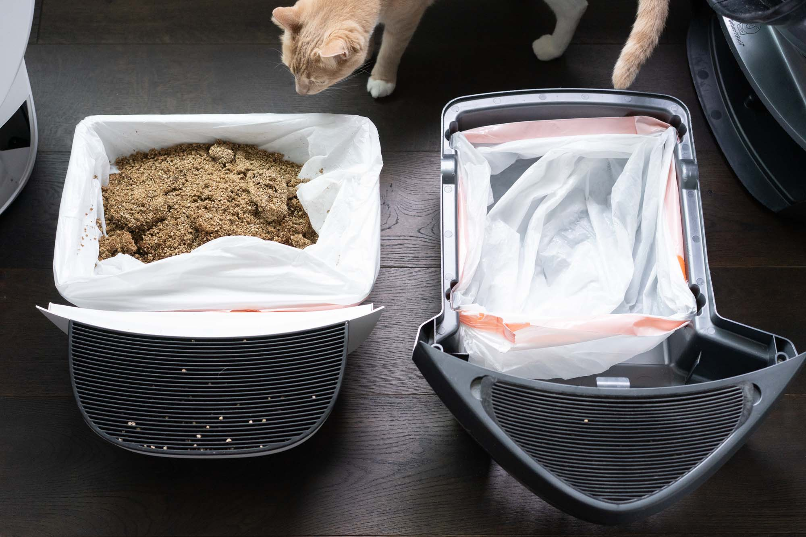

The Litter-Robot 4 wins this category.  

Litter-Robot 4 在这一类别中胜出。

The Litter-Robot 3 Connect has a Drawer Full Indicator that uses infrared emitters and sensors to let us know when the device is full. We were often notified by the app once a week that we needed to change out the waste bag, but once we opened the drawer, there was still a lot of empty space left.  

Litter-Robot 3 Connect 有一个 "抽屉已满指示器"，它使用红外线发射器和传感器让我们知道设备何时已满。我们经常每周都会收到一次应用程序的通知，告诉我们需要更换垃圾袋了，但一旦我们打开抽屉，就会发现里面还有很多空位。

Due to the design, the dirty litter would frequently pile up in the center of the waste drawer. This pile alerted the machine that it was full even when there was plenty of empty space on the sides. We would need to either change out the bag or push dirty litter to the sides to reduce the number of garbage bags we used.  

由于设计原因，脏垃圾经常会堆积在垃圾抽屉的中央。即使抽屉两侧有足够的空位，这堆垃圾也会提醒机器抽屉已满。我们需要更换垃圾袋或将脏垃圾推到两侧，以减少垃圾袋的使用量。

With the Litter-Robot 4, Whisker redesigned the waste drawer shape and added a new distance sensor that better notifies us when the waste drawer is full. The Litter-Robot 4 waste drawer is rectangular, less deep, and slightly wider. We’re notified of a full waste drawer about once every 7-10 days for one cat, and the drawer is full compared to the empty spaces in the Litter-Robot 3 drawer. Another distinct design change of the new unit is it’s designed to have the bag completely cover the waste drawer, whereas in the 3 the bag clips are inside the drawer–which meant sometimes litter fell onto the edges of the bag when sifting and missed the bag. On the Litter-Robot 4 it seems to catch the waste better, with no noticeable increase in litter falling outside of the drawer into the base of the unit.  

在 Litter-Robot 4 上，Whisker 重新设计了垃圾抽屉的形状，并增加了一个新的距离传感器，当垃圾抽屉满了时，它能更好地通知我们。Litter-Robot 4 的垃圾抽屉呈长方形，深度较小，宽度稍宽。与 Litter-Robot 3 抽屉中的空位相比，我们大约每 7-10 天就会收到一次垃圾抽屉满了的通知。新设备在设计上的另一个明显变化是，它的垃圾袋完全覆盖了垃圾抽屉，而在 3 型设备中，垃圾袋夹子是在抽屉内的，这意味着有时在筛选垃圾时，垃圾会掉到垃圾袋的边缘，从而错过了垃圾袋。Litter-Robot 4 似乎能更好地抓住垃圾，垃圾掉落到抽屉外和设备底部的情况没有明显增加。

The new redesign also reduces the time we need to clean up litter bags. If you have extra cash burning a hole in your pocket and want bags that fit the waste drawers perfectly you can [spend between 55 cents to $1 buying them from Litter-Robot](https://www.pntrac.com/t/TUJGR0tLTEJHSklJRkVCR0lKTUZM?sid=lr4vs3&url=https%3A%2F%2Fwww.litter-robot.com%2Flitter-robot%2Faccessories%2Flitter-robot-waste-drawer-liners.html). However, even with this new size and shape drawer on the updated unit, it still fits the same [Kirkland garbage bag](http://buy.geni.us/Proxy.ashx?TSID=22389&GR_URL=https%3A%2F%2Fwww.amazon.com%2Fdp%2FB01LY71217%2F%3Ftag%3Dybdlr4v3-20&dtb=1) size running us about 17.5 cents per bag. Litter-Robot recommends using 9-11 gallon waste bags, but we use 10-13, and they fit just fine.  

新的设计还减少了我们清理垃圾袋的时间。如果您口袋里有多余的钱，想要购买与垃圾抽屉完全匹配的垃圾袋，您可以花 55 美分到 1 美元从 Litter-Robot 购买。不过，即使更新后的设备采用了新尺寸和新形状的抽屉，它仍然适用于同样尺寸的柯克兰垃圾袋，每袋大约 17.5 美分。Litter-Robot 建议使用 9-11 加仑的垃圾袋，但我们使用的是 10-13 加仑的垃圾袋，而且非常合适。

## Litter tracking / scatter  

垃圾跟踪/散落

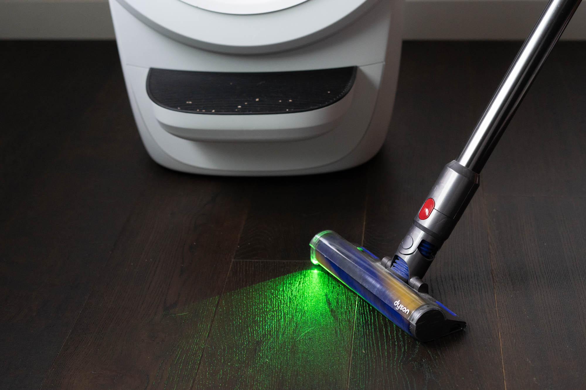

The Litter-Robot 4 wins this one, but we’re not sure how it achieves it.  

Litter-Robot 4 赢得了这场比赛，但我们不知道它是如何做到的。

When using the Litter-Robot 3 Connect, we noticed an equal amount of litter tracking as our manual litter box, even with additional accessories like the fence and ramp. After trying out many [litter mats](https://www.yourbestdigs.com/reviews/cat-litter-mats/), this helped reduce the amount of scatter.  

在使用 Litter-Robot 3 Connect 时，我们注意到垃圾的散落量与手动垃圾箱的垃圾散落量相当，即使使用了栅栏和斜坡等附加配件也是如此。在尝试了多种猫砂垫后，这有助于减少散落量。

After using the Litter-Robot 4 for six months with the included fence attachment, we noticed less litter scattered outside the litter box and throughout the house. While we can’t entirely be sure why this has changed, we think it may be the device’s different design, especially the step platform. We noticed a lot more litter accumulating on the step platform than on the litter mat and the floor. However, it’s important to understand that litter tracking is completely normal in cat behaviors and varies between cats.  

在使用 Litter-Robot 4 和附带的栅栏附件六个月后，我们注意到散落在垃圾箱外和屋内的垃圾少了。虽然我们不能完全确定为什么会发生这样的变化，但我们认为这可能与设备的不同设计有关，尤其是阶梯平台。我们注意到阶梯平台上堆积的猫砂比猫砂垫和地板上多得多。不过，重要的是要明白，猫咪追踪猫砂是完全正常的行为，而且猫咪之间的行为习惯也不尽相同。

No matter what machine you use, or what litter you use, we’ve always experienced some litter tracking. We actually mounted a cordless vacuum nearby (from our [lightweight vacuum review](https://www.yourbestdigs.com/reviews/best-lightweight-vacuum/)) to do a quick cleanup daily.  

无论您使用什么机器，也无论您使用什么垃圾，我们总是会遇到一些垃圾跟踪的问题。实际上，我们在附近安装了一个无线吸尘器（来自我们的轻型吸尘器评测），以便每天进行快速清理。

## Cleaning the machines 清洁机器

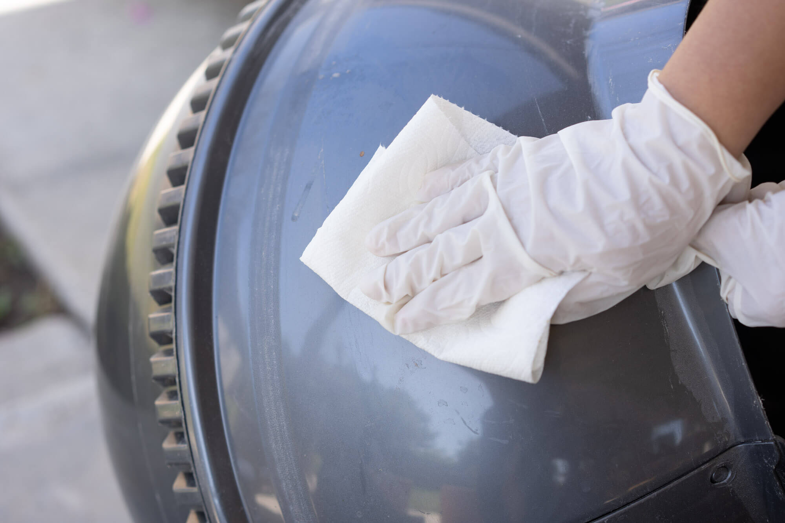

Litter-Robot recommends cleaning the globe portion of the machine every one to three months, but this entirely depends on how many cats use the litter box and how messy it becomes. For both the Litter-Robot 3 Connect and Litter-Robot 4, the cleaning experiences were similar because the parts are similar–a globe that can be hosed down and a more sensitive bonnet and base with electronic control panels and wires.  

Litter-Robot 建议每隔一到三个月清洁一次机器的地球仪部分，但这完全取决于有多少猫在使用猫砂盆以及猫砂盆变得有多脏乱。Litter-Robot 3 Connect 和 Litter-Robot 4 的清洁体验很相似，因为它们的部件都差不多--一个是可以冲洗的地球仪，另一个是更敏感的带有电子控制面板和电线的引擎盖和底座。

Before cleaning anything, we recommend reading the Litter-Robot manuals to avoid damaging your machine. In between deep cleanings, you can easily do wipe-downs on the outer parts of the machine or change out waste drawer liners when it’s full. Deep cleaning both machines take an hour or two of your time because the base and the bonnet can only be wiped down with towels and cleaning sprays due to the fragile electronic parts. There are also many small crevices to vacuum in both variations.  

在清洁之前，我们建议您阅读 Litter-Robot 的使用手册，以免损坏机器。在两次深度清洁之间，您可以轻松地擦拭机器的外部部件，或在机器装满时更换垃圾抽屉衬垫。深度清洁这两台机器需要花费一两个小时的时间，因为底座和引擎盖上的电子零件很脆弱，只能用毛巾和清洁喷雾擦拭。这两款机器还有许多小缝隙需要吸尘。

## Overall experiences 总体经验

After using the Litter-Robot 4 for over six months, we like this machine’s new additions and redesign. Compared to the Litter-Robot 3 Connect, this new iteration is quieter, helps notify us of our cat’s weight, and reduces the number of times we tend to the waste drawer.  

在使用 Litter-Robot 4 6 个多月后，我们喜欢上了这款机器的新功能和重新设计。与 Litter-Robot 3 Connect 相比，这款新产品更安静，能帮助我们了解猫咪的体重，减少我们清理垃圾抽屉的次数。

Even though both devices look like large litter boxes, the new redesign is also a more minimalist and sleeker design. While we loved using the Litter-Robot 3 Connect, we can’t deny it’s a large eyesore that we pushed towards the corner of our laundry room. Whisker also sells [furniture](https://www.pntra.com/t/TUJGR0tLTEJHSklJRkVCR0lKTUZM?sid=lr4vs3&url=https%3A%2F%2Fwww.litter-robot.com%2Fcat-furniture%2Fcoffee-oak-storage-cabinet.html%3FclickId%3D4300020118) that hides the Litter-Robot 3 Connect too, if you want to disguise the machine in your home.  

尽管这两款设备看起来都像大型垃圾箱，但新的设计也更加简约时尚。虽然我们很喜欢使用 Litter-Robot 3 Connect，但也不能否认它是个大碍眼的东西，我们把它推到了洗衣房的角落。如果您想在家中隐藏 Litter-Robot 3 Connect，Whisker 还出售可以隐藏它的家具。

## Conclusion: Is the Litter-Robot 4 worth the cost?  

结论Litter-Robot 4 值得购买吗？

The Litter-Robot family is a luxury item that will help lessen the load of scooping up kitty litter, so we can assume it’s not necessary for some cat parents. At $549, the [Litter-Robot 3 Connect](https://www.pntra.com/t/TUJGR0tLTEJHSklJRkVCR0lKTUZM?sid=lr4vs3&url=https%3A%2F%2Fwww.litter-robot.com%2Flitter-robot-iii-open-air-with-connect.html) is already a high-priced item and we still think it’s a great automatic litter box option to have compared to any manual scooping setup. The [Litter-Robot 4](https://www.pjtra.com/t/TUJGR0tLTEJHSklJRkVCR0lKTUZM?sid=lr4vs3&url=https%3A%2F%2Fwww.litter-robot.com%2Flitter-robot-4.html) makes many small improvements across the board which are arguably all nice to have but not essential. If you can afford the price increase, we think the Litter-Robot 4 is worthwhile.  

Litter-Robot 系列产品是一种奢侈品，可以帮助减轻舀猫砂的负担，因此我们可以认为它对某些猫家长来说并非必要。Litter-Robot 3 Connect 的售价为 549 美元，已经算是高价产品了，但我们仍然认为，与任何手动舀砂装置相比，它都是一个不错的自动猫砂盆选择。Litter-Robot 4 在各方面都做了许多微小的改进，可以说这些改进都是值得拥有的，但并非必不可少。如果您能承受价格的上涨，我们认为 Litter-Robot 4 是值得拥有的。

Bryan Vu, Editor 编辑 Bryan Vu

Bryan is our cooking and kitchen expert, with more than 15 years of experience of cooking and testing kitchen products. When outside of the kitchen, he enjoys woodworking, photography, videography and figuring out how to live a more eco-friendly lifestyle. He thoroughly enjoys discovering the best, whether it’s ingredients or equipment, and finding products that can stand the rigors of daily use.  

布莱恩是我们的烹饪和厨房专家，拥有超过 15 年的烹饪和厨房产品测试经验。在厨房之外，他还喜欢木工、摄影、摄像以及研究如何过一种更加环保的生活方式。他非常喜欢发现最好的产品，无论是食材还是设备，以及经得起日常使用考验的产品。

## More Reviews 更多评论

