20 September 2021 was the first day I became unemployed and started working for myself.  

2021 年 9 月 20 日是我失业并开始为自己工作的第一天。

It’s the best decision I’ve ever made. Working for myself gives me a freedom I’ve never experienced before.  

这是我做过的最好的决定。为自己工作给了我前所未有的自由。

Over the past two years, I have:  

在过去的两年里，我

-   created **four** small but successful products (all will be mentioned later in this post)  
    
    创造了四个小而成功的产品（本帖稍后将提及所有产品）
    
-   built an audience of **97K followers** on Twitter  
    
    在 Twitter 上拥有 9.7 万粉丝
    
-   created this newsletter with **6,000+** subscribers  
    
    创建了这份拥有 6000 多名订阅者的时事通讯
    
-   jumped on **the AI hype train** and successfully created a product with it  
    
    搭上了人工智能的快车，并成功地利用人工智能创造了产品
    
-   and survived a drama that **almost killed** my business  
    
    在一场差点毁了我生意的闹剧中幸存下来
    

At the moment, my total revenue across all products is about $45K/month at ~90% profit.  

目前，我所有产品的总收入约为每月 4.5 万美元，利润约为 90%。

I want to take this opportunity to write a recap of my journey so far. I hope this will be helpful for people who are looking to become their own boss one day.  

我想借此机会总结一下我迄今为止的心路历程。希望这对那些有朝一日想自己当老板的人有所帮助。

[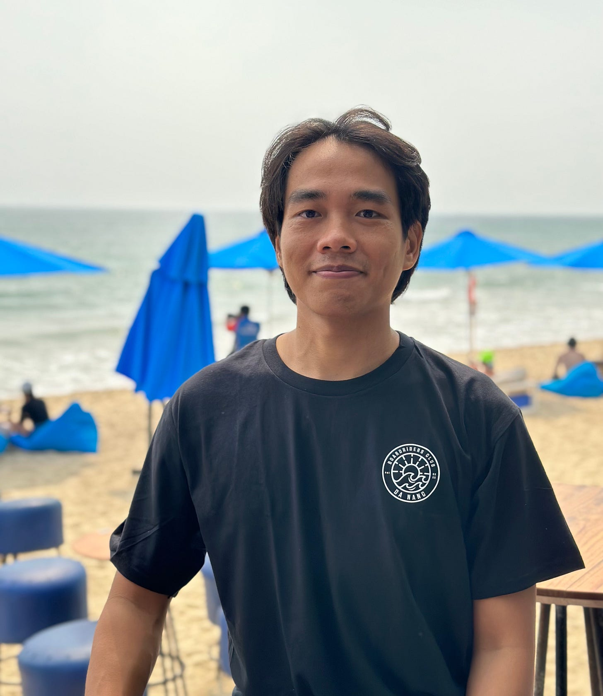](https://substackcdn.com/image/fetch/f_auto,q_auto:good,fl_progressive:steep/https%3A%2F%2Fsubstack-post-media.s3.amazonaws.com%2Fpublic%2Fimages%2F9eacc001-a04d-40b0-9795-6faabaf292e5_3024x3491.jpeg)

This is me in Da Nang City, Vietnam :)  

这是我在越南岘港市 :)

Before quitting my job, I was a software engineer with 7 years of experience (in 2021).  

辞职前，我是一名软件工程师，拥有 7 年工作经验（2021 年）。

I love building software. My first software product was built with Visual Basic 6 in high school. Throughout my career, I have always had some side projects along with my full-time job.  

我喜欢构建软件。我的第一个软件产品是在高中时用 Visual Basic 6 制作的。在我的职业生涯中，除了全职工作之外，我还有一些兼职项目。

Below is a summary of my full career history:  

以下是我全部职业生涯的总结：

[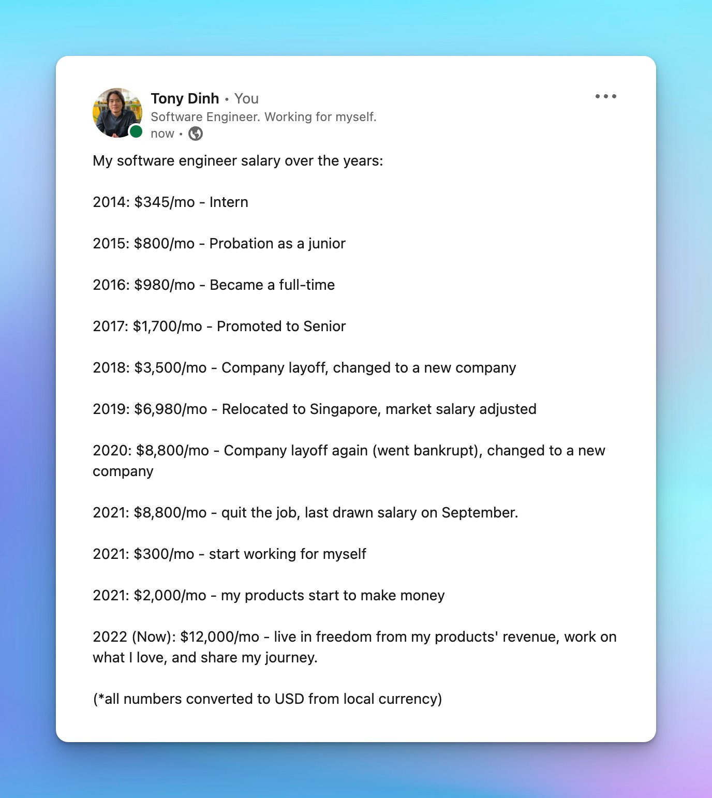](https://substackcdn.com/image/fetch/f_auto,q_auto:good,fl_progressive:steep/https%3A%2F%2Fsubstack-post-media.s3.amazonaws.com%2Fpublic%2Fimages%2F5e84a260-69b4-422c-8ea5-f863894c1ba5_1376x1542.jpeg)

Thanks to 7 years working in the industry, I picked up a lot of useful skills: frontend, backend, DevOps, mobile apps, game dev, and a bit of UX/UI design.  

由于在该行业工作了 7 年，我掌握了很多有用的技能：前端、后端、DevOps、移动应用程序、游戏开发以及一些用户体验/用户界面设计。

These skills became my biggest advantage and have helped me tremendously later in my journey.  

这些技能成为我最大的优势，在我后来的人生旅途中帮了我大忙。

Early 2020, COVID happened. I was forced to work remotely alone at home (in a foreign country).  

2020 年初，COVID 发生了。我被迫独自在家（在外国）远程工作。

It was incredibly boring.  

真是无聊透顶。

I discovered [IndieHackers.com](http://indiehackers.com/) and started listening to their podcast every day. I got really inspired by the stories of successful indie hackers like [Pieter Levels](https://twitter.com/levelsio), [Kyle Gawley](https://twitter.com/kylegawley), [Jon Yongfook](https://twitter.com/yongfook) (and many more).  

我发现了 IndieHackers.com，并开始每天收听他们的播客。Pieter Levels、Kyle Gawley、Jon Yongfook（还有很多）等成功独立黑客的故事给了我很大启发。

The inspiration, the boredom of COVID, and the extra time I got from not having to commute to work led me back to my passion: building software products.  

灵感、COVID 的无聊以及不用上下班所带来的额外时间，让我重新找回了自己的激情：开发软件产品。

So I gave it a try. I started working on a new side project with the hope of generating some revenue.  

于是我就试了一下。我开始做一个新的副业，希望能创造一些收入。

My first attempt was to build a log viewer macOS app.  

我的第一次尝试是制作一个日志查看器 macOS 应用程序。

As a good software engineer, I wanted the app to have a beautiful UI, tons of features, a comprehensive architecture, and a unit test suite with >95% test coverage.  

作为一名优秀的软件工程师，我希望应用程序拥有漂亮的用户界面、丰富的功能、全面的架构以及测试覆盖率大于 95% 的单元测试套件。

This is the failed app, I still have it in my Xcode  

这就是失败的应用程序，我的 Xcode 中还保留着它

I worked on it for ~6 months. I felt like the project would never finish. Then, I got bored and abandoned the project.  

我为此工作了大约 6 个月。我觉得这个项目永远也做不完。后来，我觉得无聊，就放弃了这个项目。

It failed spectacularly. 它失败得一塌糊涂。

But at least I got something from it: I gained a lot of experience working with Swift, which means I can build macOS and iOS apps much faster now.  

但至少我从中有所收获：我获得了很多使用 Swift 的经验，这意味着我现在可以更快地构建 macOS 和 iOS 应用程序。

It took me a while to recover from my first failure.  

我花了一段时间才从第一次失败中恢复过来。

About a month later, I decided to give it another try (and this time, you can be certain that I wrote zero test cases 😂).  

大约一个月后，我决定再试一次（可以肯定的是，这次我没有写测试用例😂）。

I built the first version of [DevUtils](https://devutils.com/) in about 2 weeks. It’s an app that bundles all the frequently used developer tools into one unified interface that works offline on your macOS.  

我用了大约两周时间就开发出了 DevUtils 的第一个版本。这是一款将所有常用开发工具集成到一个统一界面的应用程序，可在 macOS 上离线运行。

[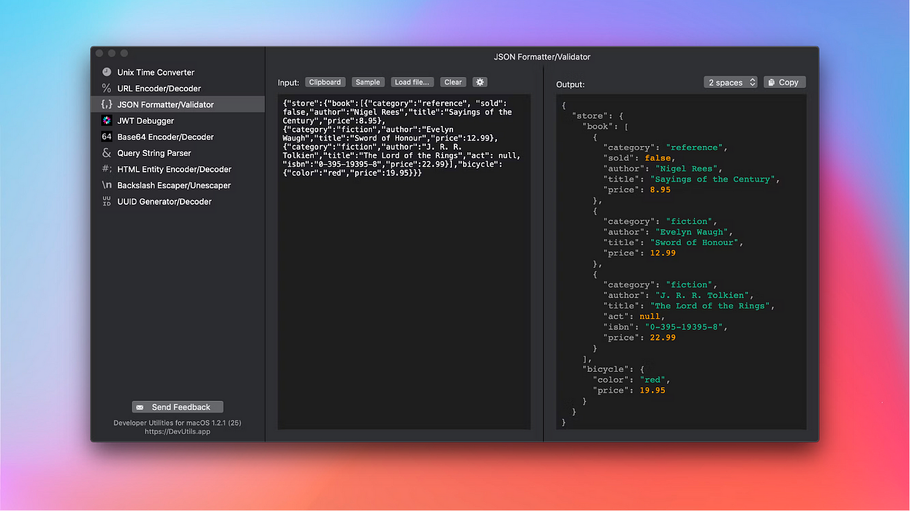](https://substackcdn.com/image/fetch/f_auto,q_auto:good,fl_progressive:steep/https%3A%2F%2Fsubstack-post-media.s3.amazonaws.com%2Fpublic%2Fimages%2F33cd31d6-2589-4cc5-9dde-88cd91e03775_1600x900.png)

I sent the app to friends, family, and co-workers to use (for free) and received some good feedback. People love the app!  

我把这个应用程序发给朋友、家人和同事使用（免费），收到了一些很好的反馈。大家都很喜欢这个应用程序！

That was the sign I was looking for. I was excited and decided to add payment to the app: $9 - a one-time purchase to use the app forever.  

这就是我一直在寻找的信号。我很兴奋，决定为应用添加支付功能：9 美元--一次性购买，永久使用。

Then, I [posted the app on Hacker News](https://news.ycombinator.com/item?id=24604291). I think I got lucky, the post received some positive comments, and I got to the top of Hacker News for a few hours.  

然后，我在 Hacker News 上发布了这个应用。我想我很幸运，帖子收到了一些积极的评论，我也登上了 Hacker News 的头条几个小时。

[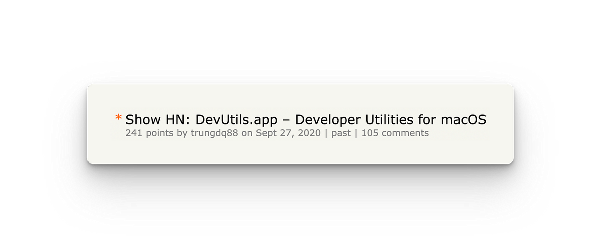](https://substackcdn.com/image/fetch/f_auto,q_auto:good,fl_progressive:steep/https%3A%2F%2Fsubstack-post-media.s3.amazonaws.com%2Fpublic%2Fimages%2F6491b00f-8ae2-4d5e-9883-3e299409004a_1600x662.png)

And that’s how I got my first ever internet dollar. I jumped like crazy in my bedroom in Singapore (I was still working full-time at the time).  

就这样，我在互联网上赚到了第一笔钱。我在新加坡的卧室里疯狂地跳了起来（当时我还在做全职工作）。

Things started to slow down after the initial traffic spike from the Hacker News front page. I posted the app [on Product Hunt](https://www.producthunt.com/products/devutils#devutils) and got another traffic spike, and that was it.  

在 Hacker News 头版的流量激增之后，情况开始放缓。我在 Product Hunt 上发布了这款应用，流量再次飙升，仅此而已。

A week after that, I rarely get any visitors to the website. No more sales.  

一周后，我的网站就很少有访客了。没有更多的销售。

I knew that posting the app to websites and forums on the internet and hoping for a traffic spike wouldn’t work in the long term. I can’t get lucky forever.  

我知道，在互联网上的网站和论坛上发布应用程序，希望流量激增，从长远来看是行不通的。我不可能永远走运。

So, I started to look for a long-term distribution channel.  

于是，我开始寻找长期的销售渠道。

I tried Google paid ads, wrote SEO articles, looked for sponsorships on newsletter/YouTube channels, and tons of other things.  

我尝试了谷歌付费广告、撰写搜索引擎优化文章、在时事通讯/YouTube 频道上寻找赞助商等各种方法。

There were some small results, but in the end, I didn’t see a way that could give me traffic for the long-term without continuous effort. (Except for SEO, but SEO is extremely slow to see the results)  

虽然取得了一些微小的成果，但最终，我还是没有看到一种方法能让我在不持续努力的情况下长期获得流量。(搜索引擎优化除外，但搜索引擎优化见效极慢）

This is when I think about Twitter and the #buildinpublic community.  

这时，我想到了 Twitter 和 #buildinpublic 社区。

I decided to give it a try to become a Twitter influencer.  

我决定试一试，成为一名 Twitter 有影响力的人。

The plan was that if I could get a lot of followers, I would have a consistent flow of traffic to DevUtils without doing much.  

我的计划是，如果能获得大量追随者，我就能为 DevUtils 带来源源不断的流量，而无需做太多事情。

And so, I reactivated my old Twitter account and started building my personal brand. Most of my tweets were about DevUtils and it was quite boring.  

于是，我重新激活了以前的 Twitter 账户，开始打造我的个人品牌。我的大部分推文都是关于 DevUtils 的，非常无聊。

I quickly learned that tweeting about DevUtils alone wasn’t going to help me gain followers. People just don’t care.  

我很快就发现，仅仅在推特上宣传 DevUtils 并不能帮助我获得粉丝。人们根本不在乎。

Sure, I engaged with other people in the community, replied to their tweets, made jokes, and was just hanging around. But in the end, if I don’t have something interesting on my own timeline, people have no reason to follow me. Just tweeting about DevUtils wasn’t going to cut it.  

当然，我也与社区里的其他人互动，回复他们的推文，开他们的玩笑，只是四处闲逛。但归根结底，如果我自己的时间轴上没有有趣的内容，人们就没有理由关注我。仅仅在推特上谈论 DevUtils 是行不通的。

I needed to do something interesting to get the attention.  

我需要做些有趣的事情来吸引大家的注意。

So I started doing a lot of fun stuff, using my skills and advantages: coding.  

于是，我开始利用自己的技能和优势做很多有趣的事情：编码。

For example, this experiment is [my first ever “viral” tweet](https://twitter.com/tdinh_me/status/1378995883090452481) with 100+ likes:  

例如，这次实验是我第一次 "病毒式 "推文，获得了 100 多个赞：

[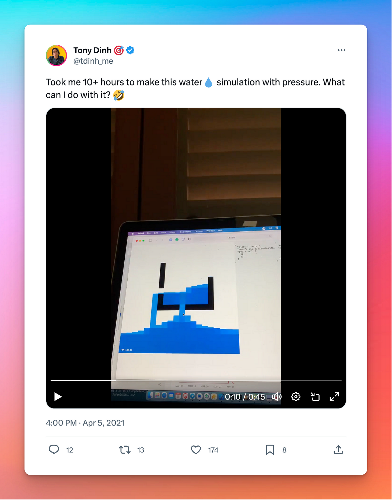](https://substackcdn.com/image/fetch/f_auto,q_auto:good,fl_progressive:steep/https%3A%2F%2Fsubstack-post-media.s3.amazonaws.com%2Fpublic%2Fimages%2F8ff79375-94b2-45f1-850e-11ed5a7185c4_1472x1874.png)

In summary, my Twitter strategy was:  

总之，我的推特策略是

-   Build interesting stuff and share it in public  
    
    建造有趣的东西并公开分享
    
-   Engage with other people 与他人互动
    
-   Write threads 写线程
    
-   A lot of memes and jokes  
    
    大量的备忘录和笑话
    
-   Overall, be an interesting person and be nice  
    
    总之，要做一个有趣的人，要友善
    

After 6 months of consistently doing this, from 100 followers in November 2020, I grew my account to [700 followers](https://twitter.com/tdinh_me/status/1388789631420796931) in May 2021.  

经过 6 个月的坚持，我的账户从 2020 年 11 月的 100 名粉丝增长到 2021 年 5 月的 700 名粉丝。

I considered [Black Magic](https://blackmagic.so/) to be my first ever “real” business because it has a subscription pricing model with recurring revenue.  

我认为 Black Magic 是我的第一个 "真正 "的生意，因为它采用的是订阅定价模式，有经常性收入。

This is how it started.  

事情就是这样开始的。

Around May 2021, when I was approaching 1,000 followers on Twitter, I decided to do something special to celebrate it (and also to get more engagements!).  

2021 年 5 月左右，当我在 Twitter 上的粉丝接近 1000 人时，我决定做一些特别的事情来庆祝（同时也是为了获得更多的参与！）。

By looking around the Twitter API document, I learned that I can update the profile picture via API. So, I built a small script that shows a progress bar around my profile picture.  

通过查看 Twitter API 文档，我了解到可以通过 API 更新个人资料图片。于是，我编写了一个小脚本，在我的个人主页图片周围显示一个进度条。

[The progress bar](https://twitter.com/tdinh_me/status/1391980513573806081) would get closer and closer to 100% as I get to 1,000 followers.  

当我的粉丝数达到 1000 人时，进度条会越来越接近 100%。

People loved the idea so much! So, I turned the script into a web app and added a $4/month subscription fee for the “Pro” version, where people can customize the progress bar color.  

人们非常喜欢这个想法！于是，我把脚本变成了一个网络应用程序，并为 "专业版 "增加了每月 4 美元的订阅费用，在这个版本中，人们可以自定义进度条的颜色。

And that was how I got my [first ever recurring revenue dollar](https://twitter.com/tdinh_me/status/1399225474006478849)!  

就这样，我获得了我的第一笔经常性收入！

At this time, I was still working at full-time job.  

此时，我仍在从事全职工作。

Embraced the traction, I worked on Black Magic with all the free time I had.  

我接受了牵引，利用所有空闲时间制作《黑魔法》。

I added many other features to Black Magic, mostly Twitter tools that help users create more engagements.  

我为 "黑魔法 "添加了许多其他功能，主要是帮助用户创造更多参与机会的 Twitter 工具。

By building and tweeting at the same time, both my MRR (monthly recurring revenue) and my followers were increasing fast.  

通过同时创建和发布推文，我的 MRR（每月经常性收入）和粉丝数量都在快速增长。

By August 2021, I have:  

到 2021 年 8 月，我已经

-   ~$300 MRR from Black Magic  
    
    来自黑魔法的 ~300 美元 MRR
    
-   ~$200/mo from DevUtils ~从 DevUtils 每月约 200 美元
    
-   ~8,000 followers ~8,000 名追随者
    
-   ~1,500 active users (most are free users)  
    
    ~1 500 名活跃用户（大部分为免费用户）
    

Overall, there is great momentum. I felt confident that I might actually have a shot at making a living out of Black Magic and DevUtils.  

总的来说，势头很好。我觉得自己有信心在 Black Magic 和 DevUtils 中谋生。

That was when I handed in my notice, officially quitting my job. 20 September 2021 was my last working day and my first day as a full-time indie hacker.  

就在那时，我递交了辞呈，正式辞职。2021 年 9 月 20 日是我最后一个工作日，也是我成为全职独立黑客的第一天。

I remember I went outside for a walk, took a fresh breath of air, and felt the freedom I never experienced before.  

我记得我出去散步，呼吸新鲜空气，感受到了从未有过的自由。

[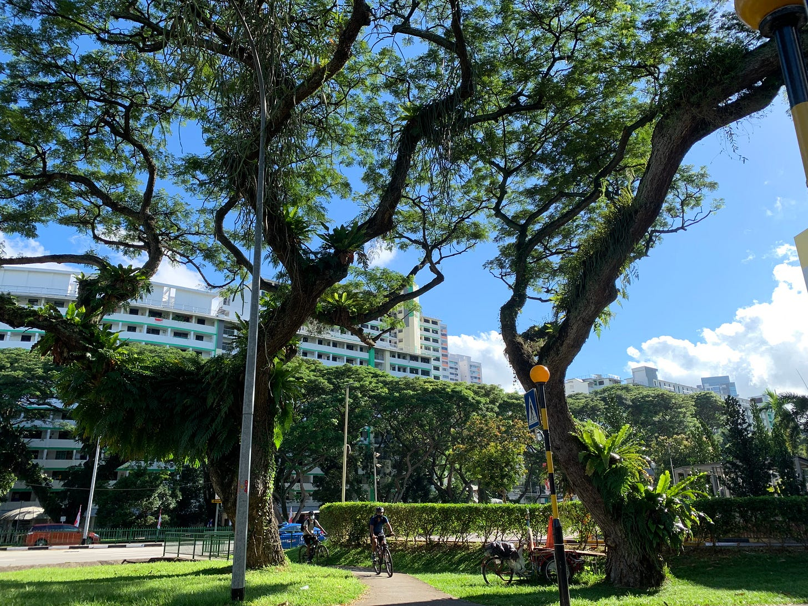](https://substackcdn.com/image/fetch/f_auto,q_auto:good,fl_progressive:steep/https%3A%2F%2Fsubstack-post-media.s3.amazonaws.com%2Fpublic%2Fimages%2Fbba76f3f-6a7c-40c1-b33f-08011defab5b_4032x3024.jpeg)

The park near my place when I was working in Singapore.  

我在新加坡工作时，住处附近的公园。

Around the same time, I started writing a newsletter (this newsletter!). If you are a long-time reader, you may remember I wrote about it in detail. Here is the post:  

大约在同一时间，我开始撰写时事通讯（本时事通讯！）。如果您是我的老读者，可能还记得我曾详细介绍过它。下面是这篇文章：

I have a saving of 2 years in the bank. If I lived in Vietnam (my hometown), I could easily go as far as 4 years without revenue. My backup plan was to just get back to a full-time job if things didn’t work out.  

我在银行有两年的存款。如果我住在越南（我的家乡），我可以很轻松地过上 4 年没有收入的生活。我的后备计划是，如果事情不顺利，就重新做一份全职工作。

At the time, I didn’t have a family yet, no wife, and no kid. It was the best time for me to make the biggest bet of my life. So I did.  

当时，我还没有成家，没有妻子，也没有孩子。对我来说，这是下人生最大赌注的最佳时机。所以我赌了。

My goal was to get to $1K MRR in the first year, which would be enough for me to live comfortably in Vietnam forever.  

我的目标是在第一年达到 1,000 美元的 MRR，这将足够我在越南舒适地生活一辈子。

Since quitting my job, I spent all of my time working on Black Magic/DevUtils, and still keep tweeting to build an audience.  

辞职后，我把所有时间都花在了黑魔法/DevUtils 上，并仍然坚持发推文，以积累受众。

The growth started to pick up. I added many new features to Black Magic, most noticeably [the Magic Sidebar](https://twitter.com/tdinh_me/status/1449394099014934532) – a Chrome extension for Twitter that provides Analytics & CRM features.  

增长开始加快。我为 Black Magic 添加了许多新功能，其中最引人注目的是 Magic Sidebar，它是 Twitter 的 Chrome 扩展，提供分析和 CRM 功能。

This feature single-handedly changed Black Magic as a product forever. From being a fun engagement tool to becoming a true painkiller and solving big problems that many big Twitter accounts had at the time.  

这一功能彻底改变了 "黑魔法 "这一产品。从一个有趣的参与工具变成了真正的止痛药，解决了当时许多大型 Twitter 账户的大问题。

Later, I pivoted the whole product around this feature. I changed the landing page to exclusively talk about this feature instead of the profile progress bar and other fun features. You can see it at [BlackMagic.so](https://blackmagic.so/).  

后来，我围绕这一功能对整个产品进行了调整。我把登陆页面改成了专门讨论这个功能，而不是个人资料进度条和其他有趣的功能。你可以在 BlackMagic.so 上看到它。

Within a few months, by building, tweeting, and launching the product on Product Hunt, my monthly revenue grew to $4K MRR.  

几个月内，通过构建、推特宣传以及在 Product Hunt 上发布产品，我的月收入增长到了 4K 美元的 MRR。

[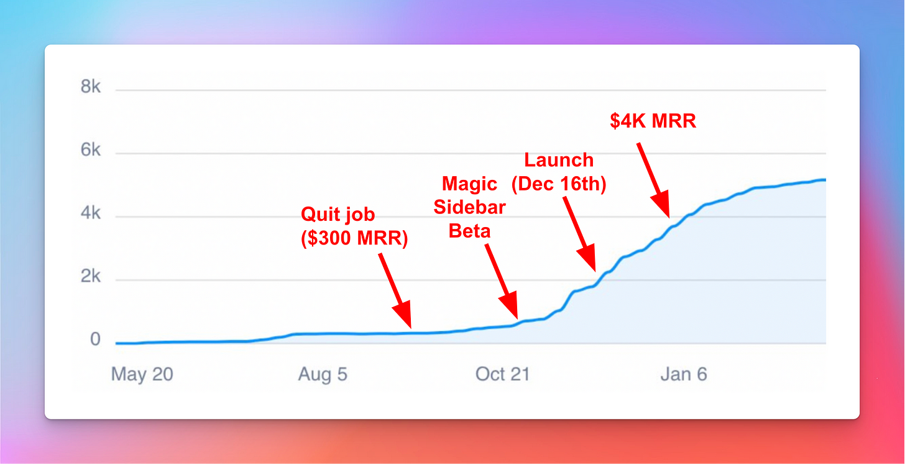](https://substackcdn.com/image/fetch/f_auto,q_auto:good,fl_progressive:steep/https%3A%2F%2Fsubstack-post-media.s3.amazonaws.com%2Fpublic%2Fimages%2F03dfc793-d5c6-45b0-a5ae-3da828cc64cc_3036x1560.png)

There’s a lot going on during this period. Luckily, I’ve written about everything in this newsletter once a month like a machine.  

这期间发生了很多事情。幸运的是，我像一台机器一样，每月一次在这份通讯里写下了一切。

You can read the related posts in this period here:  

您可在此阅读本期的相关文章：

[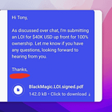](https://news.tonydinh.com/p/322-2k-mrr-in-60-days-by-building-in-public-910564)

[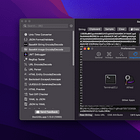](https://news.tonydinh.com/p/jan-2022-updates-4k-mrr-new-release-new-features-new-learnings-940315)

By February 2022, I have reached $4K MRR and 28K followers on Twitter, far beyond my goal.  

到 2022 年 2 月，我的 MRR 已达 4000 美元，Twitter 上的追随者达 28000 人，远远超出了我的目标。

In the first few months after quitting my job, I worked a lot. Probably 12 hours a day, or even 16 hours/day if you also count Twitter as “work”.  

辞职后的头几个月，我工作了很多。每天大概工作 12 个小时，如果把 Twitter 也算作 "工作 "的话，每天甚至工作 16 个小时。

So when I reached $4K MRR, a decent amount considering my living cost in Vietnam, I started to slow down.  

因此，当我的 MRR 达到 4000 美元时，考虑到我在越南的生活费用，这已经是个不错的数字了，我开始放慢脚步。

I still want to get more revenue, but I realized that this is a moving goalpost, and it will never stop. $10K, then $20K, then $50K. I knew I would never satisfied.  

我仍然希望获得更多收入，但我意识到这是一个移动的目标，永远不会停止。1 万美元，然后是 2 万美元，然后是 5 万美元。我知道我永远不会满足。

It’s much better to work and play at the same time.  

同时工作和娱乐会更好。

So I traveled. I went for a trip around Vietnam.  

于是我去旅行。我环游了越南。

My average working hours during this period was about 4 hours/day. I still tweet a lot.  

在此期间，我的平均工作时间约为每天 4 小时。我仍然经常发微博。

Around September 2022, something magical happened: I was invited to the Indie Hacker podcast! The very podcast that I listened to every day when I started out. It was like a dream come true!  

大约在 2022 年 9 月，神奇的事情发生了：我被邀请参加独立黑客播客！我刚开始创业时每天都听的播客。这就像是梦想成真！

The podcast was released on [22nd September 2022](https://twitter.com/tdinh_me/status/1572743468585463810), almost exactly one year after I quit my job.  

播客于 2022 年 9 月 22 日发布，几乎正好是我辞职一年后。

Fast forward to October 2022, Black Magic grew to $13K MRR steadily.  

快进到 2022 年 10 月，"黑魔法 "的 MRR 稳步增长到 1.3 万美元。

[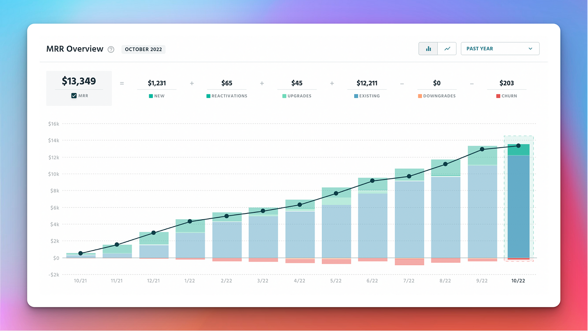](https://substackcdn.com/image/fetch/f_auto,q_auto:good,fl_progressive:steep/https%3A%2F%2Fsubstack-post-media.s3.amazonaws.com%2Fpublic%2Fimages%2Fa48db81e-ff8f-47fe-b1fe-52f853107bd3_1600x901.png)

Besides working on my existing products, I experimented and tried new things all the time.  

除了在现有产品上下功夫，我还不断尝试新的东西。

I built several small products, some of which failed (EmojiAI, AskCommand).  

我开发了几个小产品，其中一些失败了（EmojiAI、AskCommand）。

One of them, **[Xnapper](https://xnapper.com/)** - a screenshot app, picked up my [audience's interest](https://twitter.com/tdinh_me/status/1530118451540684801) and became my 3rd successful product. It’s now making **$6K/month**.  

其中一款名为 Xnapper 的截图应用程序引起了我的受众的兴趣，并成为我第三个成功的产品。现在它的月收入达到了 6000 美元。

I’ve written more about how Xnapper started in this post:  

我在这篇文章中详细介绍了 Xnapper 是如何起步的：

Working on multiple products allowed me to switch between them when I feel bored with one product, reducing my stress.  

当我对一种产品感到厌倦时，就可以在多种产品之间切换，从而减轻压力。

It’s also a good way to have a fresh new content for the Twitter audience. I was embracing “build in public” and I shared about everything when I was building the app.  

这也是为 Twitter 受众提供新鲜内容的好方法。我接受 "在公开场合构建 "的理念，在构建应用程序时我分享了一切。

For example, [this tweet](https://twitter.com/tdinh_me/status/1539895622069022720) showing the mobile app demo got 1,700 likes! It’s almost like free marketing.  

例如，这条展示移动应用程序演示的推文就获得了 1,700 个赞！这几乎就是免费营销。

[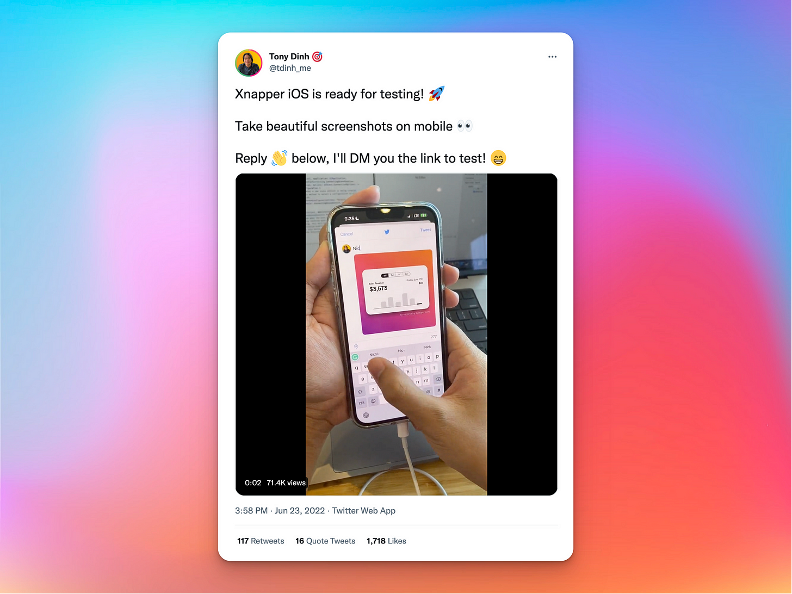](https://substackcdn.com/image/fetch/f_auto,q_auto:good,fl_progressive:steep/https%3A%2F%2Fsubstack-post-media.s3.amazonaws.com%2Fpublic%2Fimages%2Fc1af305d-90b5-4e3f-bd2a-7886ff4b8bae_2000x1500.png)

Around February 2023, shortly after Elon Musk bought Twitter, they announced that Twitter API (which Black Magic is using) will no longer be free.  

大约在 2023 年 2 月，也就是埃隆-马斯克收购 Twitter 后不久，他们宣布 Twitter API（黑魔法正在使用）将不再免费。

I didn’t think this would be a big deal. I was making good money from Black Magic and would be happy to pay.  

我觉得这没什么大不了的。我从《黑魔法》中赚了不少钱，很乐意付钱。

Little did I know that, the price was announced **$42K/month** (per month, not per year). There was a smaller plan at $100/month, but the restrictions and limits are so low that you can’t even run a weather bot with it.  

我不知道的是，当时公布的价格是每月 4.2 万美元（每月，而不是每年）。还有一个更小的计划，每月 100 美元，但限制和限额太低，你甚至不能用它运行天气机器人。

Black Magic was at $14K MRR at the time. That means there’s no way I could afford the API price.  

Black Magic 当时的 MRR 为 1.4 万美元。这意味着我不可能负担得起 API 的价格。

I was “forced” to either shut down or sell.  

我 "被迫 "要么关闭，要么出售。

Long story short, I sold Black Magic for **$128K**. You can read about the whole story here:  

长话短说，我以 12.8 万美元的价格卖掉了《黑魔法》。您可以在这里阅读整个故事：

As of now, I no longer own Black Magic, but I still love the product and use it every day.  

现在，我已不再拥有 Black Magic，但我仍然很喜欢这款产品，每天都在使用。

The funny thing is, a few months later, Twitter changed their mind about the pricing. They introduced a new plan at $5,000/month.  

有趣的是，几个月后，Twitter 改变了定价。他们推出了一个新计划，每月 5000 美元。

This plan comes with some restrictions and API limits, it may or may not work for Black Magic, but I didn’t even bothered to check, because it was no longer matter.  

该计划有一些限制和 API 限制，可能适用于 Black Magic，也可能不适用于 Black Magic，但我甚至懒得去查，因为这已经不重要了。

So that was my first product exit. Not the way I wanted, but there was nothing I could do.  

这就是我的第一次产品退出。虽然事与愿违，但我也无能为力。

Around the same time, I started working on a new product: Typing Mind.  

大约在同一时间，我开始开发一款新产品：Typing Mind。

OpenAI [announced the ChatGPT API](https://openai.com/blog/introducing-chatgpt-and-whisper-apis) on March 1, 2023. I’ve been using ChatGPT via the web interface for a while at that point.  

OpenAI 于 2023 年 3 月 1 日发布了 ChatGPT API。那时我已经通过网页界面使用 ChatGPT 有一段时间了。

The web interface was very limited and I get annoyed by it for a long time. For example, you can’t search your previous chats, the text output was slow, etc. Most annoyingly, the app logged you out and you had to login again every day, which was extremely frustrating.  

网络界面非常有限，我为此烦恼了很长时间。例如，你无法搜索以前的聊天记录，文本输出速度很慢，等等。最令人讨厌的是，应用程序会自动注销，你必须每天重新登录，这让人非常沮丧。

At some point I was thinking of writing a Chrome extension to scratch my own itch.  

我曾一度想编写一个 Chrome 浏览器扩展来挠痒痒。

OpenAI releasing the API was exactly what I was wating for. I immediately think of writing a better UI for ChatGPT using the API.  

OpenAI 发布 API 正是我所期待的。我立即想到使用 API 为 ChatGPT 编写更好的用户界面。

The next day, I registered the domain name [typingmind.com](https://www.typingmind.com/) and started working on the prototype for a few hours.  

第二天，我注册了域名 typingmind.com，并花了几个小时开始制作原型。

The Twitter drama kept me busy for the rest of the week, but I managed to get the first version of Typing Mind finished on the weekend.  

推特事件让我在本周剩下的时间里忙得不可开交，但我还是设法在周末完成了《打字思维》的第一版。

On Monday, 6th March 2023, I released the first version to the public, and [announced it on Twitter](https://twitter.com/tdinh_me/status/1632631838866051074).  

2023 年 3 月 6 日星期一，我在 Twitter 上向公众发布了第一个版本。

[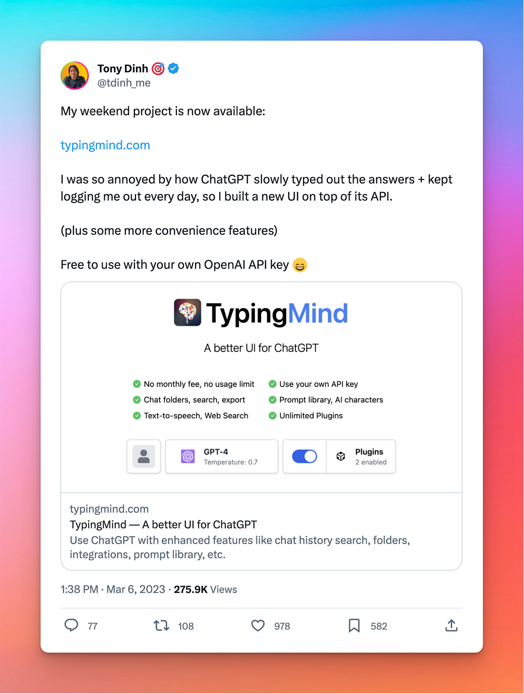](https://substackcdn.com/image/fetch/f_auto,q_auto:good,fl_progressive:steep/https%3A%2F%2Fsubstack-post-media.s3.amazonaws.com%2Fpublic%2Fimages%2F5383e8fb-0d4e-49bc-913d-9e7ad7f2c20a_1472x1948.png)

The app immediately received a lot of traction.  

该应用程序立即受到了广泛关注。

I added a paid plan at **$9**, then slowly increased the price as I add more features to the app in the next few days (it’s now priced at **$39**)  

我添加了一个 9 美元的付费计划，然后在接下来的几天里，随着我为应用程序添加更多功能，价格会慢慢提高（现在的价格为 39 美元）。

Within the first day of releasing the app, I made $1K of revenue, then $2K the next day, then $4K the next day.  

在发布应用程序的第一天，我就获得了 1,000 美元的收入，第二天赚了 2,000 美元，第二天赚了 4,000 美元。

In 7 days, I made a total of **$22K** of license revenue.  

7 天内，我总共获得了 2.2 万美元的许可证收入。

[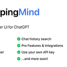](https://news.tonydinh.com/p/making-22k-in-7-days-the-story)

Typing Mind has become my primary focus since April. I’ve been adding features, improving the product, and building a [B2B version](https://custom.typingmind.com/) for companies to create their own ChatGPT UI. The app is currently making ~**$30K/month** revenue on average.  

自四月份以来，Typing Mind 已成为我的主要工作。我一直在增加功能、改进产品，并为公司创建自己的 ChatGPT UI 打造 B2B 版本。该应用目前的平均月收入约为 3 万美元。

And this is where I am at right now.  

这就是我现在的处境。

One thing significantly changed in my 2nd year is that I have started to build a team.  

在我工作的第二年，有一件事发生了重大变化，那就是我开始组建一个团队。

I’ve always prefer to go solo. Working alone mean I don’t have to spend time on discussions, meeting, and more time for building.  

我一直喜欢单干。一个人工作意味着我不用花时间讨论、开会，有更多的时间进行建设。

However, it get boring quickly to do the same thing over and over again. Things like customer support and some coding task that I know how to do but don’t find it interesting to do anymore.  

然而，重复做同样的事情很快就会让人厌烦。比如客户支持和一些编码任务，我知道怎么做，但觉得做起来没意思了。

So over the last year, I’ve hired 1 full-time employee (for content, marketing, support) and 3 freelancers (developers).  

因此，在过去一年里，我聘请了 1 名全职员工（负责内容、营销和支持）和 3 名自由职业者（开发人员）。

[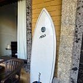](https://news.tonydinh.com/p/jun-2023-how-i-work-with-employees)

With the help from the team, I got back a lot of my free time without sacrificing customers’ happiness. The products also keep moving forward (new features and bug fixes) without me having to actively working.  

在团队的帮助下，我在不影响客户满意度的前提下，找回了大量空闲时间。产品也在不断向前发展（新功能和错误修复），而我无需主动工作。

I still work 4 hours/day on average, but now I only work on things I’m interested in, whether it’s a new feature, or experimenting with a new product.  

我仍然平均每天工作 4 小时，但现在我只做自己感兴趣的事情，无论是新功能还是新产品实验。

What do I do with the rest 20 hours in the day?  

剩下的 20 个小时我该怎么办？

Let’s talk a bit about lifestyle change.  

让我们来谈谈生活方式的改变。

I absolutely love working for myself and not having a 9-5 job. However, there are pros and cons to everything. After 2 years on this journey, I can understand why this is not the way for everyone.  

我非常喜欢为自己工作，不喜欢朝九晚五的工作。不过，凡事有利就有弊。经过两年的旅程，我明白了为什么这不是每个人都能做到的。

The first and most important benefit to me is the freedom.  

对我来说，第一个也是最重要的一个好处就是自由。

When I have reached the ramen profitability level, I can choose to change my “work-life-balance” level as how I want it.  

当我达到拉面盈利水平时，我可以选择改变我的 "工作-生活平衡 "水平，随心所欲。

I have so much free time that allowed me to pursue other interests I have in life, like [learning hardware](https://twitter.com/tdinh_me/status/1613498539216375810), [surfing](https://x.com/tdinh_me/status/1550390303936647168?s=20), [traveling](https://twitter.com/tdinh_me/status/1531661506756345857), [playing games](https://twitter.com/tdinh_me/status/1463804239948382211), etc.  

我有很多空闲时间，可以追求生活中的其他兴趣爱好，比如学习硬件、冲浪、旅游、玩游戏等。

[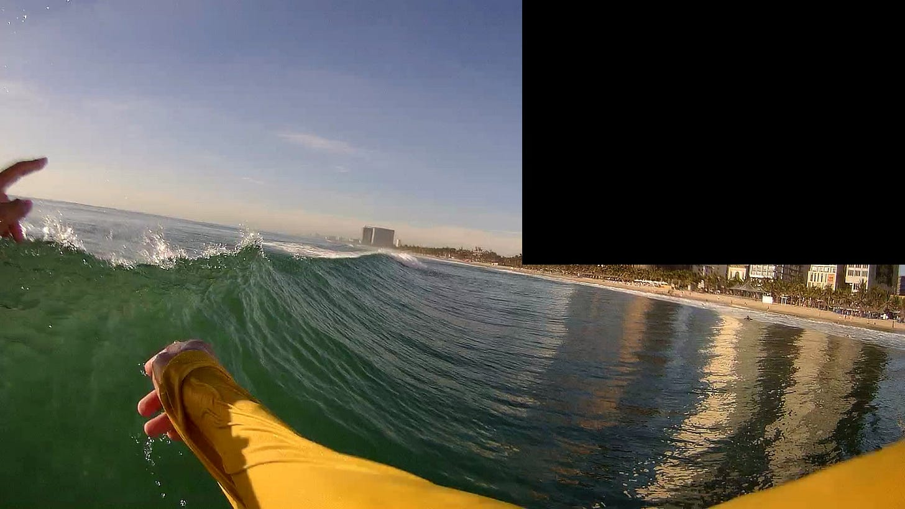](https://substackcdn.com/image/fetch/f_auto,q_auto:good,fl_progressive:steep/https%3A%2F%2Fsubstack-post-media.s3.amazonaws.com%2Fpublic%2Fimages%2F9df88e5f-743f-4f70-be61-14da9ab237b7_1920x1080.jpeg)

I surf almost every day now 🏄♂️  

我现在几乎每天都冲浪 🏄♂️

I can choose to work on any day as I feel like it, or I can spend the whole day watching Netflix without asking anyone for permission.  

我可以选择在任何一天按自己的心情工作，也可以不经任何人同意，花一整天时间看 Netflix。

The money is also great, I make much more than my last drawn salary (which was ~$9k/month). To make $45K/month as an employee is not an easy task, I would have to be extremely good at coding (and also office politics!).  

我的收入也很高，比我上一份工作的月薪（约 9 000 美元）高出很多。作为一名员工，月薪要达到 4.5 万美元并非易事，我必须非常擅长编码（还有办公室政治！）。

The learnings are also one of the benefits.  

学习也是好处之一。

Running a company requires a wide range of skills that I learned along the way: marketing, legal, finance, partnership, sales, etc.  

经营一家公司需要各种各样的技能，我在经营过程中学到了营销、法律、财务、合作、销售等技能。

Even thought I’m at a very small scale, I feel much more confident talking about business now compared to when I was just an employee doing what being told.  

尽管我的公司规模很小，但与我以前只是一名听命行事的员工相比，我现在谈起生意来更有信心了。

**The cold start 冷启动**

Nothing comes for free. It could be very challenging and stressful to find a product and make it work, especially in the beginning.  

没有什么是免费的。要找到一个产品并使其发挥作用，可能会非常具有挑战性和压力，尤其是在开始阶段。

I always tell people not to quit their job without a stable revenue each month, a lot of savings, and backup plans.  

我总是告诉人们，如果没有每月稳定的收入、大量的积蓄和备用计划，就不要辞职。

Working on side projects while having a full-time job can be stressful too. I was lucky because I haven’t yet have a family and only need to take care of myself. For people who have a full-time job, wife, and kids, there isn’t much time and energy left to work on side projects. The risk factor is also much larger in case of failure.  

在全职工作的同时从事副业也会给自己带来压力。我很幸运，因为我还没有成家，只需要照顾好自己。对于那些有全职工作、妻子和孩子的人来说，没有太多时间和精力去做副业。一旦失败，风险系数也会更大。

**The risks 风险**

Even when you have a successful product, the risks still remain.  

即使有了成功的产品，风险依然存在。

Revenue may fluctuate, the market may change, new competitors showing up, or maybe you do something stupid. It could affect the business and so affects you.  

收入可能会波动，市场可能会变化，新的竞争对手可能会出现，或者你可能会做一些蠢事。这可能会影响到企业，也会影响到你。

Look at what happened to Black Magic, if I couldn’t managed to get the new product (Typing Mind) generating a new revenue stream for me at the time, I would be extremely stressed, which can cause a spiral downturn, who knows.  

看看 "黑魔法 "的下场吧，如果当时我不能设法让新产品（Typing Mind）为我带来新的收入来源，我的压力就会非常大，这可能会导致螺旋式下滑，谁知道呢？

This is also the reason why I prefer to have multiple products, to reduce the risk of one dying.  

这也是我倾向于使用多种产品的原因，以减少其中一种产品死亡的风险。

**The social life 社会生活**

I had to sacrifice my professional network and social life. It gets very lonely.  

我不得不牺牲我的职业网络和社交生活。这让我感到非常孤独。

When I quit my job, I didn’t think this would be a big problem, so I didn’t really paying attention to keeping my connections with people around me.  

辞职的时候，我觉得这不是什么大问题，所以并没有注意和周围的人保持联系。

Now I’m starting to build the back connections, but it’s difficult to keep in touch with people when you no longer work in the same office and have the same topics to talk about.  

现在，我开始创建后面的联系，但当你不再在同一个办公室工作，也不再有相同的话题时，就很难与人保持联系了。

My friends all have a full-time jobs, not a lot of indie hacker friends around me and they all have different favorite country/city to live. My best option if I want to fix this is to move to some popular indie hubs around the world like Bali or Lisbon, but I still think this isn’t going to work long-term.  

我的朋友们都有全职工作，我周围的独立黑客朋友并不多，而且他们都有各自喜欢的国家/城市。如果我想解决这个问题，最好的办法就是搬到巴厘岛或里斯本等世界各地的热门独立中心，但我仍然认为这不是长久之计。

It’s just the trade off I have to make going on this path. Lucky for me at least I still have the online Twitter community to hang out with.  

这只是我在这条路上必须做出的权衡。幸运的是，至少我还有在线 Twitter 社区可以一起玩。

So that’s my entire story from the very beginning.  

这就是我从一开始的整个故事。

What’s next? I don’t really know.  

下一步是什么？我真的不知道。

Right now, I don’t have a long-term plan. I only have a general guideline that I live to: stay healthy, make more money by doing things that I’m interested in, all of that while not sacrificing my freedom.  

现在，我还没有一个长期计划。我只有一个大致的生活准则：保持健康，做自己感兴趣的事情，赚更多的钱，同时不牺牲自己的自由。

Work and enjoy life at the same time.  

一边工作，一边享受生活

As for short-term plan, I’ll keep working on my products: Typing Mind (current focus), DevUtils, Xnapper. Maybe even a new product in the near future!  

至于短期计划，我会继续开发我的产品：Typing Mind（目前的重点）、DevUtils 和 Xnapper。也许在不久的将来，我还会推出一款新产品！

I hope this post will be helpful for anyone want to pursue the same path.  

我希望这篇文章能对想走同样道路的人有所帮助。

If you are looking to do the same thing as I did, here are some of my key takeaways:  

如果你也想做和我一样的事情，以下是我的一些主要收获：

-   First and foremost, keep in mind that all of this is my story, “my way”. It’s definitely not the “only way”, and probably not “the best way”. All you can do is to cherry pick what I shared here and see if it works for you. There is no formula to guarantee success.  
    
    首先，请记住，这一切都是我的故事，是 "我的方式"。这绝对不是 "唯一的方法"，也可能不是 "最好的方法"。你所能做的就是挑选我在这里分享的内容，看看是否适合你。没有任何公式可以保证成功。
    
-   If you plan to work alone like me, try to become a generalist: know a bit of everything. For example, if you are a developer, don’t restrict yourself to only work as a frontend dev, try to develop in backend too, and mobile apps, and design, then also learn marketing, etc. Make use of the 80/20 rule: use 20% of your effort to capture 80% of the value.  
    
    如果你打算像我一样独自工作，那就努力成为一个通才：什么都懂一点。例如，如果你是一名开发人员，不要局限于只做前端开发，也要尝试开发后台、移动应用程序和设计，然后还要学习市场营销等。利用 80/20 原则：用 20% 的努力获取 80% 的价值。
    
-   Build unfair advantages for yourself. I considered my coding skills as an unfair advantage. I can build apps very fast because I’ve been doing it for years. If you don’t have any unfair advantages, find it or build it today.  
    
    为自己创建不公平的优势。我认为我的编码技能是一个不公平的优势。我可以很快地创建应用程序，因为我已经做了很多年。如果你没有任何不公平的优势，那么今天就去寻找它或创建它。
    
-   Build an audience. This is not for everyone, but if you can, give it a try. Build an audience or a community of your own on Twitter/Reddit/internet forums. Anything you do later will be much more easier. The benefit is compounded. I built an audience of 97K followers on Twitter over the past 2 years and now that’s one of my unfair advantages too.  
    
    创建观众群。这并不适合每个人，但如果可以，不妨一试。在 Twitter/Reddit/互联网论坛上创建自己的受众群或社区。以后做任何事情都会容易得多。收益是复利的。在过去两年里，我在 Twitter 上创建了 97K 粉丝群，现在这也成为了我不公平的优势之一。
    
-   Ship early, ship small, ship frequently. Don’t stuck on one idea for too long if it doesn’t work. Practice shipping products more frequently to build “muscle memory”.  
    
    早发布、小发布、勤发布。如果一个想法行不通，就不要坚持太久。多练习发货，创建 "肌肉记忆"。
    
-   When building product: focus on the core value it brings to the customer. Practice viewing the product from customer point-of-view to avoid over-engineering. Talk to your customers and involve them to your building process.  
    
    打造产品时：关注产品为客户带来的内核价值。练习从客户的角度看待产品，避免过度设计。与客户交流，让他们参与到你的制造过程中。
    
-   Be patient and be prepared for luck. It’s a long term game.  
    
    要有耐心，也要做好运气的准备。这是一个长期的游戏。
    

That’s all I have to share for now. If you like what you’ve just read, make sure to subscribe to [my newsletter](https://news.tonydinh.com/). I write once a month with updates on my journey and share things I know.  

我的分享就到这里。如果你喜欢刚刚读到的内容，请务必订阅我的时事通讯。我每个月都会写一次，更新我的心路历程，分享我所知道的事情。

I’m grateful to have received a lot of support from the community (that includes you), whether it’s on Twitter, on Indie Hackers forum, or from this newsletter. Especially on the early days. The community is a big factor in my success.  

我非常感谢社区（包括你们）给予我的大力支持，无论是在 Twitter 上、Indie Hackers 论坛上，还是从这份时事通讯中。尤其是在创业初期。社区是我成功的重要因素。

I hope this post will contribute my small part back to the community, and I hope to see more indie hackers in the future.  

我希望这篇文章能为社区贡献自己的绵薄之力，也希望今后能看到更多独立黑客的身影。

Thank you so much and see you soon!  

非常感谢，再见！
