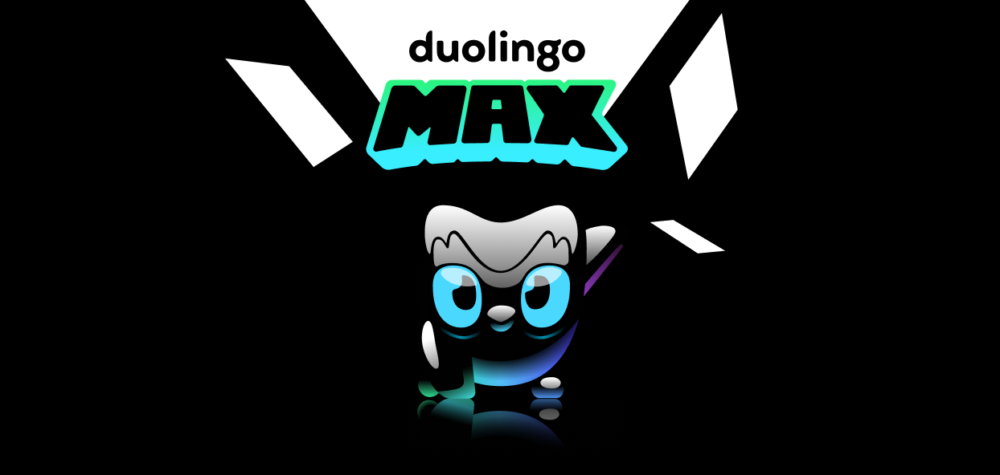
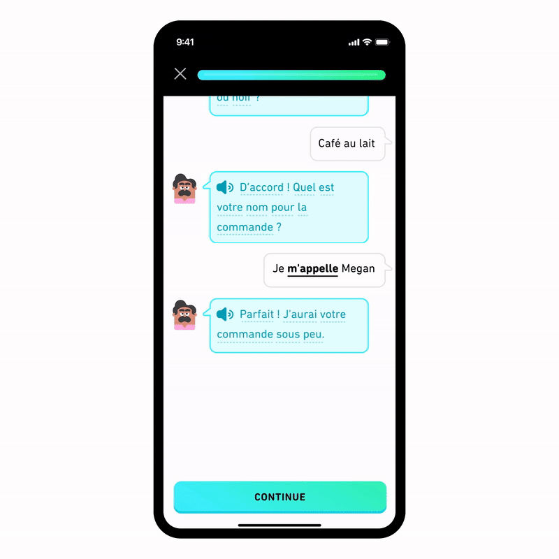

We believe that AI and education make a great duo, and we’ve leveraged AI to help us deliver highly-personalized language lessons, affordable and accessible [English proficiency testing](https://blog.duolingo.com/test-creation-machine-learning/), and more. Our mission to make high-quality education available to everyone in the world is made possible by advanced AI technology. That's why we’re excited to take advantage of GPT-4, the newest technology from OpenAI, to make learning with Duolingo even more powerful. Introducing… **Duolingo Max!**  

我们相信，人工智能和教育是一对绝佳的组合，我们利用人工智能来帮助我们提供高度个性化的语言课程、经济实惠且方便的英语水平测试等。我们的使命是让世界上的每一个人都能接受高质量的教育，而先进的人工智能技术使这一使命成为可能。因此，我们很高兴能利用 OpenAI 的最新技术 GPT-4，使 Duolingo 的学习功能更加强大。介绍......Duolingo Max！

Duolingo Max is a new subscription tier above Super Duolingo that gives learners access to two brand-new features and exercises: **Explain My Answer** and **Roleplay**. Both are powered by the newest, most powerful generative AI technology. We’ve been working closely with OpenAI for months to refine the technology and get it ready for learners!  

Duolingo Max 是高于超级 Duolingo 的一个新的订阅层级，学习者可以使用两个全新的功能和练习：解释我的答案和角色扮演。这两项功能都采用了最新、最强大的人工智能生成技术。几个月来，我们一直与 OpenAI 紧密合作，不断改进技术，为学习者做好准备！

Here’s everything you need to know about this exciting new experience!  

以下是您需要了解的有关这一激动人心的新体验的所有信息！

## How is Duolingo Max different than Super Duolingo?  

Duolingo Max 与超级 Duolingo 有什么不同？

Duolingo Max gives learners all the benefits of Super (unlimited hearts, no ads, and personalized review through the [Practice Hub](https://blog.duolingo.com/guide-to-duolingo-practice-hub/)), as well as two new AI-powered features. These new features are: Explain My Answer and Roleplay.  

Duolingo Max 为学习者提供了 Super 的所有优势（无限爱心、无广告、通过 Practice Hub 进行个性化复习），以及两项由人工智能驱动的新功能。这两项新功能是解释我的答案和角色扮演。

![Three iPhone screens. The leftmost screen says Introducing Duolingo Max and offers short descriptions of the two new features, Explain My Answer and Role Play. There is a button directing the user to start a free trial. The second screen shows a snippet of an Explain My Answer chat, correcting someone's use of the verb "gustar." The chatbot explains that gustar changes form for plural items to be "gustan." The learner's answer "no me gusta" does not match the item "vestidos," which is plural. The third screen is an intro to a Role Play scenario: ordering food and drinks at a Parisian cafe with Oscar.](DuolingoMax_HeroImage-Light.png)

Naturally, you might ask…  

当然，你可能会问...

## What is Explain My Answer?  

什么是 "解释我的答案"？

Sometimes you make a mistake, but you’re not exactly sure what the \*right\* answer would be. Or maybe, you keep making the same mistake again and again and you can’t figure out why. Explain My Answer offers learners the chance to learn more about their response in a lesson (whether their answer was correct or incorrect!) By tapping a button after certain exercise types, learners can enter a chat with Duo to get a simple explanation on why their answer was right or wrong, and ask for examples or further clarification.  

有时你会犯错，但你并不确定\*正确的答案是什么。又或者，你总是一而再、再而三地犯同样的错误，却不知道原因何在。通过在特定练习类型后点击按钮，学习者可以与 Duo 聊天，简单了解自己的答案是对是错，并要求举例说明或进一步澄清。

![A gif showing an experience using Explain My Answer. The learner writes "gusta" to complete the sentence "No me ____ esos vestidos." A red pop up at the bottom of the screen notes the answer is incorrect, and the verb should be "gustan." There is a button to continue or a button to Explain My Answer. Then you see a chat with the AI interface where a Duo icon explains the proper form of gustar to use with plural nouns. The learner is offered options to ask the AI to explain further or return to the lesson.](DuolingoMax_ExplainMyAnswer--2-.gif)

## What is Roleplay? 什么是角色扮演？

Roleplay allows learners to practice real-world conversation skills with world characters in the app. These challenges, which earn XP, will live alongside the path as one of the “Side Quests” learners can access by tapping on the character. What will you talk about? We’ll guide you through different scenarios! Learners might discuss future vacation plans with Lin, order coffee at a café in Paris, go furniture shopping with Eddy, or ask a friend to go for a hike.  

角色扮演允许学习者与应用程序中的世界角色练习真实世界的对话技巧。这些可获得 XP 的挑战将作为 "支线任务 "之一，与学习路径并存，学习者只需点击角色即可进入。您将谈论什么？我们将通过不同的场景来引导您！学习者可以与 Lin 讨论未来的度假计划，在巴黎的咖啡馆点咖啡，与 Eddy 一起去买家具，或者约朋友一起去远足。

Although learners aren’t actually talking to a live human, the AI behind this feature is responsive and interactive, meaning no two conversations will be exactly alike! After the interaction, learners get AI-powered feedback from Duo on the accuracy and complexity of their responses, as well as tips for future conversations.  

虽然学习者实际上并不是在与真人对话，但这项功能背后的人工智能具有响应性和交互性，这意味着没有两次对话是完全相同的！互动结束后，学习者会从 Duo 获得由人工智能驱动的反馈，包括他们回答的准确性和复杂性，以及未来对话的提示。

## Who has access to these new features?  

谁可以使用这些新功能？

The only courses that can utilize these new features are Spanish and French for English speakers on iOS. We expect to roll these out to more courses and platforms very soon!  

目前能使用这些新功能的课程只有 iOS 上的西班牙语和法语课程。我们预计将很快在更多课程和平台上推出这些功能！

At launch, Duolingo Max will be available in the U.S., Great Britain, Ireland, Canada, Australia, and New Zealand. We’re working to expand to more countries in the coming months.  

Duolingo Max 将在美国、英国、爱尔兰、加拿大、澳大利亚和新西兰推出。我们正努力在未来几个月内扩展到更多国家。

## Are humans evaluating the content at all?  

人类是否在评估内容？

Yes! At Duolingo, our curriculum experts and designers are well-versed at [working with AI-generated content](https://blog.duolingo.com/how-duolingo-experts-work-with-ai/) to create fun and effective lessons. These new features are no different!  

是的！在 Duolingo，我们的课程专家和设计师精通使用人工智能生成的内容来创建有趣而有效的课程。这些新功能也不例外！

Humans write the scenarios that learners see in Roleplay—they make sure the initial prompt (Talk about a vacation! Ask for directions!) is aligned with where the learner is in their course. Our experts also write the initial message in the chat and tell the model where to take the conversation.  

学习者在角色扮演中看到的场景都是由人工编写的--他们要确保初始提示（谈论假期！问路！）与学习者在课程中所处的位置一致。我们的专家还会编写聊天中的初始信息，并告诉模型对话的方向。

We also constantly review AI-generated explanations in Roleplay and Explain My Answer to ensure that the answers are factually correct and have the right tone (fun, encouraging, and if you’re Duo, occasionally snarky 😅).  

我们还会不断审查角色扮演和 "解释我的答案 "中人工智能生成的解释，以确保答案符合事实并具有正确的语气（有趣、鼓励性，如果你是 Duo，偶尔也可以尖酸刻薄😅）。

## What if the AI makes a mistake?  

如果人工智能出错了怎么办？

We know that technology is never perfect (hey, neither are humans!). Part of the reason we’re so excited to use GPT-4 for these features is that it’s the most accurate (and fastest) version of the technology available. We’ve spent months collaborating closely with OpenAI to test and train this technology, and will continue doing so until the mistakes are nearly nonexistent.  

我们知道，技术从来都不是完美无缺的（人类也一样！）。我们之所以如此兴奋地将 GPT-4 用于这些功能，部分原因在于它是目前最准确（也是最快）的技术版本。我们花了几个月的时间与 OpenAI 密切合作来测试和训练这项技术，并将继续这样做，直到几乎不出现错误为止。

If you notice a mistake or error in an AI-generated response, you can report it by holding down the inaccurate message—a menu will pop up and allow you to select your reason for reporting. Our team will watch for these reports and use them to train the model to be more accurate. (For more about how we work with learners to ensure our lessons are accurate, [click here](https://blog.duolingo.com/how-duolingo-works-with-learners/)!)  

如果您发现人工智能生成的回复中存在错误，您可以按住不准确的信息进行报告，系统会弹出菜单让您选择报告原因。我们的团队会留意这些报告，并利用它们来训练模型，使其更加准确。(有关我们如何与学习者合作以确保课程准确性的更多信息，请点击此处！）。

Every Explain My Answer session also has the option to offer a 👍 or 👎 after you receive the explanation.  

每个 "解释我的答案 "环节还可在您收到解释后提供👍或👎选项。

## A new way to Max-imize your learning  

最大限度提高学习效率的新方法

We’ve spent months testing this technology with our teams and small groups of learners, and we’re impressed by the results. Our mission has always been to bring the highest-quality education to everyone on the planet, and AI helps us do that a lot faster than if we worked alone!  

我们花了几个月的时间与我们的团队和学习者小组一起测试这项技术，结果令我们印象深刻。我们的使命始终是为地球上的每一个人提供最高质量的教育，而人工智能可以帮助我们更快地实现这一目标，这比我们独自工作要快得多！

We’re so excited to continue bringing new features and exercises to all of our learners around the world—Duolingo Max is only the beginning! We're rolling this out slowly to learners on iOS devices. If you're eligible to try out Duolingo Max, you can find it in the Shop tab (click the gem icon at the top of your screen). Android and Web learners should keep an eye out for Duolingo Max in the coming months!  

我们很高兴能继续为世界各地的学习者带来新的功能和练习--Duolingo Max 只是一个开始！我们正在慢慢向 iOS 设备上的学习者推出这一功能。如果您有资格试用 Duolingo Max，您可以在 "商店 "选项卡中找到它（点击屏幕上方的宝石图标）。安卓和网络学习者请在未来几个月内关注 Duolingo Max！

<iframe width="381" height="677" src="https://www.youtube.com/embed/F-oLLqILsAU" title="Introducing Duolingo Max" frameborder="0" allow="accelerometer; autoplay; clipboard-write; encrypted-media; gyroscope; picture-in-picture; web-share" allowfullscreen=""></iframe>
