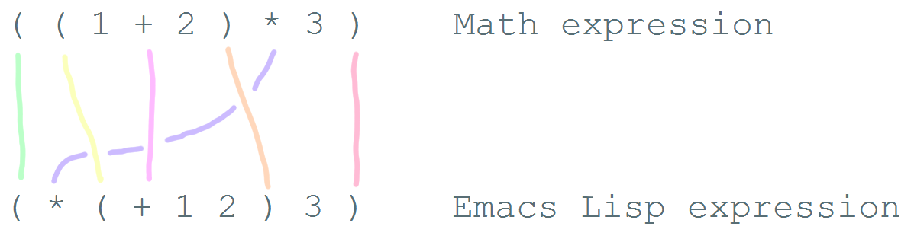

## Table of Contents 目录

-   [Introduction 导言](https://emacslife.com/how-to-read-emacs-lisp.html#orgheadline1)
-   [The wonderful world of Emacs customization  
    
    Emacs 个性化的奇妙世界](https://emacslife.com/how-to-read-emacs-lisp.html#orgheadline2)
    -   ["Why do I have to learn Emacs Lisp in order to get Emacs to do what I want? Shouldn't Emacs just come with reasonable defaults?"  
        
        "为什么我必须学习 Emacs Lisp 才能让 Emacs 做我想做的事？难道 Emacs 不应该自带合理的默认设置吗？](https://emacslife.com/how-to-read-emacs-lisp.html#orgheadline3)
    -   ["If I customize my Emacs, I'll have a hard time working with other people or on other computers."  
        
        "如果我定制我的 Emacs，我就很难与其他人或在其他电脑上工作"。](https://emacslife.com/how-to-read-emacs-lisp.html#orgheadline4)
    -   ["I don't have the time to fiddle around with this."  
        
        "我没时间摆弄这个"](https://emacslife.com/how-to-read-emacs-lisp.html#orgheadline5)
-   ["How can I try Emacs Lisp code?"  
    
    "如何试用 Emacs Lisp 代码？](https://emacslife.com/how-to-read-emacs-lisp.html#orgheadline6)
    -   [Finding Emacs Lisp code  
        
        查找 Emacs Lisp 代码](https://emacslife.com/how-to-read-emacs-lisp.html#orgheadline7)
        -   [Emacs documentation Emacs 文档](https://emacslife.com/how-to-read-emacs-lisp.html#orgheadline8)
        -   [Packages 套餐](https://emacslife.com/how-to-read-emacs-lisp.html#orgheadline9)
        -   [Webpages, blog posts, and the Emacs Wiki  
            
            网页、博客文章和 Emacs Wiki](https://emacslife.com/how-to-read-emacs-lisp.html#orgheadline10)
        -   [Mailing lists, newsgroups, and Q&A sites  
            
            邮件列表、新闻组和问答网站](https://emacslife.com/how-to-read-emacs-lisp.html#orgheadline11)
    -   [Trying out code  
        
        试用代码](https://emacslife.com/how-to-read-emacs-lisp.html#orgheadline12)
        -   [M-x ielm (Inferior Emacs Lisp Mode)  
            
            M-x ielm（劣质 Emacs Lisp 模式）](https://emacslife.com/how-to-read-emacs-lisp.html#orgheadline13)
        -   [The `*scratch*` buffer and Emacs Lisp `.el` files  
            
            `*scratch*` 缓冲区和 Emacs Lisp `.el` 文件](https://emacslife.com/how-to-read-emacs-lisp.html#orgheadline14)
        -   [M-: (eval-expression) M-:（eval-expression）](https://emacslife.com/how-to-read-emacs-lisp.html#orgheadline15)
        -   [C-x C-e (eval-last-sexp)  
            
            C-x C-e (eval-last-sexp)](https://emacslife.com/how-to-read-emacs-lisp.html#orgheadline16)
        -   [If you want that code to run every time you start Emacs…  
            
            如果您希望每次启动 Emacs 时都运行该代码...](https://emacslife.com/how-to-read-emacs-lisp.html#orgheadline17)
        -   [Practice 实践](https://emacslife.com/how-to-read-emacs-lisp.html#orgheadline18)
-   ["How can I understand what Emacs Lisp code does?"  
    
    "如何理解 Emacs Lisp 代码的作用？](https://emacslife.com/how-to-read-emacs-lisp.html#orgheadline19)
    -   [Learn more about functions  
        
        了解有关功能的更多信息](https://emacslife.com/how-to-read-emacs-lisp.html#orgheadline20)
    -   [Learn more about variables  
        
        了解更多变量信息](https://emacslife.com/how-to-read-emacs-lisp.html#orgheadline21)
    -   [Understand symbols 理解符号](https://emacslife.com/how-to-read-emacs-lisp.html#quoting)
    -   [Work with lists  
        
        使用列表](https://emacslife.com/how-to-read-emacs-lisp.html#orgheadline23)
        -   [Add to a list  
            
            添加到列表](https://emacslife.com/how-to-read-emacs-lisp.html#load-path)
        -   [Hooks 挂钩](https://emacslife.com/how-to-read-emacs-lisp.html#orgheadline25)
        -   [Deleting from a list  
            
            从列表中删除](https://emacslife.com/how-to-read-emacs-lisp.html#orgheadline26)
        -   [Dot notation 圆点符号](https://emacslife.com/how-to-read-emacs-lisp.html#package-archives)
    -   [Review 评论](https://emacslife.com/how-to-read-emacs-lisp.html#orgheadline28)
-   ["How can I customize Emacs to make things more convenient?"  
    
    "如何定制 Emacs 才能更方便？](https://emacslife.com/how-to-read-emacs-lisp.html#orgheadline29)
    -   [Keyboard shortcuts 键盘快捷键](https://emacslife.com/how-to-read-emacs-lisp.html#orgheadline30)
        -   [Setting keybindings in all buffers  
            
            在所有缓冲区中设置键盘绑定](https://emacslife.com/how-to-read-emacs-lisp.html#orgheadline31)
        -   [What does `kbd` do? How can I figure out which key it sets?  
            
            `kbd` 有什么作用？我怎样才能知道它设置了哪个键？](https://emacslife.com/how-to-read-emacs-lisp.html#orgheadline32)
        -   [Multi-key shortcuts 多键快捷方式](https://emacslife.com/how-to-read-emacs-lisp.html#orgheadline33)
        -   [Binding keys to other keys  
            
            将按键绑定到其他按键](https://emacslife.com/how-to-read-emacs-lisp.html#orgheadline34)
        -   [Dealing with errors: "Key sequence \_\_ starts with non-prefix key \_"  
            
            处理错误："键序列 \_\_\_以非前缀键 \_\_开始"](https://emacslife.com/how-to-read-emacs-lisp.html#orgheadline35)
        -   [Setting keybindings in a particular mode  
            
            在特定模式下设置键盘绑定](https://emacslife.com/how-to-read-emacs-lisp.html#modekeys)
        -   [Other ways people bind keys  
            
            人们绑定按键的其他方式](https://emacslife.com/how-to-read-emacs-lisp.html#orgheadline37)
    -   [Defuns - function definitions  
        
        Defuns - 函数定义](https://emacslife.com/how-to-read-emacs-lisp.html#orgheadline38)
    -   [Lambdas - anonymous functions  
        
        Lambdas - 匿名函数](https://emacslife.com/how-to-read-emacs-lisp.html#orgheadline39)
-   ["How can I add more features and deal with errors?"  
    
    "如何添加更多功能并处理错误？](https://emacslife.com/how-to-read-emacs-lisp.html#orgheadline40)
    -   [Adding more features to Emacs  
        
        为 Emacs 添加更多功能](https://emacslife.com/how-to-read-emacs-lisp.html#load)
        -   [Installing packages 安装软件包](https://emacslife.com/how-to-read-emacs-lisp.html#installing-packages)
        -   [Other Emacs Lisp files  
            
            其他 Emacs Lisp 文件](https://emacslife.com/how-to-read-emacs-lisp.html#unpackaged)
    -   ["Oh no! I have an error!"  
        
        "哦，不！我出错了！"](https://emacslife.com/how-to-read-emacs-lisp.html#errors)
        -   [Scan error: "Unbalanced parentheses" or "Containing expression ends prematurely"  
            
            扫描错误："括号不平衡 "或 "包含表达式过早结束"](https://emacslife.com/how-to-read-emacs-lisp.html#orgheadline44)
        -   [Cannot open load file: …  
            
            无法打开加载文件：...](https://emacslife.com/how-to-read-emacs-lisp.html#orgheadline45)
        -   [Lisp error: (void-function …)  
            
            Lisp 错误： (void-function ...)](https://emacslife.com/how-to-read-emacs-lisp.html#void-function)
        -   [Symbol's value as variable is void: \_  
            
            符号作为变量的值是无效的：\_](https://emacslife.com/how-to-read-emacs-lisp.html#void-variable)
        -   [I'm using C-x C-e (eval-last-sexp) and I don't get the results I expected  
            
            我正在使用 C-x C-e（eval-last-sexp），但没有得到预期的结果](https://emacslife.com/how-to-read-emacs-lisp.html#orgheadline48)
    -   [Wrapping up the beginner course  
        
        结束初级课程](https://emacslife.com/how-to-read-emacs-lisp.html#orgheadline50)
-   [Author's notes 作者说明](https://emacslife.com/how-to-read-emacs-lisp.html#orgheadline51)

## Introduction 导言

Hi! This is a guide to help you pick up the basics of reading customization code for Emacs - little snippets of Emacs Lisp that you can add to your `~/.emacs.d/init.el` to change how Emacs works. I hope this will help you learn how to borrow interesting snippets from README files and other people's configs so that you can tweak Emacs to fit the way you work. This is not a detailed guide on how to understand Emacs internals, but by the time you find yourself digging through comint.el to figure out what's going on with command interpretation, you probably already know your way around.  

您好！这是一本帮助你掌握阅读 Emacs 定制代码基础知识的指南--Emacs Lisp 的小片段，你可以将它们添加到你的 `~/.emacs.d/init.el` 中，从而改变 Emacs 的工作方式。我希望这能帮助你学会如何从 README 文件和其他人的配置文件中借用有趣的代码片段，从而调整 Emacs 以适应你的工作方式。这并不是一本关于如何理解 Emacs 内部结构的详细指南，但当你发现自己需要翻阅 comint.el 来弄清命令解释是怎么回事时，你可能已经对自己的工作方式了如指掌了。

We'll assume that you already have Emacs installed and that you've gone through the built-in tutorial (**Help - Emacs Tutorial**, `<f1> t`, `C-h t`, or `M-x help-with-tutorial`). If you haven't upgraded to at least Emacs 24.x, please do - it's worth it! I'll also assume you have a little programming background or can deal with the concepts of variables and functions. Feel free to ask questions if you get stuck on something or if you want to clarify your understanding.  

我们假设您已经安装了 Emacs，并且已经阅读了内置教程（帮助 - Emacs 教程， `<f1> t` , `C-h t` 或 `M-x help-with-tutorial` ）。如果您还没有升级到 Emacs 24.x，请升级 - 这是值得的！我还假定你有一点编程背景，或者能够处理变量和函数的概念。如果您遇到困难或想澄清自己的理解，请随时提问。

Please e-mail questions, comments, and suggestions to [sacha@sachachua.com](mailto:sacha@sachachua.com). I want to make this guide better, and I'd love to hear from you. If you would like to help improve this guide, you can find it on [Github](https://github.com/sachac/emacs-notes/blob/gh-pages/how-to-read-emacs-lisp.org) - pull requests welcome. This guide is dual-licensed under the Creative Commons Attribution License and the GNU Free Documentation License, so feel free to read, share, and build on it.  

请将问题、评论和建议发送至 sacha@sachachua.com。我想把这本指南做得更好，也很想听听你的意见。如果你想帮助改进本指南，可以在 Github 上找到它--欢迎提出拉取请求。本指南采用 Creative Commons Attribution License 和 GNU Free Documentation License 双重许可，因此请自由阅读、分享并在此基础上进行开发。

You can find this guide on the Web at [http://emacslife.com/how-to-read-emacs-lisp.html](http://emacslife.com/how-to-read-emacs-lisp.html) . If you want an EPUB version or a downloadable HTML version, you can get it from [Gumroad](https://gumroad.com/l/xkzAI) (free/pay-what-you-want).  

您可以在网站 http://emacslife.com/how-to-read-emacs-lisp.html 上找到本指南。如果您需要 EPUB 版本或可下载的 HTML 版本，可以从 Gumroad 获取（免费/按需付费）。

Some conventions we'll use:  

我们将使用一些惯例：

-   Inline code will be `boxed and monospace` in the HTML version and generally surrounded by `equal signs` in plain text.  
    
    内联代码在 HTML 版本中为 `boxed and monospace` ，在纯文本中一般用 `equal signs` 包围。
-   Code samples will be monospace and in boxes in the HTML version, and enclosed in `#+begin_src` … `#+end_src` in plain text. Example:  
    
    在 HTML 版本中，代码示例将以单倍行距并置于方框中，而在纯文本中，代码示例将以 `#+begin_src` ... `#+end_src` 括起来。... `#+end_src` 中括弧。示例
    

Now, on with the guide.  

现在，开始介绍指南。

## The wonderful world of Emacs customization  

Emacs 个性化的奇妙世界

To make the most of Emacs, learn how to read and write Emacs Lisp. Most of Emacs is written in Emacs Lisp: the packages that add extra functionality, the configuration code to set different options. You can change large parts of how Emacs behaves even without restarting Emacs.  

要充分利用 Emacs，就要学习如何读写 Emacs Lisp。Emacs 的大部分内容都是用 Emacs Lisp 编写的：添加额外功能的软件包，设置不同选项的配置代码。即使不重启 Emacs，你也可以改变 Emacs 的大部分行为方式。

Remember: with great power comes lots of time debugging if you mess things up. This is a guide to help you avoid messing up, so you can build the confidence to learn more. It's worth it. Start with one-line in ten years (or three, or twenty, or next month - all up to you), you'll be able to tweak Emacs to do more things than other people might imagine a text editor can do.  

请记住：强大的功能伴随着大量的调试时间，如果你把事情搞砸了，那就得不偿失了。本指南将帮助你避免出现错误，从而树立学习更多知识的信心。值得一试。从一行开始，十年后（或者三年、二十年，或者下个月--一切都取决于你），你将能够调整 Emacs，让它做更多别人想象不到的文本编辑器能做的事情。

This is what Emacs Lisp code looks like:  

这就是 Emacs Lisp 代码的样子：

Or something slightly more useful:  

或者更有用的东西：

```
(setq delete-old-versions -1)

```

If you want to start playing around with Emacs Lisp code right away, jump ahead to the section on ["How can I try Emacs Lisp code?"](https://emacslife.com/how-to-read-emacs-lisp.html#orgtarget2).  

如果您想立即开始学习 Emacs Lisp 代码，请跳至 "如何试用 Emacs Lisp 代码？

### "Why do I have to learn Emacs Lisp in order to get Emacs to do what I want? Shouldn't Emacs just come with reasonable defaults?"  

"为什么我必须学习 Emacs Lisp 才能让 Emacs 做我想做的事？难道 Emacs 不应该自带合理的默认设置吗？

Reasonable defaults make sense for specific people. Other people might have completely different ideas for how they want a tool to work. Many people use Emacs and have (occasionally quite strong) opinions about how they want it to work. It's difficult to change the defaults for everyone<sup data-immersive-translate-effect="1" data-immersive_translate_walked="919f411a-6750-4fd8-94c6-8546e7ddfd87"><a id="fnr.1" href="https://emacslife.com/how-to-read-emacs-lisp.html#fn.1">1</a></sup>, and since Emacs is so customizable, people tend to just fix things for themselves. If you learn how to read and write Emacs Lisp, you can pick up tips from other people's configurations and ask people for help.  

合理的默认值对特定的人来说是有意义的。其他人对工具的工作方式可能有完全不同的想法。许多人都在使用 Emacs，他们对如何使用 Emacs 有自己的看法（有时非常强烈）。要为每个人更改默认设置 <sup data-immersive-translate-effect="1" data-immersive_translate_walked="919f411a-6750-4fd8-94c6-8546e7ddfd87"><a id="fnr.1" href="https://emacslife.com/how-to-read-emacs-lisp.html#fn.1">1</a></sup> 是很困难的。由于 Emacs 的可定制性很强，人们往往会自行解决一些问题。如果你学会了如何读写 Emacs Lisp，你就可以从其他人的配置中获得提示，并向他人寻求帮助。

There are some initiatives to put together common settings or "starter kits" that people may like. You can check them out for inspiration or use them as a starting point. Here are a few popular ones:  

有一些将常见设置或 "入门套件 "组合在一起的倡议，人们可能会喜欢。您可以查看它们以获得灵感，或将它们作为起点。以下是几个常用的设置：

-   [https://github.com/bbatsov/prelude](https://github.com/bbatsov/prelude)
-   [https://github.com/technomancy/better-defaults](https://github.com/technomancy/better-defaults)

You can read them to pick up ideas for customizing Emacs, or you can use them as a starting point for your own configuration. Note that starter kits change the behaviour of Emacs from what you might expect based on manuals and webpages. If you've added configuration code that you don't understand, be sure to mention it when asking for help, since people might otherwise assume you're starting with the defaults. It may be a good idea to look at starter kits and other people's configuration for inspiration, but add snippets slowly instead of copying things wholesale.  

你可以通过阅读它们来获取定制 Emacs 的想法，也可以将它们作为自己配置的起点。请注意，入门套件会改变 Emacs 的行为，而不是你根据手册和网页所期望的那样。如果你添加了自己不理解的配置代码，在寻求帮助时一定要提及，否则别人可能会认为你是从默认值开始的。从入门套件和其他人的配置中寻找灵感可能是个好主意，但要慢慢添加代码片段，而不是全盘照搬。

### "If I customize my Emacs, I'll have a hard time working with other people or on other computers."  

"如果我定制我的 Emacs，我就很难与其他人或在其他电脑上工作"。

I find that optimizing my Emacs configuration for my happiness is worth the mild annoyance of not having my shortcuts handy (or worse, not having Emacs!) when I pair-program with other people. If you're pair-programming with other people, you can switch your configuration or use a different editor. `emacs -q` starts Emacs without your personal configuration. It's good to be familiar with other editors like Vi so that you can be productive even if that's all you have, and then learn how to make the most of Emacs so that you can reap the benefits over the decades.  

我发现，当我与其他人结对编程时，优化我的 Emacs 配置，让我感到快乐，这值得我为没有快捷方式（或者更糟糕的是，没有 Emacs！）而感到轻微的烦恼。如果你要与他人结对编程，可以更换配置或使用其他编辑器。 `emacs -q` 启动 Emacs 时，不需要你的个人配置。熟悉其他编辑器（如 Vi）是件好事，这样即使你只有一个编辑器，也能提高工作效率，然后再学习如何充分利用 Emacs，这样你就能几十年如一日地从中获益。

Many people synchronize their configuration across multiple computers by using version control systems like Git or file synchronization tools like Dropbox. You can set up Emacs to check for hostname or other system variables before loading system-specific configuration.  

许多人通过使用 Git 等版本控制系统或 Dropbox 等文件同步工具在多台计算机上同步配置。你可以设置 Emacs 在加载特定系统配置前检查主机名或其他系统变量。

You might think it's not worth customizing Emacs if you spend most of your time ssh-ed into other servers. With Emacs, you can use [TRAMP](http://www.gnu.org/software/tramp/) to edit files through SSH and sudo in your local Emacs.  

如果你把大部分时间都花在通过 SSH 登录其他服务器上，你可能会觉得定制 Emacs 没有什么意义。有了 Emacs，你可以使用 TRAMP 通过 SSH 和 sudo 在本地 Emacs 中编辑文件。

### "I don't have the time to fiddle around with this."  

"我没时间摆弄这个"

Emacs Lisp code can help you save time by automating repetitive actions, smoothening rough edges, or enabling time-saving features like autocompletion. Investing some time can help you save a lot of time later. Learning from other Emacs users can help you figure out customizations that take little time for big results.  

Emacs Lisp 代码可以通过自动执行重复性操作、平滑粗糙边缘或启用自动完成等省时功能来帮助您节省时间。投入一些时间可以帮助你节省大量时间。向其他 Emacs 用户学习，可以帮你找到花小钱办大事的定制方法。

That said, it's a good idea to take a step back and figure out if what you're trying to customize is really worth it. One of the occupational hazards of using Emacs is that tweaking your Emacs configuration can be fun, almost addictive. If you catch yourself spending four hours fiddling with something minor, it might be time to put that aside and focus on getting stuff done first.<sup data-immersive-translate-effect="1" data-immersive_translate_walked="919f411a-6750-4fd8-94c6-8546e7ddfd87"><a id="fnr.2" href="https://emacslife.com/how-to-read-emacs-lisp.html#fn.2">2</a></sup>  

话虽如此，我们还是应该退一步想一想，你想要定制的东西是否真的值得。使用 Emacs 的职业危害之一是，调整 Emacs 配置可能很有趣，甚至会让人上瘾。如果你发现自己花了四个小时来摆弄一些次要的东西，那么也许是时候把它放在一边，先集中精力把事情做好。 <sup data-immersive-translate-effect="1" data-immersive_translate_walked="919f411a-6750-4fd8-94c6-8546e7ddfd87"><a id="fnr.2" href="https://emacslife.com/how-to-read-emacs-lisp.html#fn.2">2</a></sup>

## "How can I try Emacs Lisp code?"  

"如何试用 Emacs Lisp 代码？

After this section, you should be able to  

学完本节内容后，您应该能够

-   find Emacs Lisp code to study and use  
    
    查找 Emacs Lisp 代码进行学习和使用
-   try Emacs Lisp code before saving it to your configuration (that way, you don't have to keep restarting Emacs)  
    
    在将 Emacs Lisp 代码保存到您的配置中之前先试用一下（这样您就不必一直重启 Emacs 了）
-   add code to your configuration so that it runs whenever Emacs starts  
    
    在配置中添加代码，使其在 Emacs 启动时运行

### Finding Emacs Lisp code  

查找 Emacs Lisp 代码

It's easier to learn how to read Emacs Lisp when you start with simple examples that will help you use Emacs more effectively. Here are some useful sources:  

从简单的示例开始学习如何阅读 Emacs Lisp 会更容易，这些示例可以帮助你更有效地使用 Emacs。下面是一些有用的资料：

#### Emacs documentation Emacs 文档

Manuals and FAQs for Emacs-related tools often include code snippets. For example, the [Emacs FAQ](https://www.gnu.org/software/emacs/manual/efaq.html) has an entry like this:  

Emacs 相关工具的手册和常见问题解答通常包含代码片段。例如，Emacs 常见问题解答中有这样一个条目：

```
5.47 How can I tell Emacs to fill paragraphs with a single space after each period?
===================================================================================

Add the following line to your `.emacs' file:

     (setq sentence-end-double-space nil)

```

You can read the Emacs manual by typing `C-h i` (`info`) and choosing the **Emacs** item. If you're on a terminal that doesn't understand the `C-h` key, use `F1` or `M-x help` whenever you see a reference to `C-h`, or use `M-x` to call the command by name (ex: `F1 i`, or `M-x info`). To jump directly to the Emacs manual, you can use `C-h r` (`info-emacs-manual`). You can also find the Emacs Manual at [http://www.gnu.org/software/emacs/manual/emacs.html](http://www.gnu.org/software/emacs/manual/emacs.html) .  

输入 `C-h i` ( `info` ) 并选择 Emacs 项目，即可阅读 Emacs 手册。( `info` ) 并选择 Emacs 项。如果你使用的终端不理解 `C-h` 键，那么只要看到引用 `C-h` 的内容，就可以使用 `F1` 或 `M-x help` 。或使用 `M-x` 来调用命令名称（例如： `F1 i` 或 `M-x info` ）。要直接跳转到 Emacs 手册，可以使用 `C-h r` ( `info-emacs-manual` ).您也可以在 http://www.gnu.org/software/emacs/manual/emacs.html 找到 Emacs 手册。

#### Packages 套餐

Emacs has lots of packages in different repositories, many of which require a little extra code in order to be used to full effect. You can use `M-x package-list-packages` to list the packages that Emacs knows about by default. You will need an Internet connection for that.  

Emacs 在不同的软件源中拥有大量软件包，其中许多软件包需要一些额外的代码才能充分发挥作用。你可以使用 `M-x package-list-packages` 列出 Emacs 默认知道的软件包。为此，您需要连接互联网。

If you're new to Emacs, try getting used to Emacs without packages first. There's plenty of functionality already built in. When you come across a gap, chances are that someone has written a package to make Emacs behave the way you want it to. Since there are lots of packages that do similar things, you might want to look for recommendations or ask people which ones you should start with.  

如果你是 Emacs 的新手，请先试着适应没有软件包的 Emacs。Emacs 已经内置了很多功能。当你遇到一个空白点时，很可能已经有人编写了一个软件包，让 Emacs 按你希望的方式运行。由于做类似事情的软件包有很多，你可能需要寻找推荐的软件包，或者询问别人你应该从哪些软件包开始。

In addition to the default package repository, there are other community-supported repositories. See [Installing packages](http://emacslife.com/how-to-read-emacs-lisp.html#installing-packages) if you would like to install a package from a different repository.  

除默认软件包仓库外，还有其他社区支持的仓库。如果想从其他软件源安装软件包，请参阅安装软件包。

If you install a package, check out the README, description, documentation, or source code comments for interesting packages to find suggested code to add to your Emacs configuration.  

如果你安装了一个软件包，请查看 README、说明、文档或源代码注释中感兴趣的软件包，以找到建议添加到 Emacs 配置中的代码。

Here are some packages that might be interesting:  

以下是一些您可能感兴趣的套餐：

-   company: adds text completion  
    
    公司：添加文本补全
-   yasnippet: snippets and templates  
    
    yasnippet：片段和模板
-   undo-tree: visualize your undo/redo history  
    
    撤销树：可视化撤销/重做历史记录

You will need to be connected to the Internet in order to view and install packages. You can use `M-x package-list-packages` to show the available packages and read the descriptions for the packages above.  

您需要联网才能查看和安装软件包。您可以使用 `M-x package-list-packages` 显示可用软件包，并阅读上述软件包的说明。

#### Webpages, blog posts, and the Emacs Wiki  

网页、博客文章和 Emacs Wiki

While searching for information related to Emacs, you'll probably come across lots of Emacs Lisp snippets. The [EmacsWiki](http://www.emacswiki.org/) has lots of code, too. Since this is a community-maintained wiki, you may come across code that is out of date or that refers to packages that you don't have. I've included common errors in this guide to help you figure things out - see ["Oh no! I have an error!"](http://emacslife.com/how-to-read-emacs-lisp.html#errors)  

在搜索与 Emacs 相关的信息时，你可能会遇到很多 Emacs Lisp 片段。EmacsWiki 也有很多代码。由于这是一个由社区维护的 wiki，你可能会遇到过时的代码，或者是你没有的软件包。我在本指南中加入了常见错误，以帮助你找出问题所在--请参阅 "哦，不！我出错了！"。

Here are some sites you may want to check out:  

以下是一些您可能需要查看的网站：

-   EmacsWiki: CategoryDotEmacs - [http://www.emacswiki.org/emacs/CategoryDotEmacs](http://www.emacswiki.org/emacs/CategoryDotEmacs)
-   Emacs Redux - [http://emacsredux.com/](http://emacsredux.com/)
-   What the Emacs.d?! - [http://whattheemacsd.com/](http://whattheemacsd.com/)  
    
    什么是 Emacs.d？- http://whattheemacsd.com/
-   The very unofficial .emacs home - [http://www.dotemacs.de/localfiles.html](http://www.dotemacs.de/localfiles.html)  
    
    非常非官方的 .emacs 主页 - http://www.dotemacs.de/localfiles.html

#### Mailing lists, newsgroups, and Q&A sites  

邮件列表、新闻组和问答网站

There are many places where you can ask for help with Emacs. gnu.emacs.help is available as a [mailing list](https://lists.gnu.org/mailman/listinfo/help-gnu-emacs) or as a newsgroup - check your favourite Usenet server or use [Gmane](http://dir.gmane.org/gmane.emacs.help). [StackOverflow](http://stackoverflow.com/questions/tagged/emacs) and [Quora](http://www.quora.com/Emacs) are popular as well. If you ask questions there, you might get answers in the form of Emacs Lisp code. You'll also come across Emacs Lisp code while searching for answers.  

gnu.emacs.help以邮件列表或新闻组的形式提供，您可以查看自己喜欢的 Usenet 服务器或使用 Gmane。StackOverflow 和 Quora 也很受欢迎。如果你在那里提问，可能会得到 Emacs Lisp 代码形式的答案。在搜索答案时，你也会遇到 Emacs Lisp 代码。

Find a snippet of Emacs Lisp code you want to understand more deeply, or look at the examples in the sections below.  

查找您想深入了解的 Emacs Lisp 代码片段，或查看以下章节中的示例。

### Trying out code 试用代码

It's easier to understand code if you can experiment with it. Emacs Lisp code is made up of **symbolic expressions** (known as S-expressions, expressions, or sexp for short). Expressions are usually enclosed in pairs of parentheses. There are several ways you can try Emacs Lisp expressions before saving them in your configuration.  

如果能对代码进行实验，就会更容易理解代码。Emacs Lisp 代码由符号表达式（称为 S-表达式、表达式或简称 sexp）组成。表达式通常用一对小括号括起来。在将 Emacs Lisp 表达式保存到配置中之前，有几种方法可以让你尝试使用它们。

Note: As you experiment with Emacs Lisp, you might run into errors. Check out ["Oh no! I have an error!"](http://emacslife.com/how-to-read-emacs-lisp.html#errors) for some common errors and what to do about them.  

注意：在使用 Emacs Lisp 的过程中，您可能会遇到错误。请参阅 "哦，不！我出错了！"，了解一些常见错误及处理方法。

Here are some ways you can run Emacs Lisp code. I'll explain them in more detail below.  

以下是一些运行 Emacs Lisp 代码的方法。下面我将详细介绍。

-   `M-x ielm` (Inferior Emacs Lisp Mode) - evaluates expressions after you press `RET`, which is handy for pasting in code  
    
    `M-x ielm` (劣质 Emacs Lisp 模式）--在按下 `RET` 后对表达式进行求值。方便粘贴代码
-   The `*scratch*` buffer and Emacs Lisp files - makes it easy to edit and re-evaluate expressions  
    
    `*scratch*` 缓冲区和 Emacs Lisp 文件--让编辑和重新评估表达式变得更容易
-   `M-:` (`eval-expression`) - good for quickly evaluating Emacs Lisp code while you're doing something else  
    
    `M-:` ( `eval-expression` ) - 适合在做其他事情时快速评估 Emacs Lisp 代码
-   `C-x C-e` (`eval-last-sexp`) - handy when reading expressions in manuals or other text  
    
    `C-x C-e` ( `eval-last-sexp` ) - 方便阅读手册或其他文本中的表达式

#### M-x ielm (Inferior Emacs Lisp Mode)  

M-x ielm（劣质 Emacs Lisp 模式）

The Inferior Emacs Lisp Mode gives you a prompt where you can type or paste in Emacs Lisp code. Start it with `M-x ielm`. Press `RET` after you enter code, and the results will be displayed. "Inferior" is a technical term referring to how it's run, not a comment on the simplicity of the tool or the code you want to try. You can go to previously-executed code, change things, and press `RET` to run (or "evaluate") it again.  

低级 Emacs Lisp 模式为您提供一个提示符，您可以在其中键入或粘贴 Emacs Lisp 代码。用 `M-x ielm` 开始。.输入代码后按下 `RET` ，结果就会显示出来。"劣质 "是一个技术术语，指的是运行方式，而不是对工具或你想尝试的代码的简易性的评论。您可以查看之前执行过的代码，进行修改，然后按下 `RET` 再次运行（或 "评估"）。

If you're copying or typing code, make sure your parentheses are all matched - every "`(`" should have a "`)`". IELM won't run the code unless it sees the closing parenthesis. So the following code is incomplete:  

如果您正在复制或键入代码，请确保您的括号都是匹配的--每个 " `(` " 都应该有一个 " `)` " 。"都应该有一个 " `)` ".除非 IELM 看到结尾的括号，否则它不会运行代码。因此，以下代码是不完整的：

but this will work:  

但这也行得通：

You can use `M-p` (`comint-previous-input`) to go through the previously-typed expressions. `M-n` (`comint-next-input`) goes forward.  

您可以使用 `M-p` ( `comint-previous-input` ) 来查看之前键入的表达式。 `M-n` ( `comint-next-input` ) 向前跳转。

Tip: When you're trying out an unfamiliar mode, use `C-h m` (`describe-mode`) to learn more about the commands that are available in that mode.  

小贴士提示：当您尝试一个不熟悉的模式时，请使用 `C-h m` ( `describe-mode` )。( `describe-mode` ) 了解该模式下可用命令的更多信息。

#### The `*scratch*` buffer and Emacs Lisp `.el` files  

`*scratch*` 缓冲区和 Emacs Lisp `.el` 文件

When Emacs starts, it creates a buffer called `*scratch*` with the following contents:  

Emacs 启动时，会创建一个名为 `*scratch*` 的缓冲区，内容如下：

You can add code to the end.  

您可以在末尾添加代码。

Note: `;` is the comment character. Anything after the comment character is considered part of the comment. Make sure you add your code on a new line, not in the comment. `;;` above is how we usually start comments that take up the entire line.  

注意： `;` 是注释字符。注释字符之后的任何内容都被视为注释的一部分。请确保将代码添加到新行，而不是注释中。上面的 `;;` 是我们通常使用的注释开头方式，它会占据整行。

To run code ("evaluate" it, in Emacs terms), you can use the following commands based on what you want to run:  

要运行代码（用 Emacs 术语来说就是 "评估 "代码），可以根据要运行的内容使用以下命令：

-   `M-x eval-buffer` runs all the code in the current file or buffer.  
    
    `M-x eval-buffer` 运行当前文件或缓冲区中的所有代码。
-   `M-x eval-region` runs the code in the selected region. You can select a region of text by using the mouse. Alternatively, you can type `C-SPC` to mark the start of the region, then move your cursor to the end of the region. If you want to learn more about selecting regions, check out the Emacs tutorial (`C-h t`, `C-h t`, or `M-x help-with-tutorial`).  
    
    `M-x eval-region` 在所选区域运行代码。您可以使用鼠标选择文本区域。或者，您也可以键入 `C-SPC` 标记区域的起点，然后将光标移至区域的终点。如果您想了解有关选择区域的更多信息，请查看 Emacs 教程（ `C-h t` 、 `C-h t` 或 `M-x help-with-tutorial` ）。
-   `C-x C-e` (`eval-last-sexp`) runs the expression (S-expression, or sexp) before the cursor. NOTE: Your cursor should be after the closing parenthesis, not on it.  
    
    `C-x C-e` ( `eval-last-sexp` ) 运行光标前的表达式（S-表达式，或 sexp）。注意：光标应位于小括号之后，而不是小括号上。

In the `*scratch*` buffer, you can also press `C-j` (`eval-print-last-sexp`) after an expression in order to evaluate it and display the results in the buffer.  

在 `*scratch*` 缓冲区中，您也可以在表达式后按下 `C-j` ( `eval-print-last-sexp` )( `eval-print-last-sexp` ) 对表达式进行运算，并将结果显示在缓冲区中。

The `*scratch*` buffer is not automatically saved. If you would like to save your code for future use, you can create a file with an `.el` ending. `el` stands for Emacs Lisp, and Emacs will open these files in Emacs Lisp mode. The commands listed above work in Emacs Lisp files.  

`*scratch*` 缓冲区不会自动保存。如果您希望保存代码以供将来使用，可以创建一个以 `.el` 结尾的文件。 `el` 表示 Emacs Lisp，Emacs 将以 Emacs Lisp 模式打开这些文件。上面列出的命令都可以在 Emacs Lisp 文件中使用。

#### M-: (eval-expression) M-:（eval-expression）

If you want to quickly try a single expression, you can use `M-:` (`eval-expression`). It will display the results in the echo area near the bottom of your screen. If you want to insert the results into your buffer, call it with `C-u M-:` instead. For example, you can use `C-u M-: (* 18 2)` to multiply 18 and 2 quickly. To review previous results, you can switch to the `*Messages*` buffer.  

如果您想快速尝试一个表达式，可以使用 `M-:` ( `eval-expression` ).它将在屏幕下方的回声区域显示结果。如果您想将结果插入缓冲区，请使用 `C-u M-:` 进行调用。例如，您可以使用 `C-u M-: (* 18 2)` 快速执行 18 和 2 的乘法运算。要查看以前的结果，可以切换到 `*Messages*` 缓冲区。

#### C-x C-e (eval-last-sexp)

`C-x C-e` (`eval-last-sexp`) runs the expression (S-expression, or sexp) before the cursor. NOTE: Your cursor should be after the closing parenthesis, not on it. `C-x C-e` (`eval-last-sexp`) works in lots of buffers, not just in Emacs Lisp ones. You can use it to quickly try expressions while reading manual pages or other documentation.  

`C-x C-e` ( `eval-last-sexp` ) 运行光标前的表达式（S-表达式，或 sexp）。注意：光标应位于小括号之后，而不是小括号上。 `C-x C-e` ( `eval-last-sexp` ) 不仅适用于 Emacs Lisp 缓冲区，还适用于许多缓冲区。在阅读手册或其他文档时，您可以使用它来快速尝试表达式。

You can get the text file for this lesson from [http://emacslife.com/read-lisp-tweak-emacs/beginner-1-try-emacs-lisp.txt](http://emacslife.com/read-lisp-tweak-emacs/beginner-1-try-emacs-lisp.txt) . If you're reading this lesson in Emacs, try putting your cursor after the closing `)` and calling `C-x C-e` (`eval-last-sexp`) on the following line:  

您可以从 http://emacslife.com/read-lisp-tweak-emacs/beginner-1-try-emacs-lisp.txt 获取本课的文本文件。如果您在 Emacs 中阅读本课，请尝试将光标置于结尾 `)` 之后，并在以下行中调用 `C-x C-e` ( `eval-last-sexp` )( `eval-last-sexp` )：

This turns off the menu bar along the top of your Emacs window. If you like the menu bar, you can turn it on again by evaluating:  

这将关闭 Emacs 窗口顶部的菜单栏。如果你喜欢菜单栏，可以通过评估再次打开它：

As with `M-:` (`eval-expression`), you can use the `C-u` prefix to insert the results instead of displaying them. For example, try using `C-u C-x C-e` (`eval-last-sexp`) to evaluate the following expression:  

与 `M-:` ( `eval-expression` ) 一样，您可以使用 `C-u` 前缀插入结果，而不是显示结果。例如，尝试使用 `C-u C-x C-e` ( `eval-last-sexp` ) 来计算以下表达式：

#### If you want that code to run every time you start Emacs…  

如果您希望每次启动 Emacs 时都运行该代码...

… **then** add it to your `~/.emacs.d/init.el` file. You can generally add new code at the end. If the code has something to do with `load-path`, it might be good to add it to the beginning instead. That way, your `load-path` changes can take effect before any libraries are loaded.  

... 然后将其添加到 `~/.emacs.d/init.el` 文件中。一般来说，您可以在末尾添加新代码。如果代码与 `load-path` 有关，则最好将其添加到开头。有关，最好将其添加到开头。这样，您对 `load-path` 的修改就可以在加载任何库之前生效。

Note: The Emacs configuration file used to be `~/.emacs`, and most webpages refer to that. `~/.emacs` still works - in fact, if you have that, it may stop Emacs from loading `~/.emacs.d/init.el`. On the other hand, if you use `~/.emacs.d/init.el` (and move your `~/.emacs` code to that file instead), then you have one less hidden file in your home directory (`~`). If you're adding code to your config and it's not getting loaded, make sure you have either `~/.emacs` or `~/.emacs.d/init.el`, but not both.  

注意：Emacs 的配置文件曾是 `~/.emacs` ，大多数网页都会引用它。大多数网页都会引用它。 `~/.emacs` 仍然有效--事实上，如果你使用了 `~/.emacs` ，它可能会阻止 Emacs 加载 `~/.emacs.d/init.el` 。.另一方面，如果您使用 `~/.emacs.d/init.el` (并将 `~/.emacs` 代码移至该文件），那么你的主目录中就少了一个隐藏文件（ `~` ）。如果您在配置中添加了代码却无法加载，请确保有 `~/.emacs` 或 `~/.emacs.d/init.el` 两个文件。但不能同时使用。

When you're starting out, it's a good idea to keep your configuration in one file. Later on, you can split it up into multiple files if you want.  

刚开始时，最好将配置保存在一个文件中。之后，你可以根据需要将其分割成多个文件。

#### Practice 实践

Try this out:  试试这个：

1.  Browse through [http://www.emacswiki.org/emacs/CategoryDotEmacs](http://www.emacswiki.org/emacs/CategoryDotEmacs) for some code that looks like it will make Emacs work more like the way you want it to. If you need help figuring it out, send me a copy of the code (sacha@sachachua.com).  
    
    浏览 http://www.emacswiki.org/emacs/CategoryDotEmacs，查找一些看起来能让 Emacs 更像你想要的那样工作的代码。如果你需要帮助，请给我发一份代码副本 (sacha@sachachua.com)。
2.  Use `M-x ielm` to evaluate this expression interactively:  
    
    使用 `M-x ielm` 对该表达式进行交互式运算：
    
    This shows you the value of the `system-type` variable. Note: Variables can be evaluated without the parentheses, but functions can't. Use You can use `ielm` to call functions like this, though:  
    
    这将显示 `system-type` 变量的值。注意：变量的求值可以不带括号，但函数不能。使用方法 不过，您可以使用 `ielm` 调用类似的函数：
    
3.  Use `M-:` (`eval-expression`) buffer to evaluate the following expression:  
    
    使用 `M-:` ( `eval-expression` ) 缓冲对以下表达式进行运算：
    
    `M-:` is handy for quick calculations. Remember, you can use it with `C-u` (that is, `C-u M-:`) to **insert** the result into the buffer. Try it now: `C-u M-: (* 21 2)`  
    
    `M-:` 方便快速计算。请记住，您可以将它与 `C-u` （即 `C-u M-:` ）一起使用。(即 `C-u M-:` ），将结果插入缓冲区。现在就试试看： `C-u M-: (* 21 2)`
    
4.  Use `C-x C-e` (`eval-last-sexp`) to evaluate the expression below. If you are reading this in Emacs, you can evaluate it by putting your cursor after the last `)` and calling `C-x C-e` (`eval-last-sexp`). If you are reading this outside Emacs, you can copy that text into any buffer and then use `C-x C-e` (`eval-last-sexp`) to evaluate it.  
    
    使用 `C-x C-e` ( `eval-last-sexp` ) 来计算下面的表达式。如果您在 Emacs 中阅读此文，则可以将光标放在最后一个 `)` 之后，然后调用 `C-x C-e` 来求值。( `eval-last-sexp` ).如果您是在 Emacs 之外阅读此文，可以将文本复制到任意缓冲区，然后使用 `C-x C-e` ( `eval-last-sexp` ) 对其进行评估。
    
5.  Add `(message "Hello, world!")` to the end of your `~/.emacs.d/init.el` (or `~/.emacs`, if you're using that file instead). Use `M-x eval-buffer` to load your config. It should display the message near the bottom of your screen. If you restart Emacs, you should also see that message briefly.  
    
    将 `(message "Hello, world!")` 添加到 `~/.emacs.d/init.el` 的末尾（如果使用 `~/.emacs` 文件，则将 `(message "Hello, world!")` 添加到 `~/.emacs` 的末尾）。(或 `~/.emacs` ，如果您使用的是该文件）。使用 `M-x eval-buffer` 加载配置。屏幕下方应该会显示相关信息。如果重启 Emacs，也会短暂显示该信息。
6.  Call `M-x visual-line-mode` to tell Emacs to visually wrap lines without actually changing the text. If you like this, add `(add-hook 'text-mode-hook 'turn-on-visual-line-mode)` to your `~/.emacs.d/init.el`.  
    
    调用 `M-x visual-line-mode` 来告诉 Emacs 在视觉上换行，但实际上并不改变文本。如果您喜欢，请在 `~/.emacs.d/init.el` 中添加 `(add-hook 'text-mode-hook 'turn-on-visual-line-mode)` 。.

## "How can I understand what Emacs Lisp code does?"  

"如何理解 Emacs Lisp 代码的作用？

After this module, you should be able to  

学习完本模块后，您应该能够

-   learn more about the functions and variables that you find in Emacs Lisp code  
    
    进一步了解 Emacs Lisp 代码中的函数和变量
-   pay attention to important details when copying code, such as ' (quote) and . (dot notation)  
    
    注意复制代码时的重要细节，如'（引号）和.（点符号）
-   add to and remove items from lists  
    
    添加和删除列表中的项目

### Learn more about functions  

了解有关功能的更多信息

The symbol after `(` is usually a function name, unless it's part of a list of literals (numbers, strings, etc.). You'll learn how to recognize literal lists later.  

`(` 后面的符号通常是函数名，除非它是字面列表（数字、字符串等）的一部分。稍后您将学习如何识别字面列表。

In math, operators like + and \* go between the numbers they will work on. In Emacs Lisp, the operator (or the "function") is at the start of the expression, followed by the things it's going to operate on ("arguments").  

在数学中，运算符（如 + 和 \*）位于要运算的数字之间。在 Emacs Lisp 中，运算符（或 "函数"）位于表达式的开头，其后是要运算的内容（"参数"）。

Here's how to calculate (1 + 2) \* 3 in Emacs Lisp. Note that the multiplication is surrounded by parentheses, even if we usually leave out the parentheses in math. That's because in Emacs Lisp, all function calls have their own set of parentheses.  

下面是如何用 Emacs Lisp 计算 (1 + 2) \* 3。请注意，乘法运算是用括号包围的，尽管我们在数学运算中通常会省略括号。这是因为在 Emacs Lisp 中，所有函数调用都有自己的括号。

Let's take a closer look:  

让我们仔细看看：

```
( ( 1 + 2 ) * 3 )    Math expression
( * ( + 1 2 ) 3 )    Emacs Lisp expression

```



See how the operators are at the beginning of whatever they're working on, and the parentheses enclose everything that's related to that operator?  

看到运算符是如何放在他们正在处理的事情的开头，而括号则括起了与该运算符相关的所有内容吗？

Understanding this will let you read code like:  

理解了这一点，你就能读懂类似的代码：

This calls the `global-hl-line-mode` function, which highlights the current line.  

这会调用 `global-hl-line-mode` 函数，突出显示当前行。

This calls the `show-paren-mode` function, which shows matching parentheses when your cursor is after them.  

这将调用 `show-paren-mode` 函数，当光标位于括号之后时，该函数将显示匹配的括号。

This calls the `blink-cursor-mode` function with `-1` as the argument, which turns blinking cursors off.  

这会调用以 `-1` 为参数的 `blink-cursor-mode` 函数，关闭闪烁光标。

This calls the `find-file` function with the `todo.org` file in your home directory. The code above switches to a buffer visiting the file "todo.org" in your home directory (`~`). If the buffer doesn't exist, it will be created. If the file doesn't exist, it will be created automatically when the buffer is saved - for example, when you press `C-x C-s` (`save-buffer`) in that buffer.  

这将调用 `find-file` 函数与您主目录中的 `todo.org` 文件。上面的代码会切换到一个缓冲区，访问主目录中的文件 "todo.org"（ `~` ）。如果缓冲区不存在，则会创建。如果该文件不存在，则会在保存缓冲区时自动创建，例如，当你按下 `C-x C-s` 时。( `save-buffer` )。

This turns on `eldoc-mode`, which displays the argument list for the current function. You can move your cursor around to see argument lists for other functions.  

打开 ，显示当前函数的参数列表。您可以移动光标查看其他函数的参数列表。

```
(add-hook 'emacs-lisp-mode-hook 'turn-on-eldoc-mode)

```

This turns on `eldoc-mode` when a buffer is switched to Emacs Lisp mode. You'll learn more about why some things have `'` and some don't in the section "Some things are taken literally" in this module.  

当缓冲区切换到 Emacs Lisp 模式时， `eldoc-mode` 将被打开。在本模块的 "有些事情是按字面意思理解的 "一节中，你将进一步了解为什么有些事情有 `'` 而有些没有。

To find out if something is a function, what it does, what arguments it takes, and if it has any keyboard shortcuts, use the `C-h f` (`describe-function`) command. Give it the function name. For example, `C-h f add-hook` will show you the documentation for `add-hook`, and `C-h f show-paren-mode` will show you the documentation for that.  

使用 `C-h f` ( `describe-function` ) 命令可查找函数、函数的作用、参数以及键盘快捷键。( `describe-function` ) 命令。输入函数名称。例如， `C-h f add-hook` 将显示 `add-hook` 的文档。和 `C-h f show-paren-mode` 的文档。

The documentation for `show-paren-mode` starts with "show-paren-mode is an interactive autoloaded Lisp function". Interactive functions are functions that can be called with `M-x` or with keyboard shortcuts, and they're usually functions that you'll find useful while interacting with Emacs. Non-interactive functions tend to be for internal use, such as code that other Emacs Lisp code will call. Read the description of the function to learn more about arguments that you can pass to change its behavior. If it mentions a prefix argument, that means that you can change its behaviour by typing `C-u` before you call the function.  

`show-paren-mode` 的文档以 "show-paren-mode 是一个交互式自动加载 Lisp 函数 "开头。交互式函数是可以通过 `M-x` 或键盘快捷键调用的函数，通常是在与 Emacs 交互时会用到的函数。非交互式函数通常供内部使用，例如其他 Emacs Lisp 代码会调用的函数。阅读函数说明，了解更多关于参数的信息，你可以通过传递这些参数来改变函数的行为。如果函数中提到了前缀参数，这意味着您可以在调用函数前输入 `C-u` 来改变其行为。

Emacs is extensively documented. Whenever you come across a strange function, check it out with `C-h f` (`describe-function`). If you have the Emacs Lisp sources installed, you can learn more about how the functions work. Just follow the link from the documentation, or use `M-x find-function` to learn more.  

Emacs 的文档非常丰富。每当遇到一个奇怪的函数时，请使用 `C-h f` 检查一下。( `describe-function` ).如果你已经安装了 Emacs Lisp 源代码，则可以进一步了解函数的工作原理。只需点击文档中的链接，或使用 `M-x find-function` 了解更多信息。

In fact, you can learn more about functions even if you don't know what they're called. For example, if you know the keyboard shortcut or you can see the item on one of the menus, use `C-h k` (`describe-key`) to learn more about that command. Emacs will show you the function that's associated with that keyboard shortcut or menu item. You can also look up functions by keyword if you use `M-x apropos`.  

事实上，即使您不知道函数的名称，也可以了解更多有关函数的信息。例如，如果您知道键盘快捷键，或者可以在菜单中看到该项目，则可以使用 `C-h k` ( `describe-key` ) 来进一步了解该命令。Emacs 会显示与键盘快捷键或菜单项相关的函数。如果使用 `M-x apropos` ，还可以通过关键字查找函数。.

1.  Use `C-h f` (`describe-function`) to learn more about the following functions:  
    
    使用 `C-h f` ( `describe-function` ) 了解以下功能的更多信息：
2.  `describe-function`: Yes, this is also a function! The documentation will give you alternative keyboard shortcuts such as `F1 f`.  
    
    `describe-function` ：是的，这也是一个函数！文档会提供其他快捷键，如 `F1 f` .
3.  `find-file`: You can use this to open specific files. See the function description to learn how to use this with remote files.  
    
    `find-file` ：用于打开特定文件。请参阅功能说明，了解如何在远程文件中使用此功能。
4.  `message`: This is an example of a function that has a variable number of arguments. The first argument says how the message will be displayed, and the rest of the arguments contain the values.  
    
    `message` ：这是一个参数数量可变的函数示例。第一个参数表示信息的显示方式，其余参数包含信息值。
5.  `just-one-space`: Handy way to clean up space. What keyboard shortcut is it bound to?  
    
    `just-one-space` ：清理空间的便捷方法。它与哪个快捷键绑定？
6.  Look for Emacs configuration code that you would like to understand further. Use `C-h f` (`describe-function`) to learn more about the functions in the code. For example, here are some snippets from my configuration. What do the functions do?  
    
    查找您想进一步了解的 Emacs 配置代码。使用 `C-h f` ( `describe-function` ) 来进一步了解代码中的功能。例如，下面是我的配置代码片段。这些函数有什么作用？
    
    ```
    (savehist-mode 1)
    (tooltip-mode -1)
    (tool-bar-mode -1)
    (menu-bar-mode -1)
    (scroll-bar-mode -1)
    (prefer-coding-system 'utf-8)
    
    ```
    

### Learn more about variables  

了解更多变量信息

Variables are containers that can hold different values. In Emacs Lisp, you can change the value of a variable as many times as you want, and you can change it to different types of data as needed.  

变量是可以容纳不同值的容器。在 Emacs Lisp 中，您可以随意更改变量的值，也可以根据需要将其改为不同类型的数据。

Like the way you can use `C-h f` (`describe-function`) to learn more about a function, you can use `C-h v` (`describe-variable`) to learn more about a variable by name. For example, use `C-h v` to look up the documentation for `visible-bell`. It says:  

就像您可以使用 `C-h f` ( `describe-function` ) 了解函数的更多信息一样，您也可以使用 `C-h v` ( `describe-variable` ) 通过变量名了解变量的更多信息。( `describe-variable` ) 来了解变量名称的更多信息。例如，使用 `C-h v` 查找 `visible-bell` 的文档。.它说

```
Non-nil means try to flash the frame to represent a bell.

```

A non-nil value is anything that isn't `nil`, such as `t` or `1`. If you would like to configure your Emacs to flash instead of ringing the bell, you could add the following code to your `~/.emacs.d/init.el`:  

非零值是指任何非 `nil` 的值，例如 `t` 或 `1` 。例如 `t` 或 `1` 。.如果您想将 Emacs 设置为闪烁而非铃声，可以在 `~/.emacs.d/init.el` 中添加以下代码：

Here's another useful snippet:  

这里还有一个有用的片段：

```
(setq column-number-mode t)

```

This turns on the display of the column number in the modeline.  

打开模型中列号的显示。

Many variables have the same value no matter what you're looking at. Some variables change depending on the buffer you're in, and are called "buffer-local" variables. Use `C-h v` to find out if a variable is buffer-local. For example, the documentation for `tab-width` includes:  

许多变量的值是相同的，无论你在看什么。有些变量会根据所处的缓冲区而发生变化，这些变量被称为 "缓冲区本地 "变量。使用 `C-h v` 查找变量是否为缓冲区本地变量。例如， `tab-width` 的文档包括

```
Automatically becomes buffer-local when set.

```

This means you can't globally set it with `setq`, because any changes you make will only be applied to the current buffer. However, you can set the default value with `setq-default` like this:  

这意味着您不能使用 `setq` 全局设置它。进行全局设置，因为您所做的任何更改都只会应用于当前缓冲区。不过，您可以像这样使用 `setq-default` 设置默认值：

```
(setq-default tab-width 2)

```

To make it easier for you to customize Emacs without writing Emacs Lisp code, many variables give you an interface for setting the variable. If you use `describe-variable` to look up the definition, you'll often see a line like "You can **customize** this variable." Click on the **customize** link in the documentation or move your point to it and press RET. You can change the value there and try it temporarily, or you can save it to your configuration. The Customize interface is good for exploring, but because the code that it generates can difficult to read or share, many people skip it and use Emacs Lisp code instead.  

为了方便用户在不编写 Emacs Lisp 代码的情况下自定义 Emacs，许多变量都提供了设置变量的接口。如果使用 `describe-variable` 查找变量定义，通常会看到一行类似 "您可以自定义此变量 "的字样。点击文档中的自定义链接，或将鼠标移至该处并按下 RET 键。你可以在这里更改值并暂时试用，也可以将其保存到配置中。自定义界面非常适合探索，但由于其生成的代码难以阅读或共享，很多人都跳过了它，改用 Emacs Lisp 代码。

1.  Use `C-h v` (`describe-variable`) to learn more about the variables in the following code snippet:  
    
    使用 `C-h v` ( `describe-variable` ) 来进一步了解以下代码片段中的变量：
    
    ```
    (setq-default indicate-empty-lines t)
    (setq-default show-trailing-whitespace t)
    
    ```
    
2.  Look for Emacs configuration code that has variables you would like to learn more about. Use `C-h v` (`describe-variable`) to look up their definition and the values they can be set to.  
    
    查找包含变量的 Emacs 配置代码，了解更多信息。使用 `C-h v` ( `describe-variable` ) 查找它们的定义和可设置值。

### Understand symbols 理解符号

Let's take a closer look at this example.  

让我们仔细看看这个例子。

```
(add-hook 'emacs-lisp-mode-hook 'turn-on-eldoc-mode)

```

`add-hook` is a function. `'emacs-lisp-mode-hook` and `'turn-on-eldoc-mode` have single quotes, which tells Emacs to skip evaluating them. They refer to the name of the thing instead of its value. `emacs-lisp-mode-hook` is a variable that contains a list of functions to run, and `turn-on-eldoc-mode` is a function that we're adding to that list.  

`add-hook` 是一个函数。 `'emacs-lisp-mode-hook` 和 `'turn-on-eldoc-mode` 带有单引号，表示 Emacs 跳过对它们的评估。它们指的是事物的名称，而不是其值。 `emacs-lisp-mode-hook` 是一个变量，包含一个要运行的函数列表，而 `turn-on-eldoc-mode` 则是我们要添加到列表中的一个函数。

The single quote means take it literally - treat it as the name of something. If you remove the quote from `emacs-lisp-mode-hook`, Emacs will look up the value in that variable and use that as the name of the variable to actually set, and you'll probably get an error.  

单引号表示按字面意思理解--将其视为某物的名称。如果去掉 `emacs-lisp-mode-hook` 中的引号，Emacs 将查找该变量中的值，并将其作为实际要设置的变量的名称，这样你很可能会出错。

Use `M-:` (`eval-expression`) or another way to evaluate expressions to tell the difference between:  

使用 `M-:` ( `eval-expression` ) 或其他评估表达式的方法来区分：

and  和

The first one does not have a quotation mark, and Emacs replaces it with the value that the variable `emacs-lisp-mode-hook` contains. The second one is quoted, so Emacs treats it as the name of a thing.  

第一个变量没有引号，Emacs 会将其替换为变量 `emacs-lisp-mode-hook` 包含的值。第二个变量带有引号，因此 Emacs 将其视为一个事物的名称。

Here's another example:  这里还有一个例子：

```
(fset 'yes-or-no-p 'y-or-n-p)

```

This calls the `fset` function, which sets the function definition of `yes-or-no-p` to the function `y-or-n-p`. In short, it changes the "yes" or "no" prompts to "y" or "n", which can be convenient.  

这将调用 `fset` 函数，并将 `yes-or-no-p` 的函数定义设置为 `y-or-n-p` 函数。.简而言之，它将 "是 "或 "否 "的提示改为 "y "或 "n"，这样就方便了。

Not everything is quoted. You'll often see lines like this in Emacs configuration files:  

并非所有内容都要加引号。你经常会在 Emacs 配置文件中看到这样的行：

```
(setq delete-old-versions -1)

```

`setq` stands for "set quoted". This is actually the same code as `(set 'delete-old-versions -1)` or `(set (quote delete-old-versions) -1)`, but `setq` is shorter, so it's more common.  

`setq` 表示 "设置引号"。这实际上与 `(set 'delete-old-versions -1)` 或 `(set (quote delete-old-versions) -1)` 的代码相同。但 `setq` 更短，所以更常见。

This can be confusing. When you're starting out, copy code carefully. If there's a single quote, make sure there's a single quote in your copy. If there isn't, skip it.  

这可能会造成混乱。刚开始时，请仔细复制代码。如果有单引号，确保你的代码中有单引号。如果没有，就跳过它。

### Work with lists 使用列表

You can set the value of a variable to multiple things. In Emacs configuration files, you'll often see ' used for lists. For example,  

你可以将一个变量的值设置为多个值。在 Emacs 配置文件中，你会经常看到 ' 用于列表。例如

```
(setq diff-switches '("-b" "-u"))

```

sets the options for the `diff` command to a list containing two items, `-b` and `-u`. Quoting the list creates a list and quotes all the content in it as needed. You can create lists with the `list` function instead. The code above is the same as:  

将 `diff` 命令的选项设置为包含 `-b` 和 `-u` 两个项目的列表。.引用列表会创建一个列表，并根据需要引用其中的所有内容。您可以使用 `list` 函数创建列表。上述代码与

```
(setq diff-switches (list "-b" "-u"))

```

The code above sets the value of the variable to a list, ignoring any previous values it had.  

上面的代码将变量的值设置为一个列表，而忽略它之前的任何值。

#### Add to a list  

添加到列表

Most of the time, though, you want to add to a list instead of completely replacing it. You'll often see something like this in people's configuration files:  

不过，大多数情况下，你想要的是添加到列表中，而不是完全替换它。你经常会在别人的配置文件中看到这样的内容：

```
(add-to-list 'load-path "~/elisp")

```

This adds the `~/elisp` directory to the beginning of the list of directories that Emacs checks when loading libraries. If the directory is already in the list, `add-to-list` does nothing.  

这会将 `~/elisp` 目录添加到 Emacs 加载库时要检查的目录列表的开头。如果目录已经在列表中， `add-to-list` 则不起作用。

#### Hooks 挂钩

Hooks are lists of functions that are called from Emacs Lisp in order to modify the behaviour of something. For example, different modes have their own hooks so that you can add functions that will run when that mode is initialized. You saw this example earlier in the module:  

钩子是 Emacs Lisp 调用的函数列表，用于修改某些行为。例如，不同的模式都有自己的钩子，这样就可以添加在该模式初始化时运行的函数。你可以在本模块的前面部分看到这个例子：

```
(add-hook 'emacs-lisp-mode-hook 'turn-on-eldoc-mode)

```

This is equivalent to:  

这相当于

```
(add-to-list 'emacs-lisp-mode-hook 'turn-on-eldoc-mode)

```

It adds the `turn-on-eldoc-mode` function to the list of functions when a buffer is initialized with `emacs-lisp-mode`.  

用 `emacs-lisp-mode` 初始化缓冲区时，它会将 `turn-on-eldoc-mode` 函数添加到函数列表中。.

#### Deleting from a list  

从列表中删除

If you need to delete something from a list, you can use the `delete` function like this:  

如果需要从列表中删除某些内容，可以像这样使用 `delete` 函数：

```
(setq load-path (delete "~/elisp" load-path))

```

This deletes the specified member from the list. Note that the second argument for `delete` is not quoted, so Emacs Lisp uses the value instead of treating it as the name of a list.  

删除列表中指定的成员。请注意， `delete` 的第二个参数没有加引号，因此 Emacs Lisp 使用该值，而不是将其视为列表的名称。

Hooks are lists of functions, so you can delete items using `delete`. Alternatively, a cleaner way to remove a hook is to use `remove-hook` like this:  

钩子是函数列表，因此您可以使用 `delete` 删除项目。.另外，删除钩子的更简洁方法是使用 `remove-hook` ：

```
(remove-hook 'emacs-lisp-mode-hook 'turn-on-eldoc-mode)

```

#### Dot notation 圆点符号

Some things look like lists, but there's a dot between the first element and the last element. Whether something should have a dot or not depends on what's expected by the function that uses the data. For example:  

有些东西看起来像列表，但在第一个元素和最后一个元素之间有一个点。是否应该有一个点取决于使用数据的函数的预期。例如

```
(add-to-list 'package-archives '("melpa" . "http://melpa.milkbox.net/packages/"))

```

This calls the `add-to-list` function with two arguments. The first argument (`'package-archives`) specifies the list to add an item to, and the second argument (`'("melpa" . "http://melpa.milkbox.net/packages/")`) is the data to add.  

这将调用 `add-to-list` 函数的两个参数。第一个参数（ `'package-archives` ）指定要添加项目的列表，第二个参数（ `'("melpa" . "http://melpa.milkbox.net/packages/")` ）是要添加的数据。

The dot `(x . y)` shows that this is a **cons cell**, which is something that has two parts. These parts are called the **car** and the **cdr**, and can contain symbols, values, lists, and so on. A cons cell like `("abc" . "def")` looks like this:  

点 `(x . y)` 表示这是一个控制单元格，它由两部分组成。这两部分分别称为 car 和 cdr，可以包含符号、值、列表等。像 `("abc" . "def")` 这样的交流单元格看起来是这样的：

```
       car              cdr
+----------------+----------------+
|     "abc"      |     "def"      |
+----------------+----------------+

```

A list like '`("abc" "def")` is made up of several cons cells.  

像 ' `("abc" "def")` 这样的列表是由多个单元格组成的。

```
       car              cdr                         car             cdr
+----------------+----------------+         +----------------+----------------+
|     "abc"      |       ------------------>|      "def"     |      nil       |
+----------------+----------------+         +----------------+----------------+

```

In Emacs Lisp, `'("abc" "def")` is equivalent to `(cons "abc" (cons "def" nil))`, and it's not the same as `(cons "abc" "def")`. Here's something that shows the differences:  

在 Emacs Lisp 中， `'("abc" "def")` 等同于 `(cons "abc" (cons "def" nil))` 。与 `(cons "abc" "def")` 不同。.下面的内容说明了两者的区别：

```
(cdr '("abc" . "def"))  
(cdr '("abc" "def"))    

```

If the function you're calling expects a string instead of a list, or the other way around, you'll run into errors. That's why you have to be careful about whether something uses dots or not. A good way to find out is by reading other people's configuration and seeing how they use that variable.  

如果调用的函数期望使用字符串而不是列表，或者相反，就会出错。这就是为什么你必须谨慎对待是否使用点的原因。一个很好的方法是阅读其他人的配置，看看他们是如何使用该变量的。

Because lists are made up of cons cells, you'll sometimes see people add to lists like this:  

因为列表是由 cons 单元组成的，所以有时你会看到有人像这样添加到列表中：

```
(setq load-path (cons "~/elisp" load-path))

```

This adds `~/elisp` to the beginning of the `load-path` list. It does this by using `cons` to create a new cons cell that has `~/elisp` at the beginning and a pointer to the rest of the values in `load-path`, and then storing that in `load-path`. It's the same as `(add-to-list 'load-path "~/elisp")`, assuming `load-path` does not already have that directory. If it does, `cons` adds it anyway, but `add-to-list` does not.  

这会将 `~/elisp` 添加到 `load-path` 列表的开头。具体方法是使用 `cons` 创建一个新的 cons 单元，该单元以 `~/elisp` 开头，并在 `load-path` 中指向其余值的指针。然后将其存储到 `load-path` 中。.这与 `(add-to-list 'load-path "~/elisp")` 相同。假设 `load-path` 中还没有该目录。如果有， `cons` 也会添加，但 `add-to-list` 不会。

Lists can also contain lists. For example, here's some code that saves backup files (the ones that end in `~`) to `~/.emacs.d/backups`.  

列表也可以包含列表。例如，以下代码可将备份文件（以 `~` 结尾的文件）保存到 `~/.emacs.d/backups` 中。.

```
(setq backup-directory-alist '(("." . "~/.emacs.d/backups")))

```

This is how the second argument breaks down:  

这就是第二个论点的破绽：

```
( ;; a list with one item
 ("." . "~/.emacs.d/backups") ;; a cons cell with a car of "." and a cdr of "~/.emacs.d/backups"
)

```

If you want to learn more about cons cells, see the [Emacs Lisp Reference](http://www.gnu.org/software/emacs/manual/html_node/elisp/Box-Diagrams.html#Box-Diagrams).  

如果您想了解有关 cons 单元的更多信息，请参阅 Emacs Lisp Reference。

Advanced: Backquotes or backticks (`` ` ``) are special. They quote the expression that follows them, but they also allow you to substitute values or evaluate expressions. Backquotes are useful for more complex structures or when you're working with macros. They do basically the same thing as ' for lists, but anything preceded by a comma (,) is evaluated. They're less common, but if you do come across them, note that `` ` `` is not the same as '. See the [Emacs Lisp Reference](http://www.gnu.org/software/emacs/manual/html_node/elisp/Backquote.html) for more information. Here's a quick example:  

高级：后引号或反斜线（ `` ` `` ）比较特殊。它们引用后面的表达式，但也允许你替换数值或评估表达式。对于更复杂的结构或使用宏时，后引号非常有用。它们的作用与列表中的''基本相同，但逗号（,）前面的内容都会被求值。 `` ` `` 和''并不相同。更多信息，请参阅《Emacs Lisp 参考》。下面是一个快速示例：

```
(setq backup-directory-alist `((".*" . ,temporary-file-directory)))

```

This stores backup files in the directory specified by `temporary-file-directory`.  

这会将备份文件存储在 `temporary-file-directory` 指定的目录中。.

### Review 评论

Look for Emacs configuration code that you would like to understand further. Use `C-h f` (`describe-function`) to learn more about functions and `C-h v` (`describe-variable`) to learn more about variables in the code. Can you figure out what the code does and how you might modify it slightly to fit your needs even better?  

查找您想进一步了解的 Emacs 配置代码。使用 `C-h f` ( `describe-function` ) 来进一步了解函数，使用 `C-h v` ( `describe-variable` ) 来进一步了解代码中的变量。你能否弄清代码的作用，以及如何稍作修改以更好地满足你的需求？

## "How can I customize Emacs to make things more convenient?"  

"如何定制 Emacs 才能更方便？

After this module, you'll be able to:  

通过本模块的学习，您将能够

-   define your own keyboard shortcuts so that you can call functions more easily  
    
    定义自己的键盘快捷键，以便更轻松地调用函数
-   work with custom functions that other people have defined in their configurations  
    
    使用他人在其配置中定义的自定义功能
-   copy and use anonymous functions  
    
    复制和使用匿名函数

### Keyboard shortcuts 键盘快捷键

The default keyboard shortcuts (or "keybindings") can be difficult to remember, and many useful functions don't have any keyboard shortcuts at all. People often set up their own keyboard shortcuts to make other commands easier to use. There are different ways to assign keys depending on where you want the keybinding to be available.  

默认的键盘快捷方式（或 "键盘绑定"）可能很难记住，而且很多有用的功能根本没有键盘快捷方式。人们通常会设置自己的键盘快捷键，以方便使用其他命令。分配按键的方法有很多种，取决于你希望按键绑定在哪里可用。

#### Setting keybindings in all buffers  

在所有缓冲区中设置键盘绑定

You can assign a key to a function globally, which means that it will be available in buffers of any type if there are no mode maps or local keybindings that override it. (Mode maps are set by major modes like `emacs-lisp-mode` or minor modes like `auto-fill-mode`.) Setting a global keybinding is usually done with `global-set-key`, although sometimes you'll see it done with `define-key` and `global-map`.  

您可以在全局范围内为某个功能指定一个按键，这意味着如果没有模式映射或本地按键绑定来覆盖该按键，那么该按键将可以在任何类型的缓冲区中使用（模式映射由主要模式（如 `emacs-lisp-mode` ）或次要模式（如 `auto-fill-mode` ）设置）。(模式映射由主要模式（如 `emacs-lisp-mode` ）或次要模式（如 `auto-fill-mode` ）设置。｝设置全局键盘绑定通常使用 `global-set-key` ，但有时也会使用 `define-key` 和 `global-map` 。.

You can use `global-set-key` interactively by calling it with `M-x global-set-key`. Type the keyboard shortcut you would like to set, then specify the name of the function you would like Emacs to call. Note that the function must be interactive - that is, it must be something you can call with `M-x` and it should include `(interactive ...)` in its definition. For example, try `M-x global-set-key`, then press `<f10>`, and assign it to `save-buffer`. After you do that, you should be able to press `<f10>` to save the current buffer.  

您可以通过使用 `M-x global-set-key` 调用 `global-set-key` 来交互使用 `global-set-key` 。.键入您要设置的键盘快捷键，然后指定您希望 Emacs 调用的函数名称。请注意，该函数必须是交互式的，也就是说，必须是可以用 `M-x` 调用的函数，并且其定义中应包含 `(interactive ...)` 。例如，尝试 `M-x global-set-key` 然后按下 `<f10>` 并将其赋值给 `save-buffer` 。.之后，您就可以按下 `<f10>` 来保存当前缓冲区。

If you like a keybinding that you've interactively set, use `C-x ESC ESC` (`repeat-complex-command`) to see the Emacs Lisp code for it. You can copy and paste that into your configuration. For example, setting the keybinding above will result in:  

如果您喜欢某个交互式设置的按键绑定，请使用 `C-x ESC ESC` ( `repeat-complex-command` ) 查看其 Emacs Lisp 代码。( `repeat-complex-command` ) 查看 Emacs Lisp 代码。你可以复制并粘贴到配置中。例如，设置上述按键绑定将导致

```
(global-set-key [f10] (quote save-buffer))

```

You can also write keybindings from scratch. For example, the code below redefines the Return key (or the Enter key) so that it calls the `newline-and-indent` function by default.  

你也可以从头开始编写按键绑定。例如，下面的代码重新定义了 Return 键（或 Enter 键），使其默认调用 `newline-and-indent` 函数。

```
(global-set-key (kbd "RET") 'newline-and-indent)

```

Remember, `'newline-and-indent` and `(quote newline-and-indent)` are the same thing - they both refer to the name of a thing (a function, in this case) instead of its value.  

请记住， `'newline-and-indent` 和 `(quote newline-and-indent)` 是一回事--它们都是指事物的名称（此处指函数），而不是其值。

```
(global-set-key (kbd "C-+") 'text-scale-increase)
(global-set-key (kbd "C--") 'text-scale-decrease)

```

These set `C-+` (`Ctrl` and `<plus>`) and `C--` (`Ctrl` and `<minus>`) to increase and decrease the font size when you're running Emacs in a graphical environment.  

这些设置 `C-+` ( `Ctrl` 和 `<plus>` ) 和 `C--` ( `Ctrl` 和 `<minus>` ) 来增大或减小在图形环境中运行 Emacs 时的字体大小。

If you want to set a keyboard shortcut only in particular modes or types of files, jump ahead to [Setting keybindings in a particular mode](https://emacslife.com/how-to-read-emacs-lisp.html#modekeys).  

如果只想在特定模式或文件类型下设置键盘快捷键，请跳转到在特定模式下设置键盘绑定。

#### What does `kbd` do? How can I figure out which key it sets?  

`kbd` 有什么作用？我怎样才能知道它设置了哪个键？

If you've gone through the Emacs Tutorial (**Help - Emacs Tutorial** or `C-h t`), you'll be familiar with many of the conventions used for writing keyboard shortcuts. `C-` stands for the `Ctrl` key, `M-` stands for the `Meta` key (which is probably `Alt` or `Option` on your keyboard). There are other prefixes as well. `S-` is for Shift, `H-` is for `Hyper`, and `s-` is for `Super`. Some people use operating system tools (such as `setxkbmap` for Linux) to change keys on their keyboard to `Super` or `Hyper` in order to enable even more keyboard shortcuts.  

如果您已经阅读过 Emacs 教程（帮助 - Emacs 教程或 `C-h t` ），就会熟悉许多键盘快捷键的书写规范。 `C-` 代表 `Ctrl` 键， `M-` 代表 `Meta` 键（在你的键盘上可能是 `Alt` 或 `Option` ）。还有其他前缀。 `S-` 表示 Shift 键， `H-` 表示 `Hyper` 键， `s-` 表示 `Hyper` 键。和 `s-` 代表 `Super` 。.有些人使用操作系统工具（如 Linux 下的 `setxkbmap` ）将键盘上的按键更改为 `Super` 或 `Hyper` ，以启用更多键盘快捷键。

Uppercase or lowercase depends on the character in the shortcut. `C-x` means `Control` + `x`, while `C-X` is actually `Control` + `Shift` + `X`. You can also specify shift by adding `S-`, so `C-X` and `C-S-x` are the same.  

大写或小写取决于快捷方式中的字符。 `C-x` 表示 `Control` + `x` 而 `C-X` 实际上是 `Control` + `Shift` + `X` .您还可以通过添加 `S-` 来指定移位。，因此 `C-X` 和 `C-S-x` 是相同的。

In addition, there are some special characters: `RET`, `SPC`, `TAB`, and `ESC` must be written in uppercase to mean the special keys they refer to. (There's also `LFD` and `NUL`, but you're probably not going to encounter those as often.) You can use angle brackets to refer to some other keys, like `<return>`, `<up>`, `<down>`, `<left>`, `<right>`. Function keys are written like this: `<f1>`.  

此外，还有一些特殊字符： `RET` , `SPC` , `TAB` 和 `ESC` 必须用大写字母表示它们所指的特殊按键。(还有 `LFD` 和 `NUL` ）。但您可能不会经常遇到）。您可以使用角括号来指代其他一些键，如 `<return>` , `<up>` , `<down>` , `<left>` , `<right>` .功能键的写法如下： `<f1>` .

There are different ways to specify the key. Many people use `(kbd ...)` because it makes bindings easy to read.  

指定键值的方法有很多种。许多人使用 `(kbd ...)` ，因为这样可以使绑定更容易读取。

```
(global-set-key (kbd "M-/") 'hippie-expand)

```

This is the same as  

这与

```
(global-set-key "\M-/" 'hippie-expand)

```

or  或

```
(global-set-key [?\M-/] 'hippie-expand)

```

You can use `^` to mean `Control`, so  

您可以用 `^` 表示 `Control` 。因此

```
(global-set-key (kbd "C-s") 'isearch-forward-regexp)

```

is the same as either of these lines:  

与其中任何一行相同：

```
(global-set-key "\C-s" 'isearch-forward-regexp)
(global-set-key (kbd "^s") 'isearch-forward-regexp)

```

but `C-` is probably easier to read.  

但 `C-` 可能更容易阅读。

When you use `kbd`, whitespace doesn't usually matter, but it's easier to read if you use space to separate the keys to type. For more information about the syntax used by `kbd`, see `C-h f` (`describe-function`) for `kbd`, then follow the link to the documentation for `edmacro-mode`.  

使用 `kbd` 时，空格通常并不重要。通常情况下，空格并不重要，但如果使用空格分隔要输入的按键，则更易于阅读。有关 `kbd` 所用语法的更多信息，请参见 `C-h f` 。的更多信息，请参见 `C-h f`( `describe-function` 用于 `kbd` 的语法。｝然后点击链接查看 `edmacro-mode` 的文档。.

In general, you can use `C-h k` (`describe-key`) followed by a keyboard shortcut to see if it's already bound, and if so, what function it calls. If you type `C-h k` and the key you're interested in, and Emacs is still waiting for another key, then you're probably looking at a prefix key. For example, `C-x` is a prefix key that's used in keyboard shortcuts like `C-x C-e` (`eval-last-sexp`).  

一般来说，您可以使用 `C-h k` ( `describe-key` ) 键盘快捷键，查看它是否已经绑定，如果是，则查看它调用了什么功能。如果你输入了 `C-h k` 和你感兴趣的快捷键，而Emacs仍在等待另一个键，那么你看到的可能是一个前缀键。例如， `C-x` 是一个前缀键，在键盘快捷键中使用，如 `C-x C-e` ( `eval-last-sexp` ).

#### Multi-key shortcuts 多键快捷方式

You can set up keybindings that use more than one key combination. This is a popular technique since you can only have so many short keybindings. For example, the following code changes `C-x C-b` to call `ibuffer`, which lists your buffers and makes it easy to jump to another buffer.  

你可以设置使用多个组合键的按键绑定。这是一种常用的技术，因为你只能设置这么多短键绑定。例如，下面的代码将 `C-x C-b` 改为调用 `ibuffer` 。，从而列出缓冲区，方便跳转到另一个缓冲区。

```
(global-set-key (kbd "C-x C-b") 'ibuffer)

```

You don't have to start with `C-c` or `C-x`. Consider using one of your function keys like `<f9>` as the start of your keyboard shortcuts. Then you can create shortcuts that don't involve using `Ctrl`, `Alt`, or other modifier keys. For example:  

您不必从 `C-c` 或 `C-x` 开始。.您可以考虑使用 `<f9>` 等功能键作为快捷键的起始键。然后，您就可以创建无需使用 `Ctrl` 、 `Alt` 和 {{5}} 的快捷键。, `Alt`或其他修改键。例如

```
(global-set-key (kbd "<f9> b") 'ibuffer)

```

Read other people's configurations to get a sense of useful commands and handy keyboard shortcuts. By convention, shortcuts like `C-c` followed by a lowercase or uppercase letter are reserved for your use, as are the function keys `<f5>` to `<f9>`. Other keyboard shortcuts are likely to already be defined by modes. You can override them if you want.  

阅读他人的配置，了解有用的命令和方便的快捷键。按照惯例， `C-c` 后跟一个小写或大写字母这样的快捷键以及功能键 `<f5>` 至 `<f9>` 是留给您使用的。.其他键盘快捷键可能已经由模式定义。如果需要，您可以覆盖它们。

Some people like using a function key followed by letters in order to minimize the need to press Control or Meta. For example, you might use:  

有些人喜欢使用功能键后跟字母，以减少按 Control 或 Meta 键的需要。例如，你可以使用

```
(global-set-key (kbd "C-c r") 'query-replace)

```

or  或

```
(global-set-key (kbd "<f9> r") 'query-replace)

```

to make it easier to replace strings. You can even bind it to both shortcuts.  

以方便替换字符串。你甚至可以将它绑定到两个快捷键上。

#### Binding keys to other keys  

将按键绑定到其他按键

In addition to setting keyboard shortcuts for functions, you can also define keys to expand to a longer sequence of keystrokes. You can use this for inserting strings or calling keyboard macros. For example:  

除了为函数设置键盘快捷键外，您还可以定义按键来扩展更长的按键序列。您可以用它来插入字符串或调用键盘宏。例如

```
(global-set-key (kbd "<f7> e") "you@example.com")
(global-set-key (kbd "<f7> w") "http://example.com")
(global-set-key (kbd "<f7> u") (kbd "C-x C-s"))

```

These might be handy for quickly inserting your e-mail address or website.  

在快速插入电子邮件地址或网站时，这些功能可能会非常方便。

#### Dealing with errors: "Key sequence \_\_ starts with non-prefix key \_"  

处理错误："键序列 \_\_\_以非前缀键 \_\_开始"

If you want to create a multi-key shortcut, the preceding keys must not already be assigned to functions. For example, if you want `M-t l` to call `transpose-lines`, you'll need to get rid of `M-t`'s default binding to `transpose-words` first. To unset a key, bind it to `nil` or use `global-unset-key`. Here's a group of shortcuts you can try.  

如果要创建多键快捷方式，前面的按键必须尚未分配给功能。例如，如果您想让 `M-t l` 呼叫 `transpose-lines` ，就需要取消 `M-t` 的默认绑定。与 `transpose-words` 的默认绑定。要取消设置按键，请将其绑定到 `nil` 或使用 `global-unset-key` 。.下面是一组您可以尝试的快捷键。

```
(global-set-key (kbd "M-t") nil) 
(global-set-key (kbd "M-t c") 'transpose-chars)
(global-set-key (kbd "M-t w") 'transpose-words)
(global-set-key (kbd "M-t t") 'transpose-words)
(global-set-key (kbd "M-t M-t") 'transpose-words)
(global-set-key (kbd "M-t l") 'transpose-lines)
(global-set-key (kbd "M-t e") 'transpose-sexps)
(global-set-key (kbd "M-t s") 'transpose-sentences)
(global-set-key (kbd "M-t p") 'transpose-paragraphs)

```

The example above has three bindings for `transpose-words`. `M-t w` uses the mnemonic of **t**\-ranspose **w**\-ords. `M-t t` is similar to the original binding for `transpose-words`, which was `M-t`. `M-t M-t` may seem like overkill, but sometimes you'll find it easier to hold the `Meta` key down and hit `t` twice quickly instead of typing `M-t`, releasing `Meta`, and then typing `t`. As you read other people's keybindings, you'll get a sense of how people have configured their keyboard shortcuts to speed up typing and minimize thinking.  

上面的示例中有三个 `transpose-words` 的绑定。. `M-t w` 使用了 t-ranspose w-ords 的助记符。 `M-t t` 类似于 `transpose-words` 的原始绑定。的原始绑定是 `M-t` 。. `M-t M-t` 看似多余，但有时您会发现按住 `Meta` 键并快速敲击 `t` 两次比输入 `M-t` 更容易。释放 `Meta` 然后输入 `t` 。.在阅读其他人的按键绑定时，你会了解到他们是如何配置键盘快捷键来加快键入速度并减少思考的。

#### Setting keybindings in a particular mode  

在特定模式下设置键盘绑定

Sometimes you want keys to do different things in different types of files. Modes are how Emacs changes behaviour based on context. For example, Java files use `java-mode`, Org files use `org-mode`, and so forth. In addition to the major mode for a buffer, you may have several minor modes that modify the behaviour. Each mode has a keybinding map (or a "keymap"). You can assign a key in a mode map, which means it will override global keybindings in buffers with that mode. You can do this with `define-key` if you know the name of the keymap you want to change, which is generally the name of the mode + `-map`. For example:  

有时，你希望按键在不同类型的文件中做不同的事情。模式是 Emacs 根据上下文改变行为的方式。例如，Java 文件使用 `java-mode` ，Org 文件使用 `org-mode` 。，Org 文件使用 `org-mode` ，等等。等等。除了缓冲区的主要模式外，还可能有几个次要模式来修改行为。每个模式都有一个键绑定映射（或称 "键映射"）。你可以在模式映射中指定一个键，这意味着它将覆盖具有该模式的缓冲区中的全局键绑定。如果知道要更改的键位映射名称（通常是模式名称 + `-map` ），就可以使用 `define-key` 进行更改。.例如

```
(define-key emacs-lisp-mode-map (kbd "C-c f") 'find-function)

```

changes the `C-c f` keyboard shortcut to `find-function` (which jumps to the definition of a function), but only in Emacs Lisp buffers.  

将键盘快捷键 `C-c f` 更改为 `find-function` （跳转到函数定义）。(跳转到函数定义），但仅限于 Emacs Lisp 缓冲区。

Note that if you use `define-key` with a mode map, the mode must already be loaded by the time this code is run. That's why you'll often see this after a `require` (which loads the code) or inside an `eval-after-load` (which postpones the code until after the mode is loaded). See [Adding more features to Emacs](http://emacslife.com/how-to-read-emacs-lisp.html#load) for information on loading packages and adding new functions to Emacs.  

请注意，如果在模式映射中使用 `define-key` ，则在运行此代码时，模式必须已经加载。这就是为什么您经常会在 `require` 之后（加载代码）或在 `eval-after-load` 内看到此代码的原因。(加载代码）之后，或在 `eval-after-load` 中（将代码推迟到 `eval-after-load` 之后）看到。(将代码延期至模式加载完成后）。有关加载软件包和为 Emacs 添加新功能的信息，请参见为 Emacs 添加更多功能。

#### Other ways people bind keys  

人们绑定按键的其他方式

The `bind-key` package provides a function that makes it easier to see your personal keybindings, but `bind-key` is not part of Emacs by default. I use `bind-key` a lot in [my configuration](http://sachachua.com/dotemacs). The syntax is similar to `global-set-key`, except it automatically wraps the keyboard shortcut string in `kbd`. It also keeps track of which keyboard shortcuts you've overridden so that you can use `M-x describe-personal-keybindings` to review them.  

`bind-key` 软件包提供了一个功能，可以更方便地查看个人按键绑定，但 `bind-key` 并不是 Emacs 的默认设置。我在配置中经常使用 `bind-key` 。其语法与 `global-set-key` 类似。但它会自动将键盘快捷键字符串封装在 `kbd` 中。.它还会记录你覆盖了哪些键盘快捷键，以便使用 `M-x describe-personal-keybindings` 查看。

```
(bind-key "C-+" 'text-scale-increase)
(bind-key "C--" 'text-scale-decrease)

```

You'll need to install and use the `bind-key` package before you can use that code.  

在使用该代码之前，您需要安装并使用 `bind-key` 软件包。

Because keybinding is something that lots of people do to customize their Emacs, you may find other ways that people have simplified writing keybindings for themselves. When in doubt, use `C-h f` (`describe-function`) to explore how something works. If the function can't be found, see if it's in a package somewhere, or search the Web for more information.  

由于按键绑定是许多人自定义 Emacs 的一种方式，因此你可能会发现人们通过其他方式简化了自己编写按键绑定的过程。如有疑问，请使用 `C-h f` ( `describe-function` ) 来探究其工作原理。如果找不到该功能，可查看软件包中是否有该功能，或在网上搜索更多信息。

For more about keybindings, see the [Emacs manual](http://www.gnu.org/software/emacs/manual/html_node/emacs/Key-Bindings.html) and this [Mastering Emacs post on keybindings](http://www.masteringemacs.org/articles/2011/02/08/mastering-key-bindings-emacs/).  

有关按键绑定的更多信息，请参阅 Emacs 手册和这篇关于按键绑定的 Mastering Emacs 帖子。

### Defuns - function definitions  

Defuns - 函数定义

In addition to the functions built into Emacs or available in packages, many people define their own with the `defun` function.  

除了 Emacs 内置或软件包中提供的函数外，许多人还使用 `defun` 函数定义自己的函数。

People often distinguish custom functions by starting them with `my/` or their initials. This makes it easier to tell which functions they've customized and which ones are part of a package. It also minimizes the risk of accidentally overriding a function defined elsewhere. You can change the name of a function as long as you make sure you change the name wherever it's called, such as in keyboard shortcuts, hooks, or other functions.  

人们通常以 `my/` 或自己名字的首字母作为自定义函数的开头来区分它们。这样就更容易区分哪些是自定义函数，哪些是软件包的一部分。这还能最大限度地降低意外覆盖其他地方定义的函数的风险。您可以更改函数名称，但必须确保在任何调用该函数的地方（如键盘快捷键、钩子或其他函数中）都更改了名称。

For example, here's a custom function from [Jorgan Schaefer's config](https://github.com/jorgenschaefer/Config/blob/master/emacs.el#L184):  

例如，下面是 Jorgan Schaefer 配置中的一个自定义函数：

```
(defun fc/kill-to-beginning-of-line ()
  "Kill from the beginning of the line to point."
  (interactive)
  (kill-region (point-at-bol) (point)))

```

This creates a function called `fc/kill-to-beginning-of-line`. `()` is the argument list. Since it doesn't contain anything, that means this function does not take arguments. `"Kill from the beginning of the line to point."` is a documentation string (or docstring) that describes what the function does. Docstrings are optional, but highly recommended. `(interactive)` means that this can be called with `M-x` (`execute-extended-command`) or bound to a keyboard shortcut.  

这会创建一个名为 `fc/kill-to-beginning-of-line` 的函数。. `()` 是参数列表。由于它不包含任何内容，这意味着该函数不接受参数。 `"Kill from the beginning of the line to point."` 是文档字符串（或 docstring），用于描述函数的功能。文档字符串可有可无，但强烈推荐使用。 `(interactive)` 表示该函数可以与 `M-x` ( `execute-extended-command` ) 调用，或与键盘快捷键绑定。

If a function does not have the `(interactive)` keyword, you won't be able to call it with `M-x` or assign it to a keyboard shortcut, but you will still be able to write Emacs Lisp code that calls the function. This means `M-x` (`execute-extended-command`) lists only the commands that people will probably find useful while working directly with Emacs, skipping internal functions used by code.  

如果函数中没有 `(interactive)` 关键字，则无法使用 `M-x` 调用该函数或将其指定为键盘快捷键，但仍可编写调用该函数的 Emacs Lisp 代码。这意味着 `M-x` ( `execute-extended-command` ) 只列出了人们在直接使用 Emacs 时可能会发现有用的命令，而跳过了代码中使用的内部函数。

Once you've defined a custom function, you can bind it to a keyboard shortcut if you want. The code below binds the `fc/kill-to-beginning-of-line` function to `C-c C-u`:  

定义自定义函数后，您可以根据需要将其绑定到键盘快捷键上。下面的代码将 `fc/kill-to-beginning-of-line` 函数绑定到 `C-c C-u` ：

```
(global-set-key (kbd "C-c C-u") 'fc/kill-to-beginning-of-line)

```

You will often see custom functions added to hooks. A hook is a list of functions that's called by some other code. Modes usually define a hook that's called after the mode is initialized so that you can further customize its behaviours. For example, `emacs-lisp-mode` has an associated `emacs-lisp-mode-hook` which is run when a buffer is set up in Emacs Lisp Mode. You can add built-in functions or custom functions to hooks, and they'll be run when that hook is called.  

你经常会看到自定义函数被添加到钩子中。钩子是由其他代码调用的函数列表。模式通常会定义一个钩子，在模式初始化后调用，以便进一步自定义其行为。例如， `emacs-lisp-mode` 有一个关联的 `emacs-lisp-mode-hook` ，当在 Emacs Lisp 模式下设置缓冲区时，它就会运行。你可以在钩子中添加内置函数或自定义函数，这些函数将在调用该钩子时运行。

People sometimes use hook functions to set up keybindings instead of using `define-key`. For example, this code:  

人们有时会使用钩子函数来设置键盘绑定，而不是使用 `define-key` 。.例如，这段代码

```
(add-hook 'emacs-lisp-mode-hook 'turn-on-eldoc-mode)
(define-key emacs-lisp-mode-map (kbd "C-c f") 'find-function)

```

can also be written as:  

也可以写成

```
(defun my/set-up-emacs-lisp-shortcuts ()
  "Set up some conveniences for Emacs Lisp."
  (turn-on-eldoc-mode)
  (local-set-key (kbd "C-c f") 'find-function))
(add-hook 'emacs-lisp-mode-hook 'my/set-up-emacs-lisp-shortcuts)

```

### Lambdas - anonymous functions  

Lambdas - 匿名函数

Sometimes people just want to create a keyboard binding or process some data without defining a new function. `lambda` creates an anonymous function, which is a function that doesn't have a name. Here's an example:  

有时，人们只想创建一个键盘绑定或处理一些数据，而不想定义一个新函数。 `lambda` 创建了一个匿名函数，即没有名称的函数。下面是一个示例：

```
(global-set-key (kbd "C-c e") (lambda () (interactive) (find-file "~/.emacs.d/init.el")))

```

This binds `C-c e` to an anonymous function. The `()` means it doesn't take any arguments. `(interactive)` means it can be called through a keyboard shortcut, although since it's anonymous, it can't be called with `M-x`. The function opens the `~/.emacs.d/init.el` file, which is a handy way to edit your configuration.  

这将 `C-c e` 与匿名函数绑定。 `()` 表示该函数不接受任何参数。 `(interactive)` 表示可以通过键盘快捷键调用，但由于它是匿名的，因此不能使用 `M-x` 调用。.该函数会打开 `~/.emacs.d/init.el` 文件，便于编辑配置。

1.  Look for an Emacs configuration file that defines keybindings that you're curious about. Install any packages or copy any custom functions needed. Experiment with using those keybindings. Do you like them? Do you want to tweak them further?  
    
    查找 Emacs 配置文件，其中定义了你感兴趣的按键绑定。安装所需的软件包或复制任何自定义函数。尝试使用这些键位绑定。喜欢吗？还想进一步调整吗？
2.  Think about how you use Emacs. What kinds of keyboard shortcuts would make your work easier? How can you adapt some of the functions you've read into things that would make them even more convenient for you?  
    
    想想你是如何使用 Emacs 的。什么样的键盘快捷键能让你的工作更轻松？如何将你读到的一些功能改编成更方便你使用的东西？

## "How can I add more features and deal with errors?"  

"如何添加更多功能并处理错误？

After this module, you'll be able to:  

通过本模块的学习，您将能够

-   load libraries so that you can add new features or set configuration variables  
    
    加载库，以便添加新功能或设置配置变量
-   install and configure packages in order to add more features to your Emacs  
    
    安装和配置软件包，以便为 Emacs 添加更多功能
-   understand and fix common errors  
    
    理解并纠正常见错误
-   learn more! =) 了解更多！=)

### Adding more features to Emacs  

为 Emacs 添加更多功能

Most Emacs libraries are not loaded automatically. This saves memory and keeps things simpler. Some of the customizations you may want to make require that other parts of Emacs are loaded first. For example, if you want to define a key for the `c-mode-map` (used for editing C code) or add a function to `org-mode-hook` (called when a buffer is set up with Org Mode), those libraries need to be loaded first. You can load libraries by using `require`, like this:  

大多数 Emacs 库都不会自动加载。这样可以节省内存，让事情更简单。你可能需要先加载 Emacs 的其他部分，才能进行某些自定义操作。例如，如果你想为 `c-mode-map` 定义一个键（用于编辑 C 代码），你就需要为 `c-mode-map` 添加一个键。(用于编辑 C 代码）定义一个键，或者为 `org-mode-hook` 添加一个函数（当设置缓冲区时调用）。(当使用机关模式设置缓冲区时调用），则需要先加载这些库。您可以使用 `require` 加载库。加载库，如下所示：

This loads the `org` library. `require` looks for a file named after the name provided to it, loads it, and double-checks that the library includes `(provide 'feature-name-goes-here)`. It signals a `Cannot open load file` error if the library is not found. If the library exists but does not provide that symbol, you'll get a `Required feature FEATURE was not provided` error instead.  

这将加载 `org` 库。 `require` 查找与提供给它的文件名相同的文件，加载该文件，并仔细检查该库是否包含 `(provide 'feature-name-goes-here)` 。.如果未找到该库，则会发出 `Cannot open load file` 错误信号。如果该库存在但未提供该符号，则会出现 `Required feature FEATURE was not provided` 错误。

Note that the symbol you give to `require` might not be the same as the function you call. For example, `c-mode` is actually defined in the `cc-mode` library, while `org-mode` is defined in `org`. To find out what file a function is defined in, use `C-h f` (`describe-function`) followed by the name of the function. The first line will tell you what file the function is defined in, if any. For example, `c-mode`'s definition starts with:  

请注意，您为 `require` 提供的符号可能与您调用的函数不同。例如， `c-mode` 实际上是在 `cc-mode` 库中定义的，而 `org-mode` 则是在 `org` 中定义的。.要查找某个函数定义在哪个文件中，请使用 `C-h f` ( `describe-function` )，然后输入函数名称。第一行将告诉您函数是在哪个文件中定义的（如果有的话）。例如， `c-mode` 的定义以

```
c-mode is an interactive autoloaded compiled Lisp function in
`cc-mode.el'.

```

The first part of the filename (before the `.el` or `.elc`) is usually what you would use with `require`. If you have the source installed (the `.el` file), you can look for the `(provide ...)` expression to find the actual symbol to use.  

文件名的第一部分（ `.el` 或 `.elc` 之前）通常与 `require` 一起使用。.如果已经安装了源代码（ `.el` 文件），则可以通过 `(provide ...)` 表达式找到实际要使用的符号。

#### Installing packages 安装软件包

Emacs comes with a lot of code, but there are even more packages out there. When you read other people's Emacs configurations, you might come across other interesting packages to try out.  

Emacs 自带大量代码，但还有更多软件包。当你阅读其他人的 Emacs 配置文件时，你可能会发现其他有趣的软件包。

Sometimes people don't indicate which packages they use, so you have to guess the package name based on the function. For example, `(global-auto-complete-mode)` turns on a completion mode called `auto-complete-mode` in all buffers. Before you can use this, you will need to install the `auto-complete` package. In general, you can find package names by looking at functions that include `mode` in their name, removing `global`, `turn-on`, and other prefixes as needed.  

有时，人们并不会指明他们使用了哪些软件包，所以你必须根据函数来猜测软件包的名称。例如， `(global-auto-complete-mode)` 会在所有缓冲区中开启名为 `auto-complete-mode` 的完成模式。在使用之前，您需要安装 `auto-complete` 软件包。一般来说，您可以通过查看名称中包含 `mode` 的函数，去掉 `global` 、 `turn-on` 和 {{6}} 来查找软件包名称。, `turn-on`和其他前缀。

The default package repository in Emacs 24 has a limited number of packages. For more choices, you may want to add another repository such as [MELPA](http://melpa.milkbox.net/) or [Marmalade](http://marmalade-repo.org/) Here's the code that you would run in order to add these repositories to your Emacs:  

Emacs 24 的默认软件包库中的软件包数量有限。要想有更多选择，您可能需要添加另一个软件包库，如 MELPA 或 Marmalade 以下是为 Emacs 添加这些软件包库而运行的代码：

```
(require 'package)
(add-to-list 'package-archives '("melpa" . "http://melpa.milkbox.net/packages/"))
(add-to-list 'package-archives '("marmalade" . "http://marmalade-repo.org/packages/"))

```

Note that MELPA includes many packages under active development. If you prefer to install only the packages marked as stable, replace the MELPA line with this:  

请注意，MELPA 包含许多正在开发的软件包。如果您只想安装标记为稳定的软件包，请将 MELPA 行替换为以下内容：

```
(add-to-list 'package-archives '("melpa-stable" . "http://hiddencameras.milkbox.net/packages/"))

```

If you're connected to the Internet, use `M-x package-refresh-contents` to update the list of packages. Use `M-x package-list-packages` to list the available packages. `RET` displays the package's description. `i` marks the current package for installation, and `x` actually performs the operations. If you know the name of the package you want to install, you can skip the list and use `M-x package-install` instead.  

如果已连接互联网，请使用 `M-x package-refresh-contents` 更新软件包列表。使用 `M-x package-list-packages` 列出可用软件包。 `RET` 显示软件包说明。 `i` 标记当前要安装的软件包， `x` 实际执行安装操作。如果知道要安装的软件包名称，可以跳过列表，使用 `M-x package-install` 代替。

A lightweight list of the key functions defined by packages is loaded after your `init.el` is run. You can start that initialization earlier by adding `(package-initialize)`, which is useful if you want to call functions that are defined in packages.  

运行 `init.el` 后，将加载由软件包定义的关键函数的轻量级列表。您可以通过添加 `(package-initialize)` 提前开始初始化。，这对调用软件包中定义的函数非常有用。

Sometimes people want to install some packages on one computer but not on another. Here's some code that runs some configuration if the `miniedit` package can be loaded, but silently continues if the package has not been installed.  

有时，人们希望在一台电脑上安装某些软件包，但在另一台电脑上却无法安装。下面的代码会在 `miniedit` 软件包可以加载的情况下运行一些配置，但在软件包尚未安装的情况下则会静默地继续运行。

```
(when (require 'miniedit nil t)
   (miniedit-install)
   (define-key minibuffer-local-map (kbd "C-c e") 'miniedit))

```

If you use `C-h f` (`describe-function`) on `require`, you'll see that it has one required argument (feature) and two optional arguments (filename, noerror). `require` returns non-nil (or true) if the library was loaded, so if the library exists, then the rest of the code inside the `when` expression gets called.  

如果在 `require` 上使用 `C-h f` ( `describe-function` ) 在 `require` 上使用 `C-h f` 。会发现它有一个必选参数（特性）和两个可选参数（文件名和 noerror）。如果函数库已加载， `require` 将返回非零（或 true），因此如果函数库存在， `when` 表达式中的其余代码将被调用。

Along those lines, you may come across code that looks like this:  

按照这种思路，您可能会遇到类似这样的代码：

```
(eval-after-load "dash" 
  '(dash-enable-font-lock))

```

This runs `(dash-enable-font-lock)` only after `dash` is loaded. It does not automatically load `dash`. You'll see this when people have configuration that they want to run only if something is loaded, which can make sense for performance reasons. When you're starting out, you may want to use `require` instead of `eval-after-load`, since the argument to `eval-after-load` has to be quoted.  

只有在加载 `dash` 后，才会运行 `(dash-enable-font-lock)` 。它不会自动加载 `dash` 。.当用户设置了只在加载某些内容时才运行的配置时，就会出现这种情况，这也是出于性能考虑。刚开始使用时，您可能希望使用 `require` 而不是 `eval-after-load` 。因为 `eval-after-load` 的参数必须加引号。

#### Other Emacs Lisp files  

其他 Emacs Lisp 文件

Some files are not yet available as packages. If you search for the function, you'll probably find a webpage with an `.el` file. You can save those to your computer and load them with:  

有些文件尚未以软件包形式提供。如果你搜索该功能，可能会找到一个带有 `.el` 文件的网页。您可以将这些文件保存到电脑中，然后用`.el`加载：

You can also use this technique to split up your Emacs configuration file into smaller files. For example, you might have an `org-config.el` file, a `programming-config.el` file, and so forth. If you would like to load a host-specific file only if it exists, you can take advantage of the optional `NOERROR` argument for `load` like this:  

您也可以使用这种方法将 Emacs 配置文件分割成更小的文件。例如，你可能有一个 `org-config.el` 文件、一个 `programming-config.el` 文件，等等。如果只想在特定主机文件存在的情况下加载该文件，可以利用 `load` 的可选 `NOERROR` 参数：

```
(load (concat "~/.emacs.d/" (system-name) ".el") t)

```

Want to find out what that filename is? Position your cursor after the `".el")` and use `C-x C-e` (`eval-last-sexp`) to see the value in the buffer.  

想知道文件名是什么吗？将光标置于 `".el")` 之后，然后使用 `C-x C-e` ( `eval-last-sexp` ) 查看缓冲区中的值。

Use `C-h f` (`describe-function`) to learn more about the `load` function, including other arguments you can pass to it.  

使用 `C-h f` ( `describe-function` ) 了解有关 `load` 函数的更多信息，包括可以向其传递的其他参数。

If you would like to use the `require` syntax to load files only if they haven't already been loaded, you can do that as long as they include the `(provide ...)` expression somewhere. First, you'll need to add your downloaded Emacs Lisp file to the `load-path` with something like this.  

如果你想使用 `require` 语法来加载尚未加载的文件，只要文件中包含 `(provide ...)` 表达式即可。首先，你需要将下载的 Emacs Lisp 文件添加到 `load-path` 中，方法如下

```
(add-to-list 'load-path "/path/to/dir/with/el/files")

```

Then you can use `require` to load the Emacs Lisp code if it exists.  

然后，如果存在 Emacs Lisp 代码，就可以使用 `require` 来加载它。

### "Oh no! I have an error!"  

"哦，不！我出错了！"

Part of learning Emacs is having the confidence to experiment, which you can develop by learning how to recognize and deal with different errors.  

学习 Emacs 的一部分就是要有尝试的信心，而这种信心可以通过学习如何识别和处理不同的错误来培养。

If you've already added the code to your `~/.emacs.d/init.el`, you can start Emacs with `emacs --debug-init` to display debugging messages, or you can start Emacs with `emacs -q` to skip your personal configuration. Before reporting a bug with Emacs or with a package, use `emacs -q` (or `emacs -Q`, which skips site-wide configuration as well) to see if it works as intended without your personal configuration.  

如果您已经在 `~/.emacs.d/init.el` 中添加了代码，则可以使用 `emacs --debug-init` 启动 Emacs，并显示调试信息。可以使用 `emacs --debug-init` 启动 Emacs 以显示调试信息，或者使用 `emacs -q` 跳过个人配置。在报告 Emacs 或软件包的错误之前，请使用 `emacs -q` （或 `emacs -Q` 。(或 `emacs -Q` 跳过全站配置），看看在没有个人配置的情况下是否能正常运行。

To make it easier to find errors while Emacs is running, use `M-x toggle-debug-on-error`, then do whatever you did to trigger the error. You will probably see a detailed list of functions called in the `*Messages*` buffer. If you find this useful, you can enable this by default in your `~/.emacs.d/init.el`. Add:  

为方便在 Emacs 运行时查找错误，请使用 `M-x toggle-debug-on-error` ，然后执行触发错误的操作。你可能会在 `*Messages*` 缓冲中看到调用函数的详细列表。如果觉得有用，可以在 `~/.emacs.d/init.el` 中默认启用。.添加：

If you have code that takes a while, you might find the `debug-on-quit` variable or the `M-x toggle-debug-on-quit` function useful as well. You can quit a long-running operation by using `C-g` (`keyboard-quit`).  

如果代码运行时间较长，您可能会发现 `debug-on-quit` 变量或 `M-x toggle-debug-on-quit` 函数也很有用。使用 `C-g` 可以退出长时间运行的操作。( `keyboard-quit` ).

You can narrow down the source of the problem by progressively commenting out more and more of the code. Make sure you comment out balanced sets of parentheses. To comment a region, select it and use `M-x comment-region`. You can use `M-x uncomment-region` to uncomment it. `M-x comment-dwim` (do what I mean) guesses whether you want to comment or uncomment something, and has the handy keyboard shortcut `M-;`.  

您可以通过逐步注释掉越来越多的代码来缩小问题的根源。确保注释出平衡的括号。要注释一个区域，请选择该区域并使用 `M-x comment-region` .您可以使用 `M-x uncomment-region` 取消注释。 `M-x comment-dwim` (按我的意思做）可以猜测您是要注释还是取消注释，并有方便的快捷键 `M-;` 。.

Here are some common error messages and how you can try fixing them. If you don't see the error you're struggling with here, ask the relevant mailing list, [help-gnu-emacs](https://lists.gnu.org/mailman/listinfo/help-gnu-emacs), the #emacs channel on [irc.freenode.net](http://freenode.net/), or [StackOverflow](http://stackoverflow.com/) for help. Good luck!  

以下是一些常见的错误信息，以及如何尝试修复它们。如果你在这里没有找到所困扰的错误，请向相关邮件列表 help-gnu-emacs、irc.freenode.net 上的 #emacs 频道或 StackOverflow 寻求帮助。祝你好运

#### Scan error: "Unbalanced parentheses" or "Containing expression ends prematurely"  

扫描错误："括号不平衡 "或 "包含表达式过早结束"

You may have pasted in something that has a "`(`" but no matching "`)`", which results in unbalanced parentheses. Alternatively, you may have pasted in something that has "`)`" but no "`(`", which results in a premature end. You can use `M-x check-parens` to quickly check for mismatched parentheses, or try reading the code carefully in order to find the mismatched pair. You can also use `C-M-f` (`forward-sexp`) and `C-M-b` (`backward-sexp`) to navigate by complete expressions until you find the specific one that causes the error.  

您粘贴的内容可能有" `(` "但没有匹配的" `)` "导致括号不平衡。或者，您粘贴的内容有" `)` "，但没有" `(` "。"但没有" `(` "导致过早结束。您可以使用 `M-x check-parens` 快速检查括号是否不匹配，或者尝试仔细阅读代码，找出不匹配的括号。您还可以使用 `C-M-f` ( `forward-sexp` ) 和 `C-M-b` ( `backward-sexp` ) 来浏览完整表达式，直到找到导致错误的特定表达式。

#### Cannot open load file: …  

无法打开加载文件：...

The code is trying to require or load a file that Emacs can't find.  

代码试图要求或加载 Emacs 无法找到的文件。

-   Have you installed the appropriate package? Use `M-x list-packages` to see if it has been packaged into a form that's easy to install. You may need to add other sources to your `package-archives` to see a wider range of packages.  
    
    您安装了相应的软件包吗？使用 `M-x list-packages` 查看软件包是否已打包成易于安装的形式。您可能需要在 `package-archives` 中添加其他源，以查看更多软件包。
-   Have you downloaded it manually and added it to your `load-path`? See the notes on load-path for more details.  
    
    您是否已手动下载并将其添加到您的 `load-path` 中？?详情请参见 load-path 注释。
-   If you're using `load`, does the file exist?  
    
    如果您使用的是 `load` 文件是否存在？

#### Lisp error: (void-function …)  

Lisp 错误： (void-function ...)

The code calls a function that has not been defined.  

代码调用了一个未定义的函数。

-   Have you installed the appropriate package? Look at the function name and try to guess the name of the package. People usually start the function name with the package name in order to make the function names unique. Use `M-x list-packages` to see the available packages. You may need to add other sources to your `package-archives` to see a wider range of packages.  
    
    您安装了相应的软件包吗？查看函数名称并尝试猜测软件包的名称。为了使函数名称独一无二，人们通常会以软件包名称作为函数名称的开头。使用 `M-x list-packages` 查看可用的软件包。您可能需要在 `package-archives` 中添加其他源，以查看更多软件包。
-   If you downloaded the library manually, `load` or `require` it.  
    
    如果您手动下载了程序库，请 `load` 或 `require` 它。
-   If you're copying some code that isn't packaged in a library, check if there are any `defun` (define function) expressions that you forgot to copy. Make sure to include and evaluate those.  
    
    如果您复制的代码没有打包在库中，请检查是否有任何 `defun` （定义函数）表达式忘记复制。(定义函数）表达式。确保包含并评估这些表达式。

#### Symbol's value as variable is void: \_  

符号作为变量的值是无效的：\_

The code is trying to get the value of a variable that has not yet been set. See if there's other code that you need to evaluate first in order to set up those variables. If the expression involves `add-to-list` or `add-hook`, you may need to use `require` to load the library that defines that list or hook first.  

代码试图获取一个尚未设置的变量的值。看看是否有其他代码需要先评估才能设置这些变量。如果表达式涉及 `add-to-list` 或 `add-hook` ，则可能需要使用 `require` 来加载变量。则可能需要使用 `require` 先加载定义该列表或钩子的库。

You might also get this if you're using `C-x C-e` (`eval-last-sexp`) to evaluate an expression that's inside `let` or other things that create variables. When you're starting out, make sure you use `C-x C-e` (`eval-last-sexp`) after the outermost set of parentheses.  

如果您使用 `C-x C-e` ( `eval-last-sexp` ) 来求值一个位于 `let` 或其他创建变量的表达式时，也会出现这种情况。刚开始使用时，请确保使用 `C-x C-e` ( `eval-last-sexp` ) 位于最外层的括号之后。

#### I'm using C-x C-e (eval-last-sexp) and I don't get the results I expected  

我正在使用 C-x C-e（eval-last-sexp），但没有得到预期的结果

Make sure you call `C-x C-e` **after** the outermost `)` for the expression you want to evaluate.  

请确保在最外层的 `)` 之后调用 `C-x C-e` 来计算表达式。

```
(ido-mode 1)
            ^
            |
            +---- Your cursor should be here

```

If the code you're looking at has multiple expressions, you'll need to call `C-x C-e` after each of them. It might be easier to select the region and use `M-x eval-region`, or evaluate the entire buffer with `M-x eval-buffer`. Alternatively, use `M-x ielm` to evaluate the code instead.  

如果代码中有多个表达式，则需要在每个表达式后调用 `C-x C-e` 。选择区域并使用 `M-x eval-region` 或使用 `M-x eval-buffer` 评估整个缓冲区可能更简单。或使用 `M-x eval-buffer` 评估整个缓冲区。.或者，使用 `M-x ielm` 来评估代码。

Again, if you don't see the error you're struggling with here, ask the relevant mailing list, [help-gnu-emacs](https://lists.gnu.org/mailman/listinfo/help-gnu-emacs), the #emacs channel on [irc.freenode.net](http://freenode.net/), or [StackOverflow](http://stackoverflow.com/) for help. Good luck!  

同样，如果您在这里没有看到您正在纠结的错误，请向相关邮件列表 help-gnu-emacs、irc.freenode.net 上的 #emacs 频道或 StackOverflow 寻求帮助。祝你好运

### Wrapping up the beginner course  

结束初级课程

I hope that this course has helped you become more comfortable with reading and tweaking Emacs Lisp configuration code from blog posts, wiki pages, and other resources. There's much more to learn, of course. With `describe-function`, `describe-variable`, and the ability to quickly experiment with Emacs Lisp code without restarting Emacs all the time, I'm sure you'll get the hang of it! If you'd like to review or refer to this course, you can get it as one page at [http://emacslife.com/how-to-read-emacs-lisp.html](http://emacslife.com/how-to-read-emacs-lisp.html) .  

希望本课程能帮助你更自如地从博文、维基页面和其他资源中阅读和调整 Emacs Lisp 配置代码。当然，要学的东西还有很多。使用 `describe-function` , `describe-variable` 以及无需一直重启 Emacs 就能快速尝试 Emacs Lisp 代码的能力，我相信你一定能掌握其中的诀窍！如果您想复习或参考本课程，可以在 http://emacslife.com/how-to-read-emacs-lisp.html 上以一页的形式获取。

Check out [An Introduction to Programming in Emacs Lisp](https://www.gnu.org/software/emacs/manual/eintr.html), and delve into the [Emacs Lisp Reference Manual](http://www.gnu.org/software/emacs/manual/elisp.html) for more details. Both are available within Emacs as Info manuals, which you can read with `C-h i` (`info`). Look for the `Emacs Lisp Intro` and `Elisp` entries, and browse through those manuals for more details. To search the current info manuals, type `s` (`Info-search`). To search all info manuals, use `M-x info-apropos`.  

请查阅《Emacs Lisp 编程入门》（An Introduction to Programming in Emacs Lisp）和《Emacs Lisp 参考手册》（Emacs Lisp Reference Manual），了解更多详情。这两本书都以 Info 手册的形式在 Emacs 中提供，您可以使用 `C-h i` 阅读。( `info` ).查找 `Emacs Lisp Intro` 和 `Elisp` 条目，浏览这些手册以了解更多详情。要搜索当前的信息手册，请键入 `s` ( `Info-search` ).要搜索所有信息手册，请输入 `M-x info-apropos` 。.

If you liked this or you have other questions, please get in touch - [sacha@sachachua.com](mailto:sacha@sachachua.com). I'd love to hear from you, and I'm happy to help with other Emacs questions you may have. Good luck and have fun!  

如果您喜欢这篇文章或有其他问题，请与我们联系 - sacha@sachachua.com。我很乐意听到你的意见，也很乐意帮助你解决其他 Emacs 问题。祝你好运，玩得开心！

More links:  更多链接

-   [http://bzg.fr/learn-emacs-lisp-in-15-minutes.html](http://bzg.fr/learn-emacs-lisp-in-15-minutes.html)
-   [http://harryrschwartz.com/2014/04/08/an-introduction-to-emacs-lisp.html](http://harryrschwartz.com/2014/04/08/an-introduction-to-emacs-lisp.html)
-   [http://toumorokoshi.github.io/emacs-from-scratch-part-3-extending-emacs-with-elisp.html](http://toumorokoshi.github.io/emacs-from-scratch-part-3-extending-emacs-with-elisp.html)
-   [An Introduction to Programming in Emacs Lisp](https://www.gnu.org/software/emacs/manual/html_mono/eintr.html): A bit abstract, but a good place to start. Read it even if you don't understand everything. Read it again. Refer to it frequently. Graduate to the [Emacs Lisp reference manual](http://www.gnu.org/software/emacs/manual/elisp.html) when you're more comfortable (or if you need to look up details).  
    
    Emacs Lisp 编程入门》：有点抽象，但不失为一个好的开始。即使不完全理解，也要读一读。再读一遍。经常参考。当你更熟练时（或需要查找细节时），再阅读 Emacs Lisp 参考手册。
-   [http://ergoemacs.org/emacs/elisp.html](http://ergoemacs.org/emacs/elisp.html): Good collection of idioms and common uses.
-   [http://joelmccracken.github.io/entries/emacs-lisp-for-hackers-part-1-lisp-essentials/](http://joelmccracken.github.io/entries/emacs-lisp-for-hackers-part-1-lisp-essentials/): Starts with ielm, focuses on data structures; other parts?
-   [http://cjohansen.no/an-introduction-to-elisp](http://cjohansen.no/an-introduction-to-elisp): Focuses on Emacs Lisp as a way of extending Emacs, uses programming examples (test cases)
-   [http://steve-yegge.blogspot.com/2008/01/emergency-elisp.html](http://steve-yegge.blogspot.com/2008/01/emergency-elisp.html)

## Author's notes 作者说明

I've posted the source for this document on Github ([http://github.com/sachac/emacs-notes](http://github.com/sachac/emacs-notes)). This guide is dual-licensed under the Creative Commons Attribution License and the GNU Free Documentation License, so feel free to read, share, and build on it. Patches and pull requests welcome!  

我已将本文档的源代码发布在 Github 上 ( http://github.com/sachac/emacs-notes)。本指南采用知识共享署名许可协议和 GNU Free Documentation License 双重许可协议，因此请自由阅读、分享并在此基础上进行开发。欢迎提出补丁和拉取请求！

Thanks to aidalgol, rryoumaa, shergill, taus, tali713, Fuco, @philandstuff, forcer, DaveP (detailed feedback, thanks!), Adrian Lewis, Andrzej P., Artur Malabarba, Daniel Wu, Iaroslav Tymchenko, and Sebastian Hörberg for feedback!  

感谢 aidalgol、rryoumaa、hergill、taus、tali713、Fuco、@philandstuff、forcer、DaveP（详细反馈，谢谢！）、Adrian Lewis、Andrzej P.、Artur Malabarba、Daniel Wu、Iaroslav Tymchenko 和 Sebastian Hörberg 提供反馈！

-   Sacha Chua
