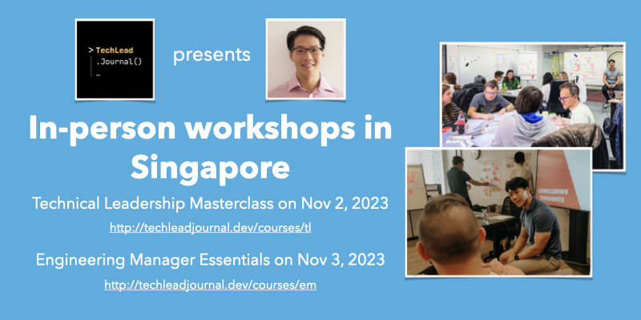
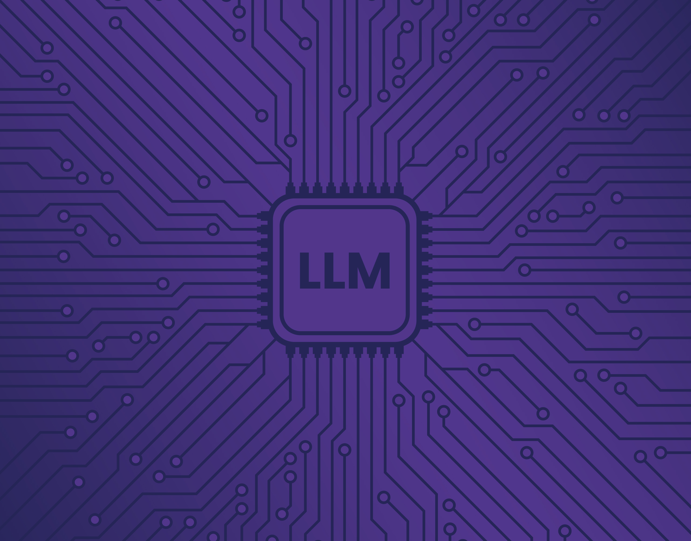
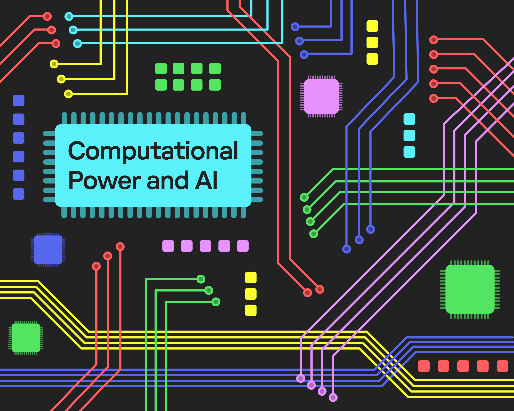
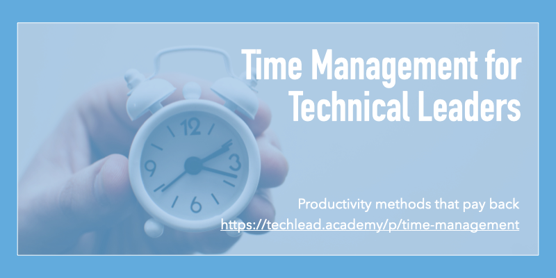
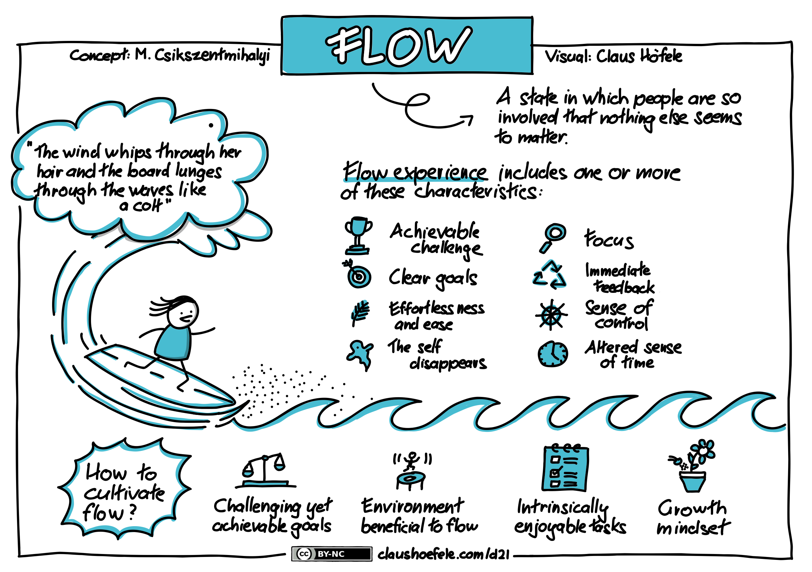

| 
<table role="presentation" data-immersive-translate-effect="1" data-immersive_translate_walked="db4a3054-6635-4ef3-9852-63428cfecab2"><tbody data-immersive-translate-effect="1" data-immersive_translate_walked="db4a3054-6635-4ef3-9852-63428cfecab2"><tr data-immersive-translate-effect="1" data-immersive_translate_walked="db4a3054-6635-4ef3-9852-63428cfecab2"><td data-immersive-translate-effect="1" data-immersive_translate_walked="db4a3054-6635-4ef3-9852-63428cfecab2">

</td></tr><tr data-immersive-translate-effect="1" data-immersive_translate_walked="db4a3054-6635-4ef3-9852-63428cfecab2"><td data-immersive-translate-effect="1" data-immersive_translate_walked="db4a3054-6635-4ef3-9852-63428cfecab2">

Oct 1, 2023 · Issue #216 2023 年 10 月 1 日 - 第 216 期

<strong data-immersive-translate-effect="1" data-immersive_translate_walked="db4a3054-6635-4ef3-9852-63428cfecab2">Level Up</strong><relin-hc data-immersive-translate-effect="1" data-immersive_translate_walked="db4a3054-6635-4ef3-9852-63428cfecab2"> is a <relin-highlight id="relin-1" data-word="curated" data-immersive-translate-effect="1" data-immersive_translate_walked="db4a3054-6635-4ef3-9852-63428cfecab2"><relin-origin data-immersive-translate-effect="1" data-immersive_translate_walked="db4a3054-6635-4ef3-9852-63428cfecab2">curated</relin-origin></relin-highlight> newsletter for leaders in tech. A project by </relin-hc><a href="https://9nwl1.r.a.d.sendibm1.com/mk/cl/f/Q1h8awz3VR0yD5zlhgYmWsjmvH0ailpmKiZHAEglbuewsoFv1CoJtso1M09UpBIOcehVdUZuK-GYHi-fNfhl-VBWdAW9u_YRHQtK5b79qmHEEKuoIAmTb2yG8vcWL-4J1orkjySz2I_BZwWBGrrvfBfvc1S4r8H7LLvGjHxQ1vZfVgG5Tl556_2qGd0We41dCX0UZmHhAFmptX7wkDWPHFUV2THaVsRjXz8C4unKdCb4Iij5oQHGKUx6vdllrQz3R1OKvnp763mch2pDrcAs1ypDFwo" target="_blank" sib_link_id="0" data-immersive-translate-effect="1" data-immersive_translate_walked="db4a3054-6635-4ef3-9852-63428cfecab2">https://patkua.com</a>. Ideal for busy people such as Tech Leads, Engineering Managers, VPs of Engineering, CTOs and more.&nbsp; Level Up 是一份为科技界领袖精心策划的时事通讯。是 https://patkua.com 的一个项目。是技术负责人、工程经理、工程副总裁、首席技术官等忙碌人士的理想选择。

</td></tr><tr><td></td></tr></tbody></table>

 |
| --- |

| 
<table role="presentation" data-immersive-translate-effect="1" data-immersive_translate_walked="db4a3054-6635-4ef3-9852-63428cfecab2"><tbody data-immersive-translate-effect="1" data-immersive_translate_walked="db4a3054-6635-4ef3-9852-63428cfecab2"><tr data-immersive-translate-effect="1" data-immersive_translate_walked="db4a3054-6635-4ef3-9852-63428cfecab2"><td data-immersive-translate-effect="1" data-immersive_translate_walked="db4a3054-6635-4ef3-9852-63428cfecab2">

<h2 data-immersive-translate-effect="1" data-immersive_translate_walked="db4a3054-6635-4ef3-9852-63428cfecab2">Onboarding processes&nbsp;入职流程</h2>

</td></tr><tr data-immersive-translate-effect="1" data-immersive_translate_walked="db4a3054-6635-4ef3-9852-63428cfecab2"><td data-immersive-translate-effect="1" data-immersive_translate_walked="db4a3054-6635-4ef3-9852-63428cfecab2">

An effective onboarding process helps new team members be as effective as they can be. A lot of managers think about this for less experienced team members, but often assume that senior team members can take care of themselves. While senior team members do have some agency, every manager, even all the way up to the executive team, should invest some time that smooths the transition for a new team member. 有效的入职流程可以帮助新团队成员发挥最大效能。很多经理都会为经验较少的团队成员考虑这一点，但往往认为资深团队成员可以照顾好自己。虽然资深团队成员确实有一定的代理权，但每一位经理，甚至一直到高管团队，都应该投入一些时间，帮助新团队成员顺利过渡。

Although onboarding processes will depend on the team/role, there are plenty of good starting points such as: 虽然入职流程取决于团队/职位，但有很多良好的起点，例如
<ul data-immersive-translate-effect="1" data-immersive_translate_walked="db4a3054-6635-4ef3-9852-63428cfecab2"><li data-immersive-translate-effect="1" data-immersive_translate_walked="db4a3054-6635-4ef3-9852-63428cfecab2"><strong data-immersive-translate-effect="1" data-immersive_translate_walked="db4a3054-6635-4ef3-9852-63428cfecab2">Company purpose</strong> - An overview of the company, products and differentiators 公司宗旨 - 公司简介、产品和差异化优势</li><li data-immersive-translate-effect="1" data-immersive_translate_walked="db4a3054-6635-4ef3-9852-63428cfecab2"><strong data-immersive-translate-effect="1" data-immersive_translate_walked="db4a3054-6635-4ef3-9852-63428cfecab2">Team/role purpose</strong> - A reminder about how the team connects to the overall process 团队/角色目的--提示团队如何与整个流程相联系</li><li data-immersive-translate-effect="1" data-immersive_translate_walked="db4a3054-6635-4ef3-9852-63428cfecab2"><strong data-immersive-translate-effect="1" data-immersive_translate_walked="db4a3054-6635-4ef3-9852-63428cfecab2">Company/team culture</strong> - An overview of any expectations that have already been established with stories or examples that bring them to life 公司/团队文化--概述已确立的任何期望，并通过故事或实例将其体现出来</li><li data-immersive-translate-effect="1" data-immersive_translate_walked="db4a3054-6635-4ef3-9852-63428cfecab2"><strong data-immersive-translate-effect="1" data-immersive_translate_walked="db4a3054-6635-4ef3-9852-63428cfecab2">People map</strong> - All the people/departments someone should meet and build a relationship with to help them be most effective 人员地图--某人应会见并与之建立关系的所有人员/部门，以帮助其发挥最大效力</li><li data-immersive-translate-effect="1" data-immersive_translate_walked="db4a3054-6635-4ef3-9852-63428cfecab2"><strong data-immersive-translate-effect="1" data-immersive_translate_walked="db4a3054-6635-4ef3-9852-63428cfecab2">List of processes</strong> - Each organisation has their own rules/processes for logistics such as expenses, travel, etc. Make sure these are available and have them ready to go. You will also have a list of team processes such as code reviews, deployment processes, etc 流程清单 - 每个组织都有自己的后勤规则/流程，如费用、差旅等。请确保这些规则/流程已经准备就绪。您还将有一份团队流程清单，如代码审查、部署流程等。</li><li data-immersive-translate-effect="1" data-immersive_translate_walked="db4a3054-6635-4ef3-9852-63428cfecab2"><strong data-immersive-translate-effect="1" data-immersive_translate_walked="db4a3054-6635-4ef3-9852-63428cfecab2">Team Rituals</strong> - An overview of existing team agreements (e.g. communication channels, stand-ups, etc) 团队仪式 - 现有团队协议概览（如沟通渠道、站立式会议等）</li><li data-immersive-translate-effect="1" data-immersive_translate_walked="db4a3054-6635-4ef3-9852-63428cfecab2"><strong data-immersive-translate-effect="1" data-immersive_translate_walked="db4a3054-6635-4ef3-9852-63428cfecab2">What success looks like</strong> - Consider setting a 30-60-90 day set of goals and objectives to help them build a sense of achievement and accomplishment. Think of these as tasks they can check off to see progress 成功是什么样的--考虑制定一套 30-60-90 天的目标，帮助他们建立成就感。把这些当作他们可以核对的任务，以了解进展情况</li><li data-immersive-translate-effect="1" data-immersive_translate_walked="db4a3054-6635-4ef3-9852-63428cfecab2"><strong data-immersive-translate-effect="1" data-immersive_translate_walked="db4a3054-6635-4ef3-9852-63428cfecab2">Onboarding buddy</strong> - Someone to ask when they have questions, and they will have questions 入职培训伙伴 - 当他们有问题时可以向他们咨询，他们也会有问题的</li></ul>
You can invest a lot of time building a great onboarding process, but try to be pragmatic about it. Your challenge this week is to look at your team's onboarding process. What is one thing you can do to improve it?&nbsp; 你可以投入大量时间来建立一个优秀的入职流程，但要尽量务实。本周你们面临的挑战是审视团队的入职流程。有什么可以改进的地方？

I hope you enjoy this week’s newsletter! Share it with a friend or colleague if you find it helpful, or drop me <a href="mailto:pat@patkua.com?subject=Future%20Level%20Up%20Newsletter%20Topic" target="_blank" data-immersive-translate-effect="1" data-immersive_translate_walked="db4a3054-6635-4ef3-9852-63428cfecab2">an email</a> about topics you’d like to hear about in future editions. 希望您喜欢本周的时事通讯！如果您觉得本周时事通讯对您有帮助，请与朋友或同事分享，或者给我发送电子邮件，告诉我您希望在今后的时事通讯中听到的主题。

Looking to level up your technical leadership skills? Join an <a href="https://9nwl1.r.a.d.sendibm1.com/mk/cl/f/Xbb4yEO6ggwvNU6ZliUGyFIiliIzsRBG93zCaMtBCV4M6VN8_fW7QgTyrf_3LRxmXPfWmWyDJD4b3XkDYNAk7nZMDLDH1tI9fLGpqCWBPRmMh_RTE8UQ9-MVUSaemSuFhXj60BDnXFmnY_QYl9lU6KbnbBuj82s2ADwRCkpye-PlDOXrJqA05GYNS7U9eM5lNe5r_4S6mfe9Aa8_OTQxdP-a74R3iiJU-xcuP4YOmXjFJcD_W4n23UIB1n7Xs44IV7VXWxDeyc8lox34kuQJx349Thq7UPAnOS5Jf98mMU2LVVIUmIOHZPymfYQmi4QQ" target="_blank" sib_link_id="1" data-immersive-translate-effect="1" data-immersive_translate_walked="db4a3054-6635-4ef3-9852-63428cfecab2">online cohort-based workshop</a> for technical leadership or engineering management skills or take a self-paced course at the <a href="https://9nwl1.r.a.d.sendibm1.com/mk/cl/f/SJzw5mMdBP-7-QpkRTZm8uqhBf9N9vvMW8eNnfabScwEbi-qA4k3cOHlNy09yG9nw3MMaSE_mYvjglqNRoT64ugzZnR8xl-w2Bbc8XVTPLVuOj4PTN-2u6lH9hDLt1BdcdrXCJ5Ji59V_GJUycxU5JW0w2FsPRkRXh0q6eWIA30q4AcQfKNR7Iz9e5s3kotbSfI0Uz2ne04fRc5Lc68qrnxcu0MNiwtbR9MNwIhUKrqv2lT1_aTEdFr-Sk2Vppo7A7depBwqkWKuvCXmiXyAHM-5L3Sn-luUwpM" target="_blank" sib_link_id="2" data-immersive-translate-effect="1" data-immersive_translate_walked="db4a3054-6635-4ef3-9852-63428cfecab2">https://techlead.academy</a>. 想要提升自己的技术领导技能？参加技术领导力或工程管理技能在线小组研讨会，或在 https://techlead.academy 上自学课程。

</td></tr><tr data-immersive-translate-effect="1" data-immersive_translate_walked="db4a3054-6635-4ef3-9852-63428cfecab2"><td data-immersive-translate-effect="1" data-immersive_translate_walked="db4a3054-6635-4ef3-9852-63428cfecab2"></td></tr><tr data-immersive-translate-effect="1" data-immersive_translate_walked="db4a3054-6635-4ef3-9852-63428cfecab2"><td data-immersive-translate-effect="1" data-immersive_translate_walked="db4a3054-6635-4ef3-9852-63428cfecab2">

</td></tr><tr data-immersive-translate-effect="1" data-immersive_translate_walked="db4a3054-6635-4ef3-9852-63428cfecab2"><td data-immersive-translate-effect="1" data-immersive_translate_walked="db4a3054-6635-4ef3-9852-63428cfecab2">

What does your current employee onboarding process look like? 您目前的员工入职流程是怎样的？

</td></tr><tr data-immersive-translate-effect="1" data-immersive_translate_walked="db4a3054-6635-4ef3-9852-63428cfecab2"><td data-immersive-translate-effect="1" data-immersive_translate_walked="db4a3054-6635-4ef3-9852-63428cfecab2">

<h2 data-immersive-translate-effect="1" data-immersive_translate_walked="db4a3054-6635-4ef3-9852-63428cfecab2">Sponsored Content&nbsp;赞助内容</h2>

</td></tr><tr data-immersive-translate-effect="1" data-immersive_translate_walked="db4a3054-6635-4ef3-9852-63428cfecab2"><td data-immersive-translate-effect="1" data-immersive_translate_walked="db4a3054-6635-4ef3-9852-63428cfecab2">

<strong data-immersive-translate-effect="1" data-immersive_translate_walked="db4a3054-6635-4ef3-9852-63428cfecab2">Platform Engineer Opportunity @ Ecosia 平台工程师机会 @ Ecosia</strong>

At <a href="https://9nwl1.r.a.d.sendibm1.com/mk/cl/f/Beq7Oyhl3vp3PagTKDkNFaojjd0ZNGb2aGTcjJHjnJ0zzBiBY5ZP4kb0jgZI1Yyu_k_3NbjDMWA-Xk0quIlYvW57tvfQp7LAQFGcY-dzNmqpn4JLsc70U9VXLFZai1R285vGvkTvfQyiZtiEJDwby9QFzt-Tigt0ods46LkXIzoVyTdtNTHJsby693-tzLWYBws8FWk_Vmb2aVqB7-mdD5BhU4SH_MBtU5mAA9Wo4fT457GEQhYPZq4bmmiWDQbqFCdzFadn-4Na2Ehi730crds8G9jByVBAbmmNBIXeTKeZ" sib_link_id="3" data-immersive-translate-effect="1" data-immersive_translate_walked="db4a3054-6635-4ef3-9852-63428cfecab2"><u data-immersive-translate-effect="1" data-immersive_translate_walked="db4a3054-6635-4ef3-9852-63428cfecab2">Ecosia</u></a>, we're looking for a Platform Engineer (all genders) with expertise in cloud-native application development and developer experience to join us remotely or in Berlin. 在 Ecosia，我们正在寻找一名拥有云原生应用程序开发专业知识和开发人员经验的平台工程师（男女不限）远程或在柏林加入我们。

Appy <a href="https://9nwl1.r.a.d.sendibm1.com/mk/cl/f/Bn1B50NY5PYd9oN3bcFQ9x8YEtVFwAkp0vBB5Mls7Kyc_puU2M7f5pCzCMdC7EWza6a5DP7Dc0sjB2Ig75j9cvbyTA1LS3d0fPzvxq-Tv5862VosH8_XWlL30VOyjOAICt5f7oM_dJMm9Eui-NLLJ1_0mPSs0c7vfDEem65wJ3yKh2pdqdh836OYJ1JwhguOTT6dxqfO-g3dOCckLRyZFphScmZ8eeVhFKKL-4sGlR3njNJM5sdZsLM4lGdXKcPnCkW46RKd64iTOH7JhuT_FgONm7Hfx6DBJCHwun9nAbVh2cXAO7DN" sib_link_id="4" data-immersive-translate-effect="1" data-immersive_translate_walked="db4a3054-6635-4ef3-9852-63428cfecab2"><u data-immersive-translate-effect="1" data-immersive_translate_walked="db4a3054-6635-4ef3-9852-63428cfecab2">here</u></a>&nbsp;这里是 Appy!

</td></tr><tr data-immersive-translate-effect="1" data-immersive_translate_walked="db4a3054-6635-4ef3-9852-63428cfecab2"><td data-immersive-translate-effect="1" data-immersive_translate_walked="db4a3054-6635-4ef3-9852-63428cfecab2">

<h2 data-immersive-translate-effect="1" data-immersive_translate_walked="db4a3054-6635-4ef3-9852-63428cfecab2">Leadership&nbsp;领导能力</h2>

</td></tr></tbody></table>

 |
| --- |

| 

 | 

<table role="presentation" data-immersive-translate-effect="1" data-immersive_translate_walked="db4a3054-6635-4ef3-9852-63428cfecab2"><tbody data-immersive-translate-effect="1" data-immersive_translate_walked="db4a3054-6635-4ef3-9852-63428cfecab2"><tr data-immersive-translate-effect="1" data-immersive_translate_walked="db4a3054-6635-4ef3-9852-63428cfecab2"><td data-immersive-translate-effect="1" data-immersive_translate_walked="db4a3054-6635-4ef3-9852-63428cfecab2"></td></tr><tr data-immersive-translate-effect="1" data-immersive_translate_walked="db4a3054-6635-4ef3-9852-63428cfecab2"><td data-immersive-translate-effect="1" data-immersive_translate_walked="db4a3054-6635-4ef3-9852-63428cfecab2">

<i data-immersive-translate-effect="1" data-immersive_translate_walked="db4a3054-6635-4ef3-9852-63428cfecab2">Reading time: 7mins&nbsp;阅读时间：7 分钟</i>

<a href="https://9nwl1.r.a.d.sendibm1.com/mk/cl/f/Ay5EKt08BrhNxmP3Z-DfqXciQI3Lk6r5FN3hUYdQ9_rqyHQTgWG2O6t3TFwpwTyXlRU5AWSwY6zgnWfrLJ7F72XMBiE8GK2OYZLuaCRThUW74FLEWvWWxeiMU3aHh63ffTNQOqG4Ub_4MDxubRAE1Yv0UMZYrN1cTHugfYd4PgzMMW2OtyriW0nK7hmJO6163-mbdVriL5ADqMa2_02Taojrysd0fI8XrkjisBcQ_AzG2jUmN7cH9wATiPm6CXZf2Sos-OVyB6iPaCtKAIJy0quCndpcHHpQ0FU2VgR3DwF1tr4oFg" target="_blank" sib_link_id="6" data-immersive-translate-effect="1" data-immersive_translate_walked="db4a3054-6635-4ef3-9852-63428cfecab2">Marco Favaloro (@MarcoFavaloro)</a> points out that hybrid/remote work demands more from managers and offers three suggestions to make it easier. Marco Favaloro (@MarcoFavaloro) 指出，混合/远程工作对管理者提出了更高的要求，并提出了三点建议，让工作变得更轻松。

</td></tr></tbody></table>

 |
| --- | --- |

| 

 | 

<table role="presentation" data-immersive-translate-effect="1" data-immersive_translate_walked="db4a3054-6635-4ef3-9852-63428cfecab2"><tbody data-immersive-translate-effect="1" data-immersive_translate_walked="db4a3054-6635-4ef3-9852-63428cfecab2"><tr data-immersive-translate-effect="1" data-immersive_translate_walked="db4a3054-6635-4ef3-9852-63428cfecab2"><td data-immersive-translate-effect="1" data-immersive_translate_walked="db4a3054-6635-4ef3-9852-63428cfecab2"></td></tr><tr data-immersive-translate-effect="1" data-immersive_translate_walked="db4a3054-6635-4ef3-9852-63428cfecab2"><td data-immersive-translate-effect="1" data-immersive_translate_walked="db4a3054-6635-4ef3-9852-63428cfecab2">

<i data-immersive-translate-effect="1" data-immersive_translate_walked="db4a3054-6635-4ef3-9852-63428cfecab2">Reading time: 6mins&nbsp;阅读时间：6 分钟</i>

Engineering leader at Canva, <a href="https://9nwl1.r.a.d.sendibm1.com/mk/cl/f/3Zqd4FcmURejtMwBRk4V6NDS9iwEF32TeCgFKTEHZ3jmauw-fdSGYx9f9yh4Dmu5yRPPgnBWVRlZnthFhsRH7wutSWjHA_lcX-lYODW2DyGVuaKH0I3nhwBM3gy24LsH7_tqIE4l12VbvqxbU8FJLxgR_UayOK8XFVkWfiv37gvKGnCxcHvcZKPGVWcTcAPeD2Un2HtSam0Poq_cUvk6cyn632GUFAfsuPCB2rjDySf25peKYSEIzomq_n5eAiGMrrcDpVGRFfJe-nTpdbep83wTuyfYsxyIF4-w2jGAcVegMpAf" target="_blank" sib_link_id="8" data-immersive-translate-effect="1" data-immersive_translate_walked="db4a3054-6635-4ef3-9852-63428cfecab2">Leonardo Borges (@theleoborges)</a> outlines some poor reasons to seek a management role 🤔. Canva 工程主管莱昂纳多-博尔热斯（@theleoborges）概述了寻求管理职位的一些糟糕理由🤔。

</td></tr></tbody></table>

 |
| --- | --- |

| 

 | 

<table role="presentation" data-immersive-translate-effect="1" data-immersive_translate_walked="db4a3054-6635-4ef3-9852-63428cfecab2"><tbody data-immersive-translate-effect="1" data-immersive_translate_walked="db4a3054-6635-4ef3-9852-63428cfecab2"><tr data-immersive-translate-effect="1" data-immersive_translate_walked="db4a3054-6635-4ef3-9852-63428cfecab2"><td data-immersive-translate-effect="1" data-immersive_translate_walked="db4a3054-6635-4ef3-9852-63428cfecab2"></td></tr><tr data-immersive-translate-effect="1" data-immersive_translate_walked="db4a3054-6635-4ef3-9852-63428cfecab2"><td data-immersive-translate-effect="1" data-immersive_translate_walked="db4a3054-6635-4ef3-9852-63428cfecab2">

<i data-immersive-translate-effect="1" data-immersive_translate_walked="db4a3054-6635-4ef3-9852-63428cfecab2">Reading time: 8mins&nbsp;阅读时间：8 分钟</i>

I've found that engineers are weak at recognising and managing emotions, which is essential in a leadership or management role. Miriam Groom advises what to practise. 我发现工程师们在识别和管理情绪方面很薄弱，而这对于领导或管理角色来说至关重要。米里亚姆-格鲁姆（Miriam Groom）建议应如何练习。

</td></tr></tbody></table>

 |
| --- | --- |

| 
<table role="presentation" data-immersive-translate-effect="1" data-immersive_translate_walked="db4a3054-6635-4ef3-9852-63428cfecab2"><tbody data-immersive-translate-effect="1" data-immersive_translate_walked="db4a3054-6635-4ef3-9852-63428cfecab2"><tr data-immersive-translate-effect="1" data-immersive_translate_walked="db4a3054-6635-4ef3-9852-63428cfecab2"><td data-immersive-translate-effect="1" data-immersive_translate_walked="db4a3054-6635-4ef3-9852-63428cfecab2">

</td></tr><tr data-immersive-translate-effect="1" data-immersive_translate_walked="db4a3054-6635-4ef3-9852-63428cfecab2"><td data-immersive-translate-effect="1" data-immersive_translate_walked="db4a3054-6635-4ef3-9852-63428cfecab2"></td></tr></tbody></table>

 |
| --- |

| 
## Technology 技术

 |
| --- |

| 

 | 

<table role="presentation" data-immersive-translate-effect="1" data-immersive_translate_walked="db4a3054-6635-4ef3-9852-63428cfecab2"><tbody data-immersive-translate-effect="1" data-immersive_translate_walked="db4a3054-6635-4ef3-9852-63428cfecab2"><tr data-immersive-translate-effect="1" data-immersive_translate_walked="db4a3054-6635-4ef3-9852-63428cfecab2"><td data-immersive-translate-effect="1" data-immersive_translate_walked="db4a3054-6635-4ef3-9852-63428cfecab2"></td></tr><tr data-immersive-translate-effect="1" data-immersive_translate_walked="db4a3054-6635-4ef3-9852-63428cfecab2"><td data-immersive-translate-effect="1" data-immersive_translate_walked="db4a3054-6635-4ef3-9852-63428cfecab2">

<i data-immersive-translate-effect="1" data-immersive_translate_walked="db4a3054-6635-4ef3-9852-63428cfecab2">Reading time: 15mins&nbsp;阅读时间：15 分钟</i>

Co-founder and CTO, <a href="https://9nwl1.r.a.d.sendibm1.com/mk/cl/f/Bos8y20a7sZTWOW4kQQ9s59RZaw5gw6Azm69foXat4FbY-9oj7jRBiVykQWe_4vS9ImxGNHM-9jG8brYrwuRDJZiWIY2k8E2C6pxAV-bmNVQrZPCZ6yOLSp1Fa8aIhVHKStn-lRtOSVuQnx0cEBr3A0729QwUbLzWnk-N4ArwDuehulJv9YXIpmOEBNWfiBkYdsRqXZyRb0zo4fO9j0JNt_l7ZSoyAnQJ3vAKc82kNCh32U47X9l7J6C4eKpBKPMcyvrnib0bB9gaQ3ZgKQEyyn1hl9E_QowH_AMSUEfUp-CajM" target="_blank" sib_link_id="14" data-immersive-translate-effect="1" data-immersive_translate_walked="db4a3054-6635-4ef3-9852-63428cfecab2">Charity Majors (@mipsytipsy)</a> hypothesises about teams can better work with LLMs. 联合创始人兼首席技术官 Charity Majors (@mipsytipsy) 假设团队可以更好地与法学硕士合作。

</td></tr></tbody></table>

 |
| --- | --- |

| 

 | 

<table role="presentation" data-immersive-translate-effect="1" data-immersive_translate_walked="db4a3054-6635-4ef3-9852-63428cfecab2"><tbody data-immersive-translate-effect="1" data-immersive_translate_walked="db4a3054-6635-4ef3-9852-63428cfecab2"><tr data-immersive-translate-effect="1" data-immersive_translate_walked="db4a3054-6635-4ef3-9852-63428cfecab2"><td data-immersive-translate-effect="1" data-immersive_translate_walked="db4a3054-6635-4ef3-9852-63428cfecab2"></td></tr><tr data-immersive-translate-effect="1" data-immersive_translate_walked="db4a3054-6635-4ef3-9852-63428cfecab2"><td data-immersive-translate-effect="1" data-immersive_translate_walked="db4a3054-6635-4ef3-9852-63428cfecab2">

<i data-immersive-translate-effect="1" data-immersive_translate_walked="db4a3054-6635-4ef3-9852-63428cfecab2">Reading time: 77mins or 49 page PDF&nbsp; 阅读时间：77 分钟或 49 页 PDF 文件</i>

<a href="https://9nwl1.r.a.d.sendibm1.com/mk/cl/f/0j_LKTSKqXQLUbeEHSF_6BxjigN0T_jbMP6-mkTKTrnidZDoqueo0B2vJ4RbmoS9XPJAnT1XugNWiS5Yfv-KYQrCGY0qc1oM4osGgVmGptlzvMC-8Ks16czjiEpw18o9yOemOfDkanp8xrIfA7a1SAQL3a3dUi0RgaJ9ZRTeREpteQll05jUNoY43oTI9ql-XbeHlKLIhvwAxmKwR-S0TZ4NOif3zqAT2q6eLhxwIZs9xZXvc9OehubLooOfJ9x2hIOZgdlsDsYPm09i158qvLxsd7KW7UV3U5qqaMNmnGDZkQ" target="_blank" sib_link_id="16" data-immersive-translate-effect="1" data-immersive_translate_walked="db4a3054-6635-4ef3-9852-63428cfecab2">Jai Vipra (@JaaiVipra)</a> &amp; <a href="https://9nwl1.r.a.d.sendibm1.com/mk/cl/f/qSbG-oSi0bzDp0RqV_GZXdIeiBdpdCXHPdC5zK3j5wDhhry3UznfZj_b32KpJSnn7dYslxMGdfdHtizB0LZ4AkrWqLXGxkEDFdW7-IyMwcilexS1WZXCJZRi9MSLSyj2RGWWgnBhTyMmn8Re7zE7DHSispwFoTUFupy0fBehP27pR_wvhWVjRGzi_moec9R9cePc61ZQbz6e3T4Zs-GwFkRbAjATP97WDNczF4lv6HCnPHppc2kJ1jwRvYsQXv-_4I32De9tksrQwhtbqBu5BNC9ws0KvkcxgG8TCsl7F8pJ146a" target="_blank" sib_link_id="17" data-immersive-translate-effect="1" data-immersive_translate_walked="db4a3054-6635-4ef3-9852-63428cfecab2">Sarah Myers West (@sarahbmyers) </a>published a recent report on the impact of AI and compute. There's no executive summary so skip to page 38 for some examples of the current trends/consequences. Jai Vipra（@JaaiVipra）和 Sarah Myers West（@sarahbmyers）最近发表了一份关于人工智能和计算的影响的报告。报告没有执行摘要，因此请跳至第 38 页，以了解当前趋势/后果的一些实例。

</td></tr></tbody></table>

 |
| --- | --- |

| 

 | 

<table role="presentation" data-immersive-translate-effect="1" data-immersive_translate_walked="db4a3054-6635-4ef3-9852-63428cfecab2"><tbody data-immersive-translate-effect="1" data-immersive_translate_walked="db4a3054-6635-4ef3-9852-63428cfecab2"><tr data-immersive-translate-effect="1" data-immersive_translate_walked="db4a3054-6635-4ef3-9852-63428cfecab2"><td data-immersive-translate-effect="1" data-immersive_translate_walked="db4a3054-6635-4ef3-9852-63428cfecab2"></td></tr><tr data-immersive-translate-effect="1" data-immersive_translate_walked="db4a3054-6635-4ef3-9852-63428cfecab2"><td data-immersive-translate-effect="1" data-immersive_translate_walked="db4a3054-6635-4ef3-9852-63428cfecab2">

<i data-immersive-translate-effect="1" data-immersive_translate_walked="db4a3054-6635-4ef3-9852-63428cfecab2">Reading time: 12mins&nbsp;阅读时间：12 分钟</i>

In this technical deep dive, <a href="https://9nwl1.r.a.d.sendibm1.com/mk/cl/f/-OXZFTnUFUzETieN4GpI6GYL2qUg10JvELzB4mhKeSU88h_bAr3z-rPV6u-WoEfaPPbwnanG-VzT8MCsi5z4nSWnfQliEztHOtgDPNI0pNR3Rt1JchAYMQVn0tzvQ3jlsI224VPYg9sRP6FI7umce3JQh08T-v8WRAtSmM5H3QfL5cVrUuv-g2Y2Xnh-mkZDuyPWvt9IjQzbqb53slVO-Tkuc3oTwVO0ShOLtgTqAWPYjYIBa-bKKxREvpB7HrXCH8E-3o5gIXJ2pOr1mwgNBytuJCpNiEk_IJ-_XhMxXqfiJw" target="_blank" sib_link_id="19" data-immersive-translate-effect="1" data-immersive_translate_walked="db4a3054-6635-4ef3-9852-63428cfecab2">Phil Eaton (@eatonphil)</a> looks at how different DBs execute expressions.&nbsp; Phil Eaton (@eatonphil) 将在这篇技术深度报道中探讨不同数据库如何执行表达式。

</td></tr></tbody></table>

 |
| --- | --- |

| 
<table role="presentation" data-immersive-translate-effect="1" data-immersive_translate_walked="db4a3054-6635-4ef3-9852-63428cfecab2"><tbody data-immersive-translate-effect="1" data-immersive_translate_walked="db4a3054-6635-4ef3-9852-63428cfecab2"><tr data-immersive-translate-effect="1" data-immersive_translate_walked="db4a3054-6635-4ef3-9852-63428cfecab2"><td data-immersive-translate-effect="1" data-immersive_translate_walked="db4a3054-6635-4ef3-9852-63428cfecab2">

</td></tr><tr data-immersive-translate-effect="1" data-immersive_translate_walked="db4a3054-6635-4ef3-9852-63428cfecab2"><td data-immersive-translate-effect="1" data-immersive_translate_walked="db4a3054-6635-4ef3-9852-63428cfecab2">

All leaders struggle with enough time. Learn how to maximise yours with this <a href="https://9nwl1.r.a.d.sendibm1.com/mk/cl/f/_mOlRHqK66HkPaYwkZnnSR20_yXlIWNufBHUxeLvshZq1Qc0uB5ZzTx9IJtlsfO5dzPhwTrr_c0IVso0bBXKDQEDlYeVzw1bukNaSFPHmf_7v4D8jjnpYtSrZIGvsS8cMgevZRL2DooV6VTCjV9XGNg8zQgg9R6C3zZTnca6K4qefctvVf_lrGJB5e6kG0HPwOiMDa8CSXlLO9nCZG1rD_OO7_U5TGvZ_dcpTe4HGQzJfcSmuDauxfhePiz_L4ZTnOvrqj1u1kiOS9mvvSG2vQSGrLkWV61gLFYFkutQSb5lVLgS1TcID68THmcZNu3ktQ" target="_blank" sib_link_id="21" data-immersive-translate-effect="1" data-immersive_translate_walked="db4a3054-6635-4ef3-9852-63428cfecab2">self-paced course.</a> 所有领导者都在为时间不够而苦恼。通过这门自定进度的课程，学习如何最大限度地利用时间。

</td></tr><tr data-immersive-translate-effect="1" data-immersive_translate_walked="db4a3054-6635-4ef3-9852-63428cfecab2"><td data-immersive-translate-effect="1" data-immersive_translate_walked="db4a3054-6635-4ef3-9852-63428cfecab2">

<h2 data-immersive-translate-effect="1" data-immersive_translate_walked="db4a3054-6635-4ef3-9852-63428cfecab2">Organisations &amp; Processes 组织与流程</h2>

</td></tr></tbody></table>

 |
| --- |

| 

 | 

<table role="presentation" data-immersive-translate-effect="1" data-immersive_translate_walked="db4a3054-6635-4ef3-9852-63428cfecab2"><tbody data-immersive-translate-effect="1" data-immersive_translate_walked="db4a3054-6635-4ef3-9852-63428cfecab2"><tr data-immersive-translate-effect="1" data-immersive_translate_walked="db4a3054-6635-4ef3-9852-63428cfecab2"><td data-immersive-translate-effect="1" data-immersive_translate_walked="db4a3054-6635-4ef3-9852-63428cfecab2"></td></tr><tr data-immersive-translate-effect="1" data-immersive_translate_walked="db4a3054-6635-4ef3-9852-63428cfecab2"><td data-immersive-translate-effect="1" data-immersive_translate_walked="db4a3054-6635-4ef3-9852-63428cfecab2">

<i data-immersive-translate-effect="1" data-immersive_translate_walked="db4a3054-6635-4ef3-9852-63428cfecab2">Reading time: 5mins&nbsp;阅读时间：5 分钟</i>

Engineering leader <a href="https://9nwl1.r.a.d.sendibm1.com/mk/cl/f/Xifxh1JMYXeZ1fzZnCxhW03P4MxuyaxsDsVj4Bcy1ExVKzUX6aXmujkvj-mPMbWN7dV8Da50euyWBokM5ZM2uov_tgUC4sLqis6BBJHPZ8lhDJvu78fio7e8ttCoy372FuKJkLznb2LBsJdSq60rgWg2fheBvxDRI3IMWfs-VcPKBpDnLtAJi_a7u_IOCL7KoLbj-XEspjHkzwL5KQy1B4l46zNHLStq0t1l245D6RM5u3O3Yeb3i4Lj5XUvzWrzrZdqGV7bnVnid4Qtd6i-SeqogH9YVdWYw3Zs6S4oGoYGE_ZqHg" target="_blank" sib_link_id="23" data-immersive-translate-effect="1" data-immersive_translate_walked="db4a3054-6635-4ef3-9852-63428cfecab2">Claus Höfele (@claushoefele)</a> puts together some fun visualisations of different leadership topics and in this one, looks at the idea of Flow.&nbsp; 工程领导者克劳斯-霍费尔（@claus Höfele）就不同的领导力主题制作了一些有趣的可视化图表，在这幅图表中，他探讨了 "流动"（Flow）的概念。

</td></tr></tbody></table>

 |
| --- | --- |

| 

 | 

<table role="presentation" data-immersive-translate-effect="1" data-immersive_translate_walked="db4a3054-6635-4ef3-9852-63428cfecab2"><tbody data-immersive-translate-effect="1" data-immersive_translate_walked="db4a3054-6635-4ef3-9852-63428cfecab2"><tr data-immersive-translate-effect="1" data-immersive_translate_walked="db4a3054-6635-4ef3-9852-63428cfecab2"><td data-immersive-translate-effect="1" data-immersive_translate_walked="db4a3054-6635-4ef3-9852-63428cfecab2"></td></tr><tr data-immersive-translate-effect="1" data-immersive_translate_walked="db4a3054-6635-4ef3-9852-63428cfecab2"><td data-immersive-translate-effect="1" data-immersive_translate_walked="db4a3054-6635-4ef3-9852-63428cfecab2">

<i data-immersive-translate-effect="1" data-immersive_translate_walked="db4a3054-6635-4ef3-9852-63428cfecab2">Reading time: 4mins&nbsp;阅读时间4 分钟</i>

Technology leader <a href="https://9nwl1.r.a.d.sendibm1.com/mk/cl/f/8eI_WhzbBnmwZZjogmwZLaiakj62MHucg4fKQmA4KNo95gtKZMak_9_2T9Tc8asdscz8Mf0zc58SkjOT7fWr4hYagTKwH10r3UEX7sGeWTJwtwf9Y2rkXmsj4VjOexCX5Y68fiTh_NlGM966b9MvHdPatIhMIGXRchR51BJ_3KymE71JgeiE0vlfHjCOoCkk6vBAPiFIxL3Fnup_nMbbbuLzy9Px843CrV4YTOK0g03iV4Pzvh7yXZ7VFDopd0zmxXGZujlFT5zX0VooZcueEmrjwz-TezVI2mMvyFPyXC8dQFRF4ZM" target="_blank" sib_link_id="25" data-immersive-translate-effect="1" data-immersive_translate_walked="db4a3054-6635-4ef3-9852-63428cfecab2">Daniel Horton (@DanielkHorton) </a>offers a practical guide to networking/maintaining relationships. 技术领袖丹尼尔-霍顿（@DanielkHorton）提供了一份建立关系网/维护关系的实用指南。

</td></tr></tbody></table>

 |
| --- | --- |

| 

 | 

<table role="presentation" data-immersive-translate-effect="1" data-immersive_translate_walked="db4a3054-6635-4ef3-9852-63428cfecab2"><tbody data-immersive-translate-effect="1" data-immersive_translate_walked="db4a3054-6635-4ef3-9852-63428cfecab2"><tr data-immersive-translate-effect="1" data-immersive_translate_walked="db4a3054-6635-4ef3-9852-63428cfecab2"><td data-immersive-translate-effect="1" data-immersive_translate_walked="db4a3054-6635-4ef3-9852-63428cfecab2"></td></tr><tr data-immersive-translate-effect="1" data-immersive_translate_walked="db4a3054-6635-4ef3-9852-63428cfecab2"><td data-immersive-translate-effect="1" data-immersive_translate_walked="db4a3054-6635-4ef3-9852-63428cfecab2">

<i data-immersive-translate-effect="1" data-immersive_translate_walked="db4a3054-6635-4ef3-9852-63428cfecab2">Reading time: 7mins&nbsp;阅读时间：7 分钟</i>

<a href="https://9nwl1.r.a.d.sendibm1.com/mk/cl/f/UHlHOdz1AhB38KN18ZDcskqSy3_y0KrAeu64H34HUla6m7haVSQJXOwi12aTNi7n-UOrPVjV8JEHN6DifcVBCNdOoEoRGsa01XZ0vTkUTMaXRVz_QcgZa8oA_MdPrChQ4UApqO6MAw-IG0puvuPRXCo2DAvLWf_uweC_76mgrQRI1hfIWTyYAqSvY9vOtfJmPHFBn6r1Ep8KOjAKbO2EzM2bfuGlu0CYZauSfmrPqlYG8j15zU0BYWhBKkxk41HVmnACzsnmEKgCKMS5d2d3iBhdC-sHhjiAvee6rIbj5YTW" target="_blank" sib_link_id="27" data-immersive-translate-effect="1" data-immersive_translate_walked="db4a3054-6635-4ef3-9852-63428cfecab2">Kent Beck (@KentBeck)</a> republishes an update to an older article. In it, he describes useful heuristic while refactoring. tl;dr avoid crossing horizontonal and vertical refactorings. Kent Beck (@KentBeck) 重新发布了一篇旧文章的更新。在这篇文章中，他描述了重构时有用的启发式方法。

</td></tr></tbody></table>

 |
| --- | --- |

| 
<table role="presentation" data-immersive-translate-effect="1" data-immersive_translate_walked="db4a3054-6635-4ef3-9852-63428cfecab2"><tbody data-immersive-translate-effect="1" data-immersive_translate_walked="db4a3054-6635-4ef3-9852-63428cfecab2"><tr data-immersive-translate-effect="1" data-immersive_translate_walked="db4a3054-6635-4ef3-9852-63428cfecab2"><td data-immersive-translate-effect="1" data-immersive_translate_walked="db4a3054-6635-4ef3-9852-63428cfecab2">

<h2 data-immersive-translate-effect="1" data-immersive_translate_walked="db4a3054-6635-4ef3-9852-63428cfecab2">Tweet of the Week&nbsp;本周推文</h2>

</td></tr><tr data-immersive-translate-effect="1" data-immersive_translate_walked="db4a3054-6635-4ef3-9852-63428cfecab2"><td data-immersive-translate-effect="1" data-immersive_translate_walked="db4a3054-6635-4ef3-9852-63428cfecab2">
<blockquote data-immersive-translate-effect="1" data-immersive_translate_walked="db4a3054-6635-4ef3-9852-63428cfecab2">
Many people have a hard time making decisions because they don't know what is important. 很多人很难做出决定，因为他们不知道什么是重要的。 When you have a clear mission and you are completely sure what is important to you, most decisions become easy. Once you're fully committed, you don't need rules for how to spend your time.… 当你有了明确的使命，完全确定什么对你很重要时，大多数决定都会变得很容易。一旦你全心投入，你就不需要如何支配时间的规则....。
— James Clear (@JamesClear) <a href="https://9nwl1.r.a.d.sendibm1.com/mk/cl/f/S2T9uLHGdsH8gse7OxCkt5ORALFJZgeKHrKq4mN0CCNoImVrmJF9VQcm1p4wFIFXqTwq33wVqV4JtmsYE02VlLU-VU8UTP5UsgnbNC1ihT1s32qC4H5gnOVXyPFskRiKSkwGNN9gFzdr6vUAKm3Vlleq9x9ACfXFSFwqulVlbIqvbxyJRci_puzR60cKOAgxCGVU_n6kJeNqYdepBJEw5VExfahJEnf4UC-0CeQD45OkTim1ba0hbjcyR4iBuFFrn0n0GOeusEVkCWwQdB9d8y0xwNBezEwjBr5CRj7nS1vheLJMnL5wTE0CdvFIE_Gu5JXI1E55cmVn_ITODJk4Hh5G9qvBo1bVF_eCZwDPKBSsbdg7yxi9QtJtMZc" sib_link_id="28" data-immersive-translate-effect="1" data-immersive_translate_walked="db4a3054-6635-4ef3-9852-63428cfecab2">September 28, 2023</a> - 詹姆斯-克利（@JamesClear） 2023 年 9 月 28 日</blockquote>
</td></tr><tr data-immersive-translate-effect="1" data-immersive_translate_walked="db4a3054-6635-4ef3-9852-63428cfecab2"><td data-immersive-translate-effect="1" data-immersive_translate_walked="db4a3054-6635-4ef3-9852-63428cfecab2">
<h2 data-immersive-translate-effect="1" data-immersive_translate_walked="db4a3054-6635-4ef3-9852-63428cfecab2">Thanks for making it this far! 🤗 感谢您坚持到现在！🤗</h2>
Did you enjoy this newsletter? Send <a href="mailto:pat@patkua.com?subject=Level%20Up%20Feedback" target="_blank" data-immersive-translate-effect="1" data-immersive_translate_walked="db4a3054-6635-4ef3-9852-63428cfecab2">me feedback</a> and share it with others! 您喜欢这期通讯吗？请给我反馈并与他人分享！ Want to level up your technical leadership skills? Sign up for online interactive courses like <a href="https://9nwl1.r.a.d.sendibm1.com/mk/cl/f/g2b-9iQUP84pgNWa2jTgTpfxEJjxvVe9mD_cZAghEZvqCrXJ9xj_NmOty2IEjb6t2HGSzARXLdNkmGfDOa2fUsS6TRXabaBbMpeVNC2Z5Wm2fvSIKtoE3A9lSkDV7Asscx24bjLtoSNjCv6XvcCM4PbHZTWMHN8_pLrBrxlvgN7FKyPA2oMhbu0k_6De3WPKWPdHdULOzkxKYOVxuJUN0UrzWY91IT4TM85jWKMjHJ072YgsvgL8bifG7yG-V8o6XY0J-4zKpNEJRR9Vb1KZHUlkxTCqt6GGIHVQv9E5mow" target="_blank" sib_link_id="29" data-immersive-translate-effect="1" data-immersive_translate_walked="db4a3054-6635-4ef3-9852-63428cfecab2">Shortcut to Tech Leadership</a> or <a href="https://9nwl1.r.a.d.sendibm1.com/mk/cl/f/8pso5b5mtwc6OQuVFf9hODL4JvGKgYdHcN8yLGuMfZqkctjSVloIclitMk7oVHGXAaunv0eTQtyj5QVQfEkr73_VC1cV_k50UFuaZAxVjXjGiacju8JIFJdlE4TtJBoFlvzOLtZtXmG0JrJqiVvP4KkFNQCYoJT3YiAksyEdcG5H51oK2DcY5qWn-1n9Ti3Wc02ZujscYRyZCC2N54tehUbeyLPFYUs-3mYI9qjTrRlyVYAlZQKVaQiviQLEF9wW87x6oMaTMCE993aYRs6HhcxIP37oNkXzTVKpvqkrpPjfp1Ew8A" target="_blank" sib_link_id="30" data-immersive-translate-effect="1" data-immersive_translate_walked="db4a3054-6635-4ef3-9852-63428cfecab2">Engineering Manager Essentials</a> or check out self-paced courses at the <a href="https://9nwl1.r.a.d.sendibm1.com/mk/cl/f/UVZw4VZPInYvt6fuaYveaYwgEka64d9Vf4kTWe8N7T1o0sJ-qwz6MoMl3y5HTvulbjoi-tlX-HyHEWy01-0c3bg1rNIbOIsxI35csjPpNMq_Mo7S572I9ghtXGoWSUr5fUzyGnjQRPCUXF2maK1HWpCVYHqW_dh7oW_T3jZUW0C6zwcU_Pqp9fpR94Qd7GlLsoBaznZSwbW_fpPCU4ci2yzEZtc5OpszPLFEnj5p4vmApPrJ0V2Btbk1CE1Uzz3qc0sgvTHfxP8yfv7f7CKM9yeKcTKaTu-WHRPi" target="_blank" sib_link_id="31" data-immersive-translate-effect="1" data-immersive_translate_walked="db4a3054-6635-4ef3-9852-63428cfecab2">Tech Lead Academy</a> 想要提升您的技术领导技能？报名参加在线互动课程，如《技术领导力捷径》或《工程经理精要》，或查看 Tech Lead Academy 的自学课程 &nbsp;

<strong data-immersive-translate-effect="1" data-immersive_translate_walked="db4a3054-6635-4ef3-9852-63428cfecab2">Follow me on social below 在下面的社交网站上关注我</strong>

</td></tr></tbody></table>

 |
| --- |

| 
<table role="presentation" data-immersive-translate-effect="1" data-immersive_translate_walked="db4a3054-6635-4ef3-9852-63428cfecab2"><tbody data-immersive-translate-effect="1" data-immersive_translate_walked="db4a3054-6635-4ef3-9852-63428cfecab2"><tr data-immersive-translate-effect="1" data-immersive_translate_walked="db4a3054-6635-4ef3-9852-63428cfecab2"><td data-immersive-translate-effect="1" data-immersive_translate_walked="db4a3054-6635-4ef3-9852-63428cfecab2"></td></tr><tr data-immersive-translate-effect="1" data-immersive_translate_walked="db4a3054-6635-4ef3-9852-63428cfecab2"><td data-immersive-translate-effect="1" data-immersive_translate_walked="db4a3054-6635-4ef3-9852-63428cfecab2">

Patrick Kua, Postfach 58 04 40, 10437, Berlin, Germany

This email was sent to&nbsp;shuaike945@gmail.com&nbsp;because you subscribed to this newsletter. You can <a href="https://9nwl1.r.a.d.sendibm1.com/mk/un/iIbEMx0Y_VcyrHipGUYuH5F1nFSFVq994XZvHgjm4xfV3tmpNayNAeYq8HMe4BFqdAgGCIHWCSWygD5YEi-9KN_o_A-eXVzG2NS91sXpx3KhLtFWhKzOEYK9kbEZ0t1W-JvoG3kg1gEjbD8qQPRdLGBY_zuxlHtnguOTuqw5" target="_blank" data-immersive-translate-effect="1" data-immersive_translate_walked="db4a3054-6635-4ef3-9852-63428cfecab2">unsubscribe here</a>.&nbsp; 本电子邮件发送至 shuaike945@gmail.com 是因为您订阅了本新闻通讯。您可以在此取消订阅。

If you were forwarded this newsletter and you like it, <a href="https://9nwl1.r.a.d.sendibm1.com/mk/cl/f/IVbGRyGk4AJb6xzl3xZyvipQVhiBrx4OvWemeFH--G0ZcIbjRLfx0LPvVk3Bb9gpm-o55dtZxhBARrYJmffYFVeFKZixu24CnvpTAxlUMDF1OXWfj6vS8cIsK27akClybNXFNoiwGqvbSp-IEuMgfT-mecIMkrQVueQWpynHQqYpQnz7xKmjXmR_tsi8GHRyqk2C3LMyQbBaCUeOE5a-l5G2yZeDJjm10gXNfUrW8lVWIioOpt8tcNVgl_31QwiIHLloGomI6LDy3tyOyr_Frcp4eQpxDpNFS9q2QRfjcGU" target="_blank" sib_link_id="35" data-immersive-translate-effect="1" data-immersive_translate_walked="db4a3054-6635-4ef3-9852-63428cfecab2">please subscribe here</a>. 如果您喜欢本通讯，请在此订阅。

</td></tr></tbody></table>

 |
| --- |
