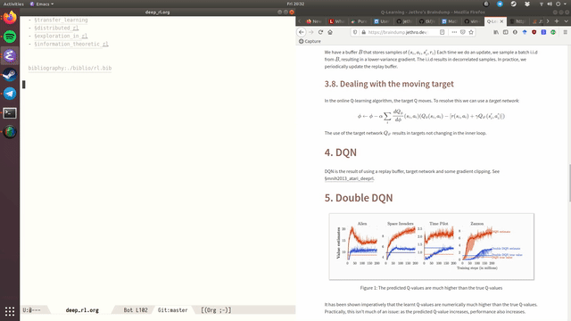

This manual is for Org-roam version 2.2.2.  

本手册适用于 Org-roam 2.2.2 版本。

> Copyright (C) 2020-2022 Jethro Kuan <jethrokuan95@gmail.com>  
> 
> 版权所有 (C) 2020-2022 Jethro Kuan
> 
> You can redistribute this document and/or modify it under the terms of the GNU General Public License as published by the Free Software Foundation, either version 3 of the License, or (at your option) any later version.  
> 
> 您可以根据自由软件基金会发布的 GNU 通用公共许可证条款（许可证第 3 版或任何后续版本，由您选择）重新发布和/或修改本文档。
> 
> This document is distributed in the hope that it will be useful, but WITHOUT ANY WARRANTY; without even the implied warranty of MERCHANTABILITY or FITNESS FOR A PARTICULAR PURPOSE. See the GNU General Public License for more details.  
> 
> 发布本文档的目的是希望其有用，但不附带任何保证；甚至不附带适销性或特定用途适用性的默示保证。更多详情，请参阅 GNU 通用公共许可证。

-   [Introduction 导言](https://www.orgroam.com/manual.html#Introduction)
-   [Target Audience 目标受众](https://www.orgroam.com/manual.html#Target-Audience)
-   [A Brief Introduction to the Zettelkasten Method  
    
    泽特尔卡斯滕方法简介](https://www.orgroam.com/manual.html#A-Brief-Introduction-to-the-Zettelkasten-Method)
-   [Installation 安装](https://www.orgroam.com/manual.html#Installation)
-   [Getting Started 入门](https://www.orgroam.com/manual.html#Getting-Started)
-   [Customizing Node Caching  
    
    自定义节点缓存](https://www.orgroam.com/manual.html#Customizing-Node-Caching)
-   [The Org-roam Buffer 组织机构缓冲区](https://www.orgroam.com/manual.html#The-Org_002droam-Buffer)
-   [Node Properties 节点属性](https://www.orgroam.com/manual.html#Node-Properties)
-   [Citations 引文](https://www.orgroam.com/manual.html#Citations)
-   [Completion 完工](https://www.orgroam.com/manual.html#Completion)
-   [Encryption 加密](https://www.orgroam.com/manual.html#Encryption)
-   [The Templating System 模板系统](https://www.orgroam.com/manual.html#The-Templating-System)
-   [Extensions 扩展](https://www.orgroam.com/manual.html#Extensions)
-   [Performance Optimization  
    
    性能优化](https://www.orgroam.com/manual.html#Performance-Optimization)
-   [The Org-mode Ecosystem 组织模式生态系统](https://www.orgroam.com/manual.html#The-Org_002dmode-Ecosystem)
-   [FAQ 常见问题](https://www.orgroam.com/manual.html#FAQ)
-   [Developer’s Guide to Org-roam  
    
    Org-roam 开发人员指南](https://www.orgroam.com/manual.html#Developer_0027s-Guide-to-Org_002droam)
-   [Appendix 附录](https://www.orgroam.com/manual.html#Appendix)
-   [Keystroke Index 按键索引](https://www.orgroam.com/manual.html#Keystroke-Index)
-   [Command Index 命令索引](https://www.orgroam.com/manual.html#Command-Index)
-   [Function Index 功能索引](https://www.orgroam.com/manual.html#Function-Index)
-   [Variable Index 变量指数](https://www.orgroam.com/manual.html#Variable-Index)

___

## 1 Introduction 1 引言

Org-roam is a tool for networked thought. It reproduces some of [Roam Research’s](https://roamresearch.com/) [<sup data-immersive-translate-effect="1" data-immersive_translate_walked="fc843283-6161-4330-ab14-0948b3f93ba5">1</sup>](https://www.orgroam.com/manual.html#FOOT1) key features within [Org-mode](https://orgmode.org/).  

Org-roam 是一款网络化思维工具。它再现了 Roam Research 在 Org 模式下的一些 <sup data-immersive-translate-effect="1" data-immersive_translate_walked="fc843283-6161-4330-ab14-0948b3f93ba5">1</sup> 关键功能。

Org-roam allows for effortless non-hierarchical note-taking: with Org-roam, notes flow naturally, making note-taking fun and easy. Org-roam augments the Org-mode syntax, and will work for anyone already using Org-mode for their personal wiki.  

有了 Org-roam，记笔记就变得自然流畅，让记笔记变得轻松有趣。Org-roam增强了Org-mode语法，已经在个人维基中使用Org-mode的人也可以使用。

Org-roam leverages the mature ecosystem around Org-mode. For example, it has first-class support for [org-ref](https://github.com/jkitchin/org-ref) for citation management, and is able to piggyback off Org’s excellent LaTeX and source-block evaluation capabilities.  

Org-roam 利用了围绕 Org-mode 的成熟生态系统。例如，Org-roam 在引文管理方面对 org-ref 提供了一流的支持，并能借助 Org 出色的 LaTeX 和源代码块评估功能。

Org-roam provides these benefits over other tooling:  

与其他工具相比，Org-roam 具有这些优势：

-   **Privacy and Security:** Your personal wiki belongs only to you, entirely offline and in your control. Encrypt your notes with GPG.  
    
    隐私与安全：您的个人维基只属于您自己，完全离线并由您控制。使用 GPG 加密您的笔记。
-   **Longevity of Plain Text:** Unlike web solutions like Roam Research, the notes are first and foremost plain Org-mode files – Org-roam simply builds an auxiliary database to give the personal wiki superpowers. Having your notes in plain-text is crucial for the longevity of your wiki. Never have to worry about proprietary web solutions being taken down. The notes are still functional even if Org-roam ceases to exist.  
    
    纯文本的持久性：与 Roam Research 等网络解决方案不同，笔记首先是普通的 Org 模式文件--Org-roam 只是建立了一个辅助数据库，为个人维基提供超能力。以纯文本格式保存你的笔记对你的 wiki 的寿命至关重要。你再也不用担心专有的网络解决方案会被关闭。即使Org-roam不复存在，笔记依然可以正常使用。
-   **Free and Open Source:** Org-roam is free and open-source, which means that if you feel unhappy with any part of Org-roam, you may choose to extend Org-roam, or open a pull request.  
    
    免费开源：Org-roam 是自由和开源的，这意味着如果你对 Org-roam 的任何部分感到不满意，你可以选择扩展 Org-roam，或开启拉取请求。
-   **Leverage the Org-mode ecosystem:** Over the decades, Emacs and Org-mode has developed into a mature system for plain-text organization. Building upon Org-mode already puts Org-roam light-years ahead of many other solutions.  
    
    利用 Org-mode 生态系统：几十年来，Emacs 和 Org-mode 已发展成为一个成熟的纯文本组织系统。以 Org-mode 为基础，Org-roam 已经领先于许多其他解决方案。
-   **Built on Emacs:** Emacs is also a fantastic interface for editing text, and Org-roam inherits many of the powerful text-navigation and editing packages available to Emacs.  
    
    基于 EmacsEmacs 也是编辑文本的绝佳界面，Org-roam 继承了 Emacs 中许多强大的文本导航和编辑软件包。

___

## 2 Target Audience 2 目标受众

Org-roam is a tool that will appear unfriendly to anyone unfamiliar with Emacs and Org-mode, but it is also extremely powerful to those willing to put effort in mastering the intricacies. Org-roam stands on the shoulders of giants. Emacs was first created in 1976, and remains the tool of choice for many for editing text and designing textual interfaces. The malleability of Emacs allowed the creation of Org-mode, an all-purpose plain-text system for maintaining TODO lists, planning projects, and authoring documents. Both of these tools are incredibly vast and require significant time investment to master.  

对于不熟悉 Emacs 和 Org-mode 的人来说，Org-roam 是一个不友好的工具，但对于愿意花精力掌握其中奥妙的人来说，它也是一个极其强大的工具。Org-roam 站在巨人的肩膀上。Emacs 诞生于 1976 年，至今仍是许多人编辑文本和设计文本界面的首选工具。Emacs 的可塑性使得 Org-mode 应运而生，它是一个万能的纯文本系统，可用于维护 TODO 列表、规划项目和编写文档。这两种工具都非常庞大，需要投入大量时间才能掌握。

Org-roam assumes only basic familiarity with these tools. It is not difficult to get up and running with basic text-editing functionality, but one will only fully appreciate the power of building Roam functionality into Emacs and Org-mode when the usage of these tools become more advanced.  

Org-roam 仅假定用户对这些工具有基本的了解。使用基本的文本编辑功能并不难，但只有当这些工具的使用变得更加高级时，才能充分体会到在 Emacs 和 Org-mode 中构建 Roam 功能的强大之处。

One key advantage to Org-roam is that building on top of Emacs gives it malleability. This is especially important for note-taking workflows. It is our belief that note-taking workflows are extremely personal, and there is no one tool that’s perfect for you. Org-mode and Org-roam allows you to discover what works for you, and build that perfect tool for yourself.  

Org-roam 的一个主要优势是，它建立在 Emacs 的基础上，因此具有可塑性。这对笔记工作流程尤为重要。我们相信，记笔记的工作流程是非常个性化的，没有一种工具是最适合你的。Org-mode 和 Org-roam 让你发现适合自己的方法，并为自己打造完美的工具。

If you are new to the software, and choose to take this leap of faith, I hope you find yourself equally entranced as Neal Stephenson was.  

如果你是软件新手，并选择了这一信念的飞跃，我希望你会发现自己和尼尔-斯蒂芬森一样着迷。

> Emacs outshines all other editing software in approximately the same way that the noonday sun does the stars. It is not just bigger and brighter; it simply makes everything else vanish. – Neal Stephenson, In the Beginning was the Command Line (1998)  
> 
> Emacs 比其他编辑软件更耀眼，就像正午的太阳比星星更耀眼一样。它不仅更大更亮，还能让其他一切都黯然失色。- 尼尔-史蒂芬森，《起初是命令行》（1998 年）

___

## 3 A Brief Introduction to the Zettelkasten Method  

3 泽特尔卡斯滕方法简介

Org-roam provides utilities for maintaining a digital slip-box. This section aims to provide a brief introduction to the “slip-box”, or “Zettelkasten” method. By providing some background on the method, we hope that the design decisions of Org-roam will become clear, and that will aid in using Org-roam appropriately. In this section we will introduce terms commonly used within the Zettelkasten community and the Org-roam forums.  

Org-roam 提供用于维护数字 slip-box 的实用程序。本节旨在简要介绍 "滑箱 "或 "Zettelkasten "方法。我们希望通过提供有关该方法的一些背景知识，使 Org-roam 的设计决策变得清晰明了，并有助于正确使用 Org-roam。在本节中，我们将介绍 Zettelkasten 社区和 Org-roam 论坛中的常用术语。

The Zettelkasten is a personal tool for thinking and writing. It places heavy emphasis on connecting ideas, building up a web of thought. Hence, it is well suited for knowledge workers and intellectual tasks, such as conducting research. The Zettelkasten can act as a research partner, where conversations with it may produce new and surprising lines of thought.  

Zettelkasten 是一种用于思考和写作的个人工具。它非常注重连接思想，建立思想网络。因此，它非常适合知识工作者和从事研究等智力工作。Zettelkasten 可以充当研究伙伴，与它的对话可能会产生令人惊讶的新思路。

This method is attributed to German sociologist Niklas Luhmann, who using the method had produced volumes of written works. Luhmann’s slip-box was simply a box of cards. These cards are small – often only large enough to fit a single concept. The size limitation encourages ideas to be broken down into individual concepts. These ideas are explicitly linked together. The breakdown of ideas encourages tangential exploration of ideas, increasing the surface for thought. Making linking explicit between notes also encourages one to think about the connections between concepts.  

这种方法出自德国社会学家尼克拉斯-卢曼（Niklas Luhmann）之手。Luhmann 的滑动盒只是一盒卡片。这些卡片很小，通常只够容纳一个概念。这种尺寸限制促使人们将想法分解成单个概念。这些概念被明确地联系在一起。对概念的细分鼓励了对概念的切入探索，增加了思考的空间。在笔记之间建立明确的联系还能鼓励人们思考概念之间的联系。

At the corner of each note, Luhmann ascribed each note with an ordered ID, allowing him to link and jump between notes. In Org-roam, we simply use hyperlinks.  

在每个音符的角落，卢曼都给每个音符标注了一个有序的 ID，这样他就可以在音符之间进行链接和跳转。在 Org-roam 中，我们只需使用超链接即可。

Org-roam is the slip-box, digitalized in Org-mode. Every zettel (card) is a plain-text, Org-mode file. In the same way one would maintain a paper slip-box, Org-roam makes it easy to create new zettels, pre-filling boilerplate content using a powerful templating system.  

Org-roam 是以 Org 模式数字化的滑动盒。每个 Zettel（卡片）都是一个纯文本的 Org 模式文件。与维护纸质便笺箱的方式相同，Org-roam 可通过强大的模板系统预填模板内容，轻松创建新的便笺箱。

**Fleeting notes 转瞬即逝的音符**

A slip-box requires a method for quickly capturing ideas. These are called **fleeting notes**: they are simple reminders of information or ideas that will need to be processed later on, or trashed. This is typically accomplished using `org-capture` (see [(org)Capture](https://www.gnu.org/software/emacs/manual/html_mono/org.html#Capture)), or using Org-roam’s daily notes functionality (see [org-roam-dailies](https://www.orgroam.com/manual.html#org_002droam_002ddailies)). This provides a central inbox for collecting thoughts, to be processed later into permanent notes.  

便笺箱需要一种快速记录想法的方法。这些被称为稍纵即逝的笔记：它们只是对信息或想法的简单提醒，需要稍后进行处理或销毁。这通常使用 `org-capture` 来实现。(参见（org）捕捉），或使用 Org-roam 的每日笔记功能（参见 org-roam-dailies）。这为收集想法提供了一个中心收件箱，以便日后将其处理为永久笔记。

**Permanent notes 常设说明**

Permanent notes are further split into two categories: **literature notes** and **concept notes**. Literature notes can be brief annotations on a particular source (e.g. book, website or paper), that you’d like to access later on. Concept notes require much more care in authoring: they need to be self-explanatory and detailed. Org-roam’s templating system supports the addition of different templates to facilitate the creation of these notes.  

永久笔记又分为两类：文献笔记和概念笔记。文献笔记可以是对特定来源（如书籍、网站或论文）的简短注释，您可以在以后查阅。概念注释在撰写时需要更加谨慎：它们需要具有自明性和详细性。Org-roam 的模板系统支持添加不同的模板，以方便创建这些注释。

For further reading on the Zettelkasten method, “How to Take Smart Notes” by Sonke Ahrens is a decent guide.  

如需进一步了解 Zettelkasten 方法，Sonke Ahrens 所著的《如何做聪明的笔记》是一本不错的指南。

___

## 4 Installation 4 安装

Org-roam can be installed using Emacs’ package manager or manually from its development repository.  

Org-roam 可使用 Emacs 的软件包管理器安装，也可从其开发库中手动安装。

-   [Installing from MELPA 从 MELPA 安装](https://www.orgroam.com/manual.html#Installing-from-MELPA)
-   [Installing from Source 从源代码安装](https://www.orgroam.com/manual.html#Installing-from-Source)
-   [Installation Troubleshooting  
    
    安装故障排除](https://www.orgroam.com/manual.html#Installation-Troubleshooting)

___

### 4.1 Installing from MELPA  

4.1 从 MELPA 安装

Org-roam is available from Melpa and Melpa-Stable. If you haven’t used Emacs’ package manager before, you may familiarize yourself with it by reading the documentation in the Emacs manual, see [(emacs)Packages](https://www.gnu.org/software/emacs/manual/html_mono/emacs.html#Packages). Then, add one of the archives to ‘package-archives’:  

Org-roam 可从 Melpa 和 Melpa-Stable 获取。如果你以前没有使用过 Emacs 的软件包管理器，可以通过阅读 Emacs 手册中的文档来熟悉它，参见 (emacs)软件包。然后，将其中一个压缩包添加到" package-archives ':

-   To use Melpa:  使用 Melpa：

```
(require 'package)
(add-to-list 'package-archives
             '("melpa" . "http://melpa.org/packages/") t)

```

-   To use Melpa-Stable:  使用 Melpa-Stable：

```
(require 'package)
(add-to-list 'package-archives
             '("melpa-stable" . "http://stable.melpa.org/packages/") t)

```

Org-roam also depends on a recent version of Org, which can be obtained in Org’s package repository (see [(org)Installation](https://www.gnu.org/software/emacs/manual/html_mono/org.html#Installation)).  

Org-roam 还依赖于最新版本的 Org，可以从 Org 的软件包库中获取（参见 (org)Installation ）。

Once you have done that, you can install Org-roam and its dependencies using:  

完成上述操作后，就可以使用以下命令安装 Org-roam 及其依赖程序：

```
M-x package-install RET org-roam RET

```

___

### 4.2 Installing from Source  

4.2 从源代码安装

You may install Org-roam directly from the repository on [GitHub](https://github.com/org-roam/org-roam) if you like. This will give you access to the latest version hours or days before it appears on MELPA, and months (or more) before it is added to the Debian or Ubuntu repositories. This will also give you access to various developmental branches that may be available.  

您可以直接从 GitHub 上的软件源安装 Org-roam。这样，您就能在最新版本出现在 MELPA 上的数小时或数天前，以及添加到 Debian 或 Ubuntu 软件源的数月（或更长时间）前，访问该版本。您还可以访问可能存在的各种开发分支。

Note, however, that development version, and especially any feature branches, may not always be in working order. You’ll need to be prepared to do some debugging, or to manually roll-back to working versions, if you install from GitHub.  

但请注意，开发版本，尤其是任何功能分支，可能并不总是处于工作状态。如果从 GitHub 安装，你需要做好调试准备，或手动回滚到工作版本。

Installing from GitHub requires that you clone the repository:  

从 GitHub 安装需要克隆版本库：

```
git clone https://github.com/org-roam/org-roam.git /path/to/org/roam

```

where `./path/to/org/roam` is the location you will store your copy of the code.  

其中 `./path/to/org/roam` 是您要存储代码副本的位置。

Next, you need to add this location to your load path, and `require` the Org-roam library. Add the following code to your `.emacs`:  

接下来，您需要将此位置添加到加载路径中，并 `require` Org-roam 库。将以下代码添加到 `.emacs` ：

```
(add-to-list 'load-path "/path/to/org/roam")
(require 'org-roam)

```

You now have Org-roam installed. However, you don’t necessarily have the dependencies that it requires. These include:  

你现在已经安装了 Org-roam。不过，你并不一定拥有它所需要的依赖项。其中包括

-   dash  破折号
-   f  f
-   s  s
-   org  组织
-   emacsql  emacsql
-   emacsql-sqlite  emacsql-sqlite
-   magit-section  magit section

You can install this manually as well, or get the latest version from MELPA. You may wish to use [use-package](https://github.com/jwiegley/use-package), [straight.el](https://github.com/raxod502/straight.el) to help manage this.  

您也可以手动安装，或从 MELPA 获取最新版本。您可以使用软件包 straight.el 来帮助管理。

If you would like to install the manual for access from Emacs’ built-in Info system, you’ll need to compile the .texi source file, and install it in an appropriate location.  

如果要安装手册，以便从 Emacs 内置的 Info 系统访问，则需要编译 .texi 源文件，并将其安装到适当的位置。

To compile the .texi source file, from a terminal navigate to the `/doc` subdirectory of the Org-roam repository, and run the following:  

要编译 .texi 源文件，请在终端导航至 Org-roam 资源库的 `/doc` 子目录，然后运行以下命令：

```
make infodir=/path/to/my/info/files install-info

```

Where `/path/to/my/info/files` is the location where you keep info files. This target directory needs to be stored in the variable ‘Info-default-directory-list‘. If you aren’t using one of the default info locations, you can configure this with the following in your `.emacs` file:  

其中 `/path/to/my/info/files` 是保存信息文件的位置。该目标目录需要存储在变量 "Info-default-directory-list "中。如果您没有使用默认的信息位置，可以在 `.emacs` 文件中进行如下配置：

```
(require 'info)
(add-to-list 'Info-default-directory-list
             "/path/to/my/info/files")

```

You can also use one of the default locations, such as:  

您也可以使用其中一个默认位置，例如

-   _usr/local/share/info_
-   _usr/share/info_
-   _usr/local/share/info_

If you do this, you’ll need to make sure you have write-access to that location, or run the above `make` command as root.  

如果这样做，需要确保您拥有该位置的写入权限，或者以 root 身份运行上述 `make` 命令。

Now that the info file is ready, you need to add it to the corresponding `dir` file:  

现在信息文件已经准备就绪，您需要将其添加到相应的 `dir` 文件中：

```
install-info /path/to/my/info/files/org-roam.info /path/to/my/info/files/dir

```

___

### 4.3 Installation Troubleshooting  

4.3 安装故障排除

-   [C Compiler C 编译器](https://www.orgroam.com/manual.html#C-Compiler)

___

#### 4.3.1 C Compiler 4.3.1 C 语言编译器

Org-roam relies on an Emacs package called `emacsql` and `emacsql-sqlite` to work with the `sqlite` database. Both of them should be installed automatically in your Emacs environment as a prerequisite for Org-roam when you install it.  

Org-roam 依靠名为 `emacsql` 和 `emacsql-sqlite` 的 Emacs 软件包来使用 `sqlite` 数据库。安装 Org-roam 时，这两个软件包应作为先决条件自动安装到 Emacs 环境中。

`emacsql-sqlite` requires a C compiler (e.g. `gcc` or `clang`) to be present in your computer. How to install a C compiler depends on the OS that you use.  

`emacsql-sqlite` 需要在电脑中安装 C 编译器（例如 `gcc` 或 `clang` ）。如何安装 C 编译器取决于您使用的操作系统。

-   [C Compiler for Windows  
    
    适用于 Windows 的 C 编译器](https://www.orgroam.com/manual.html#C-Compiler-for-Windows)

___

#### C Compiler for Windows  

适用于 Windows 的 C 编译器

One of the easiest ways to install a C compiler in Windows is to use [MSYS2](https://www.msys2.org/) as at the time of this writing:  

在 Windows 中安装 C 编译器的最简便方法之一就是使用 MSYS2，就像本文撰写时一样：

-   Download and use the installer in the official MSYS2 website  
    
    从 MSYS2 官方网站下载并使用安装程序
-   Run MSYS2 and in its terminal, type the following and answer “Y” to proceed – this will install `gcc` in your PC:  
    
    运行 MSYS2，在终端中键入以下内容并回答 "Y "继续，这将在电脑中安装 `gcc` ：
-   On Windows, add `C:\msys64\usr\bin` (command ‘where gcc’ in MSYS2 terminal can tell you the correct path) to `PATH` in your environmental variables  
    
    在 Windows 系统中，添加 `C:\msys64\usr\bin` (在环境变量中将 `PATH` 添加到 `C:\msys64\usr\bin` （MSYS2 终端中的" where gcc "命令可以告诉您正确的路径）。
-   Launch Emacs and call `M-x org-roam-db-autosync-mode` (launch Emacs after defining the path, so that Emacs can recognize it)  
    
    启动 Emacs 并调用 `M-x org-roam-db-autosync-mode` (定义路径后启动 Emacs，以便 Emacs 能够识别它）

This will automatically start compiling `emacsql-sqlite`; you should see a message in minibuffer. It may take a while until compilation completes. Once complete, you should see a new file `emacsql-sqlite.exe` created in a subfolder named `sqlite` under `emacsql-sqlite` installation folder. It’s typically in your Emacs configuration folder like this: `/.config/emacs/elpa/emacsql-sqlite-20190727.1710/sqlite`  

这将自动开始编译 `emacsql-sqlite` ；您应该会在 minibuffer 中看到一条信息。编译完成可能需要一段时间。编译完成后，你会在 `emacsql-sqlite` 安装文件夹下名为 `sqlite` 的子文件夹中看到一个新文件 `emacsql-sqlite.exe` 被创建。它通常位于 Emacs 配置文件夹中，如下所示： `/.config/emacs/elpa/emacsql-sqlite-20190727.1710/sqlite`

___

## 5 Getting Started 5 入门

-   [The Org-roam Node Org-roam 节点](https://www.orgroam.com/manual.html#The-Org_002droam-Node)
-   [Links between Nodes 节点之间的链接](https://www.orgroam.com/manual.html#Links-between-Nodes)
-   [Setting up Org-roam 设置 Org-roam](https://www.orgroam.com/manual.html#Setting-up-Org_002droam)
-   [Creating and Linking Nodes  
    
    创建和链接节点](https://www.orgroam.com/manual.html#Creating-and-Linking-Nodes)
-   [Customizing Node Completions  
    
    自定义节点完成](https://www.orgroam.com/manual.html#Customizing-Node-Completions)

___

### 5.1 The Org-roam Node  

5.1 Org-roam 节点

We first begin with some terminology we’ll use throughout the manual. We term the basic denomination in Org-roam a node. We define a node as follows:  

首先，我们来介绍一下本手册中会用到的一些术语。我们将 Org-roam 中的基本称谓称为节点。节点的定义如下

> A node is any headline or top level file with an ID.  
> 
> 节点是任何有 ID 的标题或顶层文件。

For example, with this example file content:  

例如，这个示例文件的内容是

```
:PROPERTIES:
:ID:       foo
:END:
#+title: Foo

* Bar
:PROPERTIES:
:ID:       bar
:END:

```

We create two nodes:  

我们创建两个节点：

-   A file node “Foo” with id `foo`.  
    
    文件节点 "Foo"，id `foo` .
-   A headline node “Bar” with id `bar`.  
    
    标题节点 "Bar"，id `bar` .

Headlines without IDs will not be considered Org-roam nodes. Org IDs can be added to files or headlines via the interactive command `M-x org-id-get-create`.  

没有 ID 的标题不会被视为 Org-roam 节点。可以通过交互式命令 `M-x org-id-get-create` 将 Org ID 添加到文件或标题中。.

___

### 5.2 Links between Nodes  

5.2 节点之间的链接

We link between nodes using Org’s standard ID link (e.g. `id:foo`). While only ID links will be considered during the computation of links between nodes, Org-roam caches all other links in the documents for external use.  

我们使用 Org 的标准 ID 链接（例如 `id:foo` ）来链接节点。在计算节点之间的链接时，只考虑 ID 链接，而 Org-roam 会缓存文档中的所有其他链接，供外部使用。

___

### 5.3 Setting up Org-roam  

5.3 设置 Org-roam

Org-roam’s capabilities stem from its aggressive caching: it crawls all files within `org-roam-directory`, and maintains a cache of all links and nodes.  

Org-roam 的功能源自其积极的缓存：它会抓取 `org-roam-directory` 内的所有文件，并维护所有链接和节点的缓存。内的所有文件，并维护所有链接和节点的缓存。

To start using Org-roam, pick a location to store the Org-roam files. The directory that will contain your notes is specified by the variable `org-roam-directory`. Org-roam searches recursively within `org-roam-directory` for notes. This variable needs to be set before any calls to Org-roam functions.  

要开始使用 Org-roam，请选择一个存放 Org-roam 文件的位置。包含注释的目录由变量 `org-roam-directory` 指定。.Org-roam 会在 `org-roam-directory` 中递归搜索笔记。在调用任何 Org-roam 函数之前，都需要设置该变量。

For this tutorial, create an empty directory, and set `org-roam-directory`:  

在本教程中，创建一个空目录，并设置 `org-roam-directory` ：

```
(make-directory "~/org-roam")
(setq org-roam-directory (file-truename "~/org-roam"))

```

The `file-truename` function is only necessary when you use symbolic links inside `org-roam-directory`: Org-roam does not resolve symbolic links. One can however instruct Emacs to always resolve symlinks, at a performance cost:  

只有在 `org-roam-directory` 中使用符号链接时，才需要使用 `file-truename` 函数：Org-roam 不会解析符号链接。不过，我们可以指示 Emacs 始终解析符号链接，但需要付出性能代价：

```
(setq find-file-visit-truename t)

```

Next, we setup Org-roam to run functions on file changes to maintain cache consistency. This is achieved by running `M-x org-roam-db-autosync-mode`. To ensure that Org-roam is available on startup, place this in your Emacs configuration:  

接下来，我们设置 Org-roam 在文件更改时运行函数，以保持缓存一致性。这可以通过运行 `M-x org-roam-db-autosync-mode` .为确保 Org-roam 在启动时可用，请将其放入 Emacs 配置中：

```
(org-roam-db-autosync-mode)

```

To build the cache manually, run `M-x org-roam-db-sync`. Cache builds may take a while the first time, but subsequent builds are often instantaneous because they only reprocess modified files.  

要手动构建缓存，请运行 `M-x org-roam-db-sync` .第一次缓存编译可能需要一段时间，但随后的编译通常会很快完成，因为它们只会重新处理修改过的文件。

___

### 5.4 Creating and Linking Nodes  

5.4 创建和链接节点

Org-roam makes it easy to create notes and link them together. There are 2 main functions for creating nodes:  

Org-roam 可以轻松创建笔记并将它们连接起来。创建节点有两个主要功能：

-   `org-roam-node-insert`: creates a node if it does not exist, and inserts a link to the node at point.  
    
    `org-roam-node-insert` ：如果节点不存在，则创建该节点，并在点处插入指向该节点的链接。
-   `org-roam-node-find`: creates a node if it does not exist, and visits the node.  
    
    `org-roam-node-find` ：如果节点不存在，则创建该节点，并访问该节点。
-   `org-roam-capture`: creates a node if it does not exist, and restores the current window configuration upon completion.  
    
    `org-roam-capture` ：创建一个不存在的节点，并在创建完成后恢复当前窗口配置。

Let’s first try `org-roam-node-find`. Calling `M-x org-roam-node-find` will show a list of titles for nodes that reside in `org-roam-directory`. It should show nothing right now, since there are no notes in the directory. Enter the title of the note you wish to create, and press `RET`. This begins the note creation process. This process uses `org-capture`’s templating system, and can be customized (see [The Templating System](https://www.orgroam.com/manual.html#The-Templating-System)). Using the default template, pressing `C-c C-c` finishes the note capture.  

让我们先试试 `org-roam-node-find` 。.调用 `M-x org-roam-node-find` 将显示位于 `org-roam-directory` 中的节点的标题列表。.现在应该不会显示任何内容，因为目录中没有笔记。输入您要创建的笔记的标题，然后按 `RET` 。.开始创建笔记。此过程使用 {{4}的模板系统，并可进行自定义（请参阅 "模板系统"）。使用默认模板，按下 `C-c C-c` 即可完成笔记捕捉。

Now that we have a node, we can try inserting a link to the node using `M-x org-roam-node-insert`. This brings up the list of nodes, which should contain the node you just created. Selecting the node will insert an `id:` link to the node. If you instead entered a title that does not exist, you will once again be brought through the node creation process.  

现在我们有了一个节点，可以尝试使用 `M-x org-roam-node-insert` 插入一个指向该节点的链接。.这将显示节点列表，其中应包含您刚刚创建的节点。选择该节点将插入一个指向该节点的 `id:` 链接。如果您输入的标题并不存在，则将再次进入节点创建流程。

One can also conveniently insert links via the completion-at-point functions Org-roam provides (see [Completion](https://www.orgroam.com/manual.html#Completion)).  

通过 Org-roam 提供的 completion-at-point 功能，还可以方便地插入链接（参见 Completion）。

___

### 5.5 Customizing Node Completions  

5.5 自定义节点补全

Node selection is achieved via the `completing-read` interface, typically through ‘org-roam-node-read‘. The presentation of these nodes are governed by `org-roam-node-display-template`.  

节点选择通过 `completing-read` 接口实现，通常是通过 "org-roam-node-read"。这些节点的呈现受 `org-roam-node-display-template` 约束。.

Variable: **org-roam-node-display-template**  

变量：org-roam-node-display-template ¶。

Configures display formatting for Org-roam node.  

配置 Org-roam 节点的显示格式。

Patterns of form “${field-name:length}” are interpolated based on the current node.  

格式为"${field-name:length}"的模式会根据当前节点进行内插。

Each “field-name” is replaced with the return value of each corresponding accessor function for org-roam-node, e.g. “${title}” will be interpolated by the result of org-roam-node-title. You can also define custom accessors using cl-defmethod. For example, you can define:  

每个 "field-name "都将被替换为 org-roam-node 的每个相应访问函数的返回值，例如，"${title}"将被 org-roam-node-title 的结果插值。您还可以使用 cl-defmethod 定义自定义访问函数。例如，您可以定义

(cl-defmethod org-roam-node-my-title ((node org-roam-node)) (concat “My ” (org-roam-node-title node)))  

(cl-defmethod org-roam-node-my-title ((node org-roam-node)) (concat "My " (org-roam-node-title node)))

and then reference it here or in the capture templates as “${my-title}”.  

然后在此处或捕获模板中引用为"${my-title}"。

“length” is an optional specifier and declares how many characters can be used to display the value of the corresponding field. If it’s not specified, the field will be inserted as is, i.e. it won’t be aligned nor trimmed. If it’s an integer, the field will be aligned accordingly and all the exceeding characters will be trimmed out. If it’s “\*”, the field will use as many characters as possible and will be aligned accordingly.  

"长度 "是一个可选的指定项，用于说明有多少个字符可以用来显示相应字段的值。如果没有指定，字段将按原样插入，即不会对齐，也不会修剪。如果是整数，字段将相应地对齐，所有超出的字符都将被修剪掉。如果是 "\*"，字段将使用尽可能多的字符，并进行相应的对齐。

A closure can also be assigned to this variable in which case the closure is evaluated and the return value is used as the template. The closure must evaluate to a valid template string.  

闭包也可以分配给这个变量，在这种情况下，闭包将被求值，返回值将被用作模板。闭包必须是一个有效的模板字符串。

If you’re using a vertical completion framework, such as Ivy and Selectrum, Org-roam supports the generation of an aligned, tabular completion interface. For example, to include a column for tags up to 10 character widths wide, one can set `org-roam-node-display-template` as such:  

如果使用的是垂直补全框架，如 Ivy 和 Selectrum，Org-roam 支持生成对齐的表格式补全界面。例如，如果要为宽度不超过 10 个字符的标签添加一列，可以将 `org-roam-node-display-template` 设置为这样：

```
(setq org-roam-node-display-template
      (concat "${title:*} "
              (propertize "${tags:10}" 'face 'org-tag)))

```

___

## 6 Customizing Node Caching  

6 自定义节点缓存

-   [How to cache 如何缓存](https://www.orgroam.com/manual.html#How-to-cache)
-   [What to cache 需要缓存的内容](https://www.orgroam.com/manual.html#What-to-cache)
-   [When to cache 何时缓存](https://www.orgroam.com/manual.html#When-to-cache)

___

### 6.1 How to cache  

6.1 如何缓存

Org-roam uses a sqlite database to perform caching, but there are multiple Emacs libraries that can be used. The default used by Org-roam is `emacs-sqlite`. Below the pros and cons of each package is used:  

Org-roam 使用 sqlite 数据库执行缓存，但也可以使用多个 Emacs 库。Org-roam 使用的默认值是 `emacs-sqlite` 。.以下是每个软件包的优缺点：

[****emacs-sqlite****](https://github.com/skeeto/emacsql)

The default option used by Org-roam. This library is the most mature and well-supported and is imported by default in Org-roam.  

Org-roam 使用的默认选项。该库最成熟，支持最完善，Org-roam 默认导入该库。

One downside of using `emacs-sqlite` is that using it requires compilation and can cause issues in some environments (especially Windows). If you have issues producing the customized binary required by `emacs-sqlite`, consider using `emacs-sqlite3`.  

使用 `emacs-sqlite` 的一个缺点是需要编译，在某些环境下（尤其是 Windows 环境）可能会出现问题。如果在生成 `emacs-sqlite` 所需的定制二进制文件时遇到问题，请考虑使用 `emacs-sqlite3` 。所需的定制二进制文件，请考虑使用 `emacs-sqlite3` 。.

[****emacs-sqlite3****](https://github.com/cireu/emacsql-sqlite3)

`emacs-sqlite3` uses the official sqlite3 binary that can be obtained from your system’s package manager. This is useful if you have issues producing the `sqlite3` binary required by the other packages. However, it is not recommended because it has some compatibility issues with Emacs, but should work for most regular cases. See [Chris Wellon’s blog post](https://nullprogram.com/blog/2014/02/06/) for more information.  

`emacs-sqlite3` 使用官方的 sqlite3 二进制文件，可以从系统的软件包管理器获取。如果您在生成其他软件包所需的 `sqlite3` 二进制文件时遇到问题，这将非常有用。不过，不推荐使用这种方法，因为它与 Emacs 存在一些兼容性问题，但在大多数常规情况下应该是可行的。更多信息，请参阅 Chris Wellon 的博文。

To use `emacsql-sqlite3`, ensure that the package is installed, and set:  

要使用 `emacsql-sqlite3` ，确保已安装软件包，并设置

```
(setq org-roam-database-connector 'sqlite3)

```

[****emacssql-sqlite-module****](https://melpa.org/#/emacsql-sqlite-module) (previously emacsql-libsqlite3)  

emacssql-sqlite 模块（之前为 emacsql-libsqlite3）

`emacs-sqlite-module` is a relatively young package which uses an Emacs module that exposes parts of the SQLite C API to Emacs Lisp, instead of using subprocess as `emacsql-sqlite` does. It is expected to be a more performant drop-in replacement for `emacs-sqlite`.  

`emacs-sqlite-module` 是一个相对较新的软件包，它使用 Emacs 模块将 SQLite C API 的部分内容公开给 Emacs Lisp，而不是像 `emacsql-sqlite` 那样使用子进程。它有望成为 `emacs-sqlite` 性能更强的替代品。.

```
(setq org-roam-database-connector 'sqlite-module)

```

[****emacsql-sqlite-builtin****](https://melpa.org/#/emacsql-sqlite-builtin)

`emacsql-sqlite-builtin` uses the in-built SQLite support for Emacs 29 and later. This is the recommended option if you are using a version of Emacs that supports it.  

`emacsql-sqlite-builtin` 使用 Emacs 29 及更高版本的内置 SQLite 支持。如果您使用的 Emacs 版本支持 SQLite，建议使用此选项。

```
(setq org-roam-database-connector 'sqlite-builtin)

```

___

### 6.2 What to cache  

6.2 需要缓存的内容

By default, all nodes (any headline or file with an ID) are cached by Org-roam. There are instances where you may want to have headlines with ID, but not have them cached by Org-roam.  

默认情况下，Org-roam 会缓存所有节点（任何带有 ID 的标题或文件）。在某些情况下，你可能希望标题带有 ID，但不希望 Org-roam 对其进行缓存。

To exclude a headline from the Org-roam database, set the `ROAM_EXCLUDE` property to a non-nil value. For example:  

要从 Org-roam 数据库中排除标题，请将 `ROAM_EXCLUDE` 属性设置为非零值。例如

```
* Foo
  :PROPERTIES:
  :ID:       foo
  :ROAM_EXCLUDE: t
  :END:

```

One can also set `org-roam-db-node-include-function`. For example, to exclude all headlines with the `ATTACH` tag from the Org-roam database, one can set:  

也可以设置 `org-roam-db-node-include-function` .例如，要从 Org-roam 数据库中排除所有带有 `ATTACH` 标记的标题，可以设置

```
(setq org-roam-db-node-include-function
      (lambda ()
        (not (member "ATTACH" (org-get-tags)))))

```

Org-roam relied on the obtained Org AST for the buffer to parse links. However, links appearing in some places (e.g. within property drawers) are not considered by the Org AST to be links. Therefore, Org-roam takes special care of additionally trying to process these links. Use `org-roam-db-extra-links-elements` to specify which additional Org AST element types to consider.  

Org-roam 依靠获得的 Org AST 缓冲区来解析链接。不过，在某些地方（如在属性抽屉中）出现的链接并不被 Org AST 视为链接。因此，Org-roam 会特别注意额外尝试处理这些链接。请使用 `org-roam-db-extra-links-elements` 指定要考虑的其他 Org AST 元素类型。

The list of Org element types to include for parsing by Org-roam.  

Org 元素类型列表，供 Org-roam 解析。

By default, when parsing Org’s AST, links within keywords and property drawers are not parsed as links. Sometimes however, it is desirable to parse and cache these links (e.g. hiding links in a property drawer).  

默认情况下，在解析 Org 的 AST 时，关键字和属性抽屉中的链接不会被解析为链接。但有时需要解析和缓存这些链接（例如隐藏属性抽屉中的链接）。

Additionally, one may want to ignore certain keys from being excluded within property drawers. For example, we would not want `ROAM_REFS` links to be self-referential. Hence, to exclude specific keys, we use `org-roam-db-extra-links-exclude-keys`.  

此外，在属性抽屉中，我们可能希望忽略某些键的排除。例如，我们不希望 `ROAM_REFS` 链接是自引用的。因此，我们使用 `org-roam-db-extra-links-exclude-keys` 来排除特定键。.

Keys to ignore when mapping over links.  

映射链接时应忽略的键。

The car of the association list is the Org element type (e.g. keyword). The cdr is a list of case-insensitive strings to exclude from being treated as links.  

关联列表的 car 是 Org 元素类型（如关键字）。cdr 是一个不区分大小写的字符串列表，用于排除被视为链接的字符串。

___

### 6.3 When to cache  

6.3 何时缓存

By default, Org-roam is eager in caching: each time an Org-roam file is modified and saved, it updates the database for the corresponding file. This keeps the database up-to-date, causing the least surprise when using the interactive commands.  

在默认情况下，Org-roam 是急于缓存的：每次修改和保存一个 Org-roam 文件时，它都会更新相应文件的数据库。这样可以保持数据库的最新状态，在使用交互式命令时也不会造成太大的意外。

However, depending on how large your Org files are, database updating can be a slow operation. You can disable the automatic updating of the database by setting `org-roam-db-update-on-save` to `nil`.  

不过，根据 Org 文件的大小，数据库更新可能会很慢。您可以通过将 `org-roam-db-update-on-save` 设置为 `nil` 来禁用自动更新数据库功能。.

Variable: **org-roam-db-update-on-save**  

变量：org-roam-db-update-on-save ¶。

If t, update the Org-roam database upon saving the file. Disable this if your files are large and updating the database is slow.  

如果为 t，则在保存文件时更新 Org-roam 数据库。如果文件较大，更新数据库速度较慢，请禁用此功能。

___

## 7 The Org-roam Buffer  

7 组织机构缓冲区

Org-roam provides the Org-roam buffer: an interface to view relationships with other notes (backlinks, reference links, unlinked references etc.). There are two main commands to use here:  

Org-roam 提供了 Org-roam 缓冲区：一个用于查看与其他注释之间关系（反向链接、引用链接、未链接引用等）的界面。这里有两个主要命令：

-   `org-roam-buffer-toggle`: Launch an Org-roam buffer that tracks the node currently at point. This means that the content of the buffer changes as the point is moved, if necessary.  
    
    `org-roam-buffer-toggle` ：启动一个 Org-roam 缓冲区，跟踪当前位于点的节点。这意味着必要时，缓冲区的内容会随着点的移动而改变。
-   `org-roam-buffer-display-dedicated`: Launch an Org-roam buffer for a specific node without visiting its file. Unlike `org-roam-buffer-toggle` you can have multiple such buffers and their content won’t be automatically replaced with a new node at point.  
    
    `org-roam-buffer-display-dedicated` ：为特定节点启动一个 Org-roam 缓冲，无需访问其文件。与 `org-roam-buffer-toggle` 不同的是，您可以拥有多个此类缓冲区，但它们的内容不会被自动替换为新节点。

To bring up a buffer that tracks the current node at point, call `M-x org-roam-buffer-toggle`.  

要调出跟踪当前节点点的缓冲区，请调用 `M-x org-roam-buffer-toggle` 。.

Function: **org-roam-buffer-toggle**  

功能：org-roam-buffer-toggle ¶。

Toggle display of the `org-roam-buffer`.  

切换显示 `org-roam-buffer` 。.

To bring up a buffer that’s dedicated for a specific node, call `M-x org-roam-buffer-display-dedicated`.  

要调出专用于特定节点的缓冲区，请调用 `M-x org-roam-buffer-display-dedicated` 。.

Function: **org-roam-buffer-display-dedicated**  

功能：org-roam-buffer-display-dedicated ¶。

Launch node dedicated Org-roam buffer without visiting the node itself.  

启动节点专用的 Org-roam 缓冲区，而无需访问节点本身。

-   [Navigating the Org-roam Buffer  
    
    浏览组织成员缓冲区](https://www.orgroam.com/manual.html#Navigating-the-Org_002droam-Buffer)
-   [Configuring what is displayed in the buffer  
    
    配置缓冲区的显示内容](https://www.orgroam.com/manual.html#Configuring-what-is-displayed-in-the-buffer)
-   [Configuring the Org-roam buffer display  
    
    配置 Org-roam 缓冲区显示屏](https://www.orgroam.com/manual.html#Configuring-the-Org_002droam-buffer-display)
-   [**TODO** Styling the Org-roam buffer  
    
    TODO 创建 Org-roam 缓冲区的样式](https://www.orgroam.com/manual.html#Styling-the-Org_002droam-buffer)

___

### 7.1 Navigating the Org-roam Buffer  

7.1 浏览组织系统缓冲区

The Org-roam buffer uses `magit-section`, making the typical `magit-section` keybindings available. Here are several of the more useful ones:  

Org-roam 缓冲区使用 `magit-section` 。这样就可以使用典型的 `magit-section` 键位绑定。下面是几个比较有用的键位绑定：

-   `M-{N}`: `magit-section-show-level-{N}-all`
-   `n`: `magit-section-forward`
-   `<TAB>`: `magit-section-toggle`
-   `<RET>`: `org-roam-buffer-visit-thing`

`org-roam-buffer-visit-thing` is a placeholder command, that is replaced by section-specific commands such as `org-roam-node-visit`.  

`org-roam-buffer-visit-thing` 是一个占位符命令，会被特定章节的命令（如 `org-roam-node-visit` ）取代。.

___

### 7.2 Configuring what is displayed in the buffer  

7.2 配置缓冲区的显示内容

There are currently 3 provided widget types:  

目前提供 3 种小部件类型：

-   BacklinksView (preview of) nodes that link to this node  
    
    反向链接查看（预览）链接到此节点的节点
-   Reference LinksNodes that reference this node (see [Refs](https://www.orgroam.com/manual.html#Refs))  
    
    引用链接引用此节点的节点（请参阅 "引用"）。
-   Unlinked referencesView nodes that contain text that match the nodes title/alias but are not linked  
    
    未链接引用查看包含与节点标题/别名匹配的文本但未链接的节点

To configure what sections are displayed in the buffer, set ~org-roam-mode-sections.  

要配置在缓冲区中显示哪些部分，请设置 ~org-roam-mode-sections。

```
(setq org-roam-mode-sections
      (list #'org-roam-backlinks-section
            #'org-roam-reflinks-section
            ;; #'org-roam-unlinked-references-section
            ))

```

Note that computing unlinked references may be slow, and has not been added in by default.  

需要注意的是，计算未链接引用的速度可能会比较慢，因此默认情况下并未添加。

For each section function, you can pass args along to modify its behaviour. For example, if you want to render unique sources for backlinks (and also keep rendering reference links), set `org-roam-mode-sections` as follows:  

对于每个部分函数，您都可以通过传递参数来修改其行为。例如，如果您想为反向链接呈现唯一来源（同时保持呈现参考链接），请设置 `org-roam-mode-sections` 如下：

```
(setq org-roam-mode-sections
      '((org-roam-backlinks-section :unique t)
        org-roam-reflinks-section))

```

___

### 7.3 Configuring the Org-roam buffer display  

7.3 配置 Org-roam 缓冲区显示屏

Org-roam does not control how the pop-up buffer is displayed: this is left to the user. The author’s recommended configuration is as follows:  

Org-roam 无法控制弹出缓冲区的显示方式：这取决于用户。作者推荐的配置如下：

```
(add-to-list 'display-buffer-alist
             '("\\*org-roam\\*"
               (display-buffer-in-direction)
               (direction . right)
               (window-width . 0.33)
               (window-height . fit-window-to-buffer)))

```

Crucially, the window is a regular window (not a side-window), and this allows for predictable navigation:  

最重要的是，该窗口是一个普通窗口（而不是侧窗），因此可以进行可预测的导航：

-   `RET` navigates to thing-at-point in the current window, replacing the Org-roam buffer.  
    
    `RET` 导航至当前窗口中的目标点，替换 Org-roam 缓冲区。
-   `C-u RET` navigates to thing-at-point in the other window.  
    
    `C-u RET` 导航至另一个窗口中的目标点。

For users that prefer using a side-window for the org-roam buffer, the following example configuration should provide a good starting point:  

对于喜欢在侧窗口使用 org-roam 缓冲区的用户来说，下面的配置示例应该是一个很好的起点：

```
(add-to-list 'display-buffer-alist
             '("\\*org-roam\\*"
               (display-buffer-in-side-window)
               (side . right)
               (slot . 0)
               (window-width . 0.33)
               (window-parameters . ((no-other-window . t)
                                     (no-delete-other-windows . t)))))

```

___

### 7.4 **TODO** Styling the Org-roam buffer  

7.4 待办事项 Org-roam 缓冲区的样式设计

___

## 8 Node Properties 8 节点属性

-   [Standard Org properties 标准组织属性](https://www.orgroam.com/manual.html#Standard-Org-properties)
-   [Titles and Aliases 头衔和别名](https://www.orgroam.com/manual.html#Titles-and-Aliases)
-   [Tags 标签](https://www.orgroam.com/manual.html#Tags)
-   [Refs 参考文献](https://www.orgroam.com/manual.html#Refs)

___

### 8.1 Standard Org properties  

8.1 标准组织属性

Org-roam caches most of the standard Org properties. The full list now includes:  

Org-roam 缓存了大部分标准 Org 属性。现在的完整列表包括

-   outline level  纲要级
-   todo state  待办事项状态
-   priority  优先权
-   scheduled  预定
-   deadline  期限
-   tags  标记

___

### 8.2 Titles and Aliases  

8.2 标题和别名

Each node has a single title. For file nodes, this is specified with the ‘#+title‘ property for the file. For headline nodes, this is the main text.  

每个节点都有一个标题。对于文件节点，可通过文件的 "#+title "属性来指定。对于标题节点，这是主文本。

Nodes can also have multiple aliases. Aliases allow searching for nodes via an alternative name. For example, one may want to assign a well-known acronym (AI) to a node titled “Artificial Intelligence”.  

节点还可以有多个别名。别名允许通过替代名称搜索节点。例如，人们可能想为一个名为 "人工智能 "的节点指定一个众所周知的缩写（AI）。

To assign an alias to a node, add the “ROAM_\_ALIASES_” property to the node:  

要为节点分配别名，请为节点添加 "ROAM\_ALIASES "属性：

```
* Artificial Intelligence
:PROPERTIES:
:ROAM_ALIASES: AI
:END:

```

Alternatively, Org-roam provides some functions to add or remove aliases.  

另外，Org-roam 还提供了一些添加或删除别名的功能。

Function: **org-roam-alias-add** _alias_  

功能： org-roam-alias-add alias ~

Add ALIAS to the node at point. When called interactively, prompt for the alias to add.  

在节点上添加 ALIAS。交互式调用时，提示输入要添加的别名。

Function: **org-roam-alias-remove**  

功能：org-roam-alias-remove ¶。

Remove an alias from the node at point.  

从点节点上删除别名。

___

### 8.4 Refs 8.4 参考文献

Refs are unique identifiers for nodes. These keys allow references to the key to show up in the Org-roam buffer. For example, a node for a website may use the URL as the ref, and a node for a paper may use an Org-ref citation key.  

Refs 是节点的唯一标识符。这些键允许在 Org-roam 缓冲区中显示对该键的引用。例如，一个网站的节点可以使用 URL 作为 Ref，而一篇论文的节点可以使用 Org-ref 引用键。

To add a ref, add to the “ROAM_\_REFS_” property as follows:  

要添加 ref，请在 "ROAM\_REFS "属性中添加如下内容：

```
* Google
:PROPERTIES:
:ROAM_REFS: https://www.google.com/
:END:

```

With the above example, if another node links to [https://www.google.com/](https://www.google.com/), it will show up as a “reference backlink”.  

在上述示例中，如果另一个节点链接到 https://www.google.com/，就会显示为 "参考反向链接"。

These keys also come in useful for when taking website notes, using the `roam-ref` protocol (see [org-roam-protocol](https://www.orgroam.com/manual.html#org_002droam_002dprotocol)).  

在使用 `roam-ref` 协议（参见 org-roam-protocol）记录网站笔记时，这些密钥也会派上用场。

You may assign multiple refs to a single node, for example when you want multiple papers in a series to share the same note, or an article has a citation key and a URL at the same time.  

您可以将多个参考文献分配给一个节点，例如，当您希望一个系列中的多篇论文共享同一个注释，或者一篇文章同时拥有一个引用密钥和一个 URL 时。

Org-roam also provides some functions to add or remove refs.  

Org-roam 还提供了一些添加或删除引用的功能。

Function: **org-roam-ref-add** _ref_  

功能： org-roam-ref-add ref ~

Add REF to the node at point. When called interactively, prompt for the ref to add.  

在点的节点上添加 REF。交互式调用时，提示要添加的 REF。

Function: **org-roam-ref-remove**  

功能：org-roam-ref-remove ¶。

Remove a ref from the node at point.  

从点处的节点移除一个 ref。

___

## 9 Citations 9 引用

Since version 9.5, Org has first-class support for citations. Org-roam supports the caching of both these in-built citations (of form `[cite:@key]`) and [org-ref](https://github.com/jkitchin/org-ref) citations (of form cite:key).  

自 9.5 版起，Org 对引文提供了一流的支持。Org-roam 支持缓存这些内置引文（ `[cite:@key]` 形式）和 org-ref 引文（cite:key 形式）。

Org-roam attempts to load both the `org-ref` and `org-cite` package when indexing files, so no further setup from the user is required for citation support.  

在索引文件时，Org-roam 会尝试同时加载 `org-ref` 和 `org-cite` 软件包，因此用户无需进一步设置即可获得引用支持。

-   [Using the Cached Information  
    
    使用缓存信息](https://www.orgroam.com/manual.html#Using-the-Cached-Information)

___

### 9.1 Using the Cached Information  

9.1 使用缓存信息

It is common to use take reference notes for academic papers. To designate the node to be the canonical node for the academic paper, we can use its unique citation key:  

学术论文通常使用参考文献注释。要指定该节点为学术论文的规范节点，我们可以使用其唯一的引用密钥：

```
* Probabilistic Robotics
:PROPERTIES:
:ID:       51b7b82c-bbb4-4822-875a-ed548cffda10
:ROAM_REFS: @thrun2005probabilistic
:END:

```

or  或

```
* Probabilistic Robotics
:PROPERTIES:
:ID:       51b7b82c-bbb4-4822-875a-ed548cffda10
:ROAM_REFS: [cite:@thrun2005probabilistic]
:END:

```

for `org-cite`, or:  

为 `org-cite` 或

```
* Probabilistic Robotics
:PROPERTIES:
:ID:       51b7b82c-bbb4-4822-875a-ed548cffda10
:ROAM_REFS: cite:thrun2005probabilistic
:END:

```

for `org-ref`.  为 `org-ref` ..

When another node has a citation for that key, we can see it using the `Reflinks` section of the Org-roam buffer.  

当另一个节点引用了该关键字时，我们可以使用 Org-roam 缓冲区的 `Reflinks` 部分查看。

Extension developers may be interested in retrieving the citations within their notes. This information can be found within the `citation` table of the Org-roam database.  

扩展开发人员可能有兴趣检索其注释中的引文。这些信息可在 Org-roam 数据库的 `citation` 表中找到。

___

## 10 Completion 10 次完成

Completions for Org-roam are provided via `completion-at-point`. Org-roam currently provides completions in two scenarios:  

Org-roam 的补全通过 `completion-at-point` 提供。.Org-roam 目前在两种情况下提供补全：

-   When within an Org bracket link  
    
    在组织机构括号链接内时
-   Anywhere  任何地方

Completions are installed locally in all Org-roam files. To trigger completions, call `M-x completion-at-point`. If using `company-mode`, add `company-capf` to `company-backends`.  

补全功能安装在所有 Org-roam 文件的本地。要触发补全，请调用 `M-x completion-at-point` .如果使用 `company-mode` ，请将 `company-capf` 添加到 `company-backends` 。.

Completions respect `completion-styles`: the user is free to choose how candidates are matched. An example of a completion style that has grown in popularity is [orderless](https://github.com/oantolin/orderless).  

完形尊重 `completion-styles` ：用户可以自由选择如何匹配候选词。无序（orderless）是一种越来越受欢迎的补全方式。

-   [Completing within Link Brackets  
    
    在链接括号内完成](https://www.orgroam.com/manual.html#Completing-within-Link-Brackets)
-   [Completing anywhere 在任何地方完成](https://www.orgroam.com/manual.html#Completing-anywhere)

___

### 10.1 Completing within Link Brackets  

10.1 完成链接括号内的内容

Completions within link brackets are provided by `org-roam-complete-link-at-point`.  

链接括号内的补全由 `org-roam-complete-link-at-point` 提供。.

The completion candidates are the titles and aliases for all Org-roam nodes. Upon choosing a candidate, a `roam:Title` link will be inserted, linking to node of choice.  

候选完成项是所有 Org-roam 节点的标题和别名。选择一个候选节点后，将插入一个 `roam:Title` 链接，链接到所选节点。

___

### 10.2 Completing anywhere  

10.2 在任何地方完成

The same completions can be triggered anywhere for the symbol at point if not within a bracketed link. This is provided by `org-roam-complete-everywhere`. Similarly, the completion candidates are the titles and aliases for all Org-roam nodes, and upon choosing a candidate a `roam:Title` link will be inserted linking to the node of choice.  

如果不在括号内的链接中，可以在点上符号的任何位置触发相同的补全。这由 `org-roam-complete-everywhere` 提供。.同样，候选补全是所有 Org-roam 节点的标题和别名，选择一个候选补全后，将插入一个 `roam:Title` 链接，链接到所选节点。

This is disable by default. To enable it, set `org-roam-completion-everywhere` to `t`:  

默认禁用。要启用它，请将 `org-roam-completion-everywhere` 设置为 `t` ：

```
(setq org-roam-completion-everywhere t)

```

Variable: **org-roam-completion-everywhere**  

变量：org-roam-completion-everywhere ¶。

When non-nil, provide link completion matching outside of Org links.  

非零时，在 Org 链接之外提供链接完成匹配。

___

## 11 Encryption 11 加密

Emacs has support for creating and editing encrypted gpg files, and Org-roam need not provide additional tooling. To create encrypted files, simply add the `.gpg` extension in your Org-roam capture templates. For example:  

Emacs 支持创建和编辑加密的 gpg 文件，因此 Org-roam 无需提供额外的工具。要创建加密文件，只需在 Org-roam 捕获模板中添加 `.gpg` 扩展名即可。例如

```
(setq org-roam-capture-templates '(("d" "default" plain "%?"
     :target (file+head "${slug}.org.gpg"
                        "#+title: ${title}\n")
     :unnarrowed t)))

```

Note that the Org-roam database stores metadata information in plain-text (headline text, for example), so if this information is private to you then you should also ensure the database is encrypted.  

请注意，Org-roam 数据库以明文（例如标题文本）形式存储元数据信息，因此如果这些信息对你来说是私人信息，你也应该确保数据库是加密的。

___

## 12 The Templating System  

12 模板系统

Org-roam extends the `org-capture` system, providing a smoother note-taking experience. However, these extensions mean Org-roam capture templates are incompatible with `org-capture` templates.  

Org-roam 扩展了 `org-capture` 系统，提供了更流畅的笔记体验。不过，这些扩展意味着 Org-roam 捕捉模板与 `org-capture` 模板不兼容。

Org-roam’s templates are specified by `org-roam-capture-templates`. Just like `org-capture-templates`, `org-roam-capture-templates` can contain multiple templates. If `org-roam-capture-templates` only contains one template, there will be no prompt for template selection.  

Org-roam 的模板由 `org-roam-capture-templates` 指定。.与 `org-capture-templates` 一样与 `org-capture-templates` 一样， `org-roam-capture-templates` 也可以包含多个模板。如果 `org-roam-capture-templates` 只包含一个模板，则不会提示选择模板。

-   [Template Walkthrough 模板演示](https://www.orgroam.com/manual.html#Template-Walkthrough)
-   [Org-roam Template Expansion  
    
    组织-团队模板扩展](https://www.orgroam.com/manual.html#Org_002droam-Template-Expansion)

___

### 12.1 Template Walkthrough  

12.1 模板演练

To demonstrate the additions made to org-capture templates. Here, we explain the default template, reproduced below. You will find most of the elements of the template are similar to `org-capture` templates.  

演示 org-capture 模板的新增功能。在此，我们将对默认模板进行说明，如下所示。您会发现该模板的大部分元素都与 `org-capture` 模板相似。

```
(("d" "default" plain "%?"
  :target (file+head "%<%Y%m%d%H%M%S>-${slug}.org"
                     "#+title: ${title}\n")
  :unnarrowed t))

```

-   The template has short key `"d"`. If you have only one template, org-roam automatically chooses this template for you.  
    
    模板的短键为 `"d"` 。.如果您只有一个模板，org-roam 会自动为您选择该模板。
-   The template is given a description of `"default"`.  
    
    模板的描述为 `"default"` 。.
-   `plain` text is inserted. Other options include Org headings via `entry`.  
    
    插入 `plain` 文本。其他选项包括通过 `entry` 插入机关标题。.
-   Notice that the `target` that’s usually in Org-capture templates is missing here.  
    
    请注意，这里缺少了通常出现在 Org-capture 模板中的 `target` 。
-   `"%?"` is the template inserted on each call to `org-roam-capture-`. This template means don’t insert any content, but place the cursor here.  
    
    `"%?"` 是每次调用 `org-roam-capture-` 时插入的模板。.该模板表示不插入任何内容，但将光标放在此处。
-   `:target` is a compulsory specification in the Org-roam capture template. The first element of the list indicates the type of the target, the second element indicates the location of the captured node, and the rest of the elements indicate prefilled template that will be inserted and the position of the point will be adjusted for. The latter behavior varies from type to type of the capture target.  
    
    `:target` 是 Org-roam 捕获模板中的强制性规范。列表中的第一个元素表示目标类型，第二个元素表示捕获节点的位置，其余元素表示将插入的预填充模板和将调整的点位置。后一种行为因捕获目标的类型而异。
-   `:unnarrowed t` tells org-capture to show the contents for the whole file, rather than narrowing to just the entry. This is part of the Org-capture templates.  
    
    `:unnarrowed t` 告诉 org-capture 显示整个文件的内容，而不是只显示条目。这是 org-capture 模板的一部分。

See the `org-roam-capture-templates` documentation for more details and customization options.  

更多详情和自定义选项，请参阅 `org-roam-capture-templates` 文档。

___

### 12.2 Org-roam Template Expansion  

12.2 组织网络模板扩展

Org-roam’s template definitions also extend org-capture’s template syntax, to allow prefilling of strings. We have seen a glimpse of this in [Template Walkthrough](https://www.orgroam.com/manual.html#Template-Walkthrough).  

Org-roam 的模板定义还扩展了 org-capture 的模板语法，允许预填字符串。我们在《模板演练》中已对此略见一斑。

Org-roam provides the `${foo}` syntax for substituting variables with known strings. `${foo}`’s substitution is performed as follows:  

Org-roam 提供了 `${foo}` 语法，用于用已知字符串替换变量。 `${foo}` 的替换过程如下：

-   If `foo` is a function, `foo` is called with the current node as its argument.  
    
    如果 `foo` 是函数，则会以当前节点为参数调用 `foo` 。
-   Else if `org-roam-node-foo` is a function, `foo` is called with the current node as its argument. The `org-roam-node-` prefix defines many of Org-roam’s node accessors such as `org-roam-node-title` and `org-roam-node-level`.  
    
    否则，如果 `org-roam-node-foo` 是一个函数，则会以当前节点为参数调用 `foo` 。 `org-roam-node-` 前缀定义了许多 Org-roam 的节点访问器，如 `org-roam-node-title` 和 `org-roam-node-level` 。.
-   Else look up `org-roam-capture--info` for `foo`. This is an internal variable that is set before the capture process begins.  
    
    否则，用 `org-roam-capture--info` 查找 `foo` 。.这是一个内部变量，在捕获过程开始前设置。
-   If none of the above applies, read a string using `completing-read`.  
    
    如果以上方法均不适用，请使用 `completing-read` 读取字符串。.
    -   Org-roam also provides the `${foo=default_val}` syntax, where if a default value is provided, will be the initial value for the `foo` key during minibuffer completion.  
        
        Org-roam 还提供了 `${foo=default_val}` 语法，如果提供了默认值， `foo` 键就会成为 minibuffer 完成时的初始值。

One can check the list of available keys for nodes by inspecting the `org-roam-node` struct. At the time of writing, it is:  

我们可以通过检查 `org-roam-node` 结构来查看节点的可用键列表。在撰写本文时，它是

```
(cl-defstruct (org-roam-node (:constructor org-roam-node-create)
                             (:copier nil))
  "A heading or top level file with an assigned ID property."
  file file-hash file-atime file-mtime
  id level point todo priority scheduled deadline title properties olp
  tags aliases refs)

```

This makes `${file}`, `${file-hash}` etc. all valid substitutions.  

这使得 `${file}` 、 `${file-hash}` 等都是有效的替换。

___

## 13 Extensions 13 个扩展

-   [org-roam-protocol org-roam-protocol](https://www.orgroam.com/manual.html#org_002droam_002dprotocol)
-   [org-roam-graph org-roam-graph](https://www.orgroam.com/manual.html#org_002droam_002dgraph)
-   [org-roam-dailies 琅琊榜](https://www.orgroam.com/manual.html#org_002droam_002ddailies)
-   [org-roam-export org-roam-export](https://www.orgroam.com/manual.html#org_002droam_002dexport)

___

### 13.1 org-roam-protocol 13.1 org-roam 协议

Org-roam provides extensions for capturing content from external applications such as the browser, via `org-protocol`. Org-roam extends `org-protocol` with 2 protocols: the `roam-node` and `roam-ref` protocols.  

Org-roam 通过 `org-protocol` 提供了从浏览器等外部应用程序捕获内容的扩展。.Org-roam 通过两个协议对 `org-protocol` 进行了扩展： `roam-node` 和 `roam-ref` 协议。

-   [Installation 安装](https://www.orgroam.com/manual.html#Installation-_00281_0029)
-   [The roam-node protocol 漫游节点协议](https://www.orgroam.com/manual.html#The-roam_002dnode-protocol)
-   [The roam-ref protocol 漫游-参考协议](https://www.orgroam.com/manual.html#The-roam_002dref-protocol)

___

#### 13.1.1 Installation 13.1.1 安装

To enable Org-roam’s protocol extensions, simply add the following to your init file:  

要启用 Org-roam 的协议扩展，只需在启动文件中添加以下内容：

```
(require 'org-roam-protocol)

```

We also need to set up `org-protocol`: the instructions for setting up `org-protocol` are reproduced here.  

我们还需要设置 `org-protocol` ：此处转载了设置 `org-protocol` 的说明。

On a high-level, external calls are passed to Emacs via `emacsclient`. `org-protocol` intercepts these and runs custom actions based on the protocols registered. Hence, to use `org-protocol`, once must:  

在高层次上，外部调用通过 `emacsclient` 传递给 Emacs。. `org-protocol` 拦截这些调用，并根据注册的协议运行自定义操作。因此，要使用 `org-protocol` 就必须使用`org-protocol` ：

-   launch the `emacsclient` process  
    
    启动 `emacsclient` 进程
-   Register `org-protocol://` as a valid scheme-handler  
    
    将 `org-protocol://` 注册为有效的方案处理程序

The instructions for the latter for each operating system is detailed below.  

下文详细介绍了每种操作系统后者的使用说明。

-   [Linux 利纳克斯](https://www.orgroam.com/manual.html#Linux)
-   [Mac OS Mac OS](https://www.orgroam.com/manual.html#Mac-OS)
-   [Windows 视窗](https://www.orgroam.com/manual.html#Windows)

___

#### Linux 利纳克斯

For Linux users, create a desktop application in `~/.local/share/applications/org-protocol.desktop`:  

对于 Linux 用户，请在 `~/.local/share/applications/org-protocol.desktop` 中创建桌面应用程序：

```
[Desktop Entry]
Name=Org-Protocol
Exec=emacsclient %u
Icon=emacs-icon
Type=Application
Terminal=false
MimeType=x-scheme-handler/org-protocol

```

Associate `org-protocol://` links with the desktop application by running in your shell:  

通过在 shell 中运行，将 `org-protocol://` 链接与桌面应用程序关联起来：

```
xdg-mime default org-protocol.desktop x-scheme-handler/org-protocol

```

To disable the “confirm” prompt in Chrome, you can also make Chrome show a checkbox to tick, so that the `Org-Protocol Client` app will be used without confirmation. To do this, run in a shell:  

要禁用 Chrome 浏览器中的 "确认 "提示，还可以让 Chrome 浏览器显示一个复选框，这样 `Org-Protocol Client` 应用程序就可以在不确认的情况下使用了。为此，请在 shell 中运行

```
sudo mkdir -p /etc/opt/chrome/policies/managed/
sudo tee /etc/opt/chrome/policies/managed/external_protocol_dialog.json >/dev/null <<'EOF'
{
  "ExternalProtocolDialogShowAlwaysOpenCheckbox": true
}
EOF
sudo chmod 644 /etc/opt/chrome/policies/managed/external_protocol_dialog.json

```

and then restart Chrome (for example, by navigating to <chrome://restart>) to make the new policy take effect.  

然后重启 Chrome 浏览器（例如，导航至 <chrome://restart>），使新策略生效。

See [here](https://www.chromium.org/administrators/linux-quick-start) for more info on the `/etc/opt/chrome/policies/managed` directory and [here](https://cloud.google.com/docs/chrome-enterprise/policies/?policy=ExternalProtocolDialogShowAlwaysOpenCheckbox) for information on the `ExternalProtocolDialogShowAlwaysOpenCheckbox` policy.  

有关 `/etc/opt/chrome/policies/managed` 目录的更多信息，请参见此处；有关 `ExternalProtocolDialogShowAlwaysOpenCheckbox` 政策的信息，请参见此处。

___

#### Mac OS

For Mac OS, we need to create our own application.  

对于 Mac OS，我们需要创建自己的应用程序。

-   Launch Script Editor  启动脚本编辑器
-   Use the following script, paying attention to the path to `emacsclient`:  
    
    使用以下脚本，注意 `emacsclient` 的路径：

```
on open location this_URL
    set EC to "/usr/local/bin/emacsclient --no-wait "
    set filePath to quoted form of this_URL
    do shell script EC & filePath
    tell application "Emacs" to activate
end open location

```

-   Save the script in `/Applications/OrgProtocolClient.app`, changing the script type to “Application”, rather than “Script”.  
    
    将脚本保存到 `/Applications/OrgProtocolClient.app` 将脚本类型从 "脚本 "改为 "应用程序"。
-   Edit `/Applications/OrgProtocolClient.app/Contents/Info.plist`, adding the following before the last `</dict>` tag:  
    
    编辑 `/Applications/OrgProtocolClient.app/Contents/Info.plist` 在最后一个 `</dict>` 标记前添加以下内容：

```
<key>CFBundleURLTypes</key>
<array>
  <dict>
    <key>CFBundleURLName</key>
    <string>org-protocol handler</string>
    <key>CFBundleURLSchemes</key>
    <array>
      <string>org-protocol</string>
    </array>
  </dict>
</array>

```

-   Save the file, and run the `OrgProtocolClient.app` to register the protocol.  
    
    保存文件并运行 `OrgProtocolClient.app` 注册协议。

To disable the “confirm” prompt in Chrome, you can also make Chrome show a checkbox to tick, so that the `OrgProtocol` app will be used without confirmation. To do this, run in a shell:  

要禁用 Chrome 浏览器中的 "确认 "提示，还可以让 Chrome 浏览器显示一个复选框，这样 `OrgProtocol` 应用程序就可以在不确认的情况下使用了。为此，请在 shell 中运行

```
defaults write com.google.Chrome ExternalProtocolDialogShowAlwaysOpenCheckbox -bool true

```

If you’re using [Emacs Mac Port](https://github.com/railwaycat/homebrew-emacsmacport), it registered its ‘Emacs.app‘ as the default handler for the URL scheme ‘org-protocol‘. To make `OrgProtocol.app` the default handler instead, run:  

如果您使用的是 Emacs Mac Port，它将其 "Emacs.app "注册为 URL 方案 "org-protocol "的默认处理程序。要将 `OrgProtocol.app` 设置为默认处理程序，请运行

```
defaults write com.apple.LaunchServices/com.apple.launchservices.secure LSHandlers -array-add \
'{"LSHandlerPreferredVersions" = { "LSHandlerRoleAll" = "-"; }; LSHandlerRoleAll = "org.yourusername.OrgProtocol"; LSHandlerURLScheme = "org-protocol";}'

```

Then restart your computer.  

然后重新启动电脑。

-   Testing org-protocol  测试组织协议
    
    To test that you have the handler setup and registered properly from the command line you can run:  
    
    要测试处理程序的设置和注册是否正确，可以在命令行下运行
    
    ```
    open org-protocol://roam-ref\?template=r\&ref=test\&title=this
    
    ```
    
    If you get an error similar too this or the wrong handler is run:  
    
    如果出现类似错误或运行了错误的处理程序：
    
    > No application knows how to open URL org-protocol://roam-ref?template=r&ref=test&title=this (Error Domain=NSOSStatusErrorDomain Code=-10814 “kLSApplicationNotFoundErr: E.g. no application claims the file” UserInfo={_\_LSLine_\=1489, \_LSFunction=runEvaluator}).  
    > 
    > 没有应用程序知道如何打开 URL org-protocol://roam-ref?template=r&ref=test&title=this（错误域=NSOSStatusErrorDomain 代码=-10814 "kLSApplicationNotFoundErr：UserInfo={\_LSLine=1489, \_LSFunction=runEvaluator}).
    
    You may need to manually register your handler, like this:  
    
    您可能需要像这样手动注册处理程序：
    
    ```
    /System/Library/Frameworks/CoreServices.framework/Versions/A/Frameworks/LaunchServices.framework/Versions/A/Support/lsregister -R  -f /Applications/OrgProtocolClient.app
    
    ```
    
    Here is a link to the lsregister command that is really useful: [https://eclecticlight.co/2019/03/25/lsregister-a-valuable-undocumented-command-for-launchservices/](https://eclecticlight.co/2019/03/25/lsregister-a-valuable-undocumented-command-for-launchservices/)  
    
    下面是 lsregister 命令的链接，非常有用： https://eclecticlight.co/2019/03/25/lsregister-a-valuable-undocumented-command-for-launchservices/
    

___

#### Windows 视窗

For Windows, create a temporary `org-protocol.reg` file:  

对于 Windows，创建一个临时 `org-protocol.reg` 文件：

```
REGEDIT4

[HKEY_CLASSES_ROOT\org-protocol]
@="URL:Org Protocol"
"URL Protocol"=""
[HKEY_CLASSES_ROOT\org-protocol\shell]
[HKEY_CLASSES_ROOT\org-protocol\shell\open]
[HKEY_CLASSES_ROOT\org-protocol\shell\open\command]
@="\"C:\\Windows\\System32\\wsl.exe\" emacsclient \"%1\""

```

The above will forward the protocol to WSL. If you run Emacs natively on Windows, replace the last line with:  

以上内容将把协议转发给 WSL。如果在 Windows 下运行 Emacs，请将最后一行替换为

```
@="\"c:\\path\\to\\emacs\\bin\\emacsclientw.exe\"  \"%1\""

```

After executing the .reg file, the protocol is registered and you can delete the file.  

执行 .reg 文件后，协议即被注册，您可以删除该文件。

___

#### 13.1.2 The roam-node protocol  

13.1.2 节点漫游协议

The roam-node protocol opens the node with ID specified by the `node` key (e.g. `org-protocol://roam-node?node=node-id`). `org-roam-graph` uses this to make the graph navigable.  

漫游节点协议会打开 ID 由 `node` 键指定的节点（例如 `org-protocol://roam-node?node=node-id` ）。 `org-roam-graph` 以此来实现图的导航功能。

___

#### 13.1.3 The roam-ref protocol  

13.1.3 漫游参考协议

This protocol finds or creates a new note with a given `ROAM_REFS`:  

该协议以给定的 `ROAM_REFS` 查找或创建新音符：


To use this, create the following [bookmarklet](https://en.wikipedia.org/wiki/Bookmarklet) in your browser:  

要使用此功能，请在浏览器中创建以下书签：

```
javascript:location.href =
    'org-protocol://roam-ref?template=r&ref='
    + encodeURIComponent(location.href)
    + '&title='
    + encodeURIComponent(document.title)
    + '&body='
    + encodeURIComponent(window.getSelection())

```

or as a keybinding in `qutebrowser` in , using the `config.py` file (see [Configuring qutebrowser](https://github.com/qutebrowser/qutebrowser/blob/master/doc/help/configuring.asciidoc)):  

或使用 `config.py` 文件作为 `qutebrowser` 中的按键绑定（请参阅 "配置 qutebrowser"）：

```
config.bind("<Ctrl-r>", "open javascript:location.href='org-protocol://roam-ref?template=r&ref='+encodeURIComponent(location.href)+'&title='+encodeURIComponent(document.title)")

```

where `template` is the template key for a template in `org-roam-capture-ref-templates` (see [The Templating System](https://www.orgroam.com/manual.html#The-Templating-System)).  

其中 `template` 是 `org-roam-capture-ref-templates` 中模板的模板键（请参阅模板系统）。(模板系统）。

___

### 13.2 org-roam-graph

Org-roam provides basic graphing capabilities to explore interconnections between notes, in `org-roam-graph`. This is done by performing SQL queries and generating images using [Graphviz](https://graphviz.org/). The graph can also be navigated: see [org-roam-protocol](https://www.orgroam.com/manual.html#org_002droam_002dprotocol).  

Org-roam 在 `org-roam-graph` 中提供了基本的图表功能，用于探索音符之间的相互联系。.还可以对图形进行导航：参见 org-roam-protocol。

The entry point to graph creation is `org-roam-graph`.  

创建图形的入口是 `org-roam-graph` 。.

Function: **org-roam-graph** _& optional arg node_  

功能： org-roam-graph & 可选 arg 节点 ¶。

Build and display a graph for NODE. ARG may be any of the following values:  

为 NODE 绘制并显示图表。ARG 可以是以下任意值：

-   `nil` show the full graph.  
    
    `nil` 显示完整图表。
-   `integer` an integer argument `N` will show the graph for the connected components to node up to `N` steps away.  
    
    `integer` 一个整数参数 `N` 将显示距离节点 `N` 步以内的连接组件的图形。

User Option: **org-roam-graph-executable**  

用户选项：org-roam-graph-executable ¶。

Path to the graphing executable (in this case, Graphviz). Set this if Org-roam is unable to find the Graphviz executable on your system.  

图形可执行文件（本例中为 Graphviz）的路径。如果 Org-roam 无法在系统中找到 Graphviz 可执行文件，请设置此项。

You may also choose to use `neato` in place of `dot`, which generates a more compact graph layout.  

您也可以选择使用 `neato` 代替 `dot` 。可以生成更紧凑的图表布局。

User Option: **org-roam-graph-viewer**  

用户选项：org-roam-graph-viewer ¶。

Org-roam defaults to using Firefox (located on PATH) to view the SVG, but you may choose to set it to:  

Org-roam 默认使用 Firefox（位于 PATH 上）查看 SVG，但您也可以选择将其设置为 Firefox：

-   A string, which is a path to the program used  
    
    字符串，即所用程序的路径
-   a function accepting a single argument: the graph file path.  
    
    是一个接受单一参数的函数：图形文件路径。

`nil` uses `view-file` to view the graph.  

`nil` 使用 `view-file` 查看图表。

If you are using WSL2 and would like to open the graph in Windows, you can use the second option to set the browser and network file path:  

如果使用 WSL2 并希望在 Windows 中打开图形，可以使用第二个选项设置浏览器和网络文件路径：

```
(setq org-roam-graph-viewer
    (lambda (file)
      (let ((org-roam-graph-viewer "/mnt/c/Program Files/Mozilla Firefox/firefox.exe"))
        (org-roam-graph--open (concat "file://///wsl$/Ubuntu" file)))))

```

-   [Graph Options 图表选项](https://www.orgroam.com/manual.html#Graph-Options)

___

#### 13.2.1 Graph Options 13.2.1 图表选项

Graphviz provides many options for customizing the graph output, and Org-roam supports some of them. See [https://graphviz.gitlab.io/\_pages/doc/info/attrs.html](https://graphviz.gitlab.io/_pages/doc/info/attrs.html) for customizable options.  

Graphviz 提供了许多自定义图形输出的选项，Org-roam 支持其中的一些选项。有关自定义选项，请参见 https://graphviz.gitlab.io/\_pages/doc/info/attrs.html。

User Option: **org-roam-graph-filetype**  

用户选项：org-roam-graph-filetype ¶。

The file type to generate for graphs. This defaults to `"svg"`.  

为图表生成的文件类型。默认为 `"svg"` .

Extra options passed to graphviz for the digraph (The “G” attributes). Example: `'~(("rankdir" . "LR"))`  

传递给 graphviz 的数字图额外选项（"G "属性）。例如 `'~(("rankdir" . "LR"))`

An alist of options to style the nodes. The car of the alist node type such as `"id"`, or `"http"`. The cdr of the list is another alist of Graphviz node options (the “N” attributes).  

节点样式选项列表。列表中节点类型的车，如 `"id"` 或 `"http"` 。.列表的 cdr 是另一个 Graphviz 节点选项列表（"N "属性）。

Extra options for edges in the graphviz output (The “E” attributes). Example: `'(("dir" . "back"))`  

graphviz 输出中的边的额外选项（"E "属性）。例如 `'(("dir" . "back"))`

___

### 13.3 org-roam-dailies

Org-roam provides journaling capabilities akin to Org-journal with `org-roam-dailies`.  

Org-roam 提供的日志功能类似于带有 `org-roam-dailies` 的 Org-journal 。.

-   [Configuration 配置](https://www.orgroam.com/manual.html#Configuration)
-   [Usage 使用方法](https://www.orgroam.com/manual.html#Usage)

___

#### 13.3.1 Configuration 13.3.1 配置

For `org-roam-dailies` to work, you need to define two variables:  

要使 `org-roam-dailies` 有效，需要定义两个变量：

Variable: **`org-roam-dailies-directory`** 变量： `org-roam-dailies-directory` ¶

Path to daily-notes. This path is relative to `org-roam-directory`.  

每日笔记的路径。该路径相对于 `org-roam-directory` .

Variable: **`org-roam-dailies-capture-templates`** 变量： `org-roam-dailies-capture-templates` ¶

Capture templates for daily-notes in Org-roam.  

为 Org-roam 中的每日笔记捕获模板。

Here is a sane default configuration:  

下面是一个合理的默认配置：

```
(setq org-roam-dailies-directory "daily/")

(setq org-roam-dailies-capture-templates
      '(("d" "default" entry
         "* %?"
         :target (file+head "%<%Y-%m-%d>.org"
                            "#+title: %<%Y-%m-%d>\n"))))

```

See [The Templating System](https://www.orgroam.com/manual.html#The-Templating-System) for creating new templates.  

有关创建新模板，请参阅模板系统。

___

#### 13.3.2 Usage 13.3.2 使用方法

`org-roam-dailies` provides these interactive functions:  

`org-roam-dailies` 提供这些交互功能：

Function: **`org-roam-dailies-capture-today`** _&optional goto_  

功能： `org-roam-dailies-capture-today` &optional goto ¶。

Create an entry in the daily note for today.  

在今天的每日笔记中创建一个条目。

When `goto` is non-nil, go to the note without creating an entry.  

当 `goto` 为非零时，转到注释而不创建条目。

Function: **`org-roam-dailies-goto-today`** 功能： `org-roam-dailies-goto-today` ¶

Find the daily note for today, creating it if necessary.  

找到今天的每日笔记，必要时创建它。

There are variants of those commands for `-yesterday` and `-tomorrow`:  

这些命令的变体包括 `-yesterday` 和 `-tomorrow` ：

Function: **`org-roam-dailies-capture-yesterday`** _n &optional goto_  

功能： `org-roam-dailies-capture-yesterday` n &optional goto ¶.

Create an entry in the daily note for yesterday.  

在每日记录中为昨天创建一个条目。

With numeric argument `n`, use the daily note `n` days in the past.  

使用数字参数 `n` ，使用过去 `n` 天的每日备注。

Function: **`org-roam-dailies-goto-yesterday`** 功能： `org-roam-dailies-goto-yesterday` ¶

With numeric argument N, use the daily-note N days in the future.  

如果使用数字参数 N，则使用未来 N 天的每日备注。

There are also commands which allow you to use Emacs’s `calendar` to find the date  

还有一些命令允许您使用 Emacs 的 `calendar` 查找日期

Function: **`org-roam-dailies-capture-date`** 功能： `org-roam-dailies-capture-date` ¶

Create an entry in the daily note for a date using the calendar.  

使用日历在每日备忘中创建日期条目。

Prefer past dates, unless `prefer-future` is non-nil.  

首选过去的日期，除非 `prefer-future` 为非零。

With a ’C-u’ prefix or when `goto` is non-nil, go the note without creating an entry.  

前缀为 "C-u "或 `goto` 为非零时，不创建条目而直接转到注释。

Function: **`org-roam-dailies-goto-date`** 功能： `org-roam-dailies-goto-date` ¶

Find the daily note for a date using the calendar, creating it if necessary.  

使用日历查找某个日期的每日备注，必要时创建备注。

Prefer past dates, unless `prefer-future` is non-nil.  

首选过去的日期，除非 `prefer-future` 为非零。

Function: **`org-roam-dailies-find-directory`** 功能： `org-roam-dailies-find-directory` ¶

Find and open `org-roam-dailies-directory`.  

查找并打开 `org-roam-dailies-directory` .

Function: **`org-roam-dailies-goto-previous-note`** 功能： `org-roam-dailies-goto-previous-note` ¶

When in an daily-note, find the previous one.  

在日常笔记中，找到前一个笔记。

Function: **`org-roam-dailies-goto-next-note`** 功能： `org-roam-dailies-goto-next-note` ¶

When in an daily-note, find the next one.  

在日常笔记中，找到下一个笔记。

___

### 13.4 org-roam-export

Because Org-roam files are plain org files, they can be exported easily using `org-export` to a variety of formats, including `html` and `pdf`. However, Org-roam relies heavily on ID links, which Org’s html export has poor support of. To fix this, Org-roam provides a bunch of overrides to better support export. To use them, simply run:  

由于 Org-roam 文件是纯 org 文件，因此可以使用 `org-export` 将其轻松导出为各种格式，包括 `html` 和 `pdf` 。.不过，Org-roam 严重依赖 ID 链接，而 Org 的 html 导出对 ID 链接的支持很差。为了解决这个问题，Org-roam 提供了一系列重载，以更好地支持导出。要使用它们，只需运行

```
(require 'org-roam-export)

```

___

## 14 Performance Optimization  

14 性能优化

-   [Garbage Collection 垃圾收集](https://www.orgroam.com/manual.html#Garbage-Collection)

___

### 14.1 Garbage Collection 14.1 垃圾收集

During the cache-build process, Org-roam generates a lot of in-memory data-structures (such as the Org file’s AST), which are discarded after use. These structures are garbage collected at regular intervals (see [(elisp)info:elisp#Garbage Collection](https://www.gnu.org/software/emacs/manual/html_mono/elisp.html#Garbage-Collection)).  

在缓存创建过程中，Org-roam 会生成大量内存数据结构（如 Org 文件的 AST），这些结构在使用后会被丢弃。这些结构会定期被垃圾回收（参见 (elisp)info:elisp#Garbage Collection）。

Org-roam provides the option `org-roam-db-gc-threshold` to temporarily change the threshold value for GC to be triggered during these memory-intensive operations. To reduce the number of garbage collection processes, one may set `org-roam-db-gc-threshold` to a high value (such as `most-positive-fixnum`):  

Org-roam 提供了 `org-roam-db-gc-threshold` 选项，用于临时更改在这些内存密集型操作中触发 GC 的阈值。为减少垃圾回收进程的数量，可将 `org-roam-db-gc-threshold` 设置为较高值（如 `most-positive-fixnum` ）：

```
(setq org-roam-db-gc-threshold most-positive-fixnum)

```

___

## 15 The Org-mode Ecosystem  

15 组织模式生态系统

Because Org-roam is built on top of Org-mode, it benefits from the vast number of packages already available.  

由于 Org-roam 是在 Org-mode 的基础上构建的，因此它可以从大量可用的软件包中获益。

-   [Browsing History with winner-mode  
    
    使用赢家模式浏览历史记录](https://www.orgroam.com/manual.html#Browsing-History-with-winner_002dmode)
-   [Versioning Notes 版本说明](https://www.orgroam.com/manual.html#Versioning-Notes)
-   [Full-text search with Deft  
    
    使用 Deft 进行全文搜索](https://www.orgroam.com/manual.html#Full_002dtext-search-with-Deft)
-   [Org-journal 组织期刊](https://www.orgroam.com/manual.html#Org_002djournal)
-   [Org-download 组织-下载](https://www.orgroam.com/manual.html#Org_002ddownload)
-   [mathpix.el mathpix.el](https://www.orgroam.com/manual.html#mathpixel)
-   [Org-noter / Interleave 组织机构代码/交错代码](https://www.orgroam.com/manual.html#Org_002dnoter-_002f-Interleave)
-   [Bibliography 参考书目](https://www.orgroam.com/manual.html#Bibliography)
-   [Spaced Repetition 间隔重复](https://www.orgroam.com/manual.html#Spaced-Repetition)

___

### 15.1 Browsing History with winner-mode  

15.1 使用赢家模式浏览历史记录

`winner-mode` is a global minor mode that allows one to undo and redo changes in the window configuration. It is included with GNU Emacs since version 20.  

`winner-mode` 是一种全局次要模式，允许撤销和重做窗口配置中的更改。自 GNU Emacs 第 20 版起，它就包含在其中了。

`winner-mode` can be used as a simple version of browser history for Org-roam. Each click through org-roam links (from both Org files and the backlinks buffer) causes changes in window configuration, which can be undone and redone using `winner-mode`. To use `winner-mode`, simply enable it, and bind the appropriate interactive functions:  

`winner-mode` 可用作 Org-roam 的简单版本的浏览器历史记录。每次点击org-roam链接（来自Org文件和反向链接缓冲区）都会导致窗口配置发生变化，可以使用 `winner-mode` 撤销或重新设置。.要使用 `winner-mode` 只需启用`winner-mode` ，并绑定相应的交互功能即可：

```
(winner-mode +1)
(define-key winner-mode-map (kbd "<M-left>") #'winner-undo)
(define-key winner-mode-map (kbd "<M-right>") #'winner-redo)


```

___

### 15.2 Versioning Notes 15.2 版本说明

Since Org-roam notes are just plain text, it is trivial to track changes in your notes database using version control systems such as [Git](https://git-scm.com/). Simply initialize `org-roam-directory` as a Git repository, and commit your files at regular or appropriate intervals. [Magit](https://magit.vc/) is a great interface to Git within Emacs.  

由于 Org-roam 笔记只是纯文本，因此使用版本控制系统（如 Git）跟踪笔记数据库中的更改非常简单。只需将 `org-roam-directory` 初始化为 Git 仓库，并定期或以适当的间隔提交文件即可。Magit 是 Emacs 中 Git 的绝佳接口。

In addition, it may be useful to observe how a particular note has evolved, by looking at the file history. [Git-timemachine](https://gitlab.com/pidu/git-timemachine) allows you to visit historic versions of a tracked Org-roam note.  

此外，通过查看文件历史记录来观察特定注释的演变过程也很有用。Git-timemachine 允许你访问已跟踪的 Org-roam 笔记的历史版本。

___

### 15.3 Full-text search with Deft  

15.3 使用 Deft 进行全文搜索

[Deft](https://jblevins.org/projects/deft/) provides a nice interface for browsing and filtering org-roam notes.  

Deft 为浏览和过滤 org-roam 笔记提供了一个不错的界面。

```
(use-package deft
  :after org
  :bind
  ("C-c n d" . deft)
  :custom
  (deft-recursive t)
  (deft-use-filter-string-for-filename t)
  (deft-default-extension "org")
  (deft-directory org-roam-directory))

```

The Deft interface can slow down quickly when the number of files get huge. [Notdeft](https://github.com/hasu/notdeft) is a fork of Deft that uses an external search engine and indexer.  

当文件数量庞大时，Deft 界面会迅速变慢。Notdeft 是 Deft 的一个分叉，它使用外部搜索引擎和索引器。

___

### 15.4 Org-journal 15.4 机关刊物

[Org-journal](https://github.com/bastibe/org-journal) provides journaling capabilities to Org-mode. A lot of its functionalities have been incorporated into Org-roam under the name [`org-roam-dailies`](https://www.orgroam.com/manual.html#org_002droam_002ddailies). It remains a good tool if you want to isolate your verbose journal entries from the ideas you would write on a scratchpad.  

Org-journal 为 Org 模式提供了日志功能。它的许多功能已被整合到 Org-roam 中，命名为 `org-roam-dailies` 。.如果你想将冗长的日志条目与写在草稿纸上的想法隔离开来，它仍然是一个不错的工具。

```
(use-package org-journal
  :bind
  ("C-c n j" . org-journal-new-entry)
  :custom
  (org-journal-date-prefix "#+title: ")
  (org-journal-file-format "%Y-%m-%d.org")
  (org-journal-dir "/path/to/journal/files/")
  (org-journal-date-format "%A, %d %B %Y"))

```

___

### 15.5 Org-download 15.5 机构下载

[Org-download](https://github.com/abo-abo/org-download) lets you screenshot and yank images from the web into your notes:  

通过 Org-download，你可以从网上截图并将图片添加到笔记中：


**Figure:** org-download 图：org-download

```
(use-package org-download
  :after org
  :bind
  (:map org-mode-map
        (("s-Y" . org-download-screenshot)
         ("s-y" . org-download-yank))))

```

___

### 15.6 mathpix.el

[mathpix.el](https://github.com/jethrokuan/mathpix.el) uses [Mathpix’s](https://mathpix.com/) API to convert clips into latex equations:  

mathpix.el 使用 Mathpix 的 API 将剪辑转换为 latex 方程：



**Figure:** mathpix 图：Mathpix

```
(use-package mathpix.el
  :straight (:host github :repo "jethrokuan/mathpix.el")
  :custom ((mathpix-app-id "app-id")
           (mathpix-app-key "app-key"))
  :bind
  ("C-x m" . mathpix-screenshot))

```

___

### 15.7 Org-noter / Interleave  

15.7 按部就班/隔行扫描

[Org-noter](https://github.com/weirdNox/org-noter) and [Interleave](https://github.com/rudolfochrist/interleave) are both projects that allow synchronised annotation of documents (PDF, EPUB etc.) within Org-mode.  

Org-noter 和 Interleave 都是允许在 Org 模式下同步注释文档（PDF、EPUB 等）的项目。

___

### 15.8 Bibliography 15.8 参考书目

Org 9.5 added native citation and bibliography functionality, called “org-cite”, which org-roam supports.  

org 9.5 添加了名为 "org-cite "的本地引用和书目功能，org-roam 支持该功能。

[org-roam-bibtex](https://github.com/org-roam/org-roam-bibtex) offers tight integration between [org-ref](https://github.com/jkitchin/org-ref), [helm-bibtex](https://github.com/tmalsburg/helm-bibtex) and `org-roam`. This helps you manage your bibliographic notes under `org-roam`.  

org-roam-bibtex 提供了 org-ref、helm-bibtex 和 `org-roam` 之间的紧密集成。.这有助于您管理 `org-roam` 下的书目注释。.

For example, though helm-bibtex provides the ability to visit notes for bibliographic entries, org-roam-bibtex extends it with the ability to visit the file with the right `ROAM_REFS`.  

例如，尽管 helm-bibtex 提供了访问书目条目的注释的功能，但 org-roam-bibtex 对其进行了扩展，使其能够访问带有正确 `ROAM_REFS` 的文件。.

___

### 15.9 Spaced Repetition 15.9 间隔重复

[Org-fc](https://www.leonrische.me/fc/index.html) is a spaced repetition system that scales well with a large number of files. Other alternatives include [org-drill](https://orgmode.org/worg/org-contrib/org-drill.html), and [pamparam](https://github.com/abo-abo/pamparam).  

Org-fc 是一种间隔重复系统，能很好地扩展大量文件。其他替代方案包括 org-drill 和 pamparam。

To use Anki for spaced repetition, [anki-editor](https://github.com/louietan/anki-editor) allows you to write your cards in Org-mode, and sync your cards to Anki via [anki-connect](https://github.com/FooSoft/anki-connect#installation).  

要使用 Anki 进行间隔重复，anki-editor 可以让你在 Org 模式下编写卡片，并通过 anki-connect 将卡片同步到 Anki。

___

## 16 FAQ 16 常见问题

-   [How do I have more than one Org-roam directory?  
    
    如何拥有多个 Org-roam 目录？](https://www.orgroam.com/manual.html#How-do-I-have-more-than-one-Org_002droam-directory_003f)
-   [How do I create a note whose title already matches one of the candidates?  
    
    如何创建标题已与其中一位候选人匹配的备注？](https://www.orgroam.com/manual.html#How-do-I-create-a-note-whose-title-already-matches-one-of-the-candidates_003f)
-   [How can I stop Org-roam from creating IDs everywhere?  
    
    如何阻止 Org-roam 到处创建 ID？](https://www.orgroam.com/manual.html#How-can-I-stop-Org_002droam-from-creating-IDs-everywhere_003f)
-   [How do I migrate from Roam Research?  
    
    如何从 Roam Research 迁移？](https://www.orgroam.com/manual.html#How-do-I-migrate-from-Roam-Research_003f)
-   [How to migrate from Org-roam v1?  
    
    如何从 Org-roam v1 迁移？](https://www.orgroam.com/manual.html#How-to-migrate-from-Org_002droam-v1_003f)
-   [How do I publish my notes with an Internet-friendly graph?  
    
    如何用便于上网的图表发表我的笔记？](https://www.orgroam.com/manual.html#How-do-I-publish-my-notes-with-an-Internet_002dfriendly-graph_003f)
-   [I’m seeing this “Selecting deleted buffer” error. What do I do?  
    
    我看到 "选择已删除的缓冲区 "错误。我该怎么办？](https://www.orgroam.com/manual.html#I_0027m-seeing-this-_0060_0060Selecting-deleted-buffer_0027_0027-error-What-do-I-do_003f)

___

### 16.1 How do I have more than one Org-roam directory?  

16.1 如何拥有多个 Org-roam 目录？

Emacs supports directory-local variables, allowing the value of `org-roam-directory` to be different in different directories. It does this by checking for a file named `.dir-locals.el`.  

Emacs 支持目录本地变量，允许不同目录中的 `org-roam-directory` 值不同。它通过检查名为 `.dir-locals.el` 的文件来实现这一功能。.

To add support for multiple directories, override the `org-roam-directory` variable using directory-local variables. This is what `.dir-locals.el` may contain:  

要添加对多个目录的支持，请使用目录本地变量覆盖 `org-roam-directory` 变量。这就是 `.dir-locals.el` 可能包含的内容：

```
((nil . ((org-roam-directory . "/path/to/alt/org-roam-dir")
         (org-roam-db-location . "/path/to/alt/org-roam-dir/org-roam.db"))))

```

Note `org-roam-directory` and `org-roam-db-location` should be an absolute path, not relative.  

注意 `org-roam-directory` 和 `org-roam-db-location` 应该是绝对路径，而不是相对路径。

Alternatively, use `eval` if you wish to call functions:  

或者，如果希望调用函数，请使用 `eval` ：

```
((nil . ((eval . (setq-local
                  org-roam-directory (expand-file-name (locate-dominating-file
                                                        default-directory ".dir-locals.el"))))
         (eval . (setq-local
                  org-roam-db-location (expand-file-name "org-roam.db"
                                                         org-roam-directory))))))

```

All files within that directory will be treated as their own separate set of Org-roam files. Remember to run `org-roam-db-sync` from a file within that directory, at least once.  

该目录下的所有文件都将被视为各自独立的 Org-roam 文件集。请记住，从该目录下的文件运行 `org-roam-db-sync` 至少一次。

___

### 16.2 How do I create a note whose title already matches one of the candidates?  

16.2 如何创建标题已与候选人之一匹配的备注？

This situation arises when, for example, one would like to create a note titled “bar” when “barricade” already exists.  

例如，当 "barricade"（路障）已经存在时，如果想创建名为 "bar "的注释，就会出现这种情况。

The solution is dependent on the mini-buffer completion framework in use. Here are the solutions:  

解决方案取决于所使用的迷你缓冲区完成框架。以下是解决方案：

-   Ivycall `ivy-immediate-done`, typically bound to `C-M-j`. Alternatively, set `ivy-use-selectable-prompt` to `t`, so that “bar” is now selectable.  
    
    常春藤呼叫 {{0}通常与 `C-M-j` 绑定。.或者将 `ivy-use-selectable-prompt` 设置为 `t` 。这样就可以选择 "bar "了。
-   HelmOrg-roam should provide a selectable “\[?\] bar” candidate at the top of the candidate list.  
    
    HelmOrg-roam 应在候选列表顶部提供一个可选的"\[?］

___

### 16.3 How can I stop Org-roam from creating IDs everywhere?  

16.3 如何阻止 Org-roam 到处创建 ID？

Other than the interactive commands that Org-roam provides, Org-roam does not create IDs everywhere. If you are noticing that IDs are being created even when you don’t want them to be (e.g. when tangling an Org file), check the value you have set for `org-id-link-to-org-use-id`: setting it to `'create-if-interactive` is a popular option.  

除了 Org-roam 提供的交互式命令外，Org-roam 不会在任何地方创建 ID。如果你发现 ID 在你不希望的情况下也被创建（例如，在纠结一个 Org 文件时），请检查你为 `org-id-link-to-org-use-id` 设置的值：将其设置为 `'create-if-interactive` 是一个常用的选项。

___

### 16.4 How do I migrate from Roam Research?  

16.4 如何从 Roam Research 迁移？

Fabio has produced a command-line tool that converts markdown files exported from Roam Research into Org-roam compatible markdown. More instructions are provided [in the repository](https://github.com/fabioberger/roam-migration).  

Fabio 制作了一个命令行工具，可将从 Roam Research 导出的标记符文件转换为与 Org-roam 兼容的标记符。资源库中提供了更多说明。

___

### 16.5 How to migrate from Org-roam v1?  

16.5 如何从 Org-roam v1 迁移？

Those coming from Org-roam v1 will do well treating v2 as entirely new software. V2 has a smaller core and fewer moving parts, while retaining the bulk of its functionality. It is recommended to read the documentation above about nodes.  

来自 Org-roam v1 的用户可以把 V2 当作全新的软件。V2 的核心更小，活动部件更少，但保留了大部分功能。建议阅读上述有关节点的文档。

It is still desirable to migrate notes collected in v1 to v2. To migrate your v1 notes to v2, use ‘M-x org-roam-migrate-wizard’. [This blog post](https://d12frosted.io/posts/2021-06-11-path-to-org-roam-v2.html) provides a good overview of what’s new in v2 and how to migrate.  

要将您的 v1 版笔记迁移到 v2 版，请使用" M-x org-roam-migrate-wizard "。'.这篇博文很好地概述了 v2 的新功能和迁移方法。

Essentially, to migrate notes from v1 to v2, one must:  

从本质上讲，要将笔记从 v1 迁移到 v2，必须

-   Add IDs to all existing notes. These are located in top-level property drawers (Although note that in v2, not all files need to have IDs).  
    
    为所有现有笔记添加 ID。这些 ID 位于顶层属性抽屉中（但请注意，在 v2 中，并非所有文件都需要 ID）。
-   Update the Org-roam database to conform to the new schema.  
    
    更新 Org-roam 数据库，使其符合新模式。
-   Replace `#+ROAM_KEY` into the `ROAM_REFS` property  
    
    将 `#+ROAM_KEY` 替换为 `ROAM_REFS` 属性
-   Replace `#+ROAM_ALIAS` into the `ROAM_ALIASES` property  
    
    将 `#+ROAM_ALIAS` 替换为 `ROAM_ALIASES` 属性
-   Move `#+ROAM_TAGS` into the `#+FILETAGS` property for file-level nodes, and the `ROAM_TAGS` property for headline nodes  
    
    将 `#+ROAM_TAGS` 移至文件级节点的 `#+FILETAGS` 属性中，将 `ROAM_TAGS` 移至标题节点的 `ROAM_TAGS` 属性中
-   Replace existing file links with ID links.  
    
    用 ID 链接替换现有文件链接。

___

### 16.6 How do I publish my notes with an Internet-friendly graph?  

16.6 如何用便于上网的图表发表我的笔记？

The default graph builder creates a graph with an [org-protocol](https://orgmode.org/worg/org-contrib/org-protocol.html) handler which is convenient when you’re working locally but inconvenient when you want to publish your notes for remote access. Likewise, it defaults to displaying the graph in Emacs which has the exact same caveats. This problem is solvable in the following way using org-mode’s native [publishing](https://orgmode.org/manual/Publishing.html) capability:  

默认的图表生成器使用 org-protocol 处理器创建图表，这在本地工作时很方便，但当你想发布笔记供远程访问时就不方便了。同样，它默认在 Emacs 中显示图形，这也有同样的问题。使用 org-mode 的本地发布功能，可以通过以下方法解决这个问题：

-   configure org-mode to publish your org-roam notes as a project.  
    
    配置 org-mode，将 org-roam 笔记作为项目发布。
-   create a function that overrides the default org-protocol link creation function(‘org-roam-default-link-builder’).  
    
    创建一个覆盖默认 org-protocol 链接创建函数（' org-roam-default-link-builder '）的函数。
-   create a hook that’s called at the end of graph creation to copy the generated graph to the appropriate place.  
    
    创建一个钩子，在图形创建结束时调用，将生成的图形复制到适当的位置。

The example code below is used to publish to a local directory where a separate shell script copies the files to the remote site.  

下面的示例代码用于将文件发布到本地目录，并由单独的 shell 脚本将文件复制到远程站点。

-   [Configure org-mode for publishing  
    
    配置用于发布的组织模式](https://www.orgroam.com/manual.html#Configure-org_002dmode-for-publishing)
-   [Overriding the default link creation function  
    
    重写默认链接创建功能](https://www.orgroam.com/manual.html#Overriding-the-default-link-creation-function)
-   [Copying the generated file to the export directory  
    
    将生成的文件复制到导出目录](https://www.orgroam.com/manual.html#Copying-the-generated-file-to-the-export-directory)

___

#### 16.6.1 Configure org-mode for publishing  

16.6.1 配置用于发布的 org 模式

This has two steps:  

这有两个步骤：

-   Setting of a _roam_ project that publishes your notes.  
    
    设置可发布笔记的漫游项目。
-   Configuring the _sitemap.html_ generation.  
    
    配置生成 sitemap.html。
-   Setting up ‘org-publish’ to generate the graph.  
    
    设置 ' org-publish 生成图形。

This will require code like the following:  

这需要如下代码：

```
(defun roam-sitemap (title list)
  (concat "#+OPTIONS: ^:nil author:nil html-postamble:nil\n"
          "#+SETUPFILE: ./simple_inline.theme\n"
          "#+TITLE: " title "\n\n"
          (org-list-to-org list) "\nfile:sitemap.svg"))

(setq my-publish-time 0)   ; see the next section for context
(defun roam-publication-wrapper (plist filename pubdir)
  (org-roam-graph)
  (org-html-publish-to-html plist filename pubdir)
  (setq my-publish-time (cadr (current-time))))

(setq org-publish-project-alist
  '(("roam"
     :base-directory "~/roam"
     :auto-sitemap t
     :sitemap-function roam-sitemap
     :sitemap-title "Roam notes"
     :publishing-function roam-publication-wrapper
     :publishing-directory "~/roam-export"
     :section-number nil
     :table-of-contents nil
     :style "<link rel=\"stylesheet\" href=\"../other/mystyle.cs\" type=\"text/css\">")))

```

___

#### 16.6.2 Overriding the default link creation function  

16.6.2 覆盖默认链接创建功能

The code below will generate a link to the generated html file instead of the default org-protocol link.  

下面的代码将生成一个指向生成的 html 文件的链接，而不是默认的 org-protocol 链接。

```
(defun org-roam-custom-link-builder (node)
  (let ((file (org-roam-node-file node)))
    (concat (file-name-base file) ".html")))

(setq org-roam-graph-link-builder 'org-roam-custom-link-builder)

```

___

#### 16.6.3 Copying the generated file to the export directory  

16.6.3 将生成的文件复制到导出目录

The default behavior of ‘org-roam-graph’ is to generate the graph and display it in Emacs. There is an ‘org-roam-graph-generation-hook’ available that provides access to the file names so they can be copied to the publishing directory. Example code follows:  

org-roam-graph "的默认行为是生成图形并在 Emacs 中显示。的默认行为是生成图形并在 Emacs 中显示。有一个 ' org-roam-graph-generation-hook 可以访问文件名，以便将其复制到发布目录。代码示例如下：

```
(add-hook 'org-roam-graph-generation-hook
          (lambda (dot svg) (if (< (- (cadr (current-time)) my-publish-time) 5)
                                (progn (copy-file svg "~/roam-export/sitemap.svg" 't)
                                       (kill-buffer (file-name-nondirectory svg))
                                       (setq my-publish-time 0)))))

```

___

### 16.7 I’m seeing this “Selecting deleted buffer” error. What do I do?  

16.7 我看到 "选择已删除的缓冲区 "错误。我该怎么办？

The “selecting deleted buffer” error usually occurs when you don’t have a working `emacsql-sqlite` executable. Org-roam relies on this executable to function properly, and doesn’t catch this error. This issue is most commonly seen on Windows setups. You can browse through the various GitHub issues posted about this [here](https://github.com/org-roam/org-roam/issues?q=is%3Aissue+selecting+deleted).  

选择已删除的缓冲区 "错误通常发生在没有正常运行的 `emacsql-sqlite` 可执行文件时。Org-roam 依靠该可执行文件正常运行，因此无法捕捉到该错误。这个问题最常见于 Windows 系统。您可以在此处浏览 GitHub 上发布的有关此问题的各种问题。

To fix this, you can try the following:  

要解决这个问题，您可以尝试以下方法：

-   If on Windows, try replacing your system binary with [this one](https://github.com/nobiot/emacsql-sqlite.exe) that has been proven to work  
    
    如果使用的是 Windows 系统，请尝试将系统二进制文件替换为以下已被证明有效的文件
-   Use the `emacsql-sqlite3` option rather than compiling your own emacsql binary (see [How to cache](https://www.orgroam.com/manual.html#How-to-cache)).  
    
    使用 `emacsql-sqlite3` 选项，而不是编译自己的 emacsql 二进制文件（请参阅如何缓存）。

___

## 17 Developer’s Guide to Org-roam  

17 Org-roam 开发人员指南

-   [Org-roam’s Design Principle  
    
    组织网络的设计原则](https://www.orgroam.com/manual.html#Org_002droam_0027s-Design-Principle)
-   [Building Extensions and Advanced Customization of Org-roam  
    
    构建扩展和高级定制 Org-roam](https://www.orgroam.com/manual.html#Building-Extensions-and-Advanced-Customization-of-Org_002droam)

___

### 17.1 Org-roam’s Design Principle  

17.1 组织网络的设计原则

Org-roam is primarily motivated by the need for a dual representation. We (humans) love operating in a plain-text environment. The syntax rules of Org-mode are simple and fit snugly within our brain. This also allows us to use the tools and packages we love to explore and edit our notes. Org-mode is simply the most powerful plain-text format available, with support for images, LaTeX, TODO planning and much more.  

Org-roam 的主要动机是对双重表示法的需求。我们（人类）喜欢在纯文本环境中工作。Org-mode的语法规则非常简单，与我们的大脑非常契合。这也让我们可以使用我们喜欢的工具和软件包来探索和编辑我们的笔记。Org-mode 是目前功能最强大的纯文本格式，支持图片、LaTeX、TODO 计划等。

But this plain-text format is simply ill-suited for exploration of these notes: plain-text is simply not amenable for answering large-scale, complex queries (e.g. how many tasks do I have that are due by next week?). Interfaces such as Org-agenda slow to a crawl when the number of files becomes unwieldy, which can quickly become the case.  

但这种纯文本格式根本不适合浏览这些笔记：纯文本根本无法回答大规模的复杂查询（例如，我有多少任务是下周到期的？）当文件数量过多时，Org-agenda 等界面的运行速度就会减慢，很快就会出现这种情况。

At its core, Org-roam provides a database abstraction layer, providing a dual representation of what’s already available in plain-text. This allows us (humans) to continue working with plain-text, while programs can utilize the database layer to perform complex queries. These capabilities include, but are not limited to:  

Org-roam 的核心是提供一个数据库抽象层，对纯文本中已有的内容进行双重表示。这样，我们（人类）就可以继续使用纯文本，而程序则可以利用数据库层执行复杂的查询。这些功能包括但不限于

-   link graph traversal and visualization  
    
    链接图遍历和可视化
-   Instantaneous SQL-like queries on headlines  
    
    对标题进行类似 SQL 的即时查询
    -   What are my TODOs, scheduled for X, or due by Y?  
        
        我的 TODO 是什么？是 X 计划，还是 Y 到期？
-   Accessing the properties of a node, such as its tags, refs, TODO state or priority  
    
    访问节点的属性，如标签、参考文献、TODO 状态或优先级

All of these functionality is powered by this database abstraction layer. Hence, at its core Org-roam’s primary goal is to provide a resilient dual representation that is cheap to maintain, easy to understand, and is as up-to-date as it possibly can. Org-roam also then exposes an API to this database abstraction layer for users who would like to perform programmatic queries on their Org files.  

所有这些功能都由数据库抽象层提供支持。因此，Org-roam 的核心主要目标是提供一种有弹性的双重表示法，这种表示法维护成本低、易于理解，而且尽可能是最新的。此外，Org-roam 还为希望对其 Org 文件执行编程查询的用户提供了一个指向该数据库抽象层的应用程序接口。

___

### 17.2 Building Extensions and Advanced Customization of Org-roam  

17.2 构建扩展和高级定制 Org-roam

Because Org-roam’s core functionality is small, it is possible and sometimes desirable to build extensions on top of it. These extensions may one or more of the following functionalities:  

由于 Org-roam 的核心功能较少，在其基础上构建扩展功能是可能的，有时也是可取的。这些扩展可能具有以下一种或多种功能：

-   Access to Org-roam’s database  
    
    访问 Org-roam 的数据库
-   Usage/modification of Org-roam’s interactive commands  
    
    使用/修改 Org-roam 的交互式命令

Org-roam provides no guarantees that extensions will continue to function as Org-roam evolves, but by following these simple rules, extensions can be made robust to local changes in Org-roam.  

Org-roam 无法保证扩展功能在 Org-roam 演进过程中继续发挥作用，但只要遵循这些简单的规则，扩展功能就能适应 Org-roam 的局部变化。

-   Extensions should not modify the database schema. Any extension that requires the caching of additional data should make a request upstream to Org-roam.  
    
    扩展不应修改数据库模式。任何需要缓存额外数据的扩展都应向上游的 Org-roam 提出申请。
-   Extensions requiring access to the database should explicitly state support for the database version (`org-roam-db-version`), and only conditionally load when support is available.  
    
    需要访问数据库的扩展应明确说明对数据库版本（ `org-roam-db-version` ）的支持，并仅在支持可用时才有条件加载。

-   [Accessing the Database 访问数据库](https://www.orgroam.com/manual.html#Accessing-the-Database)
-   [Accessing and Modifying Nodes  
    
    访问和修改节点](https://www.orgroam.com/manual.html#Accessing-and-Modifying-Nodes)
-   [Extending the Capture System  
    
    扩展采集系统](https://www.orgroam.com/manual.html#Extending-the-Capture-System)

___

#### 17.2.1 Accessing the Database  

17.2.1 访问数据库

Access to the database is provided singularly by `org-roam-db-query`, for example:  

数据库的访问由 `org-roam-db-query` 单独提供。例如

```
(org-roam-db-query [:select * :from nodes])

```

One can refer to the database schema by looking up `org-roam-db--table-schemata`. There are multiple helper functions within Org-roam that call `org-roam-db-query`, these are subject to change. To ensure that extensions/customizations are robust to change, extensions should only use `org-roam-db-query`, and perhaps replicate the SQL query if necessary.  

可以通过查找 `org-roam-db--table-schemata` 来参考数据库模式。.Org-roam 中有多个辅助函数调用 `org-roam-db-query` 。这些函数可能会发生变化。为确保扩展/自定义功能能够适应变化，扩展应只使用 `org-roam-db-query` 。，必要时还可以复制 SQL 查询。

___

#### 17.2.2 Accessing and Modifying Nodes  

17.2.2 访问和修改节点

The node interface is cleanly defined using `cl-defstruct`. The primary method to access nodes is `org-roam-node-at-point` and `org-roam-node-read`:  

节点接口使用 `cl-defstruct` 清晰定义。.访问节点的主要方法是 `org-roam-node-at-point` 和 `org-roam-node-read` ：

Function: **org-roam-node-at-point** _&optional assert_  

功能： org-roam-node-at-point &optional assert ¶。

Return the node at point. If ASSERT, throw an error if there is no node at point.  

返回 point 处的节点。如果是 ASSERT，如果在点处没有节点，则抛出错误。

Function: **org-roam-node-read** _&optional initial-input filter-fn sort-fn_  

功能： org-roam-node-read &optional initial-input filter-fn sort-fn ~

require-match  要求匹配

Read and return an ‘org-roam-node’. INITIAL-INPUT is the initial minibuffer prompt value. FILTER-FN is a function to filter out nodes: it takes a single argument (an `org-roam-node`), and when nil is returned the node will be filtered out. SORT-FN is a function to sort nodes. See `org-roam-node-read-sort-by-file-mtime` for an example sort function. If REQUIRE-MATCH, the minibuffer prompt will require a match.  

读取并返回一个 "org-roam-节点"。INITIAL-INPUT 是 minibuffer 的初始提示值。FILTER-FN 是一个用于过滤节点的函数：它接收一个参数（ `org-roam-node` ），当返回 nil 时，节点将被过滤掉。SORT-FN 是一个对节点排序的函数。请参阅 `org-roam-node-read-sort-by-file-mtime` 获取排序函数示例。如果使用 REQUIRE-MATCH（匹配），则 minibuffer 提示符将要求匹配。

Once you obtain the node, you can use the accessors for the node, e.g. `org-roam-node-id` or `org-roam-node-todo`.  

获得节点后，就可以使用节点的访问器，例如 `org-roam-node-id` 或 `org-roam-node-todo` 。.

It is possible to define (or override existing) properties on nodes. This is simply done using a `cl-defmethod` on the `org-roam-node` struct:  

可以定义（或覆盖）节点的现有属性。只需在 `org-roam-node` 结构上使用 `cl-defmethod` 即可：

```
(cl-defmethod org-roam-node-namespace ((node org-roam-node))
  "Return the namespace for NODE.
The namespace is the final directory of the file for the node."
  (file-name-nondirectory
   (directory-file-name
    (file-name-directory (org-roam-node-file node)))))

```

The snippet above defines a new property `namespace` on `org-roam-node`, which making it available for use in capture templates.  

上述代码段在 `org-roam-node` 上定义了一个新属性 `namespace` 。，使其可以在捕获模板中使用。

___

#### 17.2.3 Extending the Capture System  

17.2.3 扩展采集系统

Org-roam applies some patching over Org’s capture system to smooth out the user experience, and sometimes it is desirable to use Org-roam’s capturing system instead. The exposed function to be used in extensions is `org-roam-capture-`:  

Org-roam 对 Org 的捕获系统进行了一些修补，以改善用户体验。在扩展中使用的暴露函数是 `org-roam-capture-` ：

Function: **org-roam-capture-** _&key goto keys node info props templates_  

功能： org-roam-capture- &key goto keys node info props templates ¶.

Main entry point. GOTO and KEYS correspond to ‘org-capture’ arguments. INFO is a plist for filling up Org-roam’s capture templates. NODE is an ‘org-roam-node’ construct containing information about the node. PROPS is a plist containing additional Org-roam properties for each template. TEMPLATES is a list of org-roam templates.  

主要入口点。GOTO 和 KEYS 与 "org-capture "参数相对应。INFO 是一个 plist，用于填充 Org-roam 的捕获模板。NODE 是一个 "org-roam-node "结构，包含节点的相关信息。PROPS 是一个 plist，包含每个模板的其他 Org-roam 属性。TEMPLATES 是一个 org-roam 模板列表。

An example of an extension using `org-roam-capture-` is `org-roam-dailies` itself:  

使用 `org-roam-capture-` 扩展的一个例子就是 `org-roam-dailies` 本身：

```
(defun org-roam-dailies--capture (time &optional goto)
  "Capture an entry in a daily-note for TIME, creating it if necessary.

When GOTO is non-nil, go the note without creating an entry."
  (org-roam-capture- :goto (when goto '(4))
                     :node (org-roam-node-create)
                     :templates org-roam-dailies-capture-templates
                     :props (list :override-default-time time))
  (when goto (run-hooks 'org-roam-dailies-find-file-hook)))

```

___

## 18 Appendix 18 附录

-   [Note-taking Workflows 笔记工作流程](https://www.orgroam.com/manual.html#Note_002dtaking-Workflows)
-   [Ecosystem 生态系统](https://www.orgroam.com/manual.html#Ecosystem)

___

### 18.1 Note-taking Workflows  

18.1 记录工作流程

-   Books 书籍
    -   [How To Take Smart Notes  
        
        如何做智能笔记](https://www.goodreads.com/book/show/34507927-how-to-take-smart-notes)
-   Articles 文章
    -   [The Zettelkasten Method - LessWrong 2.0  
        
        泽特尔卡斯滕方法 - LessWrong 2.0](https://www.lesswrong.com/posts/NfdHG6oHBJ8Qxc26s/the-zettelkasten-method-1)
    -   [Building a Second Brain in Roam…And Why You Might Want To : RoamResearch  
        
        在 Roam 中构建第二个大脑......以及为什么您可能需要......？漫游研究](https://reddit.com/r/RoamResearch/comments/eho7de/building_a_second_brain_in_roamand_why_you_might)
    -   [Roam Research: Why I Love It and How I Use It - Nat Eliason  
        
        漫游研究：我为什么喜欢它以及如何使用它 - Nat Eliason](https://www.nateliason.com/blog/roam)
    -   [Adam Keesling’s Twitter Thread  
        
        亚当-基斯林的推特主题](https://twitter.com/adam_keesling/status/1196864424725774336?s=20)
    -   [How To Take Smart Notes With Org-mode · Jethro Kuan  
        
        如何使用 Org-mode 做智能笔记 - Jethro Kuan](https://blog.jethro.dev/posts/how_to_take_smart_notes_org/)
-   Threads 线程
    -   [Ask HN: How to Take Good Notes  
        
        问 HN：如何做好笔记](https://news.ycombinator.com/item?id=22473209)
-   Videos 视频
    -   [How to Use Roam to Outline a New Article in Under 20 Minutes  
        
        如何使用 Roam 在 20 分钟内勾勒出一篇新文章的大纲](https://www.youtube.com/watch?v=RvWic15iXjk)

___

### 18.2 Ecosystem 18.2 生态系统

___

## Appendix A Keystroke Index  

附录 A 按键索引

___

## Appendix B Command Index  

附录 B 命令索引

___
