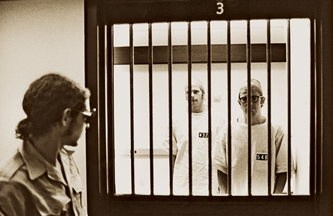

To my great surprise, young people now somewhat frequently contact me in order to solicit _career advice_. They are usually in college or highschool, and want to know what the best next steps are for a career in security or software development.  

令我非常惊讶的是，现在经常有年轻人联系我，向我寻求职业建议。他们通常是大学生或高中生，想知道从事安全或软件开发工作的最佳下一步是什么。

This is, honestly, a really complicated question, mostly because I’m usually concerned that the question itself might be the wrong one to be asking. What I want to say, more often than not, is something along the lines of _don’t do it_; when I got out of highschool and focused on the answer to that same question, it was very nearly one of the biggest mistakes of my life.  

老实说，这是一个非常复杂的问题，主要是因为我通常担心这个问题本身可能是一个错误的问题。我通常想说的是，不要这样做；当我从高中毕业，专注于这个问题的答案时，这几乎是我一生中最大的错误之一。

Since I get these inquiries fairly regularly, I thought I’d write something here that I can use as a sort of canonical starting point for a response.  

因为我经常收到这些询问，所以我想在这里写点东西，作为答复的标准起点。

### Tyler Durden was wrong, you _are_ your job.  

泰勒-德顿错了，你就是你的工作。

In 1971, Dr. Philip Zimbardo conducted a psychological experiment that is now popularly known as the “Stanford Prison Experiment.” He constructed a makeshift simulated prison in the basement of Stanford University’s psychology department, took a group of volunteers who tested as psychologically “normal” with no criminal background, flipped a coin, and assigned half of them to be “prisoners” and half of them to be “prison guards.”  

1971 年，菲利普-津巴多博士进行了一项心理学实验，即现在广为人知的 "斯坦福监狱实验"。他在斯坦福大学心理学系的地下室里搭建了一座临时模拟监狱，招募了一群心理测试 "正常"、没有犯罪背景的志愿者，掷硬币，并将其中一半人分配为 "囚犯"，另一半人分配为 "狱警"。

Initially, everyone acted awkwardly; the situation was so obviously foreign to their sense of self and their lived experience that they found it strange and even humorous. Fairly quickly, however, the situation eclipsed all of that. The prisoners became divorced from their former identities, and began to act from the place of being a prisoner. They alternated between staging minor protests and ratting each other out, to going on hunger strike and suffering psychological breakdowns.  

起初，每个人都表现得很尴尬；这种情况显然与他们的自我意识和生活经验格格不入，以至于他们觉得很奇怪，甚至觉得很幽默。然而，很快，这种情况让这一切都黯然失色。囚犯们开始脱离他们以前的身份，开始以囚犯的身份行事。他们在小规模抗议、相互告密、绝食抗议和心理崩溃之间交替出现。

The prison guards also _became_ prison guards, even though they were allowed to return to their normal lives in between their eight hour shifts. They went so far as to invent forms of psychological punishment, create solitary confinement cells, pit prisoners against each other in order to break them, and give long speeches while slowly pacing the hallway and rattling their wooden batons across the bars of the cell doors.  

狱警们也成了狱警，尽管他们可以在八小时轮班之间恢复正常生活。他们甚至发明了各种心理惩罚方式，建立了单独监禁的牢房，让囚犯相互对峙，以打垮他们，还一边在走廊里慢慢踱步，一边用木棍敲打牢房门的铁栏杆，发表长篇大论。

Had the coin landed differently, the individual people would have been on the reverse sides of the cell doors, but the roles would have been the same.  

如果硬币的落点不同，每个人就会站在牢门的反面，但角色是一样的。

<iframe width="480" height="360" src="https://www.youtube.com/embed/GlIyD15KS6s?start=225" frameborder="0"></iframe>

Things got so out of control that the experiment, originally scheduled for two weeks, had to be ended after six days.  

事情变得一发不可收拾，原定两周的实验不得不在六天后结束。

The experiment was positioned as a comment on [institutions](http://en.wikipedia.org/wiki/Abu_Ghraib_torture_and_prisoner_abuse), but the simpler lesson I draw from it as an individual is just _be careful what job you take, because your job will change you_.  

这项实验的定位是对机构的评论，但作为个人，我从中得到的更简单的教训是，做什么工作都要小心谨慎，因为工作会改变你。

This is obviously true for these types of hyperbolic examples — it’s not hard to imagine that a customs agent (who spends 40 hours a week looking suspiciously at people, thinking skeptically about the honesty of what people say, scientifically observing people’s eye movement, and trying to trip people up with confusing questions) might approach a conversation with someone they’ve just met at a party differently than they would have before taking the job.  

对于这类夸张的例子来说，这显然是正确的--不难想象，一个海关人员（他每周要花 40 个小时怀疑地看着别人，怀疑别人说话的真实性，科学地观察别人的眼球运动，并试图用令人困惑的问题来绊倒别人）在与一个刚在派对上认识的人谈话时，可能会采取与上岗前不同的方式。

It’s equally easy to imagine that someone who has worked as a prison guard for a decade might approach a romantic relationship differently than someone who has worked as a grief counselor for the same period.  

同样容易想象的是，一个做了十年狱警的人和一个做了十年悲伤辅导员的人对待恋爱关系的态度可能是不一样的。

But it’s not just cops, prison guards, and customs agents. The context of one’s life defines not just _what_ but _how_ one thinks, and a job tends to dominate the context of one’s life — particularly when that job is considered to be part of a career. Your job will change you.  

但是，不仅仅是警察、狱警和海关人员。一个人的生活环境不仅决定了他思考的内容，也决定了他思考的方式，而一份工作往往会主导一个人的生活环境--尤其是当这份工作被视为职业生涯的一部分时。工作会改变你。

### The choices we make.  

我们的选择

I recently got around to reading [Aaron Cometbus’](http://en.wikipedia.org/wiki/Aaron_Cometbus) enjoyable “Cometbus #54, In China With Green Day?!!” One of my favorite quotes was:  

最近，我读完了亚伦-彗星巴士（Aaron Cometbus）的《彗星巴士第54期，在中国与绿日乐队一起？我最喜欢的一句话是：

> Some things are like that—they strike you as repugnant for instinctive reasons, probably having to do with your culture and the way you were raised. The French word “gauche” comes to mind, but I preferred the Hebrew word “treyf.” Literally, it means not kosher, but I also use it to describe things like cars, bars, strip clubs, guns, dogs, rock-n-roll, and football games. Things that are treyf, you avoid, not because you hate them per se, but because in avoiding them you keep yourself from becoming like the people you hate.  
> 
> 有些事情就是这样--它们出于本能的原因让你感到厌恶，这可能与你的文化和成长方式有关。我想到了法语单词 "gauche"，但我更喜欢希伯来语单词 "treyf"。从字面上看，它的意思是不符合犹太教规，但我也用它来形容汽车、酒吧、脱衣舞俱乐部、枪支、狗、摇滚乐和足球比赛等事物。你避开 "treyf "的东西，并不是因为你讨厌它们本身，而是因为在避开它们的过程中，你可以避免自己变得和你讨厌的人一样。
> 
> – Aaron Cometbus, “Cometbus #54”  
> 
> \- Aaron Cometbus，"Cometbus #54"

The concept resonates with me for the same reasons. Like Aaron, I have my own list of things that are _treyf_, not because I find them necessarily unenjoyable, but because they _add up_ to something that I ultimately dislike.  

出于同样的原因，我也对这个概念产生了共鸣。和亚伦一样，我也有自己的 "Treyf "清单，这并不是因为我觉得它们一定不好玩，而是因为它们最终会让我不喜欢。

For instance, whenever I get on an airplane and walk past first class, I inevitably go through a familiar mental process. First, I’m envious. The passengers are already in their comfortable seats, drinking from champagne flutes, contemplating the moment after takeoff when they can recline into their cocoons and watch a movie of their choice on demand.  

例如，每当我坐上飞机，经过头等舱时，我都会不可避免地经历一个熟悉的心理过程。首先，我很羡慕。乘客们已经坐在舒适的座位上，拿着香槟酒杯喝着香槟，想着起飞后的那一刻，他们可以躺在自己的蚕茧里，点播自己喜欢的电影。

But then, I register who is sitting in those seats. It’s usually almost all predominantly unhealthy looking middle-aged white men, who it is clear from a glance have spent literally hundreds of hours of their lives over the past year in these airplanes. And suddenly, I’m glad that I’m not sitting there.  

但随后，我就会注意到这些座位上坐的都是些什么人。他们通常几乎都是看起来很不健康的中年白人男子，一看就知道在过去的一年里，他们在飞机上度过了数百个小时。突然间，我很庆幸自己没有坐在那里。

Those seats are _treyf_ for me, not because I don’t envy extra leg room, but because I don’t envy the people sitting in them. There’s a reason the bulk of the first class passengers resemble each other, just as there’s a reason prison guards tend to act the same. I know that by making choices designed to land me in the first class cabin, it would be difficult to avoid also inheriting the dreariness associated with its current occupants.  

我不喜欢那些座位，不是因为我不羡慕额外的腿部空间，而是因为我不羡慕坐在里面的人。头等舱的大部分乘客彼此相似是有原因的，就像监狱看守的行为往往相同一样。我知道，如果我做出了让自己坐进头等舱的选择，就很难避免同时继承头等舱乘客的沉闷。

### The future is looking back at you.  

未来正回望着你。

In the context of a career, these concepts make it simple to look into the future. Jobs at software companies are typically advertised in terms of the difficult problems that need solving, the impact the project will have, the benefits the company provides, the playful color of the bean bag chairs. Likewise, jobs in other fields have their own set of metrics that they use to position themselves within their domains.  

在职业生涯中，这些概念让我们很容易展望未来。软件公司的招聘广告通常以需要解决的难题、项目将产生的影响、公司提供的福利、豆袋椅的俏皮颜色等为关键词。同样，其他领域的工作也有自己的一套衡量标准，用来定位自己在其领域中的位置。

As a young person, though, I think the best thing you can do is to ignore all of that and simply _observe the older people working there_.  

不过，作为一个年轻人，我认为你能做的最好的事情就是忽略这一切，只是观察在那里工作的老年人。

They are the future you. Do not think that you will be substantially different. Look carefully at how they spend their time at work and outside of work, because this is also almost certainly how your life will look. It sounds obvious, but it’s amazing how often young people imagine a different projection for themselves.  

他们就是未来的你。不要以为你们会有本质的不同。仔细观察他们在工作和工作以外的时间是如何度过的，因为这也几乎肯定是你的生活将是什么样子。这听起来很明显，但令人惊讶的是，年轻人常常会为自己想象一个不同的未来。

Look at the real people, and you’ll see the honest future for yourself.  

看看那些真实的人，你就会看到自己真实的未来。

### Be careful not to discover a career before you’ve discovered yourself.  

小心不要在发现自己之前就发现了职业。

This all presupposes we’re starting from a point where considering these questions is a real possibility. Sure, pure objectivity is impossible; after all, society itself _also_ defines the context of our thoughts, and by now it’s way too late to effectively remove ourselves from _that_. So how can we evaluate what experiences we want for ourselves, when it is experiences themselves which transform our very desires?  

这一切的前提是，我们的出发点是考虑这些问题是真正可能的。当然，纯粹的客观性是不可能的；毕竟，社会本身也定义了我们思想的背景，而现在要有效地将自己从社会中剥离出来已经太晚了。那么，既然是体验本身改变了我们的欲望，我们又该如何评估自己想要什么样的体验呢？

At the moment when young people are considering their career strategy, they have typically made all of their life choices completely within supporting structures. Even having worked hard to get where they are, and even though things like class and race can mean that some have the cards stacked against them, it’s rare for young people to have substantially departed from supporting frameworks. Highschools have “college counselors” (not “dropout counselors”), scholarships and financial aid packages lead in a single direction, and university overlaps with internships — which then culminates largely in a series of “career fairs.”  

当年轻人考虑自己的职业战略时，他们通常已经完全在支持性结构内做出了所有的人生选择。即使他们付出了艰辛的努力才取得了今天的成就，即使阶级和种族等因素可能意味着有些人的命运对他们不利，但年轻人很少会在很大程度上脱离支持性框架。高中有 "大学辅导员"（而不是 "辍学辅导员"），奖学金和一揽子经济援助方案的方向是单一的，大学与实习重叠--然后在一系列 "职业博览会 "中达到高潮。  

There is a tremendous amount of support for these decisions, and very little support for making any deviating choices.  

这些决定得到了大量的支持，而对做出任何偏差选择的支持却少之又少。

When we arrive at the ends of these funnels, it’s possible that the direction we’re facing is more a reflection of those structures than it is a reflection of ourselves. Self-determination in a moment like that can’t simply be about making a choice, it has to start with transforming the conditions that _constitute_ our choices. It requires challenging the “self” in “self-determination” by stepping as far outside of those supporting structures as possible, for as long as possible.  

当我们到达这些漏斗的两端时，我们所面临的方向可能更多是这些结构的反映，而不是我们自身的反映。在这样的时刻，自决不能仅仅是做出选择，它必须从改变构成我们选择的条件开始。这就要求我们挑战 "自决 "中的 "自我"，尽可能长时间地跳出这些支持性结构。

This is necessarily terrifying. I think a lot about a quote from [Alfredo Bonanno](http://en.wikipedia.org/wiki/Alfredo_M._Bonanno), an anarchist and habitual bank robber, on the feeling of leaving prison:  

这必然是可怕的。我经常想起阿尔弗雷多-博纳诺（Alfredo Bonanno）的一句话，他是一名无政府主义者，也是银行抢劫惯犯：

> The instant you get out of prison you have the sensation that you are leaving something dear to you. Why? Because you know that you are leaving a part of your life inside, because you spent some of your life there which, even if it was under terrible conditions, is still a part of you. And even if you lived it badly and suffered horribly, which is not always the case, it is always better than the nothing that your life is reduced to the moment it disappears.  
> 
> 从监狱出来的那一刻，你会有一种感觉，你要离开一些你珍爱的东西。为什么？因为你知道，你把生命的一部分留在了监狱里，因为你在那里度过了你生命中的一些时光，即使那是在可怕的条件下度过的，但它仍然是你生命的一部分。即使你在那里生活得很糟糕，遭受了可怕的苦难（这并不总是事实），但总比你的生命在消失的那一刻化为乌有要好。
> 
> – Alfredo Bonanno, “Locked Up”  
> 
> \- 阿尔弗雷多-博纳诺，"被关起来"

I know that the most significant and meaningful periods of my life have all been moments that I could have never rationally chosen or even _known as possibilities_ had I not been foolish or lucky enough to step into the nothingness that Alfredo Bonanno writes about. I try to remind myself that if leaving prison is scary, the same is likely true for any genuine process of discovery.  

我知道，我生命中最重要、最有意义的时光，都是如果不是愚蠢或幸运地踏入阿尔弗雷多-博纳诺笔下的虚无世界，我根本无法理性选择、甚至不知道可能发生的时刻。我试着提醒自己，如果离开监狱是可怕的，那么任何真正的探索过程也可能是如此。

### There’s no rush to get started early on a never-ending task.  

对于一项永无止境的任务，不必急于提前开始。

Everything before a career has defined beginnings and endings. Elementary school, middle school, junior high, highschool, university. There’s always been a predefined end, and that contributes a lot to making the indignities of those institutions bearable. Once you start working full time, though, it’s just One Long Semester that you’re expected to attend for _the rest of your life_.  

职业生涯之前的一切都有明确的开始和结束。小学、初中、高中、大学。总是有一个预先确定的结束，这让那些机构的屈辱变得可以忍受。然而，一旦你开始全职工作，你的余生就只能参加一个漫长的学期。

So consider caution if you’re overly excited to start down that road as quickly as you can. Other than being forever, it’s not as different from what’s come before as you might imagine.  

因此，如果你过于兴奋，想尽快开始这条路，请慎重考虑。除了永久性之外，它与之前的一切并没有想象中的那么不同。

### By way of an explanation.  

解释一下

This is all just to explain why, when people write me for career advice, I’m as likely to respond with something like _“if I were you, I’d hitchhike to Alaska this summer instead.”_  

这只是为了解释为什么当人们写信给我寻求职业建议时，我很可能会回答 "如果我是你，今年夏天我会搭便车去阿拉斯加 "之类的话。

My career advice usually falls within the framework of doing the absolute minimum amount of work necessary to prevent starvation, and then doing something that’s not about money, completely outside of supporting structures, and not simply a matter of “consuming experience” with the remaining available time.  

我对职业生涯的建议通常是，做绝对必要的最低限度的工作，以防饿死，然后做一些与钱无关的事情，完全脱离支持结构，而不是简单地用剩余的可用时间 "消耗经验"。

Learn three chords, start a band, and [go on tour](http://www.youtube.com/watch?v=U5g8u-2TI3g&feature=youtu.be&t=5m20s). Ride a bicycle [as far as you can](http://www.microcosmdistribution.com/catalog/zines/2821/). Go [WWOOFing](http://www.wwoof.org/) or start a [community garden](http://hayesvalleyfarm.tumblr.com/) in your neighborhood. Put together a [traveling puppet show](http://mrpuppetarmy.wordpress.com/). Build a drone to engage the emerging drones [controlled by domestic police](http://www.newser.com/story/156143/sheriff-in-oakland-wants-surveillance-drone.html). Do whatever — but make it uncomfortable (like leaving prison!) and _make it count_.  

学会三个和弦，组建一个乐队，然后开始巡演。骑自行车，骑得越远越好。参加世界野生动物基金会（WWOOFing），或在你的社区开辟一个社区花园。组织一场巡回木偶剧。制造一架无人机，与国内警察控制的新兴无人机交战。做任何事--但要让它不舒服（比如离开监狱！），并让它有意义。

-   Stay in touch, 保持联系、
