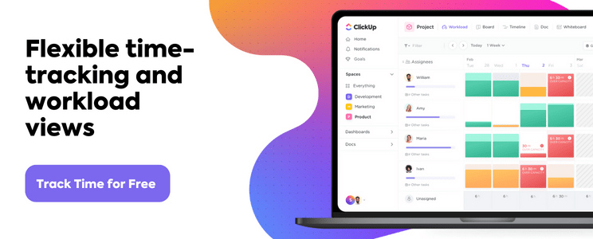
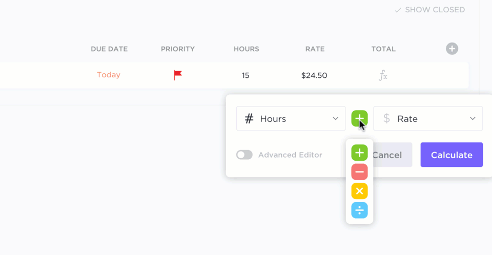
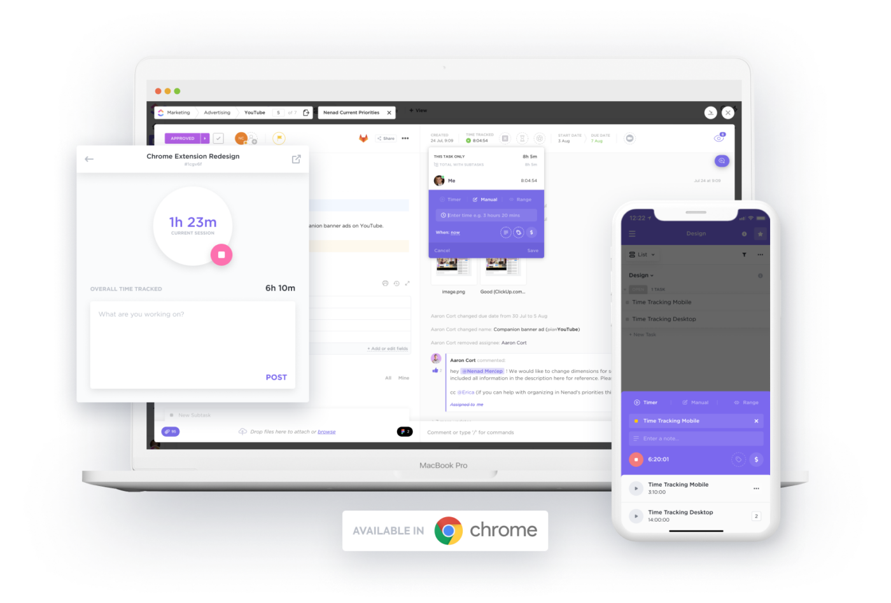
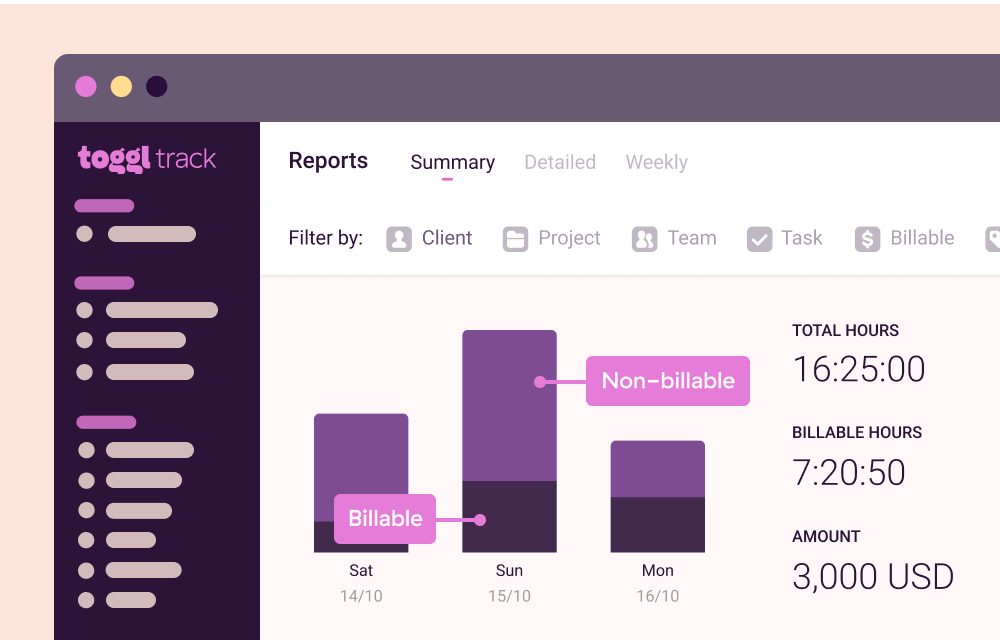
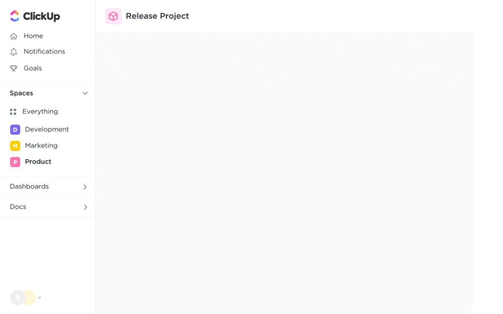

As the iconic April Ludgate once said, _“time is money, money is power, power is pizza, and pizza is knowledge.”_  

标志性人物艾普尔-路德盖特曾说过："时间就是金钱，金钱就是力量，力量就是披萨，披萨就是知识"。

Whether she knew it or not, April precisely summarized the importance of [time management](https://clickup.com/blog/time-management/) and tracking software in those few words. Kind of. 🍕💜  

不管她是否知道，艾普尔用这短短几句话准确地概括了时间管理和跟踪软件的重要性。有点像。🍕💜

Time tracking software is a must-have for any team, agency, or freelancer looking to increase productivity, [fast track a project](https://clickup.com/blog/fast-tracking-in-project-management/), [time block](https://clickup.com/blog/time-blocking-templates/) their day, _and more_.  

时间跟踪软件是任何团队、机构或自由职业者提高工作效率、快速跟踪项目、对一天进行时间限制等的必备软件。 These tools can be used by team members to clock in and out, organize their workload, and record the time they spent on individual tasks to optimize their workdays and stay nimble during the week.  

团队成员可以使用这些工具打卡、整理工作量、记录单个任务所花费的时间，从而优化工作日，在一周内保持灵活。

Plus, [project time tracking](https://clickup.com/blog/project-time-tracking/) is a win-win for both employers and employees. By making the most of your time at work, you then have more time _back_ to focus on family, passion projects, relationships, and hobbies. 🏆  

此外，项目时间跟踪对雇主和雇员来说都是双赢的。充分利用工作时间，你就有更多的时间专注于家庭、激情项目、人际关系和业余爱好。🏆

The biggest challenge is investing in the right time tracking software to fit your needs.  

最大的挑战在于投资合适的时间跟踪软件以满足您的需求。

…and with the number of software at your disposal, that trial and error process could be a major headache. 😳  

......由于可供您使用的软件数量众多，因此尝试和出错的过程可能会让您非常头疼。😳

But you’ve come to the right place! We’ve created this detailed list of the 10 best time tracking apps to guide your search and help you compare the top features, pros and cons, pricing, and ratings.  

你来对地方了！我们创建了这份 10 款最佳时间跟踪应用程序的详细列表，为您的搜索提供指导，并帮助您比较顶级功能、优缺点、定价和评级。

A time-tracking app is an online or mobile-friendly tool that records the time you spend at work, on certain tasks, or on various projects during the day, week, month, or even year!  

时间跟踪应用程序是一种在线或移动友好型工具，可以记录你在一天、一周、一个月甚至一年内用于工作、执行某些任务或各种项目的时间！ The insights from these apps can be used to help you better understand your productivity or be used to accurately calculate payroll or billable time.  

从这些应用程序中获得的信息可以帮助您更好地了解自己的工作效率，或用于准确计算工资或计费时间。

By understanding where your time goes in the day and how much your time _really_ costs you, employees and companies can make more informed decisions about how to streamline processes and increase overall profitability.  

通过了解一天中时间的去向以及时间的实际成本，员工和公司可以就如何简化流程和提高整体盈利能力做出更明智的决策。

Especially for hourly employees and contractors, time tracking software is used to monitor shifts, lunch breaks, PTO, sick time, and more!  

特别是对于小时工和承包商，时间跟踪软件可用于监控轮班、午休、PTO、病假等时间！ Plus, some teams rely on it to meet state, union, or [project requirements](https://clickup.com/blog/project-requirements/).  

此外，一些团队还需要依靠它来满足国家、工会或项目的要求。

Sounds like a lot already, but there’s still more that time tracking software can do!  

听起来已经很多了，但时间跟踪软件还能做更多！ The real question is—_what features do you actually need?_  

真正的问题是，您究竟需要哪些功能？

The beauty of time tracking software is that it has the power to combine tons of different [time management techniques](https://clickup.com/blog/time-management-techniques/) into a convenient and intuitive app—ideally.  

时间跟踪软件的妙处在于，它能将大量不同的时间管理技术整合到一个方便直观的应用程序中--理想情况下是这样。

Find precise numbers instantly using simple or advanced formulas in ClickUp Custom Fields  

在 ClickUp 自定义字段中使用简单或高级公式即时查找精确数字

Not all time tracking or [time blocking apps](https://clickup.com/blog/time-blocking-apps/) pack the same functionality, ease of use, and cost efficiency as the next, which is why it’s key to know what you’re looking for before you buy.并不是所有的时间跟踪或时间封锁应用程序都具有相同的功能、易用性和成本效益，因此在购买前了解自己需要什么是关键所在。 Here are our top five must-have features in high-quality and _useful_ time tracking software:  

以下是高品质实用时间跟踪软件的五大必备功能：

-   **Global time tracking**: Starting and stopping your digital clock every time you jump between browser windows, tasks, or meetings is not the best use of your time. Look for software that can record, manage, and add up the time you spend on _**all**_ of your work.  
    
    全局时间跟踪：每次在浏览器窗口、任务或会议之间跳转时，都要启动和停止数字时钟，这不是利用时间的最佳方式。寻找能记录、管理和累加你所有工作时间的软件。
-   **Time reporting**: Getting a high-level glimpse at your time entries, estimates, timelines, and project milestones will help you make strategic decisions regarding your processes.  
    
    时间报告：对时间条目、估算、时间表和项目里程碑进行高层次的了解，有助于你对工作流程做出战略性决策。
-   **Formulas**: Formulas help you easily calculate key numbers automatically including time worked, hourly costs, budgets, and more.  
    
    公式：公式可帮助您轻松地自动计算包括工作时间、小时成本、预算等在内的关键数字。
-   **Sorting and filtering**: Notes, labels, or tags will help you organize and access your time entries easily.  
    
    排序和筛选：备注、标签或标记可帮助您轻松整理和访问时间条目。
-   **Integrations**: Finding a time tracking software with tons of integrations will help you view and manage the time you spend in different apps with ease.  
    
    集成：寻找一款具有大量集成功能的时间跟踪软件，可帮助您轻松查看和管理您在不同应用程序中花费的时间。

The good news is: There are a ton of software that meet these criteria—and several that go above and beyond!  

好消息是：有很多软件都能满足这些标准，而且还有几款超越了这些标准！

You didn’t think we’d make you fend for yourself on your time tracking software search, did you?  

你不会以为我们会让你在时间跟踪软件搜索中自生自灭吧？

Put your newfound time management knowledge to the test to find the time tracking tool of your dreams using this detailed list as your guide. Compare key features, pros and cons, price, and ratings of the 10 best time tracking software to find the best time software for you!  

以这份详尽的清单为指南，检验你新发现的时间管理知识，找到你梦寐以求的时间跟踪工具。比较 10 款最佳时间跟踪软件的主要功能、优缺点、价格和评级，找到最适合你的时间软件！

### 1\. [ClickUp](https://clickup.com/) 1.ClickUp

Track time, set estimates, add notes, and view reports of your time from anywhere with ClickUp’s Global Timer  

使用 ClickUp 的 Global Timer 随时随地跟踪时间、设置估算、添加备注并查看时间报告

ClickUp is the only all-in-one productivity software powerful enough to consolidate your work across apps into a single platform—including the time you spent in other tabs, apps, and tasks!  

ClickUp 是唯一一款功能强大的多合一生产力软件，可将您在各个应用程序中的工作整合到一个平台中，包括您在其他标签页、应用程序和任务中花费的时间！ It is the ideal time tracking app for individuals and managers who want to stay ahead of their productivity with [ClickUp’s project time tracking](https://clickup.com/features/project-time-tracking) features, a free [Chrome Extension](https://clickup.com/chrome-extension) to track time between windows, and more!  

对于希望利用 ClickUp 的项目时间跟踪功能、免费 Chrome 浏览器扩展来跟踪窗口之间的时间等功能来提高工作效率的个人和管理人员来说，它是一款理想的时间跟踪应用程序！

Plus, ClickUp is the only time tracking software to offer [Workload view](https://help.clickup.com/hc/en-us/articles/6310449699735-Use-Workload-view) for a high-level glimpse at the amount of work each team member is scheduled on a weekly or monthly basis.  

此外，ClickUp 是唯一一款提供工作量视图的时间跟踪软件，可以从高层次了解每个团队成员每周或每月的工作安排。

Use ClickUp’s Workload View to see who is ahead or behind and easily drag-and-drop tasks to reallocate resources  

使用 ClickUp 的 "工作量视图 "查看谁领先或落后，并轻松拖放任务以重新分配资源

#### ClickUp best features ClickUp 的最佳功能

-   Flexible time tracking from any device, window, app, or task with the global timer  
    
    利用全局计时器，从任何设备、窗口、应用程序或任务灵活跟踪时间
-   Build custom timesheets, reports, and insights with [time tracking widgets](https://help.clickup.com/hc/en-us/articles/6312273172631-Time-Tracking-Widgets)  
    
    利用时间跟踪小工具创建自定义时间表、报告和见解
-   Plan your week ahead of time with time estimates per task or workload  
    
    根据任务或工作量估算时间，提前规划一周工作
-   Add context to every time entry with notes on how you used your time  
    
    为每个时间条目添加上下文，备注您是如何使用时间的
-   Automatically calculate billable time for accuracy across all invoices  
    
    自动计算应计费时间，确保所有发票的准确性
-   Filter, sort, and categorize your time entries with labels  
    
    使用标签对时间条目进行筛选、排序和分类

#### ClickUp limitations ClickUp 限制

-   Can be a bit of a learning curve adapting to ClickUp’s rich set of features  
    
    要适应 ClickUp 丰富的功能，可能需要一定的学习曲线
-   Not all views are available on the mobile app—yet!  
    
    移动应用程序尚未提供所有视图！

#### ClickUp pricing ClickUp 定价

-   **Free Forever 永远免费**
-   **Unlimited**: $5 per user, per month  
    
    无限制：每位用户每月 5 美元
-   **Business**: $12 per user, per month  
    
    企业：每位用户每月 12 美元
-   **Business Plus**: $19 per user, per month  
    
    企业增强版：每位用户每月 19 美元
-   **Enterprise**: Contact ClickUp for custom pricing  
    
    企业：联系 ClickUp 了解定制价格

#### ClickUp ratings and reviews  

ClickUp 的评级和评论

-   **G2**: 4.7/5 (5,510+ reviews)  
    
    G2: 4.7/5 (5,510+ 条评论)
-   **Capterra**: 4.7/5 (3,510+ reviews)  
    
    Capterra: 4.7/5 (3,510+ 条评论)

### 2\. Timely 2.及时

Timely’s goal is to make the process of planning out tasks simpler and more efficient by giving users access to automatic scheduling technology. This ensures tasks will always be completed on time without requiring any manual input from users. The time tracking tool also has powerful analytics that helps users determine which activities take up the most time and effort so they can make informed decisions about how best to use their resources.  

Timely 的目标是通过让用户使用自动计划技术，使计划任务的过程更简单、更高效。这能确保任务始终按时完成，而无需用户手动输入。这款时间跟踪工具还具有强大的分析功能，可帮助用户确定哪些活动耗费的时间和精力最多，从而就如何更好地利用资源做出明智的决策。

Timely’s features allow users to collaborate with others, set reminders, monitor progress, and stay on top of tasks. Its drag-and-drop interface makes managing multiple projects and prioritizing tasks a breeze.  

Timely 的功能允许用户与他人协作、设置提醒事项、监控进度并保持在任务的首位。它的拖放界面让管理多个项目和确定任务优先级变得轻而易举。

Overall, Timely simplifies task management for teams and individuals alike by providing an intuitive interface with powerful features that allow users to easily stay organized and be more productive in their day-to-day!  

总的来说，Timely 简化了团队和个人的任务管理，它提供直观的界面和强大的功能，让用户在日常工作中轻松保持井井有条，提高工作效率！

#### Timely best features Timely 的最佳功能

-   Native integrations and open APIs to connect data across your tech stack  
    
    本机集成和开放式应用程序接口可连接整个技术栈的数据
-   Tag lists to standardize the way you report on hours logged  
    
    标签列表可使您报告记录工时的方式标准化
-   Apps on Mac, Windows, iOS, and Android  
    
    适用于 Mac、Windows、iOS 和 Android 的应用程序
-   Automatic time tracking 自动时间跟踪

#### Timely limitations 及时限制

-   Issues with AI performance cause more work for the users to troubleshoot  
    
    人工智能性能问题会增加用户排除故障的工作量
-   Time accuracy might be a hassle if you’re changing timezones如果你要更换时区，时间准确性可能会带来麻烦  

#### Timely pricing 及时定价

-   **Starter**: $9/user per month, billed yearly  
    
    入门级：每月 9 美元/用户，按年结算
-   **Premium**: $16/user per month, billed yearly  
    
    高级：每月 16 美元/用户，按年结算
-   **Unlimited**: $22/user per month, billed yearly  
    
    无限：每月 22 美元/用户，按年结算

#### Timely ratings and reviews  

及时的评级和审查

-   **Capterra:** 4.7/5 (600+ reviews)  
    
    Capterra: 4.7/5 (600+ 条评论)
-   **G2:** 4.8/5 (200+ reviews) G2: 4.8/5 (200+ 条评论)

### 3\. Toggl Track 3.Toggl Track

via [Toggl Track](https://toggl.com/track/) 通过 Toggl Track

[Toggl Track](https://clickup.com/blog/toggl-alternatives/) is a time tracking tool allowing users to easily track time spent on different tasks and projects, and provides detailed reports and analytics that can help teams identify areas where they can improve efficiency and productivity.   

Toggl Track 是一款时间跟踪工具，允许用户轻松跟踪花在不同任务和项目上的时间，并提供详细的报告和分析，帮助团队确定可以提高效率和生产力的领域。

This is a flexible tracking software that can be customized to the specific needs of team workflows. To see what activities are generating revenue, assign billable rates to workspaces, team members, projects, or project members!  

这是一款灵活的跟踪软件，可根据团队工作流程的具体需求进行定制。要查看哪些活动产生了收入，可为工作区、团队成员、项目或项目成员分配计费率！

Also, it can integrate with other tools such as GitLab, Notion, Adobe XD, and more. This makes it accessible to use Toggl Track paired with other tools and platforms your team already uses.  

此外，它还可以与 GitLab、Notion、Adobe XD 等其他工具集成。这使得 Toggl Track 可以与团队已经使用的其他工具和平台搭配使用。

**_Manage your team’s time with the_** [**_Toggl Track and ClickUp integration_**](https://clickup.com/integrations/toggl)**_!_**  

使用 Toggl Track 和 ClickUp 集成管理团队时间！

#### Toggl Track best features  

Toggl Track 最佳功能

-   100+ integrations with Chrome and Firefox browser extensions  
    
    100 多个与 Chrome 和 Firefox 浏览器扩展的集成
-   Payroll calculations for contractors and employees  
    
    为承包商和员工计算薪资
-   Web, mobile, and desktop apps  
    
    网络、手机和桌面应用程序
-   Real-time or offline tracking   
    
    实时或离线跟踪

#### Toggl Track limitations Toggl Track 限制

-   Free plan members can’t pin the most frequently-used time entries for easy access  
    
    免费计划的会员无法将最常用的时间条目固定下来以方便访问
-   Not suitable as a task management tool on its own  
    
    不适合单独用作任务管理工具

#### Toggl Track pricing Toggl 跟踪定价

-   **Team**: $9/user per month, billed annually  
    
    团队：每月 9 美元/用户，按年结算
-   **Business**: $15/user per month, billed annually  
    
    企业：每月 15 美元/用户，按年结算

#### Toggl Track ratings and reviews  

Toggl Track 评分和评论

-   **Capterra:** 4.7/5 (2,000+ reviews)  
    
    Capterra: 4.7/5 (2,000 多条评论)
-   **G2:** 4.6/5 (1,000+ reviews)  
    
    G2: 4.6/5 (1,000+ 条评论)

### 4\. RescueTime 4.救援时间

RescueTime is fully-automated time tracking software that runs in the background on computers and mobile devices, tracking the platforms and websites used, and providing detailed reports on time spent on different activities.  

RescueTime 是一款全自动时间跟踪软件，可在电脑和移动设备后台运行，跟踪所使用的平台和网站，并提供不同活动所用时间的详细报告。 One of the main benefits of RescueTime is that it helps users to gain insights into their time usage and identify distractions and time-wasters, which can then be addressed to improve productivity.  

RescueTime 的主要优点之一是帮助用户深入了解时间使用情况，找出分心和浪费时间的行为，然后加以解决，提高工作效率。

This time tracking app also provides a handy feature called the Focus Work Goal, which assesses your work style and meeting schedule to give you a daily focus goal. Users can set productivity goals and receive alerts when they are spending too much time on non-productive activities, such as social media or entertainment websites.  

这款时间跟踪应用程序还提供了一项名为 "重点工作目标 "的便捷功能，它可以评估你的工作风格和会议安排，从而为你制定每日重点工作目标。用户可以设定工作效率目标，并在社交媒体或娱乐网站等非生产性活动上花费过多时间时收到提醒。

#### RescueTime best features RescueTime 的最佳功能

-   Integrations with calendar software like Google Calendar and Outlook  
    
    与谷歌日历和 Outlook 等日历软件集成
-   Smart coaching throughout the day to keep you on track with tasks  
    
    全天候智能辅导，让您始终按计划完成任务
-   Focus Sessions block sites that are unproductive and distracting  
    
    专心会话可屏蔽无益和分散注意力的网站
-   Windows and Mac apps to track desktop activity  
    
    跟踪桌面活动的 Windows 和 Mac 应用程序

#### RescueTime limitations RescueTime 的限制

-   Falls short in project and task management  
    
    在项目和任务管理方面存在不足
-   No collaboration features  
    
    没有协作功能

#### RescueTime pricing RescueTime 定价

-   Contact RescueTime for details  
    
    详情请联系 RescueTime

#### RescueTime ratings and reviews  

RescueTime 的评分和评论

-   **Capterra:** 4.6/5 (120+ reviews)  
    
    Capterra: 4.6/5 (120 + 评论)
-   **G2:** 4.1/5 (70+ reviews) G2: 4.1/5 (70 + 评论)

### 5\. Clockify 5.时钟化

[Clockify](https://clickup.com/blog/clockify-alternatives/) is a time tracking application that can be used to track the amount of time spent on projects and tasks.  

Clockify 是一款时间跟踪应用程序，可用于跟踪项目和任务所花费的时间。 It allows users to create accurate timesheets, set billable rates for their work, and generate detailed reports about their work progress. To use Clockify, users need to create an account on the app and then log in to start tracking time from the Clockify dashboard.   

它允许用户创建准确的工时表，为工作设定计费率，并生成有关工作进度的详细报告。要使用 Clockify，用户需要在应用程序上创建一个账户，然后登录，从 Clockify 面板开始跟踪时间。

A unique feature Clockify offers is changing the start time of the running timer. For example, if you forget to start the timer at the beginning of the day, you can manually adjust the timer to reflect when you began working. The feature is particularly useful for those who don’t track their time regularly. This prevents you from overcharging clients or working more than you should be!  

Clockify 提供的一个独特功能是更改运行计时器的开始时间。例如，如果您忘记在一天开始时启动定时器，您可以手动调整定时器，以反映您开始工作的时间。这项功能对于那些没有定期跟踪时间的人来说特别有用。这可以防止你向客户收取过多费用或工作时间超过你应该工作的时间！

#### Clockify best features Clockify 最佳功能

-   Quick time blocking on your calendar   
    
    在日历上快速封锁时间
-   Time activity charts on a dashboard  
    
    仪表板上的时间活动图表
-   Idle app detection  空闲应用程序检测
-   80+ integrations 80 多个集成

#### Clockify limitations 时钟化限制

-   Teams may require training to learn all of its features  
    
    团队可能需要培训才能掌握其所有功能
-   Less-intuitive interface 界面不够直观

#### Clockify pricing Clockify 定价

-   **Basic**: $3.99/user per month, billed annually  
    
    基本：每月 3.99 美元/用户，按年结算
-   **Standard**: $5.49/user per month, billed annually  
    
    标准：每月 5.49 美元/用户，按年结算
-   **Pro**: $7.99/user per month, billed annually  
    
    专业版：7.99 美元/用户/月，按年结算
-   **Enterprise**: $11.99/user per month, billed annually  
    
    企业：11.99 美元/用户/月，按年结算

#### Clockify ratings and reviews  

Clockify 评分和评论

-   **Capterra:** 4.7/5 (4,000+ reviews)  
    
    Capterra: 4.7/5 (4,000 多条评论)
-   **G2:** 4.5/5 (100+ reviews) G2：4.5/5（100 多条评论）

### 6\. Float 6.浮动

The Float resource management tool is designed to help organizations streamline their resource management processes.Float 资源管理工具旨在帮助企业简化资源管理流程。 It offers advanced analytics and algorithms to provide detailed information about resources such as employees, finances, and processes.  

它提供先进的分析和算法，可提供有关员工、财务和流程等资源的详细信息。

This data can then be used to optimize efficiency, reduce costs, increase profitability, and make informed decisions. Real-time resource planning and tracking with Float enables organizations to react quickly to any changes.  

这些数据可用于优化效率、降低成本、提高盈利能力并做出明智决策。Float 的实时资源规划和跟踪功能使企业能够对任何变化做出快速反应。

Using its analytics feature, organizations can spot trends and opportunities, staying ahead of their competitors. This helps teams make better decisions faster and be more productive!  

利用其分析功能，企业可以发现趋势和机遇，领先于竞争对手。这有助于团队更快地做出更好的决策，提高工作效率！

#### Float best features Float 的最佳功能

-   Finance tools capture the team’s logged billable hours to generate invoices  
    
    财务工具可记录团队的计费工时并生成发票
-   Automated reminders via Slack, email, and mobile   
    
    通过 Slack、电子邮件和手机自动提醒
-   Pre-filled timesheets based on scheduled tasks  
    
    根据计划任务预填工时表
-   Estimate vs. actual hours comparison  
    
    估算工时与实际工时对比

#### Float limitations  浮动限制

-   Steep learning curve to build a stable workflow within the platform  
    
    在平台内建立稳定工作流程的学习曲线较长
-   Lacks advanced data exporting capabilities  
    
    缺乏先进的数据导出功能

#### Float pricing 浮动定价

-   **Resource Planning**: $6/person per month, billed annually  
    
    资源规划：每人每月 6 美元，按年结算
-   **Resource Planning and Time Tracking:** $10/person per month, billed annually  
    
    资源规划和时间跟踪：每人每月 10 美元，按年结算
-   **Plus Pack add-on**: $6/person per month  
    
    附加包附加功能：每人每月 6 美元

#### Float ratings and reviews  

漂浮》的评分和评论

-   **Capterra:** 4.5/5 (1,000+ reviews)  
    
    Capterra: 4.5/5 (1,000 多条评论)
-   **G2:** 4.2/5 (1,000+ reviews)  
    
    G2: 4.2/5 (1,000 多条评论)

### 7\. HourStack 7.小时堆栈

HourStack is a project and time management tool helping users get organized, boost productivity, and reach their goals. Users can organize tasks into blocks of time, [prioritize tasks](https://clickup.com/blog/how-to-prioritize-your-work/), and manage their day-to-day activities from a single view.  

HourStack 是一款项目和时间管理工具，可帮助用户有条不紊地工作，提高工作效率，实现自己的目标。用户可以将任务组织到时间块中，确定任务的优先级，并通过单一视图管理日常活动。

HourStack’s modern, intuitive interface lets users visualize progress over time with progress bars, quickly capture data points with notes and tags, and switch tasks between days and weeks with ease.HourStack 界面现代、直观，用户可以通过进度条直观地看到一段时间内的进展情况，通过备注和标签快速捕捉数据点，并在日与周之间轻松切换任务。 This time tracking app lets you stay on top of projects with features like task reminders, advanced filtering, and collaborative workspace support.   

这款时间跟踪应用程序具有任务提醒、高级过滤和协作工作区支持等功能，让你随时掌握项目进度。

#### HourStack best features HourStack 最佳功能

-   Individual and Team calendar views to optimize schedules   
    
    个人和团队日历视图，优化日程安排
-   Customizable reports with filters, grouping, and sorting  
    
    可定制报告，包括过滤器、分组和排序
-   Excel, Google Sheets, and CSV file exports  
    
    导出 Excel、Google Sheets 和 CSV 文件
-   One-click calendar timers  
    
    一键式日历计时器

#### HourStack limitations  HourStack 限制

-   Time accuracy depends on consistent user check-in and maintenance   
    
    时间准确性取决于持续的用户签到和维护
-   Short free trial period to experience any true impact on productivity   
    
    短期免费试用，体验对生产率的真正影响

#### HourStack pricing HourStack 定价

-   **Personal**: $9/month for 1 member, billed annually  
    
    个人：1 名成员每月 9 美元，按年结算
-   **Team**: $12/month per member, billed annually  
    
    团队：每位成员每月 12 美元，按年结算

#### HourStack ratings and reviews  

HourStack 的评级和评论

-   **Capterra:** 4.8/5 (10+ reviews)  
    
    Capterra: 4.8/5 (10 + 评论)
-   **G2:** 4.4/5 (5 reviews) G2: 4.4/5 (5 条评论)

### 8\. Paymo 8.付款方式

[Paymo’s time tracking tool](https://clickup.com/blog/paymo-alternatives/) lets businesses track how much time their employees spend doing different things. It helps teams improve their billing and invoicing processes by providing accurate, detailed time tracking data—one of its key benefits.   

Paymo 的时间跟踪工具可让企业跟踪员工花在不同事情上的时间。它通过提供准确、详细的时间跟踪数据，帮助团队改进计费和开票流程，这是它的主要优势之一。

With this data, users can generate accurate and transparent invoices, which builds better client relationships. Aside from tracking billable and non-billable time, the Paymo time tracking tool can also be used to understand costs to improve pricing models.  

有了这些数据，用户就可以生成准确、透明的发票，从而建立更好的客户关系。除了跟踪计费和非计费时间，Paymo 时间跟踪工具还可用于了解成本，从而改进定价模式。

Project managers can also use the tool to set project timelines and deadlines. For example, the project manager establishes milestones that each team member should work towards and then track their progress with regular check-ins.  

项目经理还可以使用该工具设定项目时间表和截止日期。例如，项目经理可设定每个团队成员应努力实现的里程碑，然后通过定期签到来跟踪进度。

#### Paymo best features Paymo 的最佳功能

-   Daily, weekly, or monthly timesheet views  
    
    每日、每周或每月的时间表视图
-   Timesheet personalization settings  
    
    时间表个性化设置
-   Pie and bar chart reports  
    
    饼图和条形图报告
-   Resource management  资源管理

#### Paymo limitations  付款方式限制

-   No advanced task management on the free plan  
    
    免费计划没有高级任务管理功能
-   Integrations are only available in the paid plans  
    
    只有付费计划才提供集成功能

#### Paymo pricing Paymo 定价

-   **Free 免费**
-   **Starter**: $4.95/user per month, billed annually  
    
    入门级：每用户每月 4.95 美元，按年结算
-   **Small** **Office**: $9.95/user per month, billed annually  
    
    小型办公室：每用户每月 9.95 美元，按年结算
-   **Business**: $20.79/user per month, billed annually  
    
    企业：20.79 美元/用户/月，按年结算

#### Paymo ratings and reviews  

Paymo 评分和评论

-   **Capterra:** 4.7/5 (400+ reviews)  
    
    Capterra: 4.7/5 (400+ 条评论)
-   **G2:** 4.6/5 (500+ reviews) G2: 4.6/5 (500+ 条评论)

**_Run a small business? Check out these [small business time tracking tools](https://clickup.com/blog/time-tracking-software-small-businesses/)!  

经营小生意？看看这些小企业时间跟踪工具！_**

### 9\. Time Doctor 9.时间医生

Time Doctor is a time tracking software helping businesses and individuals better understand how they are spending their time.Time Doctor 是一款时间跟踪软件，可帮助企业和个人更好地了解他们是如何花费时间的。 It runs in the background on computers and mobile devices, tracking the applications and websites that are used, and providing detailed reports on time spent on different activities.  

它可在电脑和移动设备的后台运行，跟踪所使用的应用程序和网站，并提供不同活动所用时间的详细报告。

One of the main benefits of Time Doctor is that it helps users to gain insights into their distractions and time-wasters, which can then be addressed to improve productivity.时间医生的主要优点之一是，它能帮助用户深入了解自己的分心和时间浪费情况，然后对症下药，提高工作效率。 The software also provides a range of [employee monitoring software](https://clickup.com/blog/employee-monitoring-software/) features to help users to stay on track.  

该软件还提供一系列员工监控软件功能，帮助用户保持正常工作。

**_Check out the_** [**_ClickUp and Time Doctor integration_**](https://clickup.com/integrations/timedoctor)**_!_**  

查看 ClickUp 和 Time Doctor 集成！

#### Time Doctor best features  

时间医生的最佳功能

-   Automatic verification of employee attendance and timesheets  
    
    自动核实员工考勤和工时表
-   Work-life Balance widget to monitor employee workloads  
    
    工作与生活平衡小工具，用于监控员工的工作量
-   Custom user roles and permission settings  
    
    自定义用户角色和权限设置
-   Real-time dashboards and customized reports  
    
    实时仪表盘和定制报告

#### Time Doctor limitations 时间医生的限制

-   Screen monitoring might capture personal information when it takes screenshots at random  
    
    屏幕监控在随机截图时可能会捕获个人信息
-   Lacks native [project management software](https://clickup.com/project-management-software)  
    
    缺乏本地项目管理软件

#### Time Doctor pricing 时间医生定价

-   **Basic**: $70/user per year 基本： 70 美元/用户/年
-   **Standard**: $100/user per year  
    
    标准：每年 100 美元/用户
-   **Premium**: $200/user per year  
    
    高级：每年 200 美元/用户

#### Time Doctor ratings and reviews  

时间医生》的评分和评论

-   **Capterra:** 4.5/5 (400+ reviews)  
    
    Capterra: 4.5/5 (400+ 条评论)
-   **G2:** 4.4/5 (300+ reviews) G2: 4.4/5 (300+ 条评论)

### 10\. TickTick 10.TickTick

The main characteristic of TickTick is that it provides a clear and structured way for anyone to manage their to-do list. In TickTick, users can make task lists, set reminders, and prioritize their tasks.  

TickTick 的主要特点是为任何人管理待办事项提供了一种清晰而有条理的方式。在 TickTick 中，用户可以制定任务列表、设置提醒事项并对任务进行优先排序。

TickTick is also a handy time tracking app for remote teams and collaboration. Users can share tasks and lists, assign tasks to team members, and track progress on team projects. This can help teams communicate effectively and ensure that everyone is on the same page. This leads to a more productive and efficient working environment.  

TickTick 还是一款方便的时间跟踪应用程序，适用于远程团队和协作。用户可以共享任务和列表，为团队成员分配任务，并跟踪团队项目的进展情况。这可以帮助团队进行有效沟通，确保每个人都在同一起跑线上。这将带来一个更有成效、更高效的工作环境。

Instead of typing out tasks, users can use their voices to add them to their to-do lists! The TickTick app converts your spoken words into text and adds them to your list using voice recognition.  

用户可以用语音将任务添加到待办事项列表中，而不是打字完成！TickTick 应用程序可将您说的话转换成文本，并通过语音识别将它们添加到您的列表中。

#### TickTick best features TickTick 最佳功能

-   Simple organization hierarchy (folders, lists, tasks, and check items)  
    
    简单的组织层次结构（文件夹、列表、任务和检查项目）
-   Various calendar views and calendar subscriptions   
    
    各种日历视图和日历订阅
-   Location reminders 位置提醒
-   Pomodoro timer Pomodoro 计时器

#### TickTick limitations  TickTick 限制

-   Not suitable as a task management tool on its own  
    
    不适合单独用作任务管理工具
-   Limited progress tracking functionality  
    
    进度跟踪功能有限

#### TickTick pricing TickTick 定价

-   Contact TickTick for pricing details  
    
    联系 TickTick 了解定价详情

#### TickTick ratings and reviews  

TickTick 评分和评论

-   **Capterra:** 4.8/5 (80+ reviews)  
    
    Capterra: 4.8/5 (80 + 评论)
-   **G2:** 4.5/5 (80+ reviews) G2: 4.5/5 (80+ 条评论)

## Time To Get on Track—With ClickUp  

是时候使用 ClickUp 实现目标了

Speaking of staying on track…it’s time to pick your time tracking software! Use this detailed list to guide your search and make sure you’re getting the best of the best out of your time tracking software. And if you’re looking to be extra time efficient with your decision, choose the software rated highest among this list—ClickUp!  

说到步入正轨......是时候挑选时间跟踪软件了！利用这份详细清单来指导你的搜索，确保你能从时间追踪软件中挑选到最好的。如果你想提高决策效率，请选择本列表中评分最高的软件--ClickUp！

Visualize your tasks with over 15 views in ClickUp including List, Board, and Calendar  

通过 ClickUp 中的 15 种视图（包括列表、板块和日历）将任务可视化

Access tons of time-saving features, more than 15 customizable project views, [hundreds of templates](https://clickup.com/blog/time-tracking-templates/) and so much more, all from a single platform!在一个平台上即可使用大量省时功能、超过 15 种可定制的项目视图、数百种模板等！ Plus, ClickUp is as powerful as it is cost effective, so you’ll never have to compromise on your favorite features. 🙂  

此外，ClickUp 功能强大，性价比高，因此您不必在最喜欢的功能上做出任何妥协。

Boost your productivity and watch profits soar when you [sign up for ClickUp today](https://clickup.com/signup)! 🏆  

今天就注册 ClickUp，提高您的工作效率，让利润飞速增长！🏆
