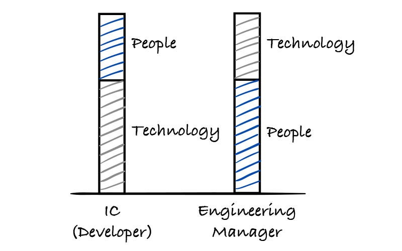
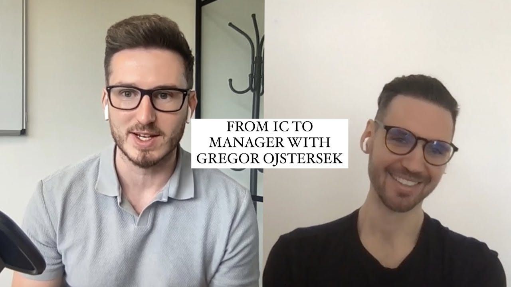
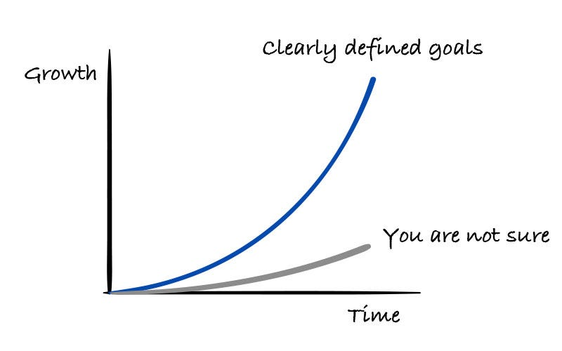
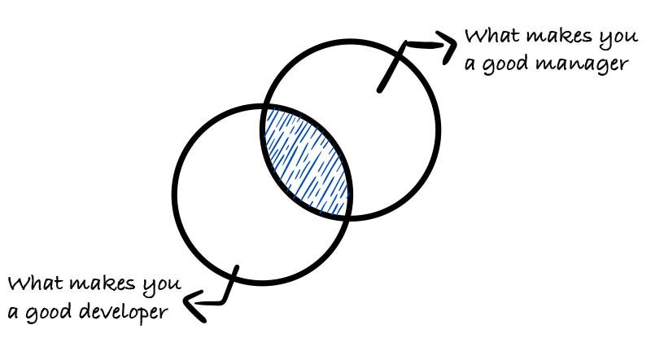

What makes you a good developer, will not necessarily make you a good manager. There are different skill sets needed to excel in one or the other. As you grow more and more as a developer, you need to find challenges for yourself.  

能让你成为一名优秀的开发人员，并不一定能让你成为一名优秀的管理者。二者需要不同的技能组合。随着你作为开发人员的成长，你需要为自己寻找挑战。

Especially when you are a senior for some time. Management is a different skillset that you need to develop and can be a great next step. In this article, I will share my story from IC (individual contributor) to manager.  

特别是当你成为资深开发人员一段时间后。管理是您需要培养的另一种技能，也是您下一步发展的重要方向。在本文中，我将分享我从 IC（个人贡献者）到经理的故事。

I’ve had the pleasure to be chatting with [Chris Blakey](https://www.linkedin.com/in/chrisblakey/) on The Leadership Link podcast about this topic. [You can watch the full episode here.](https://www.youtube.com/watch?v=zmx34u_fcx0)  

我有幸在《领导力链接》播客节目中与克里斯-布莱基（Chris Blakey）聊到了这个话题。您可以在这里观看全集。

This is us, having fun talking about this topic.  

这就是我们，开心地谈论这个话题。

A lot of people may feel daunted when talking about management, thinking that is not for them. But I’ll tell you how I knew that management might be for me.  

谈到管理，很多人可能会感到畏惧，认为那不适合自己。但我会告诉你我是如何知道管理可能适合我的。

I was always good at collaborating and communicating when it came to certain projects or functionalities. I wanted to always make sure we have the correct requirements and that we are building the right things.  

当涉及到某些项目或功能时，我总是善于合作和沟通。我希望始终确保我们的需求是正确的，我们所做的事情是正确的。

> **I wanted to fully understand the needs and find the best solutions that would fit these needs.  
> 
> 我希望充分了解需求，并找到满足这些需求的最佳解决方案。**

I also understood the importance of managing expectations. You can do the best work in the world, but if the expectations are not met correctly, all the effort is wasted. So I wanted to always ensure that this was done correctly.  

我还明白了管理期望值的重要性。你可以做世界上最好的工作，但如果不能正确地满足期望，所有的努力都会白费。因此，我希望始终确保正确地完成这项工作。

And that automatically brought me to the place where I wished to have a bigger impact on the projects and the team. Not only in details but also a lot more say in the direction and the overall team in general.  

这自动把我带到了希望对项目和团队产生更大影响的地方。不仅在细节方面，而且在方向和整个团队方面也有更多的发言权。

Like a lot of developers, I was contemplating a LOT regarding the direction of my career. The questions: “What is going to be that next step for me?” and “Should I go into management, architecture route or should I grow as an IC?” were always on my mind. I believe that my growth was stagnating because I didn’t know that.  

和许多开发人员一样，我也在思考自己的职业方向。这些问题"我的下一步该怎么走？"、"我应该进入管理层、走架构路线，还是作为集成电路开发人员继续发展？"这些问题一直在我的脑海中挥之不去。我相信，我的成长之所以停滞不前，是因为我不知道这一点。

I was always leaning more towards management, because of the reasons listed above. I was always good technically as well, but I was standing out from others because my main focus wasn’t on technical solutions and approaches.  

由于上述原因，我一直更倾向于管理层。我的技术能力也一直很强，但我之所以能从其他人中脱颖而出，是因为我的主要关注点不在技术解决方案和方法上。

After being an IC for some time, I’ve had discussions with my manager at the time that management might be the right path for me, but I wasn’t very convincing. The reason was that I was overthinking for far too long. As I found out later, my manager was surprised I was interested in the Team Lead role and that she thought that I wouldn’t be.  

在做了一段时间的集成电路之后，我曾与当时的经理讨论过，管理可能是适合我的道路，但我并没有很好地说服他。原因是我想得太久了。后来我才知道，我的经理很惊讶我对团队领导的职位感兴趣，她以为我不会感兴趣。

I was in the company for some time and had a track record of successfully delivering multiple projects. The company was going through the restructuring and there were new teams created.  

我在公司工作了一段时间，有成功交付多个项目的记录。当时公司正在进行重组，成立了一些新的团队。

My manager at the time approached me and offered me the Team Lead position, which I accepted. And yes, I didn’t know what I was getting myself into! It was quite a big change for me. let’s get into that next.  

当时我的经理找到我，让我担任组长一职，我接受了。是的，我不知道自己会陷入怎样的境地！这对我来说是一个很大的改变。

I didn’t know a lot about management at that time. I read a couple of books, but that was all. So naturally, I’ve made a lot of mistakes. What brought me to be a successful developer didn’t work for me well as I became a team lead.  

当时我对管理一无所知。我读过几本书，但仅此而已。因此，我自然犯了很多错误。让我成为一名成功的开发人员的方法，在我成为团队领导后并没有很好地发挥作用。

> **I tried to do too much overall.  
> 
> 总的来说，我想做的事情太多了。**

As a developer, I was so used to being in control, so naturally, I wanted to mimic this behavior when I first became a manager.  

作为一名开发人员，我已经习惯了掌控一切，所以当我第一次成为一名经理时，我自然也想模仿这种行为。

I wanted to be in all of the details and even minor things all the time. And also make decisions about everything. This brought that I didn’t delegate enough and I didn’t assign clear ownership and empower others.  

我想参与所有的细节，甚至是所有的小事。而且还事事都要做决定。这导致我没有足够的授权，也没有分配明确的所有权和授权给他人。

I learned that this is not the way to go when I was close to burnout. Working long hours and having so many things on my mind.  

当我接近职业倦怠时，我明白了这不是办法。工作时间长，脑子里想的事情太多。

Based on this experience I knew I needed to make a change. I knew that I needed to delegate more and also empower people to make decisions themselves.  

基于这次经历，我知道我需要做出改变。我知道我需要下放更多的权力，也需要赋予人们自己做决定的权力。

That’s when things started to look a lot better for me.  

就在那时，我的情况开始好转。

As said above, I made a lot of mistakes when first started as a manager, here are the 3 main ones:  

如上所述，我在刚开始担任经理时犯了很多错误，以下是三个主要错误：

1.  **Managing your time is really important  
    
    时间管理非常重要**
    

I’ve found myself in a position where a lot of people needed my help, advice or they would just like to chat about something. It’s hard to say no to these things. I needed to learn to say no to things that I believed were not so important, critical, or even needed.  

我发现自己处于这样一种境地：很多人需要我的帮助、建议，或者他们只是想和我聊聊天。很难拒绝这些事情。我需要学会拒绝那些我认为不那么重要、不那么关键、甚至不那么需要的事情。

As much as it’s important to help as many people as possible, there needs to be a correct balance between meetings and your contribution.  

帮助尽可能多的人固然重要，但在会议和你的贡献之间也需要有一个正确的平衡。

What I learned is that the best way to do this is to dedicate particular blocks to your own focus time and the rest to managerial time.  

我的经验是，做到这一点的最好办法是，将特定的时间段留给自己专注的时间，其余时间留给管理者。

For example, you can block four hours, three days a week for your own focus time. And the rest is managerial time. I suggest to block as many hours as needed.  

例如，你可以每周三天，每天抽出四个小时作为自己的专注时间。其余时间为管理时间。我建议你根据需要来分配时间。

Try to find the right balance for yourself at that particular time.  

试着在特定时间找到适合自己的平衡点。

2.  **You can control what you can control  
    
    你可以控制你能控制的事情**
    

I often felt that there were many things that I would like to change, but I didn’t fully understand that I don’t make all the decisions across the business.  

我经常觉得有很多事情我想改变，但我并不完全明白，我并不能决定整个企业的所有决策。

I can control the changes or responsibilities of my team, but for teams outside of my area, I wasn’t able to make decisions for them.  

我可以控制我的团队的变化或责任，但对于我所在区域以外的团队，我无法为他们做决定。

What I learned is that the best thing you can do is to establish great relationships across the organization and try to provide feedback or suggestions to people who are responsible for a particular part of the business.  

我学到的是，你能做的最好的事情就是在整个组织中建立良好的关系，并尝试向负责特定业务部分的人提供反馈或建议。

3.  **Stay technical, but avoid going into too many details  
    
    保持技术性，但避免涉及过多细节**
    

I wanted to be too much in those fine details, as said above and this brought me close to burning out.  

正如上文所说，我想过多地关注这些细节，这让我几近焦头烂额。

I’ve learned that It’s important to stay technical, no matter if you have a lot of managerial responsibilities. To help the team the most, you need to understand as well as have strong opinions about particular technical decisions or directions.  

我认识到，无论你是否肩负很多管理职责，保持技术性都很重要。为了给团队提供最大帮助，你需要理解特定的技术决策或方向，并对其有强烈的意见。

But don’t go into too many details - rather delegate the details to the team. You need to be involved in important decisions that are crucial for the business, but delegate the small details which are not so important.  

但不要涉及太多细节，而是将细节交给团队。你需要参与对业务至关重要的重要决策，但也要把不太重要的小细节交给别人。

You can get overwhelmed by too much information very quickly if you have too many things on your mind.  

如果你脑子里想的事情太多，很快就会被太多的信息淹没。

I always like to say that investing in yourself and your knowledge is a great investment anytime. I like to read, network with others and go to events (conferences and meetups).  

我总是喜欢说，投资自己和自己的知识，无论何时都是一项伟大的投资。我喜欢阅读、与他人交流并参加各种活动（会议和聚会）。

Here are my top 10 books I recommend for becoming a great engineering manager:  

以下是我推荐的成为优秀工程经理的 10 大书籍：

-   "Inspired: How to Create Products Customers Love” by Marty Cagan  
    
    "灵感：如何创造客户喜爱的产品"，马蒂-卡根著
    
-   "Empowered" by Marty Cagan  
    
    "马蒂-卡根著的《授权
    
-   ”The Lean Product Playbook” by Dan Olsen  
    
    "精益产品手册》，丹-奥尔森著
    
-   "The Lean Startup" by Eric Ries  
    
    "精益创业》，埃里克-里斯著
    
-   "The New New Thing: A Silicon Valley Story" by Michael Lewis  
    
    "迈克尔-刘易斯著《新新事物：硅谷故事
    
-   “The Making of a Manager” by Julie Zhuo  
    
    "朱莉-卓著：《经理人的养成
    
-   "The First 90 Days: Proven Strategies for Getting Up to Speed Faster and Smarter" by Michael D. Watkins  
    
    "前 90 天：迈克尔-D.-沃特金斯（Michael D. Watkins）著《前 90 天：更快、更聪明地提升速度的成熟策略
    
-   "The Lean Manager: A Novel of Lean Transformation" by Andrew and Muhammad Wilkerson  
    
    "精益经理：精益转型小说》，安德鲁和穆罕默德-威尔克森著
    
-   "The Five Dysfunctions of a Team" by Patrick Lencioni  
    
    "帕特里克-伦乔尼（Patrick Lencioni）的《团队的五大功能失调》（The Five Dysfunctions of a Team
    
-   "The Manager's Path: A Guide for Tech Leaders Navigating Growth and Change" by Camille Fournier  
    
    "经理之路：卡米尔-福尼尔（Camille Fournier）著《经理之路：科技领导者成长与变革指南
    

You can find a more detailed overview of all 10 books in this article: [Top 10 books for Engineering Managers](https://newsletter.eng-leadership.com/p/top-10-books-for-engineering-managers) (paid article). Reading 1 book every month is an amazing investment in increasing your knowledge.  

您可以在本文中找到所有 10 本书的详细介绍：工程经理必读的 10 大书籍（付费文章）。每月读一本书是对增长知识的一项了不起的投资。

What has become my main source of knowledge at this time are newsletters and LinkedIn. Newsletters are becoming more and more an amazing source of knowledge. I am subscribed to a lot of them in the Engineering / Engineering Leadership field and I learn a lot from it.  

目前，我的主要知识来源是新闻简报和 LinkedIn。时事通讯越来越成为一种令人惊叹的知识来源。我订阅了很多工程/工程领导领域的新闻通讯，从中学到了很多东西。

I recommend particularly for becoming a better engineering manager:  

我特别推荐大家阅读，以便成为一名更好的工程经理：

-   [The Pragmatic Engineer 务实的工程师](https://newsletter.pragmaticengineer.com/)
    
-   [Refactoring 重构](https://refactoring.fm/)
    
-   [Wes Kao's Newsletter Wes Kao 的通讯](https://newsletter.weskao.com/)
    
-   [Tech World With Milan Newsletter  
    
    科技世界与米兰通讯](https://newsletter.techworld-with-milan.com/)
    
-   [The Hybrid Hacker 混合型黑客](https://hybridhacker.email/)
    
-   [Musings Of A Caring Techie  
    
    一个有爱心的技术人员的感想](https://www.thecaringtechie.com/)
    
-   [Techlead Mentor 技术领导导师](https://newsletter.techleadmentor.com/)
    

And last, but not least. Posting daily on LinkedIn and reading + responding to all of the great comments and posts from great professionals helps me to learn a LOT and expands my perspective on various of different topics.  

最后，但并非最不重要。每天在 LinkedIn 上发帖，阅读并回复所有来自优秀专业人士的精彩评论和帖子，让我学到了很多东西，也拓展了我对各种不同话题的视野。

Looking back, my move to management was the right move to make. It has brought to me so many opportunities and it has shown to be a great path for me.  

回首往事，我向管理层的转变是正确的。它给我带来了很多机会，对我来说是一条伟大的道路。

I’ve grown from Team Lead → Engineering Manager → Head of Engineering → VP of Engineering → CTO.  

我从团队领导 → 工程经理 → 工程主管 → 工程副总裁 → 首席技术官，不断成长。

What path did you choose for yourself? I would love to hear about it here in the comments. You can also reach out to me directly on LinkedIn.  

你为自己选择了哪条道路？欢迎在评论中告诉我。您也可以直接在 LinkedIn 上联系我。

Liked this article? Make sure to 💙 click the like button.  

喜欢这篇文章吗？请务必 💙 点击 "喜欢 "按钮。

Feedback or addition? Make sure to 💬 comment.  

反馈或补充？请务必发表💬评论。

Know someone that would find this helpful? Make sure to 🔁 share this post.  

您知道这篇文章对您有帮助吗？请务必 🔁 分享本帖。

You can find me on [LinkedIn](https://www.linkedin.com/mynetwork/discovery-see-all/?usecase=PEOPLE_FOLLOWS&followMember=gregorojstersek) or [Twitter](https://twitter.com/gregorojstersek).  

您可以在 LinkedIn 或 Twitter 上找到我。

If you wish to make a request on particular topic you would like to read, you can send me an email to info@gregorojstersek.com.  

如果您想就您想阅读的特定主题提出要求，可以给我发电子邮件至 info@gregorojstersek.com。

This newsletter is funded by paid subscriptions from readers like yourself.  

本时事通讯的资金来自于像您这样的读者的付费订阅。

If you aren’t already, consider becoming a paid subscriber to receive the full experience!  

如果您还不是，请考虑成为付费订阅者，以获得完整的阅读体验！

[Check the benefits of the paid plan  

查看付费计划的好处](https://newsletter.eng-leadership.com/about#%C2%A7paid-subscribers-get)

You are more than welcome to find whatever interests you here and try it out in your particular case. Let me know how it went! Topics are normally about leadership, management, all things engineering related, developing scalable products, building teams etc.  

我们非常欢迎你在这里找到你感兴趣的东西，并根据你的具体情况进行尝试。让我知道进展如何！主题通常涉及领导力、管理、所有与工程相关的事物、开发可扩展产品、组建团队等。
