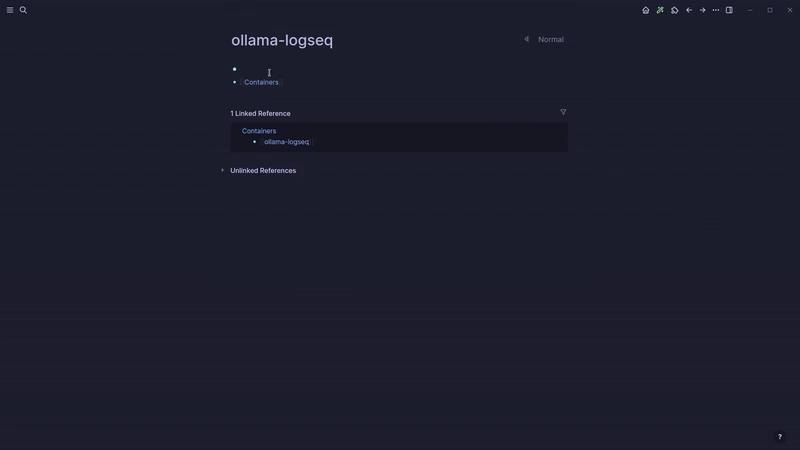
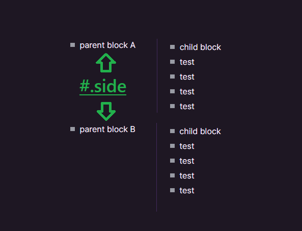

Hi Everyone, 大家好

After a somewhat crazy last few months, I am finally properly back online and slowly getting back to normality, which gives me great pleasure to be able to post on Logseq Times once more. My last post was about 4 months ago, which is a little shameful, but sometimes it is important to get off the merry-go-round that is life before you start missing the trees from the forest.  

在经历了几个月的疯狂之后，我终于重新上线并慢慢恢复正常，这让我非常高兴能够再次在《Logseq Times》上发表文章。我上一次发帖是在大约 4 个月前，这有点可耻，但有时在你开始错过森林中的树木之前，离开生活这个旋转木马是很重要的。

Anyway, log metaphors aside (see what I did there), there has been so much going on in the world of Logseq of late, so why don't we jump right in?  

不管怎么说，抛开原木的比喻（看我做了什么），Logseq 世界最近发生了很多事情，所以我们为什么不直接进入主题呢？

___

### Logseq 0.9.20 Release Logseq 0.9.20 发布

This release includes a couple of useful updates like a new inbuilt Handbook, smartt-merge for this using Logseq Sync, updated Electron app and more. You can download the desktop and Android app [here](https://github.com/logseq/logseq/releases/tag/0.9.10?ref=logseqtimes.com).  

该版本包括一些有用的更新，如新的内置手册、使用 Logseq Sync 进行智能合并、更新 Electron 应用程序等。您可以在此下载桌面版和安卓版应用程序。

**Enhancement 增强**

-   New handbook (click in the app to see it - [info](https://docs.logseq.com/?ref=logseqtimes.com#/page/handbook))  
    
    新手册（在应用程序中点击查看 - 信息）
-   Upgrade electron to v25 将电子设备升级至 v25
-   Make Smart Merge the default option for Logseq Sync  
    
    将智能合并设为日志同步的默认选项
-   Add toggle option for PDF view: auto opening the highlight context menu from new text selection  
    
    为 PDF 视图添加切换选项：从新文本选择自动打开高亮上下文菜单

**Fixed issues 已修复的问题**

-   Support zoom via touchpad  
    
    支持通过触摸板进行缩放
-   Update Spanish, Norwegian and French translation  
    
    更新西班牙语、挪威语和法语翻译
-   Fix #card should only be appended to the title  
    
    修正 #card 只应附加在标题上的问题
-   Fix Android back button closing order  
    
    修复 Android 返回按钮的关闭顺序
-   Fix journal name judgement  
    
    修正期刊名称判断
-   Refine drag and drop of assets. Fix not being about to save assets sometimes  
    
    改进资产的拖放。修复有时无法保存资产的问题
-   On Android, activity restarts when a Bluetooth keyboard gets connected  
    
    在安卓系统上，连接蓝牙键盘后活动会重新启动
-   Shortcuts editor can't edit disabled keymap  
    
    快捷键编辑器无法编辑禁用的键表
-   Refine Logseq Sync login box tips  
    
    完善 Logseq Sync 登录框提示

___

### Logseq Properties Coming Along Nicely  

Logseq 属性进展顺利

A lot of work is going into the upcoming properties and database mode, and it is starting to show. I think this will push better structure and knowledge management in Logseq and I cannot wait to see it live:  

我们在即将推出的属性和数据库模式上做了大量工作，这一点已经开始显现。我认为这将推动 Logseq 更好的结构和知识管理，我迫不及待地想看到它上线：

___

### Properties Best Practice?  

物业最佳实践？

Talking of properties, OP [asks](https://www.reddit.com/r/logseq/comments/17kkwks/best_practice_doublebracket_the_properties_or_not/?ref=logseqtimes.com): "_Best practice - double-bracket the properties or not?_"  

说到属性，OP 问"最佳做法--是否在属性上加双括号？

An interesting response: 一个有趣的回答：

_I think there's no "best practice" for this, since both approaches are valid and have their own benefits.  

我认为这并没有什么 "最佳做法"，因为两种方法都是有效的，各有各的好处。_

_When you don't add the brackets, it is just a string. When you do add brackets, it becomes a link, which will make this block/page appear in the linked references of both its property page, and the linked value page.  

不添加括号时，它只是一个字符串。如果加上括号，它就会变成一个链接，从而使该块/页同时出现在其属性页和链接值页的链接引用中。_

_Personally, I use string-type values as a "fallback" when the value isn't an entity in my graph.  

就我个人而言，当值不是图形中的实体时，我会使用字符串类型的值作为 "备用"。_

_Also, for the tags property specifically, it doesn't matter if it has double square brackets or not, logseq will always understand as link-type values.  

另外，具体到标签属性，无论是否带有双方括号，logseq 都会将其理解为链接类型的值。_

___

### **Bring the power of local LLMs to Logseq with (Ollama-Logseq)  

利用 (Ollama-Logseq) 为 Logseq 带来本地 LLM 的强大功能**

This should probably be in the Plugin Section below, but I thought it was too important to miss.  

这可能应该放在下面的插件部分，但我认为它太重要了，不能错过。

OP [posts](https://www.reddit.com/r/logseq/comments/17prhoo/plugin_to_bring_the_power_of_local_llms_to_logseq/?ref=logseqtimes.com) "I was jealous that Obsidian had a plugin integrating with Ollama, So I decided to make one for Logseq myself. Ollama essentially allows you to play with local LLMs like: LLama 2, Orca Mini, vicuna and many more. Some of these LLMs are performing to levels close to chatGPT3.5 in some tasks and the fact that they are running locally is awesome"  

OP 帖子 "我很嫉妒 Obsidian 有一个整合 Ollama 的插件，所以我决定自己为 Logseq 做一个。Ollama 本质上允许您与本地 LLMs（如 LLama 2、Orca Mini）一起使用：LLama 2、Orca Mini、vicuna 等。在某些任务中，其中一些 LLM 的性能接近 chatGPT3.5，而且它们是在本地运行，这一点非常棒"。

0:07

/0:30



___

### Anti-Zettlekasten?

My good internet buddy [Dario](https://twitter.com/dariods_?ref=logseqtimes.com) recently posted a video on Anti Zettlekasten where he considers building a great Zettelkasten can be a lot of fun, but it can also be a great procrastination tactic. For most writing workflows, all you need is a good system of tags, and to trust the process as you start writing.  

我的好网友达里奥（Dario）最近在 Anti Zettlekasten 上发布了一段视频，他认为制作一个出色的 Zettelkasten 可以带来很多乐趣，但也可能是一种很好的拖延战术。对于大多数写作流程来说，你所需要的只是一个良好的标签系统，以及在开始写作时对流程的信任。

Check out the great video here  

点击此处查看精彩视频

<iframe width="200" height="113" src="https://www.youtube.com/embed/UnMo2tq_UdI?feature=oembed" frameborder="0" allow="accelerometer; autoplay; clipboard-write; encrypted-media; gyroscope; picture-in-picture; web-share" allowfullscreen="" title="Logseq Zettelkasten ANTI-tutorial | You don't ACTUALLY need a zettelkasten"></iframe>

___

### Writing Process? 写作过程？

Sticking with [Dario](https://twitter.com/dariods_?ref=logseqtimes.com), he also posted a video on his writing process, where he uses apps like Tana + Logseq + Obsidian. In this video, he ponders, "_A lot of people will tell you you have to choose one application. I don't think that is the best way to go about things. Each application has different strengths, and in this video I quickly go through my process of writing an article, leveraging the different strengths of the apps._"  

达里奥还发布了一段视频，介绍了他的写作过程，其中他使用了 Tana + Logseq + Obsidian 等应用程序。在这段视频中，他思考道："很多人会告诉你，你必须选择一个应用程序。我认为这不是最好的方法。每个应用程序都有不同的优势，在这段视频中，我快速回顾了我撰写文章的过程，充分利用了应用程序的不同优势。

<iframe width="200" height="113" src="https://www.youtube.com/embed/iZxR7rPdvuQ?feature=oembed" frameborder="0" allow="accelerometer; autoplay; clipboard-write; encrypted-media; gyroscope; picture-in-picture; web-share" allowfullscreen="" title="My writing process | Tana + Logseq + Obsidian"></iframe>

___

### Which way is \*better\* for creating meaningful connections in a general sense  

从一般意义上讲，哪种方式更适合建立有意义的联系

OP asks a very interesting [question](https://www.reddit.com/r/logseq/comments/17ounnx/which_way_is_better_for_creating_meaningful/?ref=logseqtimes.com): let's say I want to write something about a movie in a journal.  

OP 提出了一个非常有趣的问题：假设我想在日记中写一些关于电影的内容。

First way: 第一种方法

```
- I watched [[Movie/ABCD]] today
  - point A
  - point B
```

Second way: 第二种方法

```
- [[Movie]]
  - [[ABCD]]
    - point A
    - point B
```

Third way: 第三种方式：

```
- I watched [[ABCD]] today #Movie
  - point A
  - point B
```

Which way do you prefer? The most popular response seems to be doing:  

你更喜欢哪种方式？最受欢迎的回答似乎是 "做"：

```
Journal
- I watched [[ABCD]] today
[[ABCD]]
- tags:: #movie
- point a
- point b
The page [[movie]] would then list all movies
```

Which way do you prefer?  

你更喜欢哪种方式？

___

### 20 Logseq Features You Didn't Know Existed  

你不知道的 20 项 Logseq 功能

Despite the quick clickbaity title, Alan posted a great video on some of the potentially more obscure Logseq features. Definitely worth checking out it you are just starting using Logseq or are a power user, there is certainly something for everyone.  

尽管标题很快就被点击了，但艾伦还是发布了一段很棒的视频，介绍了一些可能比较晦涩难懂的 Logseq 功能。无论是刚开始使用 Logseq 的用户还是高级用户，都绝对值得一看，每个人都能找到适合自己的东西。

<iframe width="200" height="113" src="https://www.youtube.com/embed/khNI-4r2wW0?feature=oembed" frameborder="0" allow="accelerometer; autoplay; clipboard-write; encrypted-media; gyroscope; picture-in-picture; web-share" allowfullscreen="" title="20 Logseq Features You Didn't Know Existed"></iframe>

___

### Build a Second Brain in Logseq  

在 Logseq 中构建第二个大脑

Gregory at Face Dragons, posted a fantastic article on [using Logseq to build your Second Brain](https://facedragons.com/foss/second-brain-in-logseq/?ref=logseqtimes.com).  

Face Dragons 的格雷戈里发表了一篇关于使用 Logseq 构建 "第二大脑 "的精彩文章。

_There is more second-brain software than ever. You’re so spoilt for choice that you may wonder, “why should I build a second brain in Logseq?” Whether you still need convincing or just want to know how to create a second brain in Logseq, this article is for you.  

第二大脑软件比以往任何时候都多。你可能会问："为什么要在 Logseq 中创建第二大脑？无论你是否还需要说服自己，或者只是想知道如何在 Logseq 中创建第二大脑，这篇文章就是为你准备的。_

_The features that make Logseq a contender from all the second brains apps available are listed below. You’ll also learn how to set up your second brain and which templates, plugins, and practices are best to extend your mind with an effective PKM setup.  

以下列出了 Logseq 在所有第二大脑应用程序中脱颖而出的功能。您还将了解如何设置您的第二大脑，以及哪些模板、插件和实践最适合通过有效的 PKM 设置来扩展您的思维。_

___

### **“Introducing ‘Views’: A Flexible Solution for Graph Organization and Content Separation in Logseq”  

"介绍'视图'：Logseq 中图形组织和内容分离的灵活解决方案"**

A very interesting post on different views in Logseq to allow for better information / knowledge management.  

关于 Logseq 不同视图的一篇非常有趣的文章，以便更好地进行信息/知识管理。

[“Introducing ‘Views’: A Flexible Solution for Graph Organization and Content Separation in Logseq”  

"介绍'视图'：Logseq 中图形组织和内容分离的灵活解决方案"

I propose a feature I will refer to as “Views”. This will solve specific problems that have been discussed in topics on this forum but in a flexible way. See Separate graphs for work and home? - Questions & Help - Logseq for background. Typical user starts off with the typical graph structure and…  

我建议使用 "视图 "功能。这将以灵活的方式解决本论坛主题中讨论过的具体问题。请参阅 "工作和家庭使用不同的图表？- 问题与帮助 - Logseq 了解背景。典型用户一开始使用典型的图表结构和...

Logseqdazinator 眩晕器

](https://discuss.logseq.com/t/introducing-views-a-flexible-solution-for-graph-organization-and-content-separation-in-logseq/22431?ref=logseqtimes.com)

___

### **Using Logseq for the Past Year  

过去一年使用 Logseq**

OP has used Logseq for the past year and this seems to have gone down well. Although the graph looks pretty, I would love to know how Logseq changed / helped / assisted OP in levelling up.  

在过去的一年里，OP 一直在使用 Logseq，而且似乎效果不错。虽然图表看起来很美，但我还是很想知道 Logseq 是如何改变/帮助/协助 OP 提升水平的。

___

### "Ditching" Notion for Logseq for 30 Days  

为 Logseq "抛弃 "Notion 30 天

Mariana Vieira, a long-time Notion user and expert, recently posted a video on "ditching" Notion to use Logseq for a 30-day period.  

Notion 的长期用户和专家 Mariana Vieira 最近发布了一段关于 "抛弃 "Notion 使用 Logseq 30 天的视频。

<iframe width="200" height="113" src="https://www.youtube.com/embed/6qi6ewh3DgU?feature=oembed" frameborder="0" allow="accelerometer; autoplay; clipboard-write; encrypted-media; gyroscope; picture-in-picture; web-share" allowfullscreen="" title="I Ditched Notion for 30 Days and Used This Instead"></iframe>

There is of course quite a large disclaimer necessary, _"I manage my entire business in Notion so of course I wasn’t going to switch business ops to Logseq for the sake of this video; this experiment was basically for my personal note taking and organization and I did learn a lot about how Logseq works._"  

当然，这其中有相当大的免责声明："我用 Notion 管理我的全部业务，所以我当然不会为了这个视频而将业务操作切换到 Logseq；这个实验基本上是为了我个人的笔记记录和组织，我确实学到了很多关于 Logseq 如何工作的知识。

A great video, nonetheless.  

尽管如此，这仍是一段精彩的视频。

___

## Logseq Plugins Logseq 插件

-   [**Full House Templates**](https://github.com/stdword/logseq13-full-house-plugin?ref=logseqtimes.com#readme) 3.2 Big Update! _Fuzzy search_ by name, type, and parent page, Open page with the template by holding «Shift» key, Hide items from list with «.», Restrict to View or Template only, Provide usage hint, Control cursor position or text selection for arguments, Introduced UI for inserting templates & views, Specially designed to be very productive with keyboard  
    
    Full House Templates 3.2 大更新！按名称、类型和父页面进行模糊搜索，按住 "Shift "键打开带有模板的页面，用". "从列表中隐藏项目，只限于视图或模板，提供使用提示，控制光标位置或参数的文本选择，引入插入模板和视图的用户界面，特别设计的键盘操作非常高效
-   [**Show page date plugin**](https://github.com/YU000jp/logseq-plugin-show-page-date?ref=logseqtimes.com) - Display creation and modification dates on pages. (Displays dates of each page to the right of the page name.)  
    
    显示页面日期插件 - 显示页面的创建和修改日期。(在页面名称右侧显示每个页面的日期）。
-   [**Quickly PARA method plugin**](https://github.com/YU000jp/logseq-plugin-quickly-para-method?ref=logseqtimes.com) Updated! Inbox feature(If interrupted, a link can be saved to the inbox page. It is categorized by month.). "namespace query search" feature (Search for pages with the same name or explore related pages without worrying about the hierarchical structure and list them.). The ability to create a new page in the same hierarchy or add a sub page is provided.  
    
    快速 PARA 方法插件更新！收件箱功能（如果中断，可将链接保存到收件箱页面。按月份分类）。"名称空间查询搜索 "功能（搜索同名页面或探索相关页面，而无需考虑层次结构，并将其列出）。提供在同一层次结构中创建新页面或添加子页面的功能。
-   [**File Linker**](https://github.com/sethyuan/logseq-plugin-linker?ref=logseqtimes.com). It can dynamically replace a link's path. It allows you to store big files (like video) outside of Logseq.  
    
    文件链接器。它可以动态替换链接路径。它允许你在 Logseq 之外存储大文件（如视频）。

0:00

/1:23


-   [**Tabbed Sidebar**](https://github.com/sethyuan/logseq-plugin-tabbed-sidebar/blob/master/README.en.md?ref=logseqtimes.com) update: Moved tabs are now remembered and restored as necessary. With this feature implemented, layouts like this now can be persisted.  
    
    标签式侧边栏更新：移动过的标签现在会被记住，并在必要时恢复。有了这项功能，像这样的布局现在就可以持久保存了。
-   [**Side Block plugin**](https://github.com/YU000jp/logseq-plugin-side-block?ref=logseqtimes.com) **-** Places bullet blocks on the left and right. If tag parent blocks, its descendant blocks are placed next to it. Normally, it can be applied as custom CSS, but we have made it a plugin to make it easier to use.  
    
    侧块插件 - 在左右两侧放置子弹块。如果是标签父块，则其子块会放在旁边。通常情况下，它可以作为自定义 CSS 应用，但我们将其作为一个插件，使其更易于使用。



## **Until Next Time 下次再见**

I hope you found this blog post helpful. If you have any comments or questions, please let me know.  

希望这篇博文对您有所帮助。如果您有任何意见或问题，请告诉我。

Thanks again for reading.  

再次感谢您的阅读。
