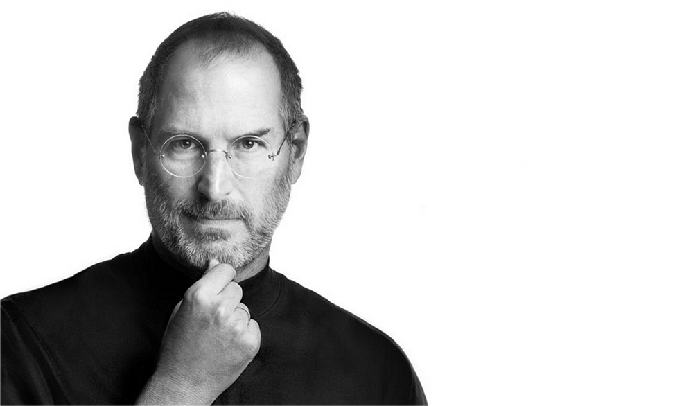

Steve Jobs — (wallsdesk.com)  

史蒂夫-乔布斯 - (wallsdesk.com)

## “Your eyes can only see and your ears can only hear what your brain is looking for.” — Dan Sullivan  

"你的眼睛只能看到 你的耳朵只能听到 你的大脑正在寻找的东西"- 丹-沙利文

18 min read

Nov 3 11 月 3 日

Your brain is a phenomenal tool.  

你的大脑是一个神奇的工具。

Your brain will find whatever it is that you are looking for.  

你的大脑会找到你要找的任何东西。

If you use your brain to chase impossible goals, you will attract the right methods and the right people to accomplish those goals.  

如果你用大脑去追逐不可能实现的目标，你就会吸引正确的方法和正确的人来完成这些目标。

You can transform yourself through your brain. You can give yourself skills, languages, and abilities, that are completely unfathomable to your current self, with your brain.  

你可以通过大脑改变自己。你可以用大脑赋予自己目前的自己完全无法理解的技能、语言和能力。

You can also get trapped in very slow and counterproductive rhythms with your brain.  

你也可以用大脑陷入非常缓慢、适得其反的节奏中。

How you use your brain is up to you.  

如何使用大脑取决于你自己。

You have greater capability and autonomy to build your own habits than ever before in the world we live in today, and yet most people are living a life of distraction.  

在我们今天生活的世界里，你比以往任何时候都更有能力和自主权来培养自己的习惯，然而大多数人却过着心不在焉的生活。

**Most people’s habits are _literally destroying their brains._  

大多数人的习惯简直就是在摧毁他们的大脑。**

With these destructive habits, you won’t be able to progress.  

有了这些破坏性的习惯，你将无法取得进步。

In this article, I will help you become aware of the 7 toxic and destructive habits that are destroying your brain. I’ll then give you the tools you need to train your brain how to get the results you want.  

在本文中，我将帮助你认识到正在摧毁你大脑的 7 种有毒的破坏性习惯。然后，我将为你提供训练大脑所需的工具，让你获得想要的结果。

> Really quick: there are actually 3 ways to enjoy this article:  
> 
> 真快：欣赏这篇文章其实有三种方式：
> 
> 1\. Watch this YouTube video:  
> 
> 1.观看 YouTube 视频：

Psychologist Reveals The 7 Habits Destroying Your Brain — Video Training  

心理学家揭示破坏大脑的 7 种习惯 - 视频培训

> 2\. Listen to [this](https://open.spotify.com/episode/2qCUeUVvU6OHRxMFszg6Bz?si=CZs4h9hySjGcXPDssXv09Q) episode of the Dr. Benjamin Hardy Show (available on any podcast streaming service)  
> 
> 2.收听本杰明-哈代博士节目的这一集（可在任何播客流媒体服务上收听）
> 
> 3\. Continue reading this article (includes bonus content not available anywhere else)  
> 
> 3.继续阅读本文（包括其他地方没有的奖励内容）

## 1\. Starting Your Day Too Slow  

1.一天的开始太慢

> “If we start right, it is easy to go right all the time; but if we start wrong, we may go wrong, and it will be a hard matter to get right.” — Joseph Smith, Jr.  
> 
> "如果我们的出发点是正确的，就很容易一直走正确的道路；但如果我们的出发点是错误的，我们就可能会走错路，而且要走正确的道路将是一件很难的事情"。- 小约瑟夫-史密斯

The first toxic and destructive habit destroying your brain is **starting too slow.**  

破坏大脑的第一个有毒和破坏性习惯就是起步太慢。

Most people train their brains to be slow.  

大多数人的大脑都被训练得很迟钝。

Think about your brain in the beginning of your day.  

在一天开始时，想想你的大脑。

How long does it take you to get out of bed in the morning?  

你早上起床需要多长时间？

What do you do first once you’re up?  

起床后首先做什么？

What do you think about?  

你怎么看？

What do you read? 你读什么书？

What do you watch? 你看什么节目？

What do you eat? 你吃什么？

What do you look for?  

你在寻找什么？

There’s a large probability that your morning is keeping you stuck. Your brain can’t be in flow when you’ve conditioned it to be slow.  

你的早晨很有可能让你停滞不前。当你的大脑已经习惯于缓慢运转时，它就无法保持畅通。

Most people are slow to start anything. Because our society is trained and wired for consumption, most people spend their morning consuming things on their phone. Because of this, they never get into a “FLOW” state during their day. Most people are so trapped in consumption they’re dependent upon it just to get going in the morning.  

大多数人做任何事情都很慢。因为我们的社会被训练成消费型社会，大多数人一上午都在玩手机。正因为如此，他们在一天中从未进入 "FLOW "状态。大多数人都被消费所困，依赖于消费才能在早晨开始工作。

Do you wake up starting your brain FAST? Or do you wake up consuming junk that then (literally) scatters your brain?  

一觉醒来，你的大脑就开始快速运转了吗？还是一觉醒来就吃垃圾，然后（从字面上）让你的大脑散架？

Consuming junk in the morning puts your brain into a state of over-analysis. Over-analysis is crippling. Think about how many different ideas and bits of information you can find within 5 minutes on Instagram. Starting your day like this will leave your brain confused and scattered. You will be trapped in a state of over-analysis for the rest of the day.  

早上吃垃圾食品会让大脑进入过度分析状态。过度分析会导致大脑瘫痪。想想看，在 Instagram 上，5 分钟内你能找到多少不同的想法和信息。这样开始一天的工作会让你的大脑混乱而分散。在接下来的一天里，你都将被困在过度分析的状态中。

Involving yourself in too many things before you start your real work cripples your success and creates unnecessary distractions. Being distracted makes you busy. Being busy makes your brain slow.  

在开始真正的工作之前，让自己卷入过多的事情会削弱你的成功，并造成不必要的分心。分心会让你变得忙碌。忙碌会让你的大脑变得迟钝。

Rather than being busy, it’s far more powerful to have clarity about the #1 task, and then spend your energy in the morning doing _that_ thing.  

与其忙忙碌碌，不如明确自己的首要任务，然后在早晨把精力花在这件事上，这样会更有力量。

If you train your brain fast, get into a flow state, and do really important work, you can produce results at an astonishing rate.  

如果你能快速训练大脑，进入流动状态，做一些真正重要的工作，你就能以惊人的速度取得成果。

Do you want to train your brain to be fast, in a flow state? Here’s how:  

你想训练你的大脑快速进入流动状态吗？方法如下

-   Wake up 醒来
-   Get out of bed 下床
-   Make your bed 整理床铺
-   Get hydrated 补充水分
-   Move on to your #1 task AS QUICKLY AS POSSIBLE  
    
    尽可能快地转向你的头号任务

When I say your #1 task, I mean **important work that can change your life.** Train your brain that you are capable of doing that task first. Because you are!  

当我说你的首要任务时，我指的是能改变你生活的重要工作。训练你的大脑，让它相信你有能力首先完成这项任务。因为你确实有能力！

As an example, for me, it’s writing my books.  

举个例子，对我来说，就是写书。

I wrote several books while I was still a PhD student and having 5 kids (now 6). This is because I woke up, did the first thing first in the morning, and then was primed to go fast all day. I was producing rather than consuming.  

我还在读博士、有 5 个孩子（现在有 6 个）的时候就写了好几本书。这是因为我早上起床后，首先做的第一件事就是快速阅读。我是在生产，而不是在消费。

Start working on your #1 task first thing in the morning, and your brain will build its way to genius.  

每天早上第一件事就是着手处理你的头号任务，这样你的大脑就会逐渐成长为天才。

By following this process, you’ll start getting wins FAST in the morning. You’ll intentionally prime your brain to look for more ways to succeed and WIN that day. Your brain will be filtered to your goals and focused on doing, rather than consuming. You’ll train your brain to wake up along with your body, so that you can create massive progress. You will accomplish so much more, because you are going fast first, before anything else.  

按照这个流程，你就能在早上快速取得胜利。你会有意识地让大脑寻找更多成功的方法，赢得当天的胜利。你的大脑会过滤你的目标，专注于做事，而不是消耗。你将训练大脑与身体一起苏醒，从而取得巨大进步。你会取得更大的成就，因为你会先快后慢。

You’ll begin moving in the RIGHT direction as soon as you wake up.  

一觉醒来，你就会朝着正确的方向前进。

If you get this piece right, you can accomplish more halfway through morning than most people do in a week because their brains are so slow.  

如果这一块做得好，你能在上午的一半时间里完成比大多数人一周还多的事情，因为他们的大脑太迟钝了。

## 2\. Consuming Too Much 2.消耗过多

> “Efforts to deepen your focus will struggle if you don’t simultaneously wean your mind from a dependence on distraction.” — [Cal Newport](https://www.amazon.com/Deep-Work-Focused-Success-Distracted/dp/1455586692)  
> 
> "如果不同时摆脱对分心的依赖，加深专注的努力就会举步维艰"。卡尔-纽波特

The world has never had more information. Most of that information is like candy to your brain.  

世界上从未有过如此多的信息。大部分信息对你的大脑来说就像糖果。

Most information is training your brain to have really low standards for yourself.  

大多数信息都在训练你的大脑，让你对自己的要求变得非常低。

Most information is training your brain to seek entertainment, not education.  

大多数信息都在训练你的大脑寻求娱乐，而不是教育。

Most people consume WAY too much information, and still believe they need more. This is the mental equivalent of an obese person who thinks they’re hungry all the time. Most people want more and more stimulation and consumption, despite already having too much.  

大多数人消耗了太多的信息，却仍然认为自己需要更多的信息。这就好比一个肥胖的人认为自己一直都很饿一样。大多数人希望得到越来越多的刺激和消费，尽管他们已经拥有太多。

Continuing with the obesity analogy, most information is really low-quality. Most people don’t have a healthy information diet. Most people are after the low-hanging fruit, the “fast food” of information — easy to access and just as easily destructive to your mental focus. High-consumption, high-artificial information diets produce mediocre brain capacity at best.  

继续用肥胖做比喻，大多数信息的质量确实很低。大多数人没有健康的信息饮食。大多数人追求的是低垂的果实，是信息的 "快餐"--容易获取，也同样容易破坏你的精神集中。高消耗、高人造的信息饮食最多只能产生平庸的大脑能力。

Most people’s inputs are entertainment-based. Because your input shapes your outlook, most people have a far lower-quality view of the world than what it could be.  

大多数人的输入都是娱乐性的。因为你的输入塑造了你的视野，所以大多数人对世界的看法远不如想象中的高质量。

> “Your input determines your outlook."你的投入决定你的前景。 Your outlook determines your output, and your output determines your future.” — Zig Ziglar  
> 
> 你的前景决定你的产出，你的产出决定你的未来"。- 齐格-齐格勒

Most people are suffering from what psychologists call a low-level [default future](https://onlinelibrary.wiley.com/doi/full/10.1002/wps.20553) where they don’t have a big vision or high expectations for their life.  

大多数人都患有心理学家所说的低水平默认未来症，他们对自己的生活没有远大理想或过高期望。

Most people are consuming information, food, and even people and experiences that have created a low-level worldview and identity for themselves.  

大多数人消费的信息、食物，甚至是人和经历，都为自己创造了低层次的世界观和身份认同。

Low-level becomes the standard for your brain when that’s what you feed it on a repetitive, daily basis.  

当你每天重复给大脑灌输低水平的信息时，低水平就成了大脑的标准。

Your brain is a prediction machine. It will take what you give it.  

你的大脑是一台预测机器。你给它什么，它就会接受什么。

Your identity will perform with what it has to work with — what you give it. You cannot outperform your identity.  

你的身份会根据它的工作情况--也就是你给它的工作情况--来发挥作用。你无法超越你的身份。

Because most people are overly consumed with information, situations, and people, with really low standards, their brains are expecting more of those very things.  

因为大多数人都过度关注信息、环境和人，标准非常低，他们的大脑期待更多的正是这些东西。

To optimize your brain, consume less, and consume higher-quality information.  

要优化你的大脑，就要减少消耗，消耗更高质量的信息。

The 80–20, or Pareto principle, is true in all components of life.  

80-20 原则，即帕累托原则，适用于生活的方方面面。 80% of your results come from 20% of the things you do.  

你 80% 的成果来自于你所做的 20% 的事情。

80% of the information you consume right now is literally holding you back from becoming your future self.  

你现在所获取的信息中，有 80% 都在阻碍你成为未来的自己。

80% of the information you consume is lowering your vision of your future self.  

你所消费的信息中有 80% 都在降低你对未来自我的憧憬。

Part of training your brain to become effective, phenomenal, and powerful, is to have clear filters and standards for what you say “yes” and “no” to.  

要训练你的大脑变得高效、惊人和强大，其中一部分就是要对你说 "是 "和 "不 "的事情有明确的筛选和标准。

Just as you want to train your brain to be fast and not slow, you want to train your brain to seek after quality and not quantity of information.  

就像你要训练你的大脑快而不慢一样，你要训练你的大脑追求信息的质量而不是数量。

Whatever you let in signals to yourself that that it belongs within your filter.  

无论你让什么东西进来，都是在向自己发出信号：它属于你的过滤器。

If you say “yes” to junk media, that shows your standard.  

如果你对垃圾媒体说 "是"，那就表明你的标准。

It you say “yes” to wasting your time, that shows your standard.  

如果你对浪费时间说 "是"，这就表明你的标准。

What you say yes to is the future that your brain is both predicting and creating.  

你所说的 "是"，就是你的大脑所预测和创造的未来。

Your identity is that which you are most committed to. You can know what you are committed to most by your results, not by what you say you’re committed to.  

你的身份就是你最坚定的信念。你可以通过你的结果，而不是你说的承诺，来了解你最承诺的是什么。

Your current weight, your current income, and your current relationships are all things you are currently committed to. They are things you have accepted and said “yes” to in your life.  

你当前的体重、当前的收入和当前的人际关系都是你当前承诺的事情。它们是你已经接受并在生活中说 "是 "的事情。

The 80% of what you learn to being saying “no” to, will leverage and multiply your new, higher standard.  

你学会说 "不 "的那 80%的东西，会让你的新的更高标准发挥杠杆作用并成倍增长。

Consume less, and you’ll have a much higher quality filter and standard for what you are willing to consume. You’ll raise the standard, and thus speed up your brain.  

少吃一点，你就会对自己愿意吃的东西有一个更高质量的过滤和标准。你会提高标准，从而加快大脑的运转。

## 3\. Doing Too Much 3.做得太多

> If you have more than three priorities, then you don’t have any.” — Jim Collins  
> 
> 如果你有三个以上的优先事项，那么你就没有任何优先事项"。- 吉姆-柯林斯

If you’re trying to accomplish more than three things in a given day, you’re focused on shallow and busy work, not deep and productive work.  

如果你想在一天内完成三件以上的事情，那你就只专注于肤浅而忙碌的工作，而不是深入而富有成效的工作。

Every time you switch tasks, you take your brain out of flow-state.  

每次切换任务，都会让大脑脱离流动状态。 Switching tasks shatters your focus and wastes previous energy. Most people are used to task switching. They don’t know how to go deep in ONE thing at a time, because they’re not used to going for something big. Most people are task switching with their brain like a computer that has 50 tabs open.  

切换任务会分散你的注意力，浪费之前的精力。大多数人习惯于切换任务。他们不知道如何一次深入做一件事，因为他们不习惯去做一件大事。大多数人在切换任务时，大脑就像一台打开了 50 个标签页的电脑。

If you want to accomplish REALLY big things, learn how to focus and go deep in concentration on ONE THING for 3–4 hours at a time. Most people will not do this.  

如果你想完成真正的大事，就要学会如何集中精力，每次在一件事情上专注3-4个小时。大多数人做不到这一点。

As an example, when I film videos for my YouTube channel and podcast, I spend all day focused on just that ONE THING. I film video after video. I focus on just that one thing, rather than constantly switching tasks between many different things.  

举个例子，当我为我的 YouTube 频道和播客拍摄视频时，我整天都只专注于一件事。我拍摄一个又一个视频。我只专注于这一件事，而不是不停地在许多不同的事情之间切换任务。

This is called batching. When you batch, your brain doesn’t have to spend mental energy switching between tasks. You save incredible energy by going deep in one area at a time.  

这就是所谓的批处理。当你进行分批处理时，你的大脑就不必花费脑力在不同任务之间切换。一次深入一个领域，可以节省惊人的精力。

This state is deep work, or deliberate practice.  

这种状态就是深度工作，也就是刻意练习。

The Jim Collins rule of having _no more_ than 3 priorities applies not just to your life, but also to your month, to your week, and to each day.  

吉姆-柯林斯提出的 "优先事项不超过 3 个 "的规则不仅适用于你的生活，也适用于你的一个月、一周和每一天。

When you have a thousand different things happening in one day, you’re not really focused on going deep in the few things that really matter.  

当你在一天内有上千件不同的事情发生时，你就不会真正集中精力去深入研究真正重要的几件事情。

The only way to vault obstacles and go really deep in your life is to go really, really deep.  

要想跨越障碍，真正深入生活，唯一的办法就是真正地、真正地深入。

This means doing way less in terms of numbers of activities, goals, and priorities, but doing way more in the things you are accomplishing and developing mastery in.  

这意味着在活动、目标和优先事项的数量上要少很多，但在完成和掌握的事情上要多很多。

Most people are not clear about or connected with their future self. They don’t have a future self that’s massive and exciting, which keeps them trapped in the surface-level.  

大多数人都不清楚未来的自己，也没有与未来的自己建立联系。他们没有一个庞大而令人兴奋的未来自我，这让他们一直被困在表层。

> “By our nature as rational, conscious creatures, we cannot help but think of the future. But most people, out of fear, limit their view of the future to a narrow range. Thoughts of tomorrow, a few weeks ahead, perhaps a vague plan for the months to come.  
> 
> "作为理性、有意识的生物，我们的天性就是不由自主地思考未来。但是，出于恐惧，大多数人把对未来的看法局限在狭小的范围内。想到明天，想到未来的几个星期，也许是对未来几个月的一个模糊计划。
> 
> We are generally dealing with so many immediate battles that it is hard for us to lift our gaze above the moment. It is a law of power, however, that the further and deeper we contemplate the future, the greater our capacity to shape it to our desires.” — Robert Greene  
> 
> 一般来说，我们都要面对许多眼前的琐事，很难将目光从眼前移开。然而，我们对未来的思考越远、越深入，我们就越有能力按照自己的愿望塑造未来，这是一种力量法则"。- 罗伯特-格林

The more deeply and further out that you contemplate your future, the clearer you will get on your future self.  

你对未来的思考越深入、越长远，你对未来的自己就会越清晰。

The more work you do that’s actually important to your future self, the more you put your future self into a phenomenally different position.  

你做的对未来的自己越重要的工作，你就越能把未来的自己置于一个截然不同的位置。

You can’t put yourself into a different position if you’re grinding away at the daily minutiae, caught up in the busy and urgent but non-important.  

如果你每天都在琐碎的事情上磨磨蹭蹭，沉浸在忙碌、紧迫但不重要的事情中，你就无法将自己置于不同的位置。

## 4\. Having No Vision Or A 2x Vision  

4.没有远见或远见不足

> “The trouble with not having a goal is that you can spend your life running up and down the field and never score.” — [Bill Copeland](https://www.quotemaster.org/not+having+a+goal#&gid=1&pid=6)  
> 
> "没有目标的麻烦在于，你可以一辈子在球场上跑上跑下，却永远无法进球"。- 比尔-科普兰

Most people don’t have clear goals. They don’t have a clear vision for their future self, and they don’t know where they are going.  

大多数人都没有明确的目标。他们对未来的自己没有清晰的愿景，不知道自己要去哪里。

If you don’t know where you are going, it doesn’t matter how you get there.  

如果你不知道自己要去哪里，那么如何到达那里并不重要。

Most people’s vision of their future self is basically getting to the next paycheck or getting to the next weekend. They don’t have clarity on who their future self is, and they _certainly_ don’t have a massive and compelling future self.  

大多数人对未来自我的憧憬，基本上都是为了下一份薪水或下一个周末。他们不清楚未来的自己是谁，当然也没有一个庞大而引人注目的未来的自己。

They don’t have what entrepreneur and founder of XPrize Peter Diamandis would call a Massive Transformative Purpose, or MTP.  

他们没有企业家、XPrize 创始人彼得-迪亚曼迪斯（Peter Diamandis）所说的 "巨大变革目标"（MTP）。

> “Your Massive Transformative Purpose (MTP) is a clear statement that guides, empowers, and inspires you. It helps you decide what to do, and more importantly what not to do. It’s both your fuel and your filter.” — [Peter Diamandis](https://www.diamandis.com/mtp)  
> 
> "你的巨大变革目标（MTP）是一份清晰的声明，它指引着你，赋予你力量，激励着你。它帮助你决定做什么，更重要的是决定不做什么。它既是你的燃料，也是你的过滤器"。彼得-迪亚曼迪斯

In 10x Is Easier Than 2x, Dan Sullivan and I explain the difference between a 10x vision and a 2x vision. With a 2x vision of your life, you’re using an extrapolation of your current situation to continue your future. It is a continuation, not a transformation. With a 10x vision, you have to change everything.  

在《10 倍比 2 倍容易》一书中，丹-沙利文和我解释了 10 倍愿景和 2 倍愿景之间的区别。如果你的人生愿景是 2 倍，那么你就会利用对当前状况的推断来延续你的未来。这是一种延续，而不是转变。有了 10 倍愿景，你就必须改变一切。

> “10x is the equivalent of going from crawling to walking; from not knowing the alphabet to reading; from living in your parent’s basement to living on your own; from being awkward and shy to a bold and emotionally-intelligent leader. 10x is tantamount to going from horse and buggy to a car. You may be in the same genre — such as transportation — but you’re not comparing apples to apples. A non-linear change has taken place. It’s fundamentally a qualitative shift, more than a quantitative one. The transformation occurs by operating from a seemingly impossible and imagined future, and takes you in a non-linearly and radically different direction and approach than what you (and everyone else) have been doing to this point.” — Excerpt from 10x Is Easier Than 2x  
> 
> "10倍相当于从爬行到行走；从不认识字母表到阅读；从住在父母的地下室到独自生活；从笨拙、害羞到大胆、情商高的领导者。10倍相当于从马车到汽车。你们可能属于同一类型--比如交通工具--但你们并没有把苹果和苹果进行比较。非线性变化已经发生。从根本上说，这是一种质的转变，而不是量的转变。这种转变发生在一个看似不可能的、想象中的未来，它将你带向一个非线性的、与你（和其他人）迄今为止所做的完全不同的方向和方法。- 摘自《10 倍比 2 倍容易

Unfortunately, most people have a 2x vision, even though this is psychologically destructive. In psychology this is actually known as the “default” future. There’s a lot of research showing that because people have a 2x vision, they underestimate who their future self will be. Most 18-year-olds don’t think they’re going to transform that much, despite most older people being in a _dramatically_ different situation than when they were 18. Because of the “end of history illusion” [made popular by Dr. Daniel Gilbert](https://www.ted.com/talks/dan_gilbert_the_psychology_of_your_future_self), most people think who they’ve always been is who they’re always going to be.  

不幸的是，大多数人都有一个 2x 愿景，尽管这在心理上具有破坏性。在心理学中，这实际上被称为 "默认 "未来。大量研究表明，由于人们的愿景是 2 倍，所以他们低估了未来的自己。大多数 18 岁的人都不认为自己会有多大的转变，尽管大多数老年人的境况与 18 岁时大不相同。由于丹尼尔-吉尔伯特博士流行的 "历史终结幻觉"，大多数人认为他们一直是谁，他们就会一直是谁。

Most people have a fragile identity. They’re not learning and transforming.  

大多数人的身份都很脆弱。他们没有学习和转变。

To upgrade your brain, you need to have a SEEMINGLY IMPOSSIBLE future self. Decide who you will become (remember, no more than 3 priorities).  

要升级你的大脑，你需要有一个看似不可能的未来的自己。决定你将成为什么样的人（记住，不要超过 3 个优先事项）。

You want this to be so high that it feels impossible to get there. When your future self is aligned with a 10x vision, your brain is forced to start operating at a faster and higher level. Your brain will be attracted to the right people, resources, places, and opportunities to dramatically advance towards your future self, and it will start working at a deeper and higher level. Your brain will start saying “NO” to things your previous self was dependent upon.  

你希望这个目标如此之高，以至于感觉不可能达到。当你的未来自我与 10 倍愿景保持一致时，你的大脑就会被迫开始以更快更高的速度运转。你的大脑会被正确的人、资源、地点和机会所吸引，向着未来的自己大幅迈进，并开始在更深、更高的层次上工作。你的大脑将开始对以前的自己所依赖的事物说 "不"。

A 2x vision doesn’t require your brain to transform. This means your neural connections and pathways under 2x will largely remain the same, blocking your brain from growth. If your brain is not being required to create new connections towards new things, your brain is atrophying.  

2 倍视野不要求你的大脑发生转变。这意味着，在 2 倍视野下，你的神经连接和通路将基本保持不变，从而阻碍你的大脑成长。如果你的大脑不需要为新事物建立新的连接，那么你的大脑就会萎缩。

You want a 10x and seemingly impossible future, requiring you to let go of 80% of your current life.  

你想要一个十倍于现在、看似不可能实现的未来，这需要你放弃目前生活的 80%。

10x is such a high bar and filter that only the best 20% of what you are doing right now really matters.  

10 倍是一个很高的标准和过滤器，只有你现在所做的最好的 20% 才是真正重要的。

Find that 20% and go really deep. This is how you will get 10 times better at what you do.  

找到那 20%，并真正深入下去。这样，你才能在工作中取得十倍的进步。

You can get infinitely better, and your brain can become substantially faster, but it will require letting go of what got you here. You are not your past self. The only reason you’re holding onto most of your life right now is out of security and habit. Psychologically, we like things to be predictable and have assurance.  

你可以变得无限好，你的大脑可以变得更快，但这需要放下让你走到这一步的东西。你不是过去的自己。你现在之所以还在坚持你的大部分生活，只是出于安全感和习惯。从心理学角度讲，我们喜欢可预测的、有保障的事物。

Your 80% is your security blanket.  

你的 80% 是你的安全毯。

In fact, in psychology there’s a name for this called “prospect theory,” which asserts that people would rather have a smaller reward with certainty rather than a larger reward with uncertainty.  

事实上，心理学上有一种说法叫 "前景理论"，它认为人们宁愿得到确定性较小的回报，也不愿得到不确定性较大的回报。

> “People tend to **overweigh options that are certain, and are risk averse for gains**. We would rather get an assured, lesser win than take the chance at winning more (but also risk possibly getting nothing). The opposite is true when dealing with certain losses: people engage in risk-seeking behavior to avoid a bigger loss.” — [Aurora Harley](https://www.nngroup.com/articles/prospect-theory/)  
> 
> "人们倾向于过分看重确定性的选择，而对于收益则厌恶风险。我们宁可获得有把握的、较小的胜利，也不愿冒险赢得更多的胜利（但也有可能一无所获）。在面对某些损失时，情况则恰恰相反：人们会采取寻求风险的行为，以避免更大的损失。- 奥罗拉-哈雷

Most people create their vision from what they “need,” not what they want.  

大多数人都是根据自己的 "需要"，而不是自己想要的来创造自己的愿景。

The challenge most people have as soon as they start becoming successful is that they’re no longer operating out of need, and they don’t know how to create a vision of what they want, because all they’ve ever done up until that point was from the perspective of need.  

大多数人一开始取得成功就会遇到的挑战是，他们不再是出于需要而工作，他们不知道如何创造自己想要的愿景，因为在此之前，他们所做的一切都是从需要的角度出发的。

80% of the distractions in your life are held onto out of emotional security and out of habit.  

你生活中 80% 的杂念都是出于情感安全和习惯。

Habits are actually destructive for your brain. Habits are the opposite of deliberate practice.  

习惯实际上是对大脑的破坏。习惯与刻意练习恰恰相反。

Deliberate practice is the art of having clear goals, and going through a training process that transforms yourself and your abilities around and towards those goals.  

刻意练习是一门艺术，它有明确的目标，并通过训练过程，围绕和实现这些目标来改变自己和自己的能力。

[The author of Atomic Habits, James Clear, actually clarified that he could have written a book on deliberate practice where he talks about habits, but instead he wrote a book on habits where he talks about deliberate practice.  

原子习惯》一书的作者詹姆斯-克里尔实际上澄清说，他本可以写一本关于刻意练习的书，在书中谈谈习惯，但他却写了一本关于习惯的书，在书中谈谈刻意练习。](https://youtu.be/IbLK62zSTeY?si=ZfwwKLHmn3-Vb-Az&t=3301)

Because habits is a far more marketable and attractive subject, habits is the subject of the book title, but true deliberate practice is about getting 1% better each day whereas habits will get you 0% better each day.  

因为 "习惯 "是一个更有市场、更有吸引力的主题，所以 "习惯 "才是书名的主题，但真正的刻意练习是让你每天进步 1%，而 "习惯 "会让你每天进步 0%。

The purpose of deliberate practice is to stop habitual rhythms and get _better_ instead.  

刻意练习的目的是停止习惯性的节奏，转而变得更好。

Deliberate practice is the pathway to fulfillment of your 10x vision. Impossible goals will you to stop operating from the habits of your past self.  

刻意练习是实现 10 倍愿景的途径。不可能实现的目标会让你不再按照过去的习惯行事。

Stop operating from the assumptions of your past self, and start finding new and unique pathways. Find the people and pathways to get where you’re trying to go.  

停止按照过去的假设行事，开始寻找新的、独特的途径。找到你想去的地方的人和路径。

You can choose the vision you’re looking for. You can choose the standard.  

你可以选择你所追求的愿景。你可以选择标准。

Most people have not trained their brains for imagination. Imagination is a skill. Because most people aren’t training their brains for it, they have actually lost the skill of imagination.  

大多数人的大脑都没有经过想象力的训练。想象力是一种技能。由于大多数人没有对大脑进行想象力训练，他们实际上已经失去了想象力这项技能。

Journaling is a beautiful tool to help you fix this.  

写日记是一个很好的工具，可以帮助你解决这个问题。

learning how to train your brain to get what you want is a skill.  

学习如何训练你的大脑以获得你想要的东西是一种技能。

Getting emotionally connected to your future self is a skill. Getting to a place of commitment and knowing is a skill.  

与未来的自己建立情感联系是一种技能。达成承诺和认知是一种技能。

> “Faith knows it has already received and acts accordingly.” — Florence Shinn  
> 
> "信仰知道自己已经得到，并据此行事"。- 弗洛伦斯-申

Training your brain towards goals that seem impossible is a skill.  

训练你的大脑实现看似不可能的目标是一种技能。

Go for impossible goals every 90 days. Every 90 days you can transform your life. You can train your brain and your team to start filtering for opportunities to change your life.  

每 90 天去实现不可能实现的目标。每隔 90 天，你就能改变自己的生活。你可以训练自己的大脑和团队，开始筛选改变生活的机会。

Your brain will transform based on what you give it.  

你的大脑会根据你给予它的东西进行改造。

## 5\. Failing To Rest 5.不休息

> “Rest and recovery are critical for an athlete’s physiological and psychological well-being” — Dr. Karin VanBaak  
> 
> "休息和恢复对运动员的生理和心理健康至关重要"--Karin VanBaak 博士

When I was in my PhD program, my wife and I adopted 3 foster kids.  

在我读博士期间，我和妻子收养了 3 个寄养孩子。 When we first got them, we were _shocked_ at how much sleep they needed.刚有它们的时候，我们对它们的睡眠需求量之大感到震惊。 They needed 10–11 hours of sleep every night.  

他们每晚需要睡 10-11 个小时。

If you study any high performer, rest and recovery are essential to their routine. Because their work is so deep, they need to spend time unplugging and resting.  

如果你研究过任何一位高效能人士，休息和恢复对他们的日常工作至关重要。因为他们的工作非常深入，他们需要花时间放松和休息。

If you want to transform your brain, give it deep recovery.  

如果你想改变你的大脑，那就给它深度恢复。

Forms of active recovery that are fun, beautiful, enjoyable, and playful will stimulate your brain into learning faster and performing much better when you are at work.  

有趣、优美、愉悦、好玩的积极恢复形式会刺激你的大脑，让你在工作时学习得更快，表现得更好。

Most people have not trained their brains to be either fully on or off. They’re semi-present at work and never fully recovering.  

大多数人的大脑都没有经过训练，要么完全处于开启状态，要么完全处于关闭状态。他们处于半工作状态，从未完全恢复。

You want to train your brain to be fully on when you’re working, and fully off when you’re not. This will also impact the quality of your sleep.  

你要训练你的大脑，让它在你工作的时候全开，不工作的时候全关。这也会影响你的睡眠质量。

If you want really, really good focus, and really, really good sleep, put your phone on airplane mode at night. Completely unplug and go all-in on your rest and your recovery. To start transforming your brain, you’ll have to get your sleep to an optimal level.  

如果你想真正、真正地集中注意力，真正、真正地睡个好觉，那就在晚上把手机调到飞行模式。完全拔掉电源，全心全意地休息和恢复。要开始改变你的大脑，你就必须让你的睡眠达到最佳水平。

Also, find hobbies outside of work. Be immersed in them. Have playful, fun, really enjoyable hobbies outside of work that you get passionate and excited about.  

此外，还要找到工作之外的爱好。沉浸其中。在工作之余，要有好玩的、有趣的、真正令人愉快的爱好，让自己对这些爱好充满热情和兴奋。

Recovery leads to deep transformation, novelty, and joy.  

恢复会带来深刻的转变、新奇和快乐。

Recovery leads to a life of immersion, not a life at the surface.  

康复带来的是沉浸式的生活，而不是浮于表面的生活。

## 6\. Not Taking Time To Reflect  

6.不花时间反思

> “Reflection is one of the most underused yet powerful tools for success.” — Richard Carlson  
> 
> "反思是最不常用但却最强大的成功工具之一"。- 理查德-卡尔森

Most people don’t take time to reflect where they’re at.  

大多数人都不会花时间反思自己的现状。

Reflecting where you’re at is an essential component of deep and deliberate practice.  

反思自己的现状是深思熟虑练习的重要组成部分。

Review your last week. Review your last month. What GAINS did you make?  

回顾上周。回顾上个月。你有哪些收获？

Observe, track, and report the things that are helping your brain move and go faster. According to Pearson’s law, what is measured and reported improves exponentially.  

观察、跟踪并报告有助于你的大脑快速运转的事情。根据皮尔逊定律，经过测量和报告的东西会呈指数级增长。

Take the last month and actually reflect and review on what you truly accomplished.  

利用最后一个月的时间，切实反思和回顾一下自己真正完成了哪些工作。

Take some time to look at the digital well-being section of your phone and of your social media apps.  

花点时间看看手机和社交媒体应用程序中的 "数字健康 "部分。

How much time did you spend scrolling on your phone? How much time did you spend honestly reflecting and reviewing? How much did you actually accomplish?  

你花了多少时间在手机上滚动？你花了多少时间诚实地反思和回顾？你实际完成了多少工作？

Chances are you’ve accomplished some things this month that are really important that you didn’t even realize you accomplished.  

你很可能在这个月完成了一些非常重要的事情，而你自己都没有意识到。

Your time to reflect and review is deeply important. Your brain is a reconstruction machine. Your memories are not stored on a retrieval basis. Your memory actually reconstructs in light of the present context each time you remember and reflect on it. This is how you can proactively master your past and allow your future to dictate your present, by proactively shaping these experiences through review and reflection.  

反思和回顾的时间非常重要。你的大脑是一台重建机器。你的记忆不是在检索的基础上存储的。每当你回忆和反思时，你的记忆实际上是根据当前的背景进行重建的。这就是你如何通过回顾和反思积极主动地塑造这些经历，从而主动掌握你的过去，让你的未来决定你的现在。

In [_Can’t Hurt Me_](https://www.amazon.com/Cant-Hurt-Me-Master-Clean/dp/1544507852)_,_ David Goggins teaches how to adopt the military practice of filing an After Action Report, or ARR, to review and proactively re-frame your personal experiences.  

在《不能伤害我》一书中，大卫-戈金斯教导大家如何采用提交 "行动后报告"（或 ARR）的军事实践来回顾并主动重新构建个人经历。

> “Break out that journal…log off the digital version and write them out long-hand. I want you to feel this process because you are about to file your own belated, After Action Reports. First off, write out all the good things, everything that went well, from your failures. Be detailed and generous with yourself. A lot of good things will have happened. It’s rarely all bad. Then note how you handled your failure. Did it affect your life and your relationships. How so?” — _David Goggins_  
> 
> "拿出那本日记......注销电子版，然后长手写出来。我希望你们能感受这个过程，因为你们即将提交自己迟来的 "事后报告"。首先，从失败中写出所有好的方面，一切顺利的地方。写得详细些，对自己宽容些。会有很多好事发生。很少会全是坏事。然后记下你是如何处理失败的。它是否影响了你的生活和人际关系？如何影响？- 大卫-戈金斯

He actually _does_ what he teaches here when he falls short multiple times in beating the world record for most pull-ups done in 24 hours. He chose to re-frame these ‘failures’ as learning opportunities, which he then leveraged to successfully break the record later on.  

当他多次未能打破 24 小时内引体向上次数最多的世界纪录时，他确实做到了他在这里所教导的。他选择将这些 "失败 "重新定格为学习机会，然后利用这些机会成功地打破了记录。

Your memories are not stored in objective entities. They are always a living part of who we are in the present.  

你的记忆并非储存在客观实体中。它们始终是我们当下的一部分。

Your past is a reconstruction.  

你的过去是一种重建。

Memory is a reconstruction.  

记忆是一种重建。

Memory can just as creative as your vision, when you are planning for your future.  

在规划未来时，记忆和愿景一样具有创造性。

When you reflect and review your progress regularly, your past turns into something VERY useful.  

当你定期反思和回顾自己的进步时，你的过去就会变成非常有用的东西。

Even trauma can be useful to you if you are reflecting in the right way.如果反思的方式正确，即使是创伤也会对你有用。 Psychologically, this is known as post-traumatic growth.  

这在心理学上被称为 "创伤后成长"。

Just like David Goggins’ pull-up experience, _every circumstance can become a gain_ for you if you choose to learn something from it and choose to imbue value in the experience.  

就像大卫-戈金斯的引体向上经历一样，只要你选择从中学到东西，选择在经历中赋予价值，每一种情况都可能成为你的收获。

## 7\. Not Engaging in Physical Activity  

7.不参加体育活动

> “\[Aerobic exercise\] lights a fire on every level of your brain, from stoking up the neurons’ metabolic furnaces to forging the very structures that transmit information from one synapse to the next.” — John J. Ratey and Eric Hagerman, from Spark: The Revolutionary New Science of Exercise and the Brain  
> 
> "\[有氧运动\]点燃了大脑各个层面的火种，从点燃神经元的新陈代谢炉，到锻造从一个突触到下一个突触传递信息的结构"。- 约翰-J.-拉蒂和埃里克-哈格曼，摘自《火花：运动与大脑的革命性新科学

Cardio and weightlifting are so good for your brain. You want to train your body and your brain at the same time.  

有氧运动和举重对大脑非常有益。你要同时锻炼身体和大脑。

When you train your brain before mental work, your brain has a lot of endorphins running through it and your brain will be firing a lot faster.  

当你在脑力劳动前训练大脑时，你的大脑会有大量的内啡肽在其中运行，你的大脑会更快地启动。

To get into peak mental shape, get into peak physical shape.  

要想达到最佳精神状态，就要达到最佳身体状态。

If you want a brain that can solve amazing problems, fire neurons really fast, make new connections, and be super creative — you need to train up your body.  

如果你想拥有一个能解决惊人问题、快速启动神经元、建立新联系并具有超强创造力的大脑，你就需要训练你的身体。

Get into peak physical shape, whatever that means for you.  

保持最佳身体状态，无论这对你意味着什么。

This may mean getting a health coach. I have a health coach.  

这可能意味着要找个健康教练。我有一个健康教练。

Eat better nutrition. Put whole foods into your body. Get your nutrition dialed in. Get blood tests and actually make adjustments.  

摄入更好的营养。给身体补充全营养食品。调整营养。进行血液检测并做出实际调整。

You have to get your body running at a high level to support your brain. Weed out synthetic junk food and train your fitness to the highest level.  

你必须让你的身体以高水平运转，以支持你的大脑。剔除合成垃圾食品，将体能训练提高到最高水平。

You can get your fitness to incredible levels. You can get into much more of an elite physical shape than you may think.  

你可以将体能提升到令人难以置信的水平。你可以获得比你想象中更多的精英体能。

Getting your body to an amazing level is SO GOOD for your brain. Develop performance routines that enable this.  

让你的身体达到惊人的水平，对你的大脑大有裨益。制定能够实现这一点的表现程序。

Above all, remember why you are doing this.  

最重要的是，记住你为什么要这么做。

> “…I don’t think you can do \[the\] five or six hours of working out a day — if you don’t have a clear goal or know why you’re doing it. If you just hang out at the gym and train for five or six hours a day without a goal, \[doing that is\] almost impossible.” — [**Arnold Schwarzenegger**](https://www.azquotes.com/author/13187-Arnold_Schwarzenegger)  
> 
> "......我不认为你能做到每天锻炼五六个小时--如果你没有明确的目标，或者不知道为什么要这么做。如果你只是在健身房闲逛，每天训练五六个小时而没有目标，\[这样做\]几乎是不可能的。- 阿诺德-施瓦辛格

Getting your fitness, strength, and stamina to a very high level will transfer over to having deep flow and focus in your mental work.  

将你的体能、力量和耐力提升到一个非常高的水平，就能让你的脑力劳动更加流畅和专注。

## Conclusion 结论

You can transform your body and your brain into peak physical levels and achieve the impossible.  

你可以将自己的身体和大脑转变到巅峰体能水平，实现不可能实现的目标。

Your brain wants to filter for things that you’re not seeing.  

你的大脑会过滤你看不到的东西。

Your brain wants to start finding gold coins instead of the bronze coins that you’ve been chasing.  

你的大脑希望开始寻找金币，而不是一直追逐的铜币。

Your brain wants to develop unique skills, abilities, and connections, today.  

今天，你的大脑想要发展独特的技能、能力和联系。

Your brain will produce the results that you are the most committed to.  

你的大脑会产生你最投入的结果。
