Logseq is my new go-to note-taking tool. I have used many note-taking apps, including Obsidian. Both are identical, but some options make them king of their universe.  

Logseq 是我新的常用笔记工具。我用过很多笔记软件，包括 Obsidian。这两款软件的功能完全相同，但有些选项让它们成为了 "宇宙之王"。

Which is the best now, and which one should you choose? This is our ultimate Logseq vs. Obsidian article.  

现在哪个最好，你应该选择哪个？这是我们的 Logseq 与 Obsidian 终极对比文章。

## Difference on the front 正面的差异

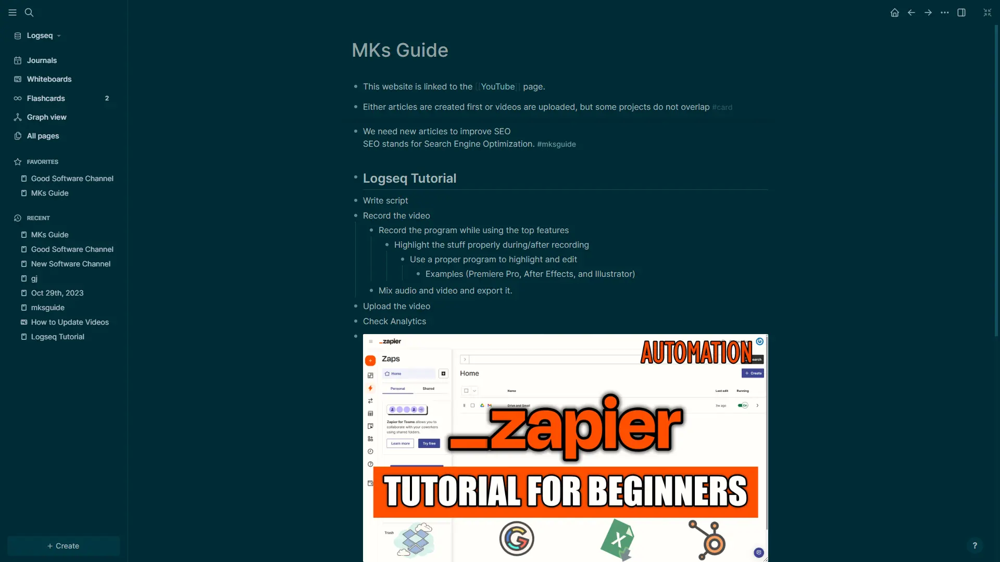

Logseq Interface Logseq 界面

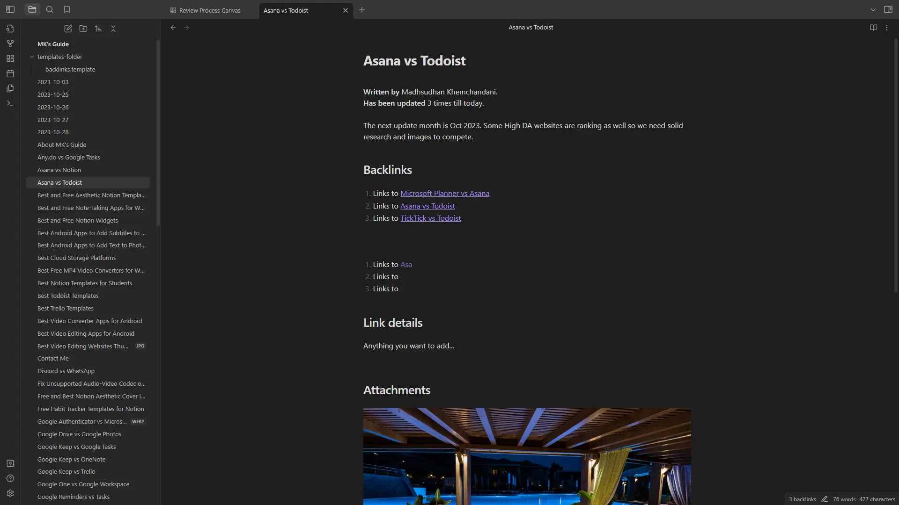

Obsidian Interface 黑曜石界面

Interface of both programs  

两个程序的界面

Both are offline, note-taking, and knowledge graph apps available on desktops and mobile phones.  

两者都是离线、笔记和知识图谱应用程序，可在台式机和手机上使用。

Logseq is unavailable on Google Play Store, but the [latest release](https://logseq.com/downloads) can be downloaded from the website.  

Logseq 无法在 Google Play 商店下载，但可以从网站下载最新版本。

Both support **Markdown language** syntax, meaning that using the special keys, we can add headings, lists, and text formatting.  

这两款应用都支持 Markdown 语言语法，也就是说，我们可以使用特殊按键添加标题、列表和文本格式。

One difference I see is that Obsidian is **text-based**, and Logseq is **block-based**.  

我看到的一个区别是，Obsidian 是基于文本的，而 Logseq 是基于块的。

That means that each new paragraph is a new block. Hence, [we see a bullet point](https://www.mksguide.com/wp-content/uploads/2023/11/Blocks-and-Sub-Blocks-in-Logseq.webp) on each line. I have talked more [about this below](https://www.mksguide.com/logseq-vs-obsidian/?ref=logseqtimes.com#logseq-block-hierarchy).  

也就是说，每一个新的段落都是一个新的块。因此，我们可以在每一行看到一个要点。下面我将详细介绍这一点。

This is missing from Obsidian as the program focuses on the text rather than blocks.  

由于 Obsidian 程序关注的是文本而不是区块，所以 Obsidian 缺少了这一点。

## Note editing tools 笔记编辑工具

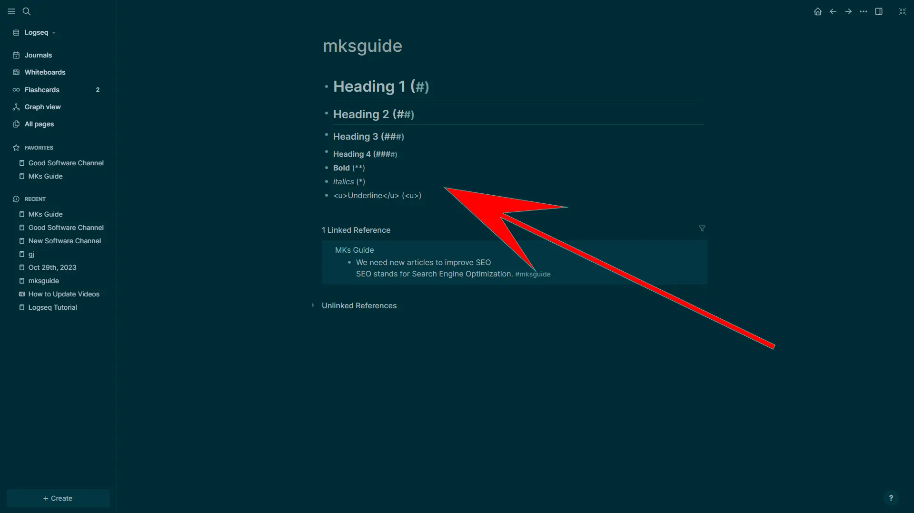

Markdown Syntax in Logseq  

Logseq 中的 Markdown 语法

As I mentioned, both are Markdown language-supporting apps. Neither has any visible text formatting tools.  

如前所述，这两款应用程序都支持 Markdown 语言。两者都没有任何可见的文本格式工具。

Instead, we use Markdown. You can read more on the [official page](https://www.markdownguide.org/basic-syntax/), but some examples of include:  

相反，我们使用 Markdown。你可以在官方页面上了解更多信息，但其中的一些例子包括

-   \*\*Text\*\* is for bolding text.  
    
    \*\*Text\*\* 用于加粗文字。
-   \*Text\* is for italicizing text.  
    
    \*文本\*用于斜体文本。
-   \# is for heading 1. The total “#” represents the heading level. So, for heading 2, we will use “##.”  
    
    \# 代表标题 1。总的 "#"代表标题级别。因此，对于标题 2，我们将使用 "##"。

Markdown is a universal language supported in many programs, and a page from one program can be exported to another without any issues.  

Markdown 是一种通用语言，许多程序都支持，一个程序中的页面可以顺利导出到另一个程序中。

## Daily journaling 每日日记

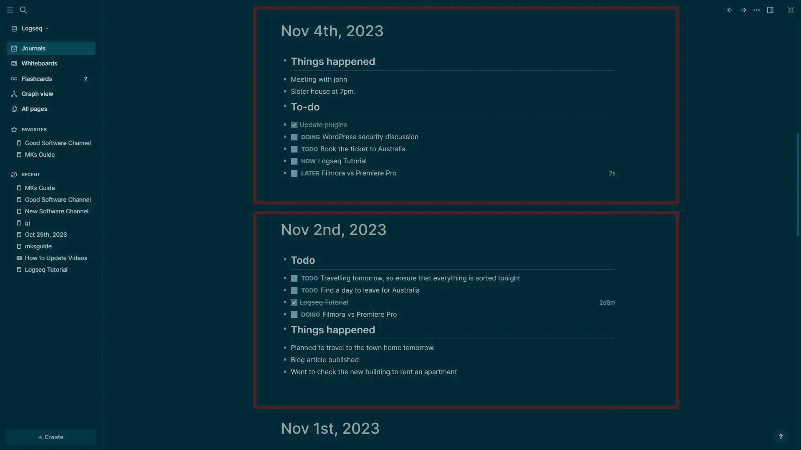

Daily Journals in Logseq  

Logseq 中的每日日志

Both have daily journaling options, but Logseq is **better at handling journals**. It puts each day as a section on the same page.  

两者都有每日日志选项，但 Logseq 更擅长处理日志。它将每天作为一个部分放在同一页面上。

Also, when you open the program, this page opens with the present day on the top.  

此外，当你打开程序时，页面顶部会显示当前日期。

Obsidian has a button to create a new page for the current day, but as you add more, the navigation becomes cluttered with pages.  

Obsidian 有一个按钮可以为当天创建新页面，但当你添加更多页面时，导航就会变得杂乱无章。

## TODO

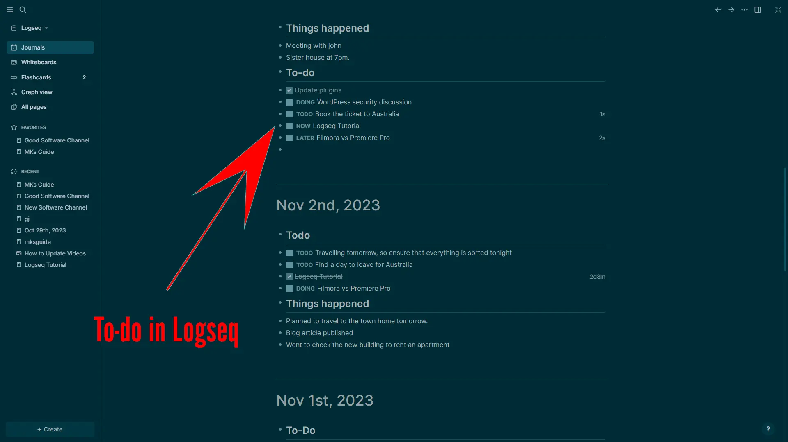

To-do in Logseq Logseq 的待办事项

Both are Markdown apps supporting **clickable checkmarks** to add tasks. However, slight differences make Logseq better at managing tasks.  

两者都是 Markdown 应用程序，都支持点击复选标记来添加任务。不过，两者略有不同，Logseq 在管理任务方面更胜一筹。

First, let’s see how both work. We use **“- \[ \]”** in Obsidian to add a checkbox, but because it is a block-based app, this doesn’t work.  

首先，让我们看看两者是如何工作的。我们在 Obsidian 中使用"- \[ \]"来添加复选框，但由于它是一个基于块的应用程序，所以这个方法不起作用。

Instead, we use the **keywords**. To add a checkbox, we type “TODO” in the beginning and add text after a space. This makes Logseq better because “TODO” is not the only keyword.  

相反，我们可以使用关键字。要添加复选框，我们在开头输入 "TODO"，然后在空格后添加文本。这让 Logseq 变得更好，因为 "TODO "并不是唯一的关键字。

We can type “DOING” for longer tasks. This will add the checkmark and place this task in a separate section. Other keywords are “NOW” and “LATER.”  

对于较长的任务，我们可以输入 "DOING"。这会添加复选标记，并将该任务置于单独的部分。其他关键字还有 "现在 "和 "稍后"。

TODO in Logseq works great in Daily Journals because we create daily tasks, and if a task takes longer, you can move it to the next day by using the “DOING” and “LATER” keywords.  

Logseq 中的 TODO 在每日日志中非常有效，因为我们创建的是每日任务，如果某项任务耗时较长，可以使用 "正在 "和 "稍后 "关键字将其移到第二天。

**Did you know:** Check out my guide on [creating tasks and reminders in Obsidian](https://www.mksguide.com/obsidian-add-tasks-and-reminders/).  

你知道吗？查看我的黑曜石任务和提醒创建指南。

## Logseq vs. Obsidian: Graph view  

Logseq 与 Obsidian：图表视图

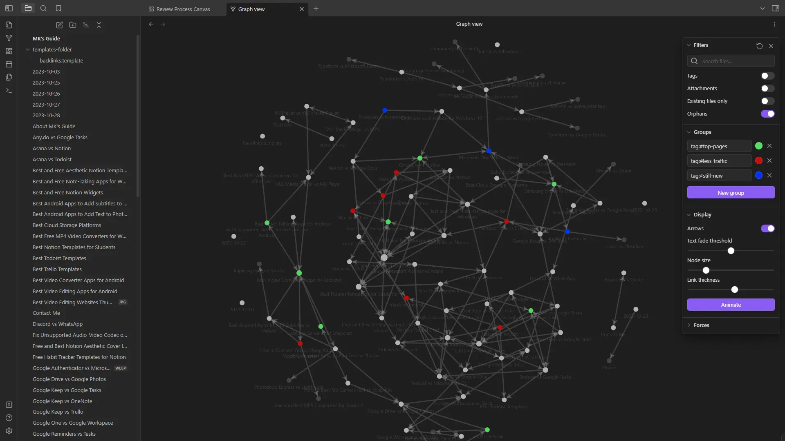

Obsidian Graph View 黑曜石图表视图

Like other features, we see a similar graph view. However, Obsidian has a **better graph view** because it offers multiple customization options.  

与其他功能一样，我们也能看到类似的图表视图。不过，Obsidian 的图表视图更好，因为它提供了多种自定义选项。

Even the interface and usage in Obsidian is better. We can filter data to present it according to our ways, enable arrows, and change the node size.  

甚至连 Obsidian 的界面和使用方式都更胜一筹。我们可以按照自己的方式过滤数据、启用箭头和更改节点大小。

This gives us **complete control** over how to present the graph. For example, we can change the color of important nodes by grouping them.  

这让我们可以完全控制图表的呈现方式。例如，我们可以通过分组来改变重要节点的颜色。

Another feature is **animating the graph**. Although not applicable everywhere, it can help see how the project evolved.  

另一项功能是图形动画。虽然并不适用于所有地方，但它可以帮助我们了解项目是如何发展的。

## Plugins 插件

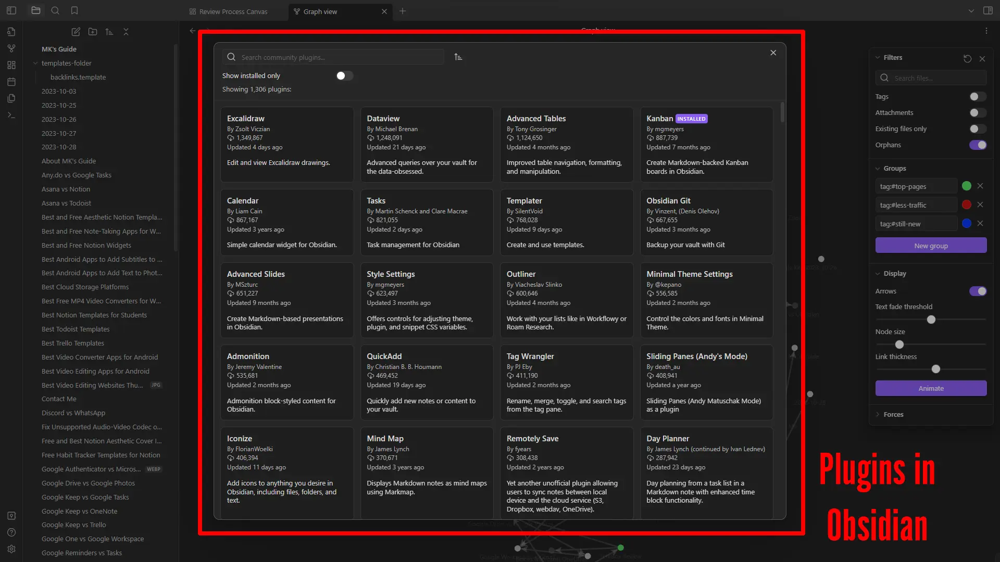

Plugins in Obsidian 黑曜石中的插件

Another great thing about Obsidian is the total number of plugins. We find over **1,200 community-created plugins** to improve its features.  

黑曜石的另一大亮点是插件数量之多。我们发现有超过 1200 个由社区创建的插件来改进其功能。

Many of those plugins have been praised for their functionality. A few of the examples include:  

其中许多插件的功能都受到了好评。其中一些例子包括

-   The **Dataview plugin** has over **1.2 million downloads** and will enable the database features.  
    
    Dataview 插件的下载量已超过 120 万次，并将启用数据库功能。
-   The **ExcelDraw plugin** has over **1.3 million downloads** and is used to show and edit Exceldraw drawings.  
    
    ExcelDraw 插件的下载次数已超过 130 万次，可用于显示和编辑 Exceldraw 图纸。
-   The **Calendar plugin** has over **8 hundred thousand** downloads and is used for creating calendars.  
    
    日历插件的下载量已超过 80 万次，用于创建日历。

Logseq also has plugins, but **around 300**. The number is not close, but it has more app integrations than Obsidian.  

Logseq 也有插件，但大约有 300 个。这个数字并不接近，但它比 Obsidian 集成了更多的应用程序。

For example, we have a calendar plugin in Obsidian but a “Calendar Plugin” plugin in Logseq that integrates with Google, Outlook, and iCloud calendars.  

例如，我们在 Obsidian 中有一个日历插件，但在 Logseq 中有一个 "日历插件 "插件，可与 Google、Outlook 和 iCloud 日历集成。

**Did you know:** I have listed the [top Obsidian plugins](https://www.mksguide.com/obsidian-use-cases-and-examples/). You will love it.  

你知道吗？我列出了 Obsidian 的顶级插件。您一定会喜欢。

## Templates 模板

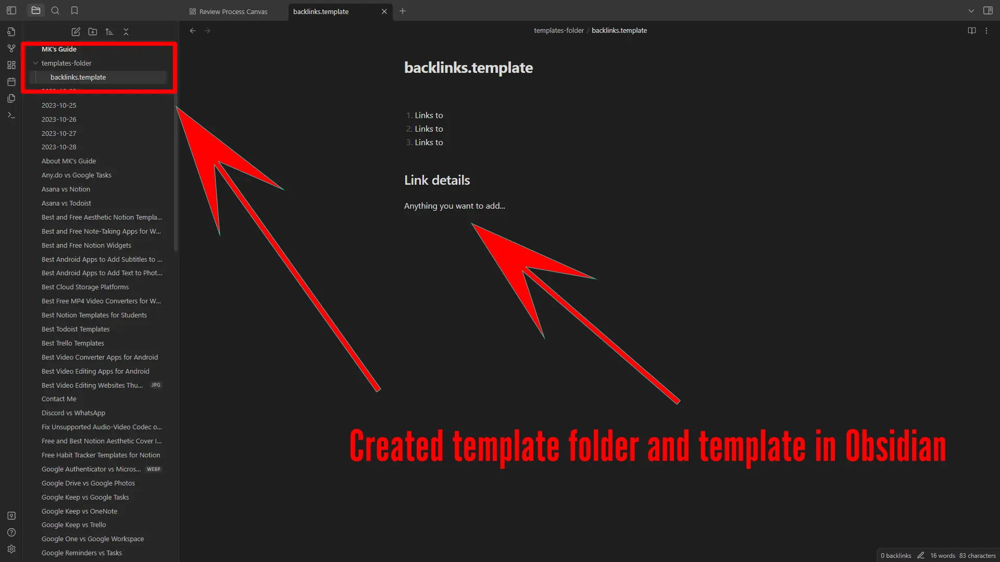

Created template folder and template in Obsidian  

在 Obsidian 中创建模板文件夹和模板

Unlike some other apps, neither have community-created templates. But that does not stop users from creating and using templates.  

与其他一些应用程序不同的是，它们都没有社区创建的模板。但这并不妨碍用户创建和使用模板。

**Both support creating templates** to use in the project. I find it easier to create templates in Logseq, but using the created templates in Obsidian is easier.  

两者都支持创建模板，以便在项目中使用。我发现在 Logseq 中创建模板更容易，但在 Obsidian 中使用已创建的模板也更容易。

## Syncing between devices 设备间同步

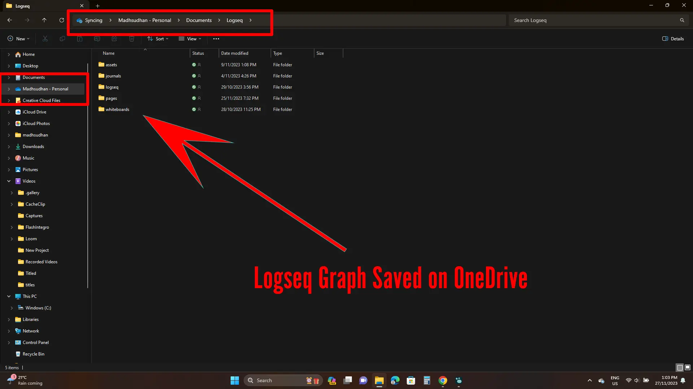

Logseq Graph Saved on OneDrive  

保存在 OneDrive 上的 Logseq 图形

This is one of the difficult topics of the Logseq vs. Obsidian battle because both are offline. However, there are always ways to sync across devices. Check my guide to [sync Obsidian across devices](https://www.mksguide.com/how-to-sync-obsidian-notes/).  

这是 Logseq 与 Obsidian 之争的难点之一，因为两者都是离线操作。不过，总有办法实现跨设备同步。请查看我的黑曜石跨设备同步指南。

One is the good old **flash drive** method. Both programs ask for the project location, so you can choose a folder in a USB or a local folder and copy files to the flash drive or the **external hard** drive later.  

一种是古老的闪存盘方法。两个程序都会询问项目位置，因此你可以选择 USB 文件夹或本地文件夹，然后将文件复制到闪存盘或外置硬盘。

Projects can be easily opened on other computers.  

项目可以很容易地在其他电脑上打开。

The other method I like most is **online syncing**, and both support that as well.  

我最喜欢的另一种方法是在线同步，这两种方法也都支持。

We have OneDrive and Dropbox services to enable **folder functionality** in desktop computers and save files in those folders. After syncing, we can open those files on other devices.  

我们有 OneDrive 和 Dropbox 服务，可以在台式电脑上启用文件夹功能，并在这些文件夹中保存文件。同步后，我们可以在其他设备上打开这些文件。

## Boards 执行局

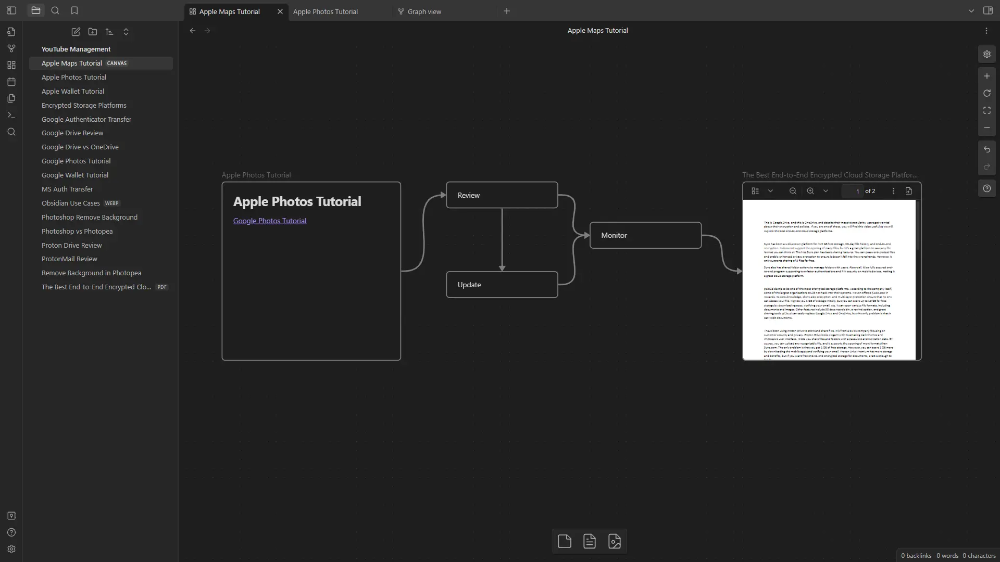

Obsidian Canvas 黑曜石帆布

**Logseq Whiteboard** and **Obsidian Canvas** are two important features. However, I want to confess that Obsidian Canvas is better.  

Logseq Whiteboard 和 Obsidian Canvas 是两个重要的功能。不过，我想承认，Obsidian Canvas 更胜一筹。

Both features are to visualize projects on an endless canvas. We add text, rectangles, images, and notes to explain projects.  

这两个功能都是为了在无尽的画布上将项目可视化。我们添加文字、矩形、图片和注释来解释项目。

Obsidian **supports more options**, while Logseq has a drawing option to draw to annotate and explain.  

Obsidian 支持更多选项，而 Logseq 则有一个绘图选项，可以通过绘图来注释和解释。

**Did you know:** Both are on my [best note-taking tools](https://www.mksguide.com/best-note-taking-apps-windows/) list. Check it out if interested.  

你知道吗？这两款工具都在我的最佳笔记工具列表中。有兴趣的话，可以看看。

## Supporting the developers  

支持开发人员

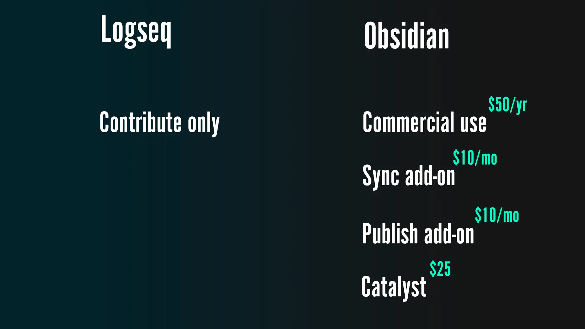

Logseq and Obsidian Pricing and Plans  

Logseq 和 Obsidian 定价和计划

Both are free, but companies need support to continue the development, and both have offered a few ways.  

这两款软件都是免费的，但公司需要支持才能继续开发。

Obsidian has a commercial plan costing **$50 per year**. In this plan, we can use the app for commercial purposes.  

Obsidian 有一个每年 50 美元的商业计划。在该计划中，我们可以将应用程序用于商业目的。

The program also has a **Sync add-on** costing **$10 per month**, offering end-to-end cloud sync across devices.  

该计划还提供每月 10 美元的同步插件，可在设备间实现端到端的云同步。

Another **add-on is Publish**, which costs the same amount, allowing us to publish notes to the web.  

另一个附加功能是 "发布"，费用相同，允许我们将笔记发布到网络上。

If you just want to help with the development, you can pay a **$25 one-time fee** to the developer and support them.  

如果你只想帮助开发，可以向开发者支付 25 美元的一次性费用，为他们提供支持。

Logseq has no premium plans, but the donation opportunities are always open.  

Logseq 没有高级计划，但捐赠机会始终开放。

## Additional features 附加功能

**Tag difference 标签差异**

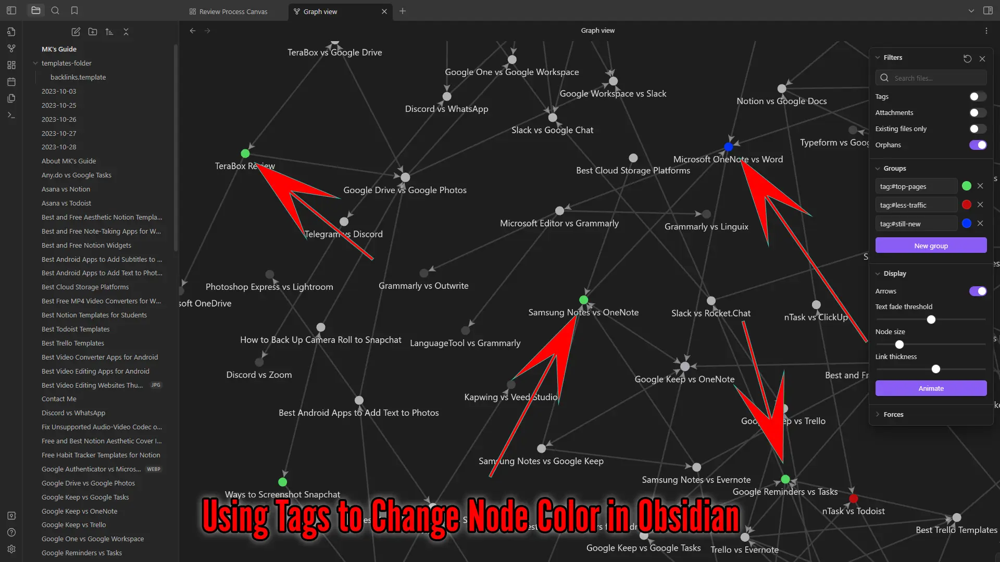

Using Tags to Change Node Color in Obsidian  

在黑曜石中使用标签更改节点颜色

Tags in Logseq don’t offer much. Tags are **treated as pages**. We can create tags with the “#” symbol, and when we click that tag, the program will create a new page. So, tags in Logseq are pages.  

Logseq 中的标签提供的功能并不多。标签被视为页面。我们可以用 "#"符号创建标签，点击该标签后，程序将创建一个新页面。因此，Logseq 中的标签就是页面。

Obsidian has special functions for tags. We can use them to sort notes, and in the graph view, tags can be used to organize nodes using colors.  

Obsidian 为标签提供了特殊功能。我们可以用标签对笔记进行排序，在图表视图中，标签可以用颜色来组织节点。

**Logseq block hierarchy Logseq 块层次结构**

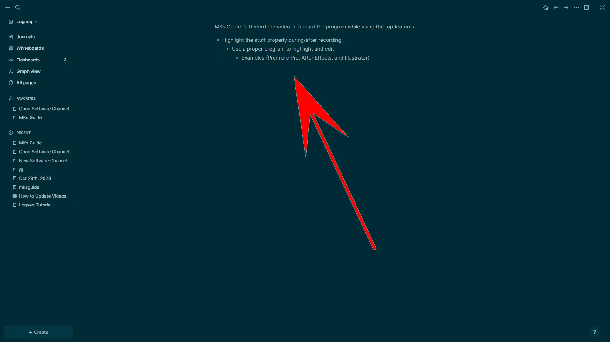

Block Hierarchy in Logseq  

Logseq 中的区块层次结构

We covered the block-based nature of Logseq. Each block is clickable to help you focus on tasks. In the above image, you will see the navigation.  

我们介绍了 Logseq 基于区块的特性。每个区块都可以点击，以帮助您专注于任务。在上图中，你将看到导航。

When you click on a block, you will see the hierarchy of all its sub-blocks and their content. Each block also has a tiny arrow that collapses the whole block.  

点击区块后，你会看到所有子区块的层次结构及其内容。每个区块还有一个小箭头，可以折叠整个区块。

**Logseq Flashcards 对数抽认卡**

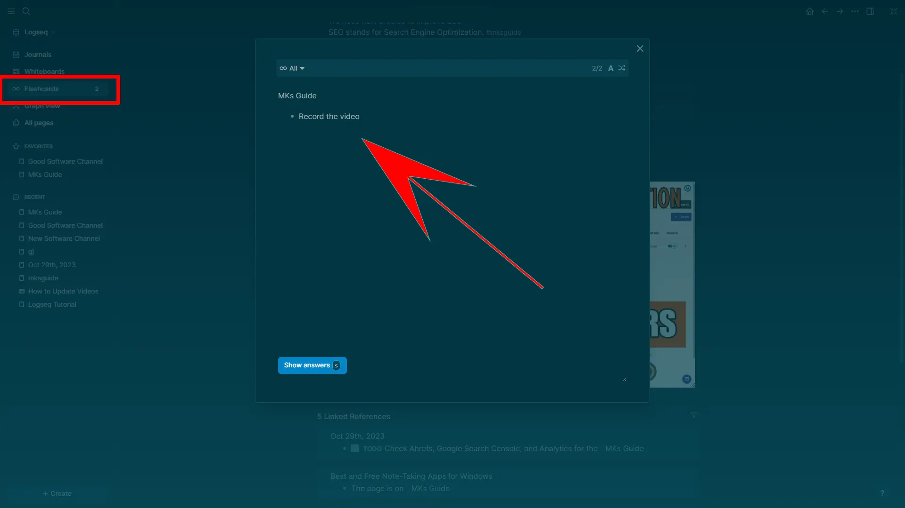

Flashcards in Logdeq Logdeq 中的闪卡

Flashcards is an additional option in Logseq to save important blocks. Using the “#card” in a block, we can save that block in this specific section.  

闪存卡是 Logseq 中用于保存重要数据块的附加选项。使用区块中的 "#card"，我们可以将该区块保存在这一特定部分中。

**Logseq linked and unlinked references  

Logseq 链接和非链接参考文献**

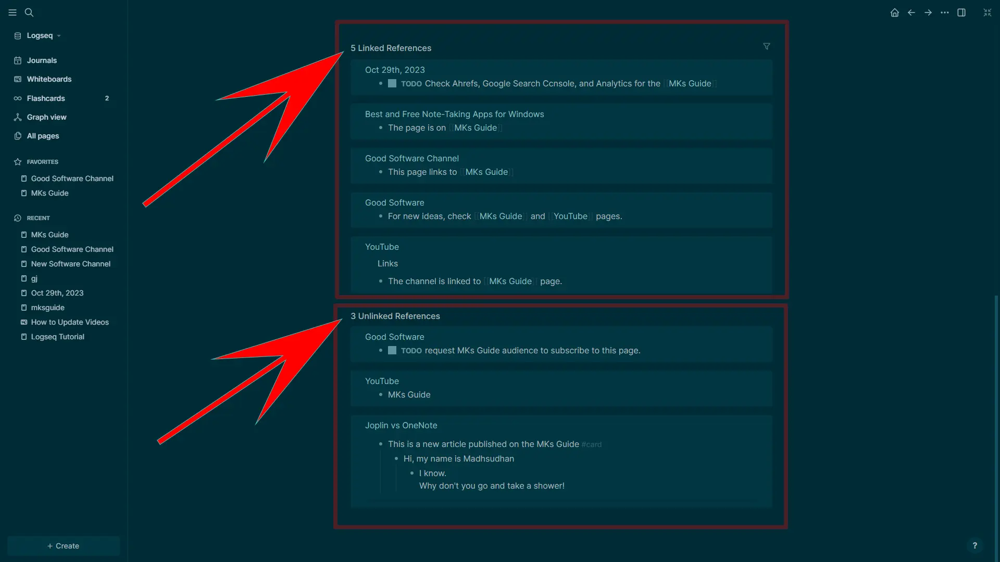

Linked and Unlinked References in Logseq  

Logseq 中的链接和非链接参考文献

Logseq lets you see the linked and unlinked references in the edit view.  

Logseq 可让您在编辑视图中查看已链接和未链接的引用。

Linked references are those pages where this page is linked, and unlinked references are those where the current page title is mentioned but not linked.  

已链接参考资料是指本页面被链接的页面，未链接参考资料是当前页面标题被提及但未被链接的页面。

It’s a great way to see the backlink data and if you missed linking pages.  

这是查看反向链接数据以及是否遗漏链接页面的好方法。

**Obsidian’s open time 黑曜石的开放时间**

The average open time of Obsidian is shorter. The program takes a few seconds to open on Windows, while Logseq takes more than a few (even though I have more pages in Obsidian).  

Obsidian 的平均打开时间更短。在 Windows 上打开程序只需几秒钟，而 Logseq 则需要几秒钟以上（尽管我在 Obsidian 上有更多的页面）。

## Summary 摘要

To summarize everything, Obsidian is better in most things. It has a better graph view, plugins, and canvas.  

综上所述，Obsidian 在大多数方面都更胜一筹。它有更好的图形视图、插件和画布。

For normal users, Obsidian is a great choice. However, Logseq has a much better daily journaling that makes it better for daily note-keepers.  

对于普通用户来说，Obsidian 是一个不错的选择。不过，Logseq 的日常日志功能更好，更适合日常记录者。

Ultimately, it depends on you as to what you want to do. Once you have a goal, you will know the answer to the Logseq vs. Obsidian battle.  

归根结底，这取决于你想做什么。一旦你有了目标，你就会知道 Logseq 与黑曜石之争的答案。

Thanks for reading. I hope you learned a thing or two. Please share your views below and contribute.  

感谢您的阅读。希望您能有所收获。请在下方分享您的观点并发表您的看法。

### Logseq vs. Obsidian: Links  

Logseq vs. Obsidian：链接

Madhsudhan Khemchandani has a bachelor’s degree in Software Engineering (Honours). He has been writing articles on apps and software for over five years. He has also made over 200 videos on his YouTube channel. Read more about him on the [about page](https://www.mksguide.com/about/).  

Madhsudhan Khemchandani 拥有软件工程（荣誉）学士学位。他撰写有关应用程序和软件的文章已有五年多时间。他还在自己的 YouTube 频道上制作了 200 多个视频。有关他的更多信息，请参阅 "关于 "页面。
