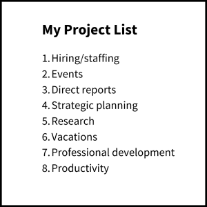
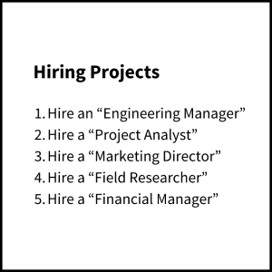
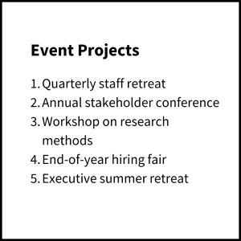

Imagine for a moment the perfect organizational system.  

想象一下完美的组织系统。

A system that told you _exactly_ where to put every piece of information in your life – every document, file, note, agenda, outline, and bit of research – and exactly where to find it when you needed it.  

这个系统能告诉你生活中的每一条信息--每一份文件、档案、便条、日程表、提纲和研究成果--应该放在哪里，以及在需要的时候到哪里去找。

Such a system would need to be incredibly easy to set up, and even easier to maintain. After all, only the simplest, most effortless habits endure long term.  

这样的系统必须非常容易建立，而且更容易保持。毕竟，只有最简单、最省力的习惯才能长期保持。

It would need to be both flexible, adapting to your needs in different seasons of your life, but also comprehensive, so you can use it in every one of the many places where you store information, such as your computer’s file system, a cloud storage platform (e.g., Dropbox or Google Drive), or a digital notetaking app.  

它既要灵活，能适应你在不同生活阶段的需要，又要全面，这样你就可以在你存储信息的许多地方使用它，如电脑的文件系统、云存储平台（如 Dropbox 或 Google Drive）或数字记事本应用程序。

But most of all, the ideal organizational system would be one that leads directly to tangible benefits in your career and life. It would dramatically accelerate you toward completing the projects and achieving the goals that are most important to you.  

但最重要的是，理想的组织系统应能直接为你的事业和生活带来实实在在的好处。它将极大地加速你完成项目，实现对你来说最重要的目标。

In other words, **the ultimate system for organizing your life is one that is _actionable_.**  

换句话说，整理生活的终极系统是一个可操作的系统。

Instead of putting more obstacles in your way, postponing the actions that will make a difference, it would pull those actions closer and make them easier to start and finish.  

与其在你的道路上设置更多的障碍，推迟那些会带来改变的行动，不如拉近这些行动的距离，让它们更容易开始和完成。

After more than a decade of personal experimentation, teaching thousands of students, and coaching world-class professionals, I’ve developed such a system.  

经过十多年的个人实验、教授数千名学生和指导世界一流的专业人士，我开发出了这样一个系统。

**It’s called PARA – a simple, comprehensive, yet extremely flexible system for organizing any type of digital information across any platform.  

它的名字叫 PARA，是一个简单、全面而又极其灵活的系统，可用于在任何平台上组织任何类型的数字信息。**

I promise you that it will not only bring order to your life, but equip you with a set of tools for skillfully mastering the flow of information to achieve anything you set your mind to.  

我向你保证，它不仅能为你的生活带来秩序，还能为你提供一套工具，让你巧妙地掌握信息流，实现你的任何目标。

## 4 Categories to Encompass Your Entire Life  

涵盖您整个生活的 4 个类别

PARA is based on a simple observation: that there are only four categories that encompass all the information in your life.  

PARA 基于一个简单的观点：只有四个类别可以涵盖生活中的所有信息。

You have **projects** you’re actively working on – short-term efforts (in your work or personal life) that you take on with a certain goal in mind. For example:  

你有一些正在积极开展的项目--短期工作（在你的工作或个人生活中），你带着一定的目标去做。例如

-   Complete webpage design 完整的网页设计
-   Buy a new computer 购买新电脑
-   Write research report 撰写研究报告
-   Renovate the bathroom 翻新浴室
-   Finish Spanish language course  
    
    完成西班牙语课程
-   Set up new living room furniture  
    
    摆放新客厅家具

You have **areas** of responsibility – important parts of your work and life that require ongoing attention. These might include:  

你有自己的责任领域--工作和生活中需要持续关注的重要部分。这些领域可能包括

-   Work responsibilities such as Marketing, Human Resources, Product Management, Research and Development, Direct Reports, or Engineering  
    
    工作职责，如市场营销、人力资源、产品管理、研发、直接报告或工程设计
-   Personal responsibilities such as Health, Finances, Kids, Writing, Car, or Home  
    
    个人责任，如健康、财务、孩子、写作、汽车或家庭

Then you have **resources** on a range of topics you’re interested in and learning about, such as:  

然后，你可以获得一系列你感兴趣和正在学习的主题资源，例如

-   Graphic design 平面设计
-   Personal productivity 个人生产力
-   Organic gardening 有机园艺
-   Coffee 咖啡
-   Modern architecture 现代建筑
-   Web design 网页设计
-   Japanese language 日语
-   French literature 法国文学
-   Notetaking 记笔记
-   Breathwork 呼吸法
-   Habit formation 习惯的形成
-   Photography 摄影
-   Marketing assets 营销资产

Finally, you have **archives**, which include anything from the previous three categories that is no longer active, but you might want to save for future reference:  

最后是存档，包括前三个类别中不再活跃但可能需要保存以备将来参考的内容：

-   Projects you’ve completed or put on hold  
    
    您已完成或搁置的项目
-   Areas that are no longer active or relevant  
    
    不再活跃或不再相关的领域
-   Resources that you’re no longer interested in  
    
    您不再感兴趣的资源

And that’s it! Four top-level folders – Projects, Areas, Resources, and Archives – each containing a small number of subfolders dedicated to each active project, area of responsibility, resource, and archive in your life.  

就是这样！四个顶级文件夹--项目、领域、资源和档案--每个文件夹都包含少量子文件夹，专门用于你生活中的每个活动项目、责任领域、资源和档案。

It may be difficult to believe that a complex, modern human life like yours can be reduced to just four categories. It may feel like you have far more to deal with than can fit into such a simple system.  

你可能很难相信，像你这样复杂的现代人的生活竟然可以简化为四类。你可能会觉得，你要处理的事情远比这样一个简单的系统所能容纳的要多得多。

But that is exactly the point: if your organizational system is as complex as your life, then the demands of maintaining it will end up robbing you of the time and energy you need to live that life.  

但这正是问题的关键所在：如果你的组织系统像你的生活一样复杂，那么维护它的要求最终会剥夺你过生活所需的时间和精力。

The system you use to organize information has to be so simple that it _frees up_ your attention, instead of taking more of it. Your system has to give you time, not take time.  

你用来组织信息的系统必须非常简单，能够解放你的注意力，而不是占用你更多的注意力。你的系统必须给你时间，而不是占用你的时间。

## The Key Principle – Organizing Information By Your Projects And Goals  

关键原则--按项目和目标整理信息

Most of us first learned how to organize information in school. We were taught to categorize our class notes, handouts, and study material by _academic subject_, such as Math, History, or Chemistry.  

我们中的大多数人最初都是在学校里学会如何整理信息的。我们被教导将课堂笔记、讲义和学习材料按照数学、历史或化学等学科分类。

But then without realizing it, we took that same approach into adulthood. We continued to categorize our documents and files according to incredibly broad subjects like “Marketing,” “Psychology,” “Business,” or “Ideas.”  

但在不知不觉中，我们把同样的方法带到了成年。我们继续按照 "市场营销"、"心理学"、"商业 "或 "创意 "等宽泛得令人难以置信的主题对文件和档案进行分类。

This makes zero sense in your post-academic career. In the workplace, there are no classes, no tests, no grades, and no diplomas. No teacher is going to tell you what to write down for the final exam, because there isn’t one.  

这在你毕业后的职业生涯中毫无意义。在工作场所，没有课程、没有考试、没有成绩、也没有文凭。没有老师会告诉你期末考试要写什么，因为根本就没有期末考试。

What you do have, both at work and in life, are _outcomes you are trying to achieve_. You are trying to launch a new product, plan a family vacation, come to a crucial decision, find daycare in your neighborhood, publish a new piece of writing, or reach a quarterly sales number.  

无论是在工作中还是在生活中，你所拥有的都是你想要实现的结果。你正在努力推出一款新产品、计划一次家庭度假、做出一个重要决定、在附近找到日托中心、发表一篇新的文章，或者达到一个季度的销售数字。

In the midst of your busy day, as you are trying to make these things happen, you _absolutely do not have time_ to go rummaging through a vast category like “Psychology” to find the one piece of information you need.  

在你忙碌的一天中，当你努力去做这些事情时，你绝对没有时间去翻找像 "心理学 "这样一个庞大的分类来查找你所需要的信息。

Instead of organizing information according to broad subjects like in school, I advise you to organize it according to the projects and goals you are committed to right now. This is what it means to “organize by actionability,” a mantra I will return to again and again throughout this book.  

我建议你不要像在学校里那样按照广泛的学科来组织信息，而是按照你现在致力于实现的项目和目标来组织信息。这就是 "根据可操作性来组织 "的含义，也是我在本书中反复强调的口号。

When you sit down to work on a graphic design project, for example, you will need all the notes, documents, assets, and other material related to that project all in one place and ready to go.  

例如，当你坐下来处理一个平面设计项目时，你需要将与该项目有关的所有笔记、文档、资产和其他材料都放在一个地方，随时可以使用。

That might seem obvious, yet it is exactly the opposite of what most people do. Most people tend to spread out all the relevant material in a dozen different places that would take them half an hour just to locate.  

这看似显而易见，却与大多数人的做法恰恰相反。大多数人往往会把所有相关资料分散在十几个不同的地方，光是找到这些资料就得花上半个小时。

How do you make sure that all the material related to each project or goal is all in one place? You organize it that way in the first place. That way you’ll know exactly where to put everything, and exactly where to find it.  

如何确保与每个项目或目标相关的所有材料都集中在一个地方？首先要这样整理。这样，你就会清楚地知道该把所有东西放在哪里，以及在哪里可以找到。

## Get the cheat sheet to implementing the PARA Method  

获取实施 PARA 方法的小抄

To help you put what you learn into practice, I've created a **handy printable cheat sheet** with the main principle and rules for PARA success.  

为了帮助您学以致用，我制作了一份方便打印的小抄，上面有 PARA 成功的主要原则和规则。

Look out for an email from hello@fortelabs.com  

请留意来自 hello@fortelabs.com 的电子邮件

## The Power of Organizing By Project  

按项目组织的力量

For several years, I worked as a productivity coach in the San Francisco Bay Area. It was the peak of the tech boom, and high-powered professionals from some of the world’s most influential companies were looking for any edge in their performance. I was happy to oblige.  

几年来，我在旧金山湾区担任生产力教练。当时正值科技蓬勃发展的高峰期，来自世界上最具影响力的公司的高层专业人士都在寻求提高工作效率的方法。我很乐意为他们提供帮助。

I coached several executives at a well-known biotech firm in South San Francisco, on a beautiful campus overlooking the bay. I remember one beautiful spring day I was waiting for my next client, a Senior Director in charge of developing several new life-saving pharmaceuticals.   

我曾在南旧金山一家著名的生物技术公司为几位高管提供辅导，这家公司坐落在俯瞰海湾的美丽校园里。我记得在一个美丽的春天，我正在等待我的下一位客户，他是一位负责开发几种救命新药的高级总监。

Once he arrived, our coaching session started like every other, with a simple question of mine: “Do you have a project list?”  

他一到，我们的辅导课就开始了 像往常一样，我问了一个简单的问题"你有项目清单吗？"

When working with a client as a productivity coach, one of the first things I will always ask them is to show me their project list. I need it to get a sense of what kind of work they do, their current workload, and what priorities and outcomes they are trying to move forward.  

作为一名生产力教练，在与客户合作时，我首先会要求他们向我展示他们的项目清单。我需要它来了解他们的工作类型、目前的工作量，以及他们正在努力推进的优先事项和成果。

He said “Sure!” and, after jotting down a quick list from memory (the first warning sign), handed me a list like this:  

他说："当然可以！"然后，他凭记忆快速记下了一份清单（这是第一个警告信号），然后递给我这样一份清单：

Do you see the problem? Look again closely.  

看到问题所在了吗？再仔细看看。

Not a single item on this list is a project, according to our earlier definition. Does “strategic planning” ever end for good? Is there ever a time when you can permanently cross off “vacations” from your list? Hopefully not!  

根据我们之前的定义，这份清单上没有一个项目是项目。战略规划 "有永远结束的时候吗？有没有哪一天，你可以永远地从清单上划掉 "假期"？希望不会！

Every item on this list is, in fact, an area of responsibility. This might seem like semantics, but it’s anything but. I’ve learned that no matter how smart or driven you are, there are two critical things you cannot do until you break down your areas of responsibility into specific projects.  

事实上，清单上的每一项都是一个责任领域。这看起来像是语义学，但其实不然。我了解到，无论你有多聪明或多有干劲，有两件至关重要的事情你是做不到的，除非你把责任领域分解成具体的项目。

### 1\. You Can’t Truly Know the Extent of Your Commitments  

1.你无法真正了解自己的承诺范围

One of the most common complaints I hear from people is that they “have no bandwidth.” And I sympathize – how much of the time does it feel like you have way too much on your plate?  

我最常听到的抱怨之一就是 "没有带宽"。我对此深有同感--有多少时候你会觉得自己的事情太多了？

But as long as you view your work through the lens of areas, you’ll never quite know _just how much_ is on your plate. Looking at the list above, how much of a workload does “Hiring” represent? It could be anything from a part-time hire every 6 months to filling 50 positions this quarter.   

但是，只要你从领域的角度来看待你的工作，你就永远不会知道你的工作量到底有多大。看看上面的清单，"招聘 "代表了多少工作量？可能是每 6 个月一次的兼职招聘，也可能是本季度 50 个职位的招聘。

There’s simply no way to know at a glance, and that uncertainty will manifest itself as every area feeling more burdensome than it really is.  

根本无法一目了然，这种不确定性会表现为每个领域都感觉比实际负担更重。

Imagine if you identified each of the projects _within_ Hiring, and kept that list in front of you every day. Wouldn’t it be so much easier to tell how much there is left to do, and what you should do next? For example:  

试想一下，如果你确定了 "招聘 "中的每个项目，并每天将清单放在眼前。是不是就能更容易地知道还有多少工作要做，以及下一步应该做什么？例如

### 2\. You Can’t Connect Your Current Efforts to Your Long-Term Goals  

2.无法将当前工作与长期目标联系起来

One of the most challenging (but also rewarding) aspects of knowledge work is that it requires our creativity. And creativity can’t really be sustained without a sense of motivation. You can’t keep doing your best thinking and contributing your best ideas if you’re burned out and demoralized.  

知识工作最具挑战性（同时也是最有价值的）的一个方面就是它需要我们的创造力。如果没有动力，创造力就无法真正持续下去。如果你疲惫不堪、士气低落，你就无法继续进行最佳思考和贡献最佳创意。

What does our motivation depend on? Mostly, on making consistent progress. We can endure quite a bit of stress and frustration in the short term if we know it’s _leading somewhere._  

我们的动力取决于什么？主要是持续的进步。如果我们知道压力和挫折会让我们有所收获，我们就能在短期内忍受相当大的压力和挫折。

Which brings us to our second problem: without a list of individual projects, you can’t connect your current efforts to your long-term goals.   

这就引出了第二个问题：没有单个项目的清单，就无法将当前工作与长期目标联系起来。

Look at the list above again. None of the items on it will end or change – that’s the definition of an area of responsibility, that it continues indefinitely. Now imagine the psychological effect of waking up week after week, month after month, and even year after year to the exact same list of never-ending responsibilities. No matter how hard you work, the endless horizon never seems to get any closer.  

再看看上面的清单。上面的所有项目都不会结束或改变--这就是责任领域的定义，它将无限期地持续下去。现在想象一下，一周又一周、一月又一月，甚至一年又一年，当你醒来时，面对的是一模一样、永无止境的责任清单，会产生怎样的心理影响。无论你如何努力工作，那无尽的地平线似乎永远不会再靠近。

Honestly, I couldn’t design a better way to kill your motivation if I tried.  

老实说，就算我想，也设计不出比这更好的方法来扼杀你的积极性了。

When you break down your responsibilities into bite-sized projects, you ensure that your project list is constantly turning over. This turnover creates a cadence of regular victories that you get to celebrate every time you successfully complete a project. Imagine how motivated and accomplished you’d feel by breaking out the broad area of “Events” into each individual event you’re running:  

当你把责任分解成一个个小项目时，你就能确保你的项目清单不断翻新。每次成功完成一个项目，你都会庆祝自己的胜利。试想一下，将 "活动 "这个大领域细分为每一个单独的活动，你会感到多么有动力和成就感：

No matter how wide-ranging your responsibilities are, you can _always_ break them down into smaller projects. And you must, if you want to know whether you’re actually making progress toward your goals.   

无论你的职责范围有多大，你总能把它们分解成更小的项目。如果你想知道自己是否真正朝着目标取得了进展，你就必须这样做。

## The Actionable Guide to implementing the PARA Method is out!  

实施 PARA 方法的可操作指南》已经发布！

Order your copy now. The book is available in hardcover, ebook, and audio format.  

现在就订购吧。本书有精装版、电子书和音频版。

## Getting Organized For the Life You Want to Lead  

为你想要的生活整理好一切

Using PARA is not just about creating a bunch(堆) of folders to put things in.   

使用 PARA 不仅仅是创建一堆文件夹来放置东西。

It is about identifying the structure of your work and life—what you are committed to, what you want to change, and where you want to go. It is about organizing information in such a way that it supports and calls into being the future life you want to lead.   

这是关于确定你的工作和生活结构--你致力于什么，你想改变什么，你想去哪里。这就是组织信息，使其能够支持和实现你想要的未来生活。

So much of what we call “organizing” is essentially procrastination in disguise. We tell ourselves we’re “getting ready” or “doing research,” pretending like it’s progress. When in reality, we are seeking any little thing we can polish or tidy to avoid having to face the task we are dreading.  

我们所谓的 "整理 "本质上是一种变相的拖延。我们告诉自己在 "做准备 "或 "做研究"，假装这是一种进步。而实际上，我们是在寻找任何可以擦亮或整理的小东西，以避免面对我们害怕的任务。

PARA cuts through this facade, giving us a method for organizing anything that is so radically simple, there is no excuse and nothing left to do except the next essential step. It is a minimalistic way to add _just enough_ order to your environment that you have the clarity to move forward, and no more.  

PARA 打破了这种表面现象，为我们提供了一种整理任何东西的方法，这种方法非常简单，没有任何借口，除了下一个必要步骤之外，没有任何事情可做。它是一种极简的方法，只需为你的环境添加足够的秩序，你就能清晰地向前迈进，而无需更多。

There are other more complex, sophisticated, and specialized ways of organizing information out there, but PARA is the only one that stands the test of time because it gives you more time than it takes.  

还有其他更复杂、更精密、更专业的信息组织方式，但 PARA 是唯一经得起时间考验的，因为它给你的时间比你花费的时间更多。

___

**Follow us for the latest updates and insights around productivity and Building a Second Brain on [Twitter](https://twitter.com/fortelabs/), [Facebook](https://www.facebook.com/fortelabs/), [Instagram](https://www.instagram.com/fortelabsco/), [LinkedIn](https://www.linkedin.com/in/tiagoforte/), and [YouTube](http://basb.io/youtube). And if you’re ready to start building your Second Brain, [get the book](https://www.buildingasecondbrain.com/book) and learn the proven method to organize your digital life and unlock your creative potential.  

在 Twitter、Facebook、Instagram、LinkedIn 和 YouTube 上关注我们，了解有关生产力和《打造第二大脑》的最新更新和见解。如果你已经准备好开始构建你的 "第二大脑"，请购买本书，学习整理你的数字生活、释放你的创造潜能的行之有效的方法。**

## Get the cheat sheet to implementing the PARA Method  

获取实施 PARA 方法的小抄

To help you put what you learn into practice, I've created a **handy printable cheat sheet** with the main principle and rules for PARA success.  

为了帮助您学以致用，我制作了一份方便打印的小抄，上面有 PARA 成功的主要原则和规则。

Look out for an email from hello@fortelabs.com  

请留意来自 hello@fortelabs.com 的电子邮件

-   POSTED IN: [Building a Second Brain](https://fortelabs.com/blog/category/topics/building-a-second-brain/), [Note-taking](https://fortelabs.com/blog/category/topics/note-taking/), [Organizing](https://fortelabs.com/blog/category/topics/organizing/), [Productivity](https://fortelabs.com/blog/category/topics/productivity/), [Project management](https://fortelabs.com/blog/category/topics/project-management/), [Technology](https://fortelabs.com/blog/category/topics/technology/)  
    
    张贴在： 建立第二个大脑、笔记、组织、生产力、项目管理、技术
