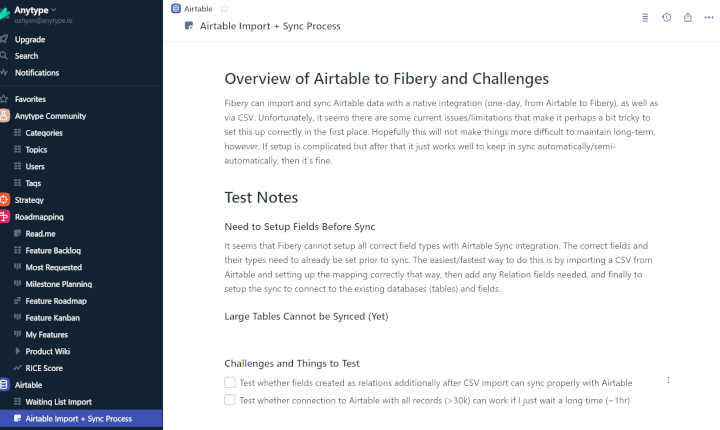

Recently I was asked to do a comparison between the popular work management app [ClickUp 1](https://www.clickup.com/) and the more under-the-radar “no code” tool [Fibery 1](https://fibery.io/), for the specific use case of managing a software development team - sorting, prioritizing, and working on bugs and feature requests, from both internal and external sources, roadmap planning and communication, etc, etc. This particular team uses a form of Agile, with classic Sprints.  

最近，我应邀对流行的工作管理应用程序 ClickUp1 和更低调的 "无代码 "工具 Fibery1 进行了一次比较，比较的具体使用案例是管理一个软件开发团队--对来自内部和外部的错误和功能请求进行分类、优先级排序和处理，以及路线图规划和沟通等等。这个特定的团队采用的是经典的 "冲刺"（Sprints）敏捷方法。

ClickUp takes a very direct approach to addressing these needs, with dedicated task management, custom status and fields, task dependency, and more, and it even includes a dedicated Sprint Creation tool. Fibery, on the other hand, is much more of an open and flexible toolkit, and while there are Templates that give you a base structure to do much of the above, it’s also much more flexible in some respects (flexible but DIY). So in a situation where your workflow is a fairly common and well-understood one - software dev using Agile - does that flexibility really matter? How does Fibery compare in other, more fundamental work functions?  

ClickUp 采用一种非常直接的方法来满足这些需求，它有专门的任务管理、自定义状态和字段、任务依赖性等，甚至还包括专门的冲刺创建工具。另一方面，Fibery 是一个更加开放和灵活的工具包，虽然有模板为您提供了实现上述大部分功能的基础结构，但它在某些方面也更加灵活（灵活但 DIY）。那么，如果你的工作流程是一个相当常见且易于理解的流程--使用敏捷的软件开发--那么这种灵活性真的重要吗？Fibery 与其他更基本的工作功能相比又如何呢？

I considered some factors outside of the core software dev use case, and of course many features have broad utility, so I hope this comparison will prove useful to others as well.  

我考虑了核心软件开发用例之外的一些因素，当然，许多功能都具有广泛的实用性，因此我希望这种比较也能对其他人有所帮助。

## Fibery vs. ClickUp Comparison  

Fibery 与 ClickUp 的比较

## Preamble 序言

Here is my admittedly biased but mostly evidence-based comparison. The team was using ClickUp to begin with, so I simply took their entire issue tracking data set (some 400 items) and imported it into Fibery via CSV so I could be operating on the same data for these tests. Then I ran through a variety of basic functions and areas to see how they compared for these particular uses.  

以下是我的比较，虽然有失偏颇，但主要是基于证据的比较。团队一开始使用的是 ClickUp，因此我只需将他们的整个问题跟踪数据集（约 400 个项目）通过 CSV 导入 Fibery，这样我就可以在这些测试中使用相同的数据。然后，我运行了各种基本功能和区域，看看它们在这些特定用途上的比较。

I’m using a simple emoji to indicate whether ClickUp or Fibery comes out ahead in each area. When Fibery wins = , when ClickUp wins = . Other emoji are used for a quick at-a-glance impression of my _personal_ opinion on how they compare, they are not meant to be a consistent score. I have provided numerical ratings for clarity, where 1 = poor implementation or non-existent feature, and 5 = ideal implementation/feature.  

我用一个简单的表情符号来表示在每个区域是 ClickUp 领先还是 Fibery 领先。当 Fibery 获胜时 =  ，当 ClickUp 获胜时 =  。其他表情符号只是为了让大家快速了解我个人对它们之间比较的看法，并不代表一致的分数。为清楚起见，我提供了数字评级，其中 1 = 差劲的实施或不存在的功能，5 = 理想的实施/功能。

## Task Management and Reminders 任务管理和提醒  

Fibery:  (3) Fibery:  (3)

ClickUp:  (5) ClickUp:  (5)

Simply put, ClickUp has better dedicated task management functions, easier reminders and task-related notifications. You _can_ do a lot in this area in Fibery with the flexible toolset, but it’s more complicated and cumbersome, especially for initial setup, e.g. reminders require messing with automations to enable, and require a dedicated field on the Entity to set the date. It “just works” in ClickUp and is very easy to add notifications, adjust them, etc. Especially for things like recurring tasks. Once an admin gets task management working well in Fibery, it mostly also “just works”, but it’s still less flexible and easy to use, in my view.  

简而言之，ClickUp 拥有更好的专用任务管理功能、更简单的提醒和任务相关通知。在 Fibery 中，你可以利用灵活的工具集在这方面做很多事情，但它更加复杂和繁琐，尤其是在初始设置方面，例如，提醒功能需要使用自动操作才能启用，并且需要在实体上设置一个专门的字段来设置日期。而在 ClickUp 中 "只需运行"，添加通知、调整通知等都非常简单。特别是对于重复性任务。一旦管理员能在 Fibery 中很好地进行任务管理，它大多也能 "正常工作"，但在我看来，它的灵活性和易用性仍然较差。

## Sprint Creation/Management ?  

冲刺创建/管理  ?

Fibery:  (?) Fibery:  (?)

ClickUp:  (3-4) ClickUp:  (3-4)

I know that ClickUp has a dedicated Sprint Creation/management function. I haven’t used it, so I’m not sure how good it is, but I do know Fibery doesn’t have that.  That said, it’s possible ClickUp is too rigid, or that Fibery’s flexibility makes this fairly easy too, I’m not sure. They provide a template for Scrum setup that one can look at and test: [https://fibery.io/templates/scrum-for-teams 1](https://fibery.io/templates/scrum-for-teams)  

我知道 ClickUp 有专门的 Sprint 创建/管理功能。我没有用过它，所以不确定它有多好，但我知道 Fibery 没有这个功能。  也就是说，可能是 ClickUp 太死板，也可能是 Fibery 的灵活性让这一功能也变得相当简单，我不确定。他们提供了一个可以查看和测试的 Scrum 设置模板：https://fibery.io/templates/scrum-for-teams1。

## Search  搜索  

Fibery: (4) Fibery:  (4)

ClickUp: (2-) ClickUp:  (2-)

Search is way, way better in Fibery, at least in regards to speed and quality of results. It is **far** more precise, accurate, and useful. I think the examples that follow are fairly compelling, and quite honestly ClickUp’s results here just look… broken. I’m not sure what’s going on. For what it’s worth I’ve started with ClickUp’s defaults and then adjusted settings to try to get better results when those defaults basically failed.  

在 Fibery 中，搜索效果要好得多，至少在速度和结果质量方面。它要精确、准确和有用得多。我认为后面的例子很有说服力，老实说，ClickUp 的结果看起来......很糟糕。我不知道发生了什么。不管怎样，我从 ClickUp 的默认设置开始，然后调整设置，试图在默认设置基本失效时获得更好的结果。

To test some basic cases I chose two “Tasks” (bug reports) at random, found some adjacent words in them, and used that to test the search function in both ClickUp and Fibery. This was done entirely at random, and a few other attempts using other randomly sampled words yielded similar results (I’d be curious to hear from readers if their tests turn out better!). I’ve blurred(模糊) much of the text, but left key words, etc. readable so you can see what matters.  

为了测试一些基本情况，我随机选择了两个 "任务"（错误报告），在其中找到了一些相邻的单词，并用它们来测试 ClickUp 和 Fibery 的搜索功能。这完全是随机进行的，使用其他随机抽取的单词进行的几次尝试也得到了类似的结果（我很想知道读者的测试结果是否更好！）。我对大部分文字进行了模糊处理，但保留了可读的关键词等，以便您能看到重要的内容。

Here I’m searching for the text “default draft”. You can see many instances of “default”, but none of “draft”. Hmm.  

在这里，我正在搜索文本 "默认草稿"。你可以看到很多 "默认 "的例子，但没有一个是 "草稿"。嗯。

Now I open one of the results from that list and do an in-page text search for the original search term “default draft”. But what’s this? 0 results?  Yes, the word “default” is present, but “draft” is _nowhere_ in this record, not in Comments, attachments, or anywhere I could find. And of course the search results page didn’t show any highlight with that word, so I don’t even know where ClickUp _thinks_ it is.  

现在，我打开列表中的一个结果，对原始搜索词 "默认草稿 "进行页面内文本搜索。结果是什么？0 个结果？  是的，"默认 "一词是存在的，但 "草稿 "在这条记录中没有任何位置，在注释、附件或我能找到的任何地方都没有。当然，搜索结果页面也没有显示任何带有该词的高亮显示，所以我甚至不知道 ClickUp 认为它在哪里。

Here’s another example, I opened another item from the original results list and searched for one of the two search terms. Not found. 下面是另一个例子，我打开原始结果列表中的另一个项目，搜索这两个搜索词中的一个。未找到。  

OK, let’s give ClickUp a little help here and confine the search to _just_ Tasks. Ah, finally we see a result that looks promising, with both words highlighted in the results list.  

好吧，让我们给 ClickUp 一点帮助，将搜索范围限制在任务上。啊，我们终于看到了一个看起来很有希望的结果，两个词都在结果列表中突出显示。

And when we open it, aha, we can see it! But… why wasn’t this _exact match_ result, with both words _right next to each other_, even showing up in the original list? **Especially** when several of the results that _did_ show up didn’t even seem to contain one of the search terms.  

当我们打开它时，啊哈，我们可以看到它了！但是......为什么这两个词紧挨在一起的完全匹配结果没有出现在原始列表中呢？尤其是有几个显示出来的结果似乎都不包含其中一个搜索词。

Finally when I confined the search to Issues Only _and_ the _specific list_, then our match was at the top. OK, I thought, maybe the problem was that ClickUp had defaulted to sorting results by “Recent”, but nope, switching to “Relevance” didn’t seem to improve things. Very odd.  

最后，当我把搜索范围限制在 "仅限问题 "和特定列表时，我们的匹配结果就排在了最前面。好吧，我想，也许问题出在 ClickUp 默认按 "最近 "排序，但不对，换成 "相关性 "似乎也没有改善。非常奇怪。

OK, but what about Fibery? Here side-by-side are 1: the initial state of Search (everything shown), and then 2: the result when I put in the same search terms. The top result is the correct one, _and_ it highlights both words. It didn’t matter what order I had the words in, and the filtering also happened faster than ClickUp.  

好吧，那么 Fibery 呢？这里并排显示的是：1：搜索的初始状态（显示所有内容）；2：输入相同搜索条件后的结果。最上面的结果是正确的，它突出显示了两个词。我输入词语的顺序并不重要，而且过滤的速度也比 ClickUp 快。

Is it a fluke? Nope. Here’s another, even more problematic example. We know exactly what we want to search for, so we use “exact match”. _Nothing_ is found in ClickUp. Take off exact match and, using “Relevant” as the sort criteria, the _one_ item with an exact match somehow ends up _8th_ on the results list (almost off the first page of results).  

是侥幸吗？不是。这里还有一个问题更大的例子。我们很清楚要搜索什么，所以我们使用了 "精确匹配"。取消精确匹配后，使用 "相关 "作为排序条件，一个精确匹配的项目不知何故排在了结果列表的第 8 位（几乎不在结果的第一页）。

Here you can see that the text does exist in that entity, and should show in an exact match:  

在这里，您可以看到文本确实存在于该实体中，并且应该显示为完全匹配：

Fibery unsurprisingly handles it just fine, displaying single result, and showing the correct text highlighted.  

Fibery 不出所料地处理得很好，只显示了一个结果，并突出显示了正确的文本。

It’s just no contest for speed and accuracy of finding what you want, at least using search terms. I’m honestly a bit shocked how bad ClickUp seems to be here, I really did not start out expecting this. I actually began testing this because I expected more of a _performance_ difference (Fibery search is quite fast, ClickUp tends to be generally slow, in fact that’s one of the complaints this team has, which got them looking for alternatives).  

至少在使用搜索条件时，它在查找所需内容的速度和准确性方面毫无优势可言。老实说，ClickUp 在这方面的表现让我有点震惊，我一开始真的没想到会是这样。实际上，我之所以开始测试，是因为我更期待性能上的差异（Fibery 的搜索速度相当快，而 ClickUp 则普遍较慢，事实上，这也是这个团队的抱怨之一，这也是他们寻找替代品的原因）。

Now Fibery does not index Comments, while ClickUp does, so that is one advantage for ClickUp. But Fibery indexes almost everything else, and it can find things that ClickUp cannot, like **views** (e.g. Kanban, Table, etc.). Overall Fibery seems much better in this area.  

现在，Fibery 没有为注释建立索引，而 ClickUp 有，所以这是 ClickUp 的一个优势，但 Fibery 几乎可以为其他所有内容建立索引，而且它可以找到 ClickUp 无法找到的内容，如视图（如 Kanban、Table 等）。总的来说，Fibery 在这方面似乎更胜一筹。

I only rated ClickUp a 2 because it has reasonably flexible, filterable search, and indexes a lot of content, including comments (if I understand correctly). Fibery’s search is fairly simple by comparison. **However** when the actual relevance of the results is as bad as it seems to be in ClickUp based on my tests, it is questionable whether having many search **features** is really useful, since it still does not let you easily find what you want. Fibery’s search may be simple, but in my experience if you know generally what you’re looking for it can find it very quickly and get you there easily. If I was rating on **quality of search results** , ClickUp would be a 1 (or a 0 given that exact match appears semi-broken ).  

我之所以给 ClickUp 打 2 分，是因为它的搜索相当灵活、可过滤，并能索引大量内容，包括评论（如果我理解正确的话）。相比之下，Fibery 的搜索相当简单。不过，根据我的测试，ClickUp 的搜索结果的实际相关性似乎很差，这让人怀疑拥有众多搜索功能是否真的有用，因为它仍然无法让你轻松找到想要的内容。Fibery 的搜索可能比较简单，但根据我的经验，如果你大致知道自己要找什么，它就能很快帮你找到。如果我给搜索结果的质量打分，ClickUp 应该得 1 分（或者 0 分，因为完全匹配的搜索结果看起来半残缺  ）。

## UI/UX  用户界面/用户体验  

Fibery:  (4) Fibery:  (4)

ClickUp:  (2.5) ClickUp：  (2.5)

This is somewhat subjective(主观), however there are some areas where ClickUp UI/UX is **really** poor, and Fibery is very clearly superior. A great example is how bad the Doc History view in ClickUp seems to be. You can barely see the listed changes and authors, the versions expand in-line so you have to do a lot of scrolling to see changes and check next/previous versions. It is just bad design. Fibery has a wider history view, and list of versions in right-hand pane with date+author and option to enable/disable “show changes”. It is clearly more well-thought-out. My feeling from using ClickUp is that many things have the feeling of “not well-designed”.  

这有点主观，但在某些方面，ClickUp 的用户界面/用户体验确实很差，而 Fibery 则明显更胜一筹。一个很好的例子是 ClickUp 中的文档历史视图似乎很糟糕。你几乎看不到列出的更改和作者，版本在行内展开，因此你必须做大量滚动才能看到更改并查看下一个/上一个版本。这简直是糟糕的设计。Fibery 的历史视图更宽广，右侧窗格中的版本列表带有日期和作者，并有启用/禁用 "显示更改 "的选项。这显然是经过深思熟虑的。我使用 ClickUp 的感觉是，很多东西都给人一种 "设计不周 "的感觉。

Here’s ClickUp’s cramped, unhelpful view:  

下面是 ClickUp 狭小、无用的视图：

And now Fibery. Note that I highlighted the currently selected version in red since it’s less obvious in the screenshot, but in actual use it’s fast and intuitive, quickly showing in the left pane the version you chose in the right, along with highlighted differences of course:  

现在是 Fibery。请注意，我用红色标出了当前选择的版本，因为在截图中不太明显，但在实际使用中，它非常快速直观，能在左侧窗格中快速显示您在右侧窗格中选择的版本，当然还有突出显示的不同之处：

Fibery’s “entity” view (task view in ClickUp) is also superior, in my view. It makes it easier to see the important info, is more flexible in moving stuff around, and just has nicer UI, use of space, etc. ClickUp feels quite cluttered and distracting by comparison. Fibery is also always working on improving UI/UX, and I think they do a good job of testing and implementing valuable improvements such as multi-panel navigation (see “Vision” below).  

在我看来，Fibery 的 "实体 "视图（ClickUp 中的任务视图）也更胜一筹。它更容易看到重要信息，移动起来更灵活，而且用户界面和空间利用等方面也更出色。相比之下，ClickUp 就显得杂乱无章，让人分心。Fibery 也一直在努力改进用户界面/用户体验，我认为他们在测试和实施多面板导航等有价值的改进方面做得很好（见下文 "愿景"）。

## Navigation and Structure 导航和结构  

Fibery:  (3.5+) Fibery:  (3.5+)

ClickUp:  (2) ClickUp:  (2)

Fibery has simple and reasonably flexible navigation based around a familiar hierarchy and the concepts of “spaces” (to organize “types of work”), and then folders and views, with “entities” being the equivalent of ClickUp’s fundamental unit of work the “task”. Although there are these few, specific hierarchy concepts, most content can exist **anywhere** in the hierarchy. Spaces and Folders can hold anything: docs, views, entities, and charts (smart folders can dynamically show entities or other things based on specified criteria as well). It is familiar and therefore intuitive, and it is powerful enough for most purposes.  

Fibery 拥有简单而灵活的导航功能，其基础是熟悉的层次结构和 "空间 "概念（用于组织 "工作类型"），然后是文件夹和视图，"实体 "相当于 ClickUp 的基本工作单位 "任务"。虽然有这几个特定的层次结构概念，但大多数内容都可以存在于层次结构的任何位置。空间和文件夹可以容纳任何内容：文档、视图、实体和图表（智能文件夹还可以根据指定标准动态显示实体或其他内容）。它很熟悉，因此也很直观，而且功能强大，足以满足大多数用途。

The main limitation is that primary navigation is through the left “tree” menu, so when there is a lot of content (views, docs, etc.) it can get cluttered. However if you find this to get unwieldy when you have lots of data/views, you can just collapse most folders and use search to get to a view (or **anything)** much faster if you know its name. Ctrl-K, type name, hit enter, you’re there. Obviously that won’t work with ClickUp, both because the search is not good, and because it doesn’t surface Views in search anyway.  

它的主要局限是，主要导航是通过左侧的 "树形 "菜单进行的，因此当有大量内容（视图、文档等）时就会显得杂乱无章。不过，如果你发现当你有大量数据/视图时，这样会很不方便，你可以直接折叠大多数文件夹，如果你知道某个视图（或任何东西）的名字，就可以使用搜索更快地找到它。按住 Ctrl-K，输入名称，敲回车键，就可以了。显然，这在 ClickUp 中是行不通的，一是因为搜索功能不佳，二是因为无论如何它都不会在搜索中显示视图。

To address the issue of all Views having to show up in the tree menu, Fibery is now working on allowing in-line Views in a Document or Entity. So just as people create their own fully customizable “dashboards” in Notion, so you don’t need to navigate an extensive tree to find a particular view, you will be able to do the same in Fibery in the relatively near future.  

为了解决所有 "视图 "都必须显示在树形菜单中的问题，Fibery 正在努力允许在文档或实体中使用内联 "视图"。因此，就像人们在 Notion 中创建自己完全自定义的 "仪表盘 "一样，在不久的将来，你也可以在 Fibery 中创建完全自定义的 "仪表盘"，这样你就不需要通过浏览庞大的树形菜单来查找特定的视图了。

ClickUp navigation and organization is more complicated and yet more rigid in many ways. You have very defined levels of hierarchy (Space->Folder->List->Task->Subtask) and only certain things can exist at each level. No smart folders (as of this writing). In my experience you basically want to avoid much use of the left navigation because it can’t really show much (this is being improved, but still limited). You can have multiple “tabs” of views at the top of the main content area on the right, which is nice, but you do not know from the left menu what you will find in the right, or where to find any given thing. You only know it because you use it and memorize it, it’s not actually intuitive or very explorable in my view. Search does not surface Views either (try searching for “Epics backlog” in ClickUp) and is in general quite bad, as I mentioned, so you cannot reliably use it to get around **quickly** as you can in Fibery (as shown above).  

ClickUp 的导航和组织结构更为复杂，但在许多方面也更为严格。你有非常明确的层次结构（空间->文件夹->列表->任务->子任务），而且每个层次只能存在某些特定的内容。没有智能文件夹（截至目前）。根据我的经验，你基本上要避免过多使用左侧导航，因为它无法显示太多内容（这一点正在改进，但仍然有限）。你可以在右侧主要内容区域的顶部设置多个视图 "标签"，这很好，但你无法从左侧菜单中了解右侧菜单的内容，也不知道在哪里可以找到任何给定的内容。在我看来，这并不直观，也不容易探索。搜索也不会显示 "视图"（试着在 ClickUp 中搜索 "Epics backlog"），而且正如我提到的，总的来说搜索效果很差，因此你无法像在 Fibery 中那样可靠地使用它来快速浏览（如上图所示）。

ClickUp also does not respect use of the browser Back/Forward buttons and handles it in a very confusing way. This is especially evident when trying to use Docs in their present state. It has some nice features in its UI to do more sophisticated things (such as expand/collapse a doc, or “pin” a task to the footer), but the inability to use Back/Forward consistently breaks a fundamental design and UX pattern and slows down the user.  

ClickUp 也不尊重浏览器的后退/前进按钮，其处理方式非常混乱。这一点在尝试使用当前状态下的文档时尤为明显。它的用户界面有一些不错的功能，可以做一些更复杂的事情（比如展开/折叠文档，或将任务 "钉 "在页脚），但无法持续使用 "后退/前进 "按钮打破了基本的设计和用户体验模式，拖慢了用户的速度。

Neither tool handles truly large scale organizations that well since the left menu gets cluttered in Fibery, and views get hidden in ClickUp. As I mentioned above Fibery is adding some tools that will help here, and if nothing else its superior search makes navigation faster even with most of the nav tree collapsed. ClickUp is complicated and inflexible, and seems to only be getting more complicated, and so far with no clear ideas for easier structure or more flexibility. To me Fibery wins, but others disagree.  I suppose _if_ your own approaches to organizing content map closely enough to ClickUp then it may be more intuitive, but I’ve seen a _lot_ of new users confused about how to arrange things (and resulting articles and documentation that try to patiently explain something that in my view should be a _lot_ more immediately intuitive: content structure and navigation).  

这两种工具都不能很好地处理真正的大规模组织，因为在 Fibery 中左侧菜单会变得杂乱无章，而在 ClickUp 中视图会被隐藏起来。 正如我在前面提到的，Fibery 正在添加一些对这方面有帮助的工具，而且如果不出意外的话，其卓越的搜索功能即使在导航树大部分折叠的情况下也能使导航更快。ClickUp 既复杂又不灵活，而且似乎只会变得越来越复杂，而且到目前为止还没有更简单的结构或更大的灵活性。对我来说，Fibery 胜出，但其他人不同意。  我想，如果你自己组织内容的方法与 ClickUp 非常接近，那么它可能会更直观，但我看到过很多新用户对如何安排内容感到困惑（以及由此产生的文章和文档，它们试图耐心地解释一些在我看来应该更直观的东西：内容结构和导航）。

## Performance  性能  

Fibery:  (3.5+) Fibery:  (3.5+)

ClickUp:  (2) ClickUp:  (2)

ClickUp is not always slow, but it is not fast either. Performance is a big, known issue with it (frequent complaints in the ClickUp Facebook group and in their official Canny board), and though it gets better over time, it is not getting better quickly. Fibery performance is not mind-blowing, but it is good, and it is pretty reliable at being “fast-enough”. With large amounts of data Fibery is more performant than ClickUp. (you should just test it and see!)  

ClickUp 并非总是很慢，但也不是很快。性能是一个众所周知的大问题（ClickUp Facebook 群组和官方 Canny 论坛上经常有投诉），虽然随着时间的推移会有所改善，但并没有迅速改善。Fibery 的性能并不出众，但也不错，而且在 "足够快 "方面相当可靠。在处理大量数据时，Fibery 的性能比 ClickUp 更好。

## Flexibility and Data Representation 灵活性和数据表示  

Fibery:  (4.5) Fibery:  (4.5)

ClickUp  (3) ClickUp  (3)

Fibery is a lot more flexible than ClickUp and this allows you to represent things in a more customized way that is better-suited to each type of data. ClickUp is flexible _enough_ and can represent different things, forum posts, tasks, epics, etc. in an acceptable, usable way. But Fibery can do this far better since it is highly customizable, each database/type/entity can have only what is needed for that specific type of data, Relations and References and many other aspects are more powerful, etc. Just the fact that you can essentially reflect the entire data structure of Discourse (Categories with Topics, Topics with Users and Tags, etc.) inside Fibery in a fairly congruent way is evidence of this fact. ClickUp has been able to adapt a fair amount over time and is now a lot more flexible than it was, but it’s still limited to a “task-like” approach, when some things (like forum posts) just don’t really make good sense to represent this way. I should show some simple examples of this in a future update.  

Fibery 比 ClickUp 灵活得多，这使您能够以更适合各类数据的定制方式来表示事物。ClickUp 足够灵活，能以可接受、可用的方式表示不同的事物，如论坛帖子、任务、史诗等。但 Fibery 在这方面做得更好，因为它可以高度自定义，每个数据库/类型/实体都可以只拥有该特定数据类型所需的内容，关系和引用以及许多其他方面都更加强大，等等。在 Fibery 中，您基本上可以以相当一致的方式反映 Discourse 的整个数据结构（包含主题的分类、包含用户和标签的主题等），这一事实就证明了这一点。随着时间的推移，ClickUp 已经进行了相当大的调整，现在比以前灵活多了，但它仍然局限于 "类似任务 "的方法，而有些东西（如论坛帖子）并不适合用这种方法来表示。我应该在今后的更新中展示一些简单的例子。

## Docs  文件  

Fibery:  (3+) Fibery:  (3+)

ClickUp:  (3) ClickUp：  (3)

For features, there is no real clear winner between the two for me (at this time). Fibery’s docs are not as sophisticated and full-featured as ClickUp’s are, in general (although there are some feature advantages). There are some blocks and types of formatting missing in Fibery that are present in ClickUp, notably no Table of Contents in Fibery, no real “embeds” or “bookmarks” (in-line preview of pasted URLs), etc. So ClickUp wins here based on number of features/block types.  

就功能而言，我认为这两个软件之间没有明显的优胜者（目前）。总体而言，Fibery 的文档不如 ClickUp 那么复杂和功能齐全（尽管在某些功能上有优势）。Fibery 中缺少一些 ClickUp 中有的区块和格式类型，特别是 Fibery 中没有目录，没有真正的 "嵌入 "或 "书签"（粘贴 URL 的在线预览）等。因此，根据功能/块类型的数量，ClickUp 胜出。

However there are also some advantages in Fibery as well, and soon the advantages will be more significant as [the upcoming “blocks” overhaul in Fibery 2](https://community.fibery.io/t/in-dev-migrate-entity-view-to-blocks/2005/38?u=oshyan) is implemented (embed almost anything into a Fibery “doc”, views, charts, tables, lists, kanban, plus block-level functions like “react”/emoji, etc.). Fibery also has collapsible (toggle) headers, which can be used for some things that ToC are used for, and are useful to have in their own right (and not just a “toggle block”). Fibery and ClickUp can both make useful links to e.g. Tasks within documents, but Fibery shows more useful info without having to hover(鼠标悬停) over a task for a popup, and you can interact e.g. set Assignee of a task, again without a popup. This is a small but nice thing.  

不过，Fibery 也有一些优势，而且随着 Fibery2 即将对 "区块 "进行的全面改造（几乎可以将任何东西嵌入到 Fibery "文档 "中，视图、图表、表格、列表、看板，以及 "反应"/emoji 等区块级功能），Fibery 的优势很快就会更加明显。Fibery 还有可折叠（切换）的页眉，可用于 ToC 的某些用途，而且本身就很有用（而不仅仅是 "切换块"）。Fibery 和 ClickUp 都可以为文档中的任务等提供有用的链接，但 Fibery 可以显示更多有用的信息，而无需将鼠标悬停在任务上弹出窗口。这是个小东西，但很不错。

Fibery’s doc organization and integration with the rest of the navigation system is the main area where it stands above ClickUp, in my opinion. Docs can exist anywhere, including inside entities (ClickUp has this too), and there are folders which you can use as much as you want. When you use back/forward browser actions, the navigation makes sense, whereas in ClickUp often it does not (it e.g. takes you completely out of docs when you wanted to just go back to a previous doc). Permissions are more clear in Fibery than ClickUp too, for example it _appears_ that if you create private docs in a hierarchy in ClickUp and then want to share _one_ of those docs with others, it is very unclear how to do this, or if it’s even possible. In Fibery you can easily move docs around between Folders, Spaces, etc. and permissions just depend on the Space it’s in, which to me is very intuitive. There is also a (new) “My Space” view which lets you create _anything_ in a private area and later move (or copy) it wherever you need it.  

在我看来，Fibery 的文档组织以及与导航系统其他部分的集成是它优于 ClickUp 的主要方面。文档可以存在于任何地方，包括实体内部（ClickUp 也有这样的功能），而且可以随意使用文件夹。当你使用浏览器的后退/前进操作时，导航是合理的，而在 ClickUp 中，导航往往是不合理的（例如，当你想返回到上一个文档时，它会把你完全带出文档）。Fibery 的权限也比 ClickUp 更清晰，例如，如果您在 ClickUp 的分层结构中创建了私有文档，然后想与他人共享其中一个文档，那么如何做到这一点，或者是否可能做到这一点，似乎都很不清楚。在 Fibery 中，您可以轻松地在文件夹、空间等之间移动文档，权限只取决于文档所在的空间，这对我来说非常直观。还有一个（新的）"我的空间 "视图，可以让你在私人区域创建任何内容，然后将其移动（或复制）到任何需要的地方。

## Integrations 集成      

Fibery:  (4) Fibery:  (4)

ClickUp: () (4+)  

ClickUp: (  ) (4+)

Fibery and ClickUp take different approaches to integration. Fibery’s big advantage, that comes from its flexible data model, is that it can generally replicate the data structure of whatever app it is integrating with. If you connect Fibery to Jira, it brings in all Projects, Versions, Issues, Statuses, Users, etc. Sync is generally one-way (source app into Fibery), but once in Fibery you can add fields to augment each data type, and of course act on it with Automations, References, and all other powerful features. This is a fairly amazing superpower, but it only exists for the relatively few other tools Fibery has built integrations for. Some integrations also allow bi-directional sync (writing back to source) but most do not (yet). Fibery also has a good Slack integration, that seems comparable to ClickUp. So Fibery has fewer integrations, but they are generally well-chosen, the major tools in a given area (Jira, Github, Intercom, Airtable, etc.), and they work well. Fibery supports Integromat for further interop.  

Fibery 和 ClickUp 采用不同的集成方法。Fibery 的最大优势来自于其灵活的数据模型，它通常可以复制与之集成的应用程序的数据结构。如果将 Fibery 连接到 Jira，它就会引入所有项目、版本、问题、状态、用户等。同步通常是单向的（源应用程序进入 Fibery），但一旦进入 Fibery，您就可以添加字段以增强每种数据类型，当然还可以使用自动化、引用和所有其他强大功能对其进行操作。这是一个相当惊人的超级功能，但它只存在于 Fibery 已集成的相对较少的其他工具中。有些集成还允许双向同步（写回源代码），但大多数还不允许。Fibery 还有一个不错的 Slack 集成，似乎与 ClickUp 不相上下。 因此，Fibery 的集成较少，但它们一般都是精心挑选的，是特定领域的主要工具（Jira、Github、Intercom、Airtable 等），而且运行良好。Fibery 支持 Integromat 以实现进一步的互操作。

ClickUp is ahead in some areas, like being able to send via their integrations, e.g. send emails (coming soon in Fibery!), or send texts (Twilio). It also has many more native integrations, including with file storage platforms like GDrive and Dropbox, etc. In some cases these “integrations” are really just embeds, however (e.g. Miro).  

ClickUp 在某些方面走在了前面，比如可以通过它们的集成发送电子邮件（Fibery 即将推出！）或短信（Twilio）。它还有更多原生集成，包括与 GDrive 和 Dropbox 等文件存储平台的集成。不过，在某些情况下，这些 "集成 "实际上只是嵌入（如 Miro）。

It is hard to pick a clear winner. ClickUp’s integrations are more numerous and sometimes bi-directional. Fibery’s integrations are “deeper” and more complete, and require less tool switching in some cases. Probably ClickUp might win by a small amount. But it’s a close call, and Fibery integrations are great (and ClickUp has no forum integration!).  

很难选出一个明显的优胜者。ClickUp 的集成更多，有时还是双向的。Fibery 的集成更 "深入"、更完整，在某些情况下需要切换的工具也更少。ClickUp 可能会以微弱优势胜出。Fibery 的集成非常棒（ClickUp 没有论坛集成！）。

## Feedback Management 反馈管理

### General  一般情况  

Fibery:  (3.5+) Fibery:  (3.5+)

ClickUp:  (3) ClickUp:  (3)

For now this is more of a specific use case of integration as neither tool really lets you gather feedback directly (at least not yet, [Fibery is working on this though 1](https://the.fibery.io/@public/Fibery_Process/Use-Cases-5963#Use_Case/Public-Build-your-product-community-5) ). So it’s a bit of a toss-up in that it highly depends on _how_ you gather feedback (what tools you use) and what integrations are supported by a given tool. If you’re just starting out and haven’t yet settled on a dedicated feedback platform, I might suggest the affordable and flexible Discourse forum for handling feedback _and_ community at the same time, and in that case Fibery would win (more on that below). But if you prefer to use a more dedicated tool, ClickUp _may_ win, at least if Canny is your particular choice. This is because ClickUp has [a _native_ integration with Canny](https://docs.clickup.com/en/articles/5611764-integrate-canny-and-clickup), and where such an integration is mature in the ClickUp ecosystem, it is often superior in some ways to a Fibery ad-hoc (e.g. via Integromat) integration, if only because of the ability to do bi-directional data sync easily. This overall reflects differences similar to what I outlined above in Integration more generally.  

就目前而言，这更像是一个特定的集成用例，因为这两种工具都无法让你直接收集反馈（至少目前还不能，不过 Fibery 正在努力1  ）。因此，这在很大程度上取决于您如何收集反馈（您使用什么工具）以及特定工具支持哪些集成。如果您刚刚起步，还没有确定一个专门的反馈平台，我建议您使用价格适中且灵活的 Discourse 论坛，它可以同时处理反馈和社区事务，在这种情况下，Fibery 将胜出（下文将详细介绍）。但如果您更喜欢使用更专用的工具，ClickUp 可能会胜出，至少如果 Canny 是您的特别选择的话。这是因为 ClickUp 与 Canny 进行了原生集成，而且这种集成在 ClickUp 生态系统中已经成熟，在某些方面往往优于 Fibery 的临时（如通过 Integromat）集成，这仅仅是因为它能够轻松实现双向数据同步。总体而言，这反映了与我在上文概述的集成方面的差异。

Both of them support integration with Intercom as well, however I think Fibery’s flexibility and ability to correlate data together will create a better _overall_ feedback management flow. You can take in feedback from _multiple_ sources, including email, Intercom, forum, or Canny (via Integromat), and then correlate all of that together to common user data. This is where Fibery’s flexibility superpowers start to become evident. But it gets better, as Fibery’s [References/bi-directional links functionality lets you literally highlight text in one Entity (or Doc) and link it to another](https://help.fibery.io/en/articles/4455989-bi-directional-hypertext-links-in-fibery). ClickUp has backlinks and whatnot, but it doesn’t have the same highlighting, references, and “transclusion” model, so it requires a lot more jumping around to the linked source entities to actually make sense of linked feedback. Fibery wins here already, and will continue to extend that lead as they pursue their goal of “augmenting organizational intelligence” (see below for more on that).  

它们都支持与 Intercom 集成，但我认为 Fibery 的灵活性和将数据关联在一起的能力将创造出更好的整体反馈管理流程。您可以从多个来源获取反馈，包括电子邮件、Intercom、论坛或 Canny（通过 Integromat），然后将所有这些数据关联到共同的用户数据中。这就是 Fibery 灵活性的优势所在。更妙的是，Fibery 的引用/双向链接功能可让您从字面上突出显示一个实体（或文档）中的文本，并将其链接到另一个实体（或文档）。ClickUp 虽然也有反向链接之类的功能，但它没有同样的高亮显示、引用和 "转包 "模型，因此需要在链接的源实体中跳来跳去，才能真正理解链接反馈。Fibery 在这方面已经胜出，并将继续扩大领先优势，实现 "增强组织智能 "的目标（详情见下文）。

Fibery should also be able to do a better job bringing in data from _other_ tools where no native integration exists for either Fibery or ClickUp, for example Product/Market Fit surveys, and other analytics. With Fibery’s flexibility this can allow a team to interact with, correlate, quote, and otherwise make better use of that data _together_ in the same system. But as previously noted, if ClickUp _has_ a pre-built integration for something, that integration does work generally fairly well, and in some respects better than Fibery, e.g. bi-directional updates.  

Fibery 还能更好地从其他工具（如产品/市场契合度调查和其他分析工具）中引入数据，而 Fibery 和 ClickUp 都没有这些工具的原生集成。借助 Fibery 的灵活性，团队可以在同一系统中与这些数据进行交互、关联、引用，并以其他方式更好地利用这些数据。但如前所述，如果 ClickUp 有预置的集成功能，那么该集成功能一般都能很好地发挥作用，在某些方面甚至比 Fibery 更好，例如双向更新。

### Forum-based Feedback Management 基于论坛的反馈管理  

Fibery:  (4.5) Fibery:  (4.5)

ClickUp:  (2.5) ClickUp:  (2.5)

This is a specific case of feedback management that occurs frequently for my clients thus-far (there is a feedback loop bias though because I also recommend Discourse for community much of the time ). Here Fibery further extends its lead since it has a native Discourse integration, and as previously noted its integrations are great when developed directly by the Fibery team. Fibery’s integration with the Discourse forum platform (that also [powers this digital garden](https://garden.oshyan.com/t/why-discourse/15)!) is truly excellent, and if you use that for feedback management instead of a dedicated tool like Canny, Fibery will likely best serve your needs.  

这是我的客户迄今为止经常遇到的一个反馈管理的具体案例（虽然存在反馈循环的偏差，因为我也经常推荐 Discourse 作为社区  ）。在这方面，Fibery 进一步扩大了自己的领先优势，因为它有一个原生的 Discourse 集成，而且如前所述，由 Fibery 团队直接开发的集成非常出色。Fibery 与 Discourse 论坛平台（也是这个数字花园的源动力！）的集成确实非常出色，如果您使用 Discourse 平台而不是 Canny 这样的专用工具来管理反馈，那么 Fibery 可能最能满足您的需求。

All categories, tags, topics, messages, **and users** are pulled into Fibery automatically and exist as separate Entities that can be easily navigated, and even augmented with additional fields of data, or linked together automatically or manually. You cannot reply to the forum from Fibery (yet…), but you can do a lot of other powerful stuff, like check stats of users, multiply value of their feedback based on activity, mark for follow-up or include in changelog, etc. ClickUp has no native integration with any forum tool, so it must be setup manually through Integromat, and the data is not nearly as clean or complete. It’s much harder to work with and maintain over time.  

所有类别、标签、主题、消息和用户都会自动导入 Fibery，并以独立实体的形式存在，可以方便地进行导航，甚至可以增加额外的数据字段，或自动或手动链接到一起。您不能在 Fibery 中回复论坛（目前还不能......），但您可以做很多其他强大的事情，如检查用户统计、根据活动乘以用户反馈的价值、标记后续跟进或纳入更新日志等。ClickUp 没有与任何论坛工具进行原生集成，因此必须通过 Integromat 手动设置，而且数据也不那么干净和完整。长期使用和维护也更加困难。

As I mentioned above Fibery is also moving toward native feedback management functions, but these are unlikely to replace the overall need for “community” tools (e.g. chat, forum, user-to-user help, etc.). It’s really focused more on user-to-company feedback, specifically in the form of bug reports and feature requests. Using a forum for feedback management now, while such features don’t exist in Fibery, gives you a pretty natural migration path once those features _are_ implemented: the forum feature requests are already in Fibery, so you just set permissions to expose those back to the world, close your Feature Request category in the forum, and continue the rest of the community spaces as normal. You can then take in further feedback on new (native in Fibery) and old (imported from Discourse) feedback without skipping a beat or losing any data. This does not seem to be a direction ClickUp is heading in at all.  

正如我在前面提到的，Fibery 也在向原生反馈管理功能发展，但这些功能不太可能取代对 "社区 "工具（如聊天、论坛、用户对用户帮助等）的整体需求。它实际上更侧重于用户对公司的反馈，特别是以错误报告和功能请求的形式。现在使用论坛进行反馈管理，虽然 Fibery 中还不存在此类功能，但一旦这些功能实现，您就可以很自然地迁移到其他地方：论坛的功能请求已经在 Fibery 中，因此您只需设置权限，将其向全世界公开，关闭论坛中的功能请求类别，然后继续正常使用社区空间的其他部分。然后，您就可以进一步接收新的（Fibery 原生的）和旧的（从 Discourse 导入的）反馈，而不会漏掉或丢失任何数据。这似乎完全不是 ClickUp 的发展方向。

## Additional Features 附加功能  

Fibery:  (3.5+) Fibery:  (3.5+)

ClickUp:  (3+) ClickUp:  (3+)

ClickUp has **more** features, but Fibery’s features are generally better implemented. For example the graph/data visualization system in Fibery is **extremely** powerful, and in the upcoming “blocks” update you will be able to embed a flexible, interactive chart into **any** page, any document, any entity, etc. The White Board is functional, and links well with the rest of the system (add Entities to white board, etc.).  

ClickUp 拥有更多的功能，但 Fibery 的功能通常实现得更好。例如，Fibery 的图表/数据可视化系统非常强大，在即将推出的 "区块 "更新中，您可以将灵活的交互式图表嵌入任何页面、任何文档、任何实体等。白板功能强大，与系统的其他部分链接良好（在白板上添加实体等）。

ClickUp has many features, whiteboard, mindmap, time tracking, and more. The quality of implementation varies quite a lot though, even after a long time of polishing (Docs 2.0 for example is still not very smooth, whiteboards were introduced recently and were extremely buggy). Some tools are great, others are not. If the features you need right now are nicely polished, then that’s great, but if you’re counting on the availability of so many features all in one tool (a big selling point of ClickUp) you may sadly find that in reality, once you get to actually trying to use a given feature in earnest (e.g. mindmaps), it may be quite buggy and not really capable of handling actual work. You won’t know until you try! I’d love to see more of a plugin-based or “labs” approach from ClickUp to gradually bring these features in over time.  

ClickUp 拥有白板、思维导图、时间跟踪等多种功能。不过，即使经过长时间的打磨，功能实现的质量也参差不齐（例如，Docs 2.0 仍然不是很流畅，白板是最近才推出的，错误百出）。有些工具很棒，有些则不然。如果你现在需要的功能已经打磨得很好了，那就太好了，但如果你指望在一个工具中提供这么多的功能（ClickUp 的一大卖点），你可能会悲哀地发现，实际上，一旦你真正尝试使用某个功能（如思维导图），它可能会有很多漏洞，并不能真正胜任实际工作。只有试过才知道！我希望 ClickUp 能更多地采用基于插件或 "实验室 "的方法，随着时间的推移逐步引入这些功能。

## Mobile App/Compatibility 移动应用程序/兼容性  

Fibery:  (1) Fibery:  (1)

ClickUp:  (4) ClickUp:  (4)

Fibery has no mobile app and even much of the web interface is not really usable on mobile (this is being slowly improved, but definitely _too_ slowly if mobile is _at all_ important to you).  ClickUp has a nice, well-liked mobile app. No contest. If you _need_ mobile, Fibery is probably not going to work for now. Fibery 没有移动应用程序，甚至大部分网页界面都无法在移动设备上使用（这一点正在慢慢改善，但如果移动设备对您来说非常重要的话，改善速度肯定太慢了）。  ClickUp 有一个不错的、广受欢迎的移动应用程序。毫无争议。如果您需要移动应用，Fibery 目前可能无法满足您的需求。  

## Future and Vision 未来与愿景  

Fibery:  (4+) Fibery:  (4+)

ClickUp:  (2.5) ClickUp:  (2.5)

This is admittedly a rather speculative and subjective(主观) category, but it’s also one of the reasons I most like Fibery: they have a really clear and valuable overall goal paired with a visionary, experimental, and iterative approach to reaching it. They want to “[augment organizational intelligence](https://fibery.io/blog/augmenting-organizational-intelligence/)”, not just “replace all your apps” (my paraphrase of a common ClickUp marketing message). This means they work on implementing innovative things like “context-preserving navigation”: [\[DONE\] Multi-panel context-preserving navigation - #18 by mdubakov - Ideas & Features - Fibery Community 1](https://community.fibery.io/t/in-dev-multi-panel-context-preserving-navigation/2003/18?u=oshyan) (and you can enable this in beta already) as well as “Feed view” (imagine it for triaging feedback!) [\[DONE\] Feed View - Ideas & Features - Fibery Community 1](https://community.fibery.io/t/in-dev-feed-view/2397) ClickUp, in contrast, works more on major areas of functionality and features that are exemplified by whole other apps, e.g. mindmaps (like Miro), time tracking (Toggl), etc. But the actual UX of the apps and each area seem to get a lot less creative and deeply considered improvement vs. Fibery. Fibery also “works in public” on all this, which for me helps establish a lot of trust.  

无可否认，这是一个颇具猜测性和主观性的类别，但这也是我最喜欢 Fibery 的原因之一：他们有一个非常明确和有价值的总体目标，同时还采用了一种富有远见、实验性和迭代性的方法来实现这一目标。他们希望 "增强组织智能"，而不仅仅是 "取代你所有的应用程序"（这是我对 ClickUp 常用营销信息的转述）。这意味着，他们将努力实现 "上下文保护导航 "等创新功能：\[DONE\] Multi-panel context-preserving navigation - #18 by mdubakov - Ideas & Features - Fibery Community1（你可以在测试版中启用它）以及 "Feed view"（想象一下它可以用来分流反馈！）\[DONE\] Feed View - Ideas & Features - Fibery Community1 相比之下，ClickUp 更多地致力于其他应用程序的主要功能和特性，例如思维导图（如 Miro）、时间跟踪（Toggl）等。但与 Fibery 相比，应用程序和每个领域的实际用户体验似乎少了很多创意和深思熟虑的改进。Fibery 还在所有这些方面 "公开工作"，这对我来说有助于建立信任。

In general the Fibery team appears to think deeply about the overall _problems_ they’re trying to solve, rather than focusing on how specific other tools and workflows work and then just trying to replicate that. In contrast I think ClickUp does more of the latter: see a feature in another app (Docs or Whiteboards, for example), and then just try to implement it in ClickUp, but seemingly without much deeper thought or cross-department communication about how to do that in a way that gives the best, smoothest, most integrated and functional experience. As a result the level of quality of the ClickUp app varies quite a lot, and some things are just poorly implemented. It’s a nice idea to try to replace lots of tools and have all work in one place, but just trying to implement every other tools’ function without a good plan and vision does not work that well.  

总的来说，Fibery 团队似乎对他们试图解决的整体问题进行了深入思考，而不是专注于其他特定工具和工作流程是如何工作的，然后只是试图复制。相比之下，我认为 ClickUp 做得更多的是后者：看到其他应用程序（例如文档或白板）中的某项功能，然后就试图在 ClickUp 中实现它，但似乎并没有深入思考或跨部门沟通如何以一种提供最佳、最流畅、最集成和最实用体验的方式来实现它。因此，ClickUp 应用程序的质量参差不齐，有些功能的实施效果很差。试图取代许多工具并在一个地方实现所有功能是个不错的想法，但在没有良好计划和愿景的情况下试图实现所有其他工具的功能，效果并不好。

## Conclusion 结论

Clearly I ended up liking Fibery more than ClickUp. But I started out this comparison in that position, and that makes me biased.  

很明显，我更喜欢 Fibery 而不是 ClickUp，但我一开始就是这样比较的，这让我有了偏见。

That said, I honestly didn’t expect to end up with such a feeling of confirmation in my preference. And it was the _core_ issues I encountered with ClickUp that most cemented this, particularly in Search, Performance, and Navigation. While I was impressed with the sheer breadth of features it offers, I ultimately came away simply feeling like I would not be confident to do my work in it given those seemingly core problems (which affect almost every aspect of working with the system). The ability to feel stable and confident in your work management tool seems to me to be the most important thing, more so even than the existence of any particularly desired feature or how sophisticated it might be.  

尽管如此，老实说，我并没有预料到我最终会对自己的偏好产生如此强烈的认同感。我在使用 ClickUp 时遇到的核心问题，尤其是搜索、性能和导航方面的问题，让我更加坚定了这一点。虽然它提供的功能之多给我留下了深刻印象，但我最终还是觉得，由于这些看似核心的问题（几乎影响到系统工作的方方面面），我没有信心用它来完成工作。在我看来，能否对自己的工作管理工具感到稳定和有信心才是最重要的，甚至比是否存在任何特别想要的功能或它有多复杂都更重要。

Maybe I got unlucky and ClickUp was having particular issues the week I tested it, though subsequent re-tests in later weeks of particular things like Search yielded similarly poor results. And judging by the long-term feature requests and extensive discussion of issues like performance [in their Canny feature vote board 2](https://clickup.canny.io/), this may indeed simply be a consequence of their rapid development and release schedule, and their attempt to incorporate almost every type of work management function into one UI as fast as possible. I like the idea of what they’re _trying_ to do, and in the past have really admired their regular release schedule, but it seems it may be coming at too great a cost, at least from my perspective and experience.  

也许是我运气不好，ClickUp 在我测试的那一周出现了一些特别的问题，尽管后来几周对搜索等特别功能进行了重新测试，结果也同样不理想。从 Canny 功能投票板2 上长期的功能请求和对性能等问题的广泛讨论来看，这可能只是他们快速开发和发布时间表的结果，也是他们试图尽快将几乎所有类型的工作管理功能整合到一个用户界面中的结果。我喜欢他们的想法，过去也非常欣赏他们的定期发布计划，但至少从我的角度和经验来看，这样做的代价可能太大了。

Fibery is an interesting tool. It doesn’t actually win here on features that are core to an Agile management workflow. In fact other tools like Jira may be better if that’s really what you need and your requirements are focused solely on that. But in my experience almost every team ends up needing more beyond feedback and dev management, and that’s where Fibery’s benefits start to show. The ability to deeply integrate all your work functions and data into one platform, in a way that is reasonably customizable to the needs of each area, while not running into the problems of having too much single-purpose functionality (which may be unneeded or poorly implemented), makes Fibery a good balance for more broad work needs. But there’s no doubt that it is harder and more time-consuming to get started with _initially_!  

Fibery 是一个有趣的工具。实际上，它在敏捷管理工作流程的核心功能上并不占优势。事实上，如果这是你真正需要的，而且你的要求只集中在这一点上，那么其他工具（如 Jira）可能会更好。但根据我的经验，几乎每个团队最终都需要反馈和开发管理以外的功能，而这正是 Fibery 的优势所在。Fibery 能够将所有的工作功能和数据深度集成到一个平台上，并能根据每个领域的需求进行合理定制，同时又不会遇到功能过于单一（可能不需要或实现得不好）的问题，这使得 Fibery 能够很好地平衡更广泛的工作需求。但毫无疑问的是，Fibery 在初始阶段更难上手，也更耗时！

So the decision remains a bit non-trivial. But personally I’d rather put in time up-front to configure a system that works well for me and my team, and have minor maintenance over time, but an otherwise smooth-running and performant system (i.e. Fibery), rather than get started quickly and easily, but run into flakiness, performance issues, limitations, etc. (ClickUp).  

因此，这个决定还是有点不容易。但就我个人而言，我宁愿先花时间配置一个适合我和我的团队的系统，然后再进行小规模维护，但在其他方面系统运行平稳、性能良好（如 Fibery），而不是快速、轻松上手，但却遇到不稳定、性能问题、限制等问题（ClickUp）。

What do you think? Have you used or tested both tools? Or is there a different one you’d recommend even more?  

您怎么看？您使用或测试过这两种工具吗？或者你更推荐哪一种？
