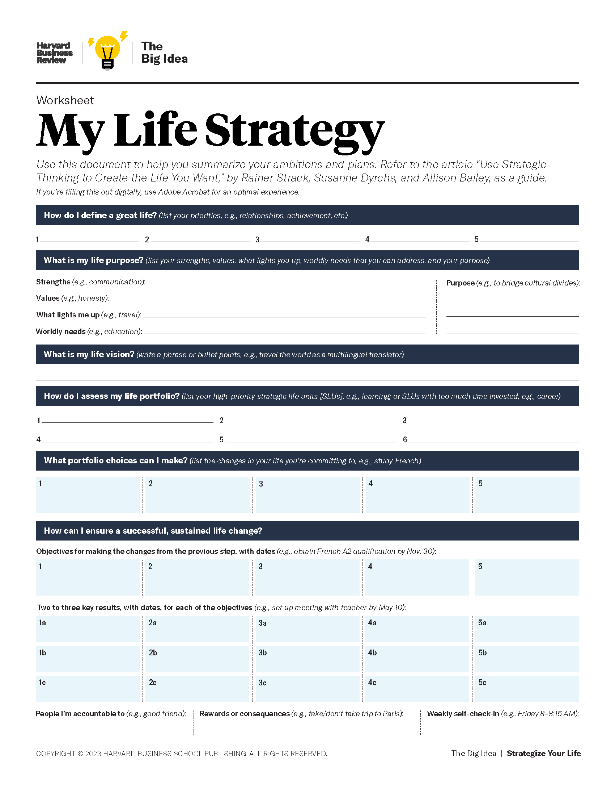

In times of crisis, many of us ponder existential questions about health, security, purpose, career, family, and legacy. However, more often than not, such contemplation is short-lived. The demands of everyday life — the here and now — can overwhelm us, leaving little time to think about the long term and what we are working toward. As a result, when faced with life decisions both big and small, we are left with nothing to guide us but emotion or intuition.  

在危机时刻，我们中的许多人都会思考有关健康、安全、目标、事业、家庭和遗产等生存问题。然而，这种思考往往是短暂的。日常生活的需求--此时此地--会压垮我们，让我们没有时间去思考长远的问题和我们努力的方向。因此，在面对人生的大小决定时，我们只能凭感觉或直觉做出决定。

The corporate equivalent, of course, is attempting to run a business without a strategy, which every HBR reader knows is a losing proposition. But as longtime consultants to organizations around the world, we wondered: Could we adapt the model for strategic thinking that we use with institutional clients to help individuals design better futures for themselves? The answer is yes, and the result is a program that we call Strategize Your Life. We’ve tested it with more than 500 people — including students, young professionals, middle-aged employees and managers, C-suite executives, board members, and retirees — to help them develop their individual life strategies.  

当然，与之相对应的是，企业试图在没有战略的情况下开展业务，《哈佛商业评论》的每一位读者都知道，这是一个失败的命题。但是，作为长期为世界各地的组织机构提供咨询的顾问，我们不禁要问：我们能否将我们为机构客户提供的战略思维模式加以调整，帮助个人设计更美好的未来？我们是否可以将我们为机构客户提供的战略思维模式加以调整，以帮助个人为自己设计更美好的未来？答案是肯定的，这就是我们称之为 "规划你的人生"（Strategize Your Life）的项目。我们已经对 500 多人进行了测试，包括学生、年轻专业人士、中年员工和经理、C 级高管、董事会成员和退休人员，帮助他们制定个人人生战略。

You can create a life strategy at any time, but it can feel especially appropriate at certain milestones — a school graduation, the start of your first job, a promotion, becoming an empty-nester, retiring — or after a major life event, such as a health scare, a divorce, the loss of a job, a midlife crisis, or the death of a loved one. When you have a strategy, you will be better able to navigate all those transitions and difficult moments, building resilience and finding more joy and fulfilment while minimizing stress. This article will help you get started.  

你可以在任何时候制定人生战略，但在某些里程碑式的时刻，比如学校毕业、开始第一份工作、升职、成为空巢老人、退休，或者在发生重大人生事件之后，比如健康受到惊吓、离婚、失业、中年危机或亲人去世，制定人生战略会显得尤为合适。当你有了一套策略，你就能更好地驾驭所有这些过渡和困难时刻，建立复原力，找到更多的快乐和成就感，同时将压力降到最低。本文将助您一臂之力。

## A Surprising Symmetry 令人惊讶的对称

Every corporate strategy project is different. But the hundreds that we’ve conducted for large organizations have had commonalities, including the use of certain methodologies and tools. We typically work through seven steps, each guided by a question:  

每个企业战略项目都不尽相同。但我们为大型组织开展的数百个项目都有共同之处，包括使用某些方法和工具。我们通常通过七个步骤开展工作，每个步骤都由一个问题引导：

1.  How does the organization define success?  
    
    组织如何定义成功？
2.  What is our purpose?  
    
    我们的目的是什么？
3.  What is our vision?  
    
    我们的愿景是什么？
4.  How do we assess our business portfolio?  
    
    如何评估我们的业务组合？
5.  What can we learn from benchmarks?  
    
    我们能从基准中学到什么？
6.  What portfolio choices can we make?  
    
    我们可以做出哪些投资组合选择？
7.  How can we ensure a successful, sustained change?  
    
    如何确保成功、持续的变革？

These steps can be easily adapted to an individual:  

这些步骤很容易根据个人情况进行调整：

1.  How do I define a great life?  
    
    如何定义精彩人生？
2.  What is my life purpose?  
    
    我的人生目标是什么？
3.  What is my life vision?  
    
    我的人生愿景是什么？
4.  How do I assess my life portfolio?  
    
    如何评估我的人生投资组合？
5.  What can I learn from benchmarks?  
    
    我能从基准中学到什么？
6.  What portfolio choices can I make?  
    
    我可以选择哪些投资组合？
7.  How can I ensure a successful, sustained life change?  
    
    如何确保成功、持续地改变生活？

As the former head of strategy for a U.S.\-based Fortune 50 company told us, “Knowing the right questions is much harder than having the answers.” Just as corporate strategy is an integrated set of choices that positions a company to win, _life strategy_ is an integrated set of choices _that positions a person to live a great life._ What’s more, we can apply tools from classic organizational strategy and other realms to help you find answers to the seven questions above and make better decisions.

Critics might say that you can’t transfer concepts from business to life. In the 1960s there were similar concerns about whether strategy ideas from the military and politics could apply to the corporate world. The management guru Peter Drucker even changed the title of his 1964 book from _Business Strategy_ to [_Managing for Results_](https://www.sciencedirect.com/book/9780434903900/managing-for-results) because everyone he and his publisher asked told them that strategy belonged to those realms, not to business. Yet we’ve also seen business-world principles employed to improve people’s self-management. For example, in their best-selling book [_Designing Your Life_](https://designingyour.life/the-book/)_,_ Stanford University’s Bill Burnett and Dave Evans modified the design thinking they used in software development to help individuals.  

批评者可能会说，你不可能把商业概念移植到生活中。20 世纪 60 年代，人们对军事和政治领域的战略理念能否应用于企业界也有类似的担忧。管理大师彼得-德鲁克（Peter Drucker）甚至将他 1964 年出版的《商业战略》一书的书名从《商业战略》改为《为结果而管理》，因为他和他的出版商询问过的所有人都告诉他们，战略属于这些领域，而不属于商业。然而，我们也看到商业世界的原则被用来改善人们的自我管理。例如，斯坦福大学的比尔-伯内特（Bill Burnett）和戴夫-埃文斯（Dave Evans）在他们的畅销书《设计你的人生》（Designing Your Life）中，将他们在软件开发中使用的设计思维进行了修改，以帮助个人。

Strategize Your Life is our attempt to do the same for strategic thinking in a concrete, step-by-step way. We believe it can lead you to new insights on how you define and find your great life. Our goal is to give your emotion and intuition an analytical partner.  

为你的人生制定战略》是我们以具体、循序渐进的方式为战略思维做同样尝试的一本书。我们相信，它能让你对如何定义和发现自己的精彩人生有新的认识。我们的目标是为你的情感和直觉提供一个分析伙伴。

In surveying our workshop and coaching session participants, we found that, in the past, only 21% had outlined what a great life means to them, 9% had identified their purpose, 12% had set a vision for their life, 17% had created concrete goals and milestones, and a paltry 3% had developed what could be called a life strategy. These are critically important issues that very few of us are spending enough time on.  

在对我们的工作坊和辅导课程参与者进行调查时，我们发现，过去只有 21% 的人概述了伟大人生对他们的意义，9% 的人明确了自己的目标，12% 的人设定了人生愿景，17% 的人制定了具体目标和里程碑，只有微不足道的 3% 的人制定了所谓的人生战略。这些都是极其重要的问题，但我们很少有人在这些问题上花费足够的时间。

As Martha, a 26-year-old graduate student, explained, “Life keeps taking shape… When all the Christmas parties and weddings and trips are suddenly over, you ask yourself, ‘Have I really lived or has life just happened to me?’” She was eager to be more proactive. “What better help is there than a high-level plan for life?” she asked. “Not to strictly follow it and forbid life to unfold, but to have a common thread. What should my story be? What should I have experienced so that in the end I can say to myself, ‘I have lived’?”  

正如 26 岁的研究生玛莎所解释的那样："生活不断成形......当所有的圣诞聚会、婚礼和旅行突然结束时，你会问自己，'我是真的活过了，还是生活只是发生在我身上？她渴望更加积极主动。"还有什么比一个高层次的人生计划更好的帮助呢？"她问道。"不是要严格遵守它，禁止生活展开，而是要有一条共同的主线。我的故事应该是什么？我应该经历过什么，这样最后我才能对自己说'我活过'？

Unlike most self-help books, we don’t present one golden path to happiness or life satisfaction. Because everyone is unique, we give you the tools to find your own path in a seven-step life strategy process. In step 1 you define what a great life means for you. In step 2 you outline your purpose; in step 3 your life vision. Step 4 is a portfolio analysis of how you spend your 168-hour week, while step 5 involves setting life satisfaction benchmarks. In step 6 you incorporate the results of the first five steps and determine your choices and potential changes in your life, and in step 7 you map out a plan for putting your choices into action. We recommend that you take notes throughout so that, by the end, you can put an initial version of your life strategy on a single page. (To help, we created a [life strategy worksheet](https://hbr.org/resources/pdfs/big-idea-supplements/2023/12/HBR_My_Life_Strategy_Worksheet.pdf), which should be filled out after you’ve gone through all the steps.)

This work may seem daunting, but in practice it should take you only a few hours. That said, it might not be easy. You will have to challenge yourself and go beyond the obvious. But you shouldn’t give up, because the answers you’ll discover are so worthwhile. After all, what’s more important than your life? Commit to thinking strategically about it, look forward to the insights you will gain, and enjoy the journey.  

这项工作看似艰巨，但实际上只需要几个小时。尽管如此，这项工作可能并不容易。您必须挑战自我，超越自我。但你不应该放弃，因为你会发现答案是如此值得。毕竟，还有什么比你的生命更重要呢？投入到战略思考中去，期待你将获得的启示，并享受这段旅程。

## The Seven Steps 七个步骤

The process begins with a simple yet profound question:  

这个过程始于一个简单而深刻的问题：

### 1\. How do I define a great life?  

1.如何定义精彩人生？

The starting point of any corporate strategy process is to define fundamental metrics for success. For instance, does the organization want its strategy to focus on driving sales, shareholder value, or positive societal impact?  

任何企业战略流程的起点都是确定成功的基本衡量标准。例如，企业希望其战略侧重于推动销售、股东价值还是积极的社会影响？

What are the right metrics in an individual’s life? Our social norms and hierarchies might suggest we measure ourselves with money, fame, and power. But [studies have shown](https://www.pnas.org/doi/10.1073/pnas.1011492107) that money leads to greater happiness only to the extent that our basic needs are met, after which its returns diminish or even plateau.个人生活中的正确衡量标准是什么？我们的社会规范和等级制度可能会建议我们用金钱、名誉和权力来衡量自己。但研究表明，只有在我们的基本需求得到满足的情况下，金钱才会带来更多的幸福感，而在满足基本需求之后，金钱的回报就会减少，甚至趋于平稳。 Other research shows many of us are on a “hedonic treadmill”: After we get a pay raise, are promoted, or purchase something that triggers a pleasurable high, we return to our original level of happiness.  

其他研究表明，我们很多人都在 "享乐主义跑步机 "上：当我们加薪、升职或购买了某样东西，引发愉悦的快感之后，我们又会回到原来的幸福水平。 And then there is social comparison — no matter what you achieve, someone will always be richer, more famous, or more powerful than you.  

还有社会比较--无论你取得了什么成就，总会有人比你更富有、更出名或更有权势。

The ancient Greeks saw two main dimensions of a great life: _hedonia_ (a focus on pleasure) and _eudaimonia_ (a focus on virtues and on meaning). More recently, scholars have pointed to the importance of social connection. A [study](https://www.researchgate.net/profile/Nai-Tey/publication/266658052_Determinants_of_life_satisfaction_in_Asia/links/543bcd4c0cf24a6ddb97a92e/Determinants-of-life-satisfaction-in-Asia.pdf) of more than 27,000 people in Asia found a strong correlation between being married and being satisfied with life, while a [study](https://news.harvard.edu/gazette/story/2017/04/over-nearly-80-years-harvard-study-has-been-showing-how-to-live-a-healthy-and-happy-life/) that has followed 268 Harvard College men from 1938 to the present, and was expanded to include their children and wives, as well as a study that has followed 456 residents of inner-city Boston since the 1970s, also expanded to include children and wives, found that meaningful relationships were the key driver of long-term happiness. The late Harvard Business School professor Clayton Christensen agreed: In his classic HBR article “[How Will You Measure Your Life?](https://hbr.org/2010/07/how-will-you-measure-your-life)” he wrote, “I’ve concluded that the metric by which God will assess my life isn’t dollars but the individual people whose lives I’ve touched.”  

古希腊人认为伟大的人生有两个主要方面："享乐"（hedonia）和 "幸福"（eudaimonia）（注重美德和意义）。最近，学者们指出了社会联系的重要性。一项对亚洲 27,000 多人进行的研究发现，已婚与对生活的满意度之间存在很强的相关性；一项对哈佛大学 268 名男生从 1938 年至今进行的跟踪研究发现，有意义的人际关系是长期幸福的主要驱动力，这项研究还扩大到了他们的子女和妻子；一项自 20 世纪 70 年代以来对波士顿市中心 456 名居民进行的跟踪研究也发现，有意义的人际关系是长期幸福的主要驱动力。哈佛商学院已故教授克莱顿-克里斯坦森对此表示赞同：他在《哈佛商业评论》的经典文章《你将如何衡量自己的人生？

A framework that includes all these factors — hedonic, eudemonic, and relational — is the PERMA model, introduced by Martin Seligman, the founder of positive psychology and a University of Pennsylvania professor, in his 2011 book, [_Flourish_](https://www.amazon.com/Flourish-Visionary-Understanding-Happiness-Well-being-ebook/dp/B0043RSK9O)_._ Other researchers later developed it into PERMA-V, which stands for Positive emotions (frequent feelings of pleasure and contentment), Engagement (being in the flow, losing track of time), Relationships (mutual feelings of caring, support, and love), Meaning (contributing to making the world a better place), Achievement (striving for success or mastery, reaching goals), and Vitality (being healthy and energetic).  

积极心理学创始人、宾夕法尼亚大学教授马丁-塞利格曼（Martin Seligman）在其2011年出版的《Flourish》一书中提出了一个包含所有这些因素（享乐型、享乐型和关系型）的框架，即PERMA模型。后来，其他研究人员将其发展为 PERMA-V，分别代表积极情绪（经常感到愉悦和满足）、参与（投入其中，忘却时间）、关系（相互关心、支持和爱的感觉）、意义（为让世界变得更美好做出贡献）、成就（追求成功或精通，实现目标）和活力（健康和充满活力）。

To determine what makes a great life for you, start with each element in PERMA-V, or even add your own categories, such as autonomy or spirituality. Then rate each one’s importance to you on a scale from 0 (not important) to 10 (very important). Try to recall periods of deep satisfaction in your past and consider what triggered them.  

要确定怎样的生活对你来说才是美好的，可以从 PERMA-V 中的每个元素开始，甚至添加你自己的类别，如自主性或灵性。然后用从 0（不重要）到 10（非常重要）的等级来评定每个要素对你的重要性。试着回忆一下你过去深感满意的时期，并思考是什么触发了这些时期。

In the first step of strategy projects, we conduct a comprehensive analysis of the status quo. So, you should also rate your current satisfaction with each dimension on a scale from 0 (not at all satisfied) to 10 (very satisfied). This quick assessment will give you a rough idea of how you define a great life and initial ideas about what you need to change.  

在战略项目的第一步，我们会对现状进行全面分析。因此，您还应该用 0（完全不满意）到 10（非常满意）的标准来评定您目前对每个维度的满意度。通过这一快速评估，您可以大致了解自己对美好生活的定义，并初步了解自己需要改变什么。

### 2\. What is my life purpose?  

2.我的人生目标是什么？

For a corporate strategy to be successful, it must be anchored to the organization’s purpose, which lies at the intersection of, What are we good at? and What does the world need?, and takes into account, What are our values? and What excites us? Using these questions, we’ve helped companies around the world develop purpose statements. A purpose statement serves as an important guardrail for your strategy and is a North Star for your organization.  

企业战略要想取得成功，就必须以组织的宗旨为基础，而组织的宗旨是 "我们擅长什么？"和 "世界需要什么？"的交汇点，并考虑到 "我们的价值观是什么？"和 "什么让我们感到兴奋？"。利用这些问题，我们帮助世界各地的公司制定了宗旨声明。宗旨声明是战略的重要护栏，也是组织的北极星。

The same questions can be used to find your life purpose. Ask yourself, What am I good at? Think about situations at work or in other areas of life in which you have demonstrated critical strengths such as creativity, teamwork, or communication. Then ask, What are my core values? Think about critical decisions you’ve made and principles you hold dear that have provided direction, such as honesty, fairness, or integrity. There are dozens of online [lists](https://jamesclear.com/core-values) and tests to help you consider your most important values. The next question is, Which activities light me up? Perhaps your answers include mentoring, problem-solving, or engaging with different types of people. Finally, ask, What need can I help address in the world?同样的问题也可以用来寻找你的人生目标。问问自己，我擅长什么？想一想你在工作或生活的其他领域表现出关键优势的情况，如创造力、团队合作或沟通。然后问：我的核心价值观是什么？想想你做过的关键决定，以及你所珍视的、为你指明方向的原则，如诚实、公平或正直。网上有几十种清单和测试，可以帮助你思考自己最重要的价值观。下一个问题是，哪些活动能让我兴奋？也许你的答案包括指导、解决问题或与不同类型的人打交道。最后，问一问：我能帮助解决世界上的什么需求？ It could be one of the 17 [Sustainable Development Goals](https://www.undp.org/sustainable-development-goals) of the United Nations, such as health, education, gender equality, or climate action, or it could be something much more general, such as love, kindness, trust, or security.  

它可以是联合国 17 个可持续发展目标之一，如健康、教育、性别平等或气候行动，也可以是更普遍的东西，如爱、善良、信任或安全。

In the purpose-defining stage of strategy projects, we conduct belief audits to get input from many stakeholders. Do the same. Ask friends or family members what your strengths are, what values you live by, what things excite you, and what need you might help fill.  

在战略项目的目的确定阶段，我们会进行信念审计，以获取众多利益相关者的意见。也可以这样做。问问朋友或家人你的优势是什么，你的价值观是什么，什么事情能让你感到兴奋，你可以帮助满足什么需求。

Draw from your own answers and theirs to draft a purpose statement, and then ask for feedback on it. Or you can engage ChatGPT in an interactive dance, using the answers to the four questions as input to help you develop your purpose statement, as Tom, a climate physicist, did in one of our recent workshops.  

根据自己和他们的回答起草一份宗旨声明，然后征求他们的反馈意见。或者，您也可以让 ChatGPT 参与互动舞蹈，将这四个问题的答案作为帮助您制定目的陈述的输入，就像气候物理学家汤姆在我们最近的一次研讨会上所做的那样。

When Joudi, a Kurdish refugee from Syria currently living in Germany, went through this exercise, he identified his core strengths as ambition, passion, and hunger for knowledge. His core values were justice, peace, family, and charity. He said he was most excited by innovation, neurosurgery, and entrepreneurship (notably his experiences selling accessories as a street vendor in Istanbul and founding a multilingual AI-powered integration support platform for Ukrainians who had fled their country for Germany). As for the world needs he wanted to address, Joudi cited health care, freedom, and equality. In the end, he wrote this purpose statement: “Remain medically passionate, willing to learn, entrepreneurial, and strong-willed to drive medical innovation and create equitable access to health care for people.”  

目前居住在德国的叙利亚库尔德难民朱迪（Joudi）在进行这项练习时，发现自己的核心优势是雄心、激情和对知识的渴望。他的核心价值观是正义、和平、家庭和慈善。他说他最感兴趣的是创新、神经外科和创业精神（尤其是他在伊斯坦布尔街头摆摊卖饰品的经历，以及为逃难到德国的乌克兰人创建多语言人工智能一体化支持平台的经历）。至于他想满足的世界需求，朱迪提到了医疗保健、自由和平等。最后，他写下了这样的宗旨声明："保持对医学的热情，乐于学习，富有创业精神，意志坚强，推动医学创新，为人们创造公平的医疗机会"。

A chief human resources officer at a global industrial company wanted to step down from her current role but was unsure whether she should look for a similar role in another company or do something completely different. She went through the seven steps and came up with a simple purpose statement, “To help and lead others to aspire,” through which she realized that she did want another senior HR role, just in a different company.  

一家全球性工业公司的首席人力资源官想从目前的职位上退下来，但她不确定是应该在另一家公司寻找类似的职位，还是做一些完全不同的事情。通过这七个步骤，她提出了一个简单的目的陈述："帮助和带领他人实现理想。"通过这个陈述，她意识到自己确实想再担任一个高级人力资源职位，只是在不同的公司。

There are [other methods](https://hbr.org/2014/05/from-purpose-to-impact) for defining one’s life purpose, of course. But it’s important to find the time and a way to do it. We’ve seen some workshop participants sharpen their existing purpose ideas, while others have had a real “aha” moment, finally understanding what they were meant to do. Purpose guides your life strategy.  

当然，确定人生目标还有其他方法。但重要的是要找到时间和方法来做这件事。我们看到，一些研修班学员进一步明确了自己现有的人生目标，而另一些学员则迎来了真正的 "啊哈 "时刻，终于明白了自己的使命所在。目标指导你的人生战略。

### 3\. What is my life vision?  

3.我的人生愿景是什么？

The next step in building a corporate strategy is to set out a vision for the future. We typically ask leadership teams where they want their organization to be — in terms of innovation, growth, product portfolio, market presence, etc. — in five to 10 years. Often we have them ask themselves questions like, What newspaper headline about our company would we like to read a decade from now?  

制定企业战略的下一步是设定未来愿景。我们通常会问领导团队，他们希望自己的企业在五到十年后的创新、增长、产品组合、市场占有率等方面达到什么样的水平。我们通常会让他们问自己这样的问题：我们希望在十年后的报纸上看到关于我们公司的什么标题？

Individuals should also strive to envision who they want to become in the years ahead. As the Stoic philosopher Seneca said, “If you do not know which port you are sailing to, no wind is favorable.” At the same time, you want to remain open to surprises and serendipity. Seneca commented on this as well: “Luck is what happens when preparation meets opportunity.”  

塞内卡对此也有评论："运气是准备工作遇到机遇时的结果"。 Strategizing your life is the preparation.  

个人也应努力展望未来几年自己想要成为什么样的人。正如斯多葛派哲学家塞内加所说："如果你不知道你要驶向哪个港口，就没有顺风"。与此同时，你要对惊喜和偶然保持开放的态度。制定人生战略就是准备工作。

So, ask yourself: What story would I like people to tell about me five to 10 years from now? What would I do if money wasn’t an issue? What will the 80-year-old me not want to have missed in life? Your purpose and your strengths might also trigger some ideas about your vision.  

所以，问问你自己：我希望人们在五到十年后如何评价我？如果钱不是问题，我会做什么？80 岁的我不想在生活中错过什么？你的目标和优势可能也会引发你对愿景的一些想法。

For this step we have used a photo-sorting exercise similar to what our corporate clients use in branding and innovation strategy projects. Out of 180 photos, workshop participants select two to four that best represent their personal and professional vision — what one person described as a “mood board.”  

在这一步骤中，我们使用了一种照片分类练习，类似于我们的企业客户在品牌和创新战略项目中使用的方法。研修班学员从 180 张照片中选出 2 到 4 张最能代表其个人和职业愿景的照片--有人称之为 "心情板"。

In both business and individual life strategy, a vision can give you focus. Jim, who will soon be a doctor, had a purpose statement that was rather general: “Bring people together and share passions.” His vision was more concrete and specific: “To create spaces for more social encounters, such as a medical practice with a shared coffee shop, and to get involved in homeless medicine.” Your vision should be equally descriptive.  

无论是在企业还是个人生活战略中，愿景都能让你专注。吉姆即将成为一名医生，他的目标陈述相当笼统："把人们聚集在一起，分享激情"。他的愿景则更加具体和明确："为更多的社会交往创造空间，比如开一家有共享咖啡厅的医疗诊所，并参与无家可归者的医疗工作"。你的愿景也应该同样具有描述性。

You might end up with a short list of bullet points or a one-sentence summary of your vision. No matter how you capture it, a vision statement can be powerful in guiding your life. An example we love comes from our colleague Sebastian when he was 14. After a poor math test result, his teacher told him, “Teaching you is a waste of time” and warned he’d never get a high school diploma. For the next couple of years Sebastian took that to heart, skipped school, and started working as a bricklayer. Eventually, however, he decided to make a change, and it began with this vision statement: “I will go to university and get a PhD and then go back to my math teacher — all in the next 10 years.” He did just that, graduating summa cum laude with a PhD in economics, and in another 10 years he was a managing director and a partner at BCG.  

最后，你可能会列出一个简短的要点清单，或者用一句话概括你的愿景。无论你如何捕捉，愿景声明都能有力地指导你的生活。我们喜欢的一个例子来自我们的同事塞巴斯蒂安 14 岁的时候。在一次数学考试成绩不理想后，他的老师对他说："教你是浪费时间"，并警告他永远拿不到高中毕业证。在接下来的几年里，塞巴斯蒂安把这句话牢记在心，逃了学，开始做砌砖工。然而，他最终还是决定做出改变，并以这样的愿景宣言开始："我要上大学，获得博士学位，然后回到我的数学老师身边--所有这一切都在未来 10 年内完成"。他做到了，以最优异的成绩获得了经济学博士学位，又过了 10 年，他成为了 BCG 的常务董事和合伙人。

### 4\. How do I assess my life portfolio?  

4.如何评估我的人生投资组合？

Companies typically use portfolio analysis to assess their business units on key parameters such as market growth or share and to decide where to invest capital. BCG is well-known for its [2×2 growth-share matrix](https://www.bcg.com/about/overview/our-history/growth-share-matrix).

But what is the equivalent of a business unit in life? We focus on six strategic life areas (SLAs): relationships; body, mind, and spirituality; community and society; job, learning, and finances; interests and entertainment; and personal care. We then subdivide the six SLAs into 16 strategic life units (SLUs). (For a full list of the SLUs, see the exhibit “The Key Areas of Life.”)  

但是，什么才是生命中的业务单元呢？我们关注六个战略性生活领域（SLA）：人际关系；身体、心灵和精神生活；社区和社会；工作、学习和财务；兴趣和娱乐；个人护理。然后，我们将这六个战略生活领域细分为 16 个战略生活单元（SLU）。(SLUs的完整列表，请参阅 "生活的关键领域 "展览）。

And what are the equivalents of capital expenditures in life?  

生活中的资本支出又相当于什么呢？ Time, energy, and money. A week has 168 hours. How do you spend them? With your significant other, with family, at work, playing sports, at church, getting a good night’s rest?  

时间、精力和金钱。一周有 168 个小时。你如何度过它们？和另一半在一起、和家人在一起、在工作、在运动、在教堂、在好好休息？

Look back at the past year, including holidays, and assess how much time you spent on each of the 16 SLUs in an average week. When an activity crosses categories, split the time between them. For example, if you went jogging with your significant other for one hour a week, allocate half an hour to the significant other SLU and half an hour to the physical health/sports SLU. Next, rate all 16 SLUs on a scale of 0 to 10 based on how important they are to you. Then rate the satisfaction you derive from each on the same scale. (This goes one level deeper than the similar PERMA-V exercise.)  

回顾过去的一年，包括节假日，评估一下您平均一周在 16 个 SLU 上各花费了多少时间。如果某项活动跨越了不同的类别，那么就把它们的时间分开。例如，如果您每周与另一半慢跑一小时，则将半小时分配给另一半 SLU，半小时分配给身体健康/运动 SLU。然后，根据所有 16 个 SLU 对您的重要程度，用 0 到 10 分给它们打分。然后，用相同的尺度评定您从每个 SLU 中获得的满意度。(这比类似的 PERMA-V 练习更深一层）。

Now sketch out your own 2×2; we call it the Strategic Life Portfolio. But instead of mapping growth against share, you will put the importance of each SLU on the y-axis and the satisfaction it brings on the x-axis. Plot each SLU with a bubble, making the size of the bubble roughly proportional to the percentage of time in a week you spend on it.  

现在，请勾勒出您自己的 2×2 图；我们称之为 "战略生活组合"。不过，你要把每个 SLU 的重要性放在 y 轴上，把它带来的满足感放在 x 轴上，而不是把增长与份额相对应。在每个 SLU 上画一个气泡，气泡的大小与您一周花在该 SLU 上的时间比例大致成正比。

In the top-left quadrant, you will find the SLUs of high importance and low satisfaction. These are areas of high urgency, because you care about these activities deeply but aren’t focusing on them enough to get the most out of them. The SLUs in the top-right quadrant also deserve some attention: You want to keep devoting significant time and energy to your most important and highest-satisfaction activities, and invest less in those that are less important (bottom left and right).  

在左上角的象限中，您会发现重要性高而满意度低的 SLU。这些都是紧迫性较高的领域，因为您非常关心这些活动，但却没有给予足够的重视，因此无法从中获得最大的收益。右上象限的 SLU 也值得关注：您要继续将大量时间和精力投入到最重要、满意度最高的活动中，减少对那些不太重要的活动的投入（左下和右下）。

Finally, look at your entire 2×2 and ask yourself: Does my current portfolio of SLUs put me on the right track to support my purpose and achieve my vision? Does it bring me closer to how I define a great life? Where can I save and reallocate my time? Just as in corporate strategy projects, you want to set some high-level priorities — rather than a detailed plan — for investments of your time, energy, and money.  

最后，看看你的整个 2×2 并问问自己：我目前的 SLU 组合是否能让我走上支持我的目标和实现我的愿景的正确轨道？它是否让我更接近我所定义的美好生活？我可以在哪些方面节省和重新分配时间？就像在企业战略项目中一样，您需要为您的时间、精力和金钱投资制定一些高层次的优先事项，而不是详细的计划。

When Toni, an engineer, completed this exercise, he saw four areas for urgent improvement in the top-left quadrant: significant other (since he didn’t have one), mental health/mindfulness, societal engagement, and education/learning. His job/career SLU was split between two quadrants, and he was spending too much time on online entertainment, which charted in the bottom-right quadrant. It became clear to Toni what he needed to change.  

当工程师托尼完成这项练习时，他在左上象限看到了四个亟待改进的领域：另一半（因为他没有）、心理健康/正念、社会参与和教育/学习。他的工作/职业 SLU 分居两个象限，他在网上娱乐上花费了太多时间，这在右下角的象限中有所体现。Toni 很清楚他需要改变什么。

### 5\. What can I learn from benchmarks?  

5.我能从基准中学到什么？

In almost every strategy project, we do a best practice and benchmarking analysis to understand what we can learn from leading companies. We can do the same for individuals by looking at role models and then, more importantly, at the research on life satisfaction.  

几乎在每个战略项目中，我们都会进行最佳实践和基准分析，以了解我们可以从领先企业中学到什么。对个人而言，我们也可以这样做，先看看榜样，更重要的是，再看看有关生活满意度的研究。

Ask yourself: Who conducts their personal and professional life in a way I admire? Maybe it is a coworker caring for his bedridden parent, the mother of three at your kids’ school who also manages payroll for a Fortune 500 company, or your religious leader who lives his purpose. Ask yourself what makes them admirable, and what choices they would make if they were in your shoes.  

扪心自问谁的个人和职业生活方式令我钦佩？也许是照顾卧病在床的父母的同事，也许是你孩子学校里同时为财富 500 强公司管理薪资的三个孩子的母亲，也许是你的宗教领袖，他们都有自己的生活目标。问问自己，是什么让他们令人钦佩，如果他们站在你的立场上，会做出怎样的选择。

Now consider what scientific studies tell us about life satisfaction — not anecdotally but across large populations.  

现在来看看科学研究是如何告诉我们生活满意度的--不是轶事，而是大量人群的生活满意度。 We already mentioned the Harvard and Asia studies. One of the largest studies worldwide on life satisfaction is the German Socio-Economic Panel [survey](https://www.amazon.de/Wann-sind-wirklich-zufrieden-%C3%9Cberraschende/dp/3328108076), which covered almost 100,000 people from 1984 to 2019, gathering more than 700,000 completed responses. It found that significant others, children, friends, sports, spirituality, community involvement, salaries, savings, and nutrition all contribute to life satisfaction. Not surprisingly, health problems have a very negative impact, and you can find an optimum amount of time to spend on leisure and sleep.  

我们已经提到了哈佛和亚洲的研究。全球最大的生活满意度研究之一是德国社会经济小组调查，该调查从 1984 年到 2019 年覆盖了近 10 万人，收集了超过 70 万份完整的答复。调查发现，重要他人、子女、朋友、运动、精神生活、社区参与、工资、储蓄和营养都有助于提高生活满意度。不足为奇的是，健康问题会产生非常负面的影响，您可以在休闲和睡眠方面找到最佳时间。

Other studies have found that proven life-enhancers include practicing [kindness](https://www.gallup.com/workplace/237020/five-essential-elements.aspx), mindfulness, [meditation](https://pubmed.ncbi.nlm.nih.gov/32369422/), and [gratefulness](http://www.forbes.com/sites/tracybrower/2021/04/25/gratitude-is-a-key-to-happiness-4-reasons-why/?sh=62a203b0347c); cultivating more [humor](https://time.com/6273110/humor-health-benefits-strategies/) and laughter; dedicating time to [learning](https://hbr.org/2017/02/lifelong-learning-is-good-for-your-health-your-wallet-and-your-social-life); and developing a [growth mindset](http://www.ted.com/talks/carol_dweck_the_power_of_believing_that_you_can_improve) (that is, believing your abilities and life can improve through effort and persistence).  

其他研究发现，行之有效的生命提升方法包括练习仁慈、正念、冥想和感恩；培养更多的幽默和笑声；将时间用于学习；以及培养成长心态（即相信自己的能力和生活可以通过努力和坚持得到改善）。

As you do this work, it’s important to understand and learn from what has worked for others, while also remembering that you can’t just copy and paste someone else’s approach. Your life strategy should be unique to you.  

在做这些工作时，重要的是要了解和学习别人的成功经验，同时也要记住，你不能只是复制和粘贴别人的方法。你的人生策略应该是独一无二的。

### 6\. What portfolio choices can I make?  

6.我能做出哪些投资组合选择？

Corporate strategy is about making choices between options: Should we keep our current portfolio, diversify, focus, acquire a company, or enter a new market? In life, the equivalent questions are: What happens if I continue to live my life the way I am now? What if I change my priorities? Equipped with your definition of a great life, your purpose, your vision, your SLU ratings, and your benchmarks, you are ready to find out.  

企业战略就是在各种选择之间做出抉择：我们是应该保持现有的投资组合、进行多元化、集中投资、收购一家公司，还是进入一个新的市场？在生活中，相应的问题是如果我继续按照现在的方式生活会怎样？如果我改变我的优先事项会怎样？有了你对伟大人生的定义、你的目标、你的愿景、你的 SLU 评级和你的基准，你就可以找出答案了。

Go back to the great-life exercise in step 1 and think about what you can do for your areas of dissatisfaction. Review your purpose and vision from steps 2 and 3 and brainstorm how you might realize them. Think about the SLUs that step 4’s portfolio exercise identified as needing more attention, and how you can improve satisfaction or reallocate time there. Then consider how the insights gleaned from step 5’s benchmarks can help you with all of the above. From this long list of potential changes and actions — small and large — select several that will best move you toward a great life, and commit to them.  

回到步骤 1 中的 "伟大人生 "练习，想想你可以在不满意的方面做些什么。回顾第 2 步和第 3 步中的目标和愿景，集思广益，想想如何实现它们。思考第 4 步的组合练习中确定需要更多关注的 SLU，以及如何提高满意度或重新分配时间。然后考虑从第 5 步的基准中获得的见解如何帮助您实现上述所有目标。从这一长串潜在的变化和行动（无论大小）中，选择几个最能让你迈向美好生活的，并致力于实现它们。

Now you need to be specific about what you want to change. Examples from our workshop attendees include reconnecting with three friends from school, visiting one’s grandpa every week, engaging in a weekly micro-adventure with one’s significant other, changing jobs, committing to a new sleep schedule, trying a meditation app, starting a gratitude journal, spending more time with one’s kids, exercising every day, supporting refugees, starting a social business, practicing religion again, dedicating 15 minutes to learning every day, switching college majors, converting a van into a camper to travel, and moving abroad. The possibilities are endless.  

现在，你需要具体说明你想要改变什么。工作坊参加者举出的例子包括：与三个同学重新建立联系、每周去看望爷爷、每周与另一半进行一次微旅行、换工作、坚持新的睡眠计划、尝试冥想应用程序、开始写感恩日记、花更多时间陪伴孩子、每天锻炼身体、支持难民、创办社会企业、重新信奉宗教、每天花 15 分钟学习、转换大学专业、将面包车改装成露营车去旅行，以及移居国外。可能性是无穷无尽的。

On the other hand, you have only 168 hours each week, which means you must reduce, outsource, or bundle existing activities, or make them more efficient through productivity strategies and tools. For example, when you work out with your boyfriend or volunteer for a good cause with your friends, you are bundling sports and significant other or societal engagement and friendship. Life strategy is about setting priorities; it is not about filling every waking minute. Remember to reserve space in your calendar for downtime as well. Researchers at the University of Pennsylvania’s Wharton School and UCLA’s Anderson School of Management [found that](https://www.apa.org/pubs/journals/releases/psp-pspp0000391.pdf) people are happiest when they have two to five hours of free time each day.  

另一方面，你每周只有 168 个小时，这意味着你必须减少、外包或捆绑现有的活动，或者通过提高生产率的策略和工具提高活动的效率。例如，当你和男朋友一起健身，或和朋友一起为公益事业做志愿者时，你就是在把运动和另一半、社会参与和友谊捆绑在一起。生活策略是要确定优先事项，而不是要填满每一分钟。请记住，在您的日程表中也要为闲暇时间预留空间。宾夕法尼亚大学沃顿商学院和加州大学洛杉矶分校安德森管理学院的研究人员发现，当人们每天有 2 到 5 个小时的空闲时间时，他们是最快乐的。

When Judi, a workshop attendee, finished making her list of actions, she commented, “If I change all this, I will be a different person in a few weeks.” Your life strategy could involve big steps like starting a business, traveling the world (as one of us did), or setting up an NGO, or it could involve a small step like meeting for coffee every week with people you care about. Even a small change can have a big impact in two key ways.当研修班学员朱迪列完她的行动清单时，她评论说："如果我改变了这一切，几周后我就会变成另外一个人。你的人生战略可以是创业、环游世界（就像我们中的一位所做的）或成立一个非政府组织这样的大步骤，也可以是每周与你关心的人一起喝咖啡这样的小步骤。即使是很小的改变，也会在两个关键方面产生很大的影响。 First, if you do it over and over again, you take advantage of the compound growth rate.  

首先，如果你反复这样做，就能利用复合增长率的优势。 Second, you are a node in a network of people, so your change not only affects those close to you but also ripples outward.其次，你是人际网络中的一个节点，因此你的改变不仅会影响你身边的人，还会向外扩散。 After all, sometimes big changes are triggered by small, seemingly insignificant actions — the famous butterfly effect.  

毕竟，有时看似微不足道的小动作会引发大变化，这就是著名的蝴蝶效应。 For example, research [has shown](http://www.health.harvard.edu/heart-health/exercise-15-minutes-a-day-ups-lifespan-by-3-years) that doing just 15 minutes of physical activity a day increases life expectancy by three years (despite amounting to only about half a year of time investment).  

例如，研究表明，每天只需进行 15 分钟的体育锻炼，预期寿命就会延长 3 年（尽管只相当于投入大约半年的时间）。 Exercise also gives you a dopamine boost, improving your mood, which benefits those around you and makes you more productive at work, potentially leading to new outputs that greatly impact the lives of others.  

运动还能促进多巴胺分泌，改善情绪，从而使周围的人受益，提高工作效率，并有可能带来新的产出，对他人的生活产生重大影响。

The Big Idea  大创意

A special series on the most pressing topics facing business today.  

关于当今企业面临的最紧迫话题的特别系列。

If you know which strategic life unit needs work but don’t know what changes to make, dig deeper and develop a substrategy for that unit — a job/career strategy, a family strategy, a mental health/mindfulness strategy, and so on — just as each business unit does with the overarching corporate strategy.  

如果你知道哪个战略生活单元需要改进，但又不知道该做出哪些改变，那么可以深入挖掘，为该单元制定子战略--工作/职业生涯战略、家庭战略、心理健康/正念战略等等--就像每个业务单元对企业总体战略所做的那样。

For example, to develop a job/career strategy, ask yourself the following questions: How does my current job support my purpose and vision? Does my current job give me a sense of achievement and engagement (two of the six great-life dimensions)? How does my current job align with the strengths I identified in the purpose step? Finally, look for benchmarking data, such as BCG’s [Decoding Global Ways of Working study](https://www.bcg.com/publications/2021/advantages-of-remote-work-flexibility), where we list the top 10 criteria of great jobs according to more than 200,000 respondents. Again, rate how your job measures up to these criteria. The answers to these questions will give you an idea of how to move forward in your career.  

例如，在制定工作/职业战略时，请自问以下问题：我目前的工作如何支持我的目标和愿景？我目前的工作是否能给我带来成就感和参与感（人生六大维度中的两个）？我目前的工作如何与我在 "目标 "步骤中确定的优势保持一致？最后，寻找基准数据，例如BCG的《解码全球工作方式》研究，我们根据20多万名受访者的数据列出了优秀工作的十大标准。同样，请根据这些标准对您的工作进行评分。这些问题的答案将为您的职业发展提供思路。

### 7\. How can I ensure a successful, sustained life change?  

7.如何确保成功、持续地改变生活？

Change is not easy. Need proof? More than 40% of Americans set New Year’s resolutions each January, and [reports](https://www.forbes.com/sites/dandiamond/2013/01/01/just-8-of-people-achieve-their-new-years-resolutions-heres-how-they-did-it/?sh=526f57d2596b) indicate that more than 90% fail to follow through on them.  

变革并非易事。需要证据吗？每年一月份，40% 以上的美国人都会制定新年计划，但有报告显示，90% 以上的人都未能将其付诸实施。

Many companies, such as Google, ensure successful implementation of the strategies they’ve outlined by using OKRs (objectives and key results).许多公司，如谷歌，通过使用 OKRs（目标和关键结果）来确保成功实施他们制定的战略。 OKRs are focused, ambitious, output-oriented, flexible, measurable, and transparent.  

OKRs 重点突出、目标远大、以产出为导向、灵活、可衡量且透明。

We recommend doing the same for each of the changes you committed to in step 6. Define the broad objective and the date by which you want to achieve it. Then break down each of those objectives into a few key results or action items, again with deadlines. Consider adding them directly to your calendar. If you are unsure about implementing a big move in your life, experiment. For example, Toni identified mental health/mindfulness as a high priority, so he might set an objective of “Download an app and try meditation techniques for 10–15 minutes a day (finish by the end of November).” He could then break it down into two key results: (1) review meditation apps and get started (first week of November), and (2) try an app for three weeks, review the experience, and make it a daily habit (last three weeks of November).  

我们建议对你在第 6 步中承诺的每项改变都采取同样的做法。确定总体目标和实现目标的日期。然后将每个目标细分为几个关键成果或行动项目，并再次注明截止日期。考虑将它们直接添加到日历中。如果你不确定是否要在生活中实施一项重大举措，可以进行尝试。例如，托尼认为心理健康/正念是重中之重，因此他可以设定一个目标："下载一个应用程序，每天尝试 10-15 分钟的冥想技巧（11 月底前完成）"。然后，他可以将其分解为两个关键结果：（1）查看冥想应用程序并开始使用（11 月的第一周）；（2）试用应用程序三周，回顾体验，并将其作为日常习惯（11 月的最后三周）。

There are many ways that companies hold themselves to OKRs.  

公司有很多方法来实现 OKR。 Here, we focus on three of them. _Anchoring_ means sharing your plan, as Google does by making its OKRs public. Who will you tell about your plan or ask to join you on your journey? Strategy projects always involve small teams, so consider not only seeking input from others but also inviting one or two people to work on their own life strategies and then workshop everyone’s results as a group. _Consequences_ means setting up incentives for achievement, such as bonuses for success or penalties for failure. How will you reward yourself when you’ve successfully changed an aspect of your life, and what will the consequences be if you don’t? And _check-ins_ means routinely stepping back, refining and adjusting your efforts, and celebrating your achievements, as agile project development teams do. When each week can you spend 15 minutes to review and update your life strategy?  

在此，我们重点介绍其中的三种。锚定意味着分享你的计划，就像谷歌通过公开 OKRs 所做的那样。你会告诉谁你的计划，或者邀请谁加入你的旅程？战略项目总是涉及到小团队，因此不仅要考虑征求他人的意见，还要邀请一两个人制定自己的人生战略，然后将每个人的成果作为一个小组进行研讨。后果是指为取得成就制定激励措施，比如成功奖励或失败惩罚。当你成功改变了生活的某个方面时，你将如何奖励自己？而 "签到 "则意味着像敏捷项目开发团队那样，经常性地后退一步，完善和调整自己的努力，并庆祝自己的成就。每周什么时候可以花 15 分钟回顾和更新你的人生战略？

Toni, for example, might tell a friend to hold him to his changes, promise to donate a significant amount of money to a charitable cause if he doesn’t stick to them, and schedule a weekly check-in with himself every Sunday before his study session.  

例如，托尼可能会告诉朋友让他坚持自己的改变，承诺如果他不坚持，就捐一大笔钱给慈善机构，并在每周日的自习课前安排一次自我检查。

## Your One-Page Life Strategy  

你的单页人生战略

Often, the seeming enormity of an important task — like life strategy development — is what stops us from doing it. So, to make what seems impossible possible, we recommend recording your entire life strategy on a single sheet of paper or in a single location. If you have finished the exercises in this article, you can easily [do this](https://hbr.org/resources/pdfs/big-idea-supplements/2023/12/HBR_My_Life_Strategy_Worksheet.pdf). To start, write down what defines a great life for you. Next, record your strengths, your values, what lights you up, and what the world needs, and then add your purpose statement that incorporates those ideas. Third, summarize your life vision. Fourth, refer to that 2×2 you sketched and note the SLUs that are high priorities for action or that you spend too much time on. Next, write down the changes you’d like to make and commit to. Finally, for each of those changes, list an objective and two to three key results with deadlines, and then note the anchors, the consequences, and the check-in plan to make the change stick.  

通常，一项重要任务--比如制定人生战略--的艰巨性往往会阻止我们去完成它。因此，为了将看似不可能的事情变为可能，我们建议将你的整个人生战略记录在一张纸上或一个地方。如果你已经完成了本文的练习，就可以轻松做到这一点。首先，写下什么定义了你的美好生活。其次，记录下你的优势、价值观、点亮你的东西以及世界需要什么，然后加上你的目的陈述，将这些想法融入其中。第三，总结你的人生愿景。第四，参考你绘制的 2×2 草图，记下需要优先采取行动的 SLU，或者你在上面花费太多时间的 SLU。接下来，写下你想要做出并承诺的改变。最后，针对每项改变，列出一个目标和两到三个关键结果，并注明最后期限，然后记下锚点、后果和检查计划，以便让改变坚持下去。

This page is your first minimum viable life strategy. As with corporate strategy, it needs to be reviewed, adjusted, and updated on a regular basis. Proprietary data from BCG suggests that 50% of companies review their strategy once a year, and 20% more than once a year — what we call always-on strategy development. Likewise, in addition to your weekly 15-minute check-in, we recommend scheduling a longer, one- to two-hour review session with yourself, or with the life strategy group you started with other people, every six to 12 months. Review all seven steps, consider setbacks or shifting circumstances, and adjust accordingly.  

本页是您的第一个最低可行生命战略。与企业战略一样，它需要定期审核、调整和更新。BCG 的专有数据表明，50% 的公司每年审查一次战略，20% 的公司每年审查一次以上，这就是我们所说的 "永远在线的战略发展"。同样，除了每周 15 分钟的 "签到 "外，我们还建议每 6 到 12 个月安排一次时间较长、一到两小时的回顾会，与自己或与其他人一起成立的人生战略小组一起进行。回顾所有七个步骤，考虑挫折或环境变化，并做出相应调整。

The chief human resources officer we mentioned earlier puts her one-pager on top of all the papers on her desk. She looks at it every day to reinforce her belief in what makes a great life and to ensure she executes on her strategy for achieving it; when she has an idea for refinement, she writes it down. You can try that, too. A couple we worked with, who wanted to develop life strategies in tandem, went so far as to document their life purposes and goals with photos and notes in a picture frame. They hung it on the wall of their home, a daily reminder of where they want to go both together and as individuals.  

我们之前提到的那位首席人力资源官把她的单页纸放在办公桌上所有文件的最上面。她每天都会看一看，以加强她对伟大人生的信念，并确保她执行实现伟大人生的战略；当她有一个需要完善的想法时，她就会把它写下来。你也可以试试。我们曾合作过的一对夫妇，希望同时制定人生战略，他们甚至用相框里的照片和笔记来记录他们的人生目的和目标。他们把相框挂在家里的墙上，每天提醒自己，无论是作为夫妻还是作为个人，他们都想去哪里。

Life is full of adventure and trauma, love and sadness, joy and stress. It can be great or terrible. There will be ups and downs. But a lot of it depends on you and the choices you make. A life strategy will not only guide you but also build your resilience so that you’re better able to recover from missteps.  

生活充满冒险和创伤、爱和悲伤、欢乐和压力。它可能是伟大的，也可能是可怕的。有起有落。但很多时候取决于你和你做出的选择。人生策略不仅能为你提供指导，还能增强你的抗压能力，让你能更好地从失误中恢复过来。

Sophia, a doctor who suffered from a serious chronic illness, wrote to us after attending a workshop: “I realized I want to make more decisions, do really crazy things, enjoy small and big moments, celebrate successes, go to places I’ve never been, meet people I’ve never seen before, take breaks in between, follow my flow, and make myself my most important project in life!”  

索菲亚是一名患有严重慢性疾病的医生，她在参加完一次研讨会后给我们写了一封信："我意识到我要做更多的决定，做真正疯狂的事情，享受大大小小的时刻，庆祝成功，去我从未去过的地方，结识我从未见过的人，在中间休息一下，跟随我的潮流，把我自己当作生命中最重要的项目！"

Now, go and do the same. Your life is your top strategic priority.  

现在，去做同样的事情吧。你的生活就是你的首要战略任务。
